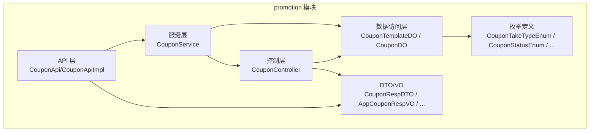
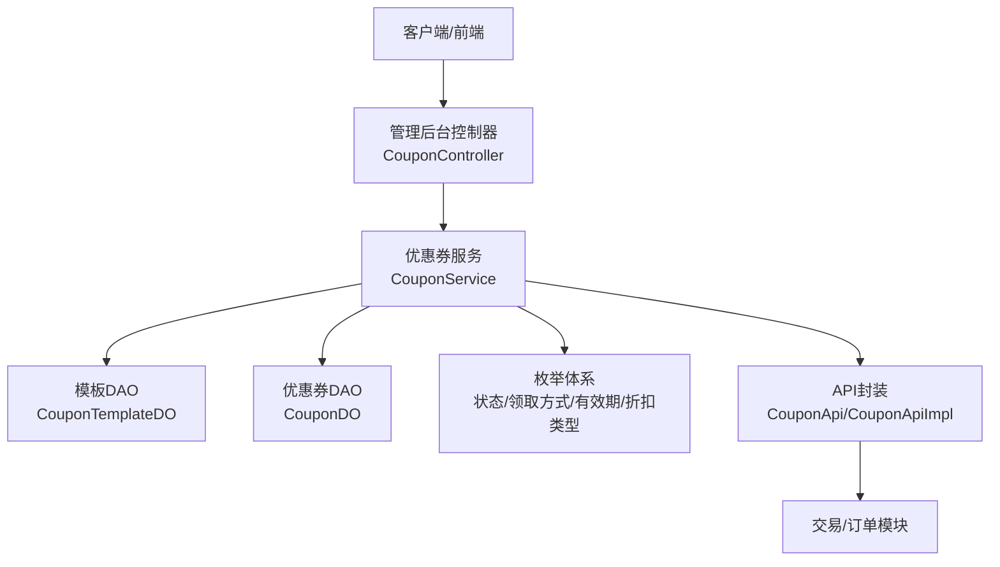
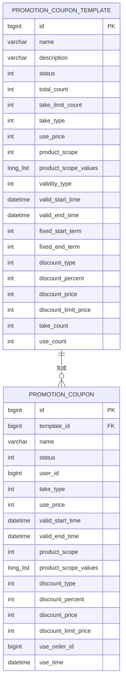
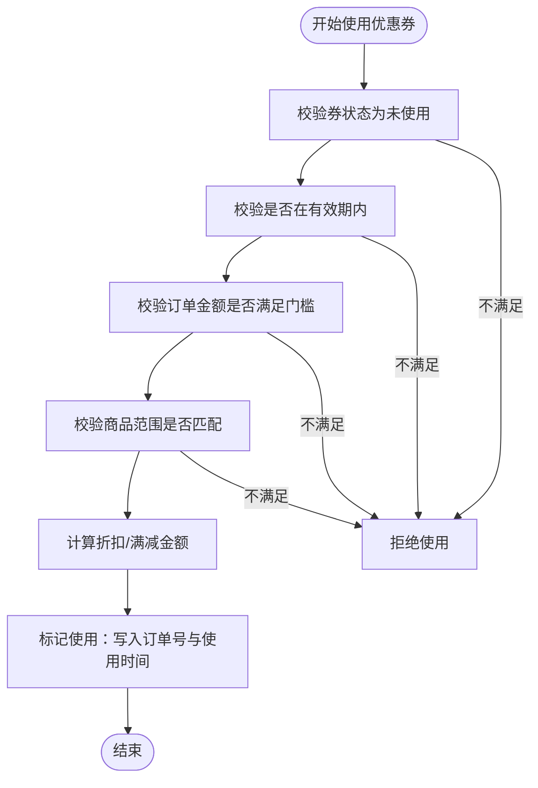
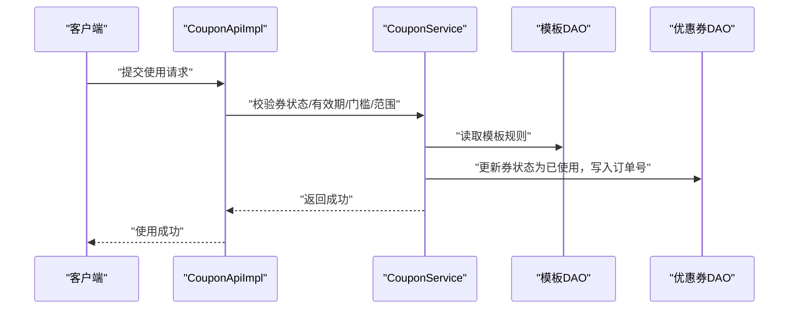
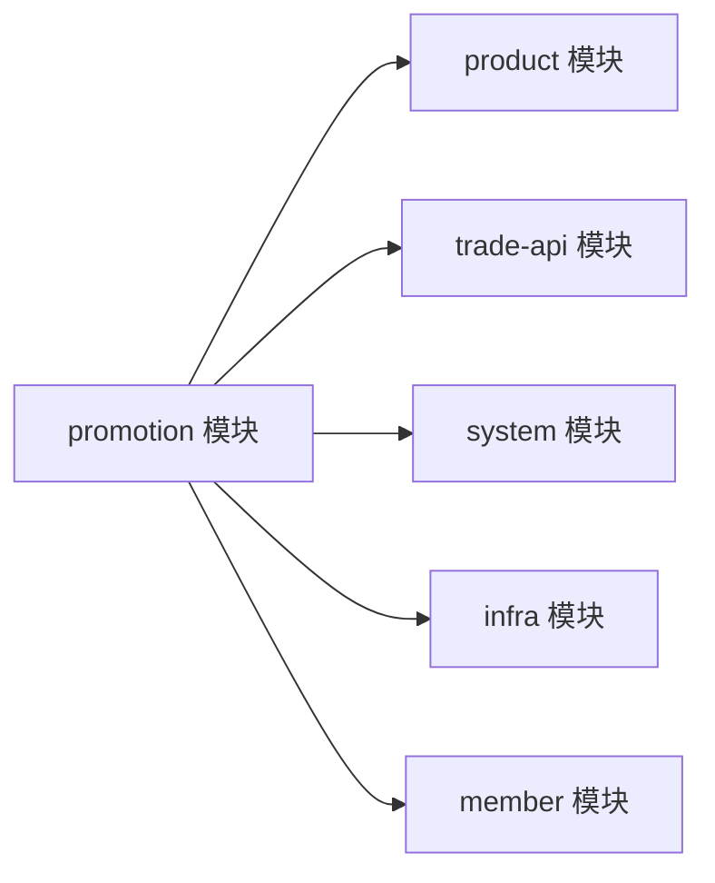

# 优惠券管理

<cite>
**本文引用的文件**
- [CouponTemplateDO.java](file://qiji-module-mall/qiji-module-promotion/src/main/java/com.qiji.cps/module/promotion/dal/dataobject/coupon/CouponTemplateDO.java)
- [CouponDO.java](file://qiji-module-mall/qiji-module-promotion/src/main/java/com.qiji.cps/module/promotion/dal/dataobject/coupon/CouponDO.java)
- [CouponService.java](file://qiji-module-mall/qiji-module-promotion/src/main/java/com.qiji.cps/module/promotion/service/coupon/CouponService.java)
- [CouponController.java](file://qiji-module-mall/qiji-module-promotion/src/main/java/com.qiji.cps/module/promotion/controller/admin/coupon/CouponController.java)
- [CouponTakeTypeEnum.java](file://qiji-module-mall/qiji-module-promotion/src/main/java/com.qiji.cps/module/promotion/enums/coupon/CouponTakeTypeEnum.java)
- [CouponStatusEnum.java](file://qiji-module-mall/qiji-module-promotion/src/main/java/com.qiji.cps/module/promotion/enums/coupon/CouponStatusEnum.java)
- [CouponTemplateValidityTypeEnum.java](file://qiji-module-mall/qiji-module-promotion/src/main/java/com.qiji.cps/module/promotion/enums/coupon/CouponTemplateValidityTypeEnum.java)
- [PromotionDiscountTypeEnum.java](file://qiji-module-mall/qiji-module-promotion/src/main/java/com.qiji.cps/module/promotion/enums/common/PromotionDiscountTypeEnum.java)
- [CouponApi.java](file://qiji-module-mall/qiji-module-promotion/src/main/java/com.qiji.cps/module/promotion/api/coupon/CouponApi.java)
- [CouponApiImpl.java](file://qiji-module-mall/qiji-module-promotion/src/main/java/com.qiji.cps/module/promotion/api/coupon/CouponApiImpl.java)
- [CouponRespDTO.java](file://qiji-module-mall/qiji-module-promotion/src/main/java/com.qiji.cps/module/promotion/api/coupon/dto/CouponRespDTO.java)
- [CouponUseReqDTO.java](file://qiji-module-mall/qiji-module-promotion/src/main/java/com.qiji.cps/module/promotion/api/coupon/dto/CouponUseReqDTO.java)
- [AppCouponRespVO.java](file://qiji-module-mall/qiji-module-promotion/src/main/java/com.qiji.cps/module/promotion/controller/app/coupon/vo/coupon/AppCouponRespVO.java)
- [AppCouponTakeReqVO.java](file://qiji-module-mall/qiji-module-promotion/src/main/java/com.qiji.cps/module/promotion/controller/app/coupon/vo/coupon/AppCouponTakeReqVO.java)
- [ErrorCodeConstants.java](file://qiji-module-mall/qiji-module-promotion/src/main/java/com.qiji.cps/module/promotion/enums/ErrorCodeConstants.java)
- [create_tables.sql](file://qiji-module-mall/qiji-module-promotion/src/test/resources/sql/create_tables.sql)
- [pom.xml](file://qiji-module-mall/qiji-module-promotion/pom.xml)
</cite>

## 目录
1. [简介](#简介)
2. [项目结构](#项目结构)
3. [核心组件](#核心组件)
4. [架构总览](#架构总览)
5. [详细组件分析](#详细组件分析)
6. [依赖关系分析](#依赖关系分析)
7. [性能考虑](#性能考虑)
8. [故障排查指南](#故障排查指南)
9. [结论](#结论)
10. [附录](#附录)

## 简介
本技术文档围绕优惠券管理功能展开，覆盖从数据模型到业务规则、从接口设计到统计分析的完整链路。系统支持多种优惠券类型（满减、折扣、免邮、现金等），提供模板化配置、灵活的发放策略（主动领取、定向发放、注册赠送）、严格的使用校验与风控、以及完善的统计分析能力。本文将帮助读者快速理解并高效扩展该功能。

## 项目结构
优惠券相关代码集中在 mall 模块下的 promotion 子模块中，采用“接口 + 实现 + 控制器 + 数据对象 + 枚举 + API”的分层组织方式，便于维护与扩展。

图表来源
- [CouponApi.java:1-200](file://qiji-module-mall/qiji-module-promotion/src/main/java/com.qiji.cps/module/promotion/api/coupon/CouponApi.java#L1-L200)
- [CouponApiImpl.java:1-200](file://qiji-module-mall/qiji-module-promotion/src/main/java/com.qiji.cps/module/promotion/api/coupon/CouponApiImpl.java#L1-L200)
- [CouponService.java:1-172](file://qiji-module-mall/qiji-module-promotion/src/main/java/com.qiji.cps/module/promotion/service/coupon/CouponService.java#L1-L172)
- [CouponController.java:1-75](file://qiji-module-mall/qiji-module-promotion/src/main/java/com.qiji.cps/module/promotion/controller/admin/coupon/CouponController.java#L1-L75)
- [CouponTemplateDO.java:1-180](file://qiji-module-mall/qiji-module-promotion/src/main/java/com.qiji.cps/module/promotion/dal/dataobject/coupon/CouponTemplateDO.java#L1-L180)
- [CouponDO.java:1-144](file://qiji-module-mall/qiji-module-promotion/src/main/java/com.qiji.cps/module/promotion/dal/dataobject/coupon/CouponDO.java#L1-L144)

章节来源
- [pom.xml:1-84](file://qiji-module-mall/qiji-module-promotion/pom.xml#L1-L84)

## 核心组件
- 数据模型
  - 优惠券模板：定义优惠券的通用规则与效果，如发放总量、每人限领、使用门槛、有效期类型、折扣类型与幅度等。
  - 优惠券实例：用户领取后生成的实例，包含状态、生效时间、适用范围、使用效果等字段，并记录使用订单与时间。
- 服务接口
  - 提供使用、退还、回收、领取、过期处理、分页查询、统计等能力。
- 控制器
  - 管理后台提供回收、分页查询、定向发放等操作；App 层提供领取、分页查询等。
- 枚举体系
  - 领取方式、状态、有效期类型、折扣类型等统一管理，保证业务一致性。
- API 层
  - 对外暴露优惠券使用与查询能力，供其他模块调用。

章节来源
- [CouponTemplateDO.java:1-180](file://qiji-module-mall/qiji-module-promotion/src/main/java/com.qiji.cps/module/promotion/dal/dataobject/coupon/CouponTemplateDO.java#L1-L180)
- [CouponDO.java:1-144](file://qiji-module-mall/qiji-module-promotion/src/main/java/com.qiji.cps/module/promotion/dal/dataobject/coupon/CouponDO.java#L1-L144)
- [CouponService.java:1-172](file://qiji-module-mall/qiji-module-promotion/src/main/java/com.qiji.cps/module/promotion/service/coupon/CouponService.java#L1-L172)
- [CouponController.java:1-75](file://qiji-module-mall/qiji-module-promotion/src/main/java/com.qiji.cps/module/promotion/controller/admin/coupon/CouponController.java#L1-L75)
- [CouponTakeTypeEnum.java:1-45](file://qiji-module-mall/qiji-module-promotion/src/main/java/com.qiji.cps/module/promotion/enums/coupon/CouponTakeTypeEnum.java#L1-L45)
- [CouponStatusEnum.java:1-39](file://qiji-module-mall/qiji-module-promotion/src/main/java/com.qiji.cps/module/promotion/enums/coupon/CouponStatusEnum.java#L1-L39)
- [CouponTemplateValidityTypeEnum.java:1-39](file://qiji-module-mall/qiji-module-promotion/src/main/java/com.qiji.cps/module/promotion/enums/coupon/CouponTemplateValidityTypeEnum.java#L1-L39)
- [PromotionDiscountTypeEnum.java:1-38](file://qiji-module-mall/qiji-module-promotion/src/main/java/com.qiji.cps/module/promotion/enums/common/PromotionDiscountTypeEnum.java#L1-L38)

## 架构总览
优惠券系统遵循清晰的分层架构：API 层负责对外能力封装；服务层承载业务规则与流程编排；DAO 层负责持久化；控制器负责请求接入与结果返回；枚举与 DTO/VO 提升可读性与一致性。

图表来源
- [CouponController.java:1-75](file://qiji-module-mall/qiji-module-promotion/src/main/java/com.qiji.cps/module/promotion/controller/admin/coupon/CouponController.java#L1-L75)
- [CouponService.java:1-172](file://qiji-module-mall/qiji-module-promotion/src/main/java/com.qiji.cps/module/promotion/service/coupon/CouponService.java#L1-L172)
- [CouponTemplateDO.java:1-180](file://qiji-module-mall/qiji-module-promotion/src/main/java/com.qiji.cps/module/promotion/dal/dataobject/coupon/CouponTemplateDO.java#L1-L180)
- [CouponDO.java:1-144](file://qiji-module-mall/qiji-module-promotion/src/main/java/com.qiji.cps/module/promotion/dal/dataobject/coupon/CouponDO.java#L1-L144)
- [CouponApi.java:1-200](file://qiji-module-mall/qiji-module-promotion/src/main/java/com.qiji.cps/module/promotion/api/coupon/CouponApi.java#L1-L200)
- [CouponApiImpl.java:1-200](file://qiji-module-mall/qiji-module-promotion/src/main/java/com.qiji.cps/module/promotion/api/coupon/CouponApiImpl.java#L1-L200)

## 详细组件分析

### 数据模型设计
- 优惠券模板（CouponTemplateDO）
  - 关键属性：名称、描述、状态；发放总量、每人限领；领取方式；使用门槛（满减金额）、适用范围（品类/SPU）、有效期类型（固定日期/领取之后）、折扣类型与幅度、折扣上限；统计字段（领取次数、使用次数）。
  - 设计要点：通过冗余字段减少关联查询；使用列表类型存储适用范围编号，便于范围匹配。
- 优惠券实例（CouponDO）
  - 关键属性：模板编号、名称、状态；用户编号、领取方式；生效起止时间、适用范围；折扣类型与幅度、折扣上限；使用订单号与使用时间。
  - 设计要点：状态机明确（未使用、已使用、已过期）；与模板解耦，支持动态调整模板不影响已发券。

图表来源
- [CouponTemplateDO.java:1-180](file://qiji-module-mall/qiji-module-promotion/src/main/java/com.qiji.cps/module/promotion/dal/dataobject/coupon/CouponTemplateDO.java#L1-L180)
- [CouponDO.java:1-144](file://qiji-module-mall/qiji-module-promotion/src/main/java/com.qiji.cps/module/promotion/dal/dataobject/coupon/CouponDO.java#L1-L144)
- [create_tables.sql:27-57](file://qiji-module-mall/qiji-module-promotion/src/test/resources/sql/create_tables.sql#L27-L57)

章节来源
- [CouponTemplateDO.java:1-180](file://qiji-module-mall/qiji-module-promotion/src/main/java/com.qiji.cps/module/promotion/dal/dataobject/coupon/CouponTemplateDO.java#L1-L180)
- [CouponDO.java:1-144](file://qiji-module-mall/qiji-module-promotion/src/main/java/com.qiji.cps/module/promotion/dal/dataobject/coupon/CouponDO.java#L1-L144)
- [create_tables.sql:27-57](file://qiji-module-mall/qiji-module-promotion/src/test/resources/sql/create_tables.sql#L27-L57)

### 业务规则引擎
- 使用条件验证
  - 订单金额需满足使用门槛；券状态必须为“未使用”；在有效期内；适用范围匹配。
- 折扣计算
  - 支持满减与折扣两种类型；折扣场景可设置上限，防止过度让利。
- 领取与发放
  - 支持用户主动领取、后台定向发放、注册赠送；受模板“每人限领”与“发放总量”约束。
- 过期处理
  - 定时任务扫描过期券，更新状态为“已过期”。

图表来源
- [CouponService.java:1-172](file://qiji-module-mall/qiji-module-promotion/src/main/java/com.qiji.cps/module/promotion/service/coupon/CouponService.java#L1-L172)
- [CouponDO.java:1-144](file://qiji-module-mall/qiji-module-promotion/src/main/java/com.qiji.cps/module/promotion/dal/dataobject/coupon/CouponDO.java#L1-L144)
- [CouponTemplateDO.java:1-180](file://qiji-module-mall/qiji-module-promotion/src/main/java/com.qiji.cps/module/promotion/dal/dataobject/coupon/CouponTemplateDO.java#L1-L180)

章节来源
- [CouponService.java:1-172](file://qiji-module-mall/qiji-module-promotion/src/main/java/com.qiji.cps/module/promotion/service/coupon/CouponService.java#L1-L172)
- [PromotionDiscountTypeEnum.java:1-38](file://qiji-module-mall/qiji-module-promotion/src/main/java/com.qiji.cps/module/promotion/enums/common/PromotionDiscountTypeEnum.java#L1-L38)

### 优惠券类型与差异化功能
- 满减券：按门槛设置满减金额，适合大额订单让利。
- 折扣券：按百分比折扣，可设置折扣上限，适合提升转化。
- 免邮券：在物流场景下作为特殊权益，系统可通过适用范围或订单维度进行适配。
- 现金券：与满减券类似，但强调“抵扣现金”，命名上更直观。

章节来源
- [PromotionDiscountTypeEnum.java:1-38](file://qiji-module-mall/qiji-module-promotion/src/main/java/com.qiji.cps/module/promotion/enums/common/PromotionDiscountTypeEnum.java#L1-L38)
- [CouponTemplateDO.java:1-180](file://qiji-module-mall/qiji-module-promotion/src/main/java/com.qiji.cps/module/promotion/dal/dataobject/coupon/CouponTemplateDO.java#L1-L180)

### 发放策略
- 主动领取：用户在活动页或频道页直接领取，受“每人限领”与“发放总量”限制。
- 定向发放：后台选择用户批量发放，适用于精准运营。
- 注册赠送：新用户注册即获券，提升首单转化。
- 批量发放：支持按模板批量生成券号，便于运营活动。

章节来源
- [CouponTakeTypeEnum.java:1-45](file://qiji-module-mall/qiji-module-promotion/src/main/java/com.qiji.cps/module/promotion/enums/coupon/CouponTakeTypeEnum.java#L1-L45)
- [CouponService.java:1-172](file://qiji-module-mall/qiji-module-promotion/src/main/java/com.qiji.cps/module/promotion/service/coupon/CouponService.java#L1-L172)
- [CouponController.java:1-75](file://qiji-module-mall/qiji-module-promotion/src/main/java/com.qiji.cps/module/promotion/controller/admin/coupon/CouponController.java#L1-L75)

### 使用与核销流程

图表来源
- [CouponApiImpl.java:1-200](file://qiji-module-mall/qiji-module-promotion/src/main/java/com.qiji.cps/module/promotion/api/coupon/CouponApiImpl.java#L1-L200)
- [CouponService.java:1-172](file://qiji-module-mall/qiji-module-promotion/src/main/java/com.qiji.cps/module/promotion/service/coupon/CouponService.java#L1-L172)
- [CouponDO.java:1-144](file://qiji-module-mall/qiji-module-promotion/src/main/java/com.qiji.cps/module/promotion/dal/dataobject/coupon/CouponDO.java#L1-L144)
- [CouponTemplateDO.java:1-180](file://qiji-module-mall/qiji-module-promotion/src/main/java/com.qiji.cps/module/promotion/dal/dataobject/coupon/CouponTemplateDO.java#L1-L180)

### 统计分析
- 关键指标
  - 发放量：模板的“发放总量”与“领取次数”。
  - 使用率：模板“使用次数”/“领取次数”。
  - 失效率：（“领取次数”-“使用次数”）/“领取次数”。
  - 过期率：过期数量/总发放量。
- 实现建议
  - 在服务层提供聚合查询与定时任务统计；在控制层提供报表接口。

章节来源
- [CouponTemplateDO.java:1-180](file://qiji-module-mall/qiji-module-promotion/src/main/java/com.qiji.cps/module/promotion/dal/dataobject/coupon/CouponTemplateDO.java#L1-L180)
- [CouponService.java:1-172](file://qiji-module-mall/qiji-module-promotion/src/main/java/com.qiji.cps/module/promotion/service/coupon/CouponService.java#L1-L172)

## 依赖关系分析
- 模块依赖
  - promotion 依赖 product、trade-api、system、infra、member 等模块，体现营销与商品、交易、会员、基础设施的协同。
- 组件内聚与耦合
  - 服务层集中业务规则，DAO 专注数据存取，API 层薄封装，职责清晰。
- 外部集成
  - 与交易模块协作完成使用核销；与会员模块协作完成用户信息拼接。

图表来源
- [pom.xml:21-46](file://qiji-module-mall/qiji-module-promotion/pom.xml#L21-L46)

章节来源
- [pom.xml:21-46](file://qiji-module-mall/qiji-module-promotion/pom.xml#L21-L46)

## 性能考虑
- 数据访问
  - 使用分页查询与索引覆盖（如按用户、状态、有效期、模板编号）；对适用范围使用列表类型存储，匹配时注意索引与查询优化。
- 业务并发
  - 领取与使用涉及库存与状态变更，应结合数据库事务与行级锁，确保原子性与一致性。
- 统计与报表
  - 定时任务异步统计关键指标，避免高峰时段阻塞；缓存热点数据（如模板基础信息）。
- 接口幂等
  - 使用券与退款等操作需保证幂等，避免重复核销或重复退券。

## 故障排查指南
- 常见错误码
  - 优惠券模板不存在：用于模板查询或操作失败时提示。
- 常见问题定位
  - 使用被拒：检查券状态、有效期、门槛金额、适用范围。
  - 领取超限：确认“每人限领”与“发放总量”配置。
  - 过期未生效：核对有效期类型与生效时间。
- 日志与监控
  - 在服务层增加关键路径日志；对异常场景进行告警与重试。

章节来源
- [ErrorCodeConstants.java:1-25](file://qiji-module-mall/qiji-module-promotion/src/main/java/com.qiji.cps/module/promotion/enums/ErrorCodeConstants.java#L1-L25)

## 结论
优惠券系统通过模板化配置与强一致的状态机，实现了灵活多样的营销能力。配合完善的发放策略、严格的使用校验与丰富的统计分析，能够支撑复杂的促销场景。建议在高并发场景下强化事务与缓存策略，在运营侧持续优化门槛与折扣策略以提升转化与利润。

## 附录
- 关键接口与数据结构
  - 管理后台控制器：提供分页查询、定向发放、回收等能力。
  - App 层 VO：面向移动端展示优惠券基本信息与有效期。
  - API 层：封装使用与查询能力，供其他模块调用。

章节来源
- [CouponController.java:1-75](file://qiji-module-mall/qiji-module-promotion/src/main/java/com.qiji.cps/module/promotion/controller/admin/coupon/CouponController.java#L1-L75)
- [AppCouponRespVO.java:1-33](file://qiji-module-mall/qiji-module-promotion/src/main/java/com.qiji.cps/module/promotion/controller/app/coupon/vo/coupon/AppCouponRespVO.java#L1-L33)
- [AppCouponTakeReqVO.java:1-16](file://qiji-module-mall/qiji-module-promotion/src/main/java/com.qiji.cps/module/promotion/controller/app/coupon/vo/coupon/AppCouponTakeReqVO.java#L1-L16)
- [CouponApi.java:1-200](file://qiji-module-mall/qiji-module-promotion/src/main/java/com.qiji.cps/module/promotion/api/coupon/CouponApi.java#L1-L200)
- [CouponApiImpl.java:1-200](file://qiji-module-mall/qiji-module-promotion/src/main/java/com.qiji.cps/module/promotion/api/coupon/CouponApiImpl.java#L1-L200)
- [CouponRespDTO.java:1-58](file://qiji-module-mall/qiji-module-promotion/src/main/java/com.qiji.cps/module/promotion/api/coupon/dto/CouponRespDTO.java#L1-L58)
- [CouponUseReqDTO.java:1-200](file://qiji-module-mall/qiji-module-promotion/src/main/java/com.qiji.cps/module/promotion/api/coupon/dto/CouponUseReqDTO.java#L1-L200)