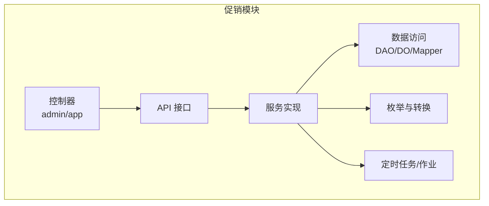
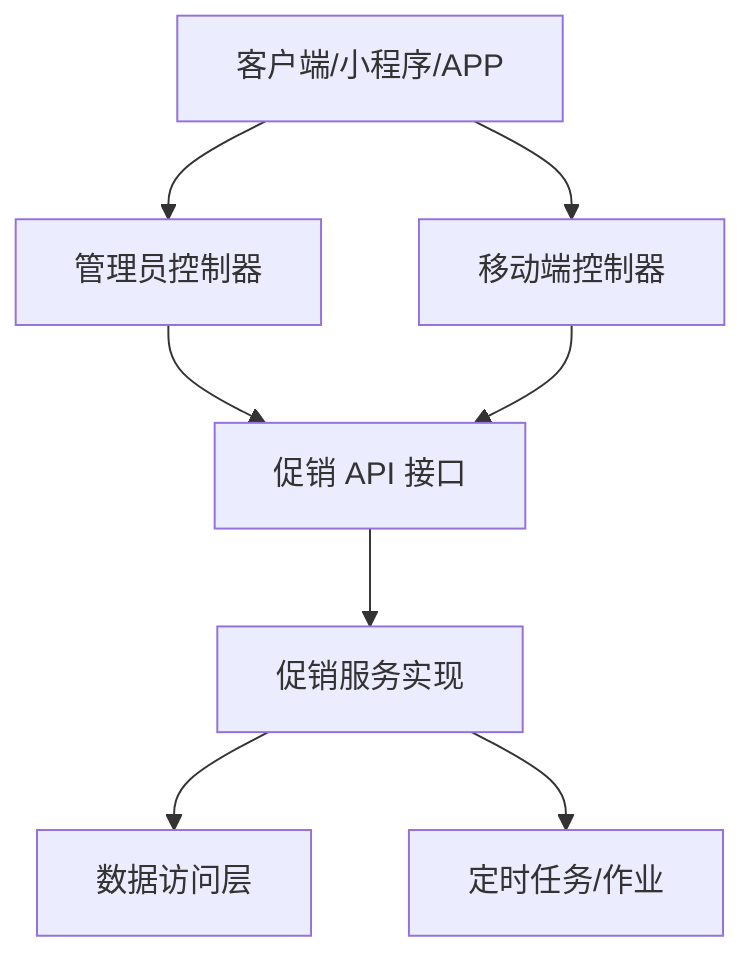
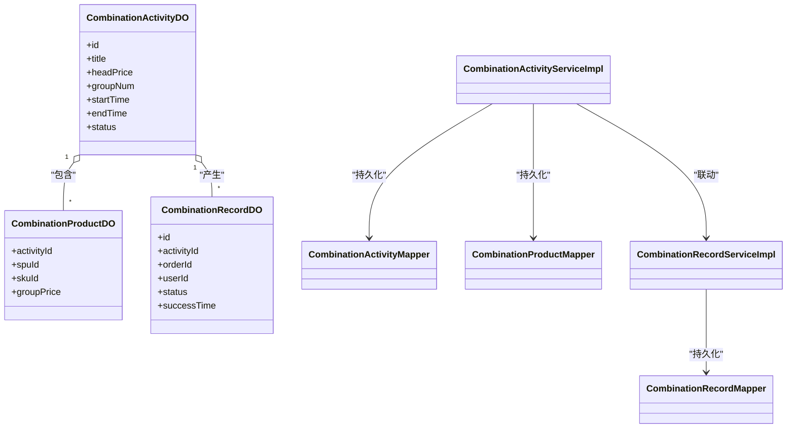
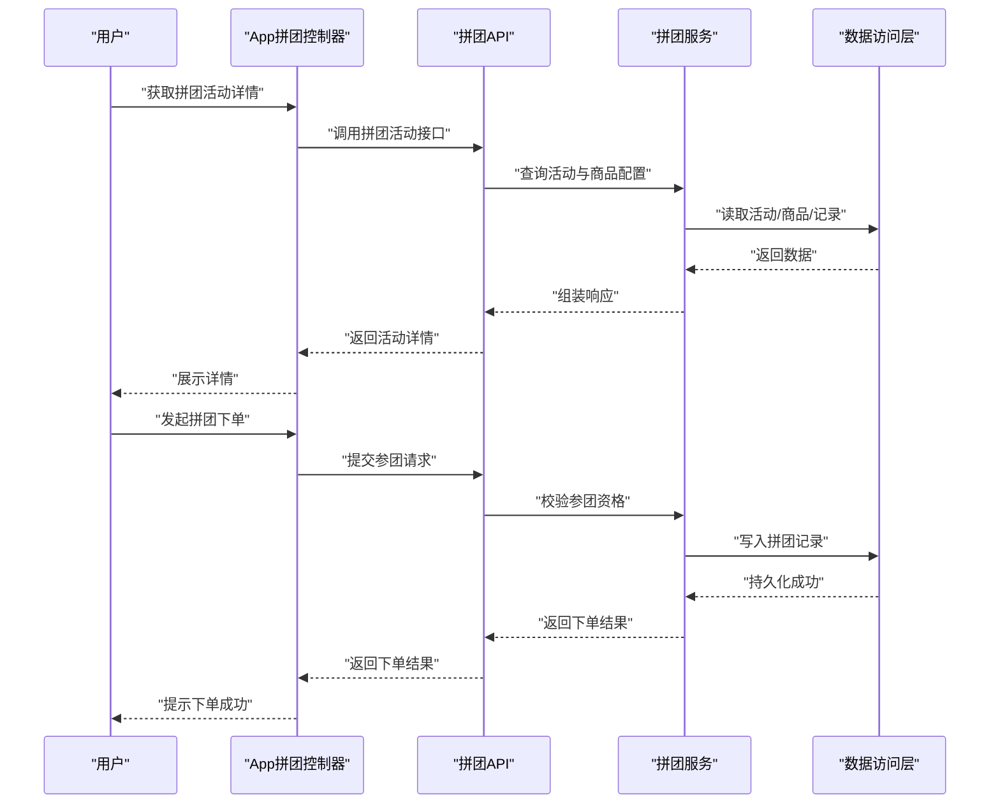
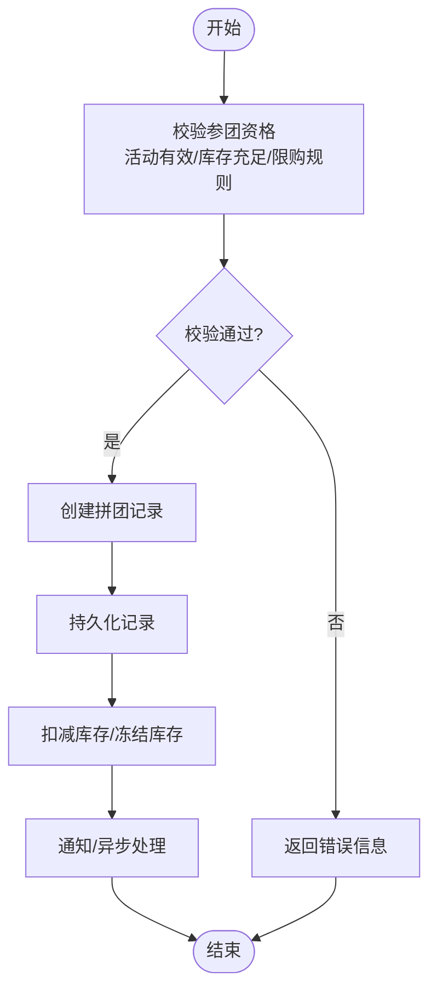
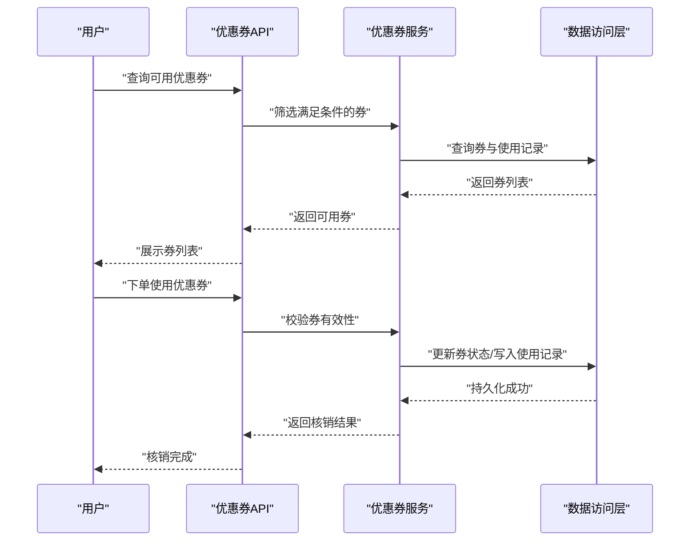
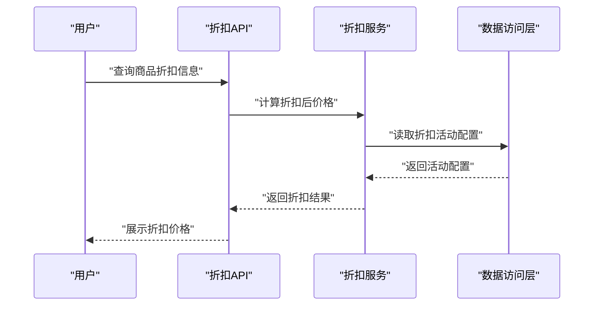
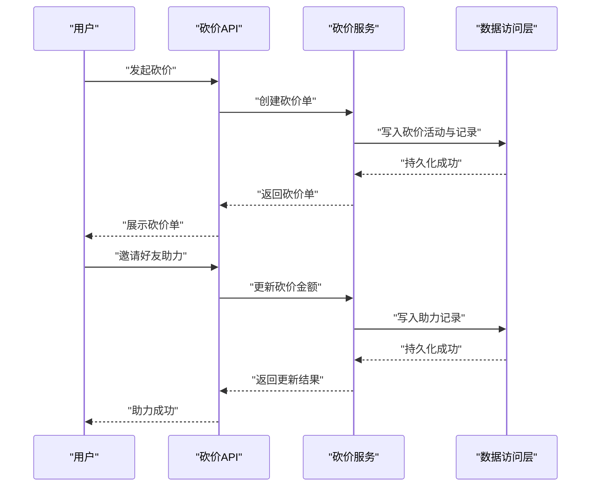
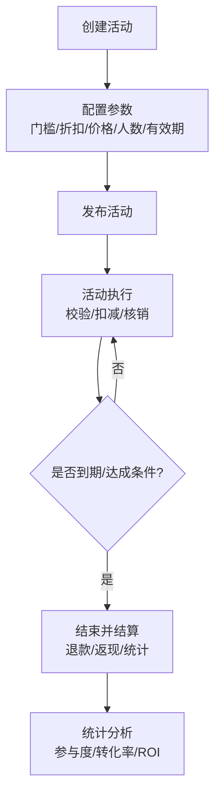
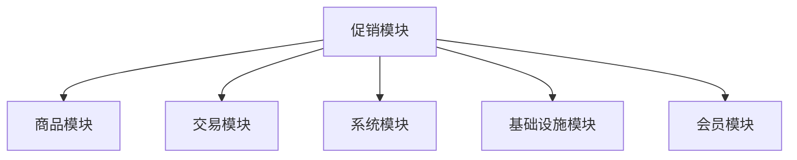

# 促销管理系统

<cite>
**本文引用的文件**
- [yudao-module-promotion/pom.xml](file://yudao-module-mall/yudao-module-promotion/pom.xml)
- [promotion/package-info.java](file://yudao-module-mall/yudao-module-promotion/src/main/java/cn/iocoder/yudao/module/promotion/package-info.java)
- [AppCombinationActivityController.java](file://yudao-module-mall/yudao-module-promotion/src/main/java/cn/iocoder/yudao/module/promotion/controller/app/combination/AppCombinationActivityController.java)
- [CombinationActivityController.java](file://yudao-module-mall/yudao-module-promotion/src/main/java/cn/iocoder/yudao/module/promotion/controller/admin/combination/CombinationActivityController.java)
- [CombinationRecordController.java](file://yudao-module-mall/yudao-module-promotion/src/main/java/cn/iocoder/yudao/module/promotion/controller/admin/combination/CombinationRecordController.java)
- [AppCombinationRecordController.java](file://yudao-module-mall/yudao-module-promotion/src/main/java/cn/iocoder/yudao/module/promotion/controller/app/combination/AppCombinationRecordController.java)
- [CombinationActivityServiceImplTest.java](file://yudao-module-mall/yudao-module-promotion/src/test/java/cn/iocoder/yudao/ModulePromotion/service/combination/CombinationActivityServiceImplTest.java)
- [CouponApi.java](file://yudao-module-mall/yudao-module-promotion/src/main/java/cn/iocoder/yudao/module/promotion/api/coupon/CouponApi.java)
- [CouponApiImpl.java](file://yudao-module-mall/yudao-module-promotion/src/main/java/cn/iocoder/yudao/module/promotion/api/coupon/CouponApiImpl.java)
- [DiscountActivityApi.java](file://yudao-module-mall/yudao-module-promotion/src/main/java/cn/iocoder/yudao/module/promotion/api/discount/DiscountActivityApi.java)
- [DiscountActivityApiImpl.java](file://yudao-module-mall/yudao-module-promotion/src/main/java/cn/iocoder/yudao/module/promotion/api/discount/DiscountActivityApiImpl.java)
- [BargainActivityApi.java](file://yudao-module-mall/yudao-module-promotion/src/main/java/cn/iocoder/yudao/module/promotion/api/bargain/BargainActivityApi.java)
- [BargainActivityApiImpl.java](file://yudao-module-mall/yudao-module-promotion/src/main/java/cn/iocoder/yudao/module/promotion/api/bargain/BargainActivityApiImpl.java)
- [BargainRecordApi.java](file://yudao-module-mall/yudao-module-promotion/src/main/java/cn/iocoder/yudao/module/promotion/api/bargain/BargainRecordApi.java)
- [BargainRecordApiImpl.java](file://yudao-module-mall/yudao-module-promotion/src/main/java/cn/iocoder/yudao/module/promotion/api/bargain/BargainRecordApiImpl.java)
- [CombinationActivityApi.java](file://yudao-module-mall/yudao-module-promotion/src/main/java/cn/iocoder/yudao/module/promotion/api/combination/CombinationActivityApi.java)
- [CombinationActivityApiImpl.java](file://yudao-module-mall/yudao-module-promotion/src/main/java/cn/iocoder/yudao/module/promotion/api/combination/CombinationActivityApiImpl.java)
- [CombinationRecordApi.java](file://yudao-module-mall/yudao-module-promotion/src/main/java/cn/iocoder/yudao/module/promotion/api/combination/CombinationRecordApi.java)
- [CombinationRecordApiImpl.java](file://yudao-module-mall/yudao-module-promotion/src/main/java/cn/iocoder/yudao/module/promotion/api/combination/CombinationRecordApiImpl.java)
- [CombinationActivityCreateReqVO.java](file://yudao-module-mall/yudao-module-promotion/src/main/java/cn/iocoder/yudao/module/promotion/controller/admin/combination/vo/activity/CombinationActivityCreateReqVO.java)
- [CombinationActivityUpdateReqVO.java](file://yudao-module-mall/yudao-module-promotion/src/main/java/cn/iocoder/yudao/module/promotion/controller/admin/combination/vo/activity/CombinationActivityUpdateReqVO.java)
- [CombinationActivityPageReqVO.java](file://yudao-module-mall/yudao-module-promotion/src/main/java/cn/iocoder/yudao/module/promotion/controller/admin/combination/vo/activity/CombinationActivityPageReqVO.java)
- [CombinationRecordCreateReqDTO.java](file://yudao-module-mall/yudao-module-promotion/src/main/java/cn/iocoder/yudao/module/promotion/api/combination/dto/CombinationRecordCreateReqDTO.java)
- [CombinationRecordCreateRespDTO.java](file://yudao-module-mall/yudao-module-promotion/src/main/java/cn/iocoder/yudao/module/promotion/api/combination/dto/CombinationRecordCreateRespDTO.java)
- [CombinationValidateJoinRespDTO.java](file://yudao-module-mall/yudao-module-promotion/src/main/java/cn/iocoder/yudao/module/promotion/api/combination/dto/CombinationValidateJoinRespDTO.java)
- [CouponUseReqDTO.java](file://yudao-module-mall/yudao-module-promotion/src/main/java/cn/iocoder/yudao/module/promotion/api/coupon/dto/CouponUseReqDTO.java)
- [CouponRespDTO.java](file://yudao-module-mall/yudao-module-promotion/src/main/java/cn/iocoder/yudao/module/promotion/api/coupon/dto/CouponRespDTO.java)
- [DiscountProductRespDTO.java](file://yudao-module-mall/yudao-module-promotion/src/main/java/cn/iocoder/yudao/module/promotion/api/discount/dto/DiscountProductRespDTO.java)
- [CombinationRecordStatusEnum.java](file://yudao-module-mall/yudao-module-promotion/src/main/java/cn/iocoder/yudao/module/promotion/enums/combination/CombinationRecordStatusEnum.java)
- [CombinationActivityStatusEnum.java](file://yudao-module-mall/yudao-module-promotion/src/main/java/cn/iocoder/yudao/module/promotion/enums/combination/CombinationActivityStatusEnum.java)
- [CombinationActivityDO.java](file://yudao-module-mall/yudao-module-promotion/src/main/java/cn/iocoder/yudao/module/promotion/dal/dataobject/combination/CombinationActivityDO.java)
- [CombinationProductDO.java](file://yudao-module-mall/yudao-module-promotion/src/main/java/cn/iocoder/yudao/module/promotion/dal/dataobject/combination/CombinationProductDO.java)
- [CombinationRecordDO.java](file://yudao-module-mall/yudao-module-promotion/src/main/java/cn/iocoder/yudao/module/promotion/dal/dataobject/combination/CombinationRecordDO.java)
- [CombinationActivityMapper.java](file://yudao-module-mall/yudao-module-promotion/src/main/java/cn/iocoder/yudao/module/promotion/dal/mysql/combination/CombinationActivityMapper.java)
- [CombinationProductMapper.java](file://yudao-module-mall/yudao-module-promotion/src/main/java/cn/iocoder/yudao/module/promotion/dal/mysql/combination/CombinationProductMapper.java)
- [CombinationRecordMapper.java](file://yudao-module-mall/yudao-module-promotion/src/main/java/cn/iocoder/yudao/module/promotion/dal/mysql/combination/CombinationRecordMapper.java)
- [CombinationActivityServiceImpl.java](file://yudao-module-mall/yudao-module-promotion/src/main/java/cn/iocoder/yudao/module/promotion/service/combination/CombinationActivityServiceImpl.java)
- [CombinationRecordServiceImpl.java](file://yudao-module-mall/yudao-module-promotion/src/main/java/cn/iocoder/yudao/module/promotion/service/combination/CombinationRecordServiceImpl.java)
- [CouponServiceImpl.java](file://yudao-module-mall/yudao-module-promotion/src/main/java/cn/iocoder/yudao/module/promotion/service/coupon/CouponServiceImpl.java)
- [DiscountActivityServiceImpl.java](file://yudao-module-mall/yudao-module-promotion/src/main/java/cn/iocoder/yudao/module/promotion/service/discount/DiscountActivityServiceImpl.java)
- [BargainActivityServiceImpl.java](file://yudao-module-mall/yudao-module-promotion/src/main/java/cn/iocoder/yudao/module/promotion/service/bargain/BargainActivityServiceImpl.java)
- [BargainRecordServiceImpl.java](file://yudao-module-mall/yudao-module-promotion/src/main/java/cn/iocoder/yudao/module/promotion/service/bargain/BargainRecordServiceImpl.java)
- [CombinationActivityConvert.java](file://yudao-module-mall/yudao-module-promotion/src/main/java/cn/iocoder/yudao/module/promotion/convert/combination/CombinationActivityConvert.java)
- [CombinationActivityConvert.java](file://yudao-module-mall/yudao-module-promotion/src/main/java/cn/iocoder/yudao/module/promotion/convert/combination/CombinationActivityConvert.java)
- [CombinationRecordConvert.java](file://yudao-module-mall/yudao-module-promotion/src/main/java/cn/iocoder/yudao/module/promotion/convert/combination/CombinationRecordConvert.java)
- [CombinationRecordConvert.java](file://yudao-module-mall/yudao-module-promotion/src/main/java/cn/iocoder/yudao/module/promotion/convert/combination/CombinationRecordConvert.java)
- [CombinationActivityJob.java](file://yudao-module-mall/yudao-module-promotion/src/main/java/cn/iocoder/yudao/module/promotion/job/CombinationActivityJob.java)
- [CombinationActivityJob.java](file://yudao-module-mall/yudao-module-promotion/src/main/java/cn/iocoder/yudao/module/promotion/job/CombinationActivityJob.java)
</cite>

## 目录
1. [简介](#简介)
2. [项目结构](#项目结构)
3. [核心组件](#核心组件)
4. [架构总览](#架构总览)
5. [详细组件分析](#详细组件分析)
6. [依赖关系分析](#依赖关系分析)
7. [性能考虑](#性能考虑)
8. [故障排查指南](#故障排查指南)
9. [结论](#结论)
10. [附录](#附录)

## 简介
本文件面向促销管理系统，围绕营销活动全生命周期进行系统化梳理，覆盖以下能力：
- 营销活动形态：满减活动、折扣优惠、拼团秒杀、优惠券等
- 生命周期管理：活动创建、配置、发布、执行、结束
- 核心功能细节：满减门槛与减免、折扣率与叠加、拼团价格与成团、秒杀库存与限购、优惠券类型与有效期
- 规则引擎：活动叠加、优先级、冲突处理
- 统计分析：参与度、转化率、ROI
- 性能优化与并发控制：库存扣减、限流、缓存、异步处理

## 项目结构
促销模块位于 mall 子模块下，采用按功能域分层的组织方式：
- 控制器层：admin 与 app 双端控制器，分别面向后台管理与移动端应用
- API 层：对外暴露的领域接口，如拼团、优惠券、折扣、砍价等
- 服务层：组合活动、记录、优惠券、折扣、砍价等具体业务实现
- 数据访问层：DAO/DO/Mapper，持久化组合活动、商品、记录等
- 枚举与转换：状态枚举、VO/DTO/DO 转换
- 作业与消息：定时任务与 MQ（如适用）

图表来源
- [promotion/package-info.java:1-9](file://yudao-module-mall/yudao-module-promotion/src/main/java/cn/iocoder/yudao/module/promotion/package-info.java#L1-L9)
- [yudao-module-promotion/pom.xml:1-84](file://yudao-module-mall/yudao-module-promotion/pom.xml#L1-L84)

章节来源
- [promotion/package-info.java:1-9](file://yudao-module-mall/yudao-module-promotion/src/main/java/cn/iocoder/yudao/module/promotion/package-info.java#L1-L9)
- [yudao-module-promotion/pom.xml:1-84](file://yudao-module-mall/yudao-module-promotion/pom.xml#L1-L84)

## 核心组件
- 拼团活动：包含活动定义、商品配置、参团记录、状态管理与定时任务
- 优惠券：包含券型、发放、核销、有效期与使用限制
- 折扣活动：包含折扣率、适用商品、叠加规则与使用限制
- 砍价活动：包含砍价活动与砍价记录
- 规则引擎与统计：活动叠加、优先级、冲突处理、参与度与转化率等指标（通过服务层与统计模块协同实现）
- 性能与并发：库存扣减、限流、缓存、异步处理（通过作业与消息队列实现）

章节来源
- [CombinationActivityController.java:1-22](file://yudao-module-mall/yudao-module-promotion/src/main/java/cn/iocoder/yudao/module/promotion/controller/admin/combination/CombinationActivityController.java#L1-L22)
- [AppCombinationActivityController.java:1-22](file://yudao-module-mall/yudao-module-promotion/src/main/java/cn/iocoder/yudao/module/promotion/controller/app/combination/AppCombinationActivityController.java#L1-L22)
- [CouponApi.java](file://yudao-module-mall/yudao-module-promotion/src/main/java/cn/iocoder/yudao/module/promotion/api/coupon/CouponApi.java)
- [DiscountActivityApi.java](file://yudao-module-mall/yudao-module-promotion/src/main/java/cn/iocoder/yudao/module/promotion/api/discount/DiscountActivityApi.java)
- [BargainActivityApi.java](file://yudao-module-mall/yudao-module-promotion/src/main/java/cn/iocoder/yudao/module/promotion/api/bargain/BargainActivityApi.java)

## 架构总览
促销模块遵循典型的分层架构，控制器负责请求接入与参数校验，API 层封装领域接口，服务层承载业务逻辑，DAO 层负责持久化。

图表来源
- [CombinationActivityController.java:1-22](file://yudao-module-mall/yudao-module-promotion/src/main/java/cn/iocoder/yudao/module/promotion/controller/admin/combination/CombinationActivityController.java#L1-L22)
- [AppCombinationActivityController.java:1-22](file://yudao-module-mall/yudao-module-promotion/src/main/java/cn/iocoder/yudao/module/promotion/controller/app/combination/AppCombinationActivityController.java#L1-L22)
- [CombinationActivityServiceImpl.java](file://yudao-module-mall/yudao-module-promotion/src/main/java/cn/iocoder/yudao/module/promotion/service/combination/CombinationActivityServiceImpl.java)
- [CombinationActivityMapper.java](file://yudao-module-mall/yudao-module-promotion/src/main/java/cn/iocoder/yudao/module/promotion/dal/mysql/combination/CombinationActivityMapper.java)
- [CombinationActivityJob.java](file://yudao-module-mall/yudao-module-promotion/src/main/java/cn/iocoder/yudao/module/promotion/job/CombinationActivityJob.java)

## 详细组件分析

### 拼团活动
拼团活动是促销模块的重要能力之一，涵盖活动定义、商品配置、参团记录与状态管理，并通过定时任务自动结束或成团。

- 活动定义与商品配置
  - 活动对象包含活动基础信息与商品明细，支持设置拼团价格、成团人数、有效期等关键参数
  - 商品配置用于限定可参与拼团的商品集合与SKU
- 参团记录与状态
  - 记录用户发起的拼团订单、拼团状态（如进行中、成功、失败）、成团时间等
  - 状态枚举用于统一管理拼团状态流转
- 控制器与 API
  - 管理端提供活动的增删改查与分页查询
  - 移动端提供活动详情、参团校验与下单入口
- 服务与数据访问
  - 服务层实现活动创建、更新、状态变更、成团判断等核心逻辑
  - DAO 层负责持久化活动、商品与记录
- 定时任务
  - 通过定时任务扫描即将到期或未成团的活动，自动结束并处理退款或失败状态

图表来源
- [CombinationActivityDO.java](file://yudao-module-mall/yudao-module-promotion/src/main/java/cn/iocoder/yudao/module/promotion/dal/dataobject/combination/CombinationActivityDO.java)
- [CombinationProductDO.java](file://yudao-module-mall/yudao-module-promotion/src/main/java/cn/iocoder/yudao/module/promotion/dal/dataobject/combination/CombinationProductDO.java)
- [CombinationRecordDO.java](file://yudao-module-mall/yudao-module-promotion/src/main/java/cn/iocoder/yudao/module/promotion/dal/dataobject/combination/CombinationRecordDO.java)
- [CombinationActivityMapper.java](file://yudao-module-mall/yudao-module-promotion/src/main/java/cn/iocoder/yudao/module/promotion/dal/mysql/combination/CombinationActivityMapper.java)
- [CombinationProductMapper.java](file://yudao-module-mall/yudao-module-promotion/src/main/java/cn/iocoder/yudao/module/promotion/dal/mysql/combination/CombinationProductMapper.java)
- [CombinationRecordMapper.java](file://yudao-module-mall/yudao-module-promotion/src/main/java/cn/iocoder/yudao/module/promotion/dal/mysql/combination/CombinationRecordMapper.java)
- [CombinationActivityServiceImpl.java](file://yudao-module-mall/yudao-module-promotion/src/main/java/cn/iocoder/yudao/module/promotion/service/combination/CombinationActivityServiceImpl.java)
- [CombinationRecordServiceImpl.java](file://yudao-module-mall/yudao-module-promotion/src/main/java/cn/iocoder/yudao/module/promotion/service/combination/CombinationRecordServiceImpl.java)

图表来源
- [AppCombinationActivityController.java:1-22](file://yudao-module-mall/yudao-module-promotion/src/main/java/cn/iocoder/yudao/module/promotion/controller/app/combination/AppCombinationActivityController.java#L1-L22)
- [CombinationActivityApiImpl.java](file://yudao-module-mall/yudao-module-promotion/src/main/java/cn/iocoder/yudao/module/promotion/api/combination/CombinationActivityApiImpl.java)
- [CombinationRecordApiImpl.java](file://yudao-module-mall/yudao-module-promotion/src/main/java/cn/iocoder/yudao/module/promotion/api/combination/CombinationRecordApiImpl.java)
- [CombinationActivityServiceImpl.java](file://yudao-module-mall/yudao-module-promotion/src/main/java/cn/iocoder/yudao/module/promotion/service/combination/CombinationActivityServiceImpl.java)
- [CombinationRecordServiceImpl.java](file://yudao-module-mall/yudao-module-promotion/src/main/java/cn/iocoder/yudao/module/promotion/service/combination/CombinationRecordServiceImpl.java)

图表来源
- [CombinationRecordCreateReqDTO.java](file://yudao-module-mall/yudao-module-promotion/src/main/java/cn/iocoder/yudao/module/promotion/api/combination/dto/CombinationRecordCreateReqDTO.java)
- [CombinationValidateJoinRespDTO.java](file://yudao-module-mall/yudao-module-promotion/src/main/java/cn/iocoder/yudao/module/promotion/api/combination/dto/CombinationValidateJoinRespDTO.java)
- [CombinationRecordServiceImpl.java](file://yudao-module-mall/yudao-module-promotion/src/main/java/cn/iocoder/yudao/module/promotion/service/combination/CombinationRecordServiceImpl.java)

章节来源
- [CombinationActivityController.java:1-22](file://yudao-module-mall/yudao-module-promotion/src/main/java/cn/iocoder/yudao/module/promotion/controller/admin/combination/CombinationActivityController.java#L1-L22)
- [CombinationRecordController.java:1-19](file://yudao-module-mall/yudao-module-promotion/src/main/java/cn/iocoder/yudao/module/promotion/controller/admin/combination/CombinationRecordController.java#L1-L19)
- [AppCombinationRecordController.java:1-22](file://yudao-module-mall/yudao-module-promotion/src/main/java/cn/iocoder/yudao/module/promotion/controller/app/combination/AppCombinationRecordController.java#L1-L22)
- [CombinationActivityServiceImplTest.java:1-21](file://yudao-module-mall/yudao-module-promotion/src/test/java/cn/iocoder/yudao/ModulePromotion/service/combination/CombinationActivityServiceImplTest.java#L1-L21)
- [CombinationRecordStatusEnum.java](file://yudao-module-mall/yudao-module-promotion/src/main/java/cn/iocoder/yudao/module/promotion/enums/combination/CombinationRecordStatusEnum.java)
- [CombinationActivityStatusEnum.java](file://yudao-module-mall/yudao-module-promotion/src/main/java/cn/iocoder/yudao/module/promotion/enums/combination/CombinationActivityStatusEnum.java)

### 优惠券系统
优惠券作为通用促销工具，支持多种类型与发放策略，并在下单时进行核销与校验。

- 类型与发放
  - 支持多种券型（如满减券、折扣券），发放策略（如领券中心、定向发放、任务奖励）
- 使用条件与有效期
  - 设置使用门槛（满减阈值）、折扣比例、适用范围（全部商品/指定分类/指定商品）、有效期
- 核销流程
  - 用户下单时选择优惠券，系统校验有效性并进行核销
- API 与服务
  - 提供券查询、核销接口与服务实现

图表来源
- [CouponApi.java](file://yudao-module-mall/yudao-module-promotion/src/main/java/cn/iocoder/yudao/module/promotion/api/coupon/CouponApi.java)
- [CouponApiImpl.java](file://yudao-module-mall/yudao-module-promotion/src/main/java/cn/iocoder/yudao/module/promotion/api/coupon/CouponApiImpl.java)
- [CouponUseReqDTO.java](file://yudao-module-mall/yudao-module-promotion/src/main/java/cn/iocoder/yudao/module/promotion/api/coupon/dto/CouponUseReqDTO.java)
- [CouponRespDTO.java](file://yudao-module-mall/yudao-module-promotion/src/main/java/cn/iocoder/yudao/module/promotion/api/coupon/dto/CouponRespDTO.java)
- [CouponServiceImpl.java](file://yudao-module-mall/yudao-module-promotion/src/main/java/cn/iocoder/yudao/module/promotion/service/coupon/CouponServiceImpl.java)

章节来源
- [CouponApi.java](file://yudao-module-mall/yudao-module-promotion/src/main/java/cn/iocoder/yudao/module/promotion/api/coupon/CouponApi.java)
- [CouponApiImpl.java](file://yudao-module-mall/yudao-module-promotion/src/main/java/cn/iocoder/yudao/module/promotion/api/coupon/CouponApiImpl.java)
- [CouponUseReqDTO.java](file://yudao-module-mall/yudao-module-promotion/src/main/java/cn/iocoder/yudao/module/promotion/api/coupon/dto/CouponUseReqDTO.java)
- [CouponRespDTO.java](file://yudao-module-mall/yudao-module-promotion/src/main/java/cn/iocoder/yudao/module/promotion/api/coupon/dto/CouponRespDTO.java)

### 折扣优惠活动
折扣活动支持对指定商品设置折扣率，并可与其他活动叠加或互斥。

- 折扣率与叠加规则
  - 支持设置折扣率、是否可叠加、叠加顺序与上限
- 适用范围与使用限制
  - 支持全店、指定分类、指定商品；支持限购数量、生效时间
- 服务与 API
  - 提供折扣活动查询与商品折扣信息查询

图表来源
- [DiscountActivityApi.java](file://yudao-module-mall/yudao-module-promotion/src/main/java/cn/iocoder/yudao/module/promotion/api/discount/DiscountActivityApi.java)
- [DiscountActivityApiImpl.java](file://yudao-module-mall/yudao-module-promotion/src/main/java/cn/iocoder/yudao/module/promotion/api/discount/DiscountActivityApiImpl.java)
- [DiscountProductRespDTO.java](file://yudao-module-mall/yudao-module-promotion/src/main/java/cn/iocoder/yudao/module/promotion/api/discount/dto/DiscountProductRespDTO.java)
- [DiscountActivityServiceImpl.java](file://yudao-module-mall/yudao-module-promotion/src/main/java/cn/iocoder/yudao/module/promotion/service/discount/DiscountActivityServiceImpl.java)

章节来源
- [DiscountActivityApi.java](file://yudao-module-mall/yudao-module-promotion/src/main/java/cn/iocoder/yudao/module/promotion/api/discount/DiscountActivityApi.java)
- [DiscountActivityApiImpl.java](file://yudao-module-mall/yudao-module-promotion/src/main/java/cn/iocoder/yudao/module/promotion/api/discount/DiscountActivityApiImpl.java)
- [DiscountProductRespDTO.java](file://yudao-module-mall/yudao-module-promotion/src/main/java/cn/iocoder/yudao/module/promotion/api/discount/dto/DiscountProductRespDTO.java)

### 砍价活动
砍价活动允许用户邀请好友助力，达到目标金额后可低价购买指定商品。

- 活动配置
  - 设置目标价、底价、最大助力次数、有效期
- 助力与记录
  - 记录用户发起的砍价单与好友助力记录
- 服务与 API
  - 提供砍价活动查询、发起砍价、参与助力等接口

图表来源
- [BargainActivityApi.java](file://yudao-module-mall/yudao-module-promotion/src/main/java/cn/iocoder/yudao/module/promotion/api/bargain/BargainActivityApi.java)
- [BargainActivityApiImpl.java](file://yudao-module-mall/yudao-module-promotion/src/main/java/cn/iocoder/yudao/module/promotion/api/bargain/BargainActivityApiImpl.java)
- [BargainRecordApi.java](file://yudao-module-mall/yudao-module-promotion/src/main/java/cn/iocoder/yudao/module/promotion/api/bargain/BargainRecordApi.java)
- [BargainRecordApiImpl.java](file://yudao-module-mall/yudao-module-promotion/src/main/java/cn/iocoder/yudao/module/promotion/api/bargain/BargainRecordApiImpl.java)
- [BargainActivityServiceImpl.java](file://yudao-module-mall/yudao-module-promotion/src/main/java/cn/iocoder/yudao/module/promotion/service/bargain/BargainActivityServiceImpl.java)
- [BargainRecordServiceImpl.java](file://yudao-module-mall/yudao-module-promotion/src/main/java/cn/iocoder/yudao/module/promotion/service/bargain/BargainRecordServiceImpl.java)

章节来源
- [BargainActivityApi.java](file://yudao-module-mall/yudao-module-promotion/src/main/java/cn/iocoder/yudao/module/promotion/api/bargain/BargainActivityApi.java)
- [BargainActivityApiImpl.java](file://yudao-module-mall/yudao-module-promotion/src/main/java/cn/iocoder/yudao/module/promotion/api/bargain/BargainActivityApiImpl.java)
- [BargainRecordApi.java](file://yudao-module-mall/yudao-module-promotion/src/main/java/cn/iocoder/yudao/module/promotion/api/bargain/BargainRecordApi.java)
- [BargainRecordApiImpl.java](file://yudao-module-mall/yudao-module-promotion/src/main/java/cn/iocoder/yudao/module/promotion/api/bargain/BargainRecordApiImpl.java)

### 促销活动生命周期管理
促销活动从创建到结束的完整生命周期如下：

图表来源
- [CombinationActivityServiceImpl.java](file://yudao-module-mall/yudao-module-promotion/src/main/java/cn/iocoder/yudao/module/promotion/service/combination/CombinationActivityServiceImpl.java)
- [CombinationActivityJob.java](file://yudao-module-mall/yudao-module-promotion/src/main/java/cn/iocoder/yudao/module/promotion/job/CombinationActivityJob.java)

章节来源
- [CombinationActivityServiceImpl.java](file://yudao-module-mall/yudao-module-promotion/src/main/java/cn/iocoder/yudao/module/promotion/service/combination/CombinationActivityServiceImpl.java)
- [CombinationActivityJob.java](file://yudao-module-mall/yudao-module-promotion/src/main/java/cn/iocoder/yudao/module/promotion/job/CombinationActivityJob.java)

### 促销活动的规则引擎
规则引擎用于处理活动叠加、优先级与冲突处理，确保最终折扣与优惠以最优策略呈现。

- 叠加与优先级
  - 不同活动可设定叠加顺序与优先级，如先折扣后券、或券不可叠加等
- 冲突处理
  - 同一商品同一时段仅允许一种生效策略，冲突时按优先级或配置规则择优
- 服务层实现
  - 在服务层集中处理规则计算与合并逻辑，保证一致性

章节来源
- [DiscountActivityServiceImpl.java](file://yudao-module-mall/yudao-module-promotion/src/main/java/cn/iocoder/yudao/module/promotion/service/discount/DiscountActivityServiceImpl.java)
- [CouponServiceImpl.java](file://yudao-module-mall/yudao-module-promotion/src/main/java/cn/iocoder/yudao/module/promotion/service/coupon/CouponServiceImpl.java)

### 促销活动的统计分析
统计分析围绕参与度、转化率、ROI 等关键指标展开，结合服务层与统计模块实现。

- 参与度
  - 活动浏览量、参团人数、下单转化率
- 转化率
  - 下单转化率、支付转化率
- ROI
  - 基于活动投入与销售增长计算 ROI
- 实现建议
  - 通过定时任务汇总数据，结合报表模块进行可视化展示

章节来源
- [CombinationActivityServiceImpl.java](file://yudao-module-mall/yudao-module-promotion/src/main/java/cn/iocoder/yudao/module/promotion/service/combination/CombinationActivityServiceImpl.java)

## 依赖关系分析
促销模块依赖多个子模块与基础设施组件，形成完整的业务闭环。

图表来源
- [yudao-module-promotion/pom.xml:21-46](file://yudao-module-mall/yudao-module-promotion/pom.xml#L21-L46)

章节来源
- [yudao-module-promotion/pom.xml:21-46](file://yudao-module-mall/yudao-module-promotion/pom.xml#L21-L46)

## 性能考虑
- 库存控制
  - 扣减库存需原子性操作，建议使用分布式锁或数据库乐观锁
- 限流与防刷
  - 对秒杀与拼团入口进行限流，防止恶意刷单
- 缓存策略
  - 将活动配置与热门商品折扣信息缓存，降低数据库压力
- 异步处理
  - 使用消息队列异步处理核销、退款与统计任务
- 分布式事务
  - 对跨模块操作（如优惠券核销与订单落库）采用可靠消息或 TCC 模式

## 故障排查指南
- 活动状态异常
  - 检查定时任务是否正常运行，确认活动状态与时间边界
- 库存不一致
  - 核对库存扣减与回滚逻辑，排查并发场景下的竞态条件
- 优惠券核销失败
  - 校验券的有效期、使用范围与使用次数，确认核销幂等性
- 拼团未成团
  - 检查成团人数与时间阈值，确认定时任务是否正确触发

章节来源
- [CombinationActivityJob.java](file://yudao-module-mall/yudao-module-promotion/src/main/java/cn/iocoder/yudao/module/promotion/job/CombinationActivityJob.java)
- [CombinationRecordServiceImpl.java](file://yudao-module-mall/yudao-module-promotion/src/main/java/cn/iocoder/yudao/module/promotion/service/combination/CombinationRecordServiceImpl.java)
- [CouponServiceImpl.java](file://yudao-module-mall/yudao-module-promotion/src/main/java/cn/iocoder/yudao/module/promotion/service/coupon/CouponServiceImpl.java)

## 结论
促销模块通过清晰的分层设计与完善的生命周期管理，支撑了拼团、优惠券、折扣、砍价等多种营销活动形态。配合规则引擎与统计分析，能够实现灵活的促销策略与可观测的运营效果。建议在高并发场景下强化库存控制、限流与缓存策略，并通过异步化与分布式事务保障一致性与稳定性。

## 附录
- 控制器与 VO/DTO
  - 管理端活动创建/更新/分页查询请求体
  - 移动端参团下单与校验请求体
- API 与服务
  - 拼团、优惠券、折扣、砍价的对外接口与服务实现
- 数据模型
  - 活动、商品、记录与状态枚举的数据结构

章节来源
- [CombinationActivityCreateReqVO.java](file://yudao-module-mall/yudao-module-promotion/src/main/java/cn/iocoder/yudao/module/promotion/controller/admin/combination/vo/activity/CombinationActivityCreateReqVO.java)
- [CombinationActivityUpdateReqVO.java](file://yudao-module-mall/yudao-module-promotion/src/main/java/cn/iocoder/yudao/module/promotion/controller/admin/combination/vo/activity/CombinationActivityUpdateReqVO.java)
- [CombinationActivityPageReqVO.java](file://yudao-module-mall/yudao-module-promotion/src/main/java/cn/iocoder/yudao/module/promotion/controller/admin/combination/vo/activity/CombinationActivityPageReqVO.java)
- [CombinationRecordCreateReqDTO.java](file://yudao-module-mall/yudao-module-promotion/src/main/java/cn/iocoder/yudao/module/promotion/api/combination/dto/CombinationRecordCreateReqDTO.java)
- [CombinationRecordCreateRespDTO.java](file://yudao-module-mall/yudao-module-promotion/src/main/java/cn/iocoder/yudao/module/promotion/api/combination/dto/CombinationRecordCreateRespDTO.java)
- [CombinationValidateJoinRespDTO.java](file://yudao-module-mall/yudao-module-promotion/src/main/java/cn/iocoder/yudao/module/promotion/api/combination/dto/CombinationValidateJoinRespDTO.java)
- [CouponUseReqDTO.java](file://yudao-module-mall/yudao-module-promotion/src/main/java/cn/iocoder/yudao/module/promotion/api/coupon/dto/CouponUseReqDTO.java)
- [CouponRespDTO.java](file://yudao-module-mall/yudao-module-promotion/src/main/java/cn/iocoder/yudao/module/promotion/api/coupon/dto/CouponRespDTO.java)
- [DiscountProductRespDTO.java](file://yudao-module-mall/yudao-module-promotion/src/main/java/cn/iocoder/yudao/module/promotion/api/discount/dto/DiscountProductRespDTO.java)
- [CombinationActivityApiImpl.java](file://yudao-module-mall/yudao-module-promotion/src/main/java/cn/iocoder/yudao/module/promotion/api/combination/CombinationActivityApiImpl.java)
- [CombinationRecordApiImpl.java](file://yudao-module-mall/yudao-module-promotion/src/main/java/cn/iocoder/yudao/module/promotion/api/combination/CombinationRecordApiImpl.java)
- [CouponApiImpl.java](file://yudao-module-mall/yudao-module-promotion/src/main/java/cn/iocoder/yudao/module/promotion/api/coupon/CouponApiImpl.java)
- [DiscountActivityApiImpl.java](file://yudao-module-mall/yudao-module-promotion/src/main/java/cn/iocoder/yudao/module/promotion/api/discount/DiscountActivityApiImpl.java)
- [BargainActivityApiImpl.java](file://yudao-module-mall/yudao-module-promotion/src/main/java/cn/iocoder/yudao/module/promotion/api/bargain/BargainActivityApiImpl.java)
- [BargainRecordApiImpl.java](file://yudao-module-mall/yudao-module-promotion/src/main/java/cn/iocoder/yudao/module/promotion/api/bargain/BargainRecordApiImpl.java)