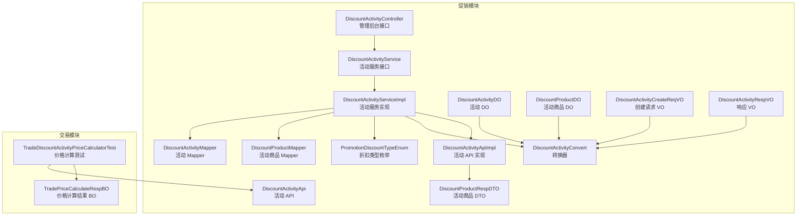
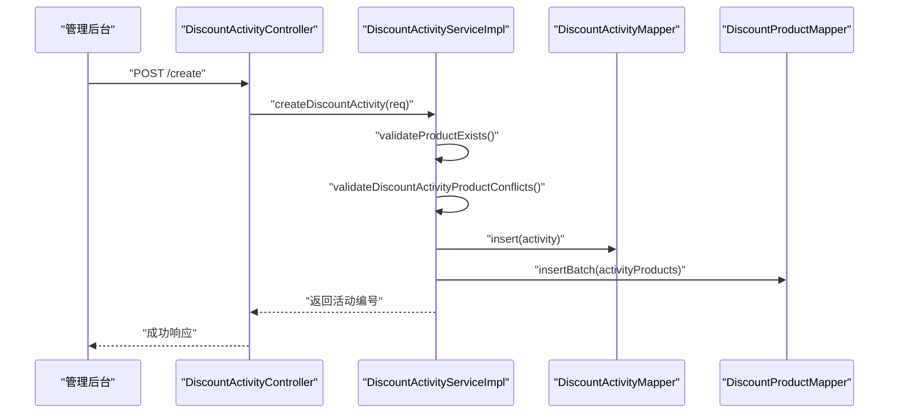
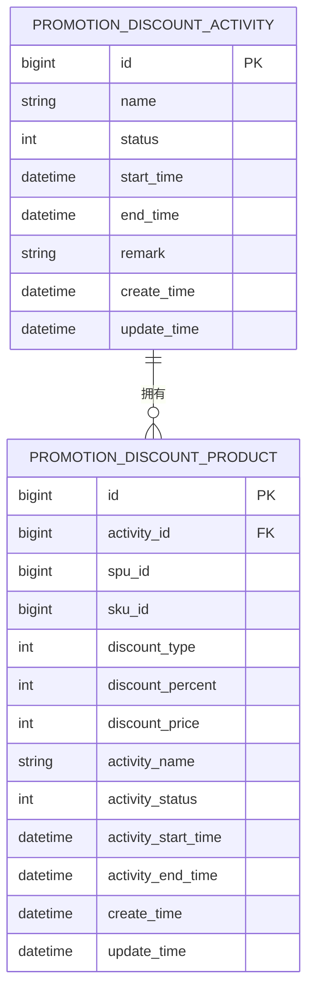
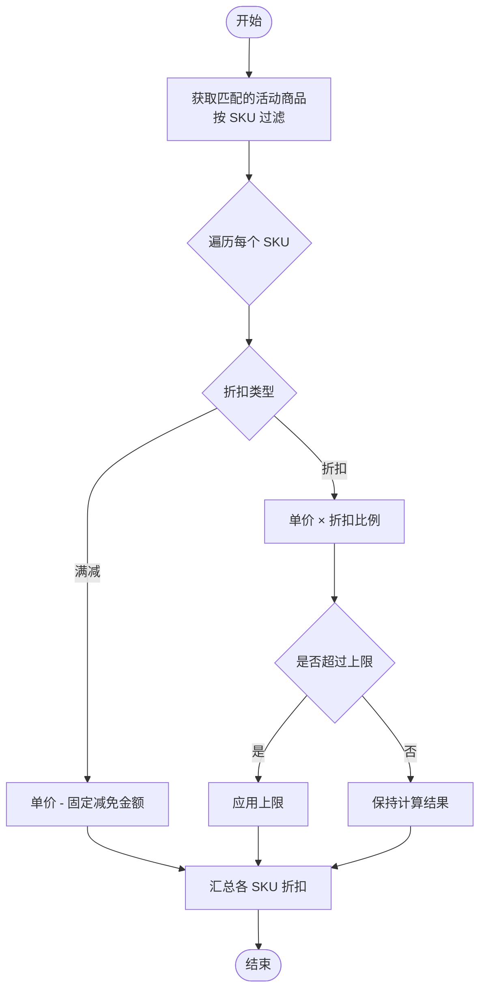
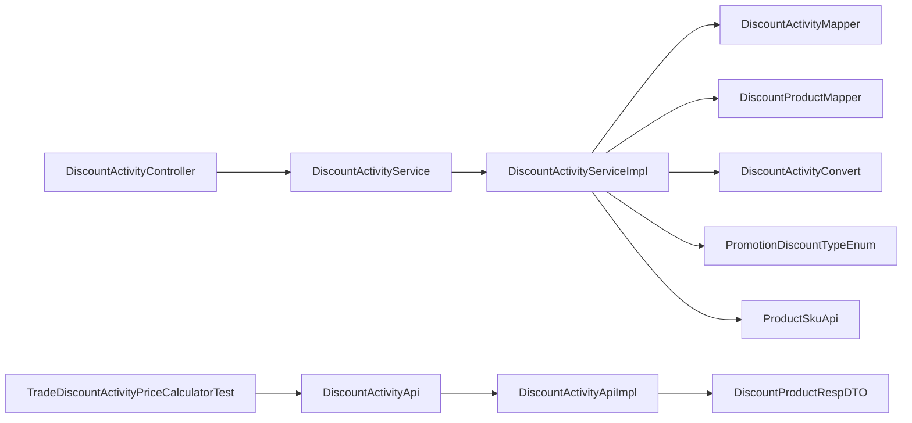

# 折扣活动管理

<cite>
**本文引用的文件**
- [DiscountActivityController.java](file://qiji-module-mall/qiji-module-promotion/src/main/java/com.qiji.cps/module/promotion/controller/admin/discount/DiscountActivityController.java)
- [DiscountActivityService.java](file://qiji-module-mall/qiji-module-promotion/src/main/java/com.qiji.cps/module/promotion/service/discount/DiscountActivityService.java)
- [DiscountActivityServiceImpl.java](file://qiji-module-mall/qiji-module-promotion/src/main/java/com.qiji.cps/module/promotion/service/discount/DiscountActivityServiceImpl.java)
- [DiscountActivityDO.java](file://qiji-module-mall/qiji-module-promotion/src/main/java/com.qiji.cps/module/promotion/dal/dataobject/discount/DiscountActivityDO.java)
- [DiscountProductDO.java](file://qiji-module-mall/qiji-module-promotion/src/main/java/com.qiji.cps/module/promotion/dal/dataobject/discount/DiscountProductDO.java)
- [DiscountActivityCreateReqVO.java](file://qiji-module-mall/qiji-module-promotion/src/main/java/com.qiji.cps/module/promotion/controller/admin/discount/vo/DiscountActivityCreateReqVO.java)
- [DiscountActivityRespVO.java](file://qiji-module-mall/qiji-module-promotion/src/main/java/com.qiji.cps/module/promotion/controller/admin/discount/vo/DiscountActivityRespVO.java)
- [DiscountActivityConvert.java](file://qiji-module-mall/qiji-module-promotion/src/main/java/com.qiji.cps/module/promotion/convert/discount/DiscountActivityConvert.java)
- [PromotionDiscountTypeEnum.java](file://qiji-module-mall/qiji-module-promotion/src/main/java/com.qiji.cps/module/promotion/enums/common/PromotionDiscountTypeEnum.java)
- [TradeDiscountActivityPriceCalculatorTest.java](file://qiji-module-mall/qiji-module-trade/src/test/java/com.qiji.cps/module/trade/service/price/calculator/TradeDiscountActivityPriceCalculatorTest.java)
- [TradePriceCalculateRespBO.java](file://qiji-module-mall/qiji-module-trade/src/main/java/com.qiji.cps/module/trade/service/price/bo/TradePriceCalculateRespBO.java)
- [DiscountActivityApi.java](file://qiji-module-mall/qiji-module-promotion/src/main/java/com.qiji.cps/module/promotion/api/discount/DiscountActivityApi.java)
- [DiscountActivityApiImpl.java](file://qiji-module-mall/qiji-module-promotion/src/main/java/com.qiji.cps/module/promotion/api/discount/DiscountActivityApiImpl.java)
- [DiscountProductRespDTO.java](file://qiji-module-mall/qiji-module-promotion/src/main/java/com.qiji.cps/module/promotion/api/discount/dto/DiscountProductRespDTO.java)
- [CouponBaseVO.java](file://qiji-module-mall/qiji-module-promotion/src/main/java/com.qiji.cps/module/promotion/controller/app/coupon/vo/coupon/CouponBaseVO.java)
- [AppCouponRespVO.java](file://qiji-module-mall/qiji-module-promotion/src/main/java/com.qiji.cps/module/promotion/controller/app/coupon/vo/coupon/AppCouponRespVO.java)
- [CouponRespDTO.java](file://qiji-module-mall/qiji-module-promotion/src/main/java/com.qiji.cps/module/promotion/api/coupon/dto/CouponRespDTO.java)
</cite>

## 目录
1. [简介](#简介)
2. [项目结构](#项目结构)
3. [核心组件](#核心组件)
4. [架构总览](#架构总览)
5. [详细组件分析](#详细组件分析)
6. [依赖分析](#依赖分析)
7. [性能考虑](#性能考虑)
8. [故障排查指南](#故障排查指南)
9. [结论](#结论)
10. [附录](#附录)

## 简介
本技术文档围绕折扣活动管理功能展开，系统性介绍折扣活动的创建、配置、发布与运营全流程，涵盖数据模型设计、业务规则引擎（折扣计算、叠加与优先级）、活动类型（商品折扣、品类折扣、会员折扣等差异化配置）、前端展示策略与用户体验设计、配置模板与使用示例，以及性能监控与异常处理机制。折扣活动以“限时折扣”为核心形态，通过活动与商品的绑定，结合价格计算引擎完成最终的优惠落地。

## 项目结构
折扣活动相关能力主要分布在促销模块与交易模块：
- 控制层：管理后台接口负责活动的增删改查与分页查询
- 服务层：活动与商品的持久化、校验、状态变更与匹配
- 数据访问层：MyBatis Mapper 提供 CRUD 与批量操作
- 数据对象：活动与活动商品的数据模型
- 转换层：VO/DTO 与 DO 的映射
- 价格计算：交易模块的价格计算器消费促销 API 获取匹配的折扣商品并执行折扣计算
- 枚举：折扣类型（满减/折扣）

图表来源
- [DiscountActivityController.java:1-100](file://qiji-module-mall/qiji-module-promotion/src/main/java/com.qiji.cps/module/promotion/controller/admin/discount/DiscountActivityController.java#L1-L100)
- [DiscountActivityService.java:1-93](file://qiji-module-mall/qiji-module-promotion/src/main/java/com.qiji.cps/module/promotion/service/discount/DiscountActivityService.java#L1-L93)
- [DiscountActivityServiceImpl.java:1-238](file://qiji-module-mall/qiji-module-promotion/src/main/java/com.qiji.cps/module/promotion/service/discount/DiscountActivityServiceImpl.java#L1-L238)
- [DiscountActivityDO.java:1-58](file://qiji-module-mall/qiji-module-promotion/src/main/java/com.qiji.cps/module/promotion/dal/dataobject/discount/DiscountActivityDO.java#L1-L58)
- [DiscountProductDO.java:1-95](file://qiji-module-mall/qiji-module-promotion/src/main/java/com.qiji.cps/module/promotion/dal/dataobject/discount/DiscountProductDO.java#L1-L95)
- [PromotionDiscountTypeEnum.java:1-39](file://qiji-module-mall/qiji-module-promotion/src/main/java/com.qiji.cps/module/promotion/enums/common/PromotionDiscountTypeEnum.java#L1-L39)
- [DiscountActivityCreateReqVO.java:1-26](file://qiji-module-mall/qiji-module-promotion/src/main/java/com.qiji.cps/module/promotion/controller/admin/discount/vo/DiscountActivityCreateReqVO.java#L1-L26)
- [DiscountActivityRespVO.java:1-31](file://qiji-module-mall/qiji-module-promotion/src/main/java/com.qiji.cps/module/promotion/controller/admin/discount/vo/DiscountActivityRespVO.java#L1-L31)
- [DiscountActivityConvert.java:1-51](file://qiji-module-mall/qiji-module-promotion/src/main/java/com.qiji.cps/module/promotion/convert/discount/DiscountActivityConvert.java#L1-L51)
- [DiscountActivityApi.java](file://qiji-module-mall/qiji-module-promotion/src/main/java/com.qiji.cps/module/promotion/api/discount/DiscountActivityApi.java)
- [DiscountActivityApiImpl.java](file://qiji-module-mall/qiji-module-promotion/src/main/java/com.qiji.cps/module/promotion/api/discount/DiscountActivityApiImpl.java)
- [DiscountProductRespDTO.java](file://qiji-module-mall/qiji-module-promotion/src/main/java/com.qiji.cps/module/promotion/api/discount/dto/DiscountProductRespDTO.java)
- [TradeDiscountActivityPriceCalculatorTest.java:1-105](file://qiji-module-mall/qiji-module-trade/src/test/java/com.qiji.cps/module/trade/service/price/calculator/TradeDiscountActivityPriceCalculatorTest.java#L1-L105)
- [TradePriceCalculateRespBO.java:364-405](file://qiji-module-mall/qiji-module-trade/src/main/java/com.qiji.cps/module/trade/service/price/bo/TradePriceCalculateRespBO.java#L364-L405)

章节来源
- [DiscountActivityController.java:1-100](file://qiji-module-mall/qiji-module-promotion/src/main/java/com.qiji.cps/module/promotion/controller/admin/discount/DiscountActivityController.java#L1-L100)
- [DiscountActivityService.java:1-93](file://qiji-module-mall/qiji-module-promotion/src/main/java/com.qiji.cps/module/promotion/service/discount/DiscountActivityService.java#L1-L93)
- [DiscountActivityServiceImpl.java:1-238](file://qiji-module-mall/qiji-module-promotion/src/main/java/com.qiji.cps/module/promotion/service/discount/DiscountActivityServiceImpl.java#L1-L238)

## 核心组件
- 控制层（管理后台）
  - 提供创建、更新、关闭、删除、查询单个、分页查询等接口
  - 权限控制基于注解，确保仅授权用户可操作
- 服务层
  - 校验商品冲突（同一 SPu 在活动期内不可重复参与不同活动）
  - 校验商品存在性（基于 SKU 校验）
  - 批量新增/更新/删除活动商品
  - 活动状态变更（启用/禁用）
  - 匹配当前时间有效的活动商品
- 数据访问层
  - 活动与活动商品的分页、按活动查询、按 SKU 查询等
- 数据模型
  - 活动：名称、状态、起止时间、备注等
  - 活动商品：折扣类型、折扣百分比、优惠金额、活动冗余字段等
- 转换层
  - VO/DTO 与 DO 的双向映射，支持分页转换与商品列表拼装
- 业务规则引擎
  - 价格计算阶段调用促销 API 获取匹配的折扣商品，按折扣类型执行计算

章节来源
- [DiscountActivityController.java:37-97](file://qiji-module-mall/qiji-module-promotion/src/main/java/com.qiji.cps/module/promotion/controller/admin/discount/DiscountActivityController.java#L37-L97)
- [DiscountActivityService.java:19-92](file://qiji-module-mall/qiji-module-promotion/src/main/java/com.qiji.cps/module/promotion/service/discount/DiscountActivityService.java#L19-L92)
- [DiscountActivityServiceImpl.java:53-149](file://qiji-module-mall/qiji-module-promotion/src/main/java/com.qiji.cps/module/promotion/service/discount/DiscountActivityServiceImpl.java#L53-L149)
- [DiscountActivityDO.java:25-57](file://qiji-module-mall/qiji-module-promotion/src/main/java/com.qiji.cps/module/promotion/dal/dataobject/discount/DiscountActivityDO.java#L25-L57)
- [DiscountProductDO.java:22-94](file://qiji-module-mall/qiji-module-promotion/src/main/java/com.qiji.cps/module/promotion/dal/dataobject/discount/DiscountProductDO.java#L22-L94)
- [DiscountActivityConvert.java:21-51](file://qiji-module-mall/qiji-module-promotion/src/main/java/com.qiji.cps/module/promotion/convert/discount/DiscountActivityConvert.java#L21-L51)

## 架构总览
折扣活动管理采用典型的分层架构：
- 表现层：管理后台 REST 接口
- 应用层：服务接口与实现
- 领域层：业务规则（冲突校验、状态管理）
- 数据访问层：Mapper 与 DO/DTO
- 价格计算层：交易模块的价格计算器通过促销 API 获取匹配商品并执行折扣

图表来源
- [DiscountActivityController.java:37-42](file://qiji-module-mall/qiji-module-promotion/src/main/java/com.qiji.cps/module/promotion/controller/admin/discount/DiscountActivityController.java#L37-L42)
- [DiscountActivityServiceImpl.java:55-73](file://qiji-module-mall/qiji-module-promotion/src/main/java/com.qiji.cps/module/promotion/service/discount/DiscountActivityServiceImpl.java#L55-L73)

## 详细组件分析

### 数据模型与字段设计
- 活动（DiscountActivityDO）
  - 主键、标题、状态、开始/结束时间、备注
  - 状态枚举：启用/禁用，关闭后不可再次开启
- 活动商品（DiscountProductDO）
  - 主键、活动编号、SPU/SKU 编号
  - 折扣类型（满减/折扣）、折扣百分比、优惠金额
  - 活动冗余字段：标题、状态、起止时间，便于价格计算时直接使用
- 折扣类型（PromotionDiscountTypeEnum）
  - 满减（具体金额）
  - 折扣（百分比）

图表来源
- [DiscountActivityDO.java:25-57](file://qiji-module-mall/qiji-module-promotion/src/main/java/com.qiji.cps/module/promotion/dal/dataobject/discount/DiscountActivityDO.java#L25-L57)
- [DiscountProductDO.java:22-94](file://qiji-module-mall/qiji-module-promotion/src/main/java/com.qiji.cps/module/promotion/dal/dataobject/discount/DiscountProductDO.java#L22-L94)

章节来源
- [DiscountActivityDO.java:25-57](file://qiji-module-mall/qiji-module-promotion/src/main/java/com.qiji.cps/module/promotion/dal/dataobject/discount/DiscountActivityDO.java#L25-L57)
- [DiscountProductDO.java:22-94](file://qiji-module-mall/qiji-module-promotion/src/main/java/com.qiji.cps/module/promotion/dal/dataobject/discount/DiscountProductDO.java#L22-L94)
- [PromotionDiscountTypeEnum.java:16-20](file://qiji-module-mall/qiji-module-promotion/src/main/java/com.qiji.cps/module/promotion/enums/common/PromotionDiscountTypeEnum.java#L16-L20)

### 折扣计算与业务规则引擎
- 匹配策略
  - 基于 SKU 数组获取当前时间有效且启用的活动商品
- 计算逻辑
  - 满减：直接从单价中抵扣固定金额
  - 折扣：按百分比计算折后价，支持上限控制（在某些场景下）
- 价格计算结果
  - 包含生效时间、优惠类型、折扣百分比、优惠金额、折扣上限、是否匹配、不匹配原因等字段，便于前端展示与审计

图表来源
- [DiscountActivityServiceImpl.java:229-235](file://qiji-module-mall/qiji-module-promotion/src/main/java/com.qiji.cps/module/promotion/service/discount/DiscountActivityServiceImpl.java#L229-L235)
- [TradePriceCalculateRespBO.java:364-405](file://qiji-module-mall/qiji-module-trade/src/main/java/com.qiji.cps/module/trade/service/price/bo/TradePriceCalculateRespBO.java#L364-L405)

章节来源
- [DiscountActivityServiceImpl.java:229-235](file://qiji-module-mall/qiji-module-promotion/src/main/java/com.qiji.cps/module/promotion/service/discount/DiscountActivityServiceImpl.java#L229-L235)
- [TradePriceCalculateRespBO.java:364-405](file://qiji-module-mall/qiji-module-trade/src/main/java/com.qiji.cps/module/trade/service/price/bo/TradePriceCalculateRespBO.java#L364-L405)

### 折扣活动类型与差异化配置
- 商品折扣
  - 绑定具体 SKU，按 SKU 粒度配置折扣类型与数值
- 品类折扣
  - 通过 SPU 维度配置，系统在创建时校验 SPU 冲突，避免同一 SPU 同一活动期内重复参与不同活动
- 会员折扣
  - 通过价格计算阶段的促销聚合与叠加策略实现，具体策略由价格计算器统一处理

章节来源
- [DiscountActivityServiceImpl.java:128-149](file://qiji-module-mall/qiji-module-promotion/src/main/java/com.qiji.cps/module/promotion/service/discount/DiscountActivityServiceImpl.java#L128-L149)
- [DiscountProductDO.java:35-48](file://qiji-module-mall/qiji-module-promotion/src/main/java/com.qiji.cps/module/promotion/dal/dataobject/discount/DiscountProductDO.java#L35-L48)

### 前端展示策略与用户体验
- 管理后台
  - 列表展示活动基本信息与状态，支持分页与筛选
  - 详情页展示活动商品列表，包含折扣类型、折扣数值与活动时间
- APP 展示
  - 优惠券/折扣券通用字段：生效开始/结束时间、优惠类型、折扣百分比、优惠金额、折扣上限
  - 便于前端统一渲染与用户理解

章节来源
- [DiscountActivityController.java:84-97](file://qiji-module-mall/qiji-module-promotion/src/main/java/com.qiji.cps/module/promotion/controller/admin/discount/DiscountActivityController.java#L84-L97)
- [DiscountActivityRespVO.java:16-31](file://qiji-module-mall/qiji-module-promotion/src/main/java/com.qiji.cps/module/promotion/controller/admin/discount/vo/DiscountActivityRespVO.java#L16-L31)
- [CouponBaseVO.java:79-103](file://qiji-module-mall/qiji-module-promotion/src/main/java/com.qiji.cps/module/promotion/controller/app/coupon/vo/coupon/CouponBaseVO.java#L79-L103)
- [AppCouponRespVO.java:30-49](file://qiji-module-mall/qiji-module-promotion/src/main/java/com.qiji.cps/module/promotion/controller/app/coupon/vo/coupon/AppCouponRespVO.java#L30-L49)
- [CouponRespDTO.java:55-109](file://qiji-module-mall/qiji-module-promotion/src/main/java/com.qiji.cps/module/promotion/api/coupon/dto/CouponRespDTO.java#L55-L109)

### 配置模板与使用示例
- 模板字段清单
  - 活动：名称、状态、开始/结束时间、备注
  - 商品：SKU 编号、折扣类型、折扣百分比、优惠金额、活动冗余字段
- 示例流程
  - 创建活动：填写活动信息 → 选择商品 → 设置折扣 → 发布
  - 修改活动：校验商品冲突 → 更新商品 → 保存
  - 关闭/删除：关闭后禁止再次开启；删除前需先关闭

章节来源
- [DiscountActivityCreateReqVO.java:16-26](file://qiji-module-mall/qiji-module-promotion/src/main/java/com.qiji.cps/module/promotion/controller/admin/discount/vo/DiscountActivityCreateReqVO.java#L16-L26)
- [DiscountActivityServiceImpl.java:55-73](file://qiji-module-mall/qiji-module-promotion/src/main/java/com.qiji.cps/module/promotion/service/discount/DiscountActivityServiceImpl.java#L55-L73)
- [DiscountActivityServiceImpl.java:169-196](file://qiji-module-mall/qiji-module-promotion/src/main/java/com.qiji.cps/module/promotion/service/discount/DiscountActivityServiceImpl.java#L169-L196)

### 性能监控与异常处理
- 性能
  - 批量插入/更新活动商品，减少多次往返
  - 活动商品按活动 ID 批量查询，降低 N+1 查询风险
- 异常
  - 商品冲突校验：同一 SPU 在活动期内不可重复参与不同活动
  - 商品不存在：SKU 校验失败抛出异常
  - 活动状态异常：已关闭活动不可修改或删除
  - 单元测试覆盖：价格计算器对不同折扣类型的断言

章节来源
- [DiscountActivityServiceImpl.java:95-120](file://qiji-module-mall/qiji-module-promotion/src/main/java/com.qiji.cps/module/promotion/service/discount/DiscountActivityServiceImpl.java#L95-L120)
- [DiscountActivityServiceImpl.java:128-149](file://qiji-module-mall/qiji-module-promotion/src/main/java/com.qiji.cps/module/promotion/service/discount/DiscountActivityServiceImpl.java#L128-L149)
- [DiscountActivityServiceImpl.java:169-196](file://qiji-module-mall/qiji-module-promotion/src/main/java/com.qiji.cps/module/promotion/service/discount/DiscountActivityServiceImpl.java#L169-L196)
- [TradeDiscountActivityPriceCalculatorTest.java:61-105](file://qiji-module-mall/qiji-module-trade/src/test/java/com.qiji.cps/module/trade/service/price/calculator/TradeDiscountActivityPriceCalculatorTest.java#L61-L105)

## 依赖分析
- 控制层依赖服务层接口
- 服务实现依赖 Mapper、转换器、API 与 SKU 接口
- 价格计算依赖促销 API 获取匹配商品

图表来源
- [DiscountActivityController.java:34-35](file://qiji-module-mall/qiji-module-promotion/src/main/java/com.qiji.cps/module/promotion/controller/admin/discount/DiscountActivityController.java#L34-L35)
- [DiscountActivityServiceImpl.java:46-51](file://qiji-module-mall/qiji-module-promotion/src/main/java/com.qiji.cps/module/promotion/service/discount/DiscountActivityServiceImpl.java#L46-L51)
- [DiscountActivityApi.java](file://qiji-module-mall/qiji-module-promotion/src/main/java/com.qiji.cps/module/promotion/api/discount/DiscountActivityApi.java)
- [DiscountActivityApiImpl.java](file://qiji-module-mall/qiji-module-promotion/src/main/java/com.qiji.cps/module/promotion/api/discount/DiscountActivityApiImpl.java)
- [DiscountProductRespDTO.java](file://qiji-module-mall/qiji-module-promotion/src/main/java/com.qiji.cps/module/promotion/api/discount/dto/DiscountProductRespDTO.java)
- [TradeDiscountActivityPriceCalculatorTest.java:4-6](file://qiji-module-mall/qiji-module-trade/src/test/java/com.qiji.cps/module/trade/service/price/calculator/TradeDiscountActivityPriceCalculatorTest.java#L4-L6)

章节来源
- [DiscountActivityController.java:34-35](file://qiji-module-mall/qiji-module-promotion/src/main/java/com.qiji.cps/module/promotion/controller/admin/discount/DiscountActivityController.java#L34-L35)
- [DiscountActivityServiceImpl.java:46-51](file://qiji-module-mall/qiji-module-promotion/src/main/java/com.qiji.cps/module/promotion/service/discount/DiscountActivityServiceImpl.java#L46-L51)

## 性能考虑
- 批量操作：新增/更新活动商品采用批量插入/更新/删除，降低数据库往返次数
- 查询优化：按活动 ID 批量查询商品，避免逐条查询
- 冗余字段：活动商品冗余活动状态与时间，减少关联查询
- 并发控制：事务边界明确，异常回滚保证一致性

## 故障排查指南
- 商品冲突
  - 现象：创建/更新活动时报错，提示某 SPU 冲突
  - 处理：检查该 SPU 是否已在其他启用活动中参与
- 商品不存在
  - 现象：SKU 校验失败
  - 处理：确认 SKU 是否存在且状态正常
- 活动状态异常
  - 现象：已关闭活动无法修改或删除
  - 处理：先关闭活动再进行相应操作
- 折扣计算异常
  - 现象：价格计算结果与预期不符
  - 处理：核对折扣类型、折扣百分比、优惠金额与生效时间；参考单元测试断言

章节来源
- [DiscountActivityServiceImpl.java:128-149](file://qiji-module-mall/qiji-module-promotion/src/main/java/com.qiji.cps/module/promotion/service/discount/DiscountActivityServiceImpl.java#L128-L149)
- [DiscountActivityServiceImpl.java:156-167](file://qiji-module-mall/qiji-module-promotion/src/main/java/com.qiji.cps/module/promotion/service/discount/DiscountActivityServiceImpl.java#L156-L167)
- [DiscountActivityServiceImpl.java:169-196](file://qiji-module-mall/qiji-module-promotion/src/main/java/com.qiji.cps/module/promotion/service/discount/DiscountActivityServiceImpl.java#L169-L196)
- [TradeDiscountActivityPriceCalculatorTest.java:61-105](file://qiji-module-mall/qiji-module-trade/src/test/java/com.qiji.cps/module/trade/service/price/calculator/TradeDiscountActivityPriceCalculatorTest.java#L61-L105)

## 结论
折扣活动管理以清晰的数据模型与严格的业务规则为基础，结合价格计算引擎实现灵活的折扣策略。通过冲突校验、状态管理与批量操作，保障了系统的稳定性与性能。前端通过统一的字段规范实现一致的展示体验。建议在实际部署中配合完善的监控与告警机制，持续优化折扣计算与库存一致性。

## 附录
- 配置模板字段
  - 活动：名称、状态、开始/结束时间、备注
  - 商品：SKU 编号、折扣类型、折扣百分比、优惠金额
- 使用示例
  - 创建流程：填写活动信息 → 选择商品 → 设置折扣 → 发布
  - 修改流程：校验冲突 → 更新商品 → 保存
  - 关闭/删除流程：关闭后禁止再次开启；删除前需先关闭