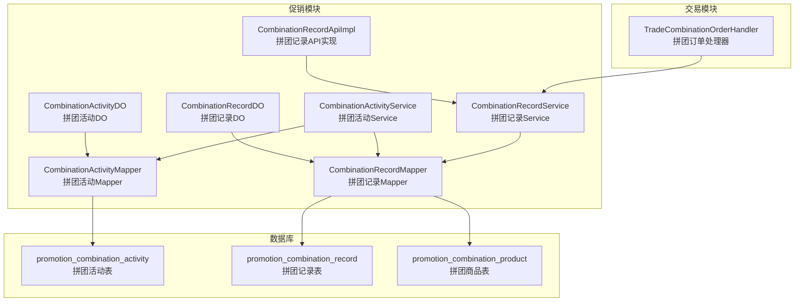
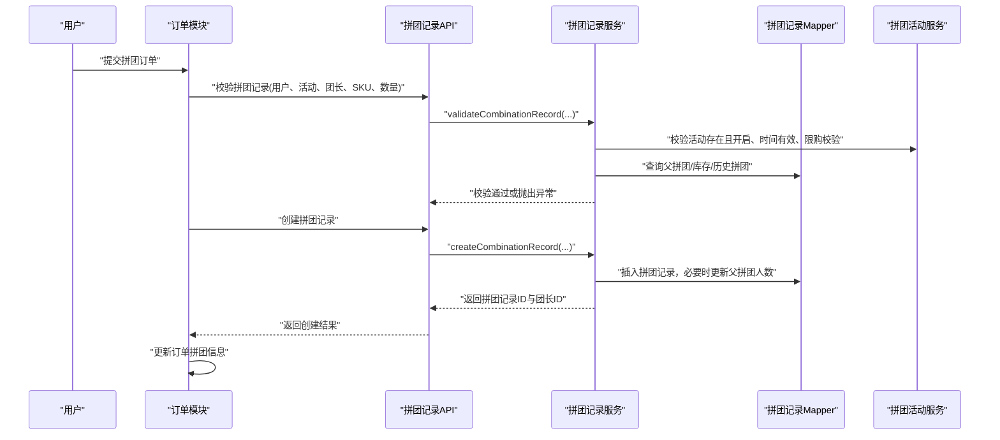
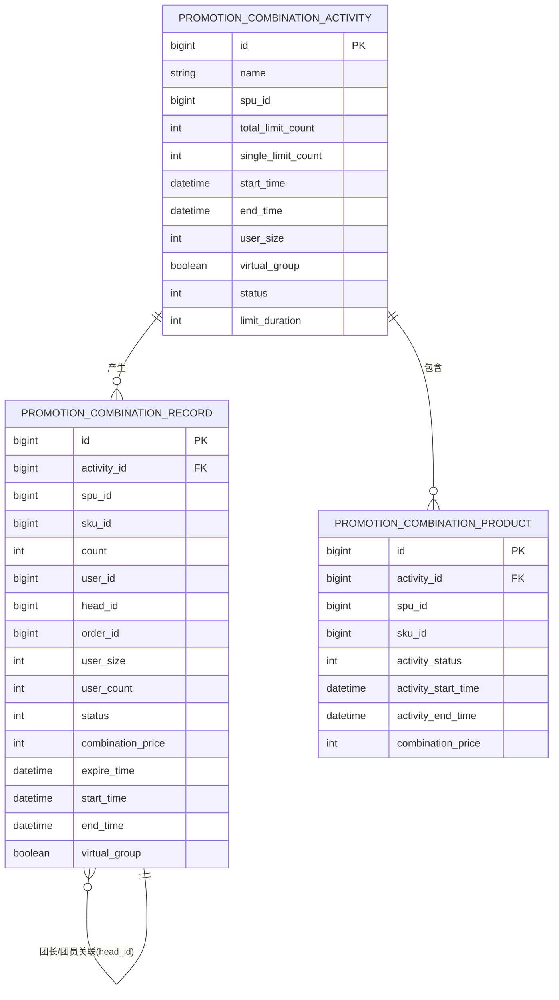
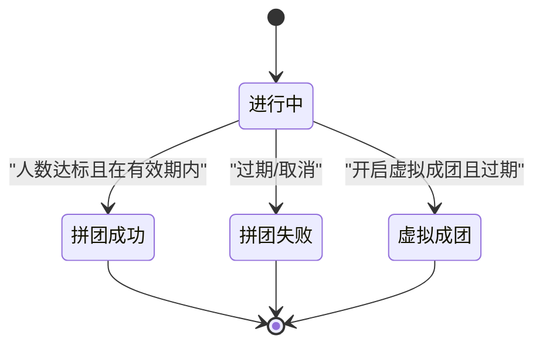
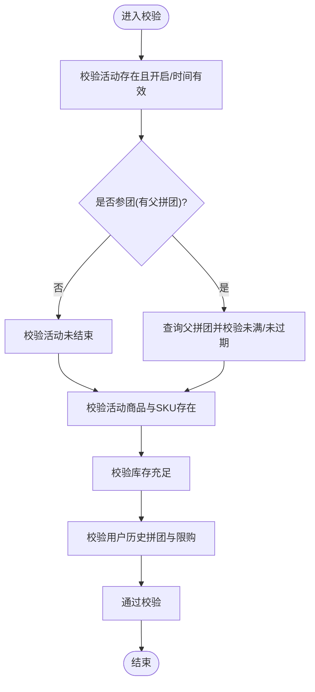
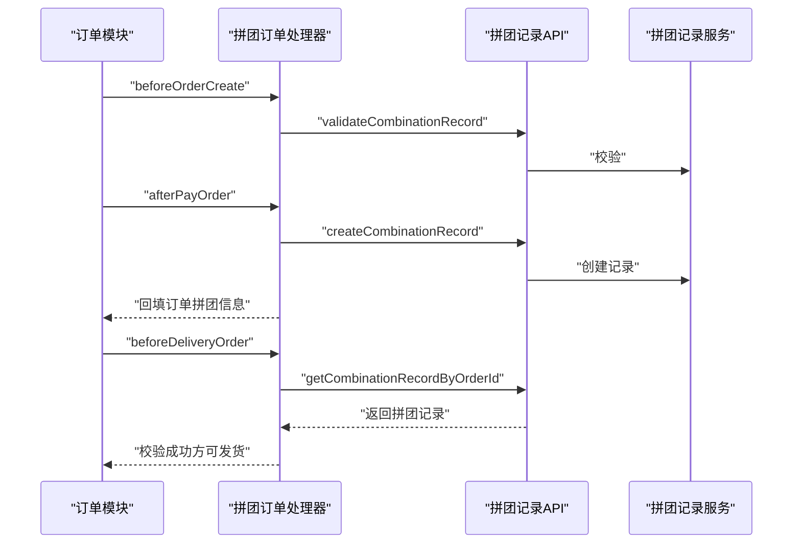
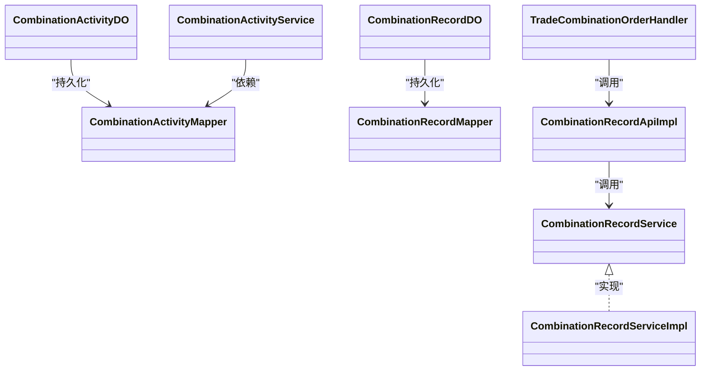
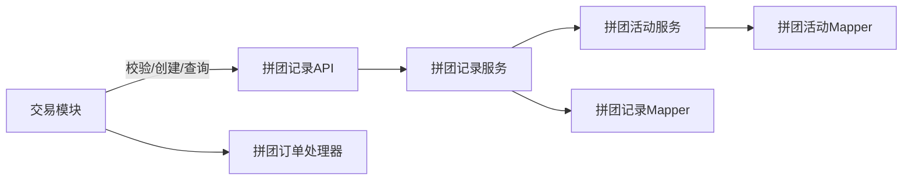

# 拼团活动管理

<cite>
**本文引用的文件**
- [CombinationActivityDO.java](file://yudao-module-mall/yudao-module-promotion/src/main/java/cn/iocoder/yudao/module/promotion/dal/dataobject/combination/CombinationActivityDO.java)
- [CombinationRecordDO.java](file://yudao-module-mall/yudao-module-promotion/src/main/java/cn/iocoder/yudao/module/promotion/dal/dataobject/combination/CombinationRecordDO.java)
- [CombinationActivityService.java](file://yudao-module-mall/yudao-module-promotion/src/main/java/cn/iocoder/yudao/module/promotion/service/combination/CombinationActivityService.java)
- [CombinationRecordService.java](file://yudao-module-mall/yudao-module-promotion/src/main/java/cn/iocoder/yudao/module/promotion/service/combination/CombinationRecordService.java)
- [CombinationRecordServiceImpl.java](file://yudao-module-mall/yudao-module-promotion/src/main/java/cn/iocoder/yudao/module/promotion/service/combination/CombinationRecordServiceImpl.java)
- [CombinationActivityMapper.java](file://yudao-module-mall/yudao-module-promotion/src/main/java/cn/iocoder/yudao/module/promotion/dal/mysql/combination/CombinationActivityMapper.java)
- [CombinationRecordMapper.java](file://yudao-module-mall/yudao-module-promotion/src/main/java/cn/iocoder/yudao/module/promotion/dal/mysql/combination/CombinationRecordMapper.java)
- [CombinationRecordApiImpl.java](file://yudao-module-mall/yudao-module-promotion/src/main/java/cn/iocoder/yudao/module/promotion/api/combination/CombinationRecordApiImpl.java)
- [CombinationRecordStatusEnum.java](file://yudao-module-mall/yudao-module-promotion/src/main/java/cn/iocoder/yudao/module/promotion/enums/combination/CombinationRecordStatusEnum.java)
- [TradeCombinationOrderHandler.java](file://yudao-module-mall/yudao-module-trade/src/main/java/cn/iocoder/yudao/module/trade/service/order/handler/TradeCombinationOrderHandler.java)
- [ruoyi-vue-pro-mall-2025-05-12.sql](file://sql/module/ruoyi-vue-pro-mall-2025-05-12.sql)
</cite>

## 目录
1. [简介](#简介)
2. [项目结构](#项目结构)
3. [核心组件](#核心组件)
4. [架构总览](#架构总览)
5. [详细组件分析](#详细组件分析)
6. [依赖关系分析](#依赖关系分析)
7. [性能与高并发](#性能与高并发)
8. [故障排查指南](#故障排查指南)
9. [结论](#结论)
10. [附录](#附录)

## 简介
本技术文档围绕拼团活动管理功能展开，系统性阐述拼团活动的业务模式、核心机制与实现细节，覆盖活动生命周期（发起、参团、成团、失败）、数据模型设计、业务规则（状态管理、成团条件、退款处理、库存校验）、用户交互流程（发起拼团、邀请参团）、订单处理（拼团成功后的订单生成与发货）、配置示例与运营策略，以及性能优化与高并发处理方案。

## 项目结构
拼团模块位于“促销”子模块中，核心由以下层次构成：
- 数据对象层：拼团活动与拼团记录的数据模型
- 数据访问层：MyBatis Mapper，提供分页、聚合、条件查询
- 服务层：拼团活动与拼团记录的服务接口与实现
- API 层：对外暴露的拼团记录能力（校验、创建、查询）
- 订单集成层：与交易模块协作，完成拼团订单的创建、支付后处理与发货前置校验
- 数据库脚本：定义拼团活动、拼团记录、拼团商品等表结构与样例数据

图表来源
- [CombinationActivityDO.java:1-78](file://yudao-module-mall/yudao-module-promotion/src/main/java/cn/iocoder/yudao/module/promotion/dal/dataobject/combination/CombinationActivityDO.java#L1-L78)
- [CombinationRecordDO.java:1-141](file://yudao-module-mall/yudao-module-promotion/src/main/java/cn/iocoder/yudao/module/promotion/dal/dataobject/combination/CombinationRecordDO.java#L1-L141)
- [CombinationActivityMapper.java:1-47](file://yudao-module-mall/yudao-module-promotion/src/main/java/cn/iocoder/yudao/module/promotion/dal/mysql/combination/CombinationActivityMapper.java#L1-L47)
- [CombinationRecordMapper.java:1-155](file://yudao-module-mall/yudao-module-promotion/src/main/java/cn/iocoder/yudao/module/promotion/dal/mysql/combination/CombinationRecordMapper.java#L1-L155)
- [CombinationActivityService.java:1-244](file://yudao-module-mall/yudao-module-promotion/src/main/java/cn/iocoder/yudao/module/promotion/service/combination/CombinationActivityService.java#L1-L244)
- [CombinationRecordService.java:1-145](file://yudao-module-mall/yudao-module-promotion/src/main/java/cn/iocoder/yudao/module/promotion/service/combination/CombinationRecordService.java#L1-L145)
- [CombinationRecordApiImpl.java:1-48](file://yudao-module-mall/yudao-module-promotion/src/main/java/cn/iocoder/yudao/module/promotion/api/combination/CombinationRecordApiImpl.java#L1-L48)
- [TradeCombinationOrderHandler.java:1-98](file://yudao-module-mall/yudao-module-trade/src/main/java/cn/iocoder/yudao/module/trade/service/order/handler/TradeCombinationOrderHandler.java#L1-L98)
- [ruoyi-vue-pro-mall-2025-05-12.sql:583-622](file://sql/module/ruoyi-vue-pro-mall-2025-05-12.sql#L583-L622)

章节来源
- [CombinationActivityDO.java:1-78](file://yudao-module-mall/yudao-module-promotion/src/main/java/cn/iocoder/yudao/module/promotion/dal/dataobject/combination/CombinationActivityDO.java#L1-L78)
- [CombinationRecordDO.java:1-141](file://yudao-module-mall/yudao-module-promotion/src/main/java/cn/iocoder/yudao/module/promotion/dal/dataobject/combination/CombinationRecordDO.java#L1-L141)
- [CombinationActivityMapper.java:1-47](file://yudao-module-mall/yudao-module-promotion/src/main/java/cn/iocoder/yudao/module/promotion/dal/mysql/combination/CombinationActivityMapper.java#L1-L47)
- [CombinationRecordMapper.java:1-155](file://yudao-module-mall/yudao-module-promotion/src/main/java/cn/iocoder/yudao/module/promotion/dal/mysql/combination/CombinationRecordMapper.java#L1-L155)
- [CombinationActivityService.java:1-244](file://yudao-module-mall/yudao-module-promotion/src/main/java/cn/iocoder/yudao/module/promotion/service/combination/CombinationActivityService.java#L1-L244)
- [CombinationRecordService.java:1-145](file://yudao-module-mall/yudao-module-promotion/src/main/java/cn/iocoder/yudao/module/promotion/service/combination/CombinationRecordService.java#L1-L145)
- [CombinationRecordApiImpl.java:1-48](file://yudao-module-mall/yudao-module-promotion/src/main/java/cn/iocoder/yudao/module/promotion/api/combination/CombinationRecordApiImpl.java#L1-L48)
- [TradeCombinationOrderHandler.java:1-98](file://yudao-module-mall/yudao-module-trade/src/main/java/cn/iocoder/yudao/module/trade/service/order/handler/TradeCombinationOrderHandler.java#L1-L98)
- [ruoyi-vue-pro-mall-2025-05-12.sql:583-622](file://sql/module/ruoyi-vue-pro-mall-2025-05-12.sql#L583-L622)

## 核心组件
- 拼团活动（CombinationActivityDO）：承载活动基本信息，如名称、SPU、限购数量、开始/结束时间、几人团、虚拟成团开关、状态、限制时长等
- 拼团记录（CombinationRecordDO）：记录用户参与拼团的行为，包括活动编号、SPU/SKU、购买数量、用户信息、团长编号、订单编号、人数规模、当前人数、状态、拼团单价、开始/过期/结束时间、是否虚拟成团等
- 拼团活动服务（CombinationActivityService）：负责活动的创建、更新、关闭、删除、分页查询、商品关联等
- 拼团记录服务（CombinationRecordService/Impl）：负责拼团校验、创建、状态推进、过期处理、虚拟成团、统计查询等
- 拼团记录API（CombinationRecordApiImpl）：对外暴露拼团记录能力，供订单模块调用
- 订单集成（TradeCombinationOrderHandler）：在订单创建前校验、支付后创建拼团记录并回填订单信息、发货前校验拼团状态
- 数据库表：promotion_combination_activity、promotion_combination_record、promotion_combination_product

章节来源
- [CombinationActivityDO.java:1-78](file://yudao-module-mall/yudao-module-promotion/src/main/java/cn/iocoder/yudao/module/promotion/dal/dataobject/combination/CombinationActivityDO.java#L1-L78)
- [CombinationRecordDO.java:1-141](file://yudao-module-mall/yudao-module-promotion/src/main/java/cn/iocoder/yudao/module/promotion/dal/dataobject/combination/CombinationRecordDO.java#L1-L141)
- [CombinationActivityService.java:1-244](file://yudao-module-mall/yudao-module-promotion/src/main/java/cn/iocoder/yudao/module/promotion/service/combination/CombinationActivityService.java#L1-L244)
- [CombinationRecordService.java:1-145](file://yudao-module-mall/yudao-module-promotion/src/main/java/cn/iocoder/yudao/module/promotion/service/combination/CombinationRecordService.java#L1-L145)
- [CombinationRecordServiceImpl.java:1-397](file://yudao-module-mall/yudao-module-promotion/src/main/java/cn/iocoder/yudao/module/promotion/service/combination/CombinationRecordServiceImpl.java#L1-L397)
- [CombinationRecordApiImpl.java:1-48](file://yudao-module-mall/yudao-module-promotion/src/main/java/cn/iocoder/yudao/module/promotion/api/combination/CombinationRecordApiImpl.java#L1-L48)
- [TradeCombinationOrderHandler.java:1-98](file://yudao-module-mall/yudao-module-trade/src/main/java/cn/iocoder/yudao/module/trade/service/order/handler/TradeCombinationOrderHandler.java#L1-L98)

## 架构总览
拼团活动管理采用“领域驱动”的分层架构：
- 控制器/接口层：对外提供拼团记录的校验与创建能力
- 服务层：封装业务规则与事务边界，协调商品、会员、订单等外部能力
- 数据访问层：基于 MyBatis 提供强约束的查询与聚合
- 订单集成：在订单生命周期关键节点介入，确保拼团一致性

图表来源
- [CombinationRecordApiImpl.java:1-48](file://yudao-module-mall/yudao-module-promotion/src/main/java/cn/iocoder/yudao/module/promotion/api/combination/CombinationRecordApiImpl.java#L1-L48)
- [CombinationRecordServiceImpl.java:1-397](file://yudao-module-mall/yudao-module-promotion/src/main/java/cn/iocoder/yudao/module/promotion/service/combination/CombinationRecordServiceImpl.java#L1-L397)
- [CombinationRecordMapper.java:1-155](file://yudao-module-mall/yudao-module-promotion/src/main/java/cn/iocoder/yudao/module/promotion/dal/mysql/combination/CombinationRecordMapper.java#L1-L155)
- [CombinationActivityService.java:1-244](file://yudao-module-mall/yudao-module-promotion/src/main/java/cn/iocoder/yudao/module/promotion/service/combination/CombinationActivityService.java#L1-L244)
- [TradeCombinationOrderHandler.java:1-98](file://yudao-module-mall/yudao-module-trade/src/main/java/cn/iocoder/yudao/module/trade/service/order/handler/TradeCombinationOrderHandler.java#L1-L98)

## 详细组件分析

### 数据模型设计
- 拼团活动（promotion_combination_activity）
  - 关键字段：活动ID、名称、SPU、总限购、单次限购、开始/结束时间、几人团、虚拟成团、状态、限制时长
  - 作用：定义活动维度的规则与容量
- 拼团记录（promotion_combination_record）
  - 关键字段：记录ID、活动ID、SPU/SKU、购买数量、用户信息、团长ID、订单ID、人数规模/当前人数、状态、拼团单价、开始/过期/结束时间、是否虚拟成团
  - 作用：记录每个用户的拼团行为与进度，支持团长与团员的关联
- 拼团商品（promotion_combination_product）
  - 关键字段：活动ID、SPU、SKU、活动状态、活动起止时间、拼团价格等
  - 作用：将活动与具体SKU绑定，体现不同SKU的拼团价格

图表来源
- [ruoyi-vue-pro-mall-2025-05-12.sql:583-622](file://sql/module/ruoyi-vue-pro-mall-2025-05-12.sql#L583-L622)
- [CombinationActivityDO.java:1-78](file://yudao-module-mall/yudao-module-promotion/src/main/java/cn/iocoder/yudao/module/promotion/dal/dataobject/combination/CombinationActivityDO.java#L1-L78)
- [CombinationRecordDO.java:1-141](file://yudao-module-mall/yudao-module-promotion/src/main/java/cn/iocoder/yudao/module/promotion/dal/dataobject/combination/CombinationRecordDO.java#L1-L141)

章节来源
- [ruoyi-vue-pro-mall-2025-05-12.sql:583-622](file://sql/module/ruoyi-vue-pro-mall-2025-05-12.sql#L583-L622)
- [CombinationActivityDO.java:1-78](file://yudao-module-mall/yudao-module-promotion/src/main/java/cn/iocoder/yudao/module/promotion/dal/dataobject/combination/CombinationActivityDO.java#L1-L78)
- [CombinationRecordDO.java:1-141](file://yudao-module-mall/yudao-module-promotion/src/main/java/cn/iocoder/yudao/module/promotion/dal/dataobject/combination/CombinationRecordDO.java#L1-L141)

### 业务规则与生命周期
- 发起拼团
  - 用户作为团长下单，系统创建拼团记录，设置开始时间与过期时间（基于活动限制时长），并将head_id标记为特殊值
- 参团
  - 用户作为团员选择已有拼团，系统校验父拼团存在、未满员、未过期，同时校验SKU库存与限购
- 成团
  - 当拼团人数达到user_size且在有效期内，状态置为“拼团成功”，后续可发货
- 失败
  - 拼团过期未达人数或被取消，状态置为“拼团失败”
- 虚拟成团
  - 若活动开启虚拟成团，过期未达人数也可视为成功，用于提升转化率

图表来源
- [CombinationRecordStatusEnum.java:1-52](file://yudao-module-mall/yudao-module-promotion/src/main/java/cn/iocoder/yudao/module/promotion/enums/combination/CombinationRecordStatusEnum.java#L1-L52)
- [CombinationRecordServiceImpl.java:304-333](file://yudao-module-mall/yudao-module-promotion/src/main/java/cn/iocoder/yudao/module/promotion/service/combination/CombinationRecordServiceImpl.java#L304-L333)

章节来源
- [CombinationRecordStatusEnum.java:1-52](file://yudao-module-mall/yudao-module-promotion/src/main/java/cn/iocoder/yudao/module/promotion/enums/combination/CombinationRecordStatusEnum.java#L1-L52)
- [CombinationRecordServiceImpl.java:304-333](file://yudao-module-mall/yudao-module-promotion/src/main/java/cn/iocoder/yudao/module/promotion/service/combination/CombinationRecordServiceImpl.java#L304-L333)

### 核心算法与流程
- 下单前校验（validateCombinationRecord）
  - 活动存在且开启、活动时间有效
  - 单次限购与总限购校验
  - 父拼团存在、未满员、未过期
  - SKU存在且库存充足
  - 用户历史拼团与重复参与限制
- 创建拼团记录（createCombinationRecord）
  - 组装用户、SPU、SKU、活动与商品信息
  - 设置开始/过期时间（团长或父拼团一致）
  - 插入记录并更新父拼团人数
- 过期处理（handleExpireRecord）
  - 遍历过期拼团，若非虚拟成团则标记失败；若开启虚拟成团则标记成功并通知

图表来源
- [CombinationRecordServiceImpl.java:82-154](file://yudao-module-mall/yudao-module-promotion/src/main/java/cn/iocoder/yudao/module/promotion/service/combination/CombinationRecordServiceImpl.java#L82-L154)

章节来源
- [CombinationRecordServiceImpl.java:82-154](file://yudao-module-mall/yudao-module-promotion/src/main/java/cn/iocoder/yudao/module/promotion/service/combination/CombinationRecordServiceImpl.java#L82-L154)

### 订单处理机制
- 订单创建前
  - 校验拼团记录参数与限制，防止同一活动多单未支付
- 支付后
  - 创建拼团记录，回填订单的拼团记录ID与团长ID
- 发货前
  - 校验拼团记录状态必须为“拼团成功”

图表来源
- [TradeCombinationOrderHandler.java:1-98](file://yudao-module-mall/yudao-module-trade/src/main/java/cn/iocoder/yudao/module/trade/service/order/handler/TradeCombinationOrderHandler.java#L1-L98)
- [CombinationRecordApiImpl.java:1-48](file://yudao-module-mall/yudao-module-promotion/src/main/java/cn/iocoder/yudao/module/promotion/api/combination/CombinationRecordApiImpl.java#L1-L48)

章节来源
- [TradeCombinationOrderHandler.java:1-98](file://yudao-module-mall/yudao-module-trade/src/main/java/cn/iocoder/yudao/module/trade/service/order/handler/TradeCombinationOrderHandler.java#L1-L98)
- [CombinationRecordApiImpl.java:1-48](file://yudao-module-mall/yudao-module-promotion/src/main/java/cn/iocoder/yudao/module/promotion/api/combination/CombinationRecordApiImpl.java#L1-L48)

### 类关系图

图表来源
- [CombinationActivityDO.java:1-78](file://yudao-module-mall/yudao-module-promotion/src/main/java/cn/iocoder/yudao/module/promotion/dal/dataobject/combination/CombinationActivityDO.java#L1-L78)
- [CombinationRecordDO.java:1-141](file://yudao-module-mall/yudao-module-promotion/src/main/java/cn/iocoder/yudao/module/promotion/dal/dataobject/combination/CombinationRecordDO.java#L1-L141)
- [CombinationActivityMapper.java:1-47](file://yudao-module-mall/yudao-module-promotion/src/main/java/cn/iocoder/yudao/module/promotion/dal/mysql/combination/CombinationActivityMapper.java#L1-L47)
- [CombinationRecordMapper.java:1-155](file://yudao-module-mall/yudao-module-promotion/src/main/java/cn/iocoder/yudao/module/promotion/dal/mysql/combination/CombinationRecordMapper.java#L1-L155)
- [CombinationActivityService.java:1-244](file://yudao-module-mall/yudao-module-promotion/src/main/java/cn/iocoder/yudao/module/promotion/service/combination/CombinationActivityService.java#L1-L244)
- [CombinationRecordService.java:1-145](file://yudao-module-mall/yudao-module-promotion/src/main/java/cn/iocoder/yudao/module/promotion/service/combination/CombinationRecordService.java#L1-L145)
- [CombinationRecordServiceImpl.java:1-397](file://yudao-module-mall/yudao-module-promotion/src/main/java/cn/iocoder/yudao/module/promotion/service/combination/CombinationRecordServiceImpl.java#L1-L397)
- [CombinationRecordApiImpl.java:1-48](file://yudao-module-mall/yudao-module-promotion/src/main/java/cn/iocoder/yudao/module/promotion/api/combination/CombinationRecordApiImpl.java#L1-L48)
- [TradeCombinationOrderHandler.java:1-98](file://yudao-module-mall/yudao-module-trade/src/main/java/cn/iocoder/yudao/module/trade/service/order/handler/TradeCombinationOrderHandler.java#L1-L98)

## 依赖关系分析
- 组件耦合
  - 订单模块通过组合式处理器与拼团记录API耦合，职责清晰，低侵入
  - 拼团记录服务依赖活动服务与商品/会员API，形成业务闭环
- 外部依赖
  - 商品SPU/SKU查询、会员信息查询、支付/退款对接（在其他模块）
- 潜在风险
  - 过期处理与虚拟成团逻辑需保证幂等与一致性，避免重复处理
  - 库存校验与并发下单需配合分布式锁或乐观锁策略

图表来源
- [TradeCombinationOrderHandler.java:1-98](file://yudao-module-mall/yudao-module-trade/src/main/java/cn/iocoder/yudao/module/trade/service/order/handler/TradeCombinationOrderHandler.java#L1-L98)
- [CombinationRecordApiImpl.java:1-48](file://yudao-module-mall/yudao-module-promotion/src/main/java/cn/iocoder/yudao/module/promotion/api/combination/CombinationRecordApiImpl.java#L1-L48)
- [CombinationRecordServiceImpl.java:1-397](file://yudao-module-mall/yudao-module-promotion/src/main/java/cn/iocoder/yudao/module/promotion/service/combination/CombinationRecordServiceImpl.java#L1-L397)
- [CombinationActivityService.java:1-244](file://yudao-module-mall/yudao-module-promotion/src/main/java/cn/iocoder/yudao/module/promotion/service/combination/CombinationActivityService.java#L1-L244)
- [CombinationRecordMapper.java:1-155](file://yudao-module-mall/yudao-module-promotion/src/main/java/cn/iocoder/yudao/module/promotion/dal/mysql/combination/CombinationRecordMapper.java#L1-L155)
- [CombinationActivityMapper.java:1-47](file://yudao-module-mall/yudao-module-promotion/src/main/java/cn/iocoder/yudao/module/promotion/dal/mysql/combination/CombinationActivityMapper.java#L1-L47)

章节来源
- [TradeCombinationOrderHandler.java:1-98](file://yudao-module-mall/yudao-module-trade/src/main/java/cn/iocoder/yudao/module/trade/service/order/handler/TradeCombinationOrderHandler.java#L1-L98)
- [CombinationRecordApiImpl.java:1-48](file://yudao-module-mall/yudao-module-promotion/src/main/java/cn/iocoder/yudao/module/promotion/api/combination/CombinationRecordApiImpl.java#L1-L48)
- [CombinationRecordServiceImpl.java:1-397](file://yudao-module-mall/yudao-module-promotion/src/main/java/cn/iocoder/yudao/module/promotion/service/combination/CombinationRecordServiceImpl.java#L1-L397)
- [CombinationActivityService.java:1-244](file://yudao-module-mall/yudao-module-promotion/src/main/java/cn/iocoder/yudao/module/promotion/service/combination/CombinationActivityService.java#L1-L244)
- [CombinationRecordMapper.java:1-155](file://yudao-module-mall/yudao-module-promotion/src/main/java/cn/iocoder/yudao/module/promotion/dal/mysql/combination/CombinationRecordMapper.java#L1-L155)
- [CombinationActivityMapper.java:1-47](file://yudao-module-mall/yudao-module-promotion/src/main/java/cn/iocoder/yudao/module/promotion/dal/mysql/combination/CombinationActivityMapper.java#L1-L47)

## 性能与高并发
- 并发控制
  - 在创建拼团记录时，建议对“同一用户在同一活动下的未支付订单”进行幂等校验与去重
  - 对父拼团人数更新采用CAS或悲观锁，避免超卖
- 缓存策略
  - 将活动基础信息与SKU库存缓存于Redis，降低热点查询压力
  - 使用布隆过滤器快速判定活动是否存在
- 批处理与异步
  - 过期拼团处理采用异步任务批处理，避免阻塞主流程
  - 虚拟成团与消息通知可放入消息队列异步处理
- 数据库优化
  - 为拼团记录的head_id、status、expire_time建立复合索引
  - 分页查询与统计聚合尽量走索引与物化视图
- 限流与熔断
  - 对拼团下单接口进行限流，防止突发流量击穿
  - 对外部商品/会员/支付接口引入熔断与降级

## 故障排查指南
- 常见问题定位
  - 活动未开启/时间未开始/已结束：检查活动状态与时间范围
  - 库存不足/超限购：核对SKU库存与用户历史拼团累计
  - 父拼团不存在/已满/已过期：确认head_id与父拼团状态
  - 重复下单：检查是否存在未支付的同一活动订单
  - 发货失败：确认拼团记录状态为“拼团成功”
- 日志与监控
  - 过期处理异常需记录完整拼团记录快照，便于人工干预
  - 对虚拟成团与失败场景进行指标埋点，评估运营效果

章节来源
- [CombinationRecordServiceImpl.java:304-333](file://yudao-module-mall/yudao-module-promotion/src/main/java/cn/iocoder/yudao/module/promotion/service/combination/CombinationRecordServiceImpl.java#L304-L333)
- [TradeCombinationOrderHandler.java:83-94](file://yudao-module-mall/yudao-module-trade/src/main/java/cn/iocoder/yudao/module/trade/service/order/handler/TradeCombinationOrderHandler.java#L83-L94)

## 结论
拼团活动管理通过清晰的领域建模与分层设计，实现了从活动配置、下单校验、拼团创建、状态推进到订单发货的完整闭环。结合虚拟成团、库存校验与并发控制策略，可在高并发场景下稳定支撑拼团业务，提升转化与用户体验。

## 附录
- 配置示例（示意）
  - 活动配置：名称、SPU、几人团、单次/总限购、开始/结束时间、限制时长、是否虚拟成团
  - 商品配置：SKU维度的拼团价格、活动起止时间
- 运营策略
  - 虚拟成团：在临近结束时提升成功率，减少资源浪费
  - 限时限量：结合营销活动，营造稀缺感
  - 社交裂变：通过分享链接与邀请机制扩大传播