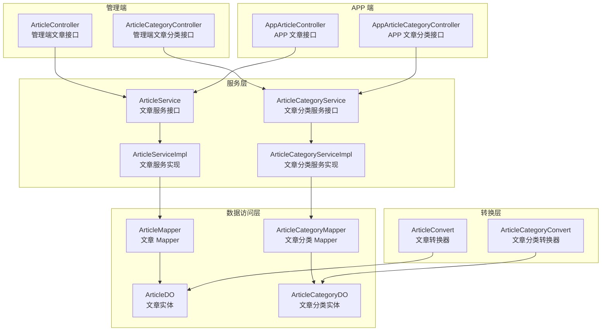
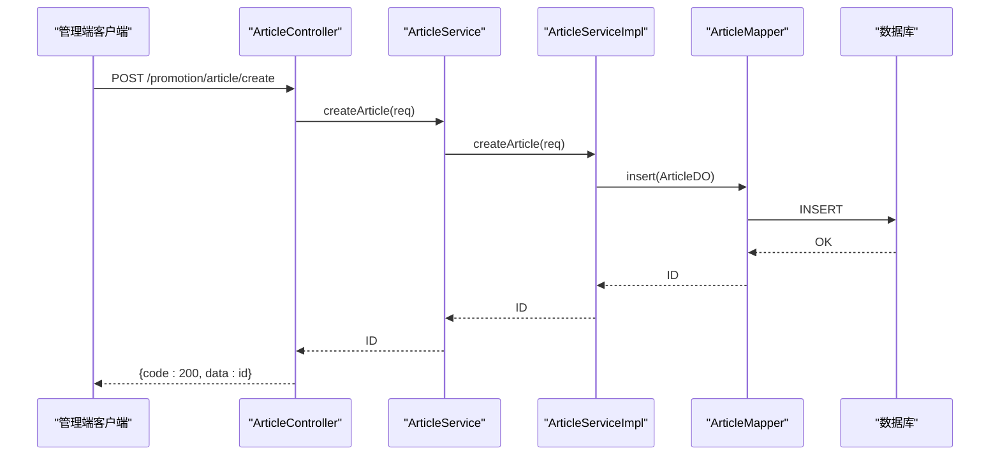
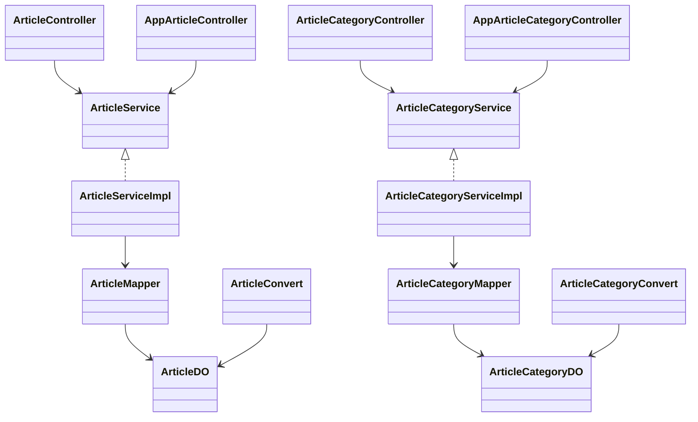

# 文章管理

<cite>
**本文引用的文件**
- [ArticleController.java](file://yudao-module-mall/yudao-module-promotion/src/main/java/cn/iocoder/yudao/module/promotion/controller/admin/article/ArticleController.java)
- [ArticleCategoryController.java](file://yudao-module-mall/yudao-module-promotion/src/main/java/cn/iocoder/yudao/module/promotion/controller/admin/article/ArticleCategoryController.java)
- [AppArticleCategoryController.java](file://yudao-module-mall/yudao-module-promotion/src/main/java/cn/iocoder/yudao/module/promotion/controller/app/article/AppArticleCategoryController.java)
- [ArticleService.java](file://yudao-module-mall/yudao-module-promotion/src/main/java/cn/iocoder/yudao/module/promotion/service/article/ArticleService.java)
- [ArticleCategoryService.java](file://yudao-module-mall/yudao-module-promotion/src/main/java/cn/iocoder/yudao/module/promotion/service/article/ArticleCategoryService.java)
- [ArticleServiceImpl.java](file://yudao-module-mall/yudao-module-promotion/src/main/java/cn/iocoder/yudao/module/promotion/service/article/ArticleServiceImpl.java)
- [ArticleCategoryServiceImpl.java](file://yudao-module-mall/yudao-module-promotion/src/main/java/cn/iocoder/yudao/module/promotion/service/article/ArticleCategoryServiceImpl.java)
- [ArticleDO.java](file://yudao-module-mall/yudao-module-promotion/src/main/java/cn/iocoder/yudao/module/promotion/dal/dataobject/article/ArticleDO.java)
- [ArticleCategoryDO.java](file://yudao-module-mall/yudao-module-promotion/src/main/java/cn/iocoder/yudao/module/promotion/dal/dataobject/article/ArticleCategoryDO.java)
- [ArticleMapper.java](file://yudao-module-mall/yudao-module-promotion/src/main/java/cn/iocoder/yudao/module/promotion/dal/mysql/article/ArticleMapper.java)
- [ArticleCategoryMapper.java](file://yudao-module-mall/yudao-module-promotion/src/main/java/cn/iocoder/yudao/module/promotion/dal/mysql/article/ArticleCategoryMapper.java)
- [ArticleConvert.java](file://yudao-module-mall/yudao-module-promotion/src/main/java/cn/iocoder/yudao/module/promotion/convert/article/ArticleConvert.java)
- [ArticleCategoryConvert.java](file://yudao-module-mall/yudao-module-promotion/src/main/java/cn/iocoder/yudao/module/promotion/convert/article/ArticleCategoryConvert.java)
- [ArticleCreateReqVO.java](file://yudao-module-mall/yudao-module-promotion/src/main/java/cn/iocoder/yudao/module/promotion/controller/admin/article/vo/article/ArticleCreateReqVO.java)
- [ArticleUpdateReqVO.java](file://yudao-module-mall/yudao-module-promotion/src/main/java/cn/iocoder/yudao/module/promotion/controller/admin/article/vo/article/ArticleUpdateReqVO.java)
- [ArticlePageReqVO.java](file://yudao-module-mall/yudao-module-promotion/src/main/java/cn/iocoder/yudao/module/promotion/controller/admin/article/vo/article/ArticlePageReqVO.java)
- [ArticleRespVO.java](file://yudao-module-mall/yudao-module-promotion/src/main/java/cn/iocoder/yudao/module/promotion/controller/admin/article/vo/article/ArticleRespVO.java)
- [ArticleCategoryCreateReqVO.java](file://yudao-module-mall/yudao-module-promotion/src/main/java/cn/iocoder/yudao/module/promotion/controller/admin/article/vo/category/ArticleCategoryCreateReqVO.java)
- [ArticleCategoryUpdateReqVO.java](file://yudao-module-mall/yudao-module-promotion/src/main/java/cn/iocoder/yudao/module/promotion/controller/admin/article/vo/category/ArticleCategoryUpdateReqVO.java)
- [ArticleCategoryPageReqVO.java](file://yudao-module-mall/yudao-module-promotion/src/main/java/cn/iocoder/yudao/module/promotion/controller/admin/article/vo/category/ArticleCategoryPageReqVO.java)
- [ArticleCategoryRespVO.java](file://yudao-module-mall/yudao-module-promotion/src/main/java/cn/iocoder/yudao/module/promotion/controller/admin/article/vo/category/ArticleCategoryRespVO.java)
- [ArticleCategorySimpleRespVO.java](file://yudao-module-mall/yudao-module-promotion/src/main/java/cn/iocoder/yudao/module/promotion/controller/admin/article/vo/category/ArticleCategorySimpleRespVO.java)
- [AppArticlePageReqVO.java](file://yudao-module-mall/yudao-module-promotion/src/main/java/cn/iocoder/yudao/module/promotion/controller/app/article/vo/article/AppArticlePageReqVO.java)
- [AppArticleRespVO.java](file://yudao-module-mall/yudao-module-promotion/src/main/java/cn/iocoder/yudao/module/promotion/controller/app/article/vo/article/AppArticleRespVO.java)
- [AppArticleCategoryRespVO.java](file://yudao-module-mall/yudao-module-promotion/src/main/java/cn/iocoder/yudao/module/promotion/controller/app/article/vo/category/AppArticleCategoryRespVO.java)
- [AppArticleController.java](file://yudao-module-mall/yudao-module-promotion/src/main/java/cn/iocoder/yudao/module/promotion/controller/app/article/AppArticleController.java)
- [CommonStatusEnum.java](file://yudao-framework/yudao-common/src/main/java/cn/iocoder/yudao/framework/common/enums/CommonStatusEnum.java)
- [BaseDO.java](file://yudao-framework/yudao-common/src/main/java/cn/iocoder/yudao/framework/mybatis/core/dataobject/BaseDO.java)
- [ruoyi-vue-pro.sql](file://sql/mysql/ruoyi-vue-pro.sql)
- [ruoyi-vue-pro-mall-2025-05-12.sql](file://sql/module/ruoyi-vue-pro-mall-2025-05-12.sql)
</cite>

## 目录
1. [引言](#引言)
2. [项目结构](#项目结构)
3. [核心组件](#核心组件)
4. [架构总览](#架构总览)
5. [详细组件分析](#详细组件分析)
6. [依赖分析](#依赖分析)
7. [性能考虑](#性能考虑)
8. [故障排查指南](#故障排查指南)
9. [结论](#结论)
10. [附录](#附录)

## 引言
本技术文档围绕“文章管理”功能展开，聚焦促销相关文章的全生命周期管理，包括创建、编辑、发布、分类、推荐位配置、前台展示与检索排序等。文档从数据模型、业务规则、接口设计、前后端交互到性能优化与缓存策略进行系统化梳理，帮助开发者快速理解并扩展该能力。

## 项目结构
文章管理位于“促销模块”中，采用典型的分层架构：控制层（Controller）、服务层（Service）、数据访问层（Mapper/DO）、转换层（Convert）以及 VO/DTO 层。管理端与 APP 端分别提供独立的控制器以满足不同前端需求。

图表来源
- [ArticleController.java:1-75](file://yudao-module-mall/yudao-module-promotion/src/main/java/cn/iocoder/yudao/module/promotion/controller/admin/article/ArticleController.java#L1-L75)
- [ArticleCategoryController.java:1-85](file://yudao-module-mall/yudao-module-promotion/src/main/java/cn/iocoder/yudao/module/promotion/controller/admin/article/ArticleCategoryController.java#L1-L85)
- [AppArticleController.java](file://yudao-module-mall/yudao-module-promotion/src/main/java/cn/iocoder/yudao/module/promotion/controller/app/article/AppArticleController.java)
- [AppArticleCategoryController.java:1-31](file://yudao-module-mall/yudao-module-promotion/src/main/java/cn/iocoder/yudao/module/promotion/controller/app/article/AppArticleCategoryController.java#L1-L31)
- [ArticleService.java:1-101](file://yudao-module-mall/yudao-module-promotion/src/main/java/cn/iocoder/yudao/module/promotion/service/article/ArticleService.java#L1-L101)
- [ArticleCategoryService.java:1-66](file://yudao-module-mall/yudao-module-promotion/src/main/java/cn/iocoder/yudao/module/promotion/service/article/ArticleCategoryService.java#L1-L66)
- [ArticleServiceImpl.java](file://yudao-module-mall/yudao-module-promotion/src/main/java/cn/iocoder/yudao/module/promotion/service/article/ArticleServiceImpl.java)
- [ArticleCategoryServiceImpl.java](file://yudao-module-mall/yudao-module-promotion/src/main/java/cn/iocoder/yudao/module/promotion/service/article/ArticleCategoryServiceImpl.java)
- [ArticleMapper.java](file://yudao-module-mall/yudao-module-promotion/src/main/java/cn/iocoder/yudao/module/promotion/dal/mysql/article/ArticleMapper.java)
- [ArticleCategoryMapper.java](file://yudao-module-mall/yudao-module-promotion/src/main/java/cn/iocoder/yudao/module/promotion/dal/mysql/article/ArticleCategoryMapper.java)
- [ArticleDO.java:1-82](file://yudao-module-mall/yudao-module-promotion/src/main/java/cn/iocoder/yudao/module/promotion/dal/dataobject/article/ArticleDO.java#L1-L82)
- [ArticleCategoryDO.java:1-50](file://yudao-module-mall/yudao-module-promotion/src/main/java/cn/iocoder/yudao/module/promotion/dal/dataobject/article/ArticleCategoryDO.java#L1-L50)
- [ArticleConvert.java:1-41](file://yudao-module-mall/yudao-module-promotion/src/main/java/cn/iocoder/yudao/module/promotion/convert/article/ArticleConvert.java#L1-L41)
- [ArticleCategoryConvert.java:1-37](file://yudao-module-mall/yudao-module-promotion/src/main/java/cn/iocoder/yudao/module/promotion/convert/article/ArticleCategoryConvert.java#L1-L37)

章节来源
- [ArticleController.java:1-75](file://yudao-module-mall/yudao-module-promotion/src/main/java/cn/iocoder/yudao/module/promotion/controller/admin/article/ArticleController.java#L1-L75)
- [ArticleCategoryController.java:1-85](file://yudao-module-mall/yudao-module-promotion/src/main/java/cn/iocoder/yudao/module/promotion/controller/admin/article/ArticleCategoryController.java#L1-L85)
- [AppArticleCategoryController.java:1-31](file://yudao-module-mall/yudao-module-promotion/src/main/java/cn/iocoder/yudao/module/promotion/controller/app/article/AppArticleCategoryController.java#L1-L31)

## 核心组件
- 控制层：提供 REST 接口，负责参数接收、鉴权与结果封装。
- 服务层：定义业务契约，处理推荐位、分页、计数等核心逻辑。
- 数据访问层：基于 MyBatis Plus 的 Mapper 与 DO 实体，完成持久化。
- 转换层：MapStruct 将 DO/VO 转换为响应对象，减少重复映射代码。
- VO/DTO：Admin 与 APP 端分别定义请求与响应对象，隔离前端差异。

章节来源
- [ArticleService.java:1-101](file://yudao-module-mall/yudao-module-promotion/src/main/java/cn/iocoder/yudao/module/promotion/service/article/ArticleService.java#L1-L101)
- [ArticleCategoryService.java:1-66](file://yudao-module-mall/yudao-module-promotion/src/main/java/cn/iocoder/yudao/module/promotion/service/article/ArticleCategoryService.java#L1-L66)
- [ArticleDO.java:1-82](file://yudao-module-mall/yudao-module-promotion/src/main/java/cn/iocoder/yudao/module/promotion/dal/dataobject/article/ArticleDO.java#L1-L82)
- [ArticleCategoryDO.java:1-50](file://yudao-module-mall/yudao-module-promotion/src/main/java/cn/iocoder/yudao/module/promotion/dal/dataobject/article/ArticleCategoryDO.java#L1-L50)
- [ArticleConvert.java:1-41](file://yudao-module-mall/yudao-module-promotion/src/main/java/cn/iocoder/yudao/module/promotion/convert/article/ArticleConvert.java#L1-L41)
- [ArticleCategoryConvert.java:1-37](file://yudao-module-mall/yudao-module-promotion/src/main/java/cn/iocoder/yudao/module/promotion/convert/article/ArticleCategoryConvert.java#L1-L37)

## 架构总览
文章管理采用“管理端 + APP 端”的双入口设计，统一通过服务层协调数据访问与转换。推荐位字段（热门、轮播）在服务层暴露查询方法，便于首页与专题页聚合展示。

图表来源
- [ArticleController.java:33-38](file://yudao-module-mall/yudao-module-promotion/src/main/java/cn/iocoder/yudao/module/promotion/controller/admin/article/ArticleController.java#L33-L38)
- [ArticleService.java](file://yudao-module-mall/yudao-module-promotion/src/main/java/cn/iocoder/yudao/module/promotion/service/article/ArticleService.java#L26)
- [ArticleServiceImpl.java](file://yudao-module-mall/yudao-module-promotion/src/main/java/cn/iocoder/yudao/module/promotion/service/article/ArticleServiceImpl.java)
- [ArticleMapper.java](file://yudao-module-mall/yudao-module-promotion/src/main/java/cn/iocoder/yudao/module/promotion/dal/mysql/article/ArticleMapper.java)

## 详细组件分析

### 数据模型设计
- 文章实体（ArticleDO）
  - 字段要点：分类编号、SPU 关联、标题、作者、封面图、简介、浏览量、排序、状态、推荐位（热门/轮播）、内容。
  - 关系：与分类表一对多；可关联商品 SPU。
- 文章分类实体（ArticleCategoryDO）
  - 字段要点：名称、图标、状态、排序。
  - 关系：与文章表一对多。

图表来源
- [ArticleDO.java:1-82](file://yudao-module-mall/yudao-module-promotion/src/main/java/cn/iocoder/yudao/module/promotion/dal/dataobject/article/ArticleDO.java#L1-L82)
- [ArticleCategoryDO.java:1-50](file://yudao-module-mall/yudao-module-promotion/src/main/java/cn/iocoder/yudao/module/promotion/dal/dataobject/article/ArticleCategoryDO.java#L1-L50)
- [ruoyi-vue-pro-mall-2025-05-12.sql:356-368](file://sql/module/ruoyi-vue-pro-mall-2025-05-12.sql#L356-L368)

章节来源
- [ArticleDO.java:23-81](file://yudao-module-mall/yudao-module-promotion/src/main/java/cn/iocoder/yudao/module/promotion/dal/dataobject/article/ArticleDO.java#L23-L81)
- [ArticleCategoryDO.java:23-49](file://yudao-module-mall/yudao-module-promotion/src/main/java/cn/iocoder/yudao/module/promotion/dal/dataobject/article/ArticleCategoryDO.java#L23-L49)

### 业务规则与状态管理
- 状态枚举：统一使用通用状态枚举，支持启用/禁用。
- 推荐位：热门与轮播两个布尔字段，用于首页与专题页聚合。
- 发布与排序：通过排序字段与状态共同控制展示顺序与可见性。
- 计数：提供浏览量增加接口，便于统计与运营分析。

章节来源
- [CommonStatusEnum.java](file://yudao-framework/yudao-common/src/main/java/cn/iocoder/yudao/framework/common/enums/CommonStatusEnum.java)
- [ArticleService.java:94-98](file://yudao-module-mall/yudao-module-promotion/src/main/java/cn/iocoder/yudao/module/promotion/service/article/ArticleService.java#L94-L98)
- [ArticleDO.java:66-75](file://yudao-module-mall/yudao-module-promotion/src/main/java/cn/iocoder/yudao/module/promotion/dal/dataobject/article/ArticleDO.java#L66-L75)

### 文章分类体系
- 管理端分类接口：支持创建、更新、删除、详情、分页、获取精简列表（仅启用状态）。
- APP 端分类接口：提供分类列表查询，用于前端选择与导航。
- 精简列表用途：下拉选择、侧边栏导航等场景。

章节来源
- [ArticleCategoryController.java:33-82](file://yudao-module-mall/yudao-module-promotion/src/main/java/cn/iocoder/yudao/module/promotion/controller/admin/article/ArticleCategoryController.java#L33-L82)
- [AppArticleCategoryController.java:30-31](file://yudao-module-mall/yudao-module-promotion/src/main/java/cn/iocoder/yudao/module/promotion/controller/app/article/AppArticleCategoryController.java#L30-L31)
- [ArticleCategoryService.java:57-63](file://yudao-module-mall/yudao-module-promotion/src/main/java/cn/iocoder/yudao/module/promotion/service/article/ArticleCategoryService.java#L57-L63)

### 文章 CRUD 与分页
- 管理端文章接口：创建、更新、删除、详情、分页。
- VO 映射：通过转换器将 DO 映射为 Admin/APP 响应对象。
- 分页：支持 Admin 分页与 APP 分页两种请求对象。

章节来源
- [ArticleController.java:33-72](file://yudao-module-mall/yudao-module-promotion/src/main/java/cn/iocoder/yudao/module/promotion/controller/admin/article/ArticleController.java#L33-L72)
- [ArticleService.java:60-83](file://yudao-module-mall/yudao-module-promotion/src/main/java/cn/iocoder/yudao/module/promotion/service/article/ArticleService.java#L60-L83)
- [ArticleConvert.java:24-36](file://yudao-module-mall/yudao-module-promotion/src/main/java/cn/iocoder/yudao/module/promotion/convert/article/ArticleConvert.java#L24-L36)

### 推荐位与首页展示
- 服务层提供按推荐位查询文章列表的能力，便于首页“热门”“轮播”区域加载。
- APP 端分页查询支持推荐位筛选，提升前端聚合效率。

章节来源
- [ArticleService.java](file://yudao-module-mall/yudao-module-promotion/src/main/java/cn/iocoder/yudao/module/promotion/service/article/ArticleService.java#L75)
- [AppArticlePageReqVO.java](file://yudao-module-mall/yudao-module-promotion/src/main/java/cn/iocoder/yudao/module/promotion/controller/app/article/vo/article/AppArticlePageReqVO.java)

### 前端展示逻辑
- 分类展示：根据分类 ID 查询文章分页，支持排序与状态过滤。
- 首页推荐：通过推荐位字段聚合热门与轮播文章。
- 搜索排序：建议在 APP 端分页请求中结合标题模糊匹配与排序字段综合排序。

章节来源
- [ArticleController.java:66-72](file://yudao-module-mall/yudao-module-promotion/src/main/java/cn/iocoder/yudao/module/promotion/controller/admin/article/ArticleController.java#L66-L72)
- [ArticleService.java:60-83](file://yudao-module-mall/yudao-module-promotion/src/main/java/cn/iocoder/yudao/module/promotion/service/article/ArticleService.java#L60-L83)

### 编辑与审核流程（建议）
- 内容编辑：管理端创建/更新文章，填写标题、封面、简介、内容、分类、排序、状态与推荐位。
- 审核策略：可引入状态流转（草稿/待审/已发布），配合权限与审计日志完善合规流程。
- 发布策略：设置发布时间字段可实现定时发布；当前仓库未见发布时间字段，可在 DO 中扩展。

章节来源
- [ArticleCreateReqVO.java](file://yudao-module-mall/yudao-module-promotion/src/main/java/cn/iocoder/yudao/module/promotion/controller/admin/article/vo/article/ArticleCreateReqVO.java)
- [ArticleUpdateReqVO.java](file://yudao-module-mall/yudao-module-promotion/src/main/java/cn/iocoder/yudao/module/promotion/controller/admin/article/vo/article/ArticleUpdateReqVO.java)
- [ArticleDO.java:39-79](file://yudao-module-mall/yudao-module-promotion/src/main/java/cn/iocoder/yudao/module/promotion/dal/dataobject/article/ArticleDO.java#L39-L79)

### SEO 优化（建议）
- 标题与简介：确保标题简洁明确，简介适配摘要展示。
- 封面图：规范尺寸与格式，利于社交分享与搜索引擎抓取。
- 分类语义：合理使用分类与标签（如后续扩展），提升页面主题一致性。

章节来源
- [ArticleDO.java:41-53](file://yudao-module-mall/yudao-module-promotion/src/main/java/cn/iocoder/yudao/module/promotion/dal/dataobject/article/ArticleDO.java#L41-L53)

### 评论管理（建议）
- 可扩展评论表与文章关联，提供评论开关、审核与置顶功能。
- 与文章浏览量统计解耦，避免评论影响浏览量指标。

章节来源
- [ArticleDO.java:55-57](file://yudao-module-mall/yudao-module-promotion/src/main/java/cn/iocoder/yudao/module/promotion/dal/dataobject/article/ArticleDO.java#L55-L57)

## 依赖分析
- 控制器依赖服务接口，服务实现依赖 Mapper 与 DO。
- 转换器贯穿 DO 与 VO，降低重复映射成本。
- 统一基类 BaseDO 提供创建/更新时间等通用字段。

图表来源
- [ArticleController.java:30-31](file://yudao-module-mall/yudao-module-promotion/src/main/java/cn/iocoder/yudao/module/promotion/controller/admin/article/ArticleController.java#L30-L31)
- [ArticleCategoryController.java:30-31](file://yudao-module-mall/yudao-module-promotion/src/main/java/cn/iocoder/yudao/module/promotion/controller/admin/article/ArticleCategoryController.java#L30-L31)
- [AppArticleController.java](file://yudao-module-mall/yudao-module-promotion/src/main/java/cn/iocoder/yudao/module/promotion/controller/app/article/AppArticleController.java)
- [AppArticleCategoryController.java:27-28](file://yudao-module-mall/yudao-module-promotion/src/main/java/cn/iocoder/yudao/module/promotion/controller/app/article/AppArticleCategoryController.java#L27-L28)
- [ArticleService.java](file://yudao-module-mall/yudao-module-promotion/src/main/java/cn/iocoder/yudao/module/promotion/service/article/ArticleService.java#L18)
- [ArticleCategoryService.java](file://yudao-module-mall/yudao-module-promotion/src/main/java/cn/iocoder/yudao/module/promotion/service/article/ArticleCategoryService.java#L17)
- [ArticleServiceImpl.java](file://yudao-module-mall/yudao-module-promotion/src/main/java/cn/iocoder/yudao/module/promotion/service/article/ArticleServiceImpl.java)
- [ArticleCategoryServiceImpl.java](file://yudao-module-mall/yudao-module-promotion/src/main/java/cn/iocoder/yudao/module/promotion/service/article/ArticleCategoryServiceImpl.java)
- [ArticleMapper.java](file://yudao-module-mall/yudao-module-promotion/src/main/java/cn/iocoder/yudao/module/promotion/dal/mysql/article/ArticleMapper.java)
- [ArticleCategoryMapper.java](file://yudao-module-mall/yudao-module-promotion/src/main/java/cn/iocoder/yudao/module/promotion/dal/mysql/article/ArticleCategoryMapper.java)
- [ArticleDO.java](file://yudao-module-mall/yudao-module-promotion/src/main/java/cn/iocoder/yudao/module/promotion/dal/dataobject/article/ArticleDO.java#L23)
- [ArticleCategoryDO.java](file://yudao-module-mall/yudao-module-promotion/src/main/java/cn/iocoder/yudao/module/promotion/dal/dataobject/article/ArticleCategoryDO.java#L23)
- [ArticleConvert.java](file://yudao-module-mall/yudao-module-promotion/src/main/java/cn/iocoder/yudao/module/promotion/convert/article/ArticleConvert.java#L22)
- [ArticleCategoryConvert.java](file://yudao-module-mall/yudao-module-promotion/src/main/java/cn/iocoder/yudao/module/promotion/convert/article/ArticleCategoryConvert.java#L20)

章节来源
- [BaseDO.java](file://yudao-framework/yudao-common/src/main/java/cn/iocoder/yudao/framework/mybatis/core/dataobject/BaseDO.java)

## 性能考虑
- 分页与排序：优先在数据库层面完成排序与分页，避免一次性加载过多数据。
- 推荐位缓存：对热门/轮播文章列表进行短期缓存，降低高频查询压力。
- 浏览量异步：浏览量增加可采用消息队列或延时任务异步落库，避免阻塞主流程。
- 索引策略：为分类 ID、状态、标题（模糊匹配）建立合适索引，提升查询效率。
- 前端懒加载：首页与分类页采用分页懒加载，结合虚拟列表优化长列表渲染。

## 故障排查指南
- 权限不足：管理端接口均带有权限注解，确认菜单与权限配置正确。
- 参数校验失败：检查 VO 对象字段约束与示例值是否符合接口要求。
- 数据不存在：查询详情或分页时确认主键与筛选条件是否正确。
- 排序异常：确认排序字段与状态组合是否满足预期。

章节来源
- [ruoyi-vue-pro.sql:1865-1867](file://sql/mysql/ruoyi-vue-pro.sql#L1865-L1867)
- [ArticleController.java:35-54](file://yudao-module-mall/yudao-module-promotion/src/main/java/cn/iocoder/yudao/module/promotion/controller/admin/article/ArticleController.java#L35-L54)
- [ArticleCategoryController.java:35-54](file://yudao-module-mall/yudao-module-promotion/src/main/java/cn/iocoder/yudao/module/promotion/controller/admin/article/ArticleCategoryController.java#L35-L54)

## 结论
文章管理模块以清晰的分层与职责划分支撑了促销类文章的全生命周期管理。通过推荐位与分类体系，能够灵活支撑首页与专题页的展示需求。建议后续补充发布时间、评论与审核流程，并结合缓存与异步策略持续优化性能与用户体验。

## 附录
- 菜单与权限：管理端菜单包含“文章列表”“文章管理查询/创建/更新/删除”等权限点，确保接口安全。
- 数据库脚本：文章与分类表结构由 SQL 脚本定义，迁移时需注意字段兼容性。

章节来源
- [ruoyi-vue-pro.sql:1865-1867](file://sql/mysql/ruoyi-vue-pro.sql#L1865-L1867)
- [ruoyi-vue-pro-mall-2025-05-12.sql:356-368](file://sql/module/ruoyi-vue-pro-mall-2025-05-12.sql#L356-L368)