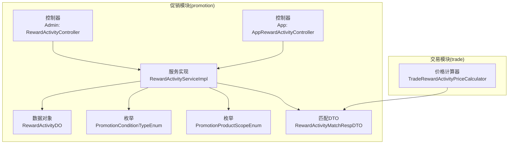
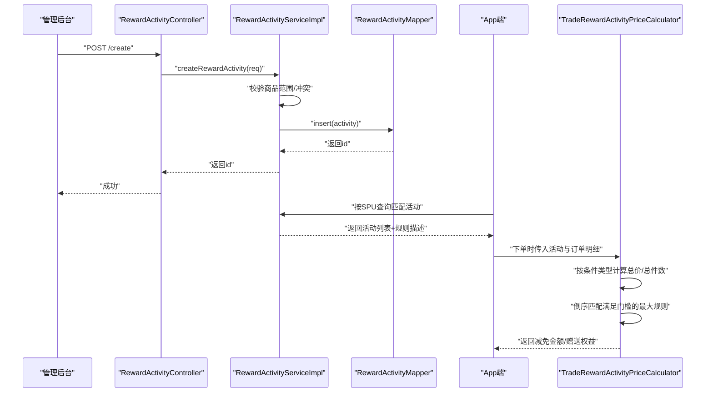
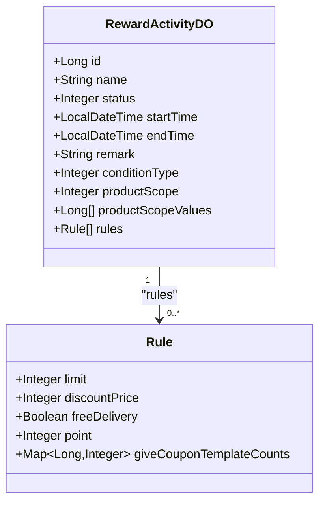
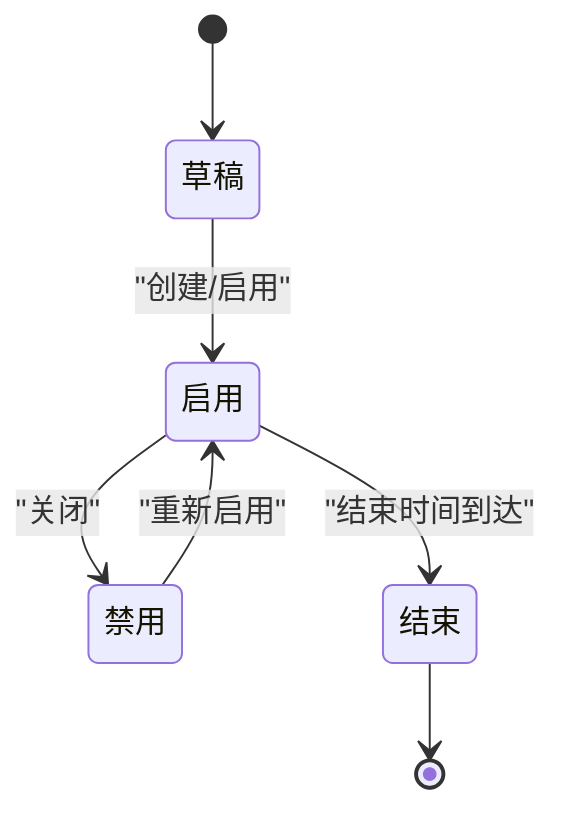
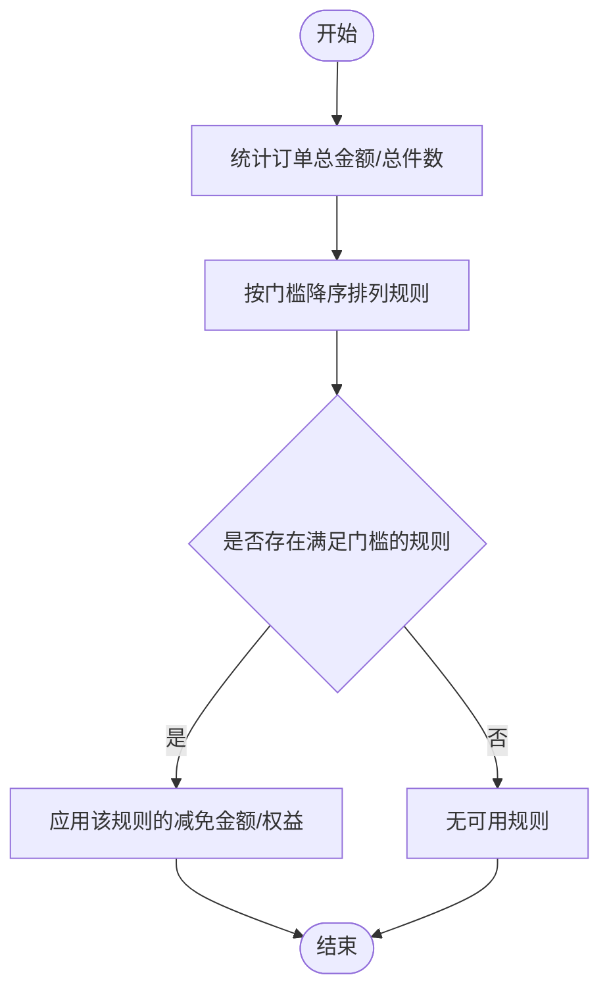
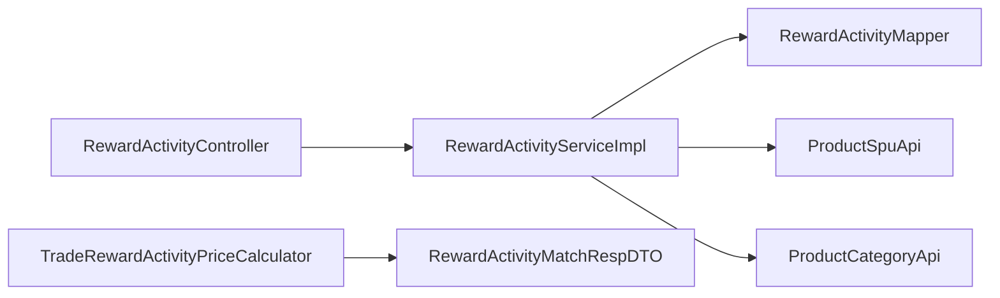

# 满减活动管理

<cite>
**本文引用的文件**   
- [RewardActivityDO.java](file://qiji-module-mall/qiji-module-promotion/src/main/java/com.qiji.cps/module/promotion/dal/dataobject/reward/RewardActivityDO.java)
- [RewardActivityService.java](file://qiji-module-mall/qiji-module-promotion/src/main/java/com.qiji.cps/module/promotion/service/reward/RewardActivityService.java)
- [RewardActivityServiceImpl.java](file://qiji-module-mall/qiji-module-promotion/src/main/java/com.qiji.cps/module/promotion/service/reward/RewardActivityServiceImpl.java)
- [RewardActivityController.java](file://qiji-module-mall/qiji-module-promotion/src/main/java/com.qiji.cps/module/promotion/controller/admin/reward/RewardActivityController.java)
- [RewardActivityBaseVO.java](file://qiji-module-mall/qiji-module-promotion/src/main/java/com.qiji.cps/module/promotion/controller/admin/reward/vo/RewardActivityBaseVO.java)
- [RewardActivityCreateReqVO.java](file://qiji-module-mall/qiji-module-promotion/src/main/java/com.qiji.cps/module/promotion/controller/admin/reward/vo/RewardActivityCreateReqVO.java)
- [RewardActivityRespVO.java](file://qiji-module-mall/qiji-module-promotion/src/main/java/com.qiji.cps/module/promotion/controller/admin/reward/vo/RewardActivityRespVO.java)
- [AppRewardActivityController.java](file://qiji-module-mall/qiji-module-promotion/src/main/java/com.qiji.cps/module/promotion/controller/app/reward/AppRewardActivityController.java)
- [AppRewardActivityRespVO.java](file://qiji-module-mall/qiji-module-promotion/src/main/java/com.qiji.cps/module/promotion/controller/app/reward/vo/AppRewardActivityRespVO.java)
- [RewardActivityApi.java](file://qiji-module-mall/qiji-module-promotion/src/main/java/com.qiji.cps/module/promotion/api/reward/RewardActivityApi.java)
- [RewardActivityApiImpl.java](file://qiji-module-mall/qiji-module-promotion/src/main/java/com.qiji.cps/module/promotion/api/reward/RewardActivityApiImpl.java)
- [RewardActivityMatchRespDTO.java](file://qiji-module-mall/qiji-module-promotion/src/main/java/com.qiji.cps/module/promotion/api/reward/dto/RewardActivityMatchRespDTO.java)
- [PromotionConditionTypeEnum.java](file://qiji-module-mall/qiji-module-promotion/src/main/java/com.qiji.cps/module/promotion/enums/common/PromotionConditionTypeEnum.java)
- [PromotionProductScopeEnum.java](file://qiji-module-mall/qiji-module-promotion/src/main/java/com.qiji.cps/module/promotion/enums/common/PromotionProductScopeEnum.java)
- [TradeRewardActivityPriceCalculator.java](file://qiji-module-mall/qiji-module-trade/src/main/java/com.qiji.cps/module/trade/service/price/calculator/TradeRewardActivityPriceCalculator.java)
</cite>

## 目录
1. [简介](#简介)
2. [项目结构](#项目结构)
3. [核心组件](#核心组件)
4. [架构总览](#架构总览)
5. [详细组件分析](#详细组件分析)
6. [依赖关系分析](#依赖关系分析)
7. [性能考虑](#性能考虑)
8. [故障排查指南](#故障排查指南)
9. [结论](#结论)
10. [附录](#附录)

## 简介
本技术文档围绕“满减活动管理”功能展开，系统性阐述满减活动的业务概念、数据模型、配置规则、生命周期管理、前后端交互流程、价格计算与叠加策略、以及性能优化与并发控制方案。目标读者既包括后端开发工程师，也包括产品与运营人员，帮助快速理解并高效落地满减活动的创建、配置、发布与管理。

## 项目结构
满减活动相关能力主要分布在“促销模块（promotion）”与“交易模块（trade）”中：
- 促销模块负责活动的创建、编辑、关闭、删除、分页查询与匹配查询；
- 交易模块负责在下单结算时根据活动规则进行价格计算与优惠应用；
- 控制器层提供管理后台与用户 App 的接口；
- VO/DTO 层负责请求与响应的数据结构；
- 枚举定义了条件类型与商品范围等业务约束。

图表来源
- [RewardActivityController.java:1-83](file://qiji-module-mall/qiji-module-promotion/src/main/java/com.qiji.cps/module/promotion/controller/admin/reward/RewardActivityController.java#L1-L83)
- [AppRewardActivityController.java:1-31](file://qiji-module-mall/qiji-module-promotion/src/main/java/com.qiji.cps/module/promotion/controller/app/reward/AppRewardActivityController.java#L1-L31)
- [RewardActivityServiceImpl.java:1-240](file://qiji-module-mall/qiji-module-promotion/src/main/java/com.qiji.cps/module/promotion/service/reward/RewardActivityServiceImpl.java#L1-L240)
- [RewardActivityDO.java:1-120](file://qiji-module-mall/qiji-module-promotion/src/main/java/com.qiji.cps/module/promotion/dal/dataobject/reward/RewardActivityDO.java#L1-L120)
- [PromotionConditionTypeEnum.java:1-38](file://qiji-module-mall/qiji-module-promotion/src/main/java/com.qiji.cps/module/promotion/enums/common/PromotionConditionTypeEnum.java#L1-L38)
- [PromotionProductScopeEnum.java:1-52](file://qiji-module-mall/qiji-module-promotion/src/main/java/com.qiji.cps/module/promotion/enums/common/PromotionProductScopeEnum.java#L1-L52)
- [RewardActivityMatchRespDTO.java:1-118](file://qiji-module-mall/qiji-module-promotion/src/main/java/com.qiji.cps/module/promotion/api/reward/dto/RewardActivityMatchRespDTO.java#L1-L118)
- [TradeRewardActivityPriceCalculator.java:129-160](file://qiji-module-mall/qiji-module-trade/src/main/java/com.qiji.cps/module/trade/service/price/calculator/TradeRewardActivityPriceCalculator.java#L129-L160)

章节来源
- [RewardActivityController.java:1-83](file://qiji-module-mall/qiji-module-promotion/src/main/java/com.qiji.cps/module/promotion/controller/admin/reward/RewardActivityController.java#L1-L83)
- [AppRewardActivityController.java:1-31](file://qiji-module-mall/qiji-module-promotion/src/main/java/com.qiji.cps/module/promotion/controller/app/reward/AppRewardActivityController.java#L1-L31)
- [RewardActivityServiceImpl.java:1-240](file://qiji-module-mall/qiji-module-promotion/src/main/java/com.qiji.cps/module/promotion/service/reward/RewardActivityServiceImpl.java#L1-L240)
- [RewardActivityDO.java:1-120](file://qiji-module-mall/qiji-module-promotion/src/main/java/com.qiji.cps/module/promotion/dal/dataobject/reward/RewardActivityDO.java#L1-L120)
- [PromotionConditionTypeEnum.java:1-38](file://qiji-module-mall/qiji-module-promotion/src/main/java/com.qiji.cps/module/promotion/enums/common/PromotionConditionTypeEnum.java#L1-L38)
- [PromotionProductScopeEnum.java:1-52](file://qiji-module-mall/qiji-module-promotion/src/main/java/com.qiji.cps/module/promotion/enums/common/PromotionProductScopeEnum.java#L1-L52)
- [RewardActivityMatchRespDTO.java:1-118](file://qiji-module-mall/qiji-module-promotion/src/main/java/com.qiji.cps/module/promotion/api/reward/dto/RewardActivityMatchRespDTO.java#L1-L118)
- [TradeRewardActivityPriceCalculator.java:129-160](file://qiji-module-mall/qiji-module-trade/src/main/java/com.qiji.cps/module/trade/service/price/calculator/TradeRewardActivityPriceCalculator.java#L129-L160)

## 核心组件
- 数据模型（DO）
  - 活动基本信息：标题、状态、起止时间、备注
  - 条件类型：满 N 元 或 满 N 件
  - 商品范围：全部、指定商品（SPU）、指定品类
  - 优惠规则数组：门槛、减免金额、包邮、赠送积分、赠送优惠券模板及数量
- 服务接口与实现
  - 提供创建、更新、关闭、删除、分页查询、按 SPU 匹配活动等能力
  - 校验商品范围合法性与活动时间/商品范围冲突
- 控制器
  - 管理后台：提供创建、更新、关闭、删除、详情、分页接口
  - 用户 App：提供活动列表与详情查询接口
- 价格计算
  - 在订单结算阶段，按条件类型选择“总价/总件数”，倒序匹配满足门槛的最大规则，计算减免金额与赠送权益

章节来源
- [RewardActivityDO.java:1-120](file://qiji-module-mall/qiji-module-promotion/src/main/java/com.qiji.cps/module/promotion/dal/dataobject/reward/RewardActivityDO.java#L1-L120)
- [RewardActivityService.java:1-106](file://qiji-module-mall/qiji-module-promotion/src/main/java/com.qiji.cps/module/promotion/service/reward/RewardActivityService.java#L1-L106)
- [RewardActivityServiceImpl.java:1-240](file://qiji-module-mall/qiji-module-promotion/src/main/java/com.qiji.cps/module/promotion/service/reward/RewardActivityServiceImpl.java#L1-L240)
- [RewardActivityController.java:1-83](file://qiji-module-mall/qiji-module-promotion/src/main/java/com.qiji.cps/module/promotion/controller/admin/reward/RewardActivityController.java#L1-L83)
- [AppRewardActivityController.java:1-31](file://qiji-module-mall/qiji-module-promotion/src/main/java/com.qiji.cps/module/promotion/controller/app/reward/AppRewardActivityController.java#L1-L31)
- [TradeRewardActivityPriceCalculator.java:129-160](file://qiji-module-mall/qiji-module-trade/src/main/java/com.qiji.cps/module/trade/service/price/calculator/TradeRewardActivityPriceCalculator.java#L129-L160)

## 架构总览
满减活动从“创建配置”到“前端展示与下单使用”的整体流程如下：

图表来源
- [RewardActivityController.java:32-37](file://qiji-module-mall/qiji-module-promotion/src/main/java/com.qiji.cps/module/promotion/controller/admin/reward/RewardActivityController.java#L32-L37)
- [RewardActivityServiceImpl.java:47-60](file://qiji-module-mall/qiji-module-promotion/src/main/java/com.qiji.cps/module/promotion/service/reward/RewardActivityServiceImpl.java#L47-L60)
- [RewardActivityMatchRespDTO.java:19-71](file://qiji-module-mall/qiji-module-promotion/src/main/java/com.qiji.cps/module/promotion/api/reward/dto/RewardActivityMatchRespDTO.java#L19-L71)
- [TradeRewardActivityPriceCalculator.java:129-160](file://qiji-module-mall/qiji-module-trade/src/main/java/com.qiji.cps/module/trade/service/price/calculator/TradeRewardActivityPriceCalculator.java#L129-L160)

## 详细组件分析

### 数据模型与字段定义
- 活动基本信息
  - 标题、状态、起止时间、备注
- 条件类型
  - 满 N 元 或 满 N 件（枚举定义）
- 商品范围
  - 全部、指定商品（SPU）、指定品类（枚举定义）
- 优惠规则数组
  - 门槛（分）、减免金额（分）、是否包邮、赠送积分、赠送优惠券模板及数量

图表来源
- [RewardActivityDO.java:30-117](file://qiji-module-mall/qiji-module-promotion/src/main/java/com.qiji.cps/module/promotion/dal/dataobject/reward/RewardActivityDO.java#L30-L117)

章节来源
- [RewardActivityDO.java:1-120](file://qiji-module-mall/qiji-module-promotion/src/main/java/com.qiji.cps/module/promotion/dal/dataobject/reward/RewardActivityDO.java#L1-L120)
- [PromotionConditionTypeEnum.java:1-38](file://qiji-module-mall/qiji-module-promotion/src/main/java/com.qiji.cps/module/promotion/enums/common/PromotionConditionTypeEnum.java#L1-L38)
- [PromotionProductScopeEnum.java:1-52](file://qiji-module-mall/qiji-module-promotion/src/main/java/com.qiji.cps/module/promotion/enums/common/PromotionProductScopeEnum.java#L1-L52)

### 业务规则与配置
- 条件类型
  - 满 N 元：以订单应付金额为条件
  - 满 N 件：以订单商品总件数为条件
- 门槛与减免
  - 门槛为“满 N 元/件”，单位为分
  - 减免金额为分，不可为负
- 赠送权益
  - 包邮、积分、优惠券模板及数量
- 商品范围与冲突校验
  - 时间段冲突时，任一时刻仅允许一个“全部范围”活动
  - “全部范围”与“指定范围”互斥
  - 指定品类与指定商品之间存在交叉校验
- 规则描述
  - 自动生成“满 X 元/件 + 减 Y 元/包邮/送积分/送优惠券”等描述

章节来源
- [RewardActivityBaseVO.java:25-101](file://qiji-module-mall/qiji-module-promotion/src/main/java/com.qiji.cps/module/promotion/controller/admin/reward/vo/RewardActivityBaseVO.java#L25-L101)
- [RewardActivityService.java:81-103](file://qiji-module-mall/qiji-module-promotion/src/main/java/com.qiji.cps/module/promotion/service/reward/RewardActivityService.java#L81-L103)
- [RewardActivityServiceImpl.java:117-175](file://qiji-module-mall/qiji-module-promotion/src/main/java/com.qiji.cps/module/promotion/service/reward/RewardActivityServiceImpl.java#L117-L175)

### 生命周期管理
- 创建：默认启用状态，插入数据库
- 更新：禁止对已关闭活动进行修改
- 关闭：将状态置为禁用
- 删除：仅允许对已关闭活动执行删除
- 自动状态流转
  - 服务层未实现自动上下线逻辑，需由运营在后台手动启停

图表来源
- [RewardActivityServiceImpl.java:47-101](file://qiji-module-mall/qiji-module-promotion/src/main/java/com.qiji.cps/module/promotion/service/reward/RewardActivityServiceImpl.java#L47-L101)

章节来源
- [RewardActivityServiceImpl.java:47-101](file://qiji-module-mall/qiji-module-promotion/src/main/java/com.qiji.cps/module/promotion/service/reward/RewardActivityServiceImpl.java#L47-L101)

### 前端展示与交互
- 管理后台
  - 提供创建、更新、关闭、删除、详情、分页接口
- 用户 App
  - 提供按 SPU 查询匹配活动的能力，返回活动列表与每条规则的描述
  - App 展示字段包含活动基础信息与规则描述

章节来源
- [RewardActivityController.java:32-80](file://qiji-module-mall/qiji-module-promotion/src/main/java/com.qiji.cps/module/promotion/controller/admin/reward/RewardActivityController.java#L32-L80)
- [AppRewardActivityController.java:25-31](file://qiji-module-mall/qiji-module-promotion/src/main/java/com.qiji.cps/module/promotion/controller/app/reward/AppRewardActivityController.java#L25-L31)
- [AppRewardActivityRespVO.java:10-34](file://qiji-module-mall/qiji-module-promotion/src/main/java/com.qiji.cps/module/promotion/controller/app/reward/vo/AppRewardActivityRespVO.java#L10-L34)
- [RewardActivityMatchRespDTO.java:19-71](file://qiji-module-mall/qiji-module-promotion/src/main/java/com.qiji.cps/module/promotion/api/reward/dto/RewardActivityMatchRespDTO.java#L19-L71)

### 价格计算与叠加规则
- 计算依据
  - 根据条件类型选择“订单应付总金额/总件数”
- 规则匹配
  - 将规则按门槛从高到低排序，取第一个满足门槛的规则作为本次使用的规则
- 减免金额
  - 以匹配规则的“减免金额”为准
- 赠送权益
  - 包邮、积分、优惠券在订单支付后发放

图表来源
- [TradeRewardActivityPriceCalculator.java:129-160](file://qiji-module-mall/qiji-module-trade/src/main/java/com.qiji.cps/module/trade/service/price/calculator/TradeRewardActivityPriceCalculator.java#L129-L160)

章节来源
- [TradeRewardActivityPriceCalculator.java:129-160](file://qiji-module-mall/qiji-module-trade/src/main/java/com.qiji.cps/module/trade/service/price/calculator/TradeRewardActivityPriceCalculator.java#L129-L160)

### API 与调用链
- 管理后台
  - POST /promotion/reward-activity/create
  - PUT /promotion/reward-activity/update
  - PUT /promotion/reward-activity/close
  - DELETE /promotion/reward-activity/delete
  - GET /promotion/reward-activity/get
  - GET /promotion/reward-activity/page
- App 端
  - GET /promotion/reward-activity/get（按 SPU 获取匹配活动）

章节来源
- [RewardActivityController.java:32-80](file://qiji-module-mall/qiji-module-promotion/src/main/java/com.qiji.cps/module/promotion/controller/admin/reward/RewardActivityController.java#L32-L80)
- [AppRewardActivityController.java:25-31](file://qiji-module-mall/qiji-module-promotion/src/main/java/com.qiji.cps/module/promotion/controller/app/reward/AppRewardActivityController.java#L25-L31)

## 依赖关系分析
- 组件耦合
  - 控制器依赖服务接口；服务实现依赖 Mapper 与产品 API（SPU/品类校验）
  - 价格计算依赖匹配 DTO 与订单明细
- 外部依赖
  - 产品模块的 SPU/品类 API 用于范围校验与分类映射
- 潜在循环依赖
  - 当前模块间为单向依赖，未发现循环

图表来源
- [RewardActivityServiceImpl.java:39-45](file://qiji-module-mall/qiji-module-promotion/src/main/java/com.qiji.cps/module/promotion/service/reward/RewardActivityServiceImpl.java#L39-L45)
- [RewardActivityMatchRespDTO.java:19-71](file://qiji-module-mall/qiji-module-promotion/src/main/java/com.qiji.cps/module/promotion/api/reward/dto/RewardActivityMatchRespDTO.java#L19-L71)
- [TradeRewardActivityPriceCalculator.java:129-160](file://qiji-module-mall/qiji-module-trade/src/main/java/com.qiji.cps/module/trade/service/price/calculator/TradeRewardActivityPriceCalculator.java#L129-L160)

章节来源
- [RewardActivityServiceImpl.java:39-45](file://qiji-module-mall/qiji-module-promotion/src/main/java/com.qiji.cps/module/promotion/service/reward/RewardActivityServiceImpl.java#L39-L45)
- [RewardActivityMatchRespDTO.java:19-71](file://qiji-module-mall/qiji-module-promotion/src/main/java/com.qiji.cps/module/promotion/api/reward/dto/RewardActivityMatchRespDTO.java#L19-L71)
- [TradeRewardActivityPriceCalculator.java:129-160](file://qiji-module-mall/qiji-module-trade/src/main/java/com.qiji.cps/module/trade/service/price/calculator/TradeRewardActivityPriceCalculator.java#L129-L160)

## 性能考虑
- 查询路径优化
  - 活动分页与按 SPU 匹配应结合索引与范围过滤，避免全表扫描
- 冲突校验
  - 时间段与商品范围冲突校验涉及多表与跨模块调用，建议缓存启用中的活动清单，并在变更时失效
- 规则匹配
  - 规则按门槛降序匹配，建议在入库时保证规则有序，减少运行时排序成本
- 并发控制
  - 活动状态变更与删除操作应采用乐观锁或分布式锁，防止并发修改导致的状态不一致
- 价格计算
  - 订单明细较大时，统计总金额/总件数应批量处理，避免多次 IO

## 故障排查指南
- 活动无法创建/更新
  - 检查商品范围与范围值是否有效（SPU/品类存在性校验）
  - 检查时间重叠与范围冲突（全部范围互斥、品类/商品交叉冲突）
- 活动被错误关闭/删除
  - 关闭/删除仅允许对特定状态执行，否则会抛出业务异常
- 规则描述不正确
  - 规则描述由服务层统一拼接，检查 limit/discountPrice/赠送权益字段是否为空或非法
- App 端未显示活动
  - 确认活动状态为启用、时间在有效期内、商品范围与 SPU 匹配

章节来源
- [RewardActivityServiceImpl.java:117-175](file://qiji-module-mall/qiji-module-promotion/src/main/java/com.qiji.cps/module/promotion/service/reward/RewardActivityServiceImpl.java#L117-L175)
- [RewardActivityServiceImpl.java:80-101](file://qiji-module-mall/qiji-module-promotion/src/main/java/com.qiji.cps/module/promotion/service/reward/RewardActivityServiceImpl.java#L80-L101)
- [RewardActivityService.java:81-103](file://qiji-module-mall/qiji-module-promotion/src/main/java/com.qiji.cps/module/promotion/service/reward/RewardActivityService.java#L81-L103)

## 结论
满减活动管理以清晰的数据模型与严格的校验规则为基础，配合灵活的条件类型与商品范围策略，能够支撑多样化的营销场景。通过服务层的冲突校验与 App 端的匹配查询，实现了从配置到使用的闭环。在价格计算环节，采用“按门槛降序匹配”的策略确保最优优惠生效。建议在生产环境中加强缓存与并发控制，保障高并发下的稳定性与一致性。

## 附录
- 配置示例（描述性说明）
  - 条件类型：满 N 元
  - 门槛：100 元（10000 分）
  - 减免金额：20 元（2000 分）
  - 赠送权益：包邮 + 100 积分 + 2 张优惠券（模板 A 1 张、模板 B 1 张）
  - 商品范围：指定商品（SPU 列表）
- 最佳实践
  - 规则门槛建议阶梯式递增，避免重叠
  - 赠送权益数量应明确上限，防止过度让利
  - 活动时间与商品范围尽量避免与其他活动重叠，减少冲突
  - 上线前进行充分的压测与回归测试，确保价格计算准确性