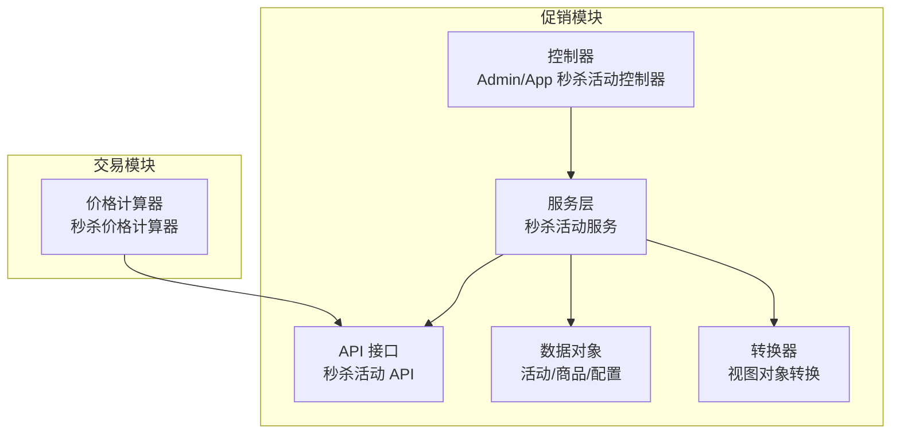
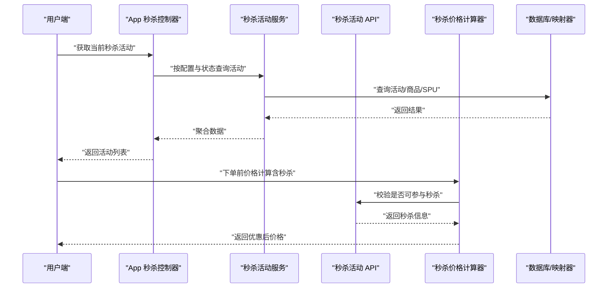
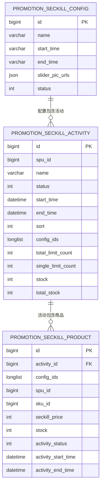
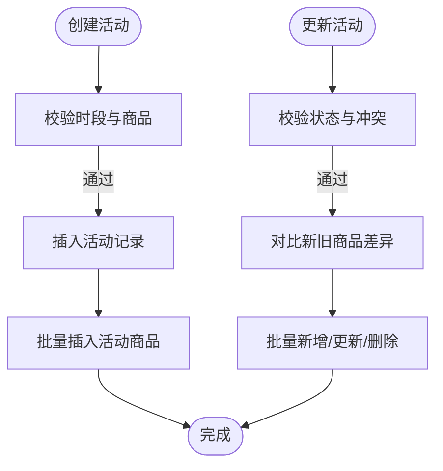
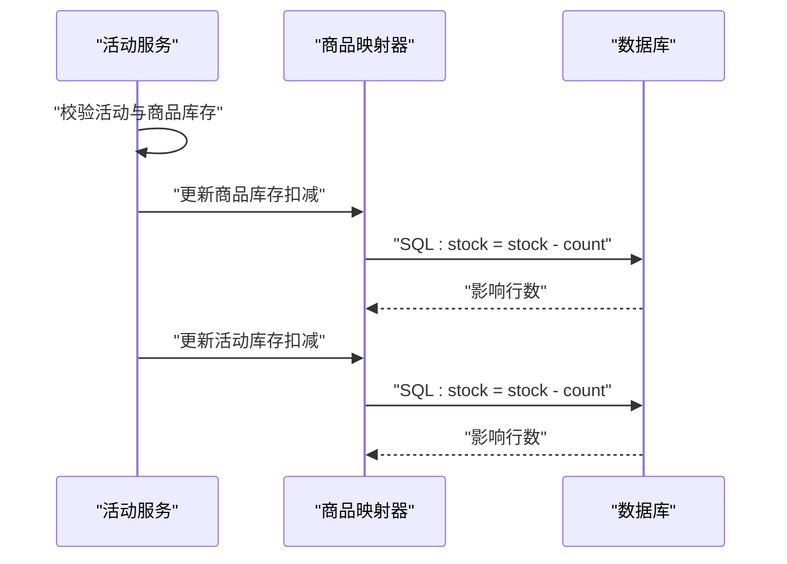
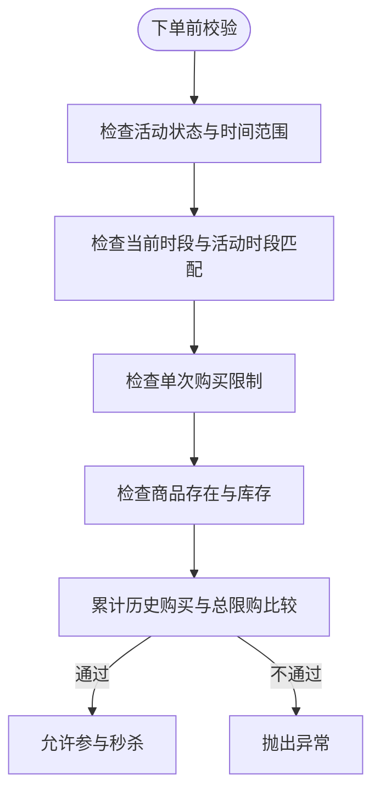
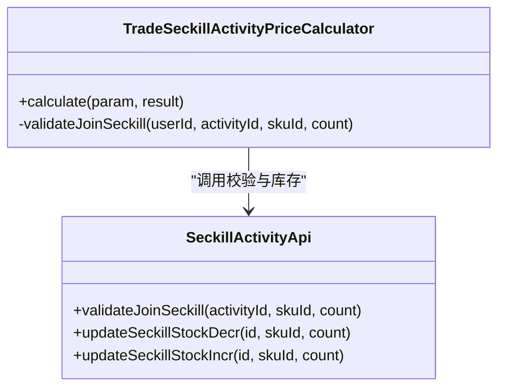
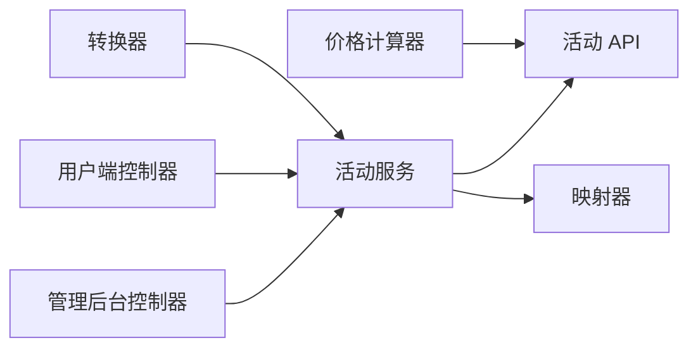

# 秒杀活动管理

<cite>
**本文引用的文件**
- [SeckillActivityDO.java](file://yudao-module-mall/yudao-module-promotion/src/main/java/cn/iocoder/yudao/module/promotion/dal/dataobject/seckill/SeckillActivityDO.java)
- [SeckillProductDO.java](file://yudao-module-mall/yudao-module-promotion/src/main/java/cn/iocoder/yudao/module/promotion/dal/dataobject/seckill/SeckillProductDO.java)
- [SeckillConfigDO.java](file://yudao-module-mall/yudao-module-promotion/src/main/java/cn/iocoder/yudao/module/promotion/dal/dataobject/seckill/SeckillConfigDO.java)
- [SeckillActivityApi.java](file://yudao-module-mall/yudao-module-promotion/src/main/java/cn/iocoder/yudao/module/promotion/api/seckill/SeckillActivityApi.java)
- [SeckillActivityApiImpl.java](file://yudao-module-mall/yudao-module-promotion/src/main/java/cn/iocoder/yudao/module/promotion/api/seckill/SeckillActivityApiImpl.java)
- [SeckillActivityService.java](file://yudao-module-mall/yudao-module-promotion/src/main/java/cn/iocoder/yudao/module/promotion/service/seckill/SeckillActivityService.java)
- [SeckillActivityServiceImpl.java](file://yudao-module-mall/yudao-module-promotion/src/main/java/cn/iocoder/yudao/module/promotion/service/seckill/SeckillActivityServiceImpl.java)
- [SeckillProductMapper.java](file://yudao-module-mall/yudao-module-promotion/src/main/java/cn/iocoder/yudao/module/promotion/dal/mysql/seckill/seckillactivity/SeckillProductMapper.java)
- [SeckillActivityController.java（管理后台）](file://yudao-module-mall/yudao-module-promotion/src/main/java/cn/iocoder/yudao/module/promotion/controller/admin/seckill/SeckillActivityController.java)
- [AppSeckillActivityController.java（用户端）](file://yudao-module-mall/yudao-module-promotion/src/main/java/cn/iocoder/yudao/module/promotion/controller/app/seckill/AppSeckillActivityController.java)
- [TradeSeckillActivityPriceCalculator.java](file://yudao-module-mall/yudao-module-trade/src/main/java/cn/iocoder/yudao/module/trade/service/price/calculator/TradeSeckillActivityPriceCalculator.java)
- [SeckillActivityConvert.java](file://yudao-module-mall/yudao-module-promotion/src/main/java/cn/iocoder/yudao/module/promotion/convert/seckill/SeckillActivityConvert.java)
- [SeckillActivityController.java（管理后台）- VO](file://yudao-module-mall/yudao-module-promotion/src/main/java/cn/iocoder/yudao/module/promotion/controller/admin/seckill/vo/activity/SeckillActivityDetailRespVO.java)
- [AppSeckillActivityController.java（用户端）- VO](file://yudao-module-mall/yudao-module-promotion/src/main/java/cn/iocoder/yudao/module/promotion/controller/app/seckill/vo/activity/AppSeckillActivityPageReqVO.java)
</cite>

## 目录
1. [简介](#简介)
2. [项目结构](#项目结构)
3. [核心组件](#核心组件)
4. [架构总览](#架构总览)
5. [详细组件分析](#详细组件分析)
6. [依赖关系分析](#依赖关系分析)
7. [性能考虑](#性能考虑)
8. [故障排查指南](#故障排查指南)
9. [结论](#结论)
10. [附录](#附录)

## 简介
本技术文档围绕“秒杀活动管理”展开，覆盖高并发下的业务流程与技术实现，包括活动创建与配置、预热、抢购、结算、库存与限购控制、防刷机制、订单处理、性能优化与容量规划、监控告警与故障排查等。文档以代码级分析为基础，结合可视化图示帮助读者快速理解系统设计与实现细节。

## 项目结构
秒杀能力主要分布在促销模块与交易模块中：
- 促销模块负责秒杀活动的定义、配置、校验与库存变更
- 交易模块负责价格计算中的秒杀优惠应用与限购校验
- 控制器层分别面向管理后台与用户端提供接口
- Mapper 层提供库存扣减等原子操作

图表来源
- [SeckillActivityController.java（管理后台）:1-120](file://yudao-module-mall/yudao-module-promotion/src/main/java/cn/iocoder/yudao/module/promotion/controller/admin/seckill/SeckillActivityController.java#L1-L120)
- [AppSeckillActivityController.java（用户端）:1-176](file://yudao-module-mall/yudao-module-promotion/src/main/java/cn/iocoder/yudao/module/promotion/controller/app/seckill/AppSeckillActivityController.java#L1-L176)
- [SeckillActivityService.java:1-129](file://yudao-module-mall/yudao-module-promotion/src/main/java/cn/iocoder/yudao/module/promotion/service/seckill/SeckillActivityService.java#L1-L129)
- [SeckillActivityApi.java:1-42](file://yudao-module-mall/yudao-module-promotion/src/main/java/cn/iocoder/yudao/module/promotion/api/seckill/SeckillActivityApi.java#L1-L42)
- [SeckillActivityDO.java:1-89](file://yudao-module-mall/yudao-module-promotion/src/main/java/cn/iocoder/yudao/module/promotion/dal/dataobject/seckill/SeckillActivityDO.java#L1-L89)
- [TradeSeckillActivityPriceCalculator.java:1-72](file://yudao-module-mall/yudao-module-trade/src/main/java/cn/iocoder/yudao/module/trade/service/price/calculator/TradeSeckillActivityPriceCalculator.java#L1-L72)

章节来源
- [SeckillActivityController.java（管理后台）:1-120](file://yudao-module-mall/yudao-module-promotion/src/main/java/cn/iocoder/yudao/module/promotion/controller/admin/seckill/SeckillActivityController.java#L1-L120)
- [AppSeckillActivityController.java（用户端）:1-176](file://yudao-module-mall/yudao-module-promotion/src/main/java/cn/iocoder/yudao/module/promotion/controller/app/seckill/AppSeckillActivityController.java#L1-L176)
- [SeckillActivityService.java:1-129](file://yudao-module-mall/yudao-module-promotion/src/main/java/cn/iocoder/yudao/module/promotion/service/seckill/SeckillActivityService.java#L1-L129)
- [SeckillActivityApi.java:1-42](file://yudao-module-mall/yudao-module-promotion/src/main/java/cn/iocoder/yudao/module/promotion/api/seckill/SeckillActivityApi.java#L1-L42)
- [SeckillActivityDO.java:1-89](file://yudao-module-mall/yudao-module-promotion/src/main/java/cn/iocoder/yudao/module/promotion/dal/dataobject/seckill/SeckillActivityDO.java#L1-L89)
- [TradeSeckillActivityPriceCalculator.java:1-72](file://yudao-module-mall/yudao-module-trade/src/main/java/cn/iocoder/yudao/module/trade/service/price/calculator/TradeSeckillActivityPriceCalculator.java#L1-L72)

## 核心组件
- 数据模型
  - 活动表：包含活动基本信息、状态、时间范围、限购配置、库存字段等
  - 商品表：关联活动与 SKU，记录秒杀价与库存
  - 配置表：定义秒杀时段（开始/结束时间、轮播图、状态）
- 服务与 API
  - 活动服务：创建/更新/关闭/删除、库存扣减/增加、校验参与资格
  - 活动 API：对外暴露库存变更与参与校验
- 控制器
  - 管理后台：活动 CRUD、分页、详情拼装
  - 用户端：当前活动、分页、详情、缓存预热
- 价格计算
  - 秒杀价格计算器：应用秒杀优惠并校验总限购

章节来源
- [SeckillActivityDO.java:1-89](file://yudao-module-mall/yudao-module-promotion/src/main/java/cn/iocoder/yudao/module/promotion/dal/dataobject/seckill/SeckillActivityDO.java#L1-L89)
- [SeckillProductDO.java:1-81](file://yudao-module-mall/yudao-module-promotion/src/main/java/cn/iocoder/yudao/module/promotion/dal/dataobject/seckill/SeckillProductDO.java#L1-L81)
- [SeckillConfigDO.java:1-59](file://yudao-module-mall/yudao-module-promotion/src/main/java/cn/iocoder/yudao/module/promotion/dal/dataobject/seckill/SeckillConfigDO.java#L1-L59)
- [SeckillActivityService.java:1-129](file://yudao-module-mall/yudao-module-promotion/src/main/java/cn/iocoder/yudao/module/promotion/service/seckill/SeckillActivityService.java#L1-L129)
- [SeckillActivityApi.java:1-42](file://yudao-module-mall/yudao-module-promotion/src/main/java/cn/iocoder/yudao/module/promotion/api/seckill/SeckillActivityApi.java#L1-L42)
- [TradeSeckillActivityPriceCalculator.java:1-72](file://yudao-module-mall/yudao-module-trade/src/main/java/cn/iocoder/yudao/module/trade/service/price/calculator/TradeSeckillActivityPriceCalculator.java#L1-L72)

## 架构总览
下图展示了从用户端到服务层再到数据层的整体调用链，以及价格计算在下单流程中的作用。

图表来源
- [AppSeckillActivityController.java（用户端）:76-97](file://yudao-module-mall/yudao-module-promotion/src/main/java/cn/iocoder/yudao/module/promotion/controller/app/seckill/AppSeckillActivityController.java#L76-L97)
- [SeckillActivityService.java:282-292](file://yudao-module-mall/yudao-module-promotion/src/main/java/cn/iocoder/yudao/module/promotion/service/seckill/SeckillActivityService.java#L282-L292)
- [TradeSeckillActivityPriceCalculator.java:35-69](file://yudao-module-mall/yudao-module-trade/src/main/java/cn/iocoder/yudao/module/trade/service/price/calculator/TradeSeckillActivityPriceCalculator.java#L35-L69)
- [SeckillActivityApi.java:30-42](file://yudao-module-mall/yudao-module-promotion/src/main/java/cn/iocoder/yudao/module/promotion/api/seckill/SeckillActivityApi.java#L30-L42)

## 详细组件分析

### 数据模型与关系
- 活动表包含活动基础信息、状态、时间范围、限购配置、库存字段
- 商品表关联活动与 SKU，记录秒杀价与库存
- 配置表定义秒杀时段，支持多时段配置
- 转换器负责将 DO/VO 组合为对外视图

图表来源
- [SeckillActivityDO.java:1-89](file://yudao-module-mall/yudao-module-promotion/src/main/java/cn/iocoder/yudao/module/promotion/dal/dataobject/seckill/SeckillActivityDO.java#L1-L89)
- [SeckillProductDO.java:1-81](file://yudao-module-mall/yudao-module-promotion/src/main/java/cn/iocoder/yudao/module/promotion/dal/dataobject/seckill/SeckillProductDO.java#L1-L81)
- [SeckillConfigDO.java:1-59](file://yudao-module-mall/yudao-module-promotion/src/main/java/cn/iocoder/yudao/module/promotion/dal/dataobject/seckill/SeckillConfigDO.java#L1-L59)

章节来源
- [SeckillActivityDO.java:1-89](file://yudao-module-mall/yudao-module-promotion/src/main/java/cn/iocoder/yudao/module/promotion/dal/dataobject/seckill/SeckillActivityDO.java#L1-L89)
- [SeckillProductDO.java:1-81](file://yudao-module-mall/yudao-module-promotion/src/main/java/cn/iocoder/yudao/module/promotion/dal/dataobject/seckill/SeckillProductDO.java#L1-L81)
- [SeckillConfigDO.java:1-59](file://yudao-module-mall/yudao-module-promotion/src/main/java/cn/iocoder/yudao/module/promotion/dal/dataobject/seckill/SeckillConfigDO.java#L1-L59)
- [SeckillActivityConvert.java:73-174](file://yudao-module-mall/yudao-module-promotion/src/main/java/cn/iocoder/yudao/module/promotion/convert/seckill/SeckillActivityConvert.java#L73-L174)

### 活动创建与配置
- 创建流程：校验时段冲突、校验商品存在性，插入活动与商品，计算总库存
- 更新流程：校验状态与冲突，按新增/修改/删除三类差异进行批量同步
- 关闭/删除：关闭仅允许对启用状态执行；删除要求活动处于非启用状态

图表来源
- [SeckillActivityServiceImpl.java:67-83](file://yudao-module-mall/yudao-module-promotion/src/main/java/cn/iocoder/yudao/module/promotion/service/seckill/SeckillActivityServiceImpl.java#L67-L83)
- [SeckillActivityServiceImpl.java:134-156](file://yudao-module-mall/yudao-module-promotion/src/main/java/cn/iocoder/yudao/module/promotion/service/seckill/SeckillActivityServiceImpl.java#L134-L156)
- [SeckillActivityServiceImpl.java:200-223](file://yudao-module-mall/yudao-module-promotion/src/main/java/cn/iocoder/yudao/module/promotion/service/seckill/SeckillActivityServiceImpl.java#L200-L223)

章节来源
- [SeckillActivityServiceImpl.java:67-83](file://yudao-module-mall/yudao-module-promotion/src/main/java/cn/iocoder/yudao/module/promotion/service/seckill/SeckillActivityServiceImpl.java#L67-L83)
- [SeckillActivityServiceImpl.java:134-156](file://yudao-module-mall/yudao-module-promotion/src/main/java/cn/iocoder/yudao/module/promotion/service/seckill/SeckillActivityServiceImpl.java#L134-L156)
- [SeckillActivityServiceImpl.java:200-223](file://yudao-module-mall/yudao-module-promotion/src/main/java/cn/iocoder/yudao/module/promotion/service/seckill/SeckillActivityServiceImpl.java#L200-L223)

### 库存扣减与预热
- 库存扣减：先校验活动与商品库存，再原子更新活动与商品库存
- 库存增加：用于回滚或补库存
- 预热：用户端控制器使用缓存异步刷新当前秒杀活动数据，降低高峰请求压力

图表来源
- [SeckillActivityServiceImpl.java:158-183](file://yudao-module-mall/yudao-module-promotion/src/main/java/cn/iocoder/yudao/module/promotion/service/seckill/SeckillActivityServiceImpl.java#L158-L183)
- [SeckillProductMapper.java:38-62](file://yudao-module-mall/yudao-module-promotion/src/main/java/cn/iocoder/yudao/module/promotion/dal/mysql/seckill/seckillactivity/SeckillProductMapper.java#L38-L62)

章节来源
- [SeckillActivityServiceImpl.java:158-183](file://yudao-module-mall/yudao-module-promotion/src/main/java/cn/iocoder/yudao/module/promotion/service/seckill/SeckillActivityServiceImpl.java#L158-L183)
- [SeckillProductMapper.java:38-62](file://yudao-module-mall/yudao-module-promotion/src/main/java/cn/iocoder/yudao/module/promotion/dal/mysql/seckill/seckillactivity/SeckillProductMapper.java#L38-L62)
- [AppSeckillActivityController.java（用户端）:54-81](file://yudao-module-mall/yudao-module-promotion/src/main/java/cn/iocoder/yudao/module/promotion/controller/app/seckill/AppSeckillActivityController.java#L54-L81)

### 参与校验与限购
- 参与校验：活动状态、时间范围、时段匹配、单次购买限制、商品存在性、库存充足
- 限购校验：下单前根据用户历史订单累计，确保不超过总限购数量

图表来源
- [SeckillActivityServiceImpl.java:294-326](file://yudao-module-mall/yudao-module-promotion/src/main/java/cn/iocoder/yudao/module/promotion/service/seckill/SeckillActivityServiceImpl.java#L294-L326)
- [TradeSeckillActivityPriceCalculator.java:60-69](file://yudao-module-mall/yudao-module-trade/src/main/java/cn/iocoder/yudao/module/trade/service/price/calculator/TradeSeckillActivityPriceCalculator.java#L60-L69)

章节来源
- [SeckillActivityServiceImpl.java:294-326](file://yudao-module-mall/yudao-module-promotion/src/main/java/cn/iocoder/yudao/module/promotion/service/seckill/SeckillActivityServiceImpl.java#L294-L326)
- [TradeSeckillActivityPriceCalculator.java:60-69](file://yudao-module-mall/yudao-module-trade/src/main/java/cn/iocoder/yudao/module/trade/service/price/calculator/TradeSeckillActivityPriceCalculator.java#L60-L69)

### 价格计算与优惠应用
- 仅允许单商品参与秒杀
- 计算优惠金额并更新订单项与总金额
- 与限购逻辑联动，防止超买

图表来源
- [TradeSeckillActivityPriceCalculator.java:1-72](file://yudao-module-mall/yudao-module-trade/src/main/java/cn/iocoder/yudao/module/trade/service/price/calculator/TradeSeckillActivityPriceCalculator.java#L1-L72)
- [SeckillActivityApi.java:1-42](file://yudao-module-mall/yudao-module-promotion/src/main/java/cn/iocoder/yudao/module/promotion/api/seckill/SeckillActivityApi.java#L1-L42)

章节来源
- [TradeSeckillActivityPriceCalculator.java:35-69](file://yudao-module-mall/yudao-module-trade/src/main/java/cn/iocoder/yudao/module/trade/service/price/calculator/TradeSeckillActivityPriceCalculator.java#L35-L69)
- [SeckillActivityApi.java:1-42](file://yudao-module-mall/yudao-module-promotion/src/main/java/cn/iocoder/yudao/module/promotion/api/seckill/SeckillActivityApi.java#L1-L42)

### 控制器与接口
- 管理后台：提供活动创建、更新、关闭、删除、分页、详情等接口
- 用户端：提供当前活动、分页、详情、按 ID 列表查询等接口，并内置缓存预热

章节来源
- [SeckillActivityController.java（管理后台）:41-117](file://yudao-module-mall/yudao-module-promotion/src/main/java/cn/iocoder/yudao/module/promotion/controller/admin/seckill/SeckillActivityController.java#L41-L117)
- [AppSeckillActivityController.java（用户端）:76-173](file://yudao-module-mall/yudao-module-promotion/src/main/java/cn/iocoder/yudao/module/promotion/controller/app/seckill/AppSeckillActivityController.java#L76-L173)

## 依赖关系分析
- 控制器依赖服务层
- 服务层依赖 API 接口与数据访问层
- 价格计算器依赖 API 接口与订单查询服务
- 转换器贯穿 DO/VO 映射

图表来源
- [SeckillActivityController.java（管理后台）:1-120](file://yudao-module-mall/yudao-module-promotion/src/main/java/cn/iocoder/yudao/module/promotion/controller/admin/seckill/SeckillActivityController.java#L1-L120)
- [AppSeckillActivityController.java（用户端）:1-176](file://yudao-module-mall/yudao-module-promotion/src/main/java/cn/iocoder/yudao/module/promotion/controller/app/seckill/AppSeckillActivityController.java#L1-L176)
- [SeckillActivityService.java:1-129](file://yudao-module-mall/yudao-module-promotion/src/main/java/cn/iocoder/yudao/module/promotion/service/seckill/SeckillActivityService.java#L1-L129)
- [SeckillActivityApiImpl.java:1-37](file://yudao-module-mall/yudao-module-promotion/src/main/java/cn/iocoder/yudao/module/promotion/api/seckill/SeckillActivityApiImpl.java#L1-L37)
- [SeckillActivityConvert.java:73-174](file://yudao-module-mall/yudao-module-promotion/src/main/java/cn/iocoder/yudao/module/promotion/convert/seckill/SeckillActivityConvert.java#L73-L174)

章节来源
- [SeckillActivityApiImpl.java:1-37](file://yudao-module-mall/yudao-module-promotion/src/main/java/cn/iocoder/yudao/module/promotion/api/seckill/SeckillActivityApiImpl.java#L1-L37)
- [SeckillActivityConvert.java:73-174](file://yudao-module-mall/yudao-module-promotion/src/main/java/cn/iocoder/yudao/module/promotion/convert/seckill/SeckillActivityConvert.java#L73-L174)

## 性能考虑
- 原子库存扣减：通过 SQL 直接更新并校验影响行数，避免读写竞争
- 缓存预热：用户端首页异步刷新当前秒杀活动，降低峰值请求
- 分页与过滤：按配置与状态过滤活动，减少无效查询
- 事务边界：库存扣减与活动更新在同一事务内，保证一致性
- 并发控制建议（通用实践，非现有实现）：可在库存扣减前引入分布式锁或消息队列削峰填谷

## 故障排查指南
- 活动状态异常：确认活动状态与时间范围是否匹配当前时段
- 库存不足：核对活动与商品库存，检查是否已发生扣减
- 时段冲突：检查活动配置的时段是否与其他活动冲突
- 商品缺失：确认 SPU/SKU 是否存在且与活动绑定一致
- 限购超限：核对用户历史购买累计与总限购配置

章节来源
- [SeckillActivityServiceImpl.java:294-326](file://yudao-module-mall/yudao-module-promotion/src/main/java/cn/iocoder/yudao/module/promotion/service/seckill/SeckillActivityServiceImpl.java#L294-L326)
- [SeckillActivityServiceImpl.java:158-183](file://yudao-module-mall/yudao-module-promotion/src/main/java/cn/iocoder/yudao/module/promotion/service/seckill/SeckillActivityServiceImpl.java#L158-L183)

## 结论
该秒杀系统通过清晰的分层设计与严格的校验机制，在高并发场景下实现了活动管理、库存控制与价格计算的协同工作。通过缓存预热与原子更新等手段，有效提升了用户体验与系统稳定性。后续可在库存扣减前引入分布式锁或消息队列等机制进一步增强抗压能力。

## 附录
- 接口与 VO
  - 管理后台活动详情 VO：[SeckillActivityDetailRespVO.java:1-21](file://yudao-module-mall/yudao-module-promotion/src/main/java/cn/iocoder/yudao/module/promotion/controller/admin/seckill/vo/activity/SeckillActivityDetailRespVO.java#L1-L21)
  - 用户端分页请求 VO：[AppSeckillActivityPageReqVO.java:1-18](file://yudao-module-mall/yudao-module-promotion/src/main/java/cn/iocoder/yudao/module/promotion/controller/app/seckill/vo/activity/AppSeckillActivityPageReqVO.java#L1-L18)