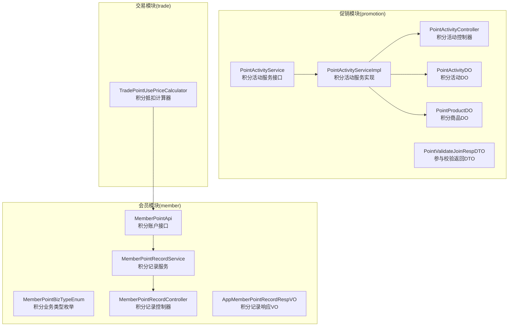
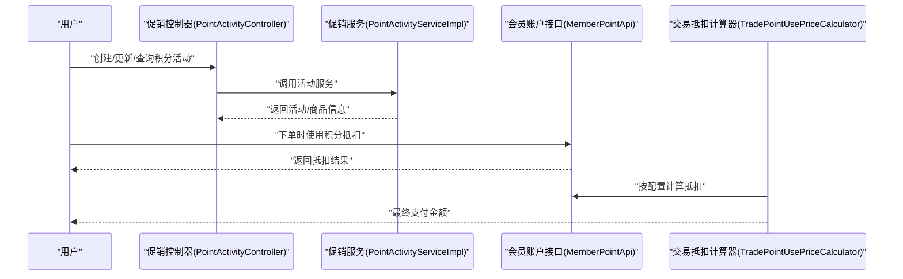
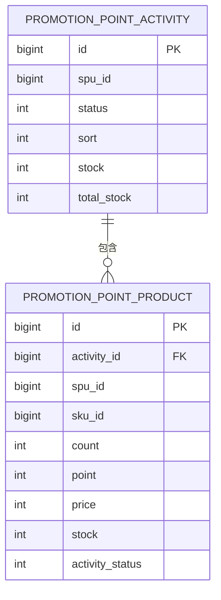
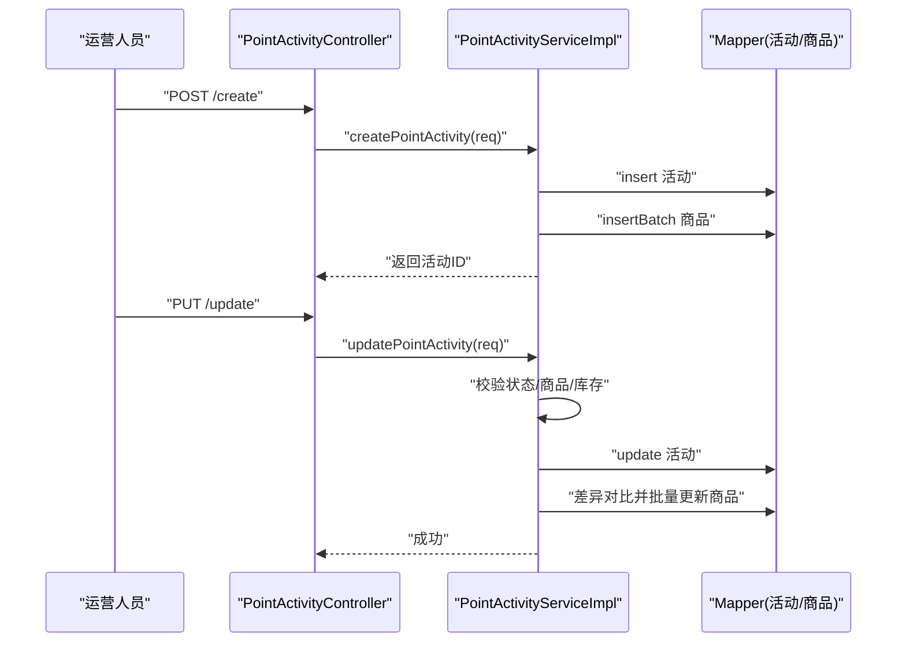
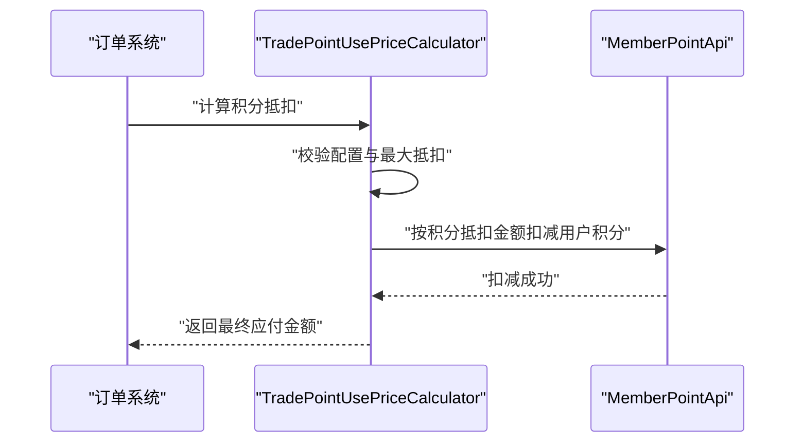
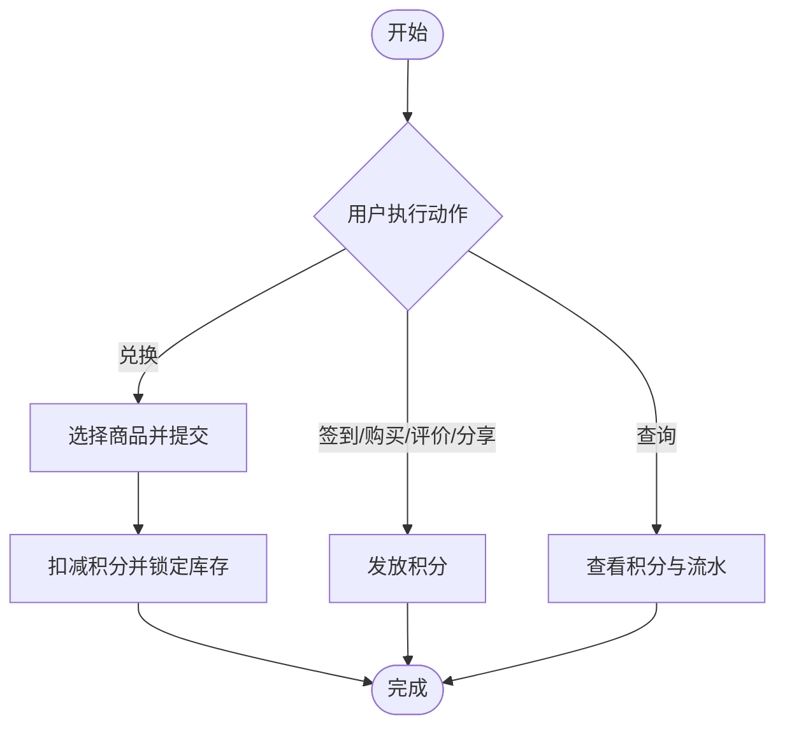
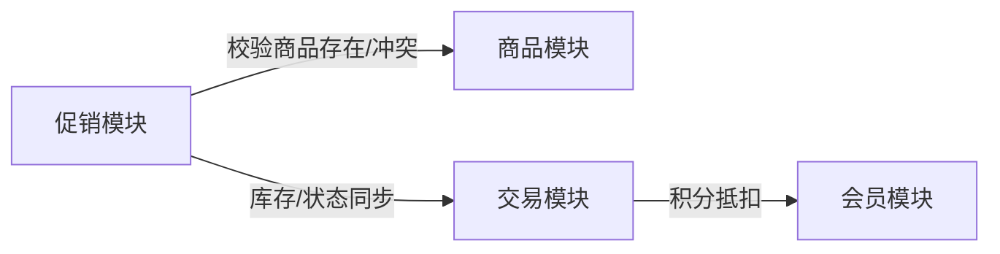

# 积分奖励活动

<cite>
**本文引用的文件**
- [MemberPointApi.java](file://qiji-module-member/src/main/java/com.qiji.cps/module/member/api/point/MemberPointApi.java)
- [MemberPointBizTypeEnum.java](file://qiji-module-member/src/main/java/com.qiji.cps/module/member/enums/point/MemberPointBizTypeEnum.java)
- [MemberPointRecordService.java](file://qiji-module-member/src/main/java/com.qiji.cps/module/member/service/point/MemberPointRecordService.java)
- [AppMemberPointRecordRespVO.java](file://qiji-module-member/src/main/java/com.qiji.cps/module/member/controller/app/point/vo/AppMemberPointRecordRespVO.java)
- [MemberPointRecordController.java](file://qiji-module-member/src/main/java/com.qiji.cps/module/member/controller/admin/point/MemberPointRecordController.java)
- [PointActivityService.java](file://qiji-module-mall/qiji-module-promotion/src/main/java/com.qiji.cps/module/promotion/service/point/PointActivityService.java)
- [PointActivityServiceImpl.java](file://qiji-module-mall/qiji-module-promotion/src/main/java/com.qiji.cps/module/promotion/service/point/PointActivityServiceImpl.java)
- [PointActivityController.java](file://qiji-module-mall/qiji-module-promotion/src/main/java/com.qiji.cps/module/promotion/controller/admin/point/PointActivityController.java)
- [PointActivityDO.java](file://qiji-module-mall/qiji-module-promotion/src/main/java/com.qiji.cps/module/promotion/dal/dataobject/point/PointActivityDO.java)
- [PointProductDO.java](file://qiji-module-mall/qiji-module-promotion/src/main/java/com.qiji.cps/module/promotion/dal/dataobject/point/PointProductDO.java)
- [PointValidateJoinRespDTO.java](file://qiji-module-mall/qiji-module-promotion/src/main/java/com.qiji.cps/module/promotion/api/point/dto/PointValidateJoinRespDTO.java)
- [TradePointUsePriceCalculator.java](file://qiji-module-mall/qiji-module-trade/src/main/java/com.qiji.cps/module/trade/service/price/calculator/TradePointUsePriceCalculator.java)
- [ruoyi-vue-pro.sql](file://sql/mysql/ruoyi-vue-pro.sql)
</cite>

## 目录
1. [简介](#简介)
2. [项目结构](#项目结构)
3. [核心组件](#核心组件)
4. [架构总览](#架构总览)
5. [详细组件分析](#详细组件分析)
6. [依赖分析](#依赖分析)
7. [性能考虑](#性能考虑)
8. [故障排查指南](#故障排查指南)
9. [结论](#结论)
10. [附录](#附录)

## 简介
本技术文档围绕“积分奖励活动”功能进行系统化梳理，覆盖业务逻辑、数据模型、实现机制、用户交互流程、风控策略、性能优化与一致性保障等方面。重点包括：
- 积分活动的创建、配置、发放、消费全流程
- 积分类型、奖励规则、发放条件、有效期、使用限制等关键配置
- 积分计算逻辑、叠加规则、兑换比例、风控策略等复杂场景
- 积分活动的多种类型：签到送积分、购买送积分、评价送积分、分享送积分等
- 用户交互流程：积分获取、查询、兑换体验设计
- 配置示例与运营策略建议
- 性能优化与数据一致性保障方案

## 项目结构
积分奖励活动涉及两大模块：
- 会员模块（member）：负责积分账户、积分流水、积分业务类型枚举等
- 促销模块（promotion）：负责积分商城活动与商品的创建、配置、库存管理与校验
- 交易模块（trade）：负责在订单价格计算中应用积分抵扣

图表来源
- [MemberPointApi.java:1-37](file://qiji-module-member/src/main/java/com.qiji.cps/module/member/api/point/MemberPointApi.java#L1-L37)
- [MemberPointBizTypeEnum.java:1-59](file://qiji-module-member/src/main/java/com.qiji.cps/module/member/enums/point/MemberPointBizTypeEnum.java#L1-L59)
- [MemberPointRecordService.java:1-43](file://qiji-module-member/src/main/java/com.qiji.cps/module/member/service/point/MemberPointRecordService.java#L1-L43)
- [MemberPointRecordController.java:1-57](file://qiji-module-member/src/main/java/com.qiji.cps/module/member/controller/admin/point/MemberPointRecordController.java#L1-L57)
- [AppMemberPointRecordRespVO.java:1-27](file://qiji-module-member/src/main/java/com.qiji.cps/module/member/controller/app/point/vo/AppMemberPointRecordRespVO.java#L1-L27)
- [PointActivityService.java:1-112](file://qiji-module-mall/qiji-module-promotion/src/main/java/com.qiji.cps/module/promotion/service/point/PointActivityService.java#L1-L112)
- [PointActivityServiceImpl.java:1-310](file://qiji-module-mall/qiji-module-promotion/src/main/java/com.qiji.cps/module/promotion/service/point/PointActivityServiceImpl.java#L1-L310)
- [PointActivityController.java:1-141](file://qiji-module-mall/qiji-module-promotion/src/main/java/com.qiji.cps/module/promotion/controller/admin/point/PointActivityController.java#L1-L141)
- [PointActivityDO.java:1-58](file://qiji-module-mall/qiji-module-promotion/src/main/java/com.qiji.cps/module/promotion/dal/dataobject/point/PointActivityDO.java#L1-L58)
- [PointProductDO.java:1-68](file://qiji-module-mall/qiji-module-promotion/src/main/java/com.qiji.cps/module/promotion/dal/dataobject/point/PointProductDO.java#L1-L68)
- [PointValidateJoinRespDTO.java](file://qiji-module-mall/qiji-module-promotion/src/main/java/com.qiji.cps/module/promotion/api/point/dto/PointValidateJoinRespDTO.java)
- [TradePointUsePriceCalculator.java:65-107](file://qiji-module-mall/qiji-module-trade/src/main/java/com.qiji.cps/module/trade/service/price/calculator/TradePointUsePriceCalculator.java#L65-L107)

章节来源
- [PointActivityController.java:1-141](file://qiji-module-mall/qiji-module-promotion/src/main/java/com.qiji.cps/module/promotion/controller/admin/point/PointActivityController.java#L1-L141)
- [PointActivityService.java:1-112](file://qiji-module-mall/qiji-module-promotion/src/main/java/com.qiji.cps/module/promotion/service/point/PointActivityService.java#L1-L112)
- [PointActivityServiceImpl.java:1-310](file://qiji-module-mall/qiji-module-promotion/src/main/java/com.qiji.cps/module/promotion/service/point/PointActivityServiceImpl.java#L1-L310)
- [PointActivityDO.java:1-58](file://qiji-module-mall/qiji-module-promotion/src/main/java/com.qiji.cps/module/promotion/dal/dataobject/point/PointActivityDO.java#L1-L58)
- [PointProductDO.java:1-68](file://qiji-module-mall/qiji-module-promotion/src/main/java/com.qiji.cps/module/promotion/dal/dataobject/point/PointProductDO.java#L1-L68)
- [MemberPointApi.java:1-37](file://qiji-module-member/src/main/java/com.qiji.cps/module/member/api/point/MemberPointApi.java#L1-L37)
- [MemberPointBizTypeEnum.java:1-59](file://qiji-module-member/src/main/java/com.qiji.cps/module/member/enums/point/MemberPointBizTypeEnum.java#L1-L59)
- [MemberPointRecordService.java:1-43](file://qiji-module-member/src/main/java/com.qiji.cps/module/member/service/point/MemberPointRecordService.java#L1-L43)
- [MemberPointRecordController.java:1-57](file://qiji-module-member/src/main/java/com.qiji.cps/module/member/controller/admin/point/MemberPointRecordController.java#L1-L57)
- [AppMemberPointRecordRespVO.java:1-27](file://qiji-module-member/src/main/java/com.qiji.cps/module/member/controller/app/point/vo/AppMemberPointRecordRespVO.java#L1-L27)
- [TradePointUsePriceCalculator.java:65-107](file://qiji-module-mall/qiji-module-trade/src/main/java/com.qiji.cps/module/trade/service/price/calculator/TradePointUsePriceCalculator.java#L65-L107)

## 核心组件
- 积分账户与业务类型
  - 通过会员模块的积分账户接口与业务类型枚举，统一管理积分的增减与业务来源，支持签到、订单抵扣/奖励、管理员调整等场景。
- 积分活动与商品
  - 促销模块提供积分活动与积分商品的完整生命周期管理，包括创建、更新、库存扣减/增加、关闭、删除以及参与校验。
- 订单积分抵扣
  - 交易模块的价格计算器在订单结算阶段按配置执行积分抵扣，并进行风控校验，防止0元购等异常情况。

章节来源
- [MemberPointApi.java:1-37](file://qiji-module-member/src/main/java/com.qiji.cps/module/member/api/point/MemberPointApi.java#L1-L37)
- [MemberPointBizTypeEnum.java:1-59](file://qiji-module-member/src/main/java/com.qiji.cps/module/member/enums/point/MemberPointBizTypeEnum.java#L1-L59)
- [PointActivityService.java:1-112](file://qiji-module-mall/qiji-module-promotion/src/main/java/com.qiji.cps/module/promotion/service/point/PointActivityService.java#L1-L112)
- [PointActivityServiceImpl.java:1-310](file://qiji-module-mall/qiji-module-promotion/src/main/java/com.qiji.cps/module/promotion/service/point/PointActivityServiceImpl.java#L1-L310)
- [TradePointUsePriceCalculator.java:65-107](file://qiji-module-mall/qiji-module-trade/src/main/java/com.qiji.cps/module/trade/service/price/calculator/TradePointUsePriceCalculator.java#L65-L107)

## 架构总览
积分奖励活动的总体架构由“会员账户层、促销活动层、交易抵扣层”组成，三者通过清晰的接口边界协作，确保业务规则与数据一致性的落地。

图表来源
- [PointActivityController.java:1-141](file://qiji-module-mall/qiji-module-promotion/src/main/java/com.qiji.cps/module/promotion/controller/admin/point/PointActivityController.java#L1-L141)
- [PointActivityServiceImpl.java:1-310](file://qiji-module-mall/qiji-module-promotion/src/main/java/com.qiji.cps/module/promotion/service/point/PointActivityServiceImpl.java#L1-L310)
- [MemberPointApi.java:1-37](file://qiji-module-member/src/main/java/com.qiji.cps/module/member/api/point/MemberPointApi.java#L1-L37)
- [TradePointUsePriceCalculator.java:65-107](file://qiji-module-mall/qiji-module-trade/src/main/java/com.qiji.cps/module/trade/service/price/calculator/TradePointUsePriceCalculator.java#L65-L107)

## 详细组件分析

### 1) 积分活动数据模型
- 积分活动表（PointActivityDO）
  - 字段要点：活动编号、SPU 编号、状态、排序、总库存、剩余库存等
  - 作用：承载活动基础信息与库存聚合
- 积分商品表（PointProductDO）
  - 字段要点：活动编号、SPU/SKU 编号、可兑换次数、所需积分、所需金额、库存、活动状态
  - 作用：定义每个 SKU 的兑换规则与库存

图表来源
- [PointActivityDO.java:1-58](file://qiji-module-mall/qiji-module-promotion/src/main/java/com.qiji.cps/module/promotion/dal/dataobject/point/PointActivityDO.java#L1-L58)
- [PointProductDO.java:1-68](file://qiji-module-mall/qiji-module-promotion/src/main/java/com.qiji.cps/module/promotion/dal/dataobject/point/PointProductDO.java#L1-L68)

章节来源
- [PointActivityDO.java:1-58](file://qiji-module-mall/qiji-module-promotion/src/main/java/com.qiji.cps/module/promotion/dal/dataobject/point/PointActivityDO.java#L1-L58)
- [PointProductDO.java:1-68](file://qiji-module-mall/qiji-module-promotion/src/main/java/com.qiji.cps/module/promotion/dal/dataobject/point/PointProductDO.java#L1-L68)

### 2) 积分业务类型与规则
- 业务类型枚举（MemberPointBizTypeEnum）
  - 包含签到、管理员调整、订单抵扣（含整单/单项取消）、订单奖励（含整单/单项取消）等
  - 通过布尔字段标识该业务类型是否为“增加积分”，便于统一处理
- 业务规则
  - 增减积分均需绑定业务类型与业务编号，形成可追溯的积分流水
  - 不同业务类型对应不同的积分变动方向与描述文案

章节来源
- [MemberPointBizTypeEnum.java:1-59](file://qiji-module-member/src/main/java/com.qiji.cps/module/member/enums/point/MemberPointBizTypeEnum.java#L1-L59)
- [MemberPointApi.java:1-37](file://qiji-module-member/src/main/java/com.qiji.cps/module/member/api/point/MemberPointApi.java#L1-L37)

### 3) 积分活动创建与配置流程
- 控制器（PointActivityController）
  - 提供创建、更新、关闭、删除、分页查询、详情查询等接口
  - 在查询时拼装商品信息与 SPU 基础信息
- 服务实现（PointActivityServiceImpl）
  - 创建：校验商品存在性与商品冲突、初始化库存、插入活动与商品
  - 更新：校验状态、库存上界更新、差异对比并批量新增/更新/删除商品
  - 库存：支持活动与商品维度的扣减/增加
  - 关闭/删除：变更状态与商品状态，保证一致性
  - 参与校验：校验活动状态、商品存在性、单次购买限制与库存

图表来源
- [PointActivityController.java:1-141](file://qiji-module-mall/qiji-module-promotion/src/main/java/com.qiji.cps/module/promotion/controller/admin/point/PointActivityController.java#L1-L141)
- [PointActivityServiceImpl.java:63-104](file://qiji-module-mall/qiji-module-promotion/src/main/java/com.qiji.cps/module/promotion/service/point/PointActivityServiceImpl.java#L63-L104)

章节来源
- [PointActivityController.java:1-141](file://qiji-module-mall/qiji-module-promotion/src/main/java/com.qiji.cps/module/promotion/controller/admin/point/PointActivityController.java#L1-L141)
- [PointActivityServiceImpl.java:63-104](file://qiji-module-mall/qiji-module-promotion/src/main/java/com.qiji.cps/module/promotion/service/point/PointActivityServiceImpl.java#L63-L104)

### 4) 积分发放与消费流程
- 发放（订单奖励）
  - 当订单支付完成后，依据业务类型枚举中的“订单奖励”类型，调用积分账户接口增加用户积分
- 消费（积分抵扣）
  - 订单结算时，交易模块的价格计算器根据配置计算抵扣额度，限制最大抵扣金额，避免0元购
  - 抵扣金额按订单项进行分摊，更新订单项与总金额

图表来源
- [TradePointUsePriceCalculator.java:65-107](file://qiji-module-mall/qiji-module-trade/src/main/java/com.qiji.cps/module/trade/service/price/calculator/TradePointUsePriceCalculator.java#L65-L107)
- [MemberPointApi.java:1-37](file://qiji-module-member/src/main/java/com.qiji.cps/module/member/api/point/MemberPointApi.java#L1-L37)

章节来源
- [TradePointUsePriceCalculator.java:65-107](file://qiji-module-mall/qiji-module-trade/src/main/java/com.qiji.cps/module/trade/service/price/calculator/TradePointUsePriceCalculator.java#L65-L107)
- [MemberPointApi.java:1-37](file://qiji-module-member/src/main/java/com.qiji.cps/module/member/api/point/MemberPointApi.java#L1-L37)

### 5) 积分活动类型与运营策略
- 签到送积分：通过签到业务类型发放积分，支持每日上限与连续签到奖励
- 购买送积分：订单支付完成后按订单金额或固定比例发放积分
- 评价送积分：完成评价后发放积分，提升用户互动
- 分享送积分：完成分享行为后发放积分，促进传播
- 运营策略建议
  - 设定每日/每月积分上限，避免刷分
  - 合理设置兑换比例与最低消费门槛，平衡成本与激励效果
  - 对高价值商品设置更高的积分要求，提升用户粘性

章节来源
- [MemberPointBizTypeEnum.java:1-59](file://qiji-module-member/src/main/java/com.qiji.cps/module/member/enums/point/MemberPointBizTypeEnum.java#L1-L59)

### 6) 用户交互流程
- 积分获取
  - 用户完成签到、购买、评价、分享等动作后，系统按规则发放积分
- 积分查询
  - 用户可在移动端查看积分流水与余额，支持分页与筛选
- 积分兑换
  - 在积分商城选择商品，确认所需积分与库存，提交兑换并扣减积分

图表来源
- [MemberPointRecordController.java:1-57](file://qiji-module-member/src/main/java/com.qiji.cps/module/member/controller/admin/point/MemberPointRecordController.java#L1-L57)
- [AppMemberPointRecordRespVO.java:1-27](file://qiji-module-member/src/main/java/com.qiji.cps/module/member/controller/app/point/vo/AppMemberPointRecordRespVO.java#L1-L27)
- [PointActivityServiceImpl.java:286-308](file://qiji-module-mall/qiji-module-promotion/src/main/java/com.qiji.cps/module/promotion/service/point/PointActivityServiceImpl.java#L286-L308)

章节来源
- [MemberPointRecordController.java:1-57](file://qiji-module-member/src/main/java/com.qiji.cps/module/member/controller/admin/point/MemberPointRecordController.java#L1-L57)
- [AppMemberPointRecordRespVO.java:1-27](file://qiji-module-member/src/main/java/com.qiji.cps/module/member/controller/app/point/vo/AppMemberPointRecordRespVO.java#L1-L27)
- [PointActivityServiceImpl.java:286-308](file://qiji-module-mall/qiji-module-promotion/src/main/java/com.qiji.cps/module/promotion/service/point/PointActivityServiceImpl.java#L286-L308)

### 7) 配置示例与字典
- 业务类型字典
  - 通过系统字典维护“订单积分奖励”“订单积分奖励（整单取消）”“订单积分奖励（单个退款）”等业务类型，便于统一管理与扩展
- 示例路径
  - 字典数据位于数据库脚本中，可直接导入使用

章节来源
- [ruoyi-vue-pro.sql:979-982](file://sql/mysql/ruoyi-vue-pro.sql#L979-L982)

## 依赖分析
- 组件耦合
  - 促销模块与商品模块（SPU/SKU）强耦合，创建/更新活动时需校验商品存在性与冲突
  - 交易模块依赖会员模块的积分账户接口，实现积分抵扣
- 外部依赖
  - 使用 MyBatis-Plus 进行数据访问
  - 使用 Hutool 工具库进行集合与对象操作
- 循环依赖
  - 当前结构未发现循环依赖，接口边界清晰

图表来源
- [PointActivityServiceImpl.java:219-264](file://qiji-module-mall/qiji-module-promotion/src/main/java/com.qiji.cps/module/promotion/service/point/PointActivityServiceImpl.java#L219-L264)
- [TradePointUsePriceCalculator.java:65-107](file://qiji-module-mall/qiji-module-trade/src/main/java/com.qiji.cps/module/trade/service/price/calculator/TradePointUsePriceCalculator.java#L65-L107)

章节来源
- [PointActivityServiceImpl.java:219-264](file://qiji-module-mall/qiji-module-promotion/src/main/java/com.qiji.cps/module/promotion/service/point/PointActivityServiceImpl.java#L219-L264)
- [TradePointUsePriceCalculator.java:65-107](file://qiji-module-mall/qiji-module-trade/src/main/java/com.qiji.cps/module/trade/service/price/calculator/TradePointUsePriceCalculator.java#L65-L107)

## 性能考虑
- 库存扣减与更新
  - 活动与商品库存采用双层更新，需保证事务一致性；建议在高并发场景下对活动与商品库存字段加唯一索引与行级锁
- 分页查询
  - 积分记录与活动分页查询需结合合理索引（如用户 ID、创建时间），避免全表扫描
- 价格计算
  - 积分抵扣按订单项分摊，注意分摊精度与总金额一致性校验
- 缓存策略
  - 对高频查询的商品信息与活动状态可引入缓存，降低数据库压力

## 故障排查指南
- 活动状态异常
  - 关闭/删除活动前需校验状态，若状态不符会抛出相应异常
- 库存不足
  - 兑换时会校验商品与活动库存，不足则抛出异常
- 商品冲突
  - 同一 SPU 不可同时参与多个开启的积分活动，冲突时抛出异常
- 抵扣风控
  - 若抵扣金额超过应付金额，将触发风控异常，禁止0元购

章节来源
- [PointActivityServiceImpl.java:143-203](file://qiji-module-mall/qiji-module-promotion/src/main/java/com.qiji.cps/module/promotion/service/point/PointActivityServiceImpl.java#L143-L203)
- [PointActivityServiceImpl.java:286-308](file://qiji-module-mall/qiji-module-promotion/src/main/java/com.qiji.cps/module/promotion/service/point/PointActivityServiceImpl.java#L286-L308)
- [TradePointUsePriceCalculator.java:92-107](file://qiji-module-mall/qiji-module-trade/src/main/java/com.qiji.cps/module/trade/service/price/calculator/TradePointUsePriceCalculator.java#L92-L107)

## 结论
积分奖励活动通过“会员账户—促销活动—交易抵扣”的分层设计，实现了从活动配置、库存管理到积分发放与消费的闭环。依托清晰的业务类型枚举与严格的风控策略，系统能够稳定支撑多种激励场景。建议在高并发场景下进一步完善缓存与索引策略，并持续优化兑换体验与运营策略以提升用户留存与转化。

## 附录
- 配置示例
  - 在系统字典中维护“订单积分奖励”等业务类型，便于统一管理
- 运营建议
  - 合理设置积分获取与消耗比例，控制成本与激励强度
  - 对热门商品设置兑换上限，避免瞬时抢兑导致的库存波动

章节来源
- [ruoyi-vue-pro.sql:979-982](file://sql/mysql/ruoyi-vue-pro.sql#L979-L982)