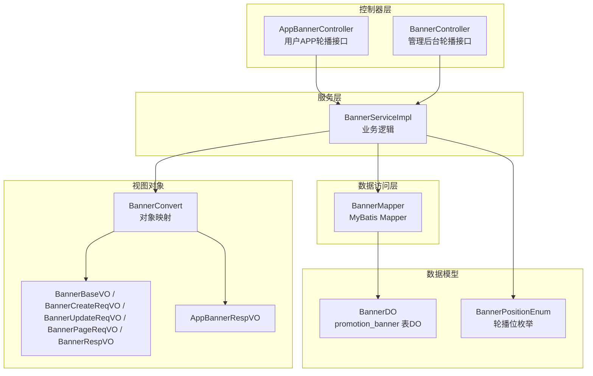
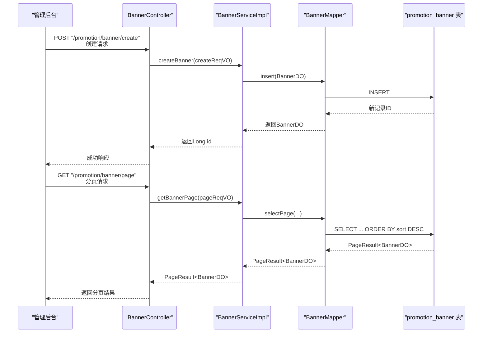
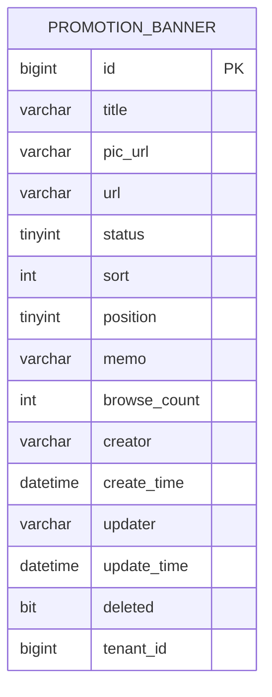
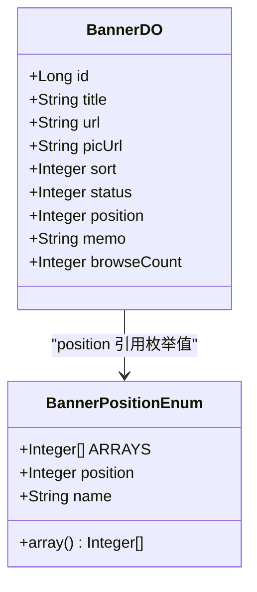
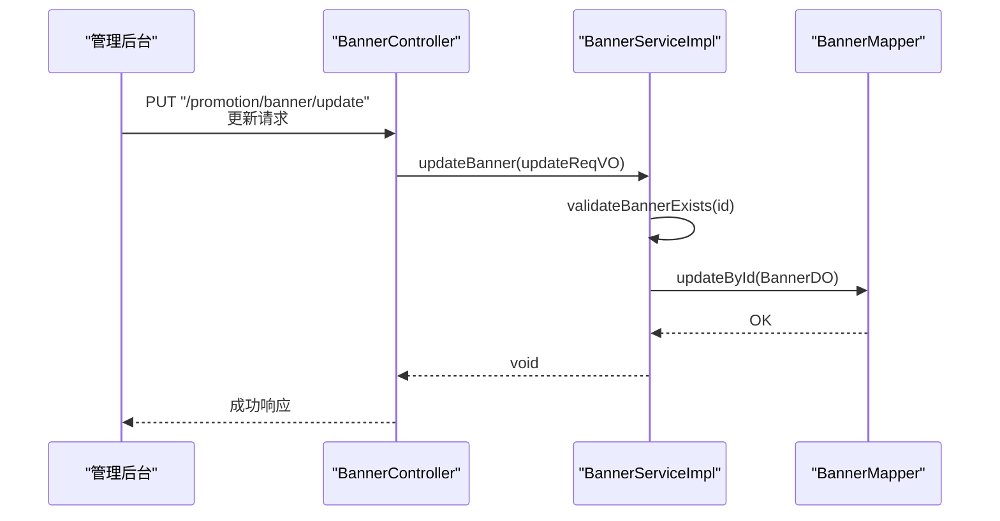
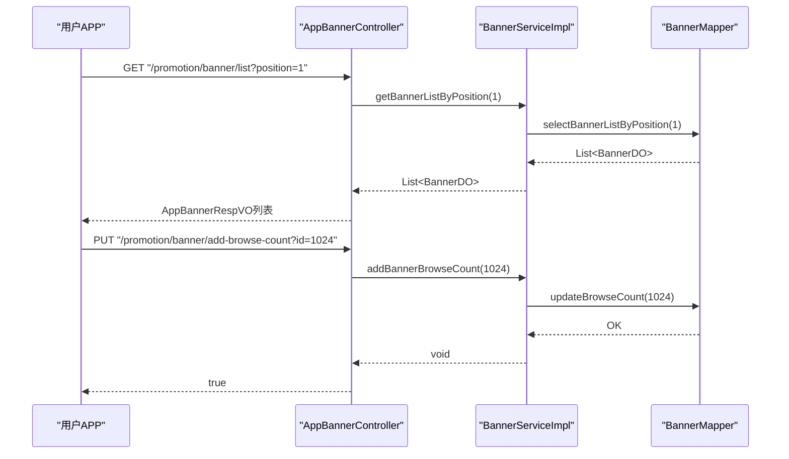
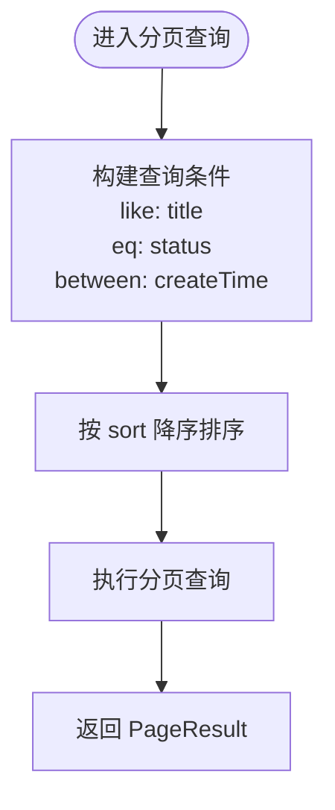
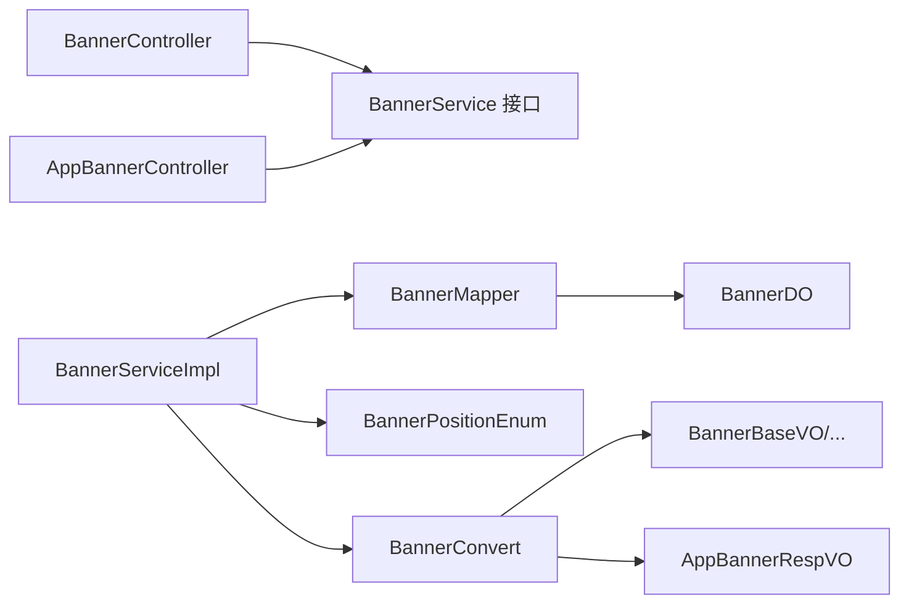

# 轮播图管理

<cite>
**本文引用的文件**
- [BannerController.java](file://yudao-module-mall/yudao-module-promotion/src/main/java/cn/iocoder/yudao/module/promotion/controller/admin/banner/BannerController.java)
- [AppBannerController.java](file://yudao-module-mall/yudao-module-promotion/src/main/java/cn/iocoder/yudao/module/promotion/controller/app/banner/AppBannerController.java)
- [BannerService.java](file://yudao-module-mall/yudao-module-promotion/src/main/java/cn/iocoder/yudao/module/promotion/service/banner/BannerService.java)
- [BannerServiceImpl.java](file://yudao-module-mall/yudao-module-promotion/src/main/java/cn/iocoder/yudao/module/promotion/service/banner/BannerServiceImpl.java)
- [BannerMapper.java](file://yudao-module-mall/yudao-module-promotion/src/main/java/cn/iocoder/yudao/module/promotion/dal/mysql/banner/BannerMapper.java)
- [BannerDO.java](file://yudao-module-mall/yudao-module-promotion/src/main/java/cn/iocoder/yudao/module/promotion/dal/dataobject/banner/BannerDO.java)
- [BannerBaseVO.java](file://yudao-module-mall/yudao-module-promotion/src/main/java/cn/iocoder/yudao/module/promotion/controller/admin/banner/vo/BannerBaseVO.java)
- [BannerCreateReqVO.java](file://yudao-module-mall/yudao-module-promotion/src/main/java/cn/iocoder/yudao/module/promotion/controller/admin/banner/vo/BannerCreateReqVO.java)
- [BannerUpdateReqVO.java](file://yudao-module-mall/yudao-module-promotion/src/main/java/cn/iocoder/yudao/module/promotion/controller/admin/banner/vo/BannerUpdateReqVO.java)
- [BannerPageReqVO.java](file://yudao-module-mall/yudao-module-promotion/src/main/java/cn/iocoder/yudao/module/promotion/controller/admin/banner/vo/BannerPageReqVO.java)
- [BannerRespVO.java](file://yudao-module-mall/yudao-module-promotion/src/main/java/cn/iocoder/yudao/module/promotion/controller/admin/banner/vo/BannerRespVO.java)
- [AppBannerRespVO.java](file://yudao-module-mall/yudao-module-promotion/src/main/java/cn/iocoder/yudao/module/promotion/controller/app/banner/vo/AppBannerRespVO.java)
- [BannerConvert.java](file://yudao-module-mall/yudao-module-promotion/src/main/java/cn/iocoder/yudao/module/promotion/convert/banner/BannerConvert.java)
- [BannerPositionEnum.java](file://yudao-module-mall/yudao-module-promotion/src/main/java/cn/iocoder/yudao/module/promotion/enums/banner/BannerPositionEnum.java)
- [ruoyi-vue-pro-mall-2025-05-12.sql](file://sql/module/ruoyi-vue-pro-mall-2025-05-12.sql)
</cite>

## 目录
1. [简介](#简介)
2. [项目结构](#项目结构)
3. [核心组件](#核心组件)
4. [架构总览](#架构总览)
5. [详细组件分析](#详细组件分析)
6. [依赖关系分析](#依赖关系分析)
7. [性能与图片处理](#性能与图片处理)
8. [故障排查指南](#故障排查指南)
9. [结论](#结论)
10. [附录：配置示例与最佳实践](#附录配置示例与最佳实践)

## 简介
本技术文档围绕轮播图管理功能展开，覆盖从后端服务到前端展示的完整链路。系统支持多场景轮播位（首页、活动页等），提供创建、配置、发布、轮播与统计分析能力，并通过统一的数据模型与接口规范支撑运营与产品需求。

## 项目结构
轮播图模块位于“促销模块”中，采用典型的分层架构：
- 控制器层：管理后台与用户APP分别提供REST接口
- 服务层：封装业务逻辑与数据访问协调
- 数据访问层：MyBatis Mapper负责SQL执行
- 数据对象层：DO定义数据库表结构
- VO/DTO层：请求与响应参数封装
- 枚举与转换：位置枚举与对象映射

图表来源
- [AppBannerController.java:1-48](file://yudao-module-mall/yudao-module-promotion/src/main/java/cn/iocoder/yudao/module/promotion/controller/app/banner/AppBannerController.java#L1-L48)
- [BannerController.java:1-75](file://yudao-module-mall/yudao-module-promotion/src/main/java/cn/iocoder/yudao/module/promotion/controller/admin/banner/BannerController.java#L1-L75)
- [BannerServiceImpl.java:1-87](file://yudao-module-mall/yudao-module-promotion/src/main/java/cn/iocoder/yudao/module/promotion/service/banner/BannerServiceImpl.java#L1-L87)
- [BannerMapper.java:1-39](file://yudao-module-mall/yudao-module-promotion/src/main/java/cn/iocoder/yudao/module/promotion/dal/mysql/banner/BannerMapper.java#L1-L39)
- [BannerDO.java:1-67](file://yudao-module-mall/yudao-module-promotion/src/main/java/cn/iocoder/yudao/module/promotion/dal/dataobject/banner/BannerDO.java#L1-L67)
- [BannerPositionEnum.java:1-41](file://yudao-module-mall/yudao-module-promotion/src/main/java/cn/iocoder/yudao/module/promotion/enums/banner/BannerPositionEnum.java#L1-L41)
- [BannerBaseVO.java:1-49](file://yudao-module-mall/yudao-module-promotion/src/main/java/cn/iocoder/yudao/module/promotion/controller/admin/banner/vo/BannerBaseVO.java#L1-L49)
- [BannerCreateReqVO.java:1-18](file://yudao-module-mall/yudao-module-promotion/src/main/java/cn/iocoder/yudao/module/promotion/controller/admin/banner/vo/BannerCreateReqVO.java#L1-L18)
- [BannerUpdateReqVO.java:1-24](file://yudao-module-mall/yudao-module-promotion/src/main/java/cn/iocoder/yudao/module/promotion/controller/admin/banner/vo/BannerUpdateReqVO.java#L1-L24)
- [BannerPageReqVO.java:1-34](file://yudao-module-mall/yudao-module-promotion/src/main/java/cn/iocoder/yudao/module/promotion/controller/admin/banner/vo/BannerPageReqVO.java#L1-L34)
- [BannerRespVO.java:1-21](file://yudao-module-mall/yudao-module-promotion/src/main/java/cn/iocoder/yudao/module/promotion/controller/admin/banner/vo/BannerRespVO.java#L1-L21)
- [AppBannerRespVO.java:1-28](file://yudao-module-mall/yudao-module-promotion/src/main/java/cn/iocoder/yudao/module/promotion/controller/app/banner/vo/AppBannerRespVO.java#L1-L28)
- [BannerConvert.java:1-32](file://yudao-module-mall/yudao-module-promotion/src/main/java/cn/iocoder/yudao/module/promotion/convert/banner/BannerConvert.java#L1-L32)

章节来源
- [BannerController.java:1-75](file://yudao-module-mall/yudao-module-promotion/src/main/java/cn/iocoder/yudao/module/promotion/controller/admin/banner/BannerController.java#L1-L75)
- [AppBannerController.java:1-48](file://yudao-module-mall/yudao-module-promotion/src/main/java/cn/iocoder/yudao/module/promotion/controller/app/banner/AppBannerController.java#L1-L48)
- [BannerServiceImpl.java:1-87](file://yudao-module-mall/yudao-module-promotion/src/main/java/cn/iocoder/yudao/module/promotion/service/banner/BannerServiceImpl.java#L1-L87)
- [BannerMapper.java:1-39](file://yudao-module-mall/yudao-module-promotion/src/main/java/cn/iocoder/yudao/module/promotion/dal/mysql/banner/BannerMapper.java#L1-L39)
- [BannerDO.java:1-67](file://yudao-module-mall/yudao-module-promotion/src/main/java/cn/iocoder/yudao/module/promotion/dal/dataobject/banner/BannerDO.java#L1-L67)
- [BannerPositionEnum.java:1-41](file://yudao-module-mall/yudao-module-promotion/src/main/java/cn/iocoder/yudao/module/promotion/enums/banner/BannerPositionEnum.java#L1-L41)
- [BannerBaseVO.java:1-49](file://yudao-module-mall/yudao-module-promotion/src/main/java/cn/iocoder/yudao/module/promotion/controller/admin/banner/vo/BannerBaseVO.java#L1-L49)
- [BannerCreateReqVO.java:1-18](file://yudao-module-mall/yudao-module-promotion/src/main/java/cn/iocoder/yudao/module/promotion/controller/admin/banner/vo/BannerCreateReqVO.java#L1-L18)
- [BannerUpdateReqVO.java:1-24](file://yudao-module-mall/yudao-module-promotion/src/main/java/cn/iocoder/yudao/module/promotion/controller/admin/banner/vo/BannerUpdateReqVO.java#L1-L24)
- [BannerPageReqVO.java:1-34](file://yudao-module-mall/yudao-module-promotion/src/main/java/cn/iocoder/yudao/module/promotion/controller/admin/banner/vo/BannerPageReqVO.java#L1-L34)
- [BannerRespVO.java:1-21](file://yudao-module-mall/yudao-module-promotion/src/main/java/cn/iocoder/yudao/module/promotion/controller/admin/banner/vo/BannerRespVO.java#L1-L21)
- [AppBannerRespVO.java:1-28](file://yudao-module-mall/yudao-module-promotion/src/main/java/cn/iocoder/yudao/module/promotion/controller/app/banner/vo/AppBannerRespVO.java#L1-L28)
- [BannerConvert.java:1-32](file://yudao-module-mall/yudao-module-promotion/src/main/java/cn/iocoder/yudao/module/promotion/convert/banner/BannerConvert.java#L1-L32)

## 核心组件
- 控制器
  - 管理后台：提供创建、更新、删除、查询与分页接口
  - 用户APP：提供轮播列表查询与点击量上报接口
- 服务层：封装业务校验、调用Mapper并返回结果
- 数据访问层：提供分页、浏览计数更新、按位置查询等方法
- 数据对象与枚举：定义表结构与轮播位枚举值
- 视图对象：封装请求与响应参数，保证接口契约清晰
- 对象映射：使用MapStruct进行DO与VO之间的转换

章节来源
- [BannerController.java:24-75](file://yudao-module-mall/yudao-module-promotion/src/main/java/cn/iocoder/yudao/module/promotion/controller/admin/banner/BannerController.java#L24-L75)
- [AppBannerController.java:20-48](file://yudao-module-mall/yudao-module-promotion/src/main/java/cn/iocoder/yudao/module/promotion/controller/app/banner/AppBannerController.java#L20-L48)
- [BannerServiceImpl.java:24-87](file://yudao-module-mall/yudao-module-promotion/src/main/java/cn/iocoder/yudao/module/promotion/service/banner/BannerServiceImpl.java#L24-L87)
- [BannerMapper.java:18-39](file://yudao-module-mall/yudao-module-promotion/src/main/java/cn/iocoder/yudao/module/promotion/dal/mysql/banner/BannerMapper.java#L18-L39)
- [BannerDO.java:15-67](file://yudao-module-mall/yudao-module-promotion/src/main/java/cn/iocoder/yudao/module/promotion/dal/dataobject/banner/BannerDO.java#L15-L67)
- [BannerPositionEnum.java:14-41](file://yudao-module-mall/yudao-module-promotion/src/main/java/cn/iocoder/yudao/module/promotion/enums/banner/BannerPositionEnum.java#L14-L41)
- [BannerBaseVO.java:16-49](file://yudao-module-mall/yudao-module-promotion/src/main/java/cn/iocoder/yudao/module/promotion/controller/admin/banner/vo/BannerBaseVO.java#L16-L49)
- [BannerCreateReqVO.java:15-18](file://yudao-module-mall/yudao-module-promotion/src/main/java/cn/iocoder/yudao/module/promotion/controller/admin/banner/vo/BannerCreateReqVO.java#L15-L18)
- [BannerUpdateReqVO.java:17-24](file://yudao-module-mall/yudao-module-promotion/src/main/java/cn/iocoder/yudao/module/promotion/controller/admin/banner/vo/BannerUpdateReqVO.java#L17-L24)
- [BannerPageReqVO.java:20-34](file://yudao-module-mall/yudao-module-promotion/src/main/java/cn/iocoder/yudao/module/promotion/controller/admin/banner/vo/BannerPageReqVO.java#L20-L34)
- [BannerRespVO.java:12-21](file://yudao-module-mall/yudao-module-promotion/src/main/java/cn/iocoder/yudao/module/promotion/controller/admin/banner/vo/BannerRespVO.java#L12-L21)
- [AppBannerRespVO.java:10-28](file://yudao-module-mall/yudao-module-promotion/src/main/java/cn/iocoder/yudao/module/promotion/controller/app/banner/vo/AppBannerRespVO.java#L10-L28)
- [BannerConvert.java:14-32](file://yudao-module-mall/yudao-module-promotion/src/main/java/cn/iocoder/yudao/module/promotion/convert/banner/BannerConvert.java#L14-L32)

## 架构总览
轮播图系统遵循“控制器-服务-数据访问-数据模型”的分层设计，前后端通过REST接口交互。管理后台负责内容维护，用户APP负责展示与统计上报。

图表来源
- [BannerController.java:33-72](file://yudao-module-mall/yudao-module-promotion/src/main/java/cn/iocoder/yudao/module/promotion/controller/admin/banner/BannerController.java#L33-L72)
- [BannerServiceImpl.java:32-71](file://yudao-module-mall/yudao-module-promotion/src/main/java/cn/iocoder/yudao/module/promotion/service/banner/BannerServiceImpl.java#L32-L71)
- [BannerMapper.java:21-27](file://yudao-module-mall/yudao-module-promotion/src/main/java/cn/iocoder/yudao/module/promotion/dal/mysql/banner/BannerMapper.java#L21-L27)

## 详细组件分析

### 数据模型与表结构
- 表名：promotion_banner
- 关键字段
  - 标识与基础信息：id、title、picUrl、url、memo
  - 展示控制：sort、status、position
  - 统计与审计：browseCount、creator、create_time、updater、update_time、deleted、tenant_id
- 字段约束与默认值：见数据库脚本定义

图表来源
- [ruoyi-vue-pro-mall-2025-05-12.sql:398-419](file://sql/module/ruoyi-vue-pro-mall-2025-05-12.sql#L398-L419)
- [BannerDO.java:23-67](file://yudao-module-mall/yudao-module-promotion/src/main/java/cn/iocoder/yudao/module/promotion/dal/dataobject/banner/BannerDO.java#L23-L67)

章节来源
- [BannerDO.java:15-67](file://yudao-module-mall/yudao-module-promotion/src/main/java/cn/iocoder/yudao/module/promotion/dal/dataobject/banner/BannerDO.java#L15-L67)
- [ruoyi-vue-pro-mall-2025-05-12.sql:398-419](file://sql/module/ruoyi-vue-pro-mall-2025-05-12.sql#L398-L419)

### 轮播位枚举与业务规则
- 轮播位枚举：首页、秒杀活动页、砍价活动页、限时折扣页、满减送页
- 业务规则
  - 展示顺序：按sort降序排列
  - 显示状态：由status控制
  - 位置定位：由position区分不同页面
  - 点击统计：提供浏览计数累加接口

图表来源
- [BannerPositionEnum.java:14-41](file://yudao-module-mall/yudao-module-promotion/src/main/java/cn/iocoder/yudao/module/promotion/enums/banner/BannerPositionEnum.java#L14-L41)
- [BannerDO.java:23-67](file://yudao-module-mall/yudao-module-promotion/src/main/java/cn/iocoder/yudao/module/promotion/dal/dataobject/banner/BannerDO.java#L23-L67)

章节来源
- [BannerPositionEnum.java:14-41](file://yudao-module-mall/yudao-module-promotion/src/main/java/cn/iocoder/yudao/module/promotion/enums/banner/BannerPositionEnum.java#L14-L41)
- [BannerMapper.java:21-27](file://yudao-module-mall/yudao-module-promotion/src/main/java/cn/iocoder/yudao/module/promotion/dal/mysql/banner/BannerMapper.java#L21-L27)

### 管理后台接口流程
- 创建：接收BannerCreateReqVO，转换为BannerDO并插入
- 更新：校验存在性后更新
- 删除：校验存在性后删除
- 查询与分页：支持按标题、状态、创建时间范围查询，并按sort降序

图表来源
- [BannerController.java:40-55](file://yudao-module-mall/yudao-module-promotion/src/main/java/cn/iocoder/yudao/module/promotion/controller/admin/banner/BannerController.java#L40-L55)
- [BannerServiceImpl.java:41-55](file://yudao-module-mall/yudao-module-promotion/src/main/java/cn/iocoder/yudao/module/promotion/service/banner/BannerServiceImpl.java#L41-L55)

章节来源
- [BannerController.java:33-72](file://yudao-module-mall/yudao-module-promotion/src/main/java/cn/iocoder/yudao/module/promotion/controller/admin/banner/BannerController.java#L33-L72)
- [BannerServiceImpl.java:32-84](file://yudao-module-mall/yudao-module-promotion/src/main/java/cn/iocoder/yudao/module/promotion/service/banner/BannerServiceImpl.java#L32-L84)

### 用户APP接口流程
- 获取轮播列表：按position过滤，返回AppBannerRespVO列表
- 上报点击：调用增加浏览计数接口

图表来源
- [AppBannerController.java:29-45](file://yudao-module-mall/yudao-module-promotion/src/main/java/cn/iocoder/yudao/module/promotion/controller/app/banner/AppBannerController.java#L29-L45)
- [BannerServiceImpl.java:82-79](file://yudao-module-mall/yudao-module-promotion/src/main/java/cn/iocoder/yudao/module/promotion/service/banner/BannerServiceImpl.java#L82-L79)
- [BannerMapper.java:35-37](file://yudao-module-mall/yudao-module-promotion/src/main/java/cn/iocoder/yudao/module/promotion/dal/mysql/banner/BannerMapper.java#L35-L37)
- [BannerMapper.java:29-33](file://yudao-module-mall/yudao-module-promotion/src/main/java/cn/iocoder/yudao/module/promotion/dal/mysql/banner/BannerMapper.java#L29-L33)

章节来源
- [AppBannerController.java:29-45](file://yudao-module-mall/yudao-module-promotion/src/main/java/cn/iocoder/yudao/module/promotion/controller/app/banner/AppBannerController.java#L29-L45)
- [BannerServiceImpl.java:73-84](file://yudao-module-mall/yudao-module-promotion/src/main/java/cn/iocoder/yudao/module/promotion/service/banner/BannerServiceImpl.java#L73-L84)
- [BannerMapper.java:29-37](file://yudao-module-mall/yudao-module-promotion/src/main/java/cn/iocoder/yudao/module/promotion/dal/mysql/banner/BannerMapper.java#L29-L37)

### 复杂逻辑流程：分页与排序
- 分页查询：支持模糊标题、状态过滤、时间范围过滤
- 排序策略：始终按sort降序，确保展示顺序可控

图表来源
- [BannerMapper.java:21-27](file://yudao-module-mall/yudao-module-promotion/src/main/java/cn/iocoder/yudao/module/promotion/dal/mysql/banner/BannerMapper.java#L21-L27)

章节来源
- [BannerMapper.java:21-27](file://yudao-module-mall/yudao-module-promotion/src/main/java/cn/iocoder/yudao/module/promotion/dal/mysql/banner/BannerMapper.java#L21-L27)

## 依赖关系分析
- 控制器依赖服务接口
- 服务实现依赖Mapper与枚举
- Mapper依赖DO与查询构造器
- VO/DTO通过Convert映射至DO或对外响应

图表来源
- [BannerController.java:30-31](file://yudao-module-mall/yudao-module-promotion/src/main/java/cn/iocoder/yudao/module/promotion/controller/admin/banner/BannerController.java#L30-L31)
- [AppBannerController.java:26-27](file://yudao-module-mall/yudao-module-promotion/src/main/java/cn/iocoder/yudao/module/promotion/controller/app/banner/AppBannerController.java#L26-L27)
- [BannerServiceImpl.java:28-29](file://yudao-module-mall/yudao-module-promotion/src/main/java/cn/iocoder/yudao/module/promotion/service/banner/BannerServiceImpl.java#L28-L29)
- [BannerMapper.java:18-19](file://yudao-module-mall/yudao-module-promotion/src/main/java/cn/iocoder/yudao/module/promotion/dal/mysql/banner/BannerMapper.java#L18-L19)
- [BannerDO.java:15-16](file://yudao-module-mall/yudao-module-promotion/src/main/java/cn/iocoder/yudao/module/promotion/dal/dataobject/banner/BannerDO.java#L15-L16)
- [BannerConvert.java:14-31](file://yudao-module-mall/yudao-module-promotion/src/main/java/cn/iocoder/yudao/module/promotion/convert/banner/BannerConvert.java#L14-L31)

章节来源
- [BannerController.java:24-75](file://yudao-module-mall/yudao-module-promotion/src/main/java/cn/iocoder/yudao/module/promotion/controller/admin/banner/BannerController.java#L24-L75)
- [AppBannerController.java:20-48](file://yudao-module-mall/yudao-module-promotion/src/main/java/cn/iocoder/yudao/module/promotion/controller/app/banner/AppBannerController.java#L20-L48)
- [BannerServiceImpl.java:24-87](file://yudao-module-mall/yudao-module-promotion/src/main/java/cn/iocoder/yudao/module/promotion/service/banner/BannerServiceImpl.java#L24-L87)
- [BannerMapper.java:18-39](file://yudao-module-mall/yudao-module-promotion/src/main/java/cn/iocoder/yudao/module/promotion/dal/mysql/banner/BannerMapper.java#L18-L39)
- [BannerConvert.java:14-32](file://yudao-module-mall/yudao-module-promotion/src/main/java/cn/iocoder/yudao/module/promotion/convert/banner/BannerConvert.java#L14-L32)

## 性能与图片处理
- 数据访问层
  - 分页查询已按sort降序，避免额外排序开销
  - 浏览计数采用原子更新（setSql），减少锁竞争
- 前端展示建议
  - 自动播放与手动切换：由前端组件控制，后端仅提供数据
  - 响应式适配：根据picUrl提供的图片尺寸与比例进行适配
- 图片处理建议
  - 使用CDN与懒加载，降低首屏延迟
  - 提供多分辨率图片，按设备像素比选择
  - 启用压缩与格式优化（如WebP）
- 运维优化
  - 对position与sort建立索引以提升查询性能
  - 对高频查询结果进行缓存（如Redis）

[本节为通用性能建议，不直接分析具体文件]

## 故障排查指南
- 常见问题
  - 更新/删除不存在的Banner：服务层会抛出不存在异常
  - 参数校验失败：VO对必填字段进行校验，返回参数错误
  - 排序异常：确认sort字段是否正确设置
- 排查步骤
  - 检查请求参数与VO校验
  - 核对position与status枚举值
  - 查看分页查询条件与排序字段
  - 确认浏览计数更新是否成功

章节来源
- [BannerServiceImpl.java:57-61](file://yudao-module-mall/yudao-module-promotion/src/main/java/cn/iocoder/yudao/module/promotion/service/banner/BannerServiceImpl.java#L57-L61)
- [BannerBaseVO.java:19-46](file://yudao-module-mall/yudao-module-promotion/src/main/java/cn/iocoder/yudao/module/promotion/controller/admin/banner/vo/BannerBaseVO.java#L19-L46)
- [BannerMapper.java:21-27](file://yudao-module-mall/yudao-module-promotion/src/main/java/cn/iocoder/yudao/module/promotion/dal/mysql/banner/BannerMapper.java#L21-L27)

## 结论
轮播图管理模块通过清晰的分层设计与完善的接口契约，实现了多场景轮播位的统一管理。数据模型简洁明确，业务规则与展示顺序可控，配合点击统计与分页查询，满足运营与产品日常需求。建议在前端侧完善自动播放与响应式适配，在后端侧加强索引与缓存，持续优化性能与用户体验。

## 附录：配置示例与最佳实践
- 配置示例
  - 创建轮播：提交BannerBaseVO（标题、跳转链接、图片地址、轮播位、排序、状态）
  - 分页查询：传入标题、状态、创建时间范围，后端按sort降序返回
  - APP轮播：按position获取列表；点击后上报浏览计数
- 最佳实践
  - 轮播位规划：提前定义position枚举，避免后续扩展成本
  - 排序策略：统一使用sort降序，确保展示一致性
  - 状态管理：上架/下架通过status控制，避免误删
  - 统计分析：结合浏览计数与埋点，评估效果并迭代优化
  - 图片质量：提供高质量原图与适配图，保障不同终端体验

[本节为通用配置与实践建议，不直接分析具体文件]