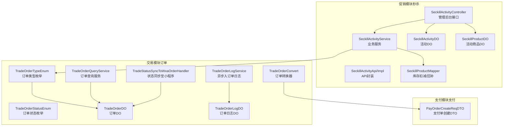
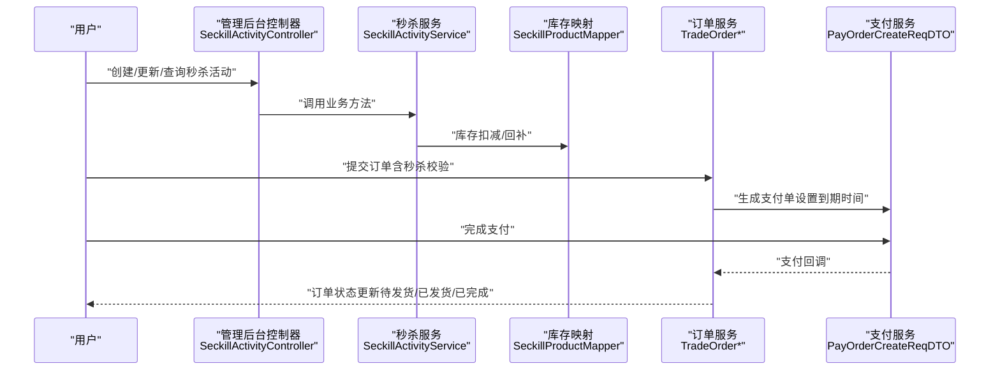
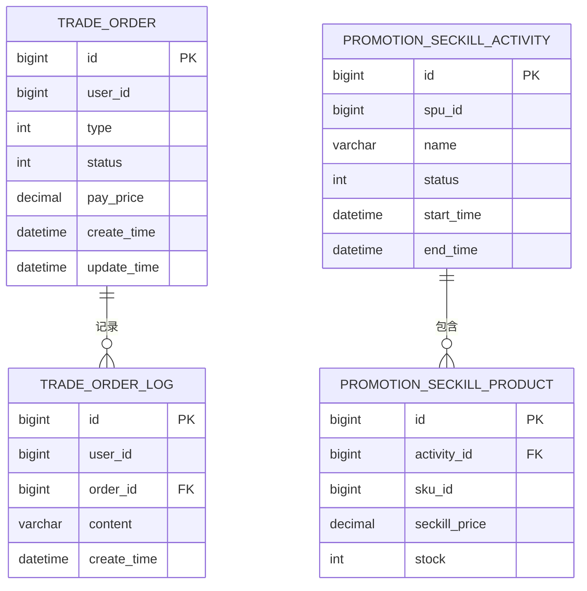
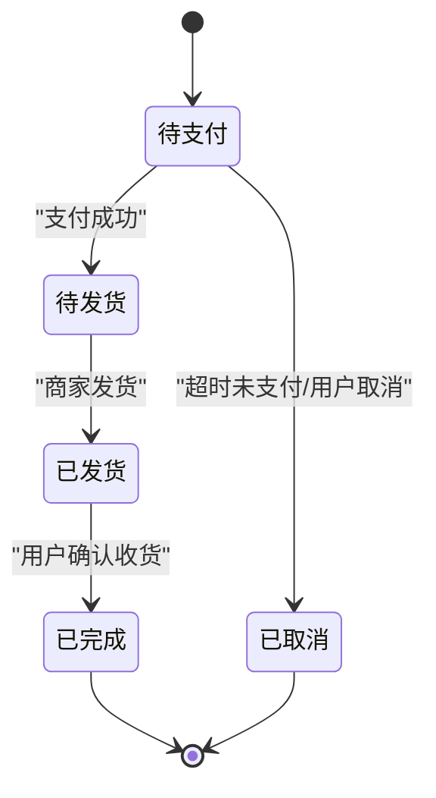
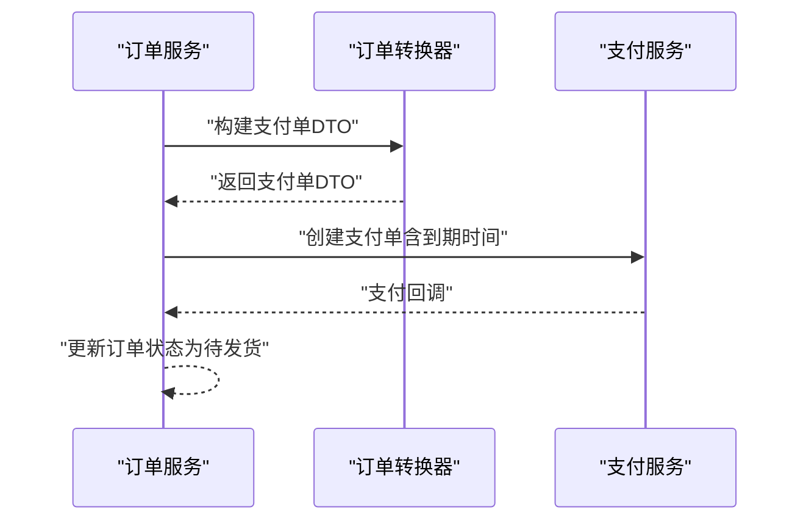
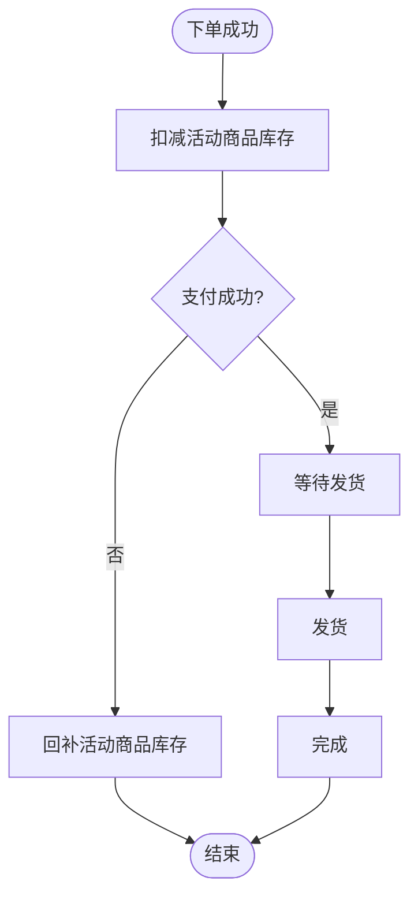
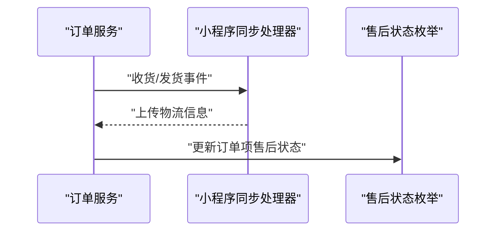
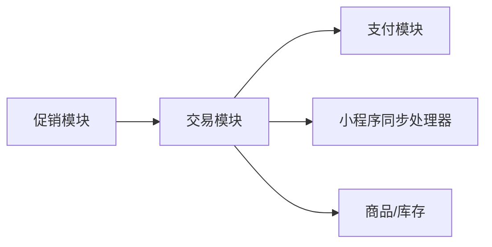

# 限时购订单

<cite>
**本文引用的文件**
- [TradeOrderStatusEnum.java](file://yudao-module-mall/yudao-module-trade-api/src/main/java/cn/iocoder/yudao/module/trade/enums/order/TradeOrderStatusEnum.java)
- [TradeOrderTypeEnum.java](file://yudao-module-mall/yudao-module-trade-api/src/main/java/cn/iocoder/yudao/module/trade/enums/order/TradeOrderTypeEnum.java)
- [TradeOrderDO.java](file://yudao-module-mall/yudao-module-trade/src/main/java/cn/iocoder/yudao/module/trade/dal/dataobject/order/TradeOrderDO.java)
- [TradeOrderLogDO.java](file://yudao-module-mall/yudao-module-trade/src/main/java/cn/iocoder/yudao/module/trade/dal/dataobject/order/TradeOrderLogDO.java)
- [TradeOrderLogService.java](file://yudao-module-mall/yudao-module-trade/src/main/java/cn/iocoder/yudao/module/trade/service/order/TradeOrderLogService.java)
- [TradeOrderQueryService.java](file://yudao-module-mall/yudao-module-trade/src/main/java/cn/iocoder/yudao/module/trade/service/order/TradeOrderQueryService.java)
- [TradeOrderConvert.java](file://yudao-module-mall/yudao-module-trade/src/main/java/cn/iocoder/yudao/module/trade/convert/order/TradeOrderConvert.java)
- [TradeStatusSyncToWxaOrderHandler.java](file://yudao-module-mall/yudao-module-trade/src/main/java/cn/iocoder/yudao/module/trade/service/order/handler/TradeStatusSyncToWxaOrderHandler.java)
- [TradeCombinationOrderHandler.java](file://yudao-module-mall/yudao-module-trade/src/main/java/cn/iocoder/yudao/module/trade/service/order/handler/TradeCombinationOrderHandler.java)
- [SeckillActivityApi.java](file://yudao-module-mall/yudao-module-promotion/src/main/java/cn/iocoder/yudao/module/promotion/api/seckill/SeckillActivityApi.java)
- [SeckillActivityApiImpl.java](file://yudao-module-mall/yudao-module-promotion/src/main/java/cn/iocoder/yudao/module/promotion/api/seckill/SeckillActivityApiImpl.java)
- [SeckillActivityService.java](file://yudao-module-mall/yudao-module-promotion/src/main/java/cn/iocoder/yudao/module/promotion/service/seckill/SeckillActivityService.java)
- [SeckillActivityController.java](file://yudao-module-mall/yudao-module-promotion/src/main/java/cn/iocoder/yudao/module/promotion/controller/admin/seckill/SeckillActivityController.java)
- [SeckillActivityDO.java](file://yudao-module-mall/yudao-module-promotion/src/main/java/cn/iocoder/yudao/module/promotion/dal/dataobject/seckill/SeckillActivityDO.java)
- [SeckillProductDO.java](file://yudao-module-mall/yudao-module-promotion/src/main/java/cn/iocoder/yudao/module/promotion/dal/dataobject/seckill/SeckillProductDO.java)
- [SeckillProductMapper.java](file://yudao-module-mall/yudao-module-promotion/src/main/java/cn/iocoder/yudao/module/promotion/dal/mysql/seckill/seckillactivity/SeckillProductMapper.java)
- [SeckillActivityConvert.java](file://yudao-module-mall/yudao-module-promotion/src/main/java/cn/iocoder/yudao/module/promotion/convert/seckill/SeckillActivityConvert.java)
- [TradeOrderItemAfterSaleStatusEnum.java](file://yudao-module-mall/yudao-module-trade-api/src/main/java/cn/iocoder/yudao/module/trade/enums/order/TradeOrderItemAfterSaleStatusEnum.java)
- [TradeOrderDetailRespVO.java](file://yudao-module-mall/yudao-module-trade/src/main/java/cn/iocoder/yudao/module/trade/controller/admin/order/vo/TradeOrderDetailRespVO.java)
- [ruoyi-vue-pro.sql（PostgreSQL）](file://sql/postgresql/ruoyi-vue-pro.sql)
- [ruoyi-vue-pro.sql（SQLServer）](file://sql/sqlserver/ruoyi-vue-pro.sql)
</cite>

## 目录
1. [引言](#引言)
2. [项目结构](#项目结构)
3. [核心组件](#核心组件)
4. [架构总览](#架构总览)
5. [详细组件分析](#详细组件分析)
6. [依赖分析](#依赖分析)
7. [性能考虑](#性能考虑)
8. [故障排查指南](#故障排查指南)
9. [结论](#结论)
10. [附录](#附录)

## 引言
本技术文档围绕“限时购订单”能力展开，系统性梳理其业务架构与实现原理，覆盖从订单创建、支付、发货到售后的完整生命周期；详述数据模型设计（订单状态、支付信息、商品详情、优惠信息、物流信息等）；明确业务规则（订单超时处理、库存锁定、支付回调、发货流程等）；解释状态流转（待支付、已支付、已发货、已完成、已取消）；并给出前端展示逻辑与配置示例、性能优化与异常处理机制。

## 项目结构
- 限时购订单能力由“促销模块（秒杀）+ 交易模块（订单）+ 支付模块（支付）+ 前端界面（Admin/Mall）”协同实现。
- 促销模块负责秒杀活动与商品配置、库存扣减与回补；交易模块负责订单创建、状态机、日志与查询；支付模块负责支付单生成与回调；前端负责订单列表与详情展示。

图示来源
- [SeckillActivityController.java:30-120](file://yudao-module-mall/yudao-module-promotion/src/main/java/cn/iocoder/yudao/module/promotion/controller/admin/seckill/SeckillActivityController.java#L30-L120)
- [SeckillActivityService.java:1-148](file://yudao-module-mall/yudao-module-promotion/src/main/java/cn/iocoder/yudao/module/promotion/service/seckill/SeckillActivityService.java#L1-L148)
- [SeckillActivityApi.java:1-43](file://yudao-module-mall/yudao-module-promotion/src/main/java/cn/iocoder/yudao/module/promotion/api/seckill/SeckillActivityApi.java#L1-L43)
- [SeckillActivityApiImpl.java:1-38](file://yudao-module-mall/yudao-module-promotion/src/main/java/cn/iocoder/yudao/module/promotion/api/seckill/SeckillActivityApiImpl.java#L1-L38)
- [SeckillActivityDO.java:1-46](file://yudao-module-mall/yudao-module-promotion/src/main/java/cn/iocoder/yudao/module/promotion/dal/dataobject/seckill/SeckillActivityDO.java#L1-L46)
- [SeckillProductDO.java:1-46](file://yudao-module-mall/yudao-module-promotion/src/main/java/cn/iocoder/yudao/module/promotion/dal/dataobject/seckill/SeckillProductDO.java#L1-L46)
- [SeckillProductMapper.java:1-40](file://yudao-module-mall/yudao-module-promotion/src/main/java/cn/iocoder/yudao/module/promotion/dal/mysql/seckill/seckillactivity/SeckillProductMapper.java#L1-L40)
- [TradeOrderStatusEnum.java:1-50](file://yudao-module-mall/yudao-module-trade-api/src/main/java/cn/iocoder/yudao/module/trade/enums/order/TradeOrderStatusEnum.java#L1-L50)
- [TradeOrderTypeEnum.java:1-62](file://yudao-module-mall/yudao-module-trade-api/src/main/java/cn/iocoder/yudao/module/trade/enums/order/TradeOrderTypeEnum.java#L1-L62)
- [TradeOrderDO.java:1-30](file://yudao-module-mall/yudao-module-trade/src/main/java/cn/iocoder/yudao/module/trade/dal/dataobject/order/TradeOrderDO.java#L1-L30)
- [TradeOrderLogDO.java:1-48](file://yudao-module-mall/yudao-module-trade/src/main/java/cn/iocoder/yudao/module/trade/dal/dataobject/order/TradeOrderLogDO.java#L1-L48)
- [TradeOrderLogService.java:1-36](file://yudao-module-mall/yudao-module-trade/src/main/java/cn/iocoder/yudao/module/trade/service/order/TradeOrderLogService.java#L1-L36)
- [TradeOrderQueryService.java:1-161](file://yudao-module-mall/yudao-module-trade/src/main/java/cn/iocoder/yudao/module/trade/service/order/TradeOrderQueryService.java#L1-L161)
- [TradeOrderConvert.java:108-128](file://yudao-module-mall/yudao-module-trade/src/main/java/cn/iocoder/yudao/module/trade/convert/order/TradeOrderConvert.java#L108-L128)
- [TradeStatusSyncToWxaOrderHandler.java:58-84](file://yudao-module-mall/yudao-module-trade/src/main/java/cn/iocoder/yudao/module/trade/service/order/handler/TradeStatusSyncToWxaOrderHandler.java#L58-L84)

章节来源
- [SeckillActivityController.java:30-120](file://yudao-module-mall/yudao-module-promotion/src/main/java/cn/iocoder/yudao/module/promotion/controller/admin/seckill/SeckillActivityController.java#L30-L120)
- [SeckillActivityService.java:1-148](file://yudao-module-mall/yudao-module-promotion/src/main/java/cn/iocoder/yudao/module/promotion/service/seckill/SeckillActivityService.java#L1-L148)
- [TradeOrderStatusEnum.java:1-50](file://yudao-module-mall/yudao-module-trade-api/src/main/java/cn/iocoder/yudao/module/trade/enums/order/TradeOrderStatusEnum.java#L1-L50)
- [TradeOrderTypeEnum.java:1-62](file://yudao-module-mall/yudao-module-trade-api/src/main/java/cn/iocoder/yudao/module/trade/enums/order/TradeOrderTypeEnum.java#L1-L62)

## 核心组件
- 秒杀活动与商品
  - 控制层：管理后台提供活动的创建、更新、关闭、删除、分页与详情查询。
  - 服务层：提供活动与商品的查询、库存扣减/回补、参与校验等。
  - 数据层：活动与商品的持久化对象及库存映射。
- 订单与状态
  - 订单类型：区分普通、秒杀、砍价、拼团、积分等。
  - 订单状态：待支付、待发货、已发货、已完成、已取消。
  - 订单日志：异步记录订单操作轨迹。
- 支付集成
  - 将订单转换为支付单，设置到期时间与主题等。
- 微信小程序状态同步
  - 在收货或发货阶段，将订单状态同步至小程序侧。

章节来源
- [SeckillActivityController.java:41-117](file://yudao-module-mall/yudao-module-promotion/src/main/java/cn/iocoder/yudao/module/promotion/controller/admin/seckill/SeckillActivityController.java#L41-L117)
- [SeckillActivityService.java:29-129](file://yudao-module-mall/yudao-module-promotion/src/main/java/cn/iocoder/yudao/module/promotion/service/seckill/SeckillActivityService.java#L29-L129)
- [TradeOrderTypeEnum.java:19-24](file://yudao-module-mall/yudao-module-trade-api/src/main/java/cn/iocoder/yudao/module/trade/enums/order/TradeOrderTypeEnum.java#L19-L24)
- [TradeOrderStatusEnum.java:20-24](file://yudao-module-mall/yudao-module-trade-api/src/main/java/cn/iocoder/yudao/module/trade/enums/order/TradeOrderStatusEnum.java#L20-L24)
- [TradeOrderLogService.java:24-33](file://yudao-module-mall/yudao-module-trade/src/main/java/cn/iocoder/yudao/module/trade/service/order/TradeOrderLogService.java#L24-L33)
- [TradeOrderConvert.java:108-115](file://yudao-module-mall/yudao-module-trade/src/main/java/cn/iocoder/yudao/module/trade/convert/order/TradeOrderConvert.java#L108-L115)
- [TradeStatusSyncToWxaOrderHandler.java:58-84](file://yudao-module-mall/yudao-module-trade/src/main/java/cn/iocoder/yudao/module/trade/service/order/handler/TradeStatusSyncToWxaOrderHandler.java#L58-L84)

## 架构总览
限时购订单的关键流程：
- 下单前校验：调用秒杀API校验活动与商品是否允许参与。
- 库存扣减：成功下单后扣减活动商品库存。
- 订单创建：生成交易订单，标记为“秒杀订单”，设置支付单到期时间。
- 支付回调：支付完成后更新订单状态。
- 发货/收货：发货后同步物流信息；收货后完成订单闭环。
- 售后：支持售后申请与状态跟踪。

图示来源
- [SeckillActivityController.java:41-117](file://yudao-module-mall/yudao-module-promotion/src/main/java/cn/iocoder/yudao/module/promotion/controller/admin/seckill/SeckillActivityController.java#L41-L117)
- [SeckillActivityService.java:45-54](file://yudao-module-mall/yudao-module-promotion/src/main/java/cn/iocoder/yudao/module/promotion/service/seckill/SeckillActivityService.java#L45-L54)
- [SeckillProductMapper.java:33-40](file://yudao-module-mall/yudao-module-promotion/src/main/java/cn/iocoder/yudao/module/promotion/dal/mysql/seckill/seckillactivity/SeckillProductMapper.java#L33-L40)
- [TradeOrderConvert.java:108-115](file://yudao-module-mall/yudao-module-trade/src/main/java/cn/iocoder/yudao/module/trade/convert/order/TradeOrderConvert.java#L108-L115)

## 详细组件分析

### 数据模型设计
- 订单（TradeOrderDO）
  - 关键字段：订单号、用户ID、订单类型（秒杀）、订单状态、应付金额、收货人信息、支付单号、发货/收货时间、售后状态等。
  - 关联：订单项、物流信息、支付单。
- 秒杀活动（SeckillActivityDO）
  - 关键字段：活动名称、SPU编号、活动时段、状态、开始/结束时间等。
- 秒杀商品（SeckillProductDO）
  - 关键字段：活动ID、SKU ID、秒杀价格、活动库存等。
- 订单日志（TradeOrderLogDO）
  - 关键字段：用户ID、操作类型、订单ID、内容、时间等。
- 订单类型/状态（枚举）
  - 类型：普通、秒杀、砍价、拼团、积分。
  - 状态：待支付、待发货、已发货、已完成、已取消。

图示来源
- [TradeOrderDO.java:1-30](file://yudao-module-mall/yudao-module-trade/src/main/java/cn/iocoder/yudao/module/trade/dal/dataobject/order/TradeOrderDO.java#L1-L30)
- [SeckillActivityDO.java:1-46](file://yudao-module-mall/yudao-module-promotion/src/main/java/cn/iocoder/yudao/module/promotion/dal/dataobject/seckill/SeckillActivityDO.java#L1-L46)
- [SeckillProductDO.java:1-46](file://yudao-module-mall/yudao-module-promotion/src/main/java/cn/iocoder/yudao/module/promotion/dal/dataobject/seckill/SeckillProductDO.java#L1-L46)
- [TradeOrderLogDO.java:1-48](file://yudao-module-mall/yudao-module-trade/src/main/java/cn/iocoder/yudao/module/trade/dal/dataobject/order/TradeOrderLogDO.java#L1-L48)

章节来源
- [TradeOrderDO.java:1-30](file://yudao-module-mall/yudao-module-trade/src/main/java/cn/iocoder/yudao/module/trade/dal/dataobject/order/TradeOrderDO.java#L1-L30)
- [SeckillActivityDO.java:1-46](file://yudao-module-mall/yudao-module-promotion/src/main/java/cn/iocoder/yudao/module/promotion/dal/dataobject/seckill/SeckillActivityDO.java#L1-L46)
- [SeckillProductDO.java:1-46](file://yudao-module-mall/yudao-module-promotion/src/main/java/cn/iocoder/yudao/module/promotion/dal/dataobject/seckill/SeckillProductDO.java#L1-L46)
- [TradeOrderLogDO.java:1-48](file://yudao-module-mall/yudao-module-trade/src/main/java/cn/iocoder/yudao/module/trade/dal/dataobject/order/TradeOrderLogDO.java#L1-L48)

### 业务规则与状态流转
- 状态枚举
  - 待支付、待发货、已发货、已完成、已取消。
- 状态流转
  - 创建订单后进入“待支付”；支付成功后进入“待发货”；发货后进入“已发货”；收货后进入“已完成”；若超时未支付或主动取消则进入“已取消”。

图示来源
- [TradeOrderStatusEnum.java:20-24](file://yudao-module-mall/yudao-module-trade-api/src/main/java/cn/iocoder/yudao/module/trade/enums/order/TradeOrderStatusEnum.java#L20-L24)

章节来源
- [TradeOrderStatusEnum.java:1-50](file://yudao-module-mall/yudao-module-trade-api/src/main/java/cn/iocoder/yudao/module/trade/enums/order/TradeOrderStatusEnum.java#L1-L50)

### 订单创建与支付集成
- 订单创建
  - 通过订单转换器将订单转为支付单DTO，设置主题、金额、到期时间等。
- 支付回调
  - 支付完成后，订单状态由“待支付”流转至“待发货”。

图示来源
- [TradeOrderConvert.java:108-115](file://yudao-module-mall/yudao-module-trade/src/main/java/cn/iocoder/yudao/module/trade/convert/order/TradeOrderConvert.java#L108-L115)

章节来源
- [TradeOrderConvert.java:108-115](file://yudao-module-mall/yudao-module-trade/src/main/java/cn/iocoder/yudao/module/trade/convert/order/TradeOrderConvert.java#L108-L115)

### 库存锁定与释放
- 库存扣减
  - 成功下单后调用服务层扣减活动商品库存。
- 库存释放
  - 订单取消或超时未支付时，调用服务层回补库存。

图示来源
- [SeckillActivityService.java:45-54](file://yudao-module-mall/yudao-module-promotion/src/main/java/cn/iocoder/yudao/module/promotion/service/seckill/SeckillActivityService.java#L45-L54)
- [SeckillProductMapper.java:33-40](file://yudao-module-mall/yudao-module-promotion/src/main/java/cn/iocoder/yudao/module/promotion/dal/mysql/seckill/seckillactivity/SeckillProductMapper.java#L33-L40)

章节来源
- [SeckillActivityService.java:45-54](file://yudao-module-mall/yudao-module-promotion/src/main/java/cn/iocoder/yudao/module/promotion/service/seckill/SeckillActivityService.java#L45-L54)
- [SeckillProductMapper.java:33-40](file://yudao-module-mall/yudao-module-promotion/src/main/java/cn/iocoder/yudao/module/promotion/dal/mysql/seckill/seckillactivity/SeckillProductMapper.java#L33-L40)

### 发货与售后
- 发货
  - 发货后同步物流信息至小程序（如适用）。
- 售后
  - 订单项支持“未售后/售后中/售后成功”状态跟踪。

图示来源
- [TradeStatusSyncToWxaOrderHandler.java:58-84](file://yudao-module-mall/yudao-module-trade/src/main/java/cn/iocoder/yudao/module/trade/service/order/handler/TradeStatusSyncToWxaOrderHandler.java#L58-L84)
- [TradeOrderItemAfterSaleStatusEnum.java:19-21](file://yudao-module-mall/yudao-module-trade-api/src/main/java/cn/iocoder/yudao/module/trade/enums/order/TradeOrderItemAfterSaleStatusEnum.java#L19-L21)

章节来源
- [TradeStatusSyncToWxaOrderHandler.java:58-84](file://yudao-module-mall/yudao-module-trade/src/main/java/cn/iocoder/yudao/module/trade/service/order/handler/TradeStatusSyncToWxaOrderHandler.java#L58-L84)
- [TradeOrderItemAfterSaleStatusEnum.java:1-49](file://yudao-module-mall/yudao-module-trade-api/src/main/java/cn/iocoder/yudao/module/trade/enums/order/TradeOrderItemAfterSaleStatusEnum.java#L1-L49)

### 前端展示逻辑
- 订单列表与详情
  - 后台提供订单分页与详情视图，包含订单项、收货信息、物流轨迹等。
- 订单类型标识
  - 通过订单类型区分“秒杀订单”，便于前端展示不同入口与提示。

章节来源
- [TradeOrderQueryService.java:67-161](file://yudao-module-mall/yudao-module-trade/src/main/java/cn/iocoder/yudao/module/trade/service/order/TradeOrderQueryService.java#L67-L161)
- [TradeOrderTypeEnum.java:19-24](file://yudao-module-mall/yudao-module-trade-api/src/main/java/cn/iocoder/yudao/module/trade/enums/order/TradeOrderTypeEnum.java#L19-L24)
- [TradeOrderDetailRespVO.java:52-63](file://yudao-module-mall/yudao-module-trade/src/main/java/cn/iocoder/yudao/module/trade/controller/admin/order/vo/TradeOrderDetailRespVO.java#L52-L63)

### 配置示例与页面位置
- 页面位置字典
  - 系统字典中包含“秒杀活动页”、“砍价活动页”、“限时折扣页”等位置枚举，用于页面跳转与广告位配置。
- 示例路径
  - 管理后台秒杀活动控制器：/promotion/seckill-activity

章节来源
- [ruoyi-vue-pro.sql（PostgreSQL）:814-817](file://sql/postgresql/ruoyi-vue-pro.sql#L814-L817)
- [ruoyi-vue-pro.sql（SQLServer）:2255-2263](file://sql/sqlserver/ruoyi-vue-pro.sql#L2255-L2263)
- [SeckillActivityController.java:30-34](file://yudao-module-mall/yudao-module-promotion/src/main/java/cn/iocoder/yudao/module/promotion/controller/admin/seckill/SeckillActivityController.java#L30-L34)

## 依赖分析
- 组件耦合
  - 促销模块与交易模块通过订单类型与库存接口耦合；交易模块与支付模块通过支付单DTO耦合；交易模块与小程序同步处理器通过状态事件耦合。
- 外部依赖
  - 支付模块负责支付单创建与回调；物流轨迹查询由交易模块统一提供。

图示来源
- [SeckillActivityService.java:1-148](file://yudao-module-mall/yudao-module-promotion/src/main/java/cn/iocoder/yudao/module/promotion/service/seckill/SeckillActivityService.java#L1-L148)
- [TradeOrderConvert.java:108-115](file://yudao-module-mall/yudao-module-trade/src/main/java/cn/iocoder/yudao/module/trade/convert/order/TradeOrderConvert.java#L108-L115)
- [TradeStatusSyncToWxaOrderHandler.java:58-84](file://yudao-module-mall/yudao-module-trade/src/main/java/cn/iocoder/yudao/module/trade/service/order/handler/TradeStatusSyncToWxaOrderHandler.java#L58-L84)

章节来源
- [SeckillActivityService.java:1-148](file://yudao-module-mall/yudao-module-promotion/src/main/java/cn/iocoder/yudao/module/promotion/service/seckill/SeckillActivityService.java#L1-L148)
- [TradeOrderConvert.java:108-115](file://yudao-module-mall/yudao-module-trade/src/main/java/cn/iocoder/yudao/module/trade/convert/order/TradeOrderConvert.java#L108-L115)
- [TradeStatusSyncToWxaOrderHandler.java:58-84](file://yudao-module-mall/yudao-module-trade/src/main/java/cn/iocoder/yudao/module/trade/service/order/handler/TradeStatusSyncToWxaOrderHandler.java#L58-L84)

## 性能考虑
- 异步日志
  - 订单日志采用异步记录，降低主流程阻塞风险。
- 批量查询
  - 订单与订单项按订单ID批量查询，减少多次往返。
- 库存扣减原子性
  - 库存扣减与回补通过Mapper层的原子更新保证一致性。
- 支付到期时间
  - 设置合理的支付到期时间，避免长时间占用资源。

章节来源
- [TradeOrderLogService.java:24-33](file://yudao-module-mall/yudao-module-trade/src/main/java/cn/iocoder/yudao/module/trade/service/order/TradeOrderLogService.java#L24-L33)
- [SeckillProductMapper.java:33-40](file://yudao-module-mall/yudao-module-promotion/src/main/java/cn/iocoder/yudao/module/promotion/dal/mysql/seckill/seckillactivity/SeckillProductMapper.java#L33-L40)
- [TradeOrderConvert.java:108-115](file://yudao-module-mall/yudao-module-trade/src/main/java/cn/iocoder/yudao/module/trade/convert/order/TradeOrderConvert.java#L108-L115)

## 故障排查指南
- 订单状态异常
  - 使用订单日志服务查询订单操作历史，定位状态变更原因。
- 库存不一致
  - 核对库存扣减与回补调用链，检查Mapper层更新结果。
- 支付回调未生效
  - 检查支付单到期时间与回调触发条件，确保回调正确落库。
- 小程序状态不同步
  - 触发发货/收货事件后，检查小程序同步处理器执行情况。

章节来源
- [TradeOrderLogService.java:24-33](file://yudao-module-mall/yudao-module-trade/src/main/java/cn/iocoder/yudao/module/trade/service/order/TradeOrderLogService.java#L24-L33)
- [TradeStatusSyncToWxaOrderHandler.java:58-84](file://yudao-module-mall/yudao-module-trade/src/main/java/cn/iocoder/yudao/module/trade/service/order/handler/TradeStatusSyncToWxaOrderHandler.java#L58-L84)

## 结论
限时购订单以“秒杀活动+交易订单+支付回调+小程序同步”为核心，通过清晰的状态机与严格的库存扣减/回补机制，保障高并发场景下的可靠性。建议在生产环境中结合异步日志、批量查询与原子更新等手段持续优化性能，并完善监控与告警体系。

## 附录
- 关键接口与职责
  - 秒杀活动控制层：提供活动的增删改查与分页。
  - 秒杀活动服务层：提供库存扣减/回补与参与校验。
  - 订单服务层：提供订单查询、日志异步记录与状态同步。
  - 支付集成：将订单转换为支付单并设置到期时间。
- 前端页面位置
  - “秒杀活动页”等页面位置字典项可用于导航与广告位配置。

章节来源
- [SeckillActivityController.java:41-117](file://yudao-module-mall/yudao-module-promotion/src/main/java/cn/iocoder/yudao/module/promotion/controller/admin/seckill/SeckillActivityController.java#L41-L117)
- [SeckillActivityService.java:29-129](file://yudao-module-mall/yudao-module-promotion/src/main/java/cn/iocoder/yudao/module/promotion/service/seckill/SeckillActivityService.java#L29-L129)
- [TradeOrderQueryService.java:67-161](file://yudao-module-mall/yudao-module-trade/src/main/java/cn/iocoder/yudao/module/trade/service/order/TradeOrderQueryService.java#L67-L161)
- [TradeOrderConvert.java:108-115](file://yudao-module-mall/yudao-module-trade/src/main/java/cn/iocoder/yudao/module/trade/convert/order/TradeOrderConvert.java#L108-L115)
- [ruoyi-vue-pro.sql（PostgreSQL）:814-817](file://sql/postgresql/ruoyi-vue-pro.sql#L814-L817)
- [ruoyi-vue-pro.sql（SQLServer）:2255-2263](file://sql/sqlserver/ruoyi-vue-pro.sql#L2255-L2263)