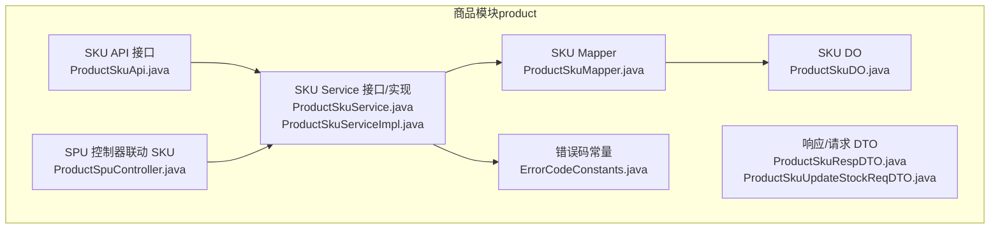
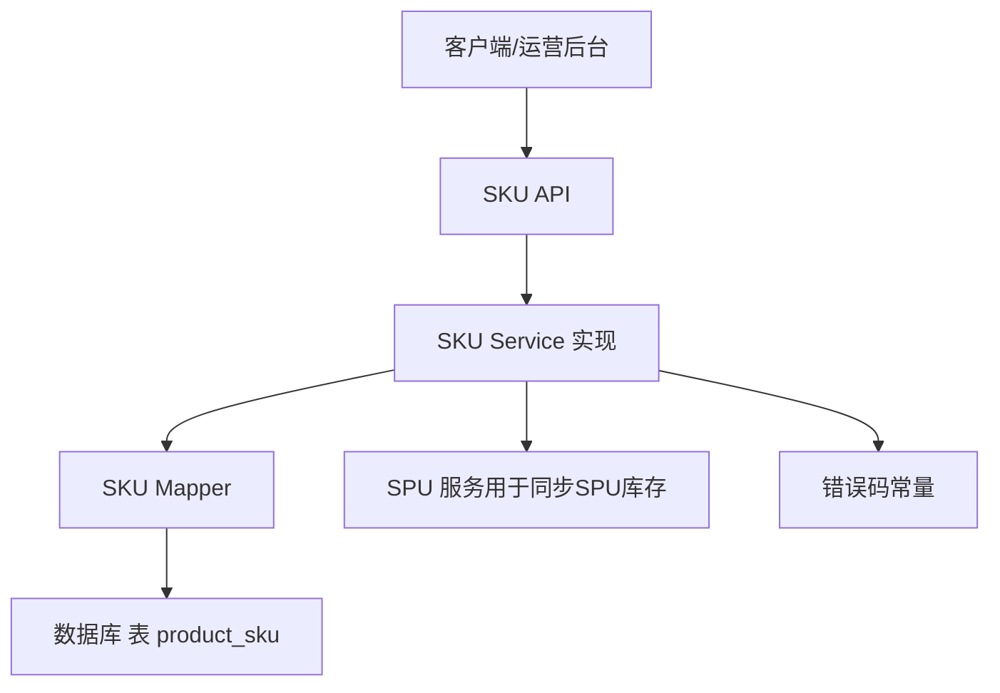
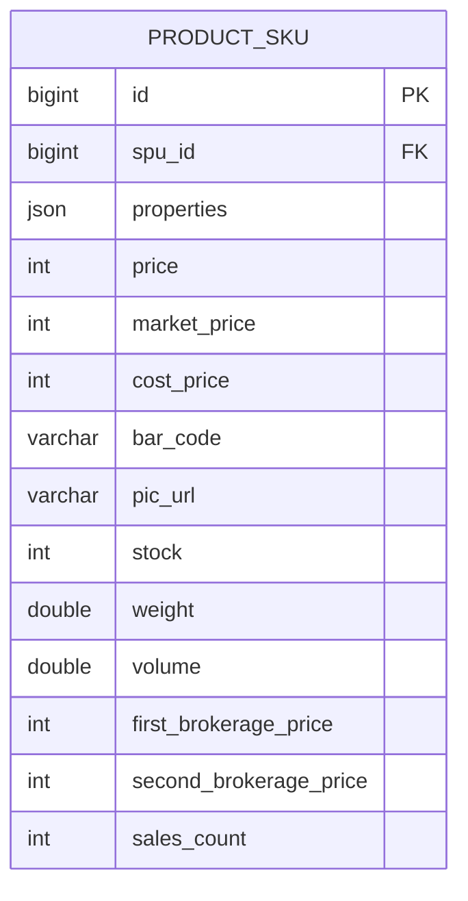
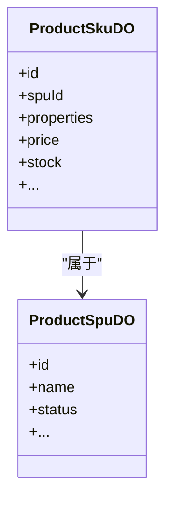
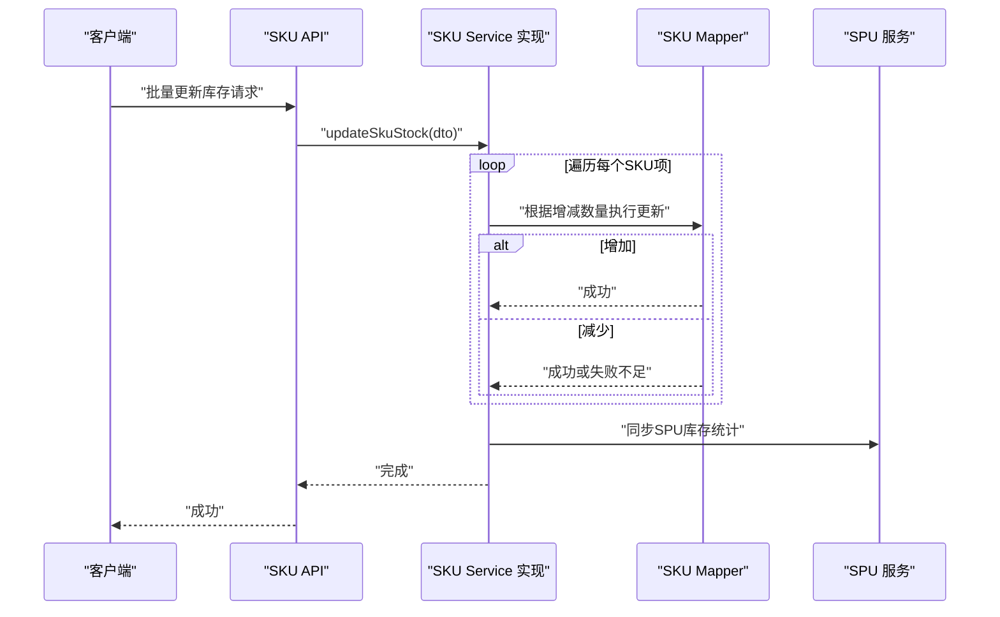
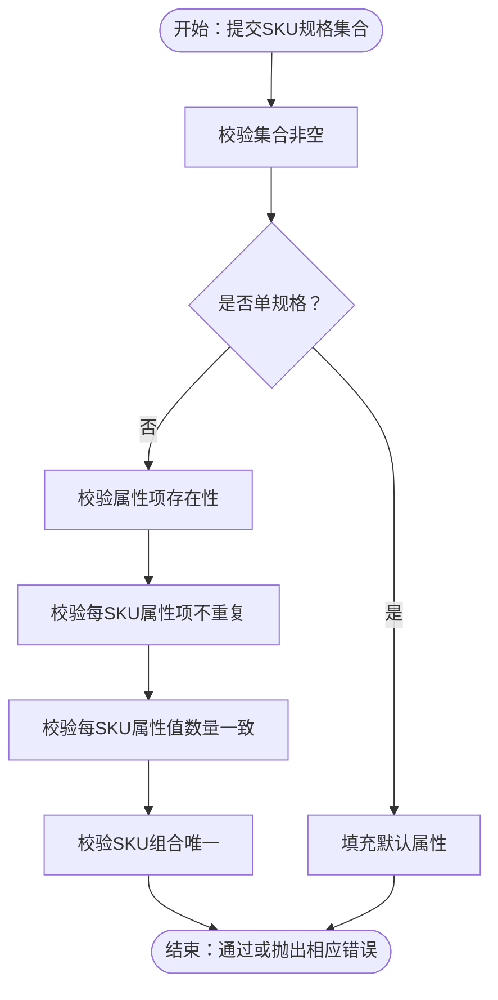
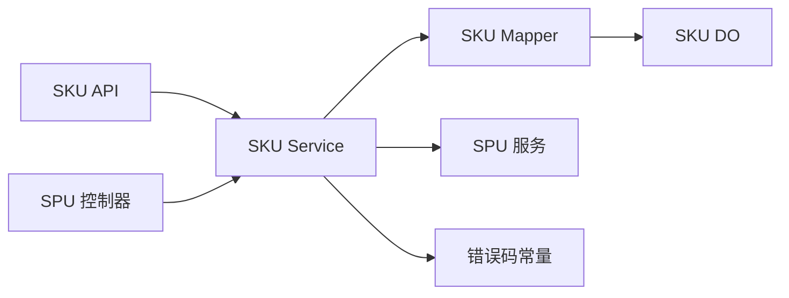

# SKU管理

<cite>
**本文引用的文件**
- [ProductSkuDO.java](file://yudao-module-mall/yudao-module-product/src/main/java/cn/iocoder/yudao/module/product/dal/dataobject/sku/ProductSkuDO.java)
- [ProductSkuService.java](file://yudao-module-mall/yudao-module-product/src/main/java/cn/iocoder/yudao/module/product/service/sku/ProductSkuService.java)
- [ProductSkuServiceImpl.java](file://yudao-module-mall/yudao-module-product/src/main/java/cn/iocoder/yudao/module/product/service/sku/ProductSkuServiceImpl.java)
- [ProductSkuMapper.java](file://yudao-module-mall/yudao-module-product/src/main/java/cn/iocoder/yudao/module/product/dal/mysql/sku/ProductSkuMapper.java)
- [ProductSkuApi.java](file://yudao-module-mall/yudao-module-product/src/main/java/cn/iocoder/yudao/module/product/api/stock/ProductSkuApi.java)
- [ProductSkuRespDTO.java](file://yudao-module-mall/yudao-module-product/src/main/java/cn/iocoder/yudao/module/product/api/stock/dto/ProductSkuRespDTO.java)
- [ProductSkuUpdateStockReqDTO.java](file://yudao-module-mall/yudao-module-product/src/main/java/cn/iocoder/yudao/module/product/api/stock/dto/ProductSkuUpdateStockReqDTO.java)
- [ProductSpuController.java](file://yudao-module-mall/yudao-module-product/src/main/java/cn/iocoder/yudao/module/product/controller/admin/spu/ProductSpuController.java)
- [ErrorCodeConstants.java](file://yudao-module-mall/yudao-module-product/src/main/java/cn/iocoder/yudao/module/product/enums/ErrorCodeConstants.java)
</cite>

## 目录
1. [简介](#简介)
2. [项目结构](#项目结构)
3. [核心组件](#核心组件)
4. [架构总览](#架构总览)
5. [详细组件分析](#详细组件分析)
6. [依赖分析](#依赖分析)
7. [性能考虑](#性能考虑)
8. [故障排查指南](#故障排查指南)
9. [结论](#结论)
10. [附录](#附录)

## 简介
SKU（标准库存单位，Stock Keeping Unit）是电商系统中最小可用的库存单元，用于唯一标识一个具体规格的商品。在本项目中，SKU与SPU（标准化产品单元）紧密关联：SPU代表抽象商品，SKU代表具体的规格组合（如颜色、尺寸、版本等）。SKU承担着价格、库存、图片、条码、重量/体积、分销佣金等关键业务字段，并通过服务层完成创建、校验、更新与批量操作。

## 项目结构
围绕SKU管理的关键模块位于“商品模块（product）”内，主要由以下层次构成：
- 数据访问层（DAO/DO）：定义SKU实体与持久化接口
- 服务层（Service）：实现SKU的业务逻辑，包括校验、创建、更新、库存变更、批量同步等
- 应用接口层（API）：对外暴露SKU查询与库存更新能力
- 控制器层（Controller）：在SPU控制器中联动展示SKU列表与详情
- 错误码常量：统一定义SKU相关错误场景

图表来源
- [ProductSkuApi.java:1-62](file://yudao-module-mall/yudao-module-product/src/main/java/cn/iocoder/yudao/module/product/api/stock/ProductSkuApi.java#L1-L62)
- [ProductSkuRespDTO.java:1-72](file://yudao-module-mall/yudao-module-product/src/main/java/cn/iocoder/yudao/module/product/api/stock/dto/ProductSkuRespDTO.java#L1-L72)
- [ProductSkuUpdateStockReqDTO.java](file://yudao-module-mall/yudao-module-product/src/main/java/cn/iocoder/yudao/module/product/api/stock/dto/ProductSkuUpdateStockReqDTO.java)
- [ProductSkuService.java](file://yudao-module-mall/yudao-module-product/src/main/java/cn/iocoder/yudao/module/product/service/stock/ProductSkuService.java)
- [ProductSkuServiceImpl.java:1-279](file://yudao-module-mall/yudao-module-product/src/main/java/cn/iocoder/yudao/module/product/service/stock/ProductSkuServiceImpl.java#L1-L279)
- [ProductSkuMapper.java:1-73](file://yudao-module-mall/yudao-module-product/src/main/java/cn/iocoder/yudao/module/product/dal/mysql/stock/ProductSkuMapper.java#L1-L73)
- [ProductSkuDO.java](file://yudao-module-mall/yudao-module-product/src/main/java/cn/iocoder/yudao/module/product/dal/dataobject/stock/ProductSkuDO.java)
- [ProductSpuController.java:1-141](file://yudao-module-mall/yudao-module-product/src/main/java/cn/iocoder/yudao/module/product/controller/admin/spu/ProductSpuController.java#L1-L141)
- [ErrorCodeConstants.java:1-57](file://yudao-module-mall/yudao-module-product/src/main/java/cn/iocoder/yudao/module/product/enums/ErrorCodeConstants.java#L1-L57)

章节来源
- [ProductSkuDO.java:1-135](file://yudao-module-mall/yudao-module-product/src/main/java/cn/iocoder/yudao/module/product/dal/dataobject/sku/ProductSkuDO.java#L1-L135)
- [ProductSkuService.java:1-123](file://yudao-module-mall/yudao-module-product/src/main/java/cn/iocoder/yudao/module/product/service/stock/ProductSkuService.java)
- [ProductSkuServiceImpl.java:1-279](file://yudao-module-mall/yudao-module-product/src/main/java/cn/iocoder/yudao/module/product/service/stock/ProductSkuServiceImpl.java#L1-L279)
- [ProductSkuMapper.java:1-73](file://yudao-module-mall/yudao-module-product/src/main/java/cn/iocoder/yudao/module/product/dal/mysql/stock/ProductSkuMapper.java#L1-L73)
- [ProductSkuApi.java:1-62](file://yudao-module-mall/yudao-module-product/src/main/java/cn/iocoder/yudao/module/product/api/stock/ProductSkuApi.java#L1-L62)
- [ProductSkuRespDTO.java:1-72](file://yudao-module-mall/yudao-module-product/src/main/java/cn/iocoder/yudao/module/product/api/stock/dto/ProductSkuRespDTO.java#L1-L72)
- [ProductSkuUpdateStockReqDTO.java](file://yudao-module-mall/yudao-module-product/src/main/java/cn/iocoder/yudao/module/product/api/stock/dto/ProductSkuUpdateStockReqDTO.java)
- [ProductSpuController.java:1-141](file://yudao-module-mall/yudao-module-product/src/main/java/cn/iocoder/yudao/module/product/controller/admin/spu/ProductSpuController.java#L1-L141)
- [ErrorCodeConstants.java:1-57](file://yudao-module-mall/yudao-module-product/src/main/java/cn/iocoder/yudao/module/product/enums/ErrorCodeConstants.java#L1-L57)

## 核心组件
- SKU实体（DO）：承载SKU的全部业务字段，包括SPU关联、属性数组（JSON）、价格体系（销售价/市场价/成本价）、库存、图片、条码、重量/体积、分销佣金、销量统计等
- SKU服务（Service）：提供SKU的创建、校验、更新、按SPU批量查询、按SPU删除、属性/属性值名称同步、库存更新等能力
- SKU数据访问（Mapper）：提供按SPU查询、按ID包含软删查询、批量插入、按ID集合查询、库存增减（带并发安全检查）等方法
- SKU API：对外提供按ID/集合查询、按SPU集合查询、批量库存更新等能力
- SPU控制器：在SPU详情页联动加载SKU列表，便于管理与展示

章节来源
- [ProductSkuDO.java:31-131](file://yudao-module-mall/yudao-module-product/src/main/java/cn/iocoder/yudao/module/product/dal/dataobject/sku/ProductSkuDO.java#L31-L131)
- [ProductSkuService.java:15-122](file://yudao-module-mall/yudao-module-product/src/main/java/cn/iocoder/yudao/module/product/service/stock/ProductSkuService.java#L15-L122)
- [ProductSkuMapper.java:27-70](file://yudao-module-mall/yudao-module-product/src/main/java/cn/iocoder/yudao/module/product/dal/mysql/stock/ProductSkuMapper.java#L27-L70)
- [ProductSkuApi.java:18-61](file://yudao-module-mall/yudao-module-product/src/main/java/cn/iocoder/yudao/module/product/api/stock/ProductSkuApi.java#L18-L61)
- [ProductSpuController.java:88-91](file://yudao-module-mall/yudao-module-product/src/main/java/cn/iocoder/yudao/module/product/controller/admin/spu/ProductSpuController.java#L88-L91)

## 架构总览
SKU管理采用经典的分层架构：API层负责对外暴露能力；Service层封装业务规则与事务；Mapper层负责SQL执行；DO层承载数据模型。SPU控制器在商品管理界面中联动展示SKU，便于运营人员维护规格与库存。

图表来源
- [ProductSkuApi.java:18-61](file://yudao-module-mall/yudao-module-product/src/main/java/cn/iocoder/yudao/module/product/api/stock/ProductSkuApi.java#L18-L61)
- [ProductSkuServiceImpl.java:255-276](file://yudao-module-mall/yudao-module-product/src/main/java/cn/iocoder/yudao/module/product/service/stock/ProductSkuServiceImpl.java#L255-L276)
- [ProductSkuMapper.java:45-70](file://yudao-module-mall/yudao-module-product/src/main/java/cn/iocoder/yudao/module/product/dal/mysql/stock/ProductSkuMapper.java#L45-L70)
- [ErrorCodeConstants.java:41-46](file://yudao-module-mall/yudao-module-product/src/main/java/cn/iocoder/yudao/module/product/enums/ErrorCodeConstants.java#L41-L46)

## 详细组件分析

### 数据模型设计（SKU）
- 关键字段
  - 主键与SPU关联：id、spuId
  - 规格属性：properties（JSON数组，包含属性ID/名称、属性值ID/名称）
  - 价格体系：price（销售价）、marketPrice（市场价）、costPrice（成本价），单位均为“分”
  - 库存与统计：stock（库存）、salesCount（销量）
  - 物流参数：weight（重量kg）、volume（体积m³）
  - 营销与分销：firstBrokeragePrice、secondBrokeragePrice（单位分）
  - 其他：barCode（条形码）、picUrl（图片地址）
- 属性冗余策略：属性与属性值名称在SKU中冗余存储，便于查询与展示；当属性或属性值名称变更时，需同步更新SKU中的对应字段
- JSON序列化：通过JacksonTypeHandler处理properties字段的序列化/反序列化

图表来源
- [ProductSkuDO.java:34-95](file://yudao-module-mall/yudao-module-product/src/main/java/cn/iocoder/yudao/module/product/dal/dataobject/sku/ProductSkuDO.java#L34-L95)

章节来源
- [ProductSkuDO.java:31-131](file://yudao-module-mall/yudao-module-product/src/main/java/cn/iocoder/yudao/module/product/dal/dataobject/sku/ProductSkuDO.java#L31-L131)

### SKU与SPU的关联关系
- 一对多关系：一个SPU可包含多个SKU，每个SKU绑定到唯一的SPU
- 在SPU控制器中，通过“按SPU查询SKU列表”的方式在详情页展示规格组合
- 当SKU属性或属性值名称发生变更时，服务层提供批量更新能力，确保SKU冗余字段一致性

图表来源
- [ProductSkuDO.java:37-41](file://yudao-module-mall/yudao-module-product/src/main/java/cn/iocoder/yudao/module/product/dal/dataobject/sku/ProductSkuDO.java#L37-L41)
- [ProductSpuController.java:88-91](file://yudao-module-mall/yudao-module-product/src/main/java/cn/iocoder/yudao/module/product/controller/admin/spu/ProductSpuController.java#L88-L91)

章节来源
- [ProductSpuController.java:88-91](file://yudao-module-mall/yudao-module-product/src/main/java/cn/iocoder/yudao/module/product/controller/admin/spu/ProductSpuController.java#L88-L91)

### 价格管理机制
- 字段维度：销售价（price）、市场价（marketPrice）、成本价（costPrice），单位统一为“分”，便于精确计算与比较
- 业务含义：销售价用于前台展示与下单结算；市场价用于标示原价或划线价；成本价用于财务核算与利润计算
- 价格变更流程：通过SKU服务提供的批量更新能力，结合SPU控制器的页面交互，实现价格的统一调整

章节来源
- [ProductSkuDO.java:48-58](file://yudao-module-mall/yudao-module-product/src/main/java/cn/iocoder/yudao/module/product/dal/dataobject/sku/ProductSkuDO.java#L48-L58)
- [ProductSkuRespDTO.java:31-41](file://yudao-module-mall/yudao-module-product/src/main/java/cn/iocoder/yudao/module/product/api/stock/dto/ProductSkuRespDTO.java#L31-L41)

### 库存管理
- 字段维度：stock（可用库存）、salesCount（销量）
- 库存更新策略
  - 增加库存：通过Mapper的updateStockIncr实现，同时减少销量统计
  - 减少库存：通过Mapper的updateStockDecr实现，带库存下限校验（防止负数）
  - 批量更新：服务层接收请求DTO，逐项执行增减并保证事务一致性
- SPU库存同步：在SKU库存更新完成后，服务层汇总各SKU的库存变化，调用SPU服务同步SPU级别的库存统计

图表来源
- [ProductSkuApi.java:55-59](file://yudao-module-mall/yudao-module-product/src/main/java/cn/iocoder/yudao/module/product/api/stock/ProductSkuApi.java#L55-L59)
- [ProductSkuServiceImpl.java:255-276](file://yudao-module-mall/yudao-module-product/src/main/java/cn/iocoder/yudao/module/product/service/stock/ProductSkuServiceImpl.java#L255-L276)
- [ProductSkuMapper.java:45-70](file://yudao-module-mall/yudao-module-product/src/main/java/cn/iocoder/yudao/module/product/dal/mysql/stock/ProductSkuMapper.java#L45-L70)

章节来源
- [ProductSkuServiceImpl.java:255-276](file://yudao-module-mall/yudao-module-product/src/main/java/cn/iocoder/yudao/module/product/service/stock/ProductSkuServiceImpl.java#L255-L276)
- [ProductSkuMapper.java:45-70](file://yudao-module-mall/yudao-module-product/src/main/java/cn/iocoder/yudao/module/product/dal/mysql/stock/ProductSkuMapper.java#L45-L70)

### 规格组合与SKU生成
- 规格校验流程：服务层对提交的SKU规格集合进行严格校验，包括属性项存在性、每SKU属性项数量一致性、SKU组合唯一性等
- 单规格处理：当SPU为单规格时，自动填充默认属性，简化录入
- 规格变更同步：当属性或属性值名称变更时，支持批量更新SKU中的冗余字段，保持展示一致性

图表来源
- [ProductSkuServiceImpl.java:87-143](file://yudao-module-mall/yudao-module-product/src/main/java/cn/iocoder/yudao/module/product/service/stock/ProductSkuServiceImpl.java#L87-L143)

章节来源
- [ProductSkuServiceImpl.java:87-143](file://yudao-module-mall/yudao-module-product/src/main/java/cn/iocoder/yudao/module/product/service/stock/ProductSkuServiceImpl.java#L87-L143)

### 批量操作能力
- 批量创建：基于传入的SKU规格集合，直接批量插入
- 批量更新：对比现有SKU与提交规格，拆分为新增、更新、删除三类，分别执行批量操作
- 批量库存更新：支持按SKU ID与增减数量进行批量库存调整，并在事务内保证一致性
- 批量属性/属性值名称同步：当属性或属性值名称变更时，批量更新SKU冗余字段

章节来源
- [ProductSkuServiceImpl.java:146-149](file://yudao-module-mall/yudao-module-product/src/main/java/cn/iocoder/yudao/module/product/service/stock/ProductSkuServiceImpl.java#L146-L149)
- [ProductSkuServiceImpl.java:220-253](file://yudao-module-mall/yudao-module-product/src/main/java/cn/iocoder/yudao/module/product/service/stock/ProductSkuServiceImpl.java#L220-L253)
- [ProductSkuServiceImpl.java:170-216](file://yudao-module-mall/yudao-module-product/src/main/java/cn/iocoder/yudao/module/product/service/stock/ProductSkuServiceImpl.java#L170-L216)

### 与订单系统的集成
- 下单时SKU选择：订单系统从SPU控制器或SKU API获取SKU列表，用户选择具体规格（SKU）
- 库存扣减：在订单创建或支付流程中，调用SKU库存更新接口进行扣减；若库存不足，服务层抛出“库存不足”错误
- 库存回滚：在订单取消或关闭时，应调用库存增加接口恢复库存（此流程在订单模块中实现）

章节来源
- [ProductSpuController.java:88-91](file://yudao-module-mall/yudao-module-product/src/main/java/cn/iocoder/yudao/module/product/controller/admin/spu/ProductSpuController.java#L88-L91)
- [ProductSkuServiceImpl.java:255-276](file://yudao-module-mall/yudao-module-product/src/main/java/cn/iocoder/yudao/module/product/service/stock/ProductSkuServiceImpl.java#L255-L276)
- [ErrorCodeConstants.java:46](file://yudao-module-mall/yudao-module-product/src/main/java/cn/iocoder/yudao/module/product/enums/ErrorCodeConstants.java#L46)

## 依赖分析
- 组件耦合
  - SKU Service依赖Mapper与SPU服务，用于库存同步与业务一致性
  - SKU Mapper依赖MyBatis与JacksonTypeHandler，负责JSON字段序列化与SQL执行
  - SKU API依赖Service，提供对外查询与库存更新能力
  - SPU控制器依赖SKU Service，用于在SPU详情页展示SKU列表
- 错误码依赖：SKU相关错误通过统一错误码常量集中管理，便于定位与国际化

图表来源
- [ProductSkuServiceImpl.java:40-51](file://yudao-module-mall/yudao-module-product/src/main/java/cn/iocoder/yudao/module/product/service/stock/ProductSkuServiceImpl.java#L40-L51)
- [ProductSkuMapper.java:14](file://yudao-module-mall/yudao-module-product/src/main/java/cn/iocoder/yudao/module/product/dal/mysql/stock/ProductSkuMapper.java#L14)
- [ProductSpuController.java:42-44](file://yudao-module-mall/yudao-module-product/src/main/java/cn/iocoder/yudao/module/product/controller/admin/spu/ProductSpuController.java#L42-L44)
- [ErrorCodeConstants.java:41-46](file://yudao-module-mall/yudao-module-product/src/main/java/cn/iocoder/yudao/module/product/enums/ErrorCodeConstants.java#L41-L46)

章节来源
- [ProductSkuServiceImpl.java:40-51](file://yudao-module-mall/yudao-module-product/src/main/java/cn/iocoder/yudao/module/product/service/stock/ProductSkuServiceImpl.java#L40-L51)
- [ProductSkuMapper.java:14](file://yudao-module-mall/yudao-module-product/src/main/java/cn/iocoder/yudao/module/product/dal/mysql/stock/ProductSkuMapper.java#L14)
- [ProductSpuController.java:42-44](file://yudao-module-mall/yudao-module-product/src/main/java/cn/iocoder/yudao/module/product/controller/admin/spu/ProductSpuController.java#L42-L44)
- [ErrorCodeConstants.java:41-46](file://yudao-module-mall/yudao-module-product/src/main/java/cn/iocoder/yudao/module/product/enums/ErrorCodeConstants.java#L41-L46)

## 性能考虑
- 批量操作
  - 使用批量插入与批量更新，减少数据库往返次数
  - 在SKU列表更新时，先构建“属性组合键→ID”的映射，快速区分新增/更新/删除
- 并发与一致性
  - 库存扣减使用“>=下限”的条件更新，避免超卖
  - 事务包裹库存更新与SPU库存同步，保证原子性
- 查询优化
  - 按SPU批量查询SKU，减少多次查询
  - DTO与DO分离，避免不必要的字段传输
- 序列化
  - 属性数组采用JSON序列化，注意字段大小与索引策略

## 故障排查指南
- 常见错误与定位
  - SKU不存在：检查ID是否正确或是否已被删除
  - 属性项不存在：确认属性项是否已创建且未被删除
  - SKU属性组合重复：检查规格组合是否唯一
  - SPU属性数量不一致：检查每个SKU的属性值数量是否相同
  - SKU库存不足：检查当前库存与扣减数量
- 排查步骤
  - 确认SKU ID与SPU ID是否匹配
  - 校验规格组合是否通过服务层校验
  - 查看库存更新日志与事务边界
  - 检查属性/属性值名称是否已同步至SKU冗余字段

章节来源
- [ErrorCodeConstants.java:41-46](file://yudao-module-mall/yudao-module-product/src/main/java/cn/iocoder/yudao/module/product/enums/ErrorCodeConstants.java#L41-L46)
- [ProductSkuServiceImpl.java:87-143](file://yudao-module-mall/yudao-module-product/src/main/java/cn/iocoder/yudao/module/product/service/stock/ProductSkuServiceImpl.java#L87-L143)
- [ProductSkuServiceImpl.java:255-276](file://yudao-module-mall/yudao-module-product/src/main/java/cn/iocoder/yudao/module/product/service/stock/ProductSkuServiceImpl.java#L255-L276)

## 结论
本SKU管理方案以清晰的数据模型与严格的业务校验为基础，结合服务层的批量操作与事务保障，实现了从规格组合生成、价格与库存管理到与SPU/订单系统的顺畅衔接。通过冗余字段与批量同步机制，兼顾了查询效率与数据一致性。建议在生产环境中配合缓存与异步任务进一步优化高并发场景下的性能表现。

## 附录
- 字段单位约定：价格与佣金统一为“分”，库存为整数，重量与体积为浮点数
- 状态管理：SKU本身不直接维护启用/停用状态，SPU状态控制商品上下架；SKU层面可通过属性组合与SPU状态共同实现业务约束
- 扩展建议：可引入SKU状态位、预警阈值、冻结库存等字段，以满足更复杂的库存治理需求