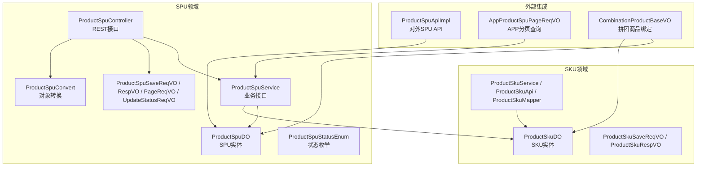
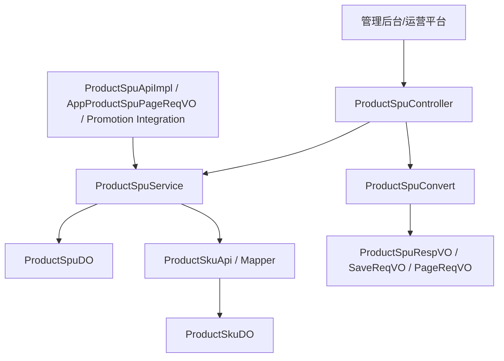
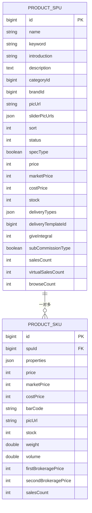
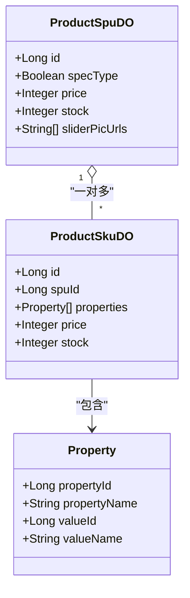
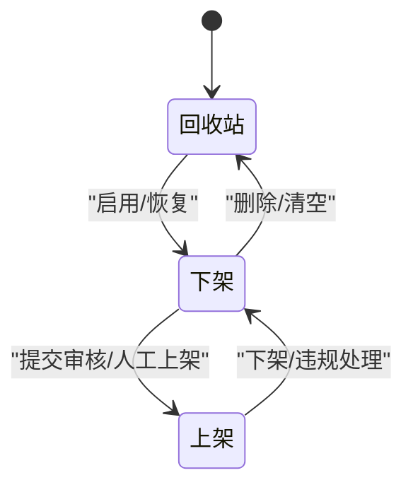
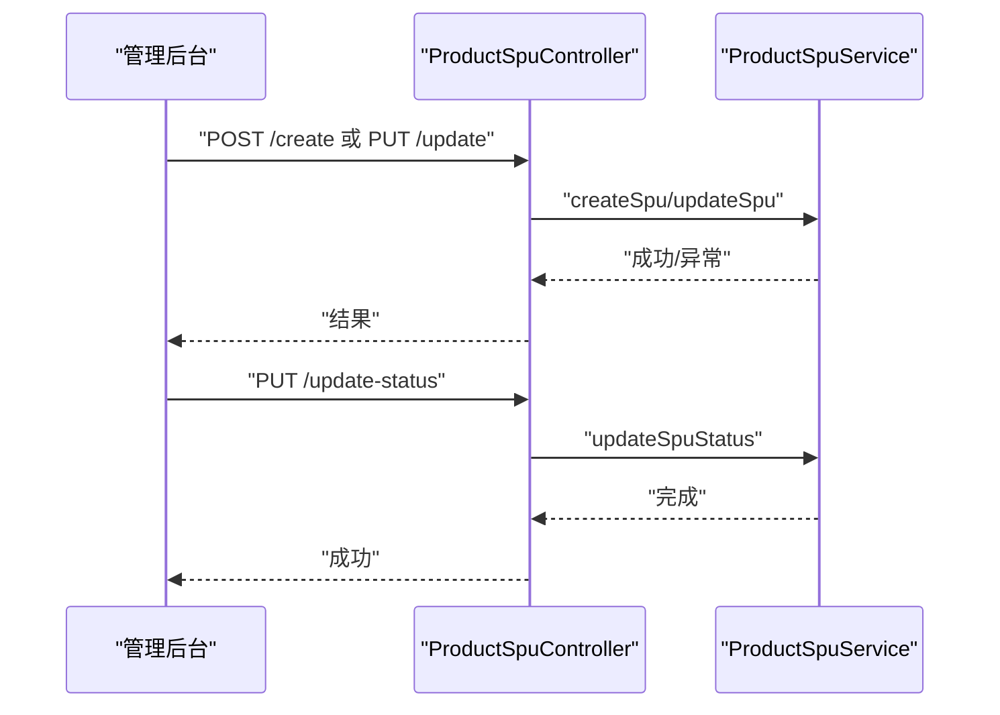
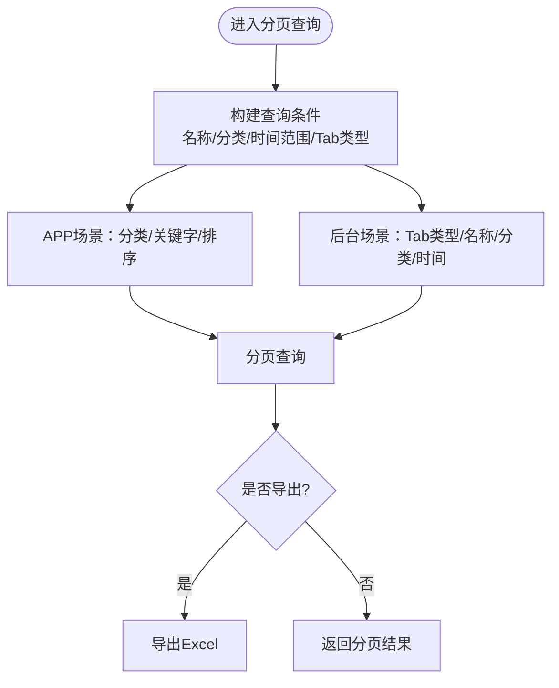
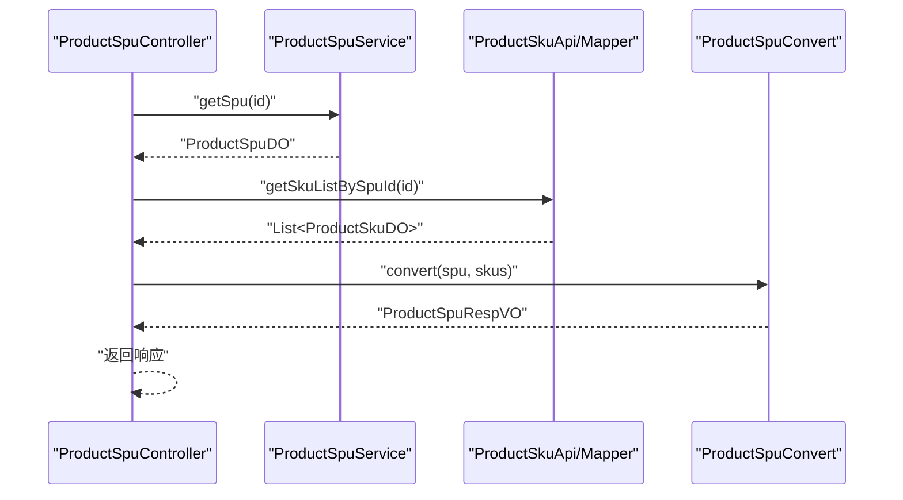
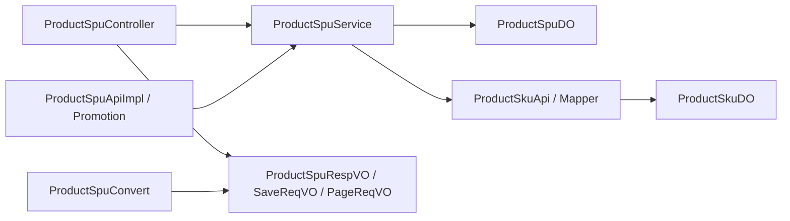

# SPU管理

<cite>
**本文引用的文件**
- [ProductSpuDO.java](file://qiji-module-mall/qiji-module-product/src/main/java/com.qiji.cps/module/product/dal/dataobject/spu/ProductSpuDO.java)
- [ProductSkuDO.java](file://qiji-module-mall/qiji-module-product/src/main/java/com.qiji.cps/module/product/dal/dataobject/sku/ProductSkuDO.java)
- [ProductSpuStatusEnum.java](file://qiji-module-mall/qiji-module-product/src/main/java/com.qiji.cps/module/product/enums/spu/ProductSpuStatusEnum.java)
- [ProductSpuService.java](file://qiji-module-mall/qiji-module-product/src/main/java/com.qiji.cps/module/product/service/spu/ProductSpuService.java)
- [ProductSpuController.java](file://qiji-module-mall/qiji-module-product/src/main/java/com.qiji.cps/module/product/controller/admin/spu/ProductSpuController.java)
- [ProductSpuSaveReqVO.java](file://qiji-module-mall/qiji-module-product/src/main/java/com.qiji.cps/module/product/controller/admin/spu/vo/ProductSpuSaveReqVO.java)
- [ProductSpuRespVO.java](file://qiji-module-mall/qiji-module-product/src/main/java/com.qiji.cps/module/product/controller/admin/spu/vo/ProductSpuRespVO.java)
- [ProductSpuPageReqVO.java](file://qiji-module-mall/qiji-module-product/src/main/java/com.qiji.cps/module/product/controller/admin/spu/vo/ProductSpuPageReqVO.java)
- [ProductSpuUpdateStatusReqVO.java](file://qiji-module-mall/qiji-module-product/src/main/java/com.qiji.cps/module/product/controller/admin/spu/vo/ProductSpuUpdateStatusReqVO.java)
- [ProductSpuSimpleRespVO.java](file://qiji-module-mall/qiji-module-product/src/main/java/com.qiji.cps/module/product/controller/admin/spu/vo/ProductSpuSimpleRespVO.java)
- [ProductSkuSaveReqVO.java](file://qiji-module-mall/qiji-module-product/src/main/java/com.qiji.cps/module/product/controller/admin/spu/vo/ProductSkuSaveReqVO.java)
- [ProductSkuRespVO.java](file://qiji-module-mall/qiji-module-product/src/main/java/com.qiji.cps/module/product/controller/admin/spu/vo/ProductSkuRespVO.java)
- [ProductSpuApiImpl.java](file://qiji-module-mall/qiji-module-product/src/main/java/com.qiji.cps/module/product/api/spu/ProductSpuApiImpl.java)
- [ProductSkuApi.java](file://qiji-module-mall/qiji-module-product/src/main/java/com.qiji.cps/module/product/api/sku/ProductSkuApi.java)
- [ProductSkuMapper.java](file://qiji-module-mall/qiji-module-product/src/main/java/com.qiji.cps/module/product/dal/mysql/sku/ProductSkuMapper.java)
- [ProductSpuConvert.java](file://qiji-module-mall/qiji-module-product/src/main/java/com.qiji.cps/module/product/convert/spu/ProductSpuConvert.java)
- [AppProductSpuPageReqVO.java](file://qiji-module-mall/qiji-module-product/src/main/java/com.qiji.cps/module/product/controller/app/spu/vo/AppProductSpuPageReqVO.java)
- [CombinationProductBaseVO.java](file://qiji-module-mall/qiji-module-promotion/src/main/java/com.qiji.cps/module/promotion/controller/admin/combination/vo/product/CombinationProductBaseVO.java)
- [ruoyi-vue-pro-mall-2025-05-12.sql](file://sql/module/ruoyi-vue-pro-mall-2025-05-12.sql)
</cite>

## 目录
1. [引言](#引言)
2. [项目结构](#项目结构)
3. [核心组件](#核心组件)
4. [架构总览](#架构总览)
5. [详细组件分析](#详细组件分析)
6. [依赖分析](#依赖分析)
7. [性能考虑](#性能考虑)
8. [故障排查指南](#故障排查指南)
9. [结论](#结论)
10. [附录](#附录)

## 引言
本技术文档围绕SPU（标准化产品单元）管理功能展开，系统性阐述SPU与SKU的关系、数据模型设计、业务流程、状态管理、搜索与筛选、批量操作以及最佳实践与性能优化建议。SPU代表抽象的产品维度，SKU代表具体可售卖的规格化商品。两者通过“一对多”关系关联，SPU聚合SKU的价格、库存等汇总信息，并承载主图、轮播图、详情、营销与统计等基础能力。

## 项目结构
SPU相关代码主要位于“商品模块（product）”中，采用“接口-实现-控制器-VO-DO-Mapper-Convert”的分层设计，配合枚举与API适配层，形成清晰的职责边界与扩展点。

图表来源
- [ProductSpuController.java:35-141](file://qiji-module-mall/qiji-module-product/src/main/java/com.qiji.cps/module/product/controller/admin/spu/ProductSpuController.java#L35-L141)
- [ProductSpuService.java:22-156](file://qiji-module-mall/qiji-module-product/src/main/java/com.qiji.cps/module/product/service/spu/ProductSpuService.java#L22-L156)
- [ProductSpuDO.java:31-172](file://qiji-module-mall/qiji-module-product/src/main/java/com.qiji.cps/module/product/dal/dataobject/spu/ProductSpuDO.java#L31-L172)
- [ProductSkuDO.java:21-135](file://qiji-module-mall/qiji-module-product/src/main/java/com.qiji.cps/module/product/dal/dataobject/sku/ProductSkuDO.java#L21-L135)
- [ProductSpuStatusEnum.java:14-49](file://qiji-module-mall/qiji-module-product/src/main/java/com.qiji.cps/module/product/enums/spu/ProductSpuStatusEnum.java#L14-L49)
- [ProductSpuSaveReqVO.java:11-97](file://qiji-module-mall/qiji-module-product/src/main/java/com.qiji.cps/module/product/controller/admin/spu/vo/ProductSpuSaveReqVO.java#L11-L97)
- [ProductSpuRespVO.java:15-127](file://qiji-module-mall/qiji-module-product/src/main/java/com.qiji.cps/module/product/controller/admin/spu/vo/ProductSpuRespVO.java#L15-L127)
- [ProductSpuPageReqVO.java:14-59](file://qiji-module-mall/qiji-module-product/src/main/java/com.qiji.cps/module/product/controller/admin/spu/vo/ProductSpuPageReqVO.java#L14-L59)
- [ProductSpuUpdateStatusReqVO.java:10-23](file://qiji-module-mall/qiji-module-product/src/main/java/com.qiji.cps/module/product/controller/admin/spu/vo/ProductSpuUpdateStatusReqVO.java#L10-L23)
- [ProductSpuConvert.java:19-43](file://qiji-module-mall/qiji-module-product/src/main/java/com.qiji.cps/module/product/convert/spu/ProductSpuConvert.java#L19-L43)
- [ProductSkuApi.java:10-61](file://qiji-module-mall/qiji-module-product/src/main/java/com.qiji.cps/module/product/api/sku/ProductSkuApi.java#L10-L61)
- [ProductSkuMapper.java:14-34](file://qiji-module-mall/qiji-module-product/src/main/java/com.qiji.cps/module/product/dal/mysql/sku/ProductSkuMapper.java#L14-L34)
- [ProductSpuApiImpl.java:14-45](file://qiji-module-mall/qiji-module-product/src/main/java/com.qiji.cps/module/product/api/spu/ProductSpuApiImpl.java#L14-L45)
- [AppProductSpuPageReqVO.java:14-51](file://qiji-module-mall/qiji-module-product/src/main/java/com.qiji.cps/module/product/controller/app/spu/vo/AppProductSpuPageReqVO.java#L14-L51)
- [CombinationProductBaseVO.java:12-27](file://qiji-module-mall/qiji-module-promotion/src/main/java/com.qiji.cps/module/promotion/controller/admin/combination/vo/product/CombinationProductBaseVO.java#L12-L27)

章节来源
- [ProductSpuController.java:35-141](file://qiji-module-mall/qiji-module-product/src/main/java/com.qiji.cps/module/product/controller/admin/spu/ProductSpuController.java#L35-L141)
- [ProductSpuService.java:22-156](file://qiji-module-mall/qiji-module-product/src/main/java/com.qiji.cps/module/product/service/spu/ProductSpuService.java#L22-L156)

## 核心组件
- 控制器层：提供SPU的创建、更新、删除、上下架、详情查询、分页、导出等REST接口。
- 服务层：封装SPU的业务逻辑，包括状态更新、分页查询、库存增量更新、有效性校验、浏览量异步更新等。
- 数据对象层：SPU与SKU的DO定义，包含字段含义、类型与关联关系。
- VO/DTO层：面向控制层与前端的参数与响应对象，以及面向API的DTO。
- 转换层：统一的对象转换，便于DO与VO之间的映射。
- 枚举层：SPU状态枚举，定义上架、下架、回收站等状态。

章节来源
- [ProductSpuController.java:35-141](file://qiji-module-mall/qiji-module-product/src/main/java/com.qiji.cps/module/product/controller/admin/spu/ProductSpuController.java#L35-L141)
- [ProductSpuService.java:22-156](file://qiji-module-mall/qiji-module-product/src/main/java/com.qiji.cps/module/product/service/spu/ProductSpuService.java#L22-L156)
- [ProductSpuDO.java:31-172](file://qiji-module-mall/qiji-module-product/src/main/java/com.qiji.cps/module/product/dal/dataobject/spu/ProductSpuDO.java#L31-L172)
- [ProductSkuDO.java:21-135](file://qiji-module-mall/qiji-module-product/src/main/java/com.qiji.cps/module/product/dal/dataobject/sku/ProductSkuDO.java#L21-L135)
- [ProductSpuStatusEnum.java:14-49](file://qiji-module-mall/qiji-module-product/src/main/java/com.qiji.cps/module/product/enums/spu/ProductSpuStatusEnum.java#L14-L49)

## 架构总览
SPU管理采用典型的分层架构，控制器负责HTTP接入与权限校验，服务层编排业务规则，DAO层负责数据持久化，VO/DTO与Convert承担数据传输与转换职责。SPU与SKU之间通过SPU主键建立一对多关联，SPU聚合SKU的价格、库存等汇总信息。

图表来源
- [ProductSpuController.java:35-141](file://qiji-module-mall/qiji-module-product/src/main/java/com.qiji.cps/module/product/controller/admin/spu/ProductSpuController.java#L35-L141)
- [ProductSpuService.java:22-156](file://qiji-module-mall/qiji-module-product/src/main/java/com.qiji.cps/module/product/service/spu/ProductSpuService.java#L22-L156)
- [ProductSpuConvert.java:19-43](file://qiji-module-mall/qiji-module-product/src/main/java/com.qiji.cps/module/product/convert/spu/ProductSpuConvert.java#L19-L43)
- [ProductSkuApi.java:10-61](file://qiji-module-mall/qiji-module-product/src/main/java/com.qiji.cps/module/product/api/sku/ProductSkuApi.java#L10-L61)
- [ProductSkuMapper.java:14-34](file://qiji-module-mall/qiji-module-product/src/main/java/com.qiji.cps/module/product/dal/mysql/sku/ProductSkuMapper.java#L14-L34)
- [ProductSpuApiImpl.java:14-45](file://qiji-module-mall/qiji-module-product/src/main/java/com.qiji.cps/module/product/api/spu/ProductSpuApiImpl.java#L14-L45)
- [AppProductSpuPageReqVO.java:14-51](file://qiji-module-mall/qiji-module-product/src/main/java/com.qiji.cps/module/product/controller/app/spu/vo/AppProductSpuPageReqVO.java#L14-L51)

## 详细组件分析

### 数据模型设计
- SPU字段概览
  - 基本信息：名称、关键字、简介、详情、分类、品牌、封面图、轮播图、排序、状态
  - SKU相关：规格类型（单规格/多规格）、价格、市场价、成本价、库存
  - 物流相关：配送方式数组、物流模板编号
  - 营销相关：赠送积分、分销类型
  - 统计相关：销量、虚拟销量、浏览量
- SKU字段概览
  - 基本信息：名称、价格、市场价、成本价、条形码、图片、库存、重量、体积
  - 属性组合：以JSON存储的属性数组，包含属性与属性值的冗余字段
  - 分销相关：一级/二级佣金
  - 统计相关：销量

图表来源
- [ProductSpuDO.java:31-172](file://qiji-module-mall/qiji-module-product/src/main/java/com.qiji.cps/module/product/dal/dataobject/spu/ProductSpuDO.java#L31-L172)
- [ProductSkuDO.java:21-135](file://qiji-module-mall/qiji-module-product/src/main/java/com.qiji.cps/module/product/dal/dataobject/sku/ProductSkuDO.java#L21-L135)
- [ruoyi-vue-pro-mall-2025-05-12.sql:275-293](file://sql/module/ruoyi-vue-pro-mall-2025-05-12.sql#L275-L293)

章节来源
- [ProductSpuDO.java:31-172](file://qiji-module-mall/qiji-module-product/src/main/java/com.qiji.cps/module/product/dal/dataobject/spu/ProductSpuDO.java#L31-L172)
- [ProductSkuDO.java:21-135](file://qiji-module-mall/qiji-module-product/src/main/java/com.qiji.cps/module/product/dal/dataobject/sku/ProductSkuDO.java#L21-L135)
- [ruoyi-vue-pro-mall-2025-05-12.sql:275-293](file://sql/module/ruoyi-vue-pro-mall-2025-05-12.sql#L275-L293)

### SPU与SKU的关联与规格组合
- 关联关系：SPU与SKU通过SPU主键建立一对多关联；SPU聚合SKU的最低价格、库存等汇总信息。
- 规格组合：SKU的属性数组以JSON形式存储，包含属性与属性值的冗余字段，便于展示与检索。
- 规格类型：SPU的规格类型决定SKU生成策略；多规格时需提供SKU明细，单规格时SPU自身即代表唯一SKU。

图表来源
- [ProductSpuDO.java:31-172](file://qiji-module-mall/qiji-module-product/src/main/java/com.qiji.cps/module/product/dal/dataobject/spu/ProductSpuDO.java#L31-L172)
- [ProductSkuDO.java:21-135](file://qiji-module-mall/qiji-module-product/src/main/java/com.qiji.cps/module/product/dal/dataobject/sku/ProductSkuDO.java#L21-L135)

章节来源
- [ProductSpuDO.java:31-172](file://qiji-module-mall/qiji-module-product/src/main/java/com.qiji.cps/module/product/dal/dataobject/spu/ProductSpuDO.java#L31-L172)
- [ProductSkuDO.java:21-135](file://qiji-module-mall/qiji-module-product/src/main/java/com.qiji.cps/module/product/dal/dataobject/sku/ProductSkuDO.java#L21-L135)

### SPU状态管理机制
- 状态枚举：回收站、下架、上架三种状态，支持判断是否处于上架状态。
- 上下架流程：通过更新SPU状态实现，控制器接收状态更新请求并调用服务层执行。

图表来源
- [ProductSpuStatusEnum.java:14-49](file://qiji-module-mall/qiji-module-product/src/main/java/com.qiji.cps/module/product/enums/spu/ProductSpuStatusEnum.java#L14-L49)
- [ProductSpuUpdateStatusReqVO.java:10-23](file://qiji-module-mall/qiji-module-product/src/main/java/com.qiji.cps/module/product/controller/admin/spu/vo/ProductSpuUpdateStatusReqVO.java#L10-L23)

章节来源
- [ProductSpuStatusEnum.java:14-49](file://qiji-module-mall/qiji-module-product/src/main/java/com.qiji.cps/module/product/enums/spu/ProductSpuStatusEnum.java#L14-L49)
- [ProductSpuController.java:61-67](file://qiji-module-mall/qiji-module-product/src/main/java/com.qiji.cps/module/product/controller/admin/spu/ProductSpuController.java#L61-L67)

### SPU业务流程（创建/编辑/删除/上下架/审核）
- 创建：控制器接收新增请求，服务层创建SPU并生成SKU（若为多规格），返回SPU编号。
- 编辑：控制器接收更新请求，服务层更新SPU基本信息与SKU明细。
- 删除：控制器接收删除请求，服务层执行删除（软删/物理删视策略而定）。
- 上下架：控制器接收状态更新请求，服务层更新SPU状态。
- 审核：可通过状态流转实现“待审核/已审核”，结合权限与工作流扩展。

图表来源
- [ProductSpuController.java:46-76](file://qiji-module-mall/qiji-module-product/src/main/java/com.qiji.cps/module/product/controller/admin/spu/ProductSpuController.java#L46-L76)
- [ProductSpuService.java:24-44](file://qiji-module-mall/qiji-module-product/src/main/java/com.qiji.cps/module/product/service/spu/ProductSpuService.java#L24-L44)
- [ProductSpuUpdateStatusReqVO.java:10-23](file://qiji-module-mall/qiji-module-product/src/main/java/com.qiji.cps/module/product/controller/admin/spu/vo/ProductSpuUpdateStatusReqVO.java#L10-L23)

章节来源
- [ProductSpuController.java:46-76](file://qiji-module-mall/qiji-module-product/src/main/java/com.qiji.cps/module/product/controller/admin/spu/ProductSpuController.java#L46-L76)
- [ProductSpuService.java:24-44](file://qiji-module-mall/qiji-module-product/src/main/java/com.qiji.cps/module/product/service/spu/ProductSpuService.java#L24-L44)

### SPU搜索与筛选
- 后台分页：支持按名称、分类、创建时间范围、Tab类型（出售中/仓库中/售罄/警戒库存/回收站）筛选。
- APP分页：支持按分类、关键字、排序字段（价格/销量/时间）筛选与排序。
- 导出：支持导出当前分页结果为Excel。

图表来源
- [ProductSpuPageReqVO.java:14-59](file://qiji-module-mall/qiji-module-product/src/main/java/com.qiji.cps/module/product/controller/admin/spu/vo/ProductSpuPageReqVO.java#L14-L59)
- [AppProductSpuPageReqVO.java:14-51](file://qiji-module-mall/qiji-module-product/src/main/java/com.qiji.cps/module/product/controller/app/spu/vo/AppProductSpuPageReqVO.java#L14-L51)
- [ProductSpuController.java:112-138](file://qiji-module-mall/qiji-module-product/src/main/java/com.qiji.cps/module/product/controller/admin/spu/ProductSpuController.java#L112-L138)

章节来源
- [ProductSpuPageReqVO.java:14-59](file://qiji-module-mall/qiji-module-product/src/main/java/com.qiji.cps/module/product/controller/admin/spu/vo/ProductSpuPageReqVO.java#L14-L59)
- [AppProductSpuPageReqVO.java:14-51](file://qiji-module-mall/qiji-module-product/src/main/java/com.qiji.cps/module/product/controller/app/spu/vo/AppProductSpuPageReqVO.java#L14-L51)
- [ProductSpuController.java:112-138](file://qiji-module-mall/qiji-module-product/src/main/java/com.qiji.cps/module/product/controller/admin/spu/ProductSpuController.java#L112-L138)

### SPU批量操作
- 批量上下架：通过状态更新接口对多个SPU批量执行状态变更。
- 批量导出：分页查询时设置无分页大小限制，一次性导出全部符合条件的SPU。
- 批量复制：可在服务层扩展批量复制逻辑（基于现有创建流程），注意SKU组合与属性一致性校验。

章节来源
- [ProductSpuController.java:127-138](file://qiji-module-mall/qiji-module-product/src/main/java/com.qiji.cps/module/product/controller/admin/spu/ProductSpuController.java#L127-L138)
- [ProductSpuUpdateStatusReqVO.java:10-23](file://qiji-module-mall/qiji-module-product/src/main/java/com.qiji.cps/module/product/controller/admin/spu/vo/ProductSpuUpdateStatusReqVO.java#L10-L23)

### SPU与SKU的交互与转换
- 控制器在获取SPU详情时，同时查询对应SKU列表，并通过Convert将DO转为VO。
- API层提供SPU与SKU的对外查询能力，便于促销、订单等模块集成。

图表来源
- [ProductSpuController.java:78-91](file://qiji-module-mall/qiji-module-product/src/main/java/com.qiji.cps/module/product/controller/admin/spu/ProductSpuController.java#L78-L91)
- [ProductSpuConvert.java:29-40](file://qiji-module-mall/qiji-module-product/src/main/java/com.qiji.cps/module/product/convert/spu/ProductSpuConvert.java#L29-L40)
- [ProductSkuMapper.java:27-33](file://qiji-module-mall/qiji-module-product/src/main/java/com.qiji.cps/module/product/dal/mysql/sku/ProductSkuMapper.java#L27-L33)

章节来源
- [ProductSpuController.java:78-91](file://qiji-module-mall/qiji-module-product/src/main/java/com.qiji.cps/module/product/controller/admin/spu/ProductSpuController.java#L78-L91)
- [ProductSpuConvert.java:29-40](file://qiji-module-mall/qiji-module-product/src/main/java/com.qiji.cps/module/product/convert/spu/ProductSpuConvert.java#L29-L40)
- [ProductSkuMapper.java:27-33](file://qiji-module-mall/qiji-module-product/src/main/java/com.qiji.cps/module/product/dal/mysql/sku/ProductSkuMapper.java#L27-L33)

### 与其他模块的集成
- 促销模块：拼团活动绑定SPU与SKU，确保活动价格与库存联动。
- 对外API：SPU对外API实现提供批量查询与校验能力，供其他模块复用。

章节来源
- [CombinationProductBaseVO.java:12-27](file://qiji-module-mall/qiji-module-promotion/src/main/java/com.qiji.cps/module/promotion/controller/admin/combination/vo/product/CombinationProductBaseVO.java#L12-L27)
- [ProductSpuApiImpl.java:14-45](file://qiji-module-mall/qiji-module-product/src/main/java/com.qiji.cps/module/product/api/spu/ProductSpuApiImpl.java#L14-L45)

## 依赖分析
- 控制器依赖服务层接口，服务层依赖DO与API/Mapper，控制器与服务层通过VO/DTO解耦。
- SPU与SKU通过Mapper查询与聚合，Convert承担DO到VO的映射。
- 外部模块通过API接口访问SPU与SKU，降低耦合度。

图表来源
- [ProductSpuController.java:35-141](file://qiji-module-mall/qiji-module-product/src/main/java/com.qiji.cps/module/product/controller/admin/spu/ProductSpuController.java#L35-L141)
- [ProductSpuService.java:22-156](file://qiji-module-mall/qiji-module-product/src/main/java/com.qiji.cps/module/product/service/spu/ProductSpuService.java#L22-L156)
- [ProductSpuConvert.java:19-43](file://qiji-module-mall/qiji-module-product/src/main/java/com.qiji.cps/module/product/convert/spu/ProductSpuConvert.java#L19-L43)
- [ProductSkuApi.java:10-61](file://qiji-module-mall/qiji-module-product/src/main/java/com.qiji.cps/module/product/api/sku/ProductSkuApi.java#L10-L61)
- [ProductSkuMapper.java:14-34](file://qiji-module-mall/qiji-module-product/src/main/java/com.qiji.cps/module/product/dal/mysql/sku/ProductSkuMapper.java#L14-L34)
- [ProductSpuApiImpl.java:14-45](file://qiji-module-mall/qiji-module-product/src/main/java/com.qiji.cps/module/product/api/spu/ProductSpuApiImpl.java#L14-L45)

章节来源
- [ProductSpuController.java:35-141](file://qiji-module-mall/qiji-module-product/src/main/java/com.qiji.cps/module/product/controller/admin/spu/ProductSpuController.java#L35-L141)
- [ProductSpuService.java:22-156](file://qiji-module-mall/qiji-module-product/src/main/java/com.qiji.cps/module/product/service/spu/ProductSpuService.java#L22-L156)

## 性能考虑
- 分页与导出
  - 后台导出时将分页大小设为不限制，建议在大数据量场景下增加分批导出或异步任务。
  - APP分页支持排序字段校验，避免无效排序导致的性能问题。
- 查询优化
  - SKU查询按SPU ID过滤，建议在SPU_ID与SKU属性组合上建立索引。
  - SPU分页查询建议对分类、状态、创建时间建立复合索引。
- 聚合计算
  - SPU价格、库存等汇总字段来源于SKU，建议在SKU变更时异步或批量刷新，避免强一致带来的写放大。
- 缓存策略
  - 对热点SPU详情与SKU列表可引入缓存，注意缓存失效与一致性。
- 异步更新
  - 浏览量更新使用异步方法，降低写路径延迟。

章节来源
- [ProductSpuController.java:127-138](file://qiji-module-mall/qiji-module-product/src/main/java/com.qiji.cps/module/product/controller/admin/spu/ProductSpuController.java#L127-L138)
- [ProductSpuService.java:147-153](file://qiji-module-mall/qiji-module-product/src/main/java/com.qiji.cps/module/product/service/spu/ProductSpuService.java#L147-L153)

## 故障排查指南
- 常见问题
  - SPU状态更新失败：检查状态枚举取值与请求体是否匹配。
  - SKU缺失或为空：确认SPU规格类型与SKU保存请求是否一致。
  - 导出数据为空：检查分页参数与筛选条件，确保无分页大小限制。
- 排查步骤
  - 核对控制器入参与服务层调用链路。
  - 检查Mapper SQL与DO字段映射，关注JSON字段的序列化/反序列化。
  - 关注Convert映射是否遗漏字段或类型不匹配。
- 日志与监控
  - 使用接口日志记录请求与响应，定位异常请求。
  - 对高频接口增加埋点与告警，监控耗时与错误率。

章节来源
- [ProductSpuUpdateStatusReqVO.java:10-23](file://qiji-module-mall/qiji-module-product/src/main/java/com.qiji.cps/module/product/controller/admin/spu/vo/ProductSpuUpdateStatusReqVO.java#L10-L23)
- [ProductSpuController.java:127-138](file://qiji-module-mall/qiji-module-product/src/main/java/com.qiji.cps/module/product/controller/admin/spu/ProductSpuController.java#L127-L138)
- [ProductSpuConvert.java:29-40](file://qiji-module-mall/qiji-module-product/src/main/java/com.qiji.cps/module/product/convert/spu/ProductSpuConvert.java#L29-L40)

## 结论
SPU管理在本项目中实现了清晰的分层设计与完善的领域建模，通过SPU与SKU的协同，支撑了多规格商品的统一管理与灵活售卖。结合状态管理、搜索筛选、批量操作与对外API，能够满足后台运营与前台展示的多样化需求。建议在高并发与大数据场景下进一步完善索引、缓存与异步化策略，持续提升系统性能与稳定性。

## 附录
- 最佳实践
  - 规格组合校验：在保存SKU前进行属性组合合法性校验，避免重复与冲突。
  - 数据一致性：SKU变更后及时刷新SPU汇总字段，必要时采用事务或消息队列保证最终一致。
  - 权限控制：所有SPU相关接口均需鉴权与授权，防止越权操作。
  - 审计日志：对关键操作（创建/更新/上下架/删除）记录操作日志，便于追溯。
- 性能优化建议
  - 索引优化：针对SPU与SKU的常用查询字段建立合适索引。
  - 分页优化：APP分页严格校验排序字段，避免全表扫描。
  - 缓存策略：对热点数据引入缓存，注意失效与一致性。
  - 异步化：对非关键路径（如浏览量）采用异步更新。