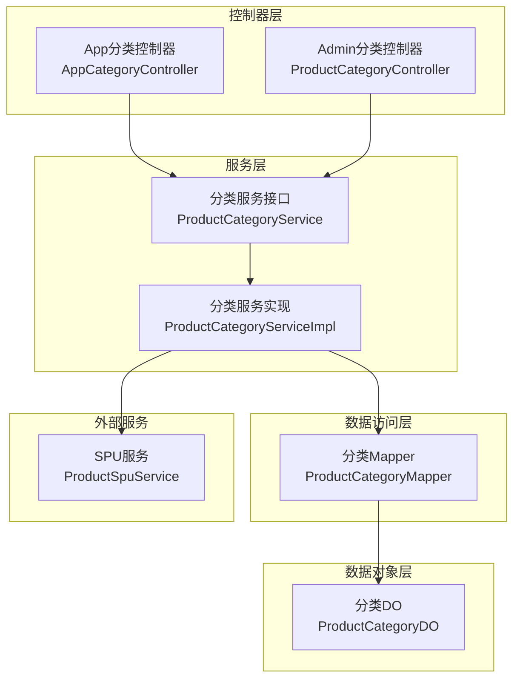
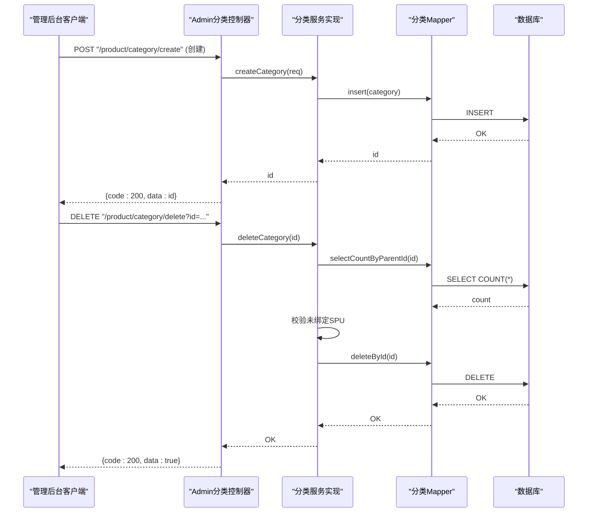
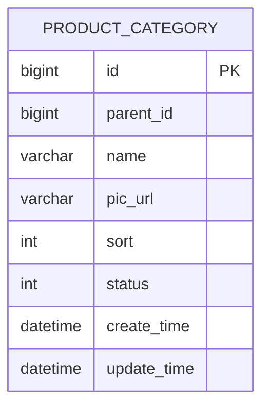
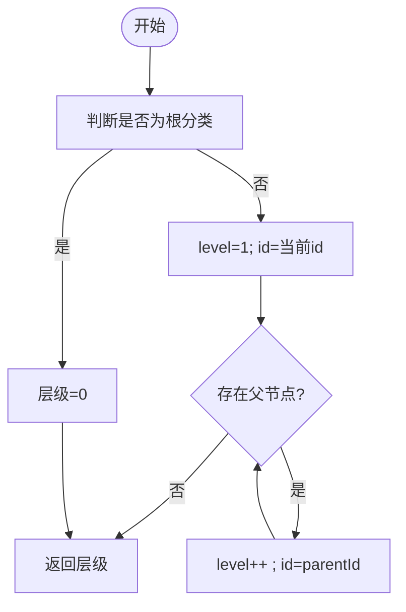
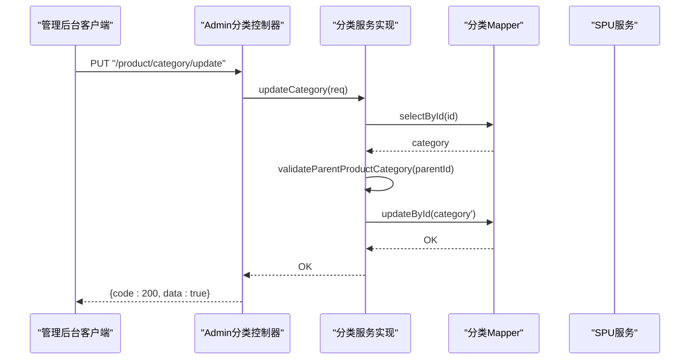
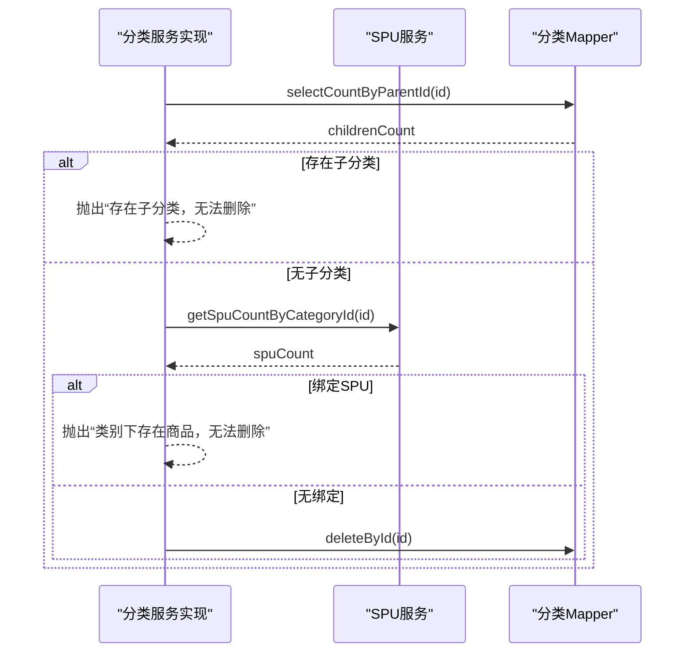
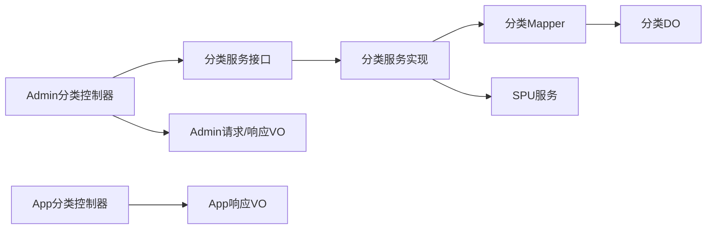

# 分类管理

<cite>
**本文引用的文件**
- [ProductCategoryDO.java](file://qiji-module-mall/qiji-module-product/src/main/java/com.qiji.cps/module/product/dal/dataobject/category/ProductCategoryDO.java)
- [ProductCategoryMapper.java](file://qiji-module-mall/qiji-module-product/src/main/java/com.qiji.cps/module/product/dal/mysql/category/ProductCategoryMapper.java)
- [ProductCategoryService.java](file://qiji-module-mall/qiji-module-product/src/main/java/com.qiji.cps/module/product/service/category/ProductCategoryService.java)
- [ProductCategoryServiceImpl.java](file://qiji-module-mall/qiji-module-product/src/main/java/com.qiji.cps/module/product/service/category/ProductCategoryServiceImpl.java)
- [ProductCategoryController.java](file://qiji-module-mall/qiji-module-product/src/main/java/com.qiji.cps/module/product/controller/admin/category/ProductCategoryController.java)
- [ProductCategorySaveReqVO.java](file://qiji-module-mall/qiji-module-product/src/main/java/com.qiji.cps/module/product/controller/admin/category/vo/ProductCategorySaveReqVO.java)
- [ProductCategoryListReqVO.java](file://qiji-module-mall/qiji-module-product/src/main/java/com.qiji.cps/module/product/controller/admin/category/vo/ProductCategoryListReqVO.java)
- [ProductCategoryRespVO.java](file://qiji-module-mall/qiji-module-product/src/main/java/com.qiji.cps/module/product/controller/admin/category/vo/ProductCategoryRespVO.java)
- [AppCategoryRespVO.java](file://qiji-module-mall/qiji-module-product/src/main/java/com.qiji.cps/module/product/controller/app/category/vo/AppCategoryRespVO.java)
- [AppCategoryController.java](file://qiji-module-mall/qiji-module-product/src/main/java/com.qiji.cps/module/product/controller/app/category/AppCategoryController.java)
- [ErrorCodeConstants.java](file://qiji-module-mall/qiji-module-product/src/main/java/com.qiji.cps/module/product/enums/ErrorCodeConstants.java)
- [ProductSpuService.java](file://qiji-module-mall/qiji-module-product/src/main/java/com.qiji.cps/module/product/service/spu/ProductSpuService.java)
- [QijiCacheAutoConfiguration.java](file://qiji-framework/qiji-spring-boot-starter-redis/src/main/java/com.qiji.cps/framework/redis/config/QijiCacheAutoConfiguration.java)
- [TimeoutRedisCacheManager.java](file://qiji-framework/qiji-spring-boot-starter-redis/src/main/java/com.qiji.cps/framework/redis/core/TimeoutRedisCacheManager.java)
</cite>

## 目录
1. [简介](#简介)
2. [项目结构](#项目结构)
3. [核心组件](#核心组件)
4. [架构总览](#架构总览)
5. [详细组件分析](#详细组件分析)
6. [依赖分析](#依赖分析)
7. [性能考虑](#性能考虑)
8. [故障排查指南](#故障排查指南)
9. [结论](#结论)
10. [附录](#附录)

## 简介
本技术文档围绕“商品分类管理”功能展开，系统性阐述分类体系的设计原理、业务价值与实现细节。内容覆盖数据模型、树形结构与父子关系管理、增删改查与批量操作、权限与可见性控制、与商品的关联关系、搜索与筛选、缓存与性能优化，以及最佳实践与设计建议。目标是帮助开发者与产品人员快速理解并高效维护分类能力。

## 项目结构
商品分类模块位于“qiji-module-mall/qiji-module-product”子模块中，采用典型的分层架构：
- 控制器层：Admin 端与 App 端分别提供分类的增删改查接口
- 服务层：封装分类业务逻辑，含校验、层级计算、可用性校验等
- 数据访问层：MyBatis Mapper 提供基础 CRUD 与条件查询
- 数据对象层：ProductCategoryDO 映射数据库表结构
- VO/DTO 层：Admin 与 App 的请求/响应参数与返回对象

图表来源
- [ProductCategoryController.java:24-76](file://qiji-module-mall/qiji-module-product/src/main/java/com.qiji.cps/module/product/controller/admin/category/ProductCategoryController.java#L24-L76)
- [AppCategoryController.java:26-58](file://qiji-module-mall/qiji-module-product/src/main/java/com.qiji.cps/module/product/controller/app/category/AppCategoryController.java#L26-L58)
- [ProductCategoryService.java:11-97](file://qiji-module-mall/qiji-module-product/src/main/java/com.qiji.cps/module/product/service/category/ProductCategoryService.java#L11-L97)
- [ProductCategoryServiceImpl.java:27-185](file://qiji-module-mall/qiji-module-product/src/main/java/com.qiji.cps/module/product/service/category/ProductCategoryServiceImpl.java#L27-L185)
- [ProductCategoryMapper.java:12-44](file://qiji-module-mall/qiji-module-product/src/main/java/com.qiji.cps/module/product/dal/mysql/category/ProductCategoryMapper.java#L12-L44)
- [ProductCategoryDO.java:10-65](file://qiji-module-mall/qiji-module-product/src/main/java/com.qiji.cps/module/product/dal/dataobject/category/ProductCategoryDO.java#L10-L65)
- [ProductSpuService.java:17-156](file://qiji-module-mall/qiji-module-product/src/main/java/com.qiji.cps/module/product/service/spu/ProductSpuService.java#L17-L156)

章节来源
- [ProductCategoryController.java:24-76](file://qiji-module-mall/qiji-module-product/src/main/java/com.qiji.cps/module/product/controller/admin/category/ProductCategoryController.java#L24-L76)
- [AppCategoryController.java:26-58](file://qiji-module-mall/qiji-module-product/src/main/java/com.qiji.cps/module/product/controller/app/category/AppCategoryController.java#L26-L58)
- [ProductCategoryService.java:11-97](file://qiji-module-mall/qiji-module-product/src/main/java/com.qiji.cps/module/product/service/category/ProductCategoryService.java#L11-L97)
- [ProductCategoryServiceImpl.java:27-185](file://qiji-module-mall/qiji-module-product/src/main/java/com.qiji.cps/module/product/service/category/ProductCategoryServiceImpl.java#L27-L185)
- [ProductCategoryMapper.java:12-44](file://qiji-module-mall/qiji-module-product/src/main/java/com.qiji.cps/module/product/dal/mysql/category/ProductCategoryMapper.java#L12-L44)
- [ProductCategoryDO.java:10-65](file://qiji-module-mall/qiji-module-product/src/main/java/com.qiji.cps/module/product/dal/dataobject/category/ProductCategoryDO.java#L10-L65)
- [ProductSpuService.java:17-156](file://qiji-module-mall/qiji-module-product/src/main/java/com.qiji.cps/module/product/service/spu/ProductSpuService.java#L17-L156)

## 核心组件
- 数据模型 ProductCategoryDO：定义分类的主键、父分类、名称、移动端图标、排序、状态等字段，并约定根分类标识与层级上限常量。
- Mapper ProductCategoryMapper：提供按名称、父分类、状态、父分类集合等条件的查询，以及统计子分类数量、按状态查询等方法。
- Service ProductCategoryService/Impl：实现分类的创建、更新、删除、查询、层级计算、可用性校验、批量校验等；在删除前校验无子分类且未绑定商品。
- Admin 控制器 ProductCategoryController：提供创建、更新、删除、单条查询、列表查询等接口，并集成权限注解。
- App 控制器 AppCategoryController：提供前端 App 的分类列表查询，仅返回启用状态并按排序字段升序。
- VO/DTO：Admin 与 App 的请求/响应对象，Admin 包含排序、状态、描述等字段，App 仅包含必要字段。
- 错误码 ErrorCodeConstants：集中定义分类相关错误码，如父分类不存在、父分类非一级、存在子分类、禁用状态不可用、绑定商品不可删除等。
- 与商品关联：通过 ProductSpuService 的分类维度统计与校验，确保分类层级与有效性约束。

章节来源
- [ProductCategoryDO.java:10-65](file://qiji-module-mall/qiji-module-product/src/main/java/com.qiji.cps/module/product/dal/dataobject/category/ProductCategoryDO.java#L10-L65)
- [ProductCategoryMapper.java:12-44](file://qiji-module-mall/qiji-module-product/src/main/java/com.qiji.cps/module/product/dal/mysql/category/ProductCategoryMapper.java#L12-L44)
- [ProductCategoryService.java:11-97](file://qiji-module-mall/qiji-module-product/src/main/java/com.qiji.cps/module/product/service/category/ProductCategoryService.java#L11-L97)
- [ProductCategoryServiceImpl.java:27-185](file://qiji-module-mall/qiji-module-product/src/main/java/com.qiji.cps/module/product/service/category/ProductCategoryServiceImpl.java#L27-L185)
- [ProductCategoryController.java:24-76](file://qiji-module-mall/qiji-module-product/src/main/java/com.qiji.cps/module/product/controller/admin/category/ProductCategoryController.java#L24-L76)
- [AppCategoryController.java:26-58](file://qiji-module-mall/qiji-module-product/src/main/java/com.qiji.cps/module/product/controller/app/category/AppCategoryController.java#L26-L58)
- [ProductCategorySaveReqVO.java:8-38](file://qiji-module-mall/qiji-module-product/src/main/java/com.qiji.cps/module/product/controller/admin/category/vo/ProductCategorySaveReqVO.java#L8-L38)
- [ProductCategoryListReqVO.java:8-25](file://qiji-module-mall/qiji-module-product/src/main/java/com.qiji.cps/module/product/controller/admin/category/vo/ProductCategoryListReqVO.java#L8-L25)
- [ProductCategoryRespVO.java:8-36](file://qiji-module-mall/qiji-module-product/src/main/java/com.qiji.cps/module/product/controller/admin/category/vo/ProductCategoryRespVO.java#L8-L36)
- [AppCategoryRespVO.java:10-28](file://qiji-module-mall/qiji-module-product/src/main/java/com.qiji.cps/module/product/controller/app/category/vo/AppCategoryRespVO.java#L10-L28)
- [ErrorCodeConstants.java:12-19](file://qiji-module-mall/qiji-module-product/src/main/java/com.qiji.cps/module/product/enums/ErrorCodeConstants.java#L12-L19)
- [ProductSpuService.java:127-134](file://qiji-module-mall/qiji-module-product/src/main/java/com.qiji.cps/module/product/service/spu/ProductSpuService.java#L127-L134)

## 架构总览
分类管理遵循“控制器-服务-数据访问-数据对象”的分层设计，Admin 与 App 分别暴露不同接口集，服务层负责业务规则与数据一致性校验，数据访问层提供灵活的查询能力。

图表来源
- [ProductCategoryController.java:33-55](file://qiji-module-mall/qiji-module-product/src/main/java/com.qiji.cps/module/product/controller/admin/category/ProductCategoryController.java#L33-L55)
- [ProductCategoryServiceImpl.java:42-81](file://qiji-module-mall/qiji-module-product/src/main/java/com.qiji.cps/module/product/service/category/ProductCategoryServiceImpl.java#L42-L81)
- [ProductCategoryMapper.java:29-31](file://qiji-module-mall/qiji-module-product/src/main/java/com.qiji.cps/module/product/dal/mysql/category/ProductCategoryMapper.java#L29-L31)

## 详细组件分析

### 数据模型与字段定义
- 主键 id：分类唯一标识
- 父分类 parentId：根分类以特定常量标识，用于构建树形结构
- 名称 name：分类名称
- 图标 picUrl：移动端展示用图片地址
- 排序 sort：同级内排序字段
- 状态 status：启用/禁用，配合通用状态枚举
- 创建时间与更新时间：继承基类

图表来源
- [ProductCategoryDO.java:15-65](file://qiji-module-mall/qiji-module-product/src/main/java/com.qiji.cps/module/product/dal/dataobject/category/ProductCategoryDO.java#L15-L65)

章节来源
- [ProductCategoryDO.java:10-65](file://qiji-module-mall/qiji-module-product/src/main/java/com.qiji.cps/module/product/dal/dataobject/category/ProductCategoryDO.java#L10-L65)

### 树形结构与父子关系管理
- 根分类标识：通过常量表示根节点
- 层级上限：定义分类层级上限常量，用于业务校验
- 父子关系：父分类必须为一级分类，防止跨级或非法嵌套
- 层级计算：从任意节点向上遍历父节点，累计层级，避免脏数据导致死循环

图表来源
- [ProductCategoryServiceImpl.java:148-167](file://qiji-module-mall/qiji-module-product/src/main/java/com.qiji.cps/module/product/service/category/ProductCategoryServiceImpl.java#L148-L167)
- [ProductCategoryDO.java:25-32](file://qiji-module-mall/qiji-module-product/src/main/java/com.qiji.cps/module/product/dal/dataobject/category/ProductCategoryDO.java#L25-L32)

章节来源
- [ProductCategoryServiceImpl.java:83-97](file://qiji-module-mall/qiji-module-product/src/main/java/com.qiji.cps/module/product/service/category/ProductCategoryServiceImpl.java#L83-L97)
- [ProductCategoryServiceImpl.java:148-167](file://qiji-module-mall/qiji-module-product/src/main/java/com.qiji.cps/module/product/service/category/ProductCategoryServiceImpl.java#L148-L167)
- [ProductCategoryDO.java:25-32](file://qiji-module-mall/qiji-module-product/src/main/java/com.qiji.cps/module/product/dal/dataobject/category/ProductCategoryDO.java#L25-L32)

### 增删改查与权限控制
- 创建：校验父分类存在且为一级；插入后返回主键
- 更新：校验分类存在与父分类合法；执行更新
- 删除：校验无子分类、未绑定商品；执行删除
- 查询：支持按名称、父分类、状态、父分类集合等条件查询；Admin 列表按排序字段升序
- 权限：Admin 接口均标注权限注解，要求相应权限才可调用

图表来源
- [ProductCategoryController.java:40-46](file://qiji-module-mall/qiji-module-product/src/main/java/com.qiji.cps/module/product/controller/admin/category/ProductCategoryController.java#L40-L46)
- [ProductCategoryServiceImpl.java:54-64](file://qiji-module-mall/qiji-module-product/src/main/java/com.qiji.cps/module/product/service/category/ProductCategoryServiceImpl.java#L54-L64)
- [ProductCategoryServiceImpl.java:83-97](file://qiji-module-mall/qiji-module-product/src/main/java/com.qiji.cps/module/product/service/category/ProductCategoryServiceImpl.java#L83-L97)

章节来源
- [ProductCategoryController.java:33-73](file://qiji-module-mall/qiji-module-product/src/main/java/com.qiji.cps/module/product/controller/admin/category/ProductCategoryController.java#L33-L73)
- [ProductCategoryServiceImpl.java:42-81](file://qiji-module-mall/qiji-module-product/src/main/java/com.qiji.cps/module/product/service/category/ProductCategoryServiceImpl.java#L42-L81)
- [ProductCategoryServiceImpl.java:83-97](file://qiji-module-mall/qiji-module-product/src/main/java/com.qiji.cps/module/product/service/category/ProductCategoryServiceImpl.java#L83-L97)

### 与商品的关联关系
- 删除保护：删除分类前检查是否存在子分类与绑定的 SPU，避免破坏数据完整性
- 统计查询：提供按分类统计 SPU 数量的能力，便于前端展示与运营分析
- 有效性校验：在保存/更新 SPU 时，对分类层级进行校验，确保使用第二级及以下分类

图表来源
- [ProductCategoryServiceImpl.java:66-81](file://qiji-module-mall/qiji-module-product/src/main/java/com.qiji.cps/module/product/service/category/ProductCategoryServiceImpl.java#L66-L81)
- [ProductSpuService.java:127-134](file://qiji-module-mall/qiji-module-product/src/main/java/com.qiji.cps/module/product/service/spu/ProductSpuService.java#L127-L134)
- [ProductCategoryMapper.java:29-31](file://qiji-module-mall/qiji-module-product/src/main/java/com.qiji.cps/module/product/dal/mysql/category/ProductCategoryMapper.java#L29-L31)

章节来源
- [ProductCategoryServiceImpl.java:66-81](file://qiji-module-mall/qiji-module-product/src/main/java/com.qiji.cps/module/product/service/category/ProductCategoryServiceImpl.java#L66-L81)
- [ProductSpuService.java:127-134](file://qiji-module-mall/qiji-module-product/src/main/java/com.qiji.cps/module/product/service/spu/ProductSpuService.java#L127-L134)

### 搜索与筛选
- Admin 端支持按名称、状态、父分类、父分类集合等条件查询
- App 端仅返回启用状态的分类，并按排序字段升序排列
- 列表排序：Admin 端在服务层对结果按 sort 升序排序后再返回

章节来源
- [ProductCategoryListReqVO.java:8-25](file://qiji-module-mall/qiji-module-product/src/main/java/com.qiji.cps/module/product/controller/admin/category/vo/ProductCategoryListReqVO.java#L8-L25)
- [ProductCategoryMapper.java:20-27](file://qiji-module-mall/qiji-module-product/src/main/java/com.qiji.cps/module/product/dal/mysql/category/ProductCategoryMapper.java#L20-L27)
- [ProductCategoryController.java:66-73](file://qiji-module-mall/qiji-module-product/src/main/java/com.qiji.cps/module/product/controller/admin/category/ProductCategoryController.java#L66-L73)
- [AppCategoryController.java:35-55](file://qiji-module-mall/qiji-module-product/src/main/java/com.qiji.cps/module/product/controller/app/category/AppCategoryController.java#L35-L55)

### 权限控制与可见性
- Admin 接口均带有权限注解，需具备相应权限方可访问
- App 端接口开放访问，但返回结果仅包含启用状态的分类
- 分类状态与可见性：通过状态字段控制启用/禁用；禁用分类在业务校验中不可使用

章节来源
- [ProductCategoryController.java:33-73](file://qiji-module-mall/qiji-module-product/src/main/java/com.qiji.cps/module/product/controller/admin/category/ProductCategoryController.java#L33-L73)
- [AppCategoryController.java:35-55](file://qiji-module-mall/qiji-module-product/src/main/java/com.qiji.cps/module/product/controller/app/category/AppCategoryController.java#L35-L55)
- [ProductCategoryServiceImpl.java:137-146](file://qiji-module-mall/qiji-module-product/src/main/java/com.qiji.cps/module/product/service/category/ProductCategoryServiceImpl.java#L137-L146)

### 批量操作
- 批量查询：App 端支持按编号集合批量查询启用分类
- 批量校验：服务层提供批量校验接口，统一校验存在性、启用状态与层级要求
- 批量删除：当前实现未提供批量删除接口，删除操作以单条为主

章节来源
- [AppCategoryController.java:44-55](file://qiji-module-mall/qiji-module-product/src/main/java/com.qiji.cps/module/product/controller/app/category/AppCategoryController.java#L44-L55)
- [ProductCategoryService.java:78-94](file://qiji-module-mall/qiji-module-product/src/main/java/com.qiji.cps/module/product/service/category/ProductCategoryService.java#L78-L94)
- [ProductCategoryServiceImpl.java:106-130](file://qiji-module-mall/qiji-module-product/src/main/java/com.qiji.cps/module/product/service/category/ProductCategoryServiceImpl.java#L106-L130)

### 缓存策略与性能优化
- 缓存配置：提供基于 Redis 的缓存自动配置，支持自定义过期时间的缓存管理器
- 缓存命名：通过“cacheName#ttl”格式支持动态过期时间
- 性能建议：分类列表查询可结合缓存，针对高频读场景设置合理 TTL；删除/更新后及时失效相关缓存键

章节来源
- [QijiCacheAutoConfiguration.java:29-55](file://qiji-framework/qiji-spring-boot-starter-redis/src/main/java/com.qiji.cps/framework/redis/config/QijiCacheAutoConfiguration.java#L29-L55)
- [TimeoutRedisCacheManager.java:13-65](file://qiji-framework/qiji-spring-boot-starter-redis/src/main/java/com.qiji.cps/framework/redis/core/TimeoutRedisCacheManager.java#L13-L65)

## 依赖分析
- 控制器依赖服务接口，服务实现依赖 Mapper 与外部 SPU 服务
- Mapper 依赖 MyBatis 基础能力，提供条件查询与聚合查询
- 错误码集中定义，便于统一处理与国际化扩展

图表来源
- [ProductCategoryController.java:24-76](file://qiji-module-mall/qiji-module-product/src/main/java/com.qiji.cps/module/product/controller/admin/category/ProductCategoryController.java#L24-L76)
- [AppCategoryController.java:26-58](file://qiji-module-mall/qiji-module-product/src/main/java/com.qiji.cps/module/product/controller/app/category/AppCategoryController.java#L26-L58)
- [ProductCategoryService.java:11-97](file://qiji-module-mall/qiji-module-product/src/main/java/com.qiji.cps/module/product/service/category/ProductCategoryService.java#L11-L97)
- [ProductCategoryServiceImpl.java:27-185](file://qiji-module-mall/qiji-module-product/src/main/java/com.qiji.cps/module/product/service/category/ProductCategoryServiceImpl.java#L27-L185)
- [ProductCategoryMapper.java:12-44](file://qiji-module-mall/qiji-module-product/src/main/java/com.qiji.cps/module/product/dal/mysql/category/ProductCategoryMapper.java#L12-L44)
- [ProductCategoryDO.java:10-65](file://qiji-module-mall/qiji-module-product/src/main/java/com.qiji.cps/module/product/dal/dataobject/category/ProductCategoryDO.java#L10-L65)
- [ProductSpuService.java:17-156](file://qiji-module-mall/qiji-module-product/src/main/java/com.qiji.cps/module/product/service/spu/ProductSpuService.java#L17-L156)

## 性能考虑
- 查询优化：列表查询使用条件构造器，支持多条件组合；建议在父分类、状态、名称等常用过滤字段建立索引
- 排序优化：服务层对结果进行排序，建议在 sort 字段建立索引以提升排序效率
- 缓存策略：针对分类列表与分类详情设置合理的缓存策略，减少数据库压力
- 删除保护：在删除前进行子分类与绑定商品的检查，避免后续复杂回滚成本

## 故障排查指南
- 分类不存在：检查 ID 是否正确，确认数据是否被删除
- 父分类不存在：确认父分类 ID 是否为一级分类，避免跨级或非法父节点
- 存在子分类：先删除子分类或调整子分类父节点后再尝试删除
- 已禁用分类：启用分类后再进行业务操作
- 绑定商品不可删除：先迁移或删除相关商品再尝试删除

章节来源
- [ErrorCodeConstants.java:12-19](file://qiji-module-mall/qiji-module-product/src/main/java/com.qiji.cps/module/product/enums/ErrorCodeConstants.java#L12-L19)
- [ProductCategoryServiceImpl.java:66-81](file://qiji-module-mall/qiji-module-product/src/main/java/com.qiji.cps/module/product/service/category/ProductCategoryServiceImpl.java#L66-L81)
- [ProductCategoryServiceImpl.java:137-146](file://qiji-module-mall/qiji-module-product/src/main/java/com.qiji.cps/module/product/service/category/ProductCategoryServiceImpl.java#L137-L146)

## 结论
商品分类管理功能以清晰的分层架构实现，具备完善的父子关系约束、层级校验与删除保护机制。Admin 与 App 端接口职责明确，配合缓存与索引策略可满足高并发下的查询需求。建议在生产环境中结合缓存与索引进一步优化性能，并持续完善批量操作与更细粒度的权限控制。

## 附录
- 最佳实践
  - 严格遵守一级父分类约束，避免跨级嵌套
  - 删除分类前先迁移子分类与商品，确保业务连续性
  - 列表查询结合缓存与索引，提升用户体验
  - 对外暴露的 App 接口仅返回启用状态数据，保证前端展示一致性
- 设计建议
  - 可考虑增加分类移动（变更父节点）接口，并在服务层进行循环依赖校验
  - 扩展批量操作能力，如批量启用/禁用、批量设置属性等
  - 引入审计日志，记录分类的关键变更，便于追溯