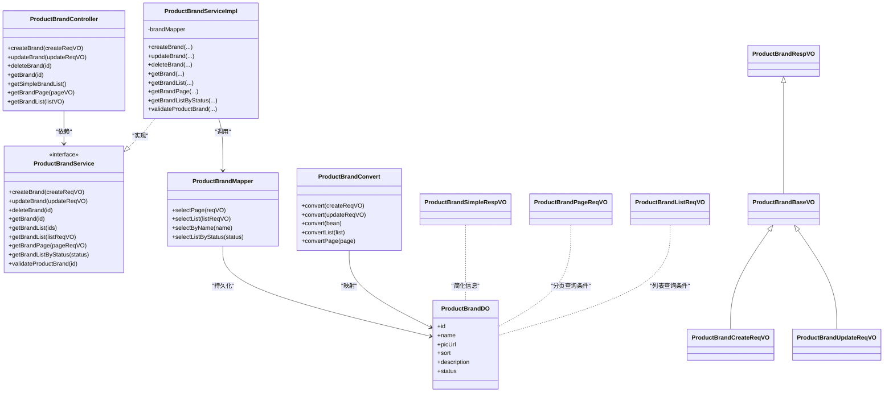
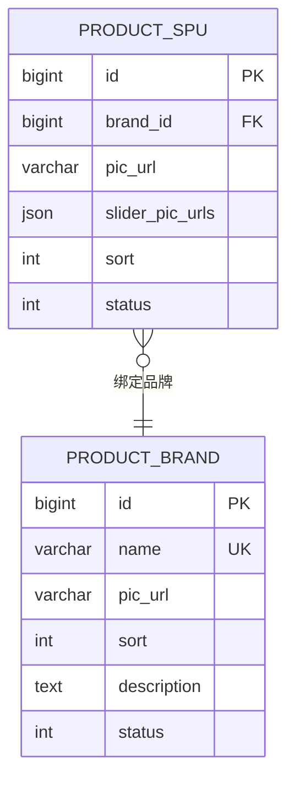
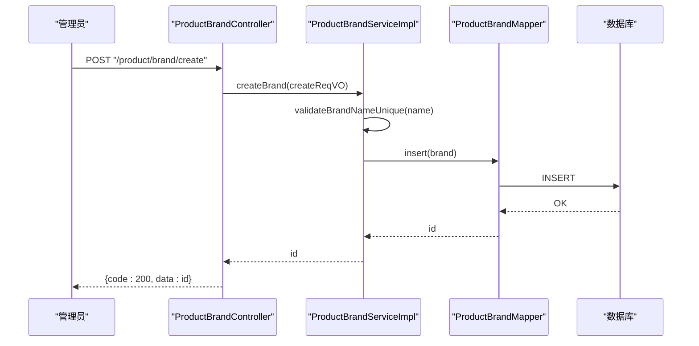
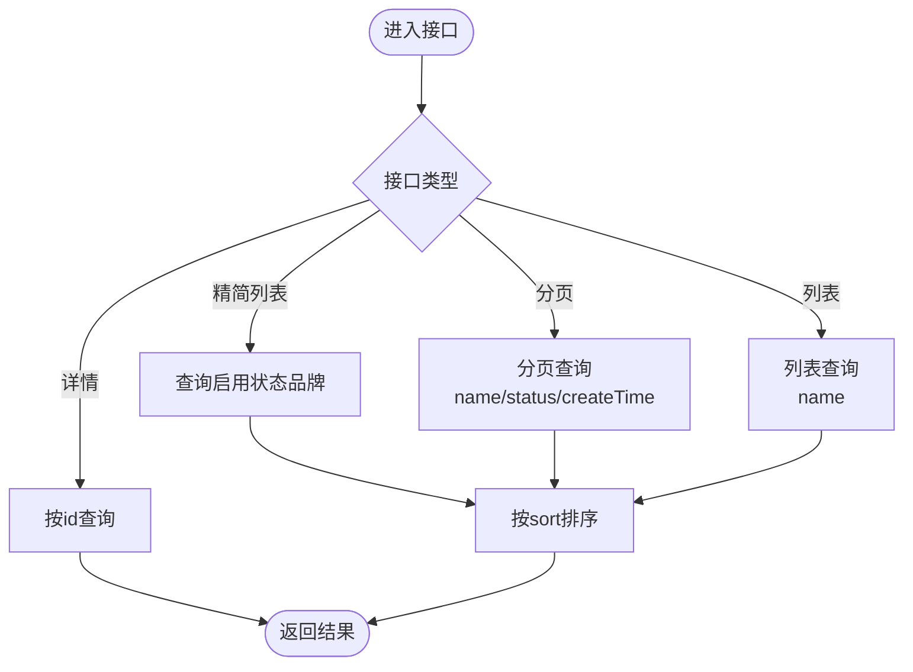
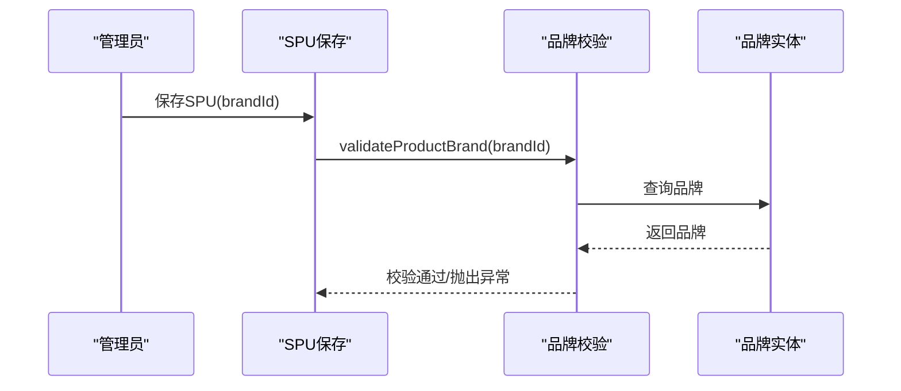
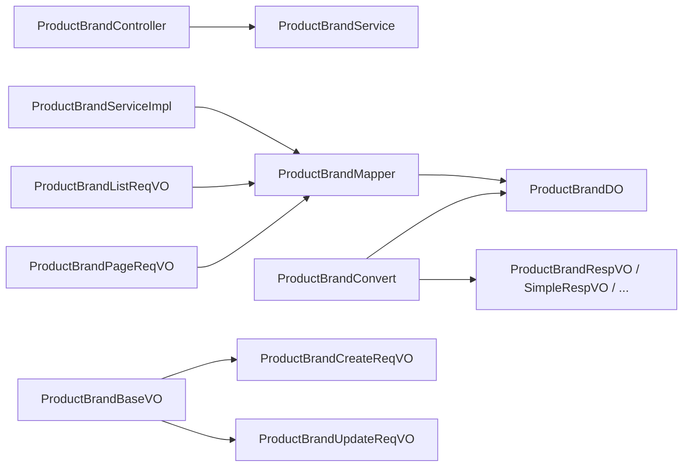

# 品牌管理

<cite>
**本文引用的文件**
- [ProductBrandController.java](file://qiji-module-mall/qiji-module-product/src/main/java/com.qiji.cps/module/product/controller/admin/brand/ProductBrandController.java)
- [ProductBrandService.java](file://qiji-module-mall/qiji-module-product/src/main/java/com.qiji.cps/module/product/service/brand/ProductBrandService.java)
- [ProductBrandServiceImpl.java](file://qiji-module-mall/qiji-module-product/src/main/java/com.qiji.cps/module/product/service/brand/ProductBrandServiceImpl.java)
- [ProductBrandMapper.java](file://qiji-module-mall/qiji-module-product/src/main/java/com.qiji.cps/module/product/dal/mysql/brand/ProductBrandMapper.java)
- [ProductBrandDO.java](file://qiji-module-mall/qiji-module-product/src/main/java/com.qiji.cps/module/product/dal/dataobject/brand/ProductBrandDO.java)
- [ProductBrandBaseVO.java](file://qiji-module-mall/qiji-module-product/src/main/java/com.qiji.cps/module/product/controller/admin/brand/vo/ProductBrandBaseVO.java)
- [ProductBrandCreateReqVO.java](file://qiji-module-mall/qiji-module-product/src/main/java/com.qiji.cps/module/product/controller/admin/brand/vo/ProductBrandCreateReqVO.java)
- [ProductBrandUpdateReqVO.java](file://qiji-module-mall/qiji-module-product/src/main/java/com.qiji.cps/module/product/controller/admin/brand/vo/ProductBrandUpdateReqVO.java)
- [ProductBrandRespVO.java](file://qiji-module-mall/qiji-module-product/src/main/java/com.qiji.cps/module/product/controller/admin/brand/vo/ProductBrandRespVO.java)
- [ProductBrandSimpleRespVO.java](file://qiji-module-mall/qiji-module-product/src/main/java/com.qiji.cps/module/product/controller/admin/brand/vo/ProductBrandSimpleRespVO.java)
- [ProductBrandPageReqVO.java](file://qiji-module-mall/qiji-module-product/src/main/java/com.qiji.cps/module/product/controller/admin/brand/vo/ProductBrandPageReqVO.java)
- [ProductBrandListReqVO.java](file://qiji-module-mall/qiji-module-product/src/main/java/com.qiji.cps/module/product/controller/admin/brand/vo/ProductBrandListReqVO.java)
- [ProductBrandConvert.java](file://qiji-module-mall/qiji-module-product/src/main/java/com.qiji.cps/module/product/convert/brand/ProductBrandConvert.java)
- [ErrorCodeConstants.java](file://qiji-module-mall/qiji-module-product/src/main/java/com.qiji.cps/module/product/enums/ErrorCodeConstants.java)
- [ProductSpuDO.java](file://qiji-module-mall/qiji-module-product/src/main/java/com.qiji.cps/module/product/dal/dataobject/spu/ProductSpuDO.java)
</cite>

## 目录
1. [引言](#引言)
2. [项目结构](#项目结构)
3. [核心组件](#核心组件)
4. [架构总览](#架构总览)
5. [详细组件分析](#详细组件分析)
6. [依赖分析](#依赖分析)
7. [性能考虑](#性能考虑)
8. [故障排查指南](#故障排查指南)
9. [结论](#结论)
10. [附录](#附录)

## 引言
品牌管理是商品体系中的关键基础能力，直接影响商品检索、筛选、推荐与营销效果。本技术文档围绕品牌管理在商品体系中的定位与价值，系统梳理品牌的数据模型、创建与维护流程、展示规则、与商品的关联关系、权限控制、批量操作以及最佳实践与运营建议，帮助开发者与运营人员高效构建与维护品牌体系。

## 项目结构
品牌管理模块位于“商品模块”之下，采用典型的分层架构：
- 控制器层：对外暴露REST接口，负责鉴权与参数封装
- 服务层：业务逻辑编排，包含校验、状态判断与领域服务交互
- 数据访问层：基于MyBatis-Plus的Mapper，提供分页、列表、唯一性校验等查询能力
- 数据对象层：品牌实体与SPU实体，体现品牌与商品的关联关系
- VO/DTO层：请求与响应参数封装，便于前后端契约清晰

```mermaid
graph TB
subgraph "控制器层"
C1["ProductBrandController<br/>REST接口"]
end
subgraph "服务层"
S1["ProductBrandService<br/>接口"]
S2["ProductBrandServiceImpl<br/>实现"]
end
subgraph "数据访问层"
M1["ProductBrandMapper<br/>MyBatis-Plus"]
end
subgraph "数据对象层"
D1["ProductBrandDO<br/>品牌实体"]
D2["ProductSpuDO<br/>SPU实体"]
end
subgraph "转换与VO"
V1["ProductBrandConvert<br/>映射"]
V2["ProductBrandBaseVO/Req/Resp/Simple/Page/List<br/>参数与响应"]
end
C1 --> S1
S1 < --> S2
S2 --> M1
M1 --> D1
D2 --> D1
C1 --> V1
V1 --> D1
V2 --> D1
```

图表来源
- [ProductBrandController.java:24-92](file://qiji-module-mall/qiji-module-product/src/main/java/com.qiji.cps/module/product/controller/admin/brand/ProductBrandController.java#L24-L92)
- [ProductBrandServiceImpl.java:30-122](file://qiji-module-mall/qiji-module-product/src/main/java/com.qiji.cps/module/product/service/brand/ProductBrandServiceImpl.java#L30-L122)
- [ProductBrandMapper.java:14-36](file://qiji-module-mall/qiji-module-product/src/main/java/com.qiji.cps/module/product/dal/mysql/brand/ProductBrandMapper.java#L14-L36)
- [ProductBrandDO.java:23-51](file://qiji-module-mall/qiji-module-product/src/main/java/com.qiji.cps/module/product/dal/dataobject/brand/ProductBrandDO.java#L23-L51)
- [ProductSpuDO.java:63-69](file://qiji-module-mall/qiji-module-product/src/main/java/com.qiji.cps/module/product/dal/dataobject/spu/ProductSpuDO.java#L63-L69)
- [ProductBrandConvert.java:19-35](file://qiji-module-mall/qiji-module-product/src/main/java/com.qiji.cps/module/product/convert/brand/ProductBrandConvert.java#L19-L35)
- [ProductBrandBaseVO.java:12-34](file://qiji-module-mall/qiji-module-product/src/main/java/com.qiji.cps/module/product/controller/admin/brand/vo/ProductBrandBaseVO.java#L12-L34)

章节来源
- [ProductBrandController.java:24-92](file://qiji-module-mall/qiji-module-product/src/main/java/com.qiji.cps/module/product/controller/admin/brand/ProductBrandController.java#L24-L92)
- [ProductBrandServiceImpl.java:30-122](file://qiji-module-mall/qiji-module-product/src/main/java/com.qiji.cps/module/product/service/brand/ProductBrandServiceImpl.java#L30-L122)
- [ProductBrandMapper.java:14-36](file://qiji-module-mall/qiji-module-product/src/main/java/com.qiji.cps/module/product/dal/mysql/brand/ProductBrandMapper.java#L14-L36)
- [ProductBrandDO.java:23-51](file://qiji-module-mall/qiji-module-product/src/main/java/com.qiji.cps/module/product/dal/dataobject/brand/ProductBrandDO.java#L23-L51)
- [ProductBrandConvert.java:19-35](file://qiji-module-mall/qiji-module-product/src/main/java/com.qiji.cps/module/product/convert/brand/ProductBrandConvert.java#L19-L35)
- [ProductBrandBaseVO.java:12-34](file://qiji-module-mall/qiji-module-product/src/main/java/com.qiji.cps/module/product/controller/admin/brand/vo/ProductBrandBaseVO.java#L12-L34)

## 核心组件
- 控制器：提供品牌创建、更新、删除、查询、分页、列表、简单列表等接口，并通过注解进行权限控制
- 服务：实现品牌生命周期管理、唯一性校验、状态校验、分页与列表查询
- Mapper：提供分页、列表、按名称查询、按状态查询等常用查询
- 数据对象：品牌实体与SPU实体，体现品牌与商品的外键关联
- VO/DTO：封装请求与响应参数，保证前后端契约清晰
- 转换器：统一进行DO与VO之间的映射

章节来源
- [ProductBrandController.java:33-90](file://qiji-module-mall/qiji-module-product/src/main/java/com.qiji.cps/module/product/controller/admin/brand/ProductBrandController.java#L33-L90)
- [ProductBrandService.java:16-61](file://qiji-module-mall/qiji-module-product/src/main/java/com.qiji.cps/module/product/service/brand/ProductBrandService.java#L16-L61)
- [ProductBrandServiceImpl.java:35-120](file://qiji-module-mall/qiji-module-product/src/main/java/com.qiji.cps/module/product/service/brand/ProductBrandServiceImpl.java#L35-L120)
- [ProductBrandMapper.java:16-36](file://qiji-module-mall/qiji-module-product/src/main/java/com.qiji.cps/module/product/dal/mysql/brand/ProductBrandMapper.java#L16-L36)
- [ProductBrandDO.java:23-51](file://qiji-module-mall/qiji-module-product/src/main/java/com.qiji.cps/module/product/dal/dataobject/brand/ProductBrandDO.java#L23-L51)
- [ProductBrandBaseVO.java:12-34](file://qiji-module-mall/qiji-module-product/src/main/java/com.qiji.cps/module/product/controller/admin/brand/vo/ProductBrandBaseVO.java#L12-L34)
- [ProductBrandConvert.java:24-35](file://qiji-module-mall/qiji-module-product/src/main/java/com.qiji.cps/module/product/convert/brand/ProductBrandConvert.java#L24-L35)

## 架构总览
品牌管理遵循“控制器-服务-数据访问-数据对象”的分层架构，配合VO/DTO与转换器，形成清晰的职责边界与扩展点。



图表来源
- [ProductBrandController.java:24-92](file://qiji-module-mall/qiji-module-product/src/main/java/com.qiji.cps/module/product/controller/admin/brand/ProductBrandController.java#L24-L92)
- [ProductBrandService.java:16-61](file://qiji-module-mall/qiji-module-product/src/main/java/com.qiji.cps/module/product/service/brand/ProductBrandService.java#L16-L61)
- [ProductBrandServiceImpl.java:30-122](file://qiji-module-mall/qiji-module-product/src/main/java/com.qiji.cps/module/product/service/brand/ProductBrandServiceImpl.java#L30-L122)
- [ProductBrandMapper.java:14-36](file://qiji-module-mall/qiji-module-product/src/main/java/com.qiji.cps/module/product/dal/mysql/brand/ProductBrandMapper.java#L14-L36)
- [ProductBrandDO.java:23-51](file://qiji-module-mall/qiji-module-product/src/main/java/com.qiji.cps/module/product/dal/dataobject/brand/ProductBrandDO.java#L23-L51)
- [ProductBrandConvert.java:19-35](file://qiji-module-mall/qiji-module-product/src/main/java/com.qiji.cps/module/product/convert/brand/ProductBrandConvert.java#L19-L35)
- [ProductBrandBaseVO.java:12-34](file://qiji-module-mall/qiji-module-product/src/main/java/com.qiji.cps/module/product/controller/admin/brand/vo/ProductBrandBaseVO.java#L12-L34)
- [ProductBrandCreateReqVO.java:12-14](file://qiji-module-mall/qiji-module-product/src/main/java/com.qiji.cps/module/product/controller/admin/brand/vo/ProductBrandCreateReqVO.java#L12-L14)
- [ProductBrandUpdateReqVO.java:14-20](file://qiji-module-mall/qiji-module-product/src/main/java/com.qiji.cps/module/product/controller/admin/brand/vo/ProductBrandUpdateReqVO.java#L14-L20)
- [ProductBrandRespVO.java:14-22](file://qiji-module-mall/qiji-module-product/src/main/java/com.qiji.cps/module/product/controller/admin/brand/vo/ProductBrandRespVO.java#L14-L22)
- [ProductBrandSimpleRespVO.java:12-20](file://qiji-module-mall/qiji-module-product/src/main/java/com.qiji.cps/module/product/controller/admin/brand/vo/ProductBrandSimpleRespVO.java#L12-L20)
- [ProductBrandPageReqVO.java:18-30](file://qiji-module-mall/qiji-module-product/src/main/java/com.qiji.cps/module/product/controller/admin/brand/vo/ProductBrandPageReqVO.java#L18-L30)
- [ProductBrandListReqVO.java:8-13](file://qiji-module-mall/qiji-module-product/src/main/java/com.qiji.cps/module/product/controller/admin/brand/vo/ProductBrandListReqVO.java#L8-L13)

## 详细组件分析

### 数据模型设计
- 品牌实体字段
  - 编号：主键
  - 名称：必填，唯一性约束
  - 图片：品牌图片URL
  - 排序：整型，用于前端展示顺序
  - 描述：品牌简介
  - 状态：启用/禁用，配合权限与可见性控制
- 品牌与商品的关联
  - SPU实体中包含brandId字段，建立与品牌实体的外键关联，实现商品对品牌的绑定



图表来源
- [ProductBrandDO.java:23-51](file://qiji-module-mall/qiji-module-product/src/main/java/com.qiji.cps/module/product/dal/dataobject/brand/ProductBrandDO.java#L23-L51)
- [ProductSpuDO.java:63-69](file://qiji-module-mall/qiji-module-product/src/main/java/com.qiji.cps/module/product/dal/dataobject/spu/ProductSpuDO.java#L63-L69)

章节来源
- [ProductBrandDO.java:23-51](file://qiji-module-mall/qiji-module-product/src/main/java/com.qiji.cps/module/product/dal/dataobject/brand/ProductBrandDO.java#L23-L51)
- [ProductSpuDO.java:63-69](file://qiji-module-mall/qiji-module-product/src/main/java/com.qiji.cps/module/product/dal/dataobject/spu/ProductSpuDO.java#L63-L69)

### 创建与维护流程
- 创建品牌
  - 控制器接收请求体，校验参数
  - 服务层进行唯一性校验（名称唯一）
  - 写入数据库并返回编号
- 更新品牌
  - 校验品牌存在性与名称唯一性
  - 执行更新
- 删除品牌
  - 校验品牌存在性
  - 执行删除
- 状态校验
  - 提供validateProductBrand方法，当品牌不存在或被禁用时抛出相应异常



图表来源
- [ProductBrandController.java:33-38](file://qiji-module-mall/qiji-module-product/src/main/java/com.qiji.cps/module/product/controller/admin/brand/ProductBrandController.java#L33-L38)
- [ProductBrandServiceImpl.java:35-45](file://qiji-module-mall/qiji-module-product/src/main/java/com.qiji.cps/module/product/service/brand/ProductBrandServiceImpl.java#L35-L45)
- [ProductBrandMapper.java:14-14](file://qiji-module-mall/qiji-module-product/src/main/java/com.qiji.cps/module/product/dal/mysql/brand/ProductBrandMapper.java#L14-L14)

章节来源
- [ProductBrandController.java:33-55](file://qiji-module-mall/qiji-module-product/src/main/java/com.qiji.cps/module/product/controller/admin/brand/ProductBrandController.java#L33-L55)
- [ProductBrandServiceImpl.java:35-84](file://qiji-module-mall/qiji-module-product/src/main/java/com.qiji.cps/module/product/service/brand/ProductBrandServiceImpl.java#L35-L84)
- [ProductBrandMapper.java:14-36](file://qiji-module-mall/qiji-module-product/src/main/java/com.qiji.cps/module/product/dal/mysql/brand/ProductBrandMapper.java#L14-L36)

### 展示规则
- 精简列表：仅返回启用状态的品牌，用于前端下拉选择
- 分页列表：支持按名称、状态、创建时间区间分页查询
- 普通列表：支持按名称过滤，并按排序字段升序排列
- 详情：按编号查询品牌详情



图表来源
- [ProductBrandController.java:66-90](file://qiji-module-mall/qiji-module-product/src/main/java/com.qiji.cps/module/product/controller/admin/brand/ProductBrandController.java#L66-L90)
- [ProductBrandMapper.java:16-28](file://qiji-module-mall/qiji-module-product/src/main/java/com.qiji.cps/module/product/dal/mysql/brand/ProductBrandMapper.java#L16-L28)

章节来源
- [ProductBrandController.java:66-90](file://qiji-module-mall/qiji-module-product/src/main/java/com.qiji.cps/module/product/controller/admin/brand/ProductBrandController.java#L66-L90)
- [ProductBrandPageReqVO.java:18-30](file://qiji-module-mall/qiji-module-product/src/main/java/com.qiji.cps/module/product/controller/admin/brand/vo/ProductBrandPageReqVO.java#L18-L30)
- [ProductBrandListReqVO.java:8-13](file://qiji-module-mall/qiji-module-product/src/main/java/com.qiji.cps/module/product/controller/admin/brand/vo/ProductBrandListReqVO.java#L8-L13)
- [ProductBrandMapper.java:16-28](file://qiji-module-mall/qiji-module-product/src/main/java/com.qiji.cps/module/product/dal/mysql/brand/ProductBrandMapper.java#L16-L28)

### 品牌与商品的关联关系
- SPU实体中包含brandId字段，作为品牌与商品的关联纽带
- 商品在创建/编辑时需绑定品牌；若品牌被禁用，将触发状态校验异常



图表来源
- [ProductBrandServiceImpl.java:102-110](file://qiji-module-mall/qiji-module-product/src/main/java/com.qiji.cps/module/product/service/brand/ProductBrandServiceImpl.java#L102-L110)
- [ProductSpuDO.java:63-69](file://qiji-module-mall/qiji-module-product/src/main/java/com.qiji.cps/module/product/dal/dataobject/spu/ProductSpuDO.java#L63-L69)

章节来源
- [ProductBrandServiceImpl.java:102-110](file://qiji-module-mall/qiji-module-product/src/main/java/com.qiji.cps/module/product/service/brand/ProductBrandServiceImpl.java#L102-L110)
- [ProductSpuDO.java:63-69](file://qiji-module-mall/qiji-module-product/src/main/java/com.qiji.cps/module/product/dal/dataobject/spu/ProductSpuDO.java#L63-L69)

### 权限控制与可见性
- 接口权限：通过注解控制，如创建、更新、删除、查询均需要对应权限
- 可见性：精简列表仅返回启用状态的品牌，确保前端只展示可用品牌
- 状态限制：当品牌被禁用时，相关校验会阻止商品绑定或展示

章节来源
- [ProductBrandController.java:33-90](file://qiji-module-mall/qiji-module-product/src/main/java/com.qiji.cps/module/product/controller/admin/brand/ProductBrandController.java#L33-L90)
- [ProductBrandServiceImpl.java:102-110](file://qiji-module-mall/qiji-module-product/src/main/java/com.qiji.cps/module/product/service/brand/ProductBrandServiceImpl.java#L102-L110)

### SEO优化与营销内容
- 品牌页面：可结合品牌详情与SPU聚合信息构建品牌专题页
- 品牌故事：可在品牌描述字段中沉淀品牌背景、理念等营销内容
- 搜索与筛选：通过品牌名称与状态参与搜索与筛选，提升曝光与转化

章节来源
- [ProductBrandDO.java:23-51](file://qiji-module-mall/qiji-module-product/src/main/java/com.qiji.cps/module/product/dal/dataobject/brand/ProductBrandDO.java#L23-L51)
- [ProductBrandController.java:75-90](file://qiji-module-mall/qiji-module-product/src/main/java/com.qiji.cps/module/product/controller/admin/brand/ProductBrandController.java#L75-L90)

### 批量操作
- 当前接口未提供批量导入/批量设置属性的直接API
- 建议通过定时任务或后台批处理任务对接Excel导入，或在业务侧提供批量更新接口（例如按状态批量启用/禁用）

章节来源
- [ProductBrandController.java:33-90](file://qiji-module-mall/qiji-module-product/src/main/java/com.qiji.cps/module/product/controller/admin/brand/ProductBrandController.java#L33-L90)

## 依赖分析
- 控制器依赖服务接口
- 服务实现依赖Mapper
- Mapper依赖DO
- 转换器依赖DO与VO
- VO之间存在继承/复用关系，避免重复定义



图表来源
- [ProductBrandController.java:24-92](file://qiji-module-mall/qiji-module-product/src/main/java/com.qiji.cps/module/product/controller/admin/brand/ProductBrandController.java#L24-L92)
- [ProductBrandServiceImpl.java:30-122](file://qiji-module-mall/qiji-module-product/src/main/java/com.qiji.cps/module/product/service/brand/ProductBrandServiceImpl.java#L30-L122)
- [ProductBrandMapper.java:14-36](file://qiji-module-mall/qiji-module-product/src/main/java/com.qiji.cps/module/product/dal/mysql/brand/ProductBrandMapper.java#L14-L36)
- [ProductBrandConvert.java:19-35](file://qiji-module-mall/qiji-module-product/src/main/java/com.qiji.cps/module/product/convert/brand/ProductBrandConvert.java#L19-L35)
- [ProductBrandBaseVO.java:12-34](file://qiji-module-mall/qiji-module-product/src/main/java/com.qiji.cps/module/product/controller/admin/brand/vo/ProductBrandBaseVO.java#L12-L34)
- [ProductBrandCreateReqVO.java:12-14](file://qiji-module-mall/qiji-module-product/src/main/java/com.qiji.cps/module/product/controller/admin/brand/vo/ProductBrandCreateReqVO.java#L12-L14)
- [ProductBrandUpdateReqVO.java:14-20](file://qiji-module-mall/qiji-module-product/src/main/java/com.qiji.cps/module/product/controller/admin/brand/vo/ProductBrandUpdateReqVO.java#L14-L20)
- [ProductBrandRespVO.java:14-22](file://qiji-module-mall/qiji-module-product/src/main/java/com.qiji.cps/module/product/controller/admin/brand/vo/ProductBrandRespVO.java#L14-L22)
- [ProductBrandSimpleRespVO.java:12-20](file://qiji-module-mall/qiji-module-product/src/main/java/com.qiji.cps/module/product/controller/admin/brand/vo/ProductBrandSimpleRespVO.java#L12-L20)
- [ProductBrandListReqVO.java:8-13](file://qiji-module-mall/qiji-module-product/src/main/java/com.qiji.cps/module/product/controller/admin/brand/vo/ProductBrandListReqVO.java#L8-L13)
- [ProductBrandPageReqVO.java:18-30](file://qiji-module-mall/qiji-module-product/src/main/java/com.qiji.cps/module/product/controller/admin/brand/vo/ProductBrandPageReqVO.java#L18-L30)

## 性能考虑
- 查询优化
  - 分页查询默认按ID倒序，结合名称、状态、时间范围过滤，减少全表扫描
  - 列表查询按名称模糊匹配，建议在名称字段建立索引
- 写入优化
  - 唯一性校验在创建/更新时执行，避免重复名称导致的回滚
- 显示优化
  - 精简列表仅返回启用状态品牌，降低前端渲染压力

章节来源
- [ProductBrandMapper.java:16-28](file://qiji-module-mall/qiji-module-product/src/main/java/com.qiji.cps/module/product/dal/mysql/brand/ProductBrandMapper.java#L16-L28)
- [ProductBrandController.java:66-90](file://qiji-module-mall/qiji-module-product/src/main/java/com.qiji.cps/module/product/controller/admin/brand/ProductBrandController.java#L66-L90)

## 故障排查指南
- 常见错误码
  - 品牌不存在：用于校验品牌ID有效性
  - 品牌已禁用：用于校验品牌状态
  - 品牌名称已存在：用于唯一性冲突提示
- 排查步骤
  - 确认品牌ID是否存在且状态为启用
  - 检查名称是否重复
  - 核对请求参数与VO定义是否一致

章节来源
- [ErrorCodeConstants.java:20-24](file://qiji-module-mall/qiji-module-product/src/main/java/com.qiji.cps/module/product/enums/ErrorCodeConstants.java#L20-L24)
- [ProductBrandServiceImpl.java:65-84](file://qiji-module-mall/qiji-module-product/src/main/java/com.qiji.cps/module/product/service/brand/ProductBrandServiceImpl.java#L65-L84)

## 结论
品牌管理模块以清晰的分层架构实现了品牌从创建、维护到展示与关联的完整闭环。通过唯一性校验、状态校验与权限控制，保障了品牌数据的准确性与一致性；通过与SPU的外键关联，实现了品牌与商品的稳定绑定。建议在现有基础上完善批量导入与批量属性设置能力，并持续优化查询与显示策略，以满足更大规模的运营需求。

## 附录
- 最佳实践
  - 品牌命名规范：统一命名风格，避免重名
  - 图片规范：统一尺寸与格式，提升展示一致性
  - 排序策略：定期评估排序合理性，确保热门品牌优先展示
  - 权限策略：严格控制创建/更新/删除权限，避免误操作
- 运营建议
  - 品牌故事与SEO：在品牌描述中沉淀品牌文化，提升搜索可见性
  - 分类与标签：结合商品分类与标签体系，提升品牌聚合与筛选体验
  - 监控与告警：对品牌相关接口进行监控，及时发现异常