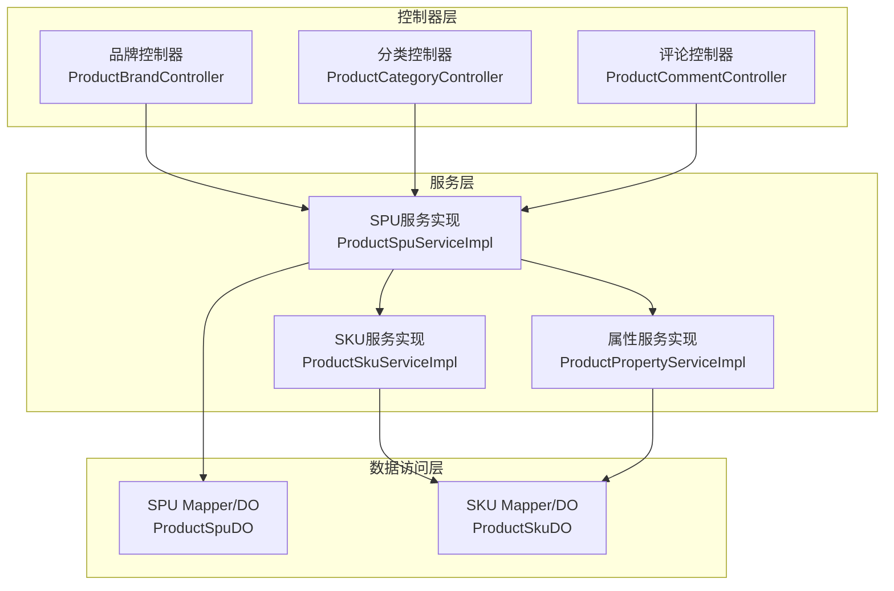
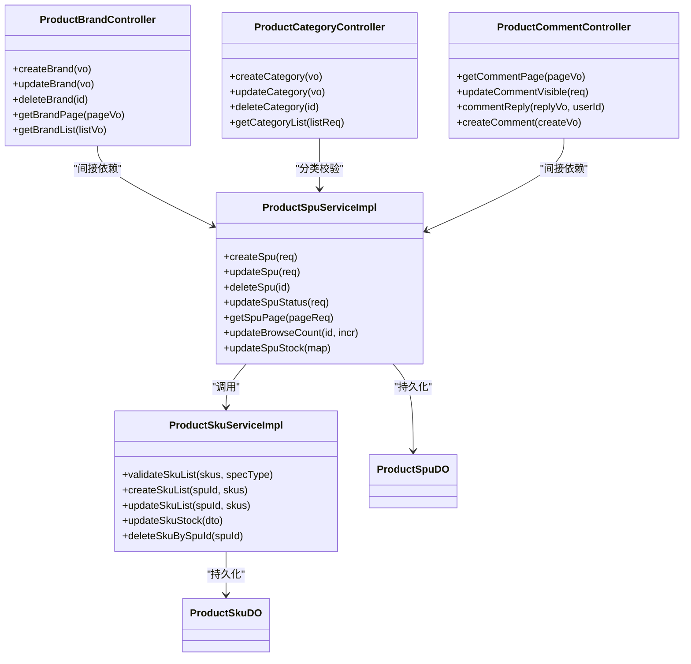
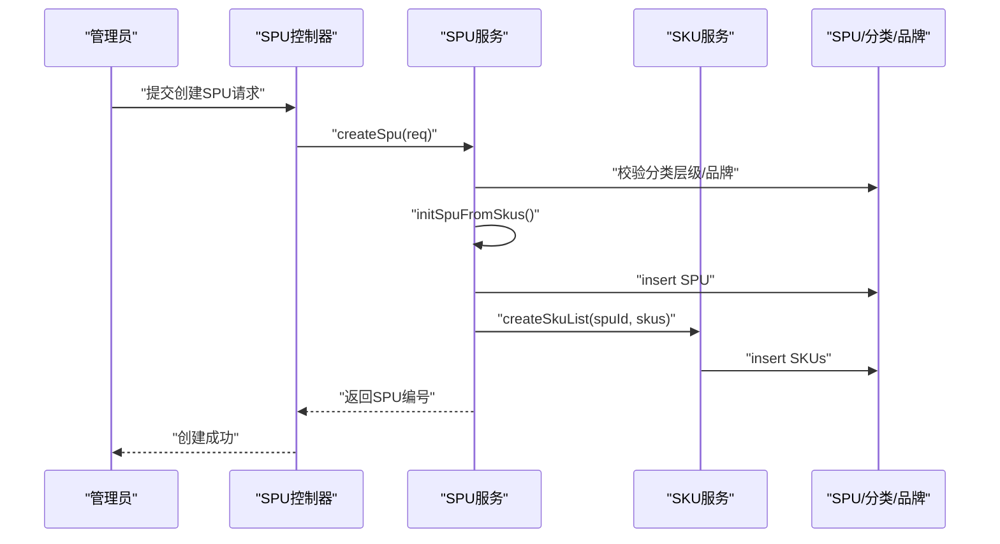
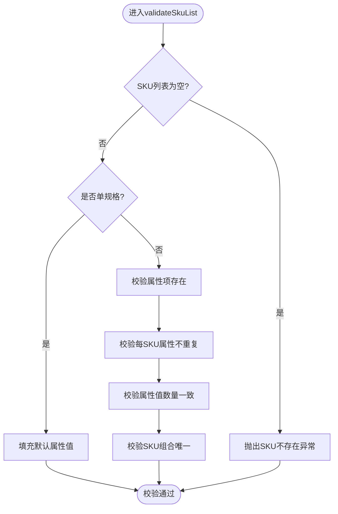
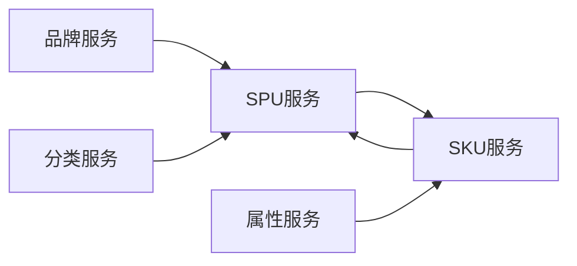

# 商品管理系统

<cite>
**本文引用的文件**
- [ProductSpuServiceImpl.java](file://yudao-module-mall/yudao-module-product/src/main/java/cn/iocoder/yudao/module/product/service/spu/ProductSpuServiceImpl.java)
- [ProductSkuServiceImpl.java](file://yudao-module-mall/yudao-module-product/src/main/java/cn/iocoder/yudao/module/product/service/sku/ProductSkuServiceImpl.java)
- [ProductBrandController.java](file://yudao-module-mall/yudao-module-product/src/main/java/cn/iocoder/yudao/module/product/controller/admin/brand/ProductBrandController.java)
- [ProductCategoryController.java](file://yudao-module-mall/yudao-module-product/src/main/java/cn/iocoder/yudao/module/product/controller/admin/category/ProductCategoryController.java)
- [ProductCommentController.java](file://yudao-module-mall/yudao-module-product/src/main/java/cn/iocoder/yudao/module/product/controller/admin/comment/ProductCommentController.java)
- [ProductSpuDO.java](file://yudao-module-mall/yudao-module-product/src/main/java/cn/iocoder/yudao/module/product/dal/dataobject/spu/ProductSpuDO.java)
- [ProductSkuDO.java](file://yudao-module-mall/yudao-module-product/src/main/java/cn/iocoder/yudao/module/product/dal/dataobject/sku/ProductSkuDO.java)
- [ProductSpuStatusEnum.java](file://yudao-module-mall/yudao-module-product/src/main/java/cn/iocoder/yudao/module/product/enums/spu/ProductSpuStatusEnum.java)
- [ProductPropertyServiceImpl.java](file://yudao-module-mall/yudao-module-product/src/main/java/cn/iocoder/yudao/module/product/service/property/ProductPropertyServiceImpl.java)
</cite>

## 目录
1. [引言](#引言)
2. [项目结构](#项目结构)
3. [核心组件](#核心组件)
4. [架构总览](#架构总览)
5. [详细组件分析](#详细组件分析)
6. [依赖分析](#依赖分析)
7. [性能考虑](#性能考虑)
8. [故障排查指南](#故障排查指南)
9. [结论](#结论)
10. [附录](#附录)

## 引言
本文件面向商品管理系统，围绕SPU（标准化产品单元）与SKU（标准库存单位）的管理机制，系统化梳理商品分类体系、品牌管理、商品信息维护、状态管理、属性与规格系统、评论管理、收藏与浏览历史、搜索与筛选等能力，并给出最佳实践与性能优化建议。文档以代码为依据，辅以可视化图示，帮助技术与非技术读者快速理解并落地使用。

## 项目结构
商品管理位于“yudao-module-mall/yudao-module-product”模块中，采用按职责分层的组织方式：
- 控制器层：Admin侧提供品牌、分类、评论等管理接口；App侧提供商品展示与查询接口（在同模块内，此处聚焦Admin侧）。
- 服务层：SPU、SKU、品牌、分类、属性、评论等服务实现。
- 数据访问层：MyBatis Mapper与DO模型。
- 枚举与常量：商品状态、错误码等。

图表来源
- [ProductBrandController.java:1-93](file://yudao-module-mall/yudao-module-product/src/main/java/cn/iocoder/yudao/module/product/controller/admin/brand/ProductBrandController.java#L1-L93)
- [ProductCategoryController.java:1-76](file://yudao-module-mall/yudao-module-product/src/main/java/cn/iocoder/yudao/module/product/controller/admin/category/ProductCategoryController.java#L1-L76)
- [ProductCommentController.java:1-62](file://yudao-module-mall/yudao-module-product/src/main/java/cn/iocoder/yudao/module/product/controller/admin/comment/ProductCommentController.java#L1-L62)
- [ProductSpuServiceImpl.java:1-285](file://yudao-module-mall/yudao-module-product/src/main/java/cn/iocoder/yudao/module/product/service/spu/ProductSpuServiceImpl.java#L1-L285)
- [ProductSkuServiceImpl.java:1-279](file://yudao-module-mall/yudao-module-product/src/main/java/cn/iocoder/yudao/module/product/service/sku/ProductSkuServiceImpl.java#L1-L279)
- [ProductPropertyServiceImpl.java:1-118](file://yudao-module-mall/yudao-module-product/src/main/java/cn/iocoder/yudao/module/product/service/property/ProductPropertyServiceImpl.java#L1-L118)
- [ProductSpuDO.java:1-172](file://yudao-module-mall/yudao-module-product/src/main/java/cn/iocoder/yudao/module/product/dal/dataobject/spu/ProductSpuDO.java#L1-L172)
- [ProductSkuDO.java:1-135](file://yudao-module-mall/yudao-module-product/src/main/java/cn/iocoder/yudao/module/product/dal/dataobject/sku/ProductSkuDO.java#L1-L135)

章节来源
- [ProductBrandController.java:1-93](file://yudao-module-mall/yudao-module-product/src/main/java/cn/iocoder/yudao/module/product/controller/admin/brand/ProductBrandController.java#L1-L93)
- [ProductCategoryController.java:1-76](file://yudao-module-mall/yudao-module-product/src/main/java/cn/iocoder/yudao/module/product/controller/admin/category/ProductCategoryController.java#L1-L76)
- [ProductCommentController.java:1-62](file://yudao-module-mall/yudao-module-product/src/main/java/cn/iocoder/yudao/module/product/controller/admin/comment/ProductCommentController.java#L1-L62)
- [ProductSpuServiceImpl.java:1-285](file://yudao-module-mall/yudao-module-product/src/main/java/cn/iocoder/yudao/module/product/service/spu/ProductSpuServiceImpl.java#L1-L285)
- [ProductSkuServiceImpl.java:1-279](file://yudao-module-mall/yudao-module-product/src/main/java/cn/iocoder/yudao/module/product/service/sku/ProductSkuServiceImpl.java#L1-L279)
- [ProductPropertyServiceImpl.java:1-118](file://yudao-module-mall/yudao-module-product/src/main/java/cn/iocoder/yudao/module/product/service/property/ProductPropertyServiceImpl.java#L1-L118)
- [ProductSpuDO.java:1-172](file://yudao-module-mall/yudao-module-product/src/main/java/cn/iocoder/yudao/module/product/dal/dataobject/spu/ProductSpuDO.java#L1-L172)
- [ProductSkuDO.java:1-135](file://yudao-module-mall/yudao-module-product/src/main/java/cn/iocoder/yudao/module/product/dal/dataobject/sku/ProductSkuDO.java#L1-L135)

## 核心组件
- SPU服务：负责SPU的创建、更新、删除、分页、状态变更、浏览量与库存更新、分类层级校验等。
- SKU服务：负责SKU的校验、创建、更新、删除、库存变更与同步至SPU、属性冗余更新等。
- 品牌控制器：提供品牌新增、修改、删除、分页、列表、简单列表等接口。
- 分类控制器：提供分类新增、修改、删除、列表、树形结构查询等接口。
- 评论控制器：提供评论分页、可见性切换、商家回复、自评添加等接口。
- 数据模型：SPU/SKU实体，包含基本信息、SKU聚合字段、物流营销统计等字段。
- 状态枚举：SPU状态（上架/下架/回收站）。

章节来源
- [ProductSpuServiceImpl.java:56-95](file://yudao-module-mall/yudao-module-product/src/main/java/cn/iocoder/yudao/module/product/service/spu/ProductSpuServiceImpl.java#L56-L95)
- [ProductSkuServiceImpl.java:88-143](file://yudao-module-mall/yudao-module-product/src/main/java/cn/iocoder/yudao/module/product/service/sku/ProductSkuServiceImpl.java#L88-L143)
- [ProductBrandController.java:33-90](file://yudao-module-mall/yudao-module-product/src/main/java/cn/iocoder/yudao/module/product/controller/admin/brand/ProductBrandController.java#L33-L90)
- [ProductCategoryController.java:33-73](file://yudao-module-mall/yudao-module-product/src/main/java/cn/iocoder/yudao/module/product/controller/admin/category/ProductCategoryController.java#L33-L73)
- [ProductCommentController.java:29-59](file://yudao-module-mall/yudao-module-product/src/main/java/cn/iocoder/yudao/module/product/controller/admin/comment/ProductCommentController.java#L29-L59)
- [ProductSpuDO.java:31-171](file://yudao-module-mall/yudao-module-product/src/main/java/cn/iocoder/yudao/module/product/dal/dataobject/spu/ProductSpuDO.java#L31-L171)
- [ProductSkuDO.java:29-135](file://yudao-module-mall/yudao-module-product/src/main/java/cn/iocoder/yudao/module/product/dal/dataobject/sku/ProductSkuDO.java#L29-L135)
- [ProductSpuStatusEnum.java:16-46](file://yudao-module-mall/yudao-module-product/src/main/java/cn/iocoder/yudao/module/product/enums/spu/ProductSpuStatusEnum.java#L16-L46)

## 架构总览
商品管理采用“控制器-服务-数据访问-模型”的分层架构，SPU与SKU强关联：SPU聚合SKU的价格、库存等指标；SKU通过属性数组表达多规格组合；品牌与分类作为SPU的外键约束；评论、收藏、浏览历史等能力在App侧扩展，Admin侧提供管理接口。

图表来源
- [ProductSpuServiceImpl.java:41-285](file://yudao-module-mall/yudao-module-product/src/main/java/cn/iocoder/yudao/module/product/service/spu/ProductSpuServiceImpl.java#L41-L285)
- [ProductSkuServiceImpl.java:36-279](file://yudao-module-mall/yudao-module-product/src/main/java/cn/iocoder/yudao/module/product/service/sku/ProductSkuServiceImpl.java#L36-L279)
- [ProductBrandController.java:24-93](file://yudao-module-mall/yudao-module-product/src/main/java/cn/iocoder/yudao/module/product/controller/admin/brand/ProductBrandController.java#L24-L93)
- [ProductCategoryController.java:24-76](file://yudao-module-mall/yudao-module-product/src/main/java/cn/iocoder/yudao/module/product/controller/admin/category/ProductCategoryController.java#L24-L76)
- [ProductCommentController.java:20-62](file://yudao-module-mall/yudao-module-product/src/main/java/cn/iocoder/yudao/module/product/controller/admin/comment/ProductCommentController.java#L20-L62)
- [ProductSpuDO.java:23-172](file://yudao-module-mall/yudao-module-product/src/main/java/cn/iocoder/yudao/module/product/dal/dataobject/spu/ProductSpuDO.java#L23-L172)
- [ProductSkuDO.java:21-135](file://yudao-module-mall/yudao-module-product/src/main/java/cn/iocoder/yudao/module/product/dal/dataobject/sku/ProductSkuDO.java#L21-L135)

## 详细组件分析

### SPU管理流程
- 创建SPU：校验分类层级、品牌有效性；基于SKU列表初始化SPU聚合字段（最低价格、库存合计等）；插入SPU并批量创建SKU。
- 更新SPU：校验分类与品牌；基于SKU列表重算聚合字段；更新SPU并批量更新SKU。
- 删除SPU：仅允许回收站状态的SPU删除；删除关联SKU。
- 状态管理：支持上架/下架/回收站切换。
- 分页与筛选：App侧分页时自动包含子分类；Admin侧支持多维度分页与统计标签计数。

图表来源
- [ProductSpuServiceImpl.java:56-95](file://yudao-module-mall/yudao-module-product/src/main/java/cn/iocoder/yudao/module/product/service/spu/ProductSpuServiceImpl.java#L56-L95)
- [ProductSkuServiceImpl.java:146-149](file://yudao-module-mall/yudao-module-product/src/main/java/cn/iocoder/yudao/module/product/service/sku/ProductSkuServiceImpl.java#L146-L149)

章节来源
- [ProductSpuServiceImpl.java:56-132](file://yudao-module-mall/yudao-module-product/src/main/java/cn/iocoder/yudao/module/product/service/spu/ProductSpuServiceImpl.java#L56-L132)
- [ProductSpuServiceImpl.java:134-177](file://yudao-module-mall/yudao-module-product/src/main/java/cn/iocoder/yudao/module/product/service/spu/ProductSpuServiceImpl.java#L134-L177)
- [ProductSpuServiceImpl.java:215-238](file://yudao-module-mall/yudao-module-product/src/main/java/cn/iocoder/yudao/module/product/service/spu/ProductSpuServiceImpl.java#L215-L238)
- [ProductSpuStatusEnum.java:16-46](file://yudao-module-mall/yudao-module-product/src/main/java/cn/iocoder/yudao/module/product/enums/spu/ProductSpuStatusEnum.java#L16-L46)

### SKU校验与规格组合
- 单规格默认属性：当specType=false时，自动填充默认属性值，无需进一步校验。
- 多规格校验规则：
  - 属性项存在性校验；
  - 每个SKU的属性项不重复；
  - 每个SKU的属性值数量一致；
  - 不同SKU的属性值组合不重复。
- SKU更新策略：根据属性组合键匹配已存在SKU，执行插入、更新或删除，保证与SPU的规格一致性。

图表来源
- [ProductSkuServiceImpl.java:88-143](file://yudao-module-mall/yudao-module-product/src/main/java/cn/iocoder/yudao/module/product/service/sku/ProductSkuServiceImpl.java#L88-L143)

章节来源
- [ProductSkuServiceImpl.java:88-143](file://yudao-module-mall/yudao-module-product/src/main/java/cn/iocoder/yudao/module/product/service/sku/ProductSkuServiceImpl.java#L88-L143)
- [ProductSkuServiceImpl.java:220-253](file://yudao-module-mall/yudao-module-product/src/main/java/cn/iocoder/yudao/module/product/service/sku/ProductSkuServiceImpl.java#L220-L253)

### 品牌管理
- 接口能力：创建、更新、删除、分页、列表、简单列表（启用状态+排序）。
- 简化列表：主要用于前端下拉选择，按启用状态与sort排序返回。

章节来源
- [ProductBrandController.java:33-90](file://yudao-module-mall/yudao-module-product/src/main/java/cn/iocoder/yudao/module/product/controller/admin/brand/ProductBrandController.java#L33-L90)

### 分类管理
- 接口能力：创建、更新、删除、列表、树形查询。
- 列表排序：按sort字段升序排列，便于前端展示。

章节来源
- [ProductCategoryController.java:33-73](file://yudao-module-mall/yudao-module-product/src/main/java/cn/iocoder/yudao/module/product/controller/admin/category/ProductCategoryController.java#L33-L73)

### 评论管理
- 接口能力：评论分页、显示/隐藏切换、商家回复、自评添加。
- 权限控制：均需相应权限注解保护。

章节来源
- [ProductCommentController.java:29-59](file://yudao-module-mall/yudao-module-product/src/main/java/cn/iocoder/yudao/module/product/controller/admin/comment/ProductCommentController.java#L29-L59)

### 商品属性与规格系统
- 属性项（Property）：名称唯一，删除前需确保无属性值。
- 属性值（PropertyValue）：与属性项关联，SKU通过属性数组冗余属性名与值名。
- SKU属性冗余：当属性项或属性值名称变更时，同步更新SKU中的冗余字段，保证展示一致性。

章节来源
- [ProductPropertyServiceImpl.java:42-89](file://yudao-module-mall/yudao-module-product/src/main/java/cn/iocoder/yudao/module/product/service/property/ProductPropertyServiceImpl.java#L42-L89)
- [ProductSkuServiceImpl.java:170-216](file://yudao-module-mall/yudao-module-product/src/main/java/cn/iocoder/yudao/module/product/service/sku/ProductSkuServiceImpl.java#L170-L216)
- [ProductSkuDO.java:100-131](file://yudao-module-mall/yudao-module-product/src/main/java/cn/iocoder/yudao/module/product/dal/dataobject/sku/ProductSkuDO.java#L100-L131)

### 商品信息与状态管理
- SPU字段覆盖范围广：名称、关键字、简介、详情、封面/轮播图、分类/品牌、排序、状态、规格类型、价格/市场价/成本价、库存、物流/营销/统计字段等。
- SKU字段：价格/市场价/成本价、条码、图片、库存、重量/体积、分销佣金、销量等。
- 状态枚举：上架/下架/回收站三态，提供isEnable判断。

章节来源
- [ProductSpuDO.java:31-171](file://yudao-module-mall/yudao-module-product/src/main/java/cn/iocoder/yudao/module/product/dal/dataobject/spu/ProductSpuDO.java#L31-L171)
- [ProductSkuDO.java:29-135](file://yudao-module-mall/yudao-module-product/src/main/java/cn/iocoder/yudao/module/product/dal/dataobject/sku/ProductSkuDO.java#L29-L135)
- [ProductSpuStatusEnum.java:16-46](file://yudao-module-mall/yudao-module-product/src/main/java/cn/iocoder/yudao/module/product/enums/spu/ProductSpuStatusEnum.java#L16-L46)

### 收藏与浏览历史
- 当前Admin侧未提供收藏与浏览历史接口；如需实现，可在App侧服务中扩展对应DO与Mapper，并在控制器暴露相应接口。

（本节为概念性说明，不直接分析具体文件）

## 依赖分析
- SPU服务依赖SKU服务、品牌服务、分类服务；SKU服务依赖属性/属性值服务与SPU服务；控制器通过服务编排业务流程。
- 数据模型间关系：SPU与SKU一对多；SKU与属性数组多对一；SPU与分类/品牌多对一。

图表来源
- [ProductSpuServiceImpl.java:48-54](file://yudao-module-mall/yudao-module-product/src/main/java/cn/iocoder/yudao/module/product/service/spu/ProductSpuServiceImpl.java#L48-L54)
- [ProductSkuServiceImpl.java:40-50](file://yudao-module-mall/yudao-module-product/src/main/java/cn/iocoder/yudao/module/product/service/sku/ProductSkuServiceImpl.java#L40-L50)

章节来源
- [ProductSpuServiceImpl.java:48-54](file://yudao-module-mall/yudao-module-product/src/main/java/cn/iocoder/yudao/module/product/service/spu/ProductSpuServiceImpl.java#L48-L54)
- [ProductSkuServiceImpl.java:40-50](file://yudao-module-mall/yudao-module-product/src/main/java/cn/iocoder/yudao/module/product/service/sku/ProductSkuServiceImpl.java#L40-L50)

## 性能考虑
- 批量操作：创建/更新SKU使用批量插入与批量更新，减少事务次数与SQL往返。
- 聚合字段：SPU聚合SKU的最低价格、库存合计，避免查询时重复计算。
- 分页与筛选：App侧分页自动包含子分类，建议结合索引与缓存优化。
- 库存扣减：SKU库存扣减带原子性校验，不足时报错并回滚，保障一致性。
- 属性冗余：SKU冗余属性/属性值名称，减少联表查询，提升读性能。

（本节为通用指导，不直接分析具体文件）

## 故障排查指南
- SPU不存在或状态不可用：创建/更新/删除SPU前进行存在性与状态校验。
- SKU不存在或规格重复：validateSkuList会抛出相应异常，需检查属性项、属性值数量与组合唯一性。
- 库存不足：SKU扣减时若不足会抛异常，需先检查当前库存与下单数量。
- 品牌/分类非法：创建SPU前校验分类层级与品牌有效性。
- 评论可见性与回复：确认权限与登录用户ID传递正确。

章节来源
- [ProductSpuServiceImpl.java:134-153](file://yudao-module-mall/yudao-module-product/src/main/java/cn/iocoder/yudao/module/product/service/spu/ProductSpuServiceImpl.java#L134-L153)
- [ProductSkuServiceImpl.java:88-143](file://yudao-module-mall/yudao-module-product/src/main/java/cn/iocoder/yudao/module/product/service/sku/ProductSkuServiceImpl.java#L88-L143)
- [ProductSkuServiceImpl.java:255-276](file://yudao-module-mall/yudao-module-product/src/main/java/cn/iocoder/yudao/module/product/service/sku/ProductSkuServiceImpl.java#L255-L276)
- [ProductBrandController.java:33-90](file://yudao-module-mall/yudao-module-product/src/main/java/cn/iocoder/yudao/module/product/controller/admin/brand/ProductBrandController.java#L33-L90)
- [ProductCategoryController.java:33-73](file://yudao-module-mall/yudao-module-product/src/main/java/cn/iocoder/yudao/module/product/controller/admin/category/ProductCategoryController.java#L33-L73)
- [ProductCommentController.java:29-59](file://yudao-module-mall/yudao-module-product/src/main/java/cn/iocoder/yudao/module/product/controller/admin/comment/ProductCommentController.java#L29-L59)

## 结论
本系统以SPU聚合SKU为核心，通过严格的SKU校验与属性冗余设计，实现了灵活的多规格商品管理；配合品牌、分类、评论等模块，构建了完整的商品运营闭环。Admin侧提供完善的管理接口，App侧可在此基础上扩展搜索、收藏、浏览历史等能力，整体具备良好的扩展性与可维护性。

## 附录
- 最佳实践
  - 新增商品时优先准备SKU清单，确保属性值组合完整且唯一。
  - 变更属性项/属性值名称时，及时同步SKU冗余字段。
  - 使用批量接口进行SKU的创建与更新，减少事务开销。
  - 对高频查询字段建立索引，结合分页与缓存优化。
- 性能优化建议
  - SKU库存扣减采用原子更新与回滚策略，避免超卖。
  - SPU聚合字段按需刷新，避免频繁全量扫描。
  - 分类与品牌查询使用简单列表接口，减少字段传输。