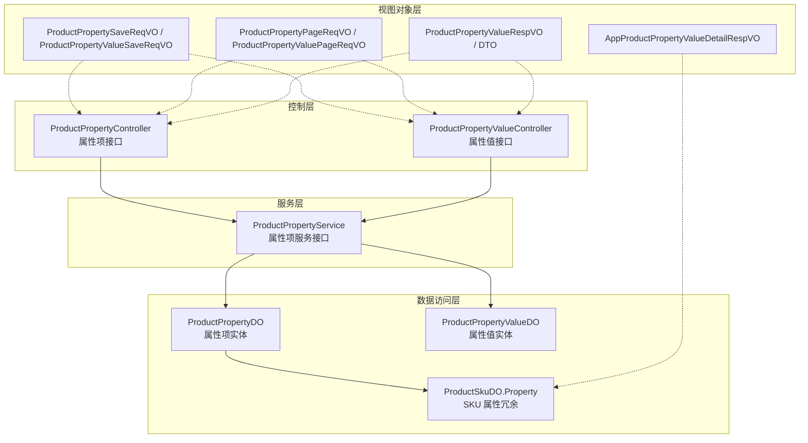
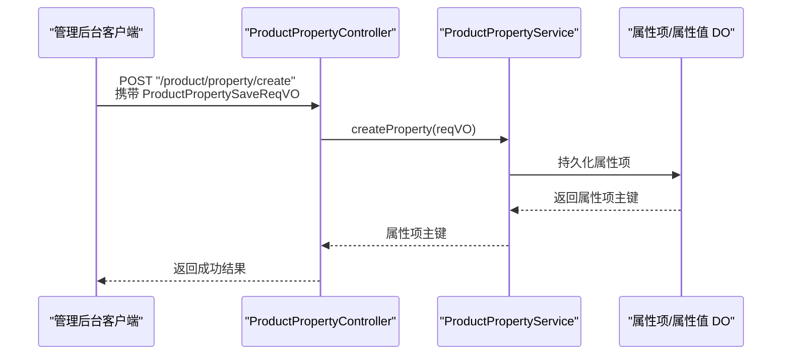
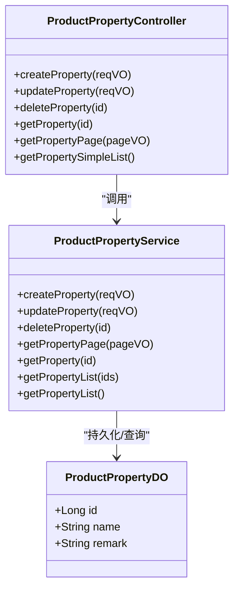
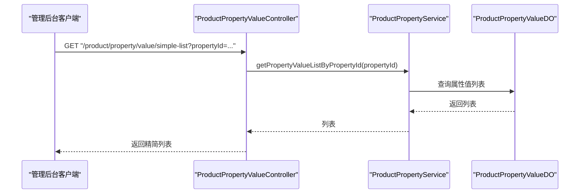
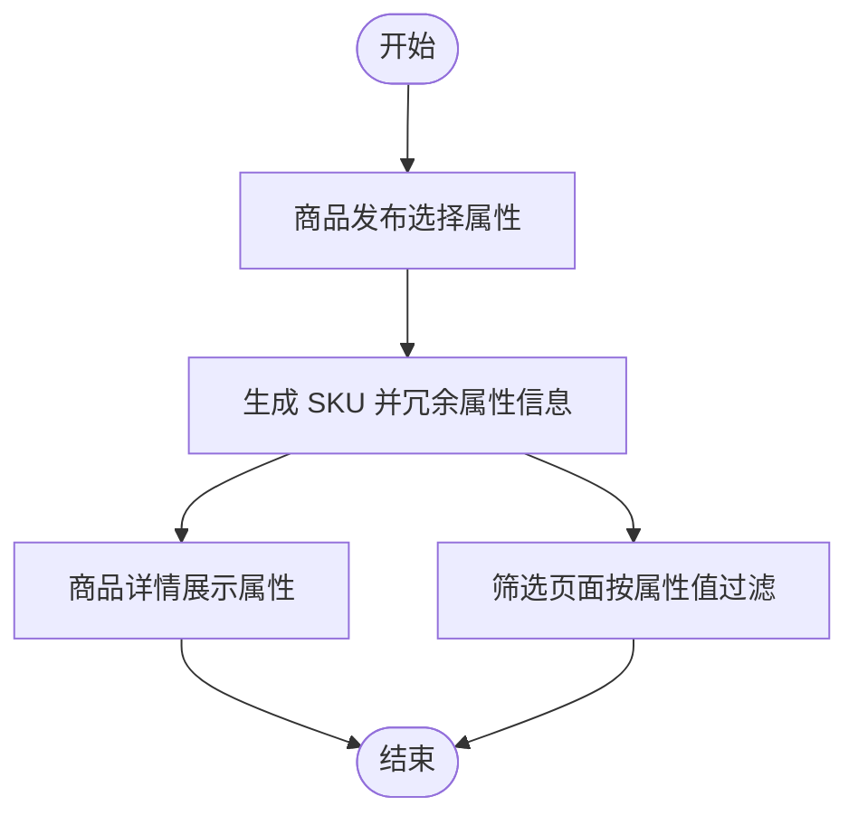
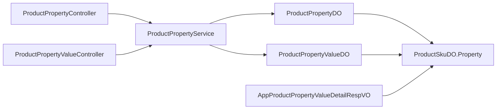

# 属性管理

<cite>
**本文引用的文件**
- [ProductPropertyController.java](file://yudao-module-mall/yudao-module-product/src/main/java/cn/iocoder/yudao/module/product/controller/admin/property/ProductPropertyController.java)
- [ProductPropertyValueController.java](file://yudao-module-mall/yudao-module-product/src/main/java/cn/iocoder/yudao/module/product/controller/admin/property/ProductPropertyValueController.java)
- [ProductPropertyService.java](file://yudao-module-mall/yudao-module-product/src/main/java/cn/iocoder/yudao/module/product/service/property/ProductPropertyService.java)
- [ProductPropertyDO.java](file://yudao-module-mall/yudao-module-product/src/main/java/cn/iocoder/yudao/module/product/dal/dataobject/property/ProductPropertyDO.java)
- [ProductPropertyValueDO.java](file://yudao-module-mall/yudao-module-product/src/main/java/cn/iocoder/yudao/module/product/dal/dataobject/property/ProductPropertyValueDO.java)
- [ProductPropertyValueDetailRespDTO.java](file://yudao-module-mall/yudao-module-product/src/main/java/cn/iocoder/yudao/module/product/api/property/dto/ProductPropertyValueDetailRespDTO.java)
- [ProductSkuDO.java](file://yudao-module-mall/yudao-module-product/src/main/java/cn/iocoder/yudao/module/product/dal/dataobject/sku/ProductSkuDO.java)
- [ProductCategoryDO.java](file://yudao-module-mall/yudao-module-product/src/main/java/cn/iocoder/yudao/module/product/dal/dataobject/category/ProductCategoryDO.java)
- [ProductPropertySaveReqVO.java](file://yudao-module-mall/yudao-module-product/src/main/java/cn/iocoder/yudao/module/product/controller/admin/property/vo/property/ProductPropertySaveReqVO.java)
- [ProductPropertyPageReqVO.java](file://yudao-module-mall/yudao-module-product/src/main/java/cn/iocoder/yudao/module/product/controller/admin/property/vo/property/ProductPropertyPageReqVO.java)
- [ProductPropertyValueSaveReqVO.java](file://yudao-module-mall/yudao-module-product/src/main/java/cn/iocoder/yudao/module/product/controller/admin/property/vo/value/ProductPropertyValueSaveReqVO.java)
- [ProductPropertyValuePageReqVO.java](file://yudao-module-mall/yudao-module-product/src/main/java/cn/iocoder/yudao/module/product/controller/admin/property/vo/value/ProductPropertyValuePageReqVO.java)
- [ProductPropertyValueRespVO.java](file://yudao-module-mall/yudao-module-product/src/main/java/cn/iocoder/yudao/module/product/controller/admin/property/vo/value/ProductPropertyValueRespVO.java)
- [AppProductPropertyValueDetailRespVO.java（trade）](file://yudao-module-mall/yudao-module-trade/src/main/java/cn/iocoder/yudao/module/trade/controller/app/base/product/property/AppProductPropertyValueDetailRespVO.java)
- [AppProductPropertyValueDetailRespVO.java（product）](file://yudao-module-mall/yudao-module-product/src/main/java/cn/iocoder/yudao/module/product/controller/app/property/vo/value/AppProductPropertyValueDetailRespVO.java)
</cite>

## 目录
1. [简介](#简介)
2. [项目结构](#项目结构)
3. [核心组件](#核心组件)
4. [架构总览](#架构总览)
5. [详细组件分析](#详细组件分析)
6. [依赖分析](#依赖分析)
7. [性能考虑](#性能考虑)
8. [故障排查指南](#故障排查指南)
9. [结论](#结论)
10. [附录](#附录)

## 简介
本技术文档围绕商品属性管理功能展开，系统性阐述属性项与属性值的数据模型、属性分组（通过属性项维度组织）、属性与商品 SKU 的关联关系、属性在商品发布与筛选中的使用场景、属性值的增删改查与排序能力、以及属性的验证规则与搜索/筛选能力。同时给出属性管理的最佳实践与设计建议，帮助开发者与产品人员高效理解并扩展该能力。

## 项目结构
商品属性管理位于“商品模块”内，采用典型的分层架构：
- 控制器层：提供管理后台与用户端的属性项/属性值接口
- 服务层：封装业务逻辑（创建、更新、删除、分页查询、列表获取）
- 数据访问层：持久化属性项与属性值，以及与 SKU 的关联
- 视图对象层：请求/响应 VO 与 DTO，用于接口契约与跨模块传输

图表来源
- [ProductPropertyController.java:1-84](file://yudao-module-mall/yudao-module-product/src/main/java/cn/iocoder/yudao/module/product/controller/admin/property/ProductPropertyController.java#L1-L84)
- [ProductPropertyValueController.java:1-86](file://yudao-module-mall/yudao-module-product/src/main/java/cn/iocoder/yudao/module/product/controller/admin/property/ProductPropertyValueController.java#L1-L86)
- [ProductPropertyService.java:1-73](file://yudao-module-mall/yudao-module-product/src/main/java/cn/iocoder/yudao/module/product/service/property/ProductPropertyService.java#L1-L73)
- [ProductPropertyDO.java:14-47](file://yudao-module-mall/yudao-module-product/src/main/java/cn/iocoder/yudao/module/product/dal/dataobject/property/ProductPropertyDO.java#L14-L47)
- [ProductPropertyValueDO.java:10-55](file://yudao-module-mall/yudao-module-product/src/main/java/cn/iocoder/yudao/module/product/dal/dataobject/property/ProductPropertyValueDO.java#L10-L55)
- [ProductSkuDO.java:94-134](file://yudao-module-mall/yudao-module-product/src/main/java/cn/iocoder/yudao/module/product/dal/dataobject/sku/ProductSkuDO.java#L94-L134)

章节来源
- [ProductPropertyController.java:1-84](file://yudao-module-mall/yudao-module-product/src/main/java/cn/iocoder/yudao/module/product/controller/admin/property/ProductPropertyController.java#L1-L84)
- [ProductPropertyValueController.java:1-86](file://yudao-module-mall/yudao-module-product/src/main/java/cn/iocoder/yudao/module/product/controller/admin/property/ProductPropertyValueController.java#L1-L86)
- [ProductPropertyService.java:1-73](file://yudao-module-mall/yudao-module-product/src/main/java/cn/iocoder/yudao/module/product/service/property/ProductPropertyService.java#L1-L73)
- [ProductPropertyDO.java:14-47](file://yudao-module-mall/yudao-module-product/src/main/java/cn/iocoder/yudao/module/product/dal/dataobject/property/ProductPropertyDO.java#L14-L47)
- [ProductPropertyValueDO.java:10-55](file://yudao-module-mall/yudao-module-product/src/main/java/cn/iocoder/yudao/module/product/dal/dataobject/property/ProductPropertyValueDO.java#L10-L55)
- [ProductSkuDO.java:94-134](file://yudao-module-mall/yudao-module-product/src/main/java/cn/iocoder/yudao/module/product/dal/dataobject/sku/ProductSkuDO.java#L94-L134)

## 核心组件
- 属性项（Property）
  - 字段：主键、名称、备注
  - 作用：作为属性值的分组容器；支持分页、列表、详情查询
- 属性值（Property Value）
  - 字段：主键、属性项编号、名称、备注
  - 作用：具体可选值；支持分页、列表、详情查询
- SKU 属性冗余
  - 字段：属性编号、属性名、属性值编号、属性值名
  - 作用：提升商品详情与筛选性能，避免频繁 JOIN 查询
- 请求/响应 VO/DTO
  - 用于接口契约定义与跨模块传输，包含校验注解与示例

章节来源
- [ProductPropertyDO.java:14-47](file://yudao-module-mall/yudao-module-product/src/main/java/cn/iocoder/yudao/module/product/dal/dataobject/property/ProductPropertyDO.java#L14-L47)
- [ProductPropertyValueDO.java:10-55](file://yudao-module-mall/yudao-module-product/src/main/java/cn/iocoder/yudao/module/product/dal/dataobject/property/ProductPropertyValueDO.java#L10-L55)
- [ProductSkuDO.java:94-134](file://yudao-module-mall/yudao-module-product/src/main/java/cn/iocoder/yudao/module/product/dal/dataobject/sku/ProductSkuDO.java#L94-L134)
- [ProductPropertySaveReqVO.java:1-26](file://yudao-module-mall/yudao-module-product/src/main/java/cn/iocoder/yudao/module/product/controller/admin/property/vo/property/ProductPropertySaveReqVO.java#L1-L26)
- [ProductPropertyPageReqVO.java](file://yudao-module-mall/yudao-module-product/src/main/java/cn/iocoder/yudao/module/product/controller/admin/property/vo/property/ProductPropertyPageReqVO.java)
- [ProductPropertyValueSaveReqVO.java:1-26](file://yudao-module-mall/yudao-module-product/src/main/java/cn/iocoder/yudao/module/product/controller/admin/property/vo/value/ProductPropertyValueSaveReqVO.java#L1-L26)
- [ProductPropertyValuePageReqVO.java](file://yudao-module-mall/yudao-module-product/src/main/java/cn/iocoder/yudao/module/product/controller/admin/property/vo/value/ProductPropertyValuePageReqVO.java)
- [ProductPropertyValueRespVO.java:1-31](file://yudao-module-mall/yudao-module-product/src/main/java/cn/iocoder/yudao/module/product/controller/admin/property/vo/value/ProductPropertyValueRespVO.java#L1-L31)
- [ProductPropertyValueDetailRespDTO.java:1-33](file://yudao-module-mall/yudao-module-product/src/main/java/cn/iocoder/yudao/module/product/api/property/dto/ProductPropertyValueDetailRespDTO.java#L1-L33)
- [AppProductPropertyValueDetailRespVO.java（trade）:1-22](file://yudao-module-mall/yudao-module-trade/src/main/java/cn/iocoder/yudao/module/trade/controller/app/base/product/property/AppProductPropertyValueDetailRespVO.java#L1-L22)
- [AppProductPropertyValueDetailRespVO.java（product）:1-22](file://yudao-module-mall/yudao-module-product/src/main/java/cn/iocoder/yudao/module/product/controller/app/property/vo/value/AppProductPropertyValueDetailRespVO.java#L1-L22)

## 架构总览
属性管理遵循“控制器-服务-数据访问”的分层设计，接口职责清晰，数据模型简洁，SKU 属性冗余优化了查询性能。

图表来源
- [ProductPropertyController.java:34-39](file://yudao-module-mall/yudao-module-product/src/main/java/cn/iocoder/yudao/module/product/controller/admin/property/ProductPropertyController.java#L34-L39)
- [ProductPropertyService.java:18-25](file://yudao-module-mall/yudao-module-product/src/main/java/cn/iocoder/yudao/module/product/service/property/ProductPropertyService.java#L18-L25)
- [ProductPropertyDO.java:14-47](file://yudao-module-mall/yudao-module-product/src/main/java/cn/iocoder/yudao/module/product/dal/dataobject/property/ProductPropertyDO.java#L14-L47)

## 详细组件分析

### 属性项（Property）管理
- 功能点
  - 新增/更新/删除属性项
  - 分页查询与精简列表
  - 详情查询
- 数据模型
  - 主键、名称、备注
- 控制器接口
  - 创建、更新、删除、详情、分页、精简列表
- 验证规则
  - 请求 VO 中对必填字段进行校验

图表来源
- [ProductPropertyController.java:1-84](file://yudao-module-mall/yudao-module-product/src/main/java/cn/iocoder/yudao/module/product/controller/admin/property/ProductPropertyController.java#L1-L84)
- [ProductPropertyService.java:1-73](file://yudao-module-mall/yudao-module-product/src/main/java/cn/iocoder/yudao/module/product/service/property/ProductPropertyService.java#L1-L73)
- [ProductPropertyDO.java:14-47](file://yudao-module-mall/yudao-module-product/src/main/java/cn/iocoder/yudao/module/product/dal/dataobject/property/ProductPropertyDO.java#L14-L47)

章节来源
- [ProductPropertyController.java:34-81](file://yudao-module-mall/yudao-module-product/src/main/java/cn/iocoder/yudao/module/product/controller/admin/property/ProductPropertyController.java#L34-L81)
- [ProductPropertyService.java:18-71](file://yudao-module-mall/yudao-module-product/src/main/java/cn/iocoder/yudao/module/product/service/property/ProductPropertyService.java#L18-L71)
- [ProductPropertyDO.java:14-47](file://yudao-module-mall/yudao-module-product/src/main/java/cn/iocoder/yudao/module/product/dal/dataobject/property/ProductPropertyDO.java#L14-L47)
- [ProductPropertySaveReqVO.java:1-26](file://yudao-module-mall/yudao-module-product/src/main/java/cn/iocoder/yudao/module/product/controller/admin/property/vo/property/ProductPropertySaveReqVO.java#L1-L26)
- [ProductPropertyPageReqVO.java](file://yudao-module-mall/yudao-module-product/src/main/java/cn/iocoder/yudao/module/product/controller/admin/property/vo/property/ProductPropertyPageReqVO.java)

### 属性值（Property Value）管理
- 功能点
  - 新增/更新/删除属性值
  - 分页查询与精简列表（按属性项过滤）
  - 详情查询
- 数据模型
  - 主键、属性项编号、名称、备注
- 控制器接口
  - 创建、更新、删除、详情、分页、按属性项精简列表
- 验证规则
  - 请求 VO 中对必填字段进行校验

图表来源
- [ProductPropertyValueController.java:76-83](file://yudao-module-mall/yudao-module-product/src/main/java/cn/iocoder/yudao/module/product/controller/admin/property/ProductPropertyValueController.java#L76-L83)
- [ProductPropertyValueDO.java:10-55](file://yudao-module-mall/yudao-module-product/src/main/java/cn/iocoder/yudao/module/product/dal/dataobject/property/ProductPropertyValueDO.java#L10-L55)

章节来源
- [ProductPropertyValueController.java:35-83](file://yudao-module-mall/yudao-module-product/src/main/java/cn/iocoder/yudao/module/product/controller/admin/property/ProductPropertyValueController.java#L35-L83)
- [ProductPropertyValueDO.java:10-55](file://yudao-module-mall/yudao-module-product/src/main/java/cn/iocoder/yudao/module/product/dal/dataobject/property/ProductPropertyValueDO.java#L10-L55)
- [ProductPropertyValueSaveReqVO.java:1-26](file://yudao-module-mall/yudao-module-product/src/main/java/cn/iocoder/yudao/module/product/controller/admin/property/vo/value/ProductPropertyValueSaveReqVO.java#L1-L26)
- [ProductPropertyValuePageReqVO.java](file://yudao-module-mall/yudao-module-product/src/main/java/cn/iocoder/yudao/module/product/controller/admin/property/vo/value/ProductPropertyValuePageReqVO.java)
- [ProductPropertyValueRespVO.java:1-31](file://yudao-module-mall/yudao-module-product/src/main/java/cn/iocoder/yudao/module/product/controller/admin/property/vo/value/ProductPropertyValueRespVO.java#L1-L31)

### 属性与分类的关联关系
- 当前仓库未发现“属性与分类直接关联”的实体或接口
- 商品 SKU 中包含“属性冗余”，便于在商品详情与筛选中直接使用属性信息
- 若需实现“不同分类使用不同属性集”，可在业务层通过“属性项与分类的映射关系”进行控制，或扩展数据模型以支持分类维度的属性集配置

章节来源
- [ProductSkuDO.java:94-134](file://yudao-module-mall/yudao-module-product/src/main/java/cn/iocoder/yudao/module/product/dal/dataobject/sku/ProductSkuDO.java#L94-L134)
- [ProductCategoryDO.java:10-64](file://yudao-module-mall/yudao-module-product/src/main/java/cn/iocoder/yudao/module/product/dal/dataobject/category/ProductCategoryDO.java#L10-L64)

### 属性在商品发布与筛选中的使用
- 发布时
  - 选择属性项与属性值，形成 SKU 的属性组合
  - SKU 中冗余属性与属性值信息，减少查询成本
- 筛选时
  - 基于属性值进行精确匹配
  - 可结合分类、价格、品牌等其他维度进行组合筛选

图表来源
- [ProductSkuDO.java:94-134](file://yudao-module-mall/yudao-module-product/src/main/java/cn/iocoder/yudao/module/product/dal/dataobject/sku/ProductSkuDO.java#L94-L134)

章节来源
- [ProductSkuDO.java:94-134](file://yudao-module-mall/yudao-module-product/src/main/java/cn/iocoder/yudao/module/product/dal/dataobject/sku/ProductSkuDO.java#L94-L134)
- [AppProductPropertyValueDetailRespVO.java（trade）:1-22](file://yudao-module-mall/yudao-module-trade/src/main/java/cn/iocoder/yudao/module/trade/controller/app/base/product/property/AppProductPropertyValueDetailRespVO.java#L1-L22)
- [AppProductPropertyValueDetailRespVO.java（product）:1-22](file://yudao-module-mall/yudao-module-product/src/main/java/cn/iocoder/yudao/module/product/controller/app/property/vo/value/AppProductPropertyValueDetailRespVO.java#L1-L22)

### 属性值的验证规则
- 属性项与属性值的请求 VO 对关键字段进行非空校验
- 建议在业务层补充更细粒度的校验（如长度、格式、唯一性）

章节来源
- [ProductPropertySaveReqVO.java:1-26](file://yudao-module-mall/yudao-module-product/src/main/java/cn/iocoder/yudao/module/product/controller/admin/property/vo/property/ProductPropertySaveReqVO.java#L1-L26)
- [ProductPropertyValueSaveReqVO.java:1-26](file://yudao-module-mall/yudao-module-product/src/main/java/cn/iocoder/yudao/module/product/controller/admin/property/vo/value/ProductPropertyValueSaveReqVO.java#L1-L26)

### 属性的搜索与筛选
- 支持按属性值进行精确匹配
- 建议在分页查询中增加属性项/属性值的过滤条件与排序字段，以满足复杂筛选需求

章节来源
- [ProductPropertyController.java:67-73](file://yudao-module-mall/yudao-module-product/src/main/java/cn/iocoder/yudao/module/product/controller/admin/property/ProductPropertyController.java#L67-L73)
- [ProductPropertyValueController.java:68-74](file://yudao-module-mall/yudao-module-product/src/main/java/cn/iocoder/yudao/module/product/controller/admin/property/ProductPropertyValueController.java#L68-L74)

### 批量操作能力
- 当前接口未提供批量设置属性值、批量导出等能力
- 建议扩展批量接口，以提升运营效率

章节来源
- [ProductPropertyController.java:1-84](file://yudao-module-mall/yudao-module-product/src/main/java/cn/iocoder/yudao/module/product/controller/admin/property/ProductPropertyController.java#L1-L84)
- [ProductPropertyValueController.java:1-86](file://yudao-module-mall/yudao-module-product/src/main/java/cn/iocoder/yudao/module/product/controller/admin/property/ProductPropertyValueController.java#L1-L86)

## 依赖分析
- 控制器依赖服务接口，服务接口依赖 DO 实体
- SKU 属性冗余依赖属性项与属性值实体
- 用户端 VO 与 DTO 依赖 SKU 属性冗余结构

图表来源
- [ProductPropertyController.java:1-84](file://yudao-module-mall/yudao-module-product/src/main/java/cn/iocoder/yudao/module/product/controller/admin/property/ProductPropertyController.java#L1-L84)
- [ProductPropertyValueController.java:1-86](file://yudao-module-mall/yudao-module-product/src/main/java/cn/iocoder/yudao/module/product/controller/admin/property/ProductPropertyValueController.java#L1-L86)
- [ProductPropertyService.java:1-73](file://yudao-module-mall/yudao-module-product/src/main/java/cn/iocoder/yudao/module/product/service/property/ProductPropertyService.java#L1-L73)
- [ProductPropertyDO.java:14-47](file://yudao-module-mall/yudao-module-product/src/main/java/cn/iocoder/yudao/module/product/dal/dataobject/property/ProductPropertyDO.java#L14-L47)
- [ProductPropertyValueDO.java:10-55](file://yudao-module-mall/yudao-module-product/src/main/java/cn/iocoder/yudao/module/product/dal/dataobject/property/ProductPropertyValueDO.java#L10-L55)
- [ProductSkuDO.java:94-134](file://yudao-module-mall/yudao-module-product/src/main/java/cn/iocoder/yudao/module/product/dal/dataobject/sku/ProductSkuDO.java#L94-L134)
- [AppProductPropertyValueDetailRespVO.java（trade）:1-22](file://yudao-module-mall/yudao-module-trade/src/main/java/cn/iocoder/yudao/module/trade/controller/app/base/product/property/AppProductPropertyValueDetailRespVO.java#L1-L22)

章节来源
- [ProductPropertyController.java:1-84](file://yudao-module-mall/yudao-module-product/src/main/java/cn/iocoder/yudao/module/product/controller/admin/property/ProductPropertyController.java#L1-L84)
- [ProductPropertyValueController.java:1-86](file://yudao-module-mall/yudao-module-product/src/main/java/cn/iocoder/yudao/module/product/controller/admin/property/ProductPropertyValueController.java#L1-L86)
- [ProductPropertyService.java:1-73](file://yudao-module-mall/yudao-module-product/src/main/java/cn/iocoder/yudao/module/product/service/property/ProductPropertyService.java#L1-L73)
- [ProductPropertyDO.java:14-47](file://yudao-module-mall/yudao-module-product/src/main/java/cn/iocoder/yudao/module/product/dal/dataobject/property/ProductPropertyDO.java#L14-L47)
- [ProductPropertyValueDO.java:10-55](file://yudao-module-mall/yudao-module-product/src/main/java/cn/iocoder/yudao/module/product/dal/dataobject/property/ProductPropertyValueDO.java#L10-L55)
- [ProductSkuDO.java:94-134](file://yudao-module-mall/yudao-module-product/src/main/java/cn/iocoder/yudao/module/product/dal/dataobject/sku/ProductSkuDO.java#L94-L134)
- [AppProductPropertyValueDetailRespVO.java（trade）:1-22](file://yudao-module-mall/yudao-module-trade/src/main/java/cn/iocoder/yudao/module/trade/controller/app/base/product/property/AppProductPropertyValueDetailRespVO.java#L1-L22)

## 性能考虑
- SKU 属性冗余显著降低商品详情与筛选时的 JOIN 成本
- 建议在属性名称或属性值名称变更时同步更新 SKU 冗余字段，确保一致性
- 分页查询应结合索引与过滤条件，避免全表扫描

## 故障排查指南
- 常见问题
  - 属性值名称为空：检查请求 VO 的非空校验
  - 属性项不存在：确认属性项主键正确
  - SKU 属性冗余不一致：检查属性/属性值名称变更后的同步流程
- 排查步骤
  - 核对请求参数与 VO 校验
  - 查看服务层日志与异常栈
  - 核对 SKU 冗余字段与属性项/属性值实体的一致性

章节来源
- [ProductPropertySaveReqVO.java:1-26](file://yudao-module-mall/yudao-module-product/src/main/java/cn/iocoder/yudao/module/product/controller/admin/property/vo/property/ProductPropertySaveReqVO.java#L1-L26)
- [ProductPropertyValueSaveReqVO.java:1-26](file://yudao-module-mall/yudao-module-product/src/main/java/cn/iocoder/yudao/module/product/controller/admin/property/vo/value/ProductPropertyValueSaveReqVO.java#L1-L26)
- [ProductSkuDO.java:94-134](file://yudao-module-mall/yudao-module-product/src/main/java/cn/iocoder/yudao/module/product/dal/dataobject/sku/ProductSkuDO.java#L94-L134)

## 结论
商品属性管理以简洁的数据模型与清晰的分层架构支撑了商品发布与筛选两大核心场景。通过 SKU 属性冗余提升了查询性能，通过 VO/DTO 明确了接口契约。当前实现覆盖了属性项与属性值的基础 CRUD 与分页查询，建议后续扩展批量操作与分类维度的属性集配置能力，以进一步提升运营效率与业务灵活性。

## 附录
- 最佳实践与设计建议
  - 属性项命名规范统一，避免歧义
  - 属性值枚举化管理，必要时引入字典体系
  - 属性/属性值名称变更时，确保 SKU 冗余同步更新
  - 在分页查询中增加必要的过滤与排序字段
  - 如需支持“不同分类使用不同属性集”，建议扩展数据模型并在服务层实现映射控制