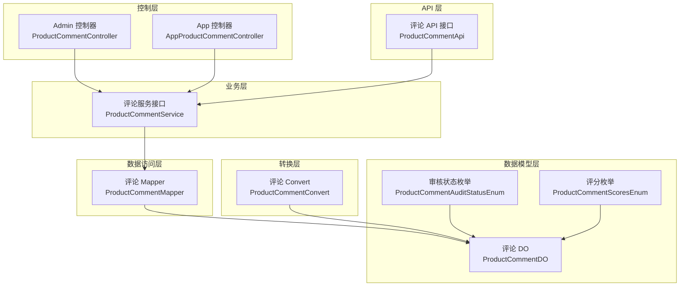
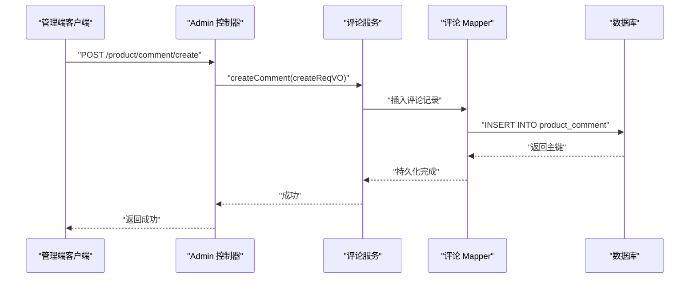
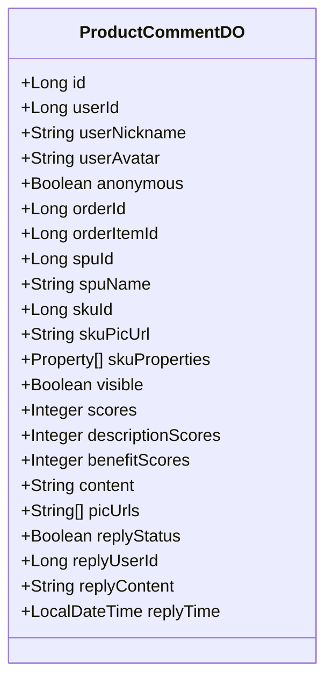
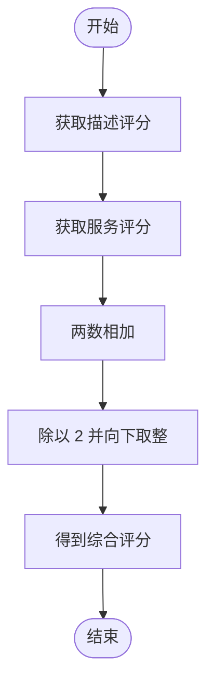
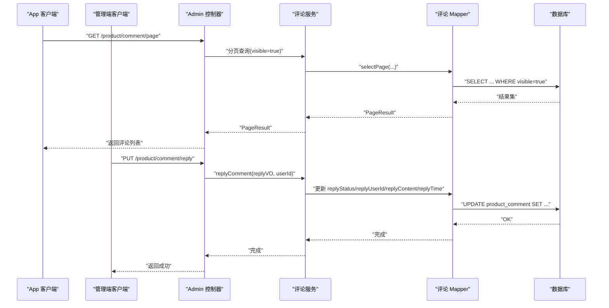
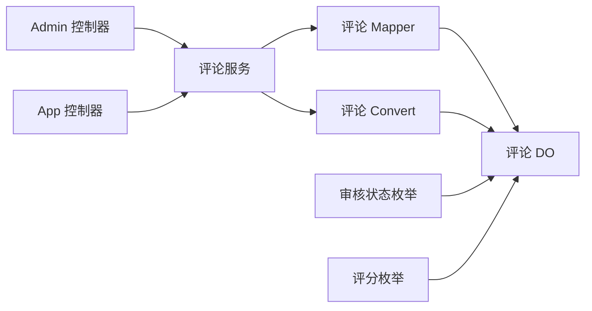

# 评论管理

<cite>
**本文引用的文件**
- [ProductCommentDO.java](file://qiji-module-mall/qiji-module-product/src/main/java/com.qiji.cps/module/product/dal/dataobject/comment/ProductCommentDO.java)
- [ProductCommentAuditStatusEnum.java](file://qiji-module-mall/qiji-module-product/src/main/java/com.qiji.cps/module/product/enums/comment/ProductCommentAuditStatusEnum.java)
- [ProductCommentScoresEnum.java](file://qiji-module-mall/qiji-module-product/src/main/java/com.qiji.cps/module/product/enums/comment/ProductCommentScoresEnum.java)
- [ProductCommentService.java](file://qiji-module-mall/qiji-module-product/src/main/java/com.qiji.cps/module/product/service/comment/ProductCommentService.java)
- [ProductCommentController.java](file://qiji-module-mall/qiji-module-product/src/main/java/com.qiji.cps/module/product/controller/admin/comment/ProductCommentController.java)
- [AppProductCommentController.java](file://qiji-module-mall/qiji-module-product/src/main/java/com.qiji.cps/module/product/controller/app/comment/AppProductCommentController.java)
- [ProductCommentMapper.java](file://qiji-module-mall/qiji-module-product/src/main/java/com.qiji.cps/module/product/dal/mysql/comment/ProductCommentMapper.java)
- [ProductCommentConvert.java](file://qiji-module-mall/qiji-module-product/src/main/java/com.qiji.cps/module/product/convert/comment/ProductCommentConvert.java)
- [ProductCommentApi.java](file://qiji-module-mall/qiji-module-product/src/main/java/com.qiji.cps/module/product/api/comment/ProductCommentApi.java)
- [ProductCommentCreateReqVO.java](file://qiji-module-mall/qiji-module-product/src/main/java/com.qiji.cps/module/product/controller/admin/comment/vo/ProductCommentCreateReqVO.java)
- [AppCommentPageReqVO.java](file://qiji-module-mall/qiji-module-product/src/main/java/com.qiji.cps/module/product/controller/app/comment/vo/AppCommentPageReqVO.java)
- [ProductCommentUpdateVisibleReqVO.java](file://qiji-module-mall/qiji-module-product/src/main/java/com.qiji.cps/module/product/controller/admin/comment/vo/ProductCommentUpdateVisibleReqVO.java)
</cite>

## 目录
1. [简介](#简介)
2. [项目结构](#项目结构)
3. [核心组件](#核心组件)
4. [架构总览](#架构总览)
5. [详细组件分析](#详细组件分析)
6. [依赖关系分析](#依赖关系分析)
7. [性能考量](#性能考量)
8. [故障排查指南](#故障排查指南)
9. [结论](#结论)
10. [附录](#附录)

## 简介
本技术文档围绕商品评论管理功能展开，系统性阐述评论的数据模型、审核机制、回复能力、统计指标、展示规则、搜索与筛选、举报与屏蔽、导出与分析，以及最佳实践与运营建议。评论是电商信任体系的重要基石，直接影响用户购买决策与品牌口碑，因此需要从数据一致性、安全性、可扩展性与可运营性多维度进行设计与实现。

## 项目结构
评论功能位于“商品模块”下，采用典型的分层架构：
- 控制器层：Admin 管理端与 App 用户端分别提供评论管理与展示接口
- 业务层：评论服务接口与实现负责评论生命周期管理
- 数据访问层：MyBatis Mapper 提供分页查询与条件过滤
- 数据模型层：评论 DO 定义字段与关联关系
- 转换层：Convert 统一 DTO/VO 与 DO 的映射逻辑
- 枚举层：评分与审核状态枚举统一语义

图表来源
- [ProductCommentController.java:20-62](file://qiji-module-mall/qiji-module-product/src/main/java/com.qiji.cps/module/product/controller/admin/comment/ProductCommentController.java#L20-L62)
- [AppProductCommentController.java:23-52](file://qiji-module-mall/qiji-module-product/src/main/java/com.qiji.cps/module/product/controller/app/comment/AppProductCommentController.java#L23-L52)
- [ProductCommentService.java:14-73](file://qiji-module-mall/qiji-module-product/src/main/java/com.qiji.cps/module/product/service/comment/ProductCommentService.java#L14-L73)
- [ProductCommentMapper.java:12-61](file://qiji-module-mall/qiji-module-product/src/main/java/com.qiji.cps/module/product/dal/mysql/comment/ProductCommentMapper.java#L12-L61)
- [ProductCommentDO.java:16-160](file://qiji-module-mall/qiji-module-product/src/main/java/com.qiji.cps/module/product/dal/dataobject/comment/ProductCommentDO.java#L16-L160)
- [ProductCommentAuditStatusEnum.java:9-39](file://qiji-module-mall/qiji-module-product/src/main/java/com.qiji.cps/module/product/enums/comment/ProductCommentAuditStatusEnum.java#L9-L39)
- [ProductCommentScoresEnum.java:9-41](file://qiji-module-mall/qiji-module-product/src/main/java/com.qiji.cps/module/product/enums/comment/ProductCommentScoresEnum.java#L9-L41)
- [ProductCommentConvert.java:16-63](file://qiji-module-mall/qiji-module-product/src/main/java/com.qiji.cps/module/product/convert/comment/ProductCommentConvert.java#L16-L63)
- [ProductCommentApi.java:5-21](file://qiji-module-mall/qiji-module-product/src/main/java/com.qiji.cps/module/product/api/comment/ProductCommentApi.java#L5-L21)

章节来源
- [ProductCommentController.java:20-62](file://qiji-module-mall/qiji-module-product/src/main/java/com.qiji.cps/module/product/controller/admin/comment/ProductCommentController.java#L20-L62)
- [AppProductCommentController.java:23-52](file://qiji-module-mall/qiji-module-product/src/main/java/com.qiji.cps/module/product/controller/app/comment/AppProductCommentController.java#L23-L52)
- [ProductCommentService.java:14-73](file://qiji-module-mall/qiji-module-product/src/main/java/com.qiji.cps/module/product/service/comment/ProductCommentService.java#L14-L73)
- [ProductCommentMapper.java:12-61](file://qiji-module-mall/qiji-module-product/src/main/java/com.qiji.cps/module/product/dal/mysql/comment/ProductCommentMapper.java#L12-L61)
- [ProductCommentDO.java:16-160](file://qiji-module-mall/qiji-module-product/src/main/java/com.qiji.cps/module/product/dal/dataobject/comment/ProductCommentDO.java#L16-L160)
- [ProductCommentAuditStatusEnum.java:9-39](file://qiji-module-mall/qiji-module-product/src/main/java/com.qiji.cps/module/product/enums/comment/ProductCommentAuditStatusEnum.java#L9-L39)
- [ProductCommentScoresEnum.java:9-41](file://qiji-module-mall/qiji-module-product/src/main/java/com.qiji.cps/module/product/enums/comment/ProductCommentScoresEnum.java#L9-L41)
- [ProductCommentConvert.java:16-63](file://qiji-module-mall/qiji-module-product/src/main/java/com.qiji.cps/module/product/convert/comment/ProductCommentConvert.java#L16-L63)
- [ProductCommentApi.java:5-21](file://qiji-module-mall/qiji-module-product/src/main/java/com.qiji.cps/module/product/api/comment/ProductCommentApi.java#L5-L21)

## 核心组件
- 数据模型 ProductCommentDO：定义评论的核心字段，包括用户信息、订单与商品关联、可见性、评分、图片、回复状态与内容等
- 服务接口 ProductCommentService：定义评论创建、可见性更新、商家回复、分页查询等能力
- 控制器 ProductCommentController 与 AppProductCommentController：分别面向管理端与用户端提供 REST 接口
- Mapper ProductCommentMapper：封装分页查询、条件过滤与 Tab 分类逻辑
- Convert ProductCommentConvert：统一 DTO/VO 到 DO 的映射与综合评分计算
- 枚举 ProductCommentAuditStatusEnum、ProductCommentScoresEnum：统一语义与取值范围

章节来源
- [ProductCommentDO.java:16-160](file://qiji-module-mall/qiji-module-product/src/main/java/com.qiji.cps/module/product/dal/dataobject/comment/ProductCommentDO.java#L16-L160)
- [ProductCommentService.java:14-73](file://qiji-module-mall/qiji-module-product/src/main/java/com.qiji.cps/module/product/service/comment/ProductCommentService.java#L14-L73)
- [ProductCommentController.java:20-62](file://qiji-module-mall/qiji-module-product/src/main/java/com.qiji.cps/module/product/controller/admin/comment/ProductCommentController.java#L20-L62)
- [AppProductCommentController.java:23-52](file://qiji-module-mall/qiji-module-product/src/main/java/com.qiji.cps/module/product/controller/app/comment/AppProductCommentController.java#L23-L52)
- [ProductCommentMapper.java:12-61](file://qiji-module-mall/qiji-module-product/src/main/java/com.qiji.cps/module/product/dal/mysql/comment/ProductCommentMapper.java#L12-L61)
- [ProductCommentConvert.java:16-63](file://qiji-module-mall/qiji-module-product/src/main/java/com.qiji.cps/module/product/convert/comment/ProductCommentConvert.java#L16-L63)
- [ProductCommentAuditStatusEnum.java:9-39](file://qiji-module-mall/qiji-module-product/src/main/java/com.qiji.cps/module/product/enums/comment/ProductCommentAuditStatusEnum.java#L9-L39)
- [ProductCommentScoresEnum.java:9-41](file://qiji-module-mall/qiji-module-product/src/main/java/com.qiji.cps/module/product/enums/comment/ProductCommentScoresEnum.java#L9-L41)

## 架构总览
评论系统遵循“控制器-服务-数据访问-数据模型”的分层设计，Admin 与 App 双端接口解耦，通过服务层聚合业务规则与数据映射，确保扩展与维护性。

图表来源
- [ProductCommentController.java:53-59](file://qiji-module-mall/qiji-module-product/src/main/java/com.qiji.cps/module/product/controller/admin/comment/ProductCommentController.java#L53-L59)
- [ProductCommentService.java:23-38](file://qiji-module-mall/qiji-module-product/src/main/java/com.qiji.cps/module/product/service/comment/ProductCommentService.java#L23-L38)
- [ProductCommentMapper.java:12-25](file://qiji-module-mall/qiji-module-product/src/main/java/com.qiji.cps/module/product/dal/mysql/comment/ProductCommentMapper.java#L12-L25)

## 详细组件分析

### 数据模型与字段定义
- 用户与匿名：userId、userNickname、userAvatar、anonymous
- 订单与商品：orderId、orderItemId、spuId、spuName、skuId、skuPicUrl、skuProperties
- 可见性与状态：visible、replyStatus、auditStatus（由枚举定义）
- 评分体系：descriptionScores、benefitScores、scores（综合评分）
- 内容与图片：content、picUrls
- 商家回复：replyUserId、replyContent、replyTime
- 时间与审计：创建/更新时间（继承基础 DO）

图表来源
- [ProductCommentDO.java:16-160](file://qiji-module-mall/qiji-module-product/src/main/java/com.qiji.cps/module/product/dal/dataobject/comment/ProductCommentDO.java#L16-L160)

章节来源
- [ProductCommentDO.java:16-160](file://qiji-module-mall/qiji-module-product/src/main/java/com.qiji.cps/module/product/dal/dataobject/comment/ProductCommentDO.java#L16-L160)

### 评分与审核机制
- 综合评分计算：descriptionScores 与 benefitScores 平均后向下取整得到 scores
- 星级枚举：1-5 星，便于前端渲染与筛选
- 审核状态枚举：待审核、审批通过、审批不通过，支持后续扩展如“自动审核”状态

图表来源
- [ProductCommentConvert.java:55-60](file://qiji-module-mall/qiji-module-product/src/main/java/com.qiji.cps/module/product/convert/comment/ProductCommentConvert.java#L55-L60)
- [ProductCommentScoresEnum.java:16-24](file://qiji-module-mall/qiji-module-product/src/main/java/com.qiji.cps/module/product/enums/comment/ProductCommentScoresEnum.java#L16-L24)

章节来源
- [ProductCommentConvert.java:55-60](file://qiji-module-mall/qiji-module-product/src/main/java/com.qiji.cps/module/product/convert/comment/ProductCommentConvert.java#L55-L60)
- [ProductCommentScoresEnum.java:16-24](file://qiji-module-mall/qiji-module-product/src/main/java/com.qiji.cps/module/product/enums/comment/ProductCommentScoresEnum.java#L16-L24)
- [ProductCommentAuditStatusEnum.java:16-20](file://qiji-module-mall/qiji-module-product/src/main/java/com.qiji.cps/module/product/enums/comment/ProductCommentAuditStatusEnum.java#L16-L20)

### 回复功能与交互
- 商家回复：Admin 登录后调用回复接口，设置 replyUserId、replyContent、replyTime，并标记 replyStatus
- 匿名用户展示：App 端在返回前将匿名评论的 userNickname 替换为默认匿名昵称，保护隐私
- 交互流程：管理员提交回复 → 服务层持久化 → 控制器返回成功

图表来源
- [AppProductCommentController.java:32-49](file://qiji-module-mall/qiji-module-product/src/main/java/com.qiji.cps/module/product/controller/app/comment/AppProductCommentController.java#L32-L49)
- [ProductCommentController.java:45-51](file://qiji-module-mall/qiji-module-product/src/main/java/com.qiji.cps/module/product/controller/admin/comment/ProductCommentController.java#L45-L51)
- [ProductCommentMapper.java:43-52](file://qiji-module-mall/qiji-module-product/src/main/java/com.qiji.cps/module/product/dal/mysql/comment/ProductCommentMapper.java#L43-L52)

章节来源
- [AppProductCommentController.java:32-49](file://qiji-module-mall/qiji-module-product/src/main/java/com.qiji.cps/module/product/controller/app/comment/AppProductCommentController.java#L32-L49)
- [ProductCommentController.java:45-51](file://qiji-module-mall/qiji-module-product/src/main/java/com.qiji.cps/module/product/controller/admin/comment/ProductCommentController.java#L45-L51)
- [ProductCommentMapper.java:43-52](file://qiji-module-mall/qiji-module-product/src/main/java/com.qiji.cps/module/product/dal/mysql/comment/ProductCommentMapper.java#L43-L52)

### 展示规则与排序
- 管理端：支持按用户昵称、订单号、SPU 编号、评分、回复状态、时间区间、SPU 名称等条件分页查询
- App 端：按 spuId 与 visible=true 查询，支持按全部/好评/中评/差评的 Tab 过滤；默认按创建时间倒序
- 匿名处理：若 anonymous=true，则返回时替换为默认匿名昵称

章节来源
- [ProductCommentMapper.java:15-25](file://qiji-module-mall/qiji-module-product/src/main/java/com.qiji.cps/module/product/dal/mysql/comment/ProductCommentMapper.java#L15-L25)
- [ProductCommentMapper.java:27-41](file://qiji-module-mall/qiji-module-product/src/main/java/com.qiji.cps/module/product/dal/mysql/comment/ProductCommentMapper.java#L27-L41)
- [AppProductCommentPageReqVO.java:11-38](file://qiji-module-mall/qiji-module-product/src/main/java/com.qiji.cps/module/product/controller/app/comment/vo/AppCommentPageReqVO.java#L11-L38)
- [AppProductCommentController.java:32-49](file://qiji-module-mall/qiji-module-product/src/main/java/com.qiji.cps/module/product/controller/app/comment/AppProductCommentController.java#L32-L49)

### 搜索与筛选
- 管理端：支持多维条件过滤（用户昵称模糊匹配、订单号/SPU 精确匹配、评分精确匹配、回复状态、时间区间、SPU 名称模糊匹配），并按主键降序
- App 端：按 spuId 与 visible=true，结合 Tab 类型构建区间查询（>=4、[3,4)、<3）

章节来源
- [ProductCommentMapper.java:15-25](file://qiji-module-mall/qiji-module-product/src/main/java/com.qiji.cps/module/product/dal/mysql/comment/ProductCommentMapper.java#L15-L25)
- [ProductCommentMapper.java:27-41](file://qiji-module-mall/qiji-module-product/src/main/java/com.qiji.cps/module/product/dal/mysql/comment/ProductCommentMapper.java#L27-L41)
- [AppCommentPageReqVO.java:11-38](file://qiji-module-mall/qiji-module-product/src/main/java/com.qiji.cps/module/product/controller/app/comment/vo/AppCommentPageReqVO.java#L11-L38)

### 审核与可见性管理
- 可见性开关：Admin 可将某条评论设为可见或隐藏，影响 App 端默认展示
- 审核状态：提供“待审核/通过/不通过”状态枚举，便于接入自动化审核策略（如关键词过滤、重复内容检测等）

章节来源
- [ProductCommentUpdateVisibleReqVO.java:12-22](file://qiji-module-mall/qiji-module-product/src/main/java/com.qiji.cps/module/product/controller/admin/comment/vo/ProductCommentUpdateVisibleReqVO.java#L12-L22)
- [ProductCommentController.java:37-43](file://qiji-module-mall/qiji-module-product/src/main/java/com.qiji.cps/module/product/controller/admin/comment/ProductCommentController.java#L37-L43)
- [ProductCommentAuditStatusEnum.java:16-20](file://qiji-module-mall/qiji-module-product/src/main/java/com.qiji.cps/module/product/enums/comment/ProductCommentAuditStatusEnum.java#L16-L20)

### 统计功能
- 商品平均评分：基于评论表的 scores 字段聚合计算
- 评论数量：按 spuId 分组统计总数
- 好评率：统计 scores>=4 的占比
- 服务与描述评分：可单独统计 descriptionScores、benefitScores 的分布与均值
- 建议：在 Mapper 或 Service 层新增聚合查询方法，或通过定时任务落库到统计表，减少实时查询压力

章节来源
- [ProductCommentDO.java:114-130](file://qiji-module-mall/qiji-module-product/src/main/java/com.qiji.cps/module/product/dal/dataobject/comment/ProductCommentDO.java#L114-L130)
- [ProductCommentMapper.java:15-25](file://qiji-module-mall/qiji-module-product/src/main/java/com.qiji.cps/module/product/dal/mysql/comment/ProductCommentMapper.java#L15-L25)

### 导出与分析
- 导出：支持按条件导出评论明细（含评分、图片、回复、时间等），便于人工复核与运营分析
- 分析：结合销售与营销活动，评估评论对转化的影响；识别异常高分/低分集中区域，辅助供应链与客服优化
- 建议：提供批量导出接口与报表视图，支持 CSV/Excel 下载

章节来源
- [ProductCommentMapper.java:15-25](file://qiji-module-mall/qiji-module-product/src/main/java/com.qiji.cps/module/product/dal/mysql/comment/ProductCommentMapper.java#L15-L25)
- [ProductCommentController.java:29-35](file://qiji-module-mall/qiji-module-product/src/main/java/com.qiji.cps/module/product/controller/admin/comment/ProductCommentController.java#L29-L35)

### 举报与屏蔽
- 举报：可在 App 端提交举报，服务端记录举报信息并调整可见性或加入黑名单
- 屏蔽：对违规用户或商品的评论进行屏蔽，避免影响其他用户
- 建议：引入“举报-审核-处置”闭环，支持自动规则（敏感词、频率阈值）与人工复核

章节来源
- [ProductCommentDO.java:106-112](file://qiji-module-mall/qiji-module-product/src/main/java/com.qiji.cps/module/product/dal/dataobject/comment/ProductCommentDO.java#L106-L112)
- [ProductCommentUpdateVisibleReqVO.java:12-22](file://qiji-module-mall/qiji-module-product/src/main/java/com.qiji.cps/module/product/controller/admin/comment/vo/ProductCommentUpdateVisibleReqVO.java#L12-L22)

### 最佳实践与运营建议
- 评分设计：统一使用综合评分，避免单一维度误导；提供服务与描述评分的可视化对比
- 审核策略：默认隐藏新评论，结合关键词与重复度规则进行自动初审，人工复核高风险
- 匿名保护：默认匿名展示，尊重用户隐私；仅在必要时展示真实昵称
- 互动引导：鼓励带图评价与追评，提升内容质量；对优质评论给予流量倾斜
- 数据治理：定期清理无效/重复/恶意内容；建立黑灰名单与风控策略

## 依赖关系分析
- 控制器依赖服务接口，保证业务逻辑集中与可测试
- 服务层依赖 Mapper 与 Convert，统一数据映射与业务规则
- Mapper 依赖 DO 与 VO/DTO，承担查询与条件拼装
- 枚举与 Convert 提供语义化与计算逻辑，降低重复代码

图表来源
- [ProductCommentController.java:20-62](file://qiji-module-mall/qiji-module-product/src/main/java/com.qiji.cps/module/product/controller/admin/comment/ProductCommentController.java#L20-L62)
- [AppProductCommentController.java:23-52](file://qiji-module-mall/qiji-module-product/src/main/java/com.qiji.cps/module/product/controller/app/comment/AppProductCommentController.java#L23-L52)
- [ProductCommentService.java:14-73](file://qiji-module-mall/qiji-module-product/src/main/java/com.qiji.cps/module/product/service/comment/ProductCommentService.java#L14-L73)
- [ProductCommentMapper.java:12-61](file://qiji-module-mall/qiji-module-product/src/main/java/com.qiji.cps/module/product/dal/mysql/comment/ProductCommentMapper.java#L12-L61)
- [ProductCommentConvert.java:16-63](file://qiji-module-mall/qiji-module-product/src/main/java/com.qiji.cps/module/product/convert/comment/ProductCommentConvert.java#L16-L63)
- [ProductCommentDO.java:16-160](file://qiji-module-mall/qiji-module-product/src/main/java/com.qiji.cps/module/product/dal/dataobject/comment/ProductCommentDO.java#L16-L160)
- [ProductCommentAuditStatusEnum.java:9-39](file://qiji-module-mall/qiji-module-product/src/main/java/com.qiji.cps/module/product/enums/comment/ProductCommentAuditStatusEnum.java#L9-L39)
- [ProductCommentScoresEnum.java:9-41](file://qiji-module-mall/qiji-module-product/src/main/java/com.qiji.cps/module/product/enums/comment/ProductCommentScoresEnum.java#L9-L41)

章节来源
- [ProductCommentController.java:20-62](file://qiji-module-mall/qiji-module-product/src/main/java/com.qiji.cps/module/product/controller/admin/comment/ProductCommentController.java#L20-L62)
- [AppProductCommentController.java:23-52](file://qiji-module-mall/qiji-module-product/src/main/java/com.qiji.cps/module/product/controller/app/comment/AppProductCommentController.java#L23-L52)
- [ProductCommentService.java:14-73](file://qiji-module-mall/qiji-module-product/src/main/java/com.qiji.cps/module/product/service/comment/ProductCommentService.java#L14-L73)
- [ProductCommentMapper.java:12-61](file://qiji-module-mall/qiji-module-product/src/main/java/com.qiji.cps/module/product/dal/mysql/comment/ProductCommentMapper.java#L12-L61)
- [ProductCommentConvert.java:16-63](file://qiji-module-mall/qiji-module-product/src/main/java/com.qiji.cps/module/product/convert/comment/ProductCommentConvert.java#L16-L63)
- [ProductCommentDO.java:16-160](file://qiji-module-mall/qiji-module-product/src/main/java/com.qiji.cps/module/product/dal/dataobject/comment/ProductCommentDO.java#L16-L160)
- [ProductCommentAuditStatusEnum.java:9-39](file://qiji-module-mall/qiji-module-product/src/main/java/com.qiji.cps/module/product/enums/comment/ProductCommentAuditStatusEnum.java#L9-L39)
- [ProductCommentScoresEnum.java:9-41](file://qiji-module-mall/qiji-module-product/src/main/java/com.qiji.cps/module/product/enums/comment/ProductCommentScoresEnum.java#L9-L41)

## 性能考量
- 分页查询：优先使用索引字段（如 spuId、orderId、orderItemId、visible、scores、replyStatus、createTime）进行过滤与排序
- JSON 字段：picUrls 与 skuProperties 使用 JSON 序列化，注意查询时避免全表扫描，必要时增加虚拟列或物化索引
- 统计聚合：高频统计建议异步落库或缓存，避免热点商品在大促期间产生查询压力
- 匿名处理：在返回前统一替换匿名昵称，避免多次 IO 与字符串处理

## 故障排查指南
- 无法创建评论：检查必填字段（用户、订单项、SKU、评分、内容、图片数量限制）
- 评论不可见：确认 visible=true 且未被屏蔽；检查审核状态与权限
- 评分异常：确认 descriptionScores 与 benefitScores 的取值范围与综合评分计算逻辑
- 回复失败：确认登录用户具备相应权限，replyUserId、replyContent、replyTime 是否正确更新
- 分页查询无结果：确认条件是否过严（如 spuId、visible、Tab 类型），逐步放宽条件定位问题

章节来源
- [ProductCommentCreateReqVO.java:12-49](file://qiji-module-mall/qiji-module-product/src/main/java/com.qiji.cps/module/product/controller/admin/comment/vo/ProductCommentCreateReqVO.java#L12-L49)
- [ProductCommentController.java:37-51](file://qiji-module-mall/qiji-module-product/src/main/java/com.qiji.cps/module/product/controller/admin/comment/ProductCommentController.java#L37-L51)
- [ProductCommentMapper.java:15-25](file://qiji-module-mall/qiji-module-product/src/main/java/com.qiji.cps/module/product/dal/mysql/comment/ProductCommentMapper.java#L15-L25)
- [AppProductCommentController.java:32-49](file://qiji-module-mall/qiji-module-product/src/main/java/com.qiji.cps/module/product/controller/app/comment/AppProductCommentController.java#L32-L49)

## 结论
评论管理功能通过清晰的分层设计与完善的枚举/转换/映射机制，实现了从数据模型到业务流程的完整闭环。结合可见性、审核、回复、统计与导出能力，能够有效支撑电商业务的信任体系建设与运营优化。建议持续完善自动化审核与风控策略，提升系统稳定性与用户体验。

## 附录
- API 一览
  - 管理端
    - GET /product/comment/page：分页查询评论
    - PUT /product/comment/update-visible：修改评论可见性
    - PUT /product/comment/reply：商家回复
    - POST /product/comment/create：后台创建评论
  - App 端
    - GET /product/comment/page：分页查询评论（默认 visible=true）

章节来源
- [ProductCommentController.java:29-59](file://qiji-module-mall/qiji-module-product/src/main/java/com.qiji.cps/module/product/controller/admin/comment/ProductCommentController.java#L29-L59)
- [AppProductCommentController.java:32-49](file://qiji-module-mall/qiji-module-product/src/main/java/com.qiji.cps/module/product/controller/app/comment/AppProductCommentController.java#L32-L49)
- [ProductCommentApi.java:10-21](file://qiji-module-mall/qiji-module-product/src/main/java/com.qiji.cps/module/product/api/comment/ProductCommentApi.java#L10-L21)