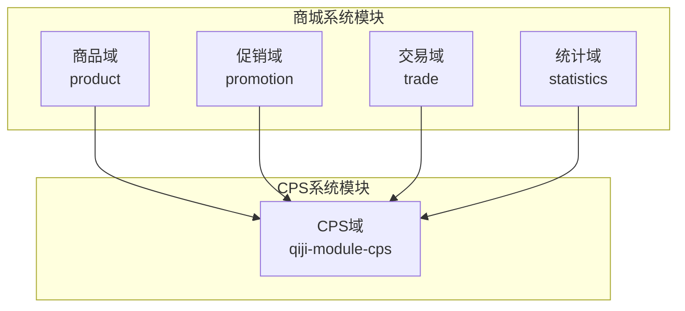
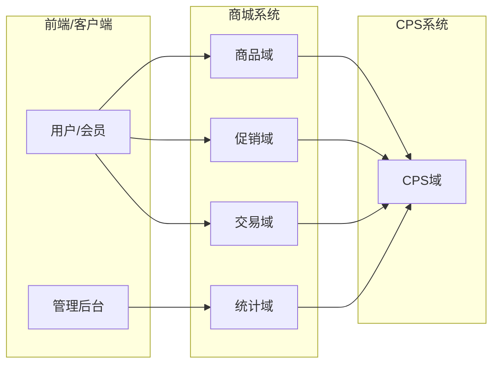
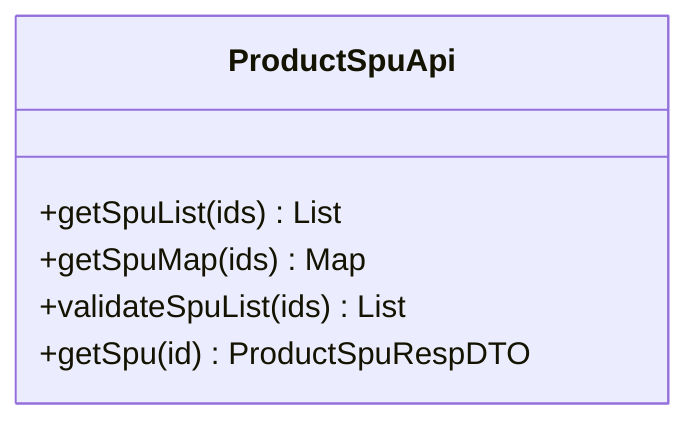
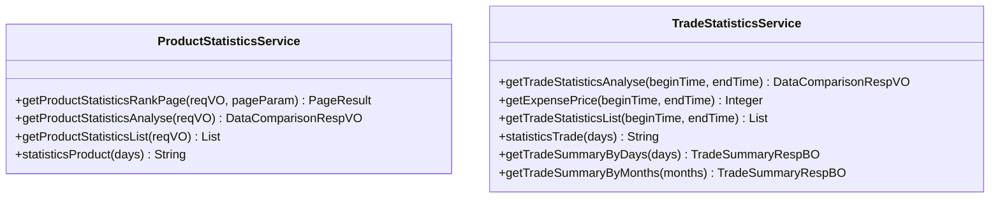
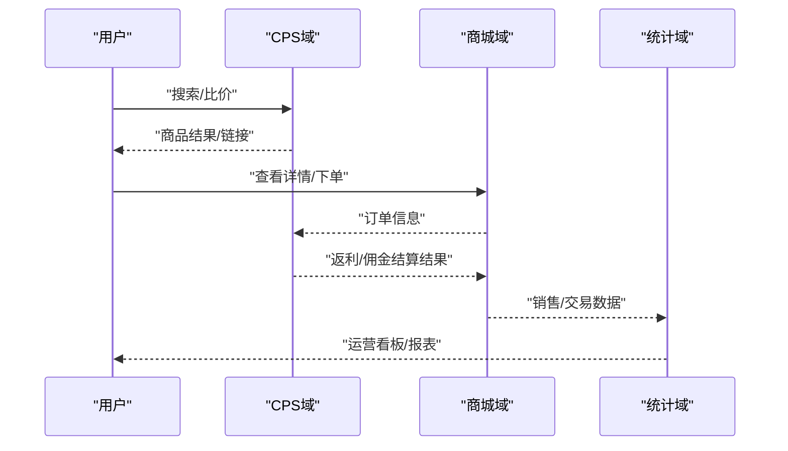
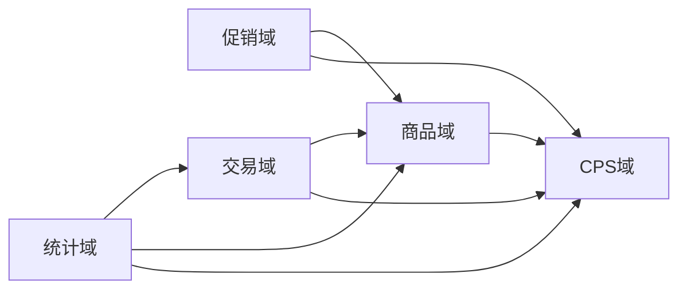

# 商城系统模块

<cite>
**本文引用的文件**
- [README.md](file://README.md)
- [ruoyi-vue-pro-mall-2025-05-12.sql](file://sql/module/ruoyi-vue-pro-mall-2025-05-12.sql)
- [ProductSpuApi.java](file://qiji-module-mall/qiji-module-product/src/main/java/com.qiji.cps/module/product/api/spu/ProductSpuApi.java)
- [ProductStatisticsService.java](file://qiji-module-mall/qiji-module-statistics/src/main/java/com.qiji.cps/module/statistics/service/product/ProductStatisticsService.java)
- [TradeStatisticsService.java](file://qiji-module-mall/qiji-module-statistics/src/main/java/com.qiji.cps/module/statistics/service/trade/TradeStatisticsService.java)
</cite>

## 目录
1. [引言](#引言)
2. [项目结构](#项目结构)
3. [核心组件](#核心组件)
4. [架构总览](#架构总览)
5. [详细组件分析](#详细组件分析)
6. [依赖分析](#依赖分析)
7. [性能考虑](#性能考虑)
8. [故障排除指南](#故障排除指南)
9. [结论](#结论)
10. [附录](#附录)

## 引言
本文件面向AgenticCPS系统中的商城系统模块，系统性阐述其在整体架构中的重要地位与职责边界。商城系统模块由商品、促销、交易、统计分析四大子域构成，围绕SPU/SKU商品模型、多平台CPS返利闭环、订单与售后流转、以及多维度销售与用户行为分析展开。本文将结合模块化代码接口与数据库脚本，给出架构视图、关键流程图与扩展机制说明，帮助开发者与产品人员快速理解并高效落地。

## 项目结构
商城系统模块位于qiji-module-mall目录下，按业务域拆分为四个子模块：
- 商品域（product）：负责商品SPU/SKU、品牌、分类、属性、浏览历史等
- 促销域（promotion）：负责满减、折扣、拼团、秒杀等营销活动
- 交易域（trade）：负责订单、发货、售后、佣金结算等交易生命周期
- 统计域（statistics）：负责销售、用户、商品表现等多维分析

章节来源
- [README.md:149-192](file://README.md#L149-L192)

## 核心组件
- 商品SPU接口：提供批量查询、校验与映射能力，支撑促销与交易域对商品信息的统一调用
- 商品统计服务：提供商品销量、转化、对比分析等接口，支撑运营决策
- 交易统计服务：提供交易趋势、费用、明细与周期汇总，支撑财务与运营分析

章节来源
- [ProductSpuApi.java:17-56](file://qiji-module-mall/qiji-module-product/src/main/java/com.qiji.cps/module/product/api/spu/ProductSpuApi.java#L17-L56)
- [ProductStatisticsService.java:17-50](file://qiji-module-mall/qiji-module-statistics/src/main/java/com.qiji.cps/module/statistics/service/product/ProductStatisticsService.java#L17-L50)
- [TradeStatisticsService.java:16-67](file://qiji-module-mall/qiji-module-statistics/src/main/java/com.qiji.cps/module/statistics/service/trade/TradeStatisticsService.java#L16-L67)

## 架构总览
商城系统与CPS返利系统通过统一的API契约与数据模型协同工作。商品域提供SPU/SKU信息，促销域提供营销活动规则，交易域承载订单与佣金结算，统计域产出销售与用户行为分析，CPS域则负责跨平台商品查询、推广链接生成、订单归因与返利结算。

## 详细组件分析

### 商品管理域（Product）
- 职责边界：商品SPU/SKU、品牌、分类、属性、浏览历史等
- 关键接口：SPU批量查询、校验与映射
- 数据模型：参考数据库脚本中的商品相关表结构

图表来源
- [ProductSpuApi.java:17-56](file://qiji-module-mall/qiji-module-product/src/main/java/com.qiji.cps/module/product/api/spu/ProductSpuApi.java#L17-L56)

章节来源
- [ProductSpuApi.java:17-56](file://qiji-module-mall/qiji-module-product/src/main/java/com.qiji.cps/module/product/api/spu/ProductSpuApi.java#L17-L56)

### 促销管理域（Promotion）
- 职责边界：满减、折扣、拼团、秒杀等营销活动的规则与执行
- 与CPS协作：促销活动与推广链接生成、订单归因联动
- 与交易域协作：促销规则应用于订单计算与优惠核销

[本节为概念性说明，不直接分析具体文件]

### 交易管理域（Trade）
- 职责边界：订单生命周期、发货物流、售后退换、佣金结算
- 与CPS协作：订单归因、佣金计算、返利结算
- 与统计域协作：交易趋势、费用、明细分析

[本节为概念性说明，不直接分析具体文件]

### 统计分析域（Statistics）
- 职责边界：销售数据、用户行为、商品表现等多维度分析
- 商品统计：排行榜、对比分析、明细与周期统计
- 交易统计：趋势对比、费用统计、明细与周期汇总

图表来源
- [ProductStatisticsService.java:17-50](file://qiji-module-mall/qiji-module-statistics/src/main/java/com.qiji.cps/module/statistics/service/product/ProductStatisticsService.java#L17-L50)
- [TradeStatisticsService.java:16-67](file://qiji-module-mall/qiji-module-statistics/src/main/java/com.qiji.cps/module/statistics/service/trade/TradeStatisticsService.java#L16-L67)

章节来源
- [ProductStatisticsService.java:17-50](file://qiji-module-mall/qiji-module-statistics/src/main/java/com.qiji.cps/module/statistics/service/product/ProductStatisticsService.java#L17-L50)
- [TradeStatisticsService.java:16-67](file://qiji-module-mall/qiji-module-statistics/src/main/java/com.qiji.cps/module/statistics/service/trade/TradeStatisticsService.java#L16-L67)

### 商城系统与CPS返利系统的集成
- 商品查询与比价：CPS域统一接入多平台商品数据，商城域提供SPU/SKU信息支撑前端展示与下单
- 推广链接生成：CPS域生成带推广位的链接，商城域提供商品详情与SKU信息
- 订单归因与返利：交易域产生订单，CPS域进行订单归因与返利结算，统计域产出运营看板

章节来源
- [README.md:176-233](file://README.md#L176-L233)

### 商城系统的扩展机制
- 多店铺/多品牌/多平台：通过租户隔离与平台编码扩展，支持多租户与多平台商品与订单
- 促销活动扩展：通过策略模式与规则引擎，支持灵活的满减、折扣、拼团、秒杀等营销活动
- 统计分析扩展：通过指标抽象与时间维度聚合，支持销售、用户、商品等多维分析

章节来源
- [ruoyi-vue-pro-mall-2025-05-12.sql:21-72](file://sql/module/ruoyi-vue-pro-mall-2025-05-12.sql#L21-L72)

## 依赖分析
- 商品域依赖CPS域提供的商品查询与链接生成能力
- 促销域与交易域共同依赖商品域的SPU/SKU信息
- 统计域依赖交易域与商品域的数据进行分析
- CPS域作为外部系统，与商城域通过API契约解耦

## 性能考虑
- 缓存策略：热点商品SPU/SKU与促销规则缓存，降低数据库压力
- 数据库优化：合理索引（如商品浏览历史表的用户与SPU索引），分页与排序字段优化
- CDN加速：静态资源与图片CDN，缩短用户访问延迟
- 异步处理：订单结算与统计分析异步化，避免阻塞主流程

[本节为通用指导，不直接分析具体文件]

## 故障排除指南
- 商品查询异常：检查CPS域商品接口连通性与缓存命中率
- 促销规则不生效：核对促销活动状态、时间窗口与商品匹配规则
- 订单返利异常：核对推广位PID、订单归因日志与结算周期
- 统计数据偏差：核对统计任务执行时间、时间维度与聚合逻辑

[本节为通用指导，不直接分析具体文件]

## 结论
商城系统模块在AgenticCPS中承担“商品、促销、交易、统计”的核心职责，通过清晰的模块边界与API契约，与CPS域形成高效的协同闭环。依托多租户、多平台与多维统计能力，系统能够支撑复杂的电商业务场景，并为运营与财务提供可靠的数据支撑。

## 附录
- 数据库脚本：包含商品品牌、浏览历史等核心表结构，建议在部署时优先初始化
- 接口清单：商品SPU查询、商品统计、交易统计等接口，便于前后端联调

章节来源
- [ruoyi-vue-pro-mall-2025-05-12.sql:21-72](file://sql/module/ruoyi-vue-pro-mall-2025-05-12.sql#L21-L72)
- [ProductSpuApi.java:17-56](file://qiji-module-mall/qiji-module-product/src/main/java/com.qiji.cps/module/product/api/spu/ProductSpuApi.java#L17-L56)
- [ProductStatisticsService.java:17-50](file://qiji-module-mall/qiji-module-statistics/src/main/java/com.qiji.cps/module/statistics/service/product/ProductStatisticsService.java#L17-L50)
- [TradeStatisticsService.java:16-67](file://qiji-module-mall/qiji-module-statistics/src/main/java/com.qiji.cps/module/statistics/service/trade/TradeStatisticsService.java#L16-L67)