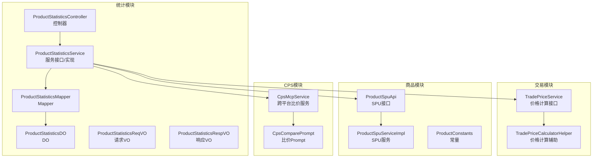
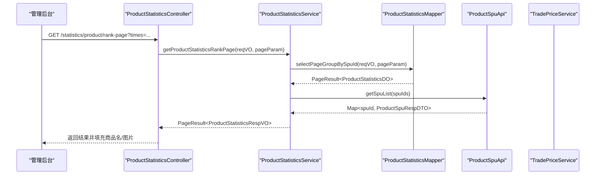
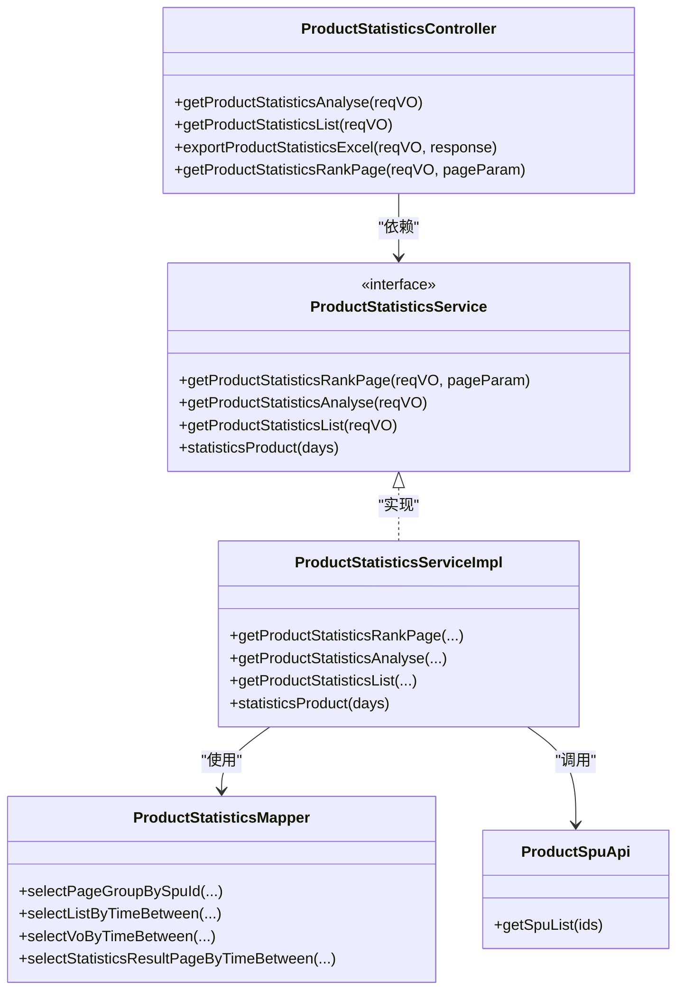
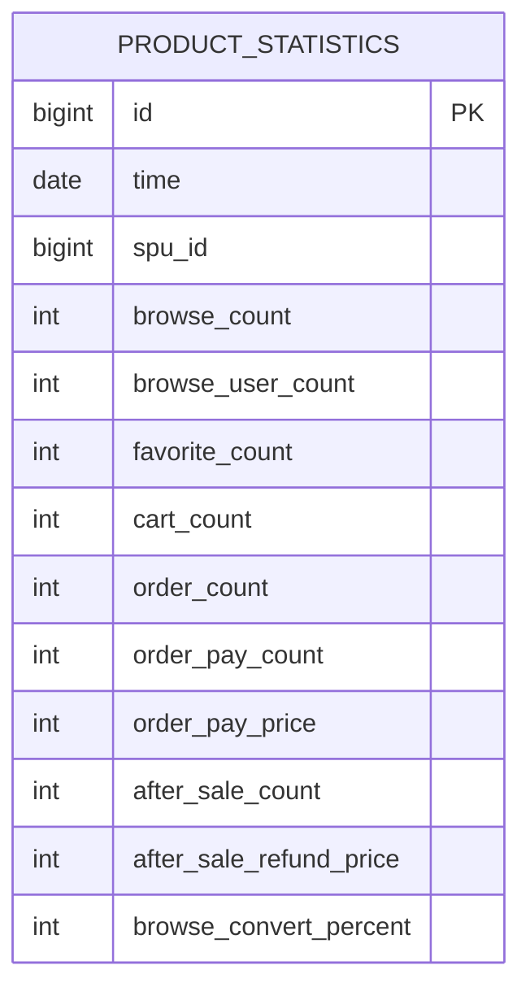
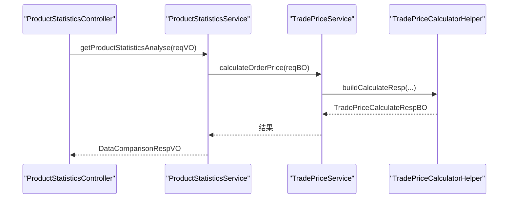
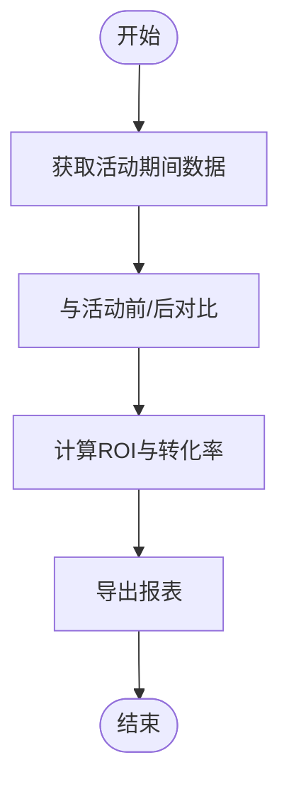
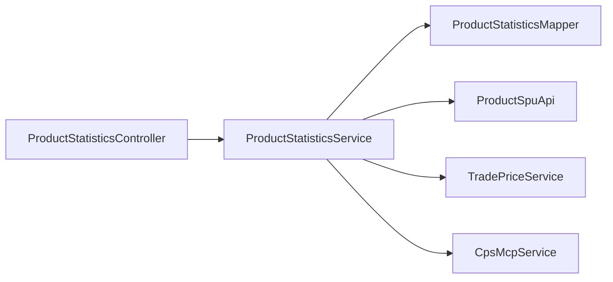

# 商品统计分析

<cite>
**本文引用的文件**
- [ProductStatisticsController.java](file://qiji-module-mall/qiji-module-statistics/src/main/java/com.qiji.cps/module/statistics/controller/admin/product/ProductStatisticsController.java)
- [ProductStatisticsService.java](file://qiji-module-mall/qiji-module-statistics/src/main/java/com.qiji.cps/module/statistics/service/product/ProductStatisticsService.java)
- [ProductStatisticsServiceImpl.java](file://qiji-module-mall/qiji-module-statistics/src/main/java/com.qiji.cps/module/statistics/service/product/ProductStatisticsServiceImpl.java)
- [ProductStatisticsMapper.java](file://qiji-module-mall/qiji-module-statistics/src/main/java/com.qiji.cps/module/statistics/dal/mysql/product/ProductStatisticsMapper.java)
- [ProductStatisticsDO.java](file://qiji-module-mall/qiji-module-statistics/src/main/java/com.qiji.cps/module/statistics/dal/dataobject/product/ProductStatisticsDO.java)
- [ProductStatisticsReqVO.java](file://qiji-module-mall/qiji-module-statistics/src/main/java/com.qiji.cps/module/statistics/controller/admin/product/vo/ProductStatisticsReqVO.java)
- [ProductStatisticsRespVO.java](file://qiji-module-mall/qiji-module-statistics/src/main/java/com.qiji.cps/module/statistics/controller/admin/product/vo/ProductStatisticsRespVO.java)
- [TradeOrderStatisticsServiceImpl.java](file://qiji-module-mall/qiji-module-statistics/src/main/java/com.qiji.cps/module/statistics/service/trade/TradeOrderStatisticsServiceImpl.java)
- [TradePriceService.java](file://qiji-module-mall/qiji-module-trade/src/main/java/com.qiji.cps/module/trade/service/price/TradePriceService.java)
- [TradePriceCalculatorHelper.java](file://qiji-module-mall/qiji-module-trade/src/main/java/com.qiji.cps/module/trade/service/price/calculator/TradePriceCalculatorHelper.java)
- [ProductSpuApi.java](file://qiji-module-mall/qiji-module-product/api/src/main/java/com.qiji.cps/module/product/api/spu/ProductSpuApi.java)
- [ProductSpuServiceImpl.java](file://qiji-module-mall/qiji-module-product/src/main/java/com.qiji.cps/module/product/service/spu/ProductSpuServiceImpl.java)
- [ProductConstants.java](file://qiji-module-mall/qiji-module-product/src/main/java/com.qiji.cps/module/product/enums/ProductConstants.java)
- [CpsMcpService.java](file://qiji-module-cps/qiji-module-cps-biz/src/main/java/cn/zhijian/cps/mcp/CpsMcpService.java)
- [CpsComparePrompt.java](file://qiji-module-cps/qiji-module-cps-biz/src/main/java/cn/zhijian/cps/mcp/prompt/CpsComparePrompt.java)
- [CPS系统PRD文档.md](file://docs/CPS系统PRD文档.md)
</cite>

## 目录
1. [引言](#引言)
2. [项目结构](#项目结构)
3. [核心组件](#核心组件)
4. [架构总览](#架构总览)
5. [详细组件分析](#详细组件分析)
6. [依赖分析](#依赖分析)
7. [性能考虑](#性能考虑)
8. [故障排查指南](#故障排查指南)
9. [结论](#结论)
10. [附录](#附录)

## 引言
本技术文档围绕“商品统计分析”能力，系统梳理了商品销售数据统计的核心算法与实现机制，覆盖销量、库存、价格趋势、品类分析、表现评估、关联分析、生命周期、营销效果与实时性保障等方面。基于现有代码库中的商品统计模块、交易与价格计算模块、商品与库存模块以及CPS跨平台比价模块，给出可落地的实现路径与扩展建议。

## 项目结构
商品统计分析功能主要分布在以下模块：
- statistics 模块：提供商品统计的控制器、服务、数据对象与持久层，支持按时间维度聚合、排行榜分页、导出等。
- trade 模块：提供价格计算能力，支撑价格趋势与策略分析。
- product 模块：提供商品基础数据与库存状态，支撑库存分析与健康度评估。
- cps 模块：提供跨平台比价与链接生成能力，支撑价格对比与营销效果分析。

**图表来源**
- [ProductStatisticsController.java:1-87](file://qiji-module-mall/qiji-module-statistics/src/main/java/com.qiji.cps/module/statistics/controller/admin/product/ProductStatisticsController.java#L1-L87)
- [ProductStatisticsService.java:1-51](file://qiji-module-mall/qiji-module-statistics/src/main/java/com.qiji.cps/module/statistics/service/product/ProductStatisticsService.java#L1-L51)
- [ProductStatisticsServiceImpl.java](file://qiji-module-mall/qiji-module-statistics/src/main/java/com.qiji.cps/module/statistics/service/product/ProductStatisticsServiceImpl.java)
- [ProductStatisticsMapper.java:1-82](file://qiji-module-mall/qiji-module-statistics/src/main/java/com.qiji.cps/module/statistics/dal/mysql/product/ProductStatisticsMapper.java#L1-L82)
- [ProductStatisticsDO.java:1-80](file://qiji-module-mall/qiji-module-statistics/src/main/java/com.qiji.cps/module/statistics/dal/dataobject/product/ProductStatisticsDO.java#L1-L80)
- [ProductStatisticsReqVO.java:1-25](file://qiji-module-mall/qiji-module-statistics/src/main/java/com.qiji.cps/module/statistics/controller/admin/product/vo/ProductStatisticsReqVO.java#L1-L25)
- [ProductStatisticsRespVO.java:1-82](file://qiji-module-mall/qiji-module-statistics/src/main/java/com.qiji.cps/module/statistics/controller/admin/product/vo/ProductStatisticsRespVO.java#L1-L82)
- [TradePriceService.java:1-34](file://qiji-module-mall/qiji-module-trade/src/main/java/com.qiji.cps/module/trade/service/price/TradePriceService.java#L1-L34)
- [TradePriceCalculatorHelper.java:1-31](file://qiji-module-mall/qiji-module-trade/src/main/java/com.qiji.cps/module/trade/service/price/calculator/TradePriceCalculatorHelper.java#L1-L31)
- [ProductSpuApi.java](file://qiji-module-mall/qiji-module-product/api/src/main/java/com.qiji.cps/module/product/api/spu/ProductSpuApi.java)
- [ProductSpuServiceImpl.java:267-284](file://qiji-module-mall/qiji-module-product/src/main/java/com.qiji.cps/module/product/service/spu/ProductSpuServiceImpl.java#L267-L284)
- [ProductConstants.java:1-15](file://qiji-module-mall/qiji-module-product/src/main/java/com.qiji.cps/module/product/enums/ProductConstants.java#L1-L15)
- [CpsMcpService.java:90-176](file://qiji-module-cps/qiji-module-cps-biz/src/main/java/cn/zhijian/cps/mcp/CpsMcpService.java#L90-L176)
- [CpsComparePrompt.java:1-38](file://qiji-module-cps/qiji-module-cps-biz/src/main/java/cn/zhijian/cps/mcp/prompt/CpsComparePrompt.java#L1-L38)

**章节来源**
- [ProductStatisticsController.java:1-87](file://qiji-module-mall/qiji-module-statistics/src/main/java/com.qiji.cps/module/statistics/controller/admin/product/ProductStatisticsController.java#L1-L87)
- [ProductStatisticsMapper.java:1-82](file://qiji-module-mall/qiji-module-statistics/src/main/java/com.qiji.cps/module/statistics/dal/mysql/product/ProductStatisticsMapper.java#L1-L82)

## 核心组件
- 控制器：提供“统计分析”“明细列表”“排行榜分页”“导出Excel”等接口，负责参数接收、权限控制与结果封装。
- 服务接口与实现：定义统计排行榜、分析、明细与定时统计方法，并在实现中组织聚合查询与商品信息补充。
- 数据对象与映射：定义统计DO、请求/响应VO，Mapper负责按时间维度聚合与分组。
- 交易与价格：提供价格计算能力，支撑价格趋势与策略分析。
- 商品与库存：提供SPU信息与库存状态，支撑库存分析与健康度评估。
- CPS跨平台比价：提供多平台比价与链接生成，支撑价格对比与营销效果分析。

**章节来源**
- [ProductStatisticsService.java:1-51](file://qiji-module-mall/qiji-module-statistics/src/main/java/com.qiji.cps/module/statistics/service/product/ProductStatisticsService.java#L1-L51)
- [ProductStatisticsDO.java:1-80](file://qiji-module-mall/qiji-module-statistics/src/main/java/com.qiji.cps/module/statistics/dal/dataobject/product/ProductStatisticsDO.java#L1-L80)
- [ProductStatisticsRespVO.java:1-82](file://qiji-module-mall/qiji-module-statistics/src/main/java/com.qiji.cps/module/statistics/controller/admin/product/vo/ProductStatisticsRespVO.java#L1-L82)
- [TradePriceService.java:1-34](file://qiji-module-mall/qiji-module-trade/src/main/java/com.qiji.cps/module/trade/service/price/TradePriceService.java#L1-L34)
- [ProductSpuApi.java](file://qiji-module-mall/qiji-module-product/api/src/main/java/com.qiji.cps/module/product/api/spu/ProductSpuApi.java)
- [CpsMcpService.java:90-176](file://qiji-module-cps/qiji-module-cps-biz/src/main/java/cn/zhijian/cps/mcp/CpsMcpService.java#L90-L176)

## 架构总览
商品统计分析采用“控制器-服务-数据访问-外部接口”的分层架构，结合交易与商品模块的能力，形成从原始行为数据到指标报表的闭环。

**图表来源**
- [ProductStatisticsController.java:73-85](file://qiji-module-mall/qiji-module-statistics/src/main/java/com.qiji.cps/module/statistics/controller/admin/product/ProductStatisticsController.java#L73-L85)
- [ProductStatisticsService.java:17-26](file://qiji-module-mall/qiji-module-statistics/src/main/java/com.qiji.cps/module/statistics/service/product/ProductStatisticsService.java#L17-L26)
- [ProductStatisticsMapper.java:28-33](file://qiji-module-mall/qiji-module-statistics/src/main/java/com.qiji.cps/module/statistics/dal/mysql/product/ProductStatisticsMapper.java#L28-L33)
- [ProductSpuApi.java](file://qiji-module-mall/qiji-module-product/api/src/main/java/com.qiji.cps/module/product/api/spu/ProductSpuApi.java)

## 详细组件分析

### 商品统计控制器与服务
- 控制器提供三个核心接口：
  - 统计分析：返回对比数据（当前期与参照期）。
  - 明细列表：按日期维度返回统计明细。
  - 排行榜分页：按商品维度分页，补充商品名称与封面。
  - 导出Excel：将明细导出为表格。
- 服务接口定义了排行榜分页、分析、明细与定时统计方法；实现中通过Mapper进行聚合查询，并通过SPU接口补充商品信息。

**图表来源**
- [ProductStatisticsController.java:1-87](file://qiji-module-mall/qiji-module-statistics/src/main/java/com.qiji.cps/module/statistics/controller/admin/product/ProductStatisticsController.java#L1-L87)
- [ProductStatisticsService.java:1-51](file://qiji-module-mall/qiji-module-statistics/src/main/java/com.qiji.cps/module/statistics/service/product/ProductStatisticsService.java#L1-L51)
- [ProductStatisticsServiceImpl.java](file://qiji-module-mall/qiji-module-statistics/src/main/java/com.qiji.cps/module/statistics/service/product/ProductStatisticsServiceImpl.java)
- [ProductStatisticsMapper.java:1-82](file://qiji-module-mall/qiji-module-statistics/src/main/java/com.qiji.cps/module/statistics/dal/mysql/product/ProductStatisticsMapper.java#L1-L82)
- [ProductSpuApi.java](file://qiji-module-mall/qiji-module-product/api/src/main/java/com.qiji.cps/module/product/api/spu/ProductSpuApi.java)

**章节来源**
- [ProductStatisticsController.java:48-85](file://qiji-module-mall/qiji-module-statistics/src/main/java/com.qiji.cps/module/statistics/controller/admin/product/ProductStatisticsController.java#L48-L85)
- [ProductStatisticsService.java:17-51](file://qiji-module-mall/qiji-module-statistics/src/main/java/com.qiji.cps/module/statistics/service/product/ProductStatisticsService.java#L17-L51)

### 数据模型与聚合逻辑
- 统计DO包含浏览、访客、收藏、加购、下单、支付、退款、转化率等指标，时间粒度为“日”。
- Mapper提供按SPU分组的聚合查询、按时间分组的明细查询、以及按时间范围的分页查询。
- 请求VO支持时间范围筛选；响应VO支持导出字段标注。

**图表来源**
- [ProductStatisticsDO.java:16-80](file://qiji-module-mall/qiji-module-statistics/src/main/java/com.qiji.cps/module/statistics/dal/dataobject/product/ProductStatisticsDO.java#L16-L80)
- [ProductStatisticsMapper.java:28-80](file://qiji-module-mall/qiji-module-statistics/src/main/java/com.qiji.cps/module/statistics/dal/mysql/product/ProductStatisticsMapper.java#L28-L80)
- [ProductStatisticsReqVO.java:19-24](file://qiji-module-mall/qiji-module-statistics/src/main/java/com.qiji.cps/module/statistics/controller/admin/product/vo/ProductStatisticsReqVO.java#L19-L24)
- [ProductStatisticsRespVO.java:16-81](file://qiji-module-mall/qiji-module-statistics/src/main/java/com.qiji.cps/module/statistics/controller/admin/product/vo/ProductStatisticsRespVO.java#L16-L81)

**章节来源**
- [ProductStatisticsDO.java:24-80](file://qiji-module-mall/qiji-module-statistics/src/main/java/com.qiji.cps/module/statistics/dal/dataobject/product/ProductStatisticsDO.java#L24-L80)
- [ProductStatisticsMapper.java:51-64](file://qiji-module-mall/qiji-module-statistics/src/main/java/com.qiji.cps/module/statistics/dal/mysql/product/ProductStatisticsMapper.java#L51-L64)

### 商品表现评估体系
- 热销识别：以“支付件数/支付金额”等指标排序，结合SPU名称与图片展示。
- 滞销预警：可基于“近N日支付件数为0”“转化率持续偏低”等规则扩展。
- 新品表现：以“上新后7/15/30日支付件数/转化率”作为评估窗口。
- 实施建议：在服务实现中新增规则判断与阈值配置，必要时引入Redis缓存热点商品。

**章节来源**
- [ProductStatisticsController.java:73-85](file://qiji-module-mall/qiji-module-statistics/src/main/java/com.qiji.cps/module/statistics/controller/admin/product/ProductStatisticsController.java#L73-L85)
- [ProductSpuServiceImpl.java:267-284](file://qiji-module-mall/qiji-module-product/src/main/java/com.qiji.cps/module/product/service/spu/ProductSpuServiceImpl.java#L267-L284)

### 商品关联分析（交叉销售与捆绑）
- 现状：统计模块未直接提供商品搭配/交叉销售规则。
- 建议：基于订单明细与商品共现矩阵构建关联规则（如支持度、置信度），在交易模块抽取关联线索，统计模块提供可视化与导出。

**章节来源**
- [TradeOrderStatisticsServiceImpl.java:86-107](file://qiji-module-mall/qiji-module-statistics/src/main/java/com.qiji.cps/module/statistics/service/trade/TradeOrderStatisticsServiceImpl.java#L86-L107)

### 价格分析与弹性
- 现状：价格计算由交易模块提供，支持订单与商品价格计算。
- 建议：在统计模块增加“价格趋势”与“竞品对比”视图，结合CPS跨平台比价结果，输出价格弹性与策略建议。

**图表来源**
- [ProductStatisticsController.java:48-53](file://qiji-module-mall/qiji-module-statistics/src/main/java/com.qiji.cps/module/statistics/controller/admin/product/ProductStatisticsController.java#L48-L53)
- [TradePriceService.java:15-34](file://qiji-module-mall/qiji-module-trade/src/main/java/com.qiji.cps/module/trade/service/price/TradePriceService.java#L15-L34)
- [TradePriceCalculatorHelper.java:29-31](file://qiji-module-mall/qiji-module-trade/src/main/java/com.qiji.cps/module/trade/service/price/calculator/TradePriceCalculatorHelper.java#L29-L31)

**章节来源**
- [TradePriceService.java:15-34](file://qiji-module-mall/qiji-module-trade/src/main/java/com.qiji.cps/module/trade/service/price/TradePriceService.java#L15-L34)
- [TradePriceCalculatorHelper.java:29-31](file://qiji-module-mall/qiji-module-trade/src/main/java/com.qiji.cps/module/trade/service/price/calculator/TradePriceCalculatorHelper.java#L29-L31)

### 商品生命周期分析
- 上新周期：以SPU创建时间为起点，观察“浏览/加购/支付”指标变化。
- 销售周期：以支付时间为节点，划分导入期、成长期、成熟期、衰退期。
- 淘汰周期：以“近30日支付件数为0”判定进入淘汰期。
- 建议：在统计模块增加按时间窗口的指标对比与趋势图。

**章节来源**
- [ProductSpuServiceImpl.java:280-282](file://qiji-module-mall/qiji-module-product/src/main/java/com.qiji.cps/module/product/service/spu/ProductSpuServiceImpl.java#L280-L282)

### 商品库存分析
- 安全库存与补货点：以“警戒库存=10”为阈值，触发补货提醒。
- 库存周转：可基于“支付件数/平均库存”计算，需引入库存快照或库存流水。
- 建议：在商品模块维护库存快照表，统计模块按日期聚合计算周转率。

**章节来源**
- [ProductConstants.java:10-15](file://qiji-module-mall/qiji-module-product/src/main/java/com.qiji.cps/module/product/enums/ProductConstants.java#L10-L15)
- [ProductSpuServiceImpl.java:267-272](file://qiji-module-mall/qiji-module-product/src/main/java/com.qiji.cps/module/product/service/spu/ProductSpuServiceImpl.java#L267-L272)

### 营销效果分析
- 促销活动效果：以活动期间“支付件数/金额”与活动前后对比衡量ROI。
- 广告投放ROI：以“活动期间支付金额/广告投入”衡量。
- 渠道分析：以不同渠道来源（CPS链接）带来的支付件数/金额进行对比。
- 建议：在CPS模块提供“推广链接生成”与“比价”能力，统计模块提供导出与对比视图。

**图表来源**
- [CpsMcpService.java:108-161](file://qiji-module-cps/qiji-module-cps-biz/src/main/java/cn/zhijian/cps/mcp/CpsMcpService.java#L108-L161)
- [ProductStatisticsController.java:63-71](file://qiji-module-mall/qiji-module-statistics/src/main/java/com.qiji.cps/module/statistics/controller/admin/product/ProductStatisticsController.java#L63-L71)

**章节来源**
- [CpsMcpService.java:90-176](file://qiji-module-cps/qiji-module-cps-biz/src/main/java/cn/zhijian/cps/mcp/CpsMcpService.java#L90-L176)
- [CPS系统PRD文档.md:80-119](file://docs/CPS系统PRD文档.md#L80-L119)

### 实时性保障
- 实时销售监控：通过定时任务统计每日指标，结合消息队列异步更新热点商品。
- 库存预警：当库存低于警戒线时，触发告警与补货提醒。
- 动态排序：基于实时指标对商品进行动态排序与推荐。

**章节来源**
- [ProductSpuServiceImpl.java:267-272](file://qiji-module-mall/qiji-module-product/src/main/java/com.qiji.cps/module/product/service/spu/ProductSpuServiceImpl.java#L267-L272)
- [ProductConstants.java:10-15](file://qiji-module-mall/qiji-module-product/src/main/java/com.qiji.cps/module/product/enums/ProductConstants.java#L10-L15)

## 依赖分析
- 控制器依赖服务接口与SPU接口；服务实现依赖Mapper与SPU接口；Mapper依赖DO；价格分析依赖交易模块；跨平台比价依赖CPS模块。
- 耦合点：控制器与服务、服务与Mapper、服务与SPU接口、服务与交易/价格模块、服务与CPS模块。

**图表来源**
- [ProductStatisticsController.java:42-46](file://qiji-module-mall/qiji-module-statistics/src/main/java/com.qiji.cps/module/statistics/controller/admin/product/ProductStatisticsController.java#L42-L46)
- [ProductStatisticsService.java:17-51](file://qiji-module-mall/qiji-module-statistics/src/main/java/com.qiji.cps/module/statistics/service/product/ProductStatisticsService.java#L17-L51)
- [ProductSpuApi.java](file://qiji-module-mall/qiji-module-product/api/src/main/java/com.qiji.cps/module/product/api/spu/ProductSpuApi.java)
- [TradePriceService.java:15-34](file://qiji-module-mall/qiji-module-trade/src/main/java/com.qiji.cps/module/trade/service/price/TradePriceService.java#L15-L34)
- [CpsMcpService.java:90-176](file://qiji-module-cps/qiji-module-cps-biz/src/main/java/cn/zhijian/cps/mcp/CpsMcpService.java#L90-L176)

**章节来源**
- [ProductStatisticsController.java:42-46](file://qiji-module-mall/qiji-module-statistics/src/main/java/com.qiji.cps/module/statistics/controller/admin/product/ProductStatisticsController.java#L42-L46)
- [ProductStatisticsService.java:17-51](file://qiji-module-mall/qiji-module-statistics/src/main/java/com.qiji.cps/module/statistics/service/product/ProductStatisticsService.java#L17-L51)

## 性能考虑
- 聚合查询优化：按时间范围与SPU分组的聚合查询应建立合适索引，避免全表扫描。
- 分页与排序：排行榜分页需结合可排序字段与索引，避免大偏移量导致的性能问题。
- 缓存策略：对热门商品与高频报表结果进行缓存，降低重复计算成本。
- 导出性能：大体量导出建议异步执行并分批写入，避免阻塞主线程。

## 故障排查指南
- 权限不足：接口带有权限注解，需确保具备相应权限。
- 时间范围错误：请求VO需提供合法的时间范围，否则聚合结果可能为空。
- 商品信息缺失：排行榜分页需调用SPU接口补充名称与图片，若SPU不存在则显示为空。
- 价格计算异常：交易模块价格计算异常时，检查传入参数与SKU/SPU状态。

**章节来源**
- [ProductStatisticsController.java:50-51](file://qiji-module-mall/qiji-module-statistics/src/main/java/com.qiji.cps/module/statistics/controller/admin/product/ProductStatisticsController.java#L50-L51)
- [ProductStatisticsReqVO.java:21-23](file://qiji-module-mall/qiji-module-statistics/src/main/java/com.qiji.cps/module/statistics/controller/admin/product/vo/ProductStatisticsReqVO.java#L21-L23)

## 结论
商品统计分析模块已具备按日维度的销售与行为指标聚合能力，并通过SPU接口实现商品信息补充。在此基础上，可进一步扩展表现评估、关联分析、价格弹性、生命周期与库存周转等高级分析能力，并结合交易与CPS模块完善营销效果与竞品对比分析，最终形成完整的商品运营分析体系。

## 附录
- 接口清单与权限：见“管理后台 - 商品统计”接口定义。
- 数据字典与枚举：可参考商品模块与统计模块中的相关枚举与字典项。