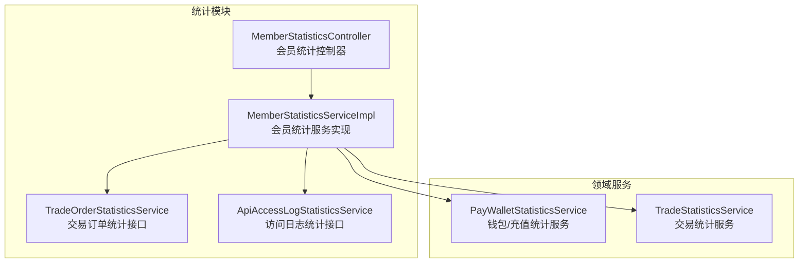
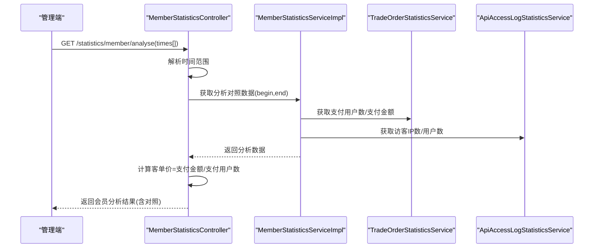
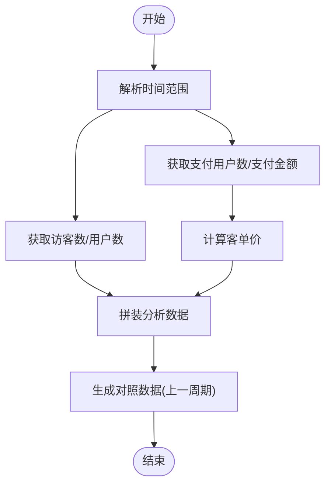
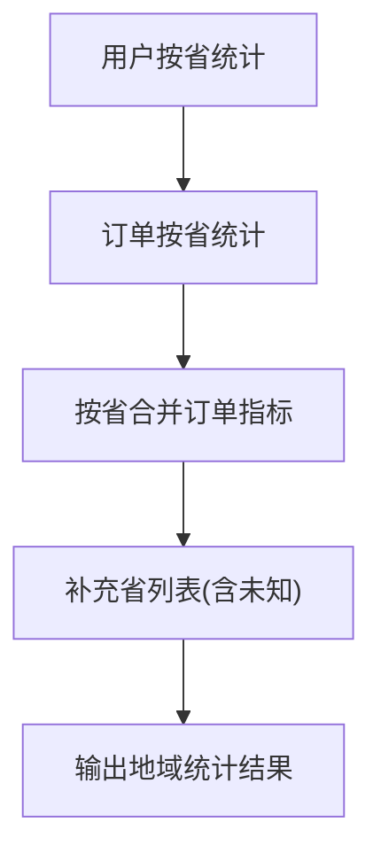
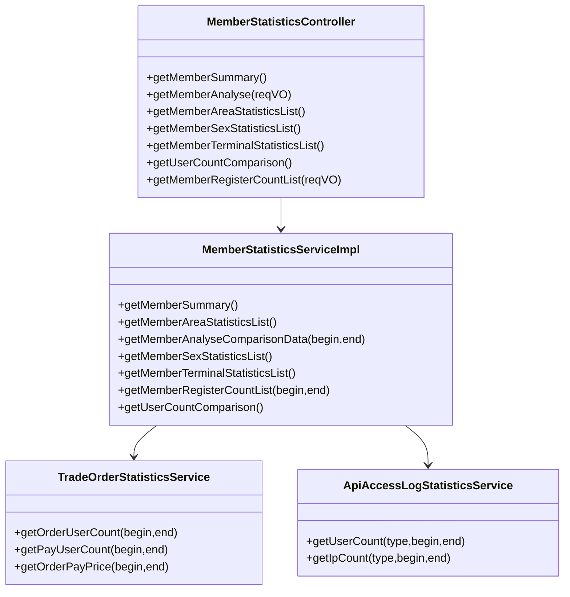

# 用户统计分析

<cite>
**本文引用的文件**
- [MemberStatisticsController.java](file://yudao-module-mall/yudao-module-statistics/src/main/java/cn/iocoder/yudao/module/statistics/controller/admin/member/MemberStatisticsController.java)
- [MemberStatisticsServiceImpl.java](file://yudao-module-mall/yudao-module-statistics/src/main/java/cn/iocoder/yudao/module/statistics/service/member/MemberStatisticsServiceImpl.java)
- [TradeOrderStatisticsService.java](file://yudao-module-mall/yudao-module-statistics/src/main/java/cn/iocoder/yudao/module/statistics/service/trade/TradeOrderStatisticsService.java)
- [ApiAccessLogStatisticsService.java](file://yudao-module-mall/yudao-module-statistics/src/main/java/cn/iocoder/yudao/module/statistics/service/infra/ApiAccessLogStatisticsService.java)
- [MemberAnalyseReqVO.java](file://yudao-module-mall/yudao-module-statistics/src/main/java/cn/iocoder/yudao/module/statistics/controller/admin/member/vo/MemberAnalyseReqVO.java)
- [MemberAnalyseRespVO.java](file://yudao-module-mall/yudao-module-statistics/src/main/java/cn/iocoder/yudao/module/statistics/controller/admin/member/vo/MemberAnalyseRespVO.java)
- [MemberAnalyseDataRespVO.java](file://yudao-module-mall/yudao-module-statistics/src/main/java/cn/iocoder/yudao/module/statistics/controller/admin/member/vo/MemberAnalyseDataRespVO.java)
- [MemberAreaStatisticsRespVO.java](file://yudao-module-mall/yudao-module-statistics/src/main/java/cn/iocoder/yudao/module/statistics/controller/admin/member/vo/MemberAreaStatisticsRespVO.java)
- [MemberSexStatisticsRespVO.java](file://yudao-module-mall/yudao-module-statistics/src/main/java/cn/iocoder/yudao/module/statistics/controller/admin/member/vo/MemberSexStatisticsRespVO.java)
- [MemberTerminalStatisticsRespVO.java](file://yudao-module-mall/yudao-module-statistics/src/main/java/cn/iocoder/yudao/module/statistics/controller/admin/member/vo/MemberTerminalStatisticsRespVO.java)
- [MemberRegisterCountRespVO.java](file://yudao-module-mall/yudao-module-statistics/src/main/java/cn/iocoder/yudao/module/statistics/controller/admin/member/vo/MemberRegisterCountRespVO.java)
- [MemberCountRespVO.java](file://yudao-module-mall/yudao-module-statistics/src/main/java/cn/iocoder/yudao/module/statistics/controller/admin/member/vo/MemberCountRespVO.java)
- [MemberSummaryRespVO.java](file://yudao-module-mall/yudao-module-statistics/src/main/java/cn/iocoder/yudao/module/statistics/controller/admin/member/vo/MemberSummaryRespVO.java)
</cite>

## 目录
1. [引言](#引言)
2. [项目结构](#项目结构)
3. [核心组件](#核心组件)
4. [架构总览](#架构总览)
5. [详细组件分析](#详细组件分析)
6. [依赖分析](#依赖分析)
7. [性能考量](#性能考量)
8. [故障排查指南](#故障排查指南)
9. [结论](#结论)
10. [附录](#附录)

## 引言
本技术文档围绕“用户统计分析”主题，系统梳理并解释当前代码库中与用户行为统计、用户画像、生命周期价值（LTV）、用户分群、流失预警以及用户行为路径分析相关的实现与扩展点。文档从系统架构、数据流、处理逻辑、关键指标计算到隐私保护等方面进行深入解析，并提供可视化图示与可操作的优化建议。

## 项目结构
用户统计分析相关能力主要集中在“统计模块（yudao-module-statistics）”中，采用“控制器-服务-数据访问层”的分层设计，结合多业务服务（交易、支付、访问日志）协同完成指标聚合与对比分析。

图表来源
- [MemberStatisticsController.java:1-115](file://yudao-module-mall/yudao-module-statistics/src/main/java/cn/iocoder/yudao/module/statistics/controller/admin/member/MemberStatisticsController.java#L1-L115)
- [MemberStatisticsServiceImpl.java:1-141](file://yudao-module-mall/yudao-module-statistics/src/main/java/cn/iocoder/yudao/module/statistics/service/member/MemberStatisticsServiceImpl.java#L1-L141)
- [TradeOrderStatisticsService.java:1-84](file://yudao-module-mall/yudao-module-statistics/src/main/java/cn/iocoder/yudao/module/statistics/service/trade/TradeOrderStatisticsService.java#L1-L84)
- [ApiAccessLogStatisticsService.java:1-33](file://yudao-module-mall/yudao-module-statistics/src/main/java/cn/iocoder/yudao/module/statistics/service/infra/ApiAccessLogStatisticsService.java#L1-L33)

章节来源
- [MemberStatisticsController.java:1-115](file://yudao-module-mall/yudao-module-statistics/src/main/java/cn/iocoder/yudao/module/statistics/controller/admin/member/MemberStatisticsController.java#L1-L115)
- [MemberStatisticsServiceImpl.java:1-141](file://yudao-module-mall/yudao-module-statistics/src/main/java/cn/iocoder/yudao/module/statistics/service/member/MemberStatisticsServiceImpl.java#L1-L141)

## 核心组件
- 控制器层：提供会员统计的对外接口，负责接收时间范围等参数，调用服务层并返回聚合后的指标。
- 服务层：封装统计聚合逻辑，协调交易、支付、访问日志等服务获取所需数据。
- 接口层：定义交易订单统计、访问日志统计等服务接口，便于替换实现与扩展。
- VO 层：定义请求与响应的数据结构，确保前后端契约清晰。

章节来源
- [MemberStatisticsController.java:42-75](file://yudao-module-mall/yudao-module-statistics/src/main/java/cn/iocoder/yudao/module/statistics/controller/admin/member/MemberStatisticsController.java#L42-L75)
- [MemberStatisticsServiceImpl.java:52-104](file://yudao-module-mall/yudao-module-statistics/src/main/java/cn/iocoder/yudao/module/statistics/service/member/MemberStatisticsServiceImpl.java#L52-L104)
- [TradeOrderStatisticsService.java:16-83](file://yudao-module-mall/yudao-module-statistics/src/main/java/cn/iocoder/yudao/module/statistics/service/trade/TradeOrderStatisticsService.java#L16-L83)
- [ApiAccessLogStatisticsService.java:10-32](file://yudao-module-mall/yudao-module-statistics/src/main/java/cn/iocoder/yudao/module/statistics/service/infra/ApiAccessLogStatisticsService.java#L10-L32)

## 架构总览
用户统计分析通过控制器聚合来自多个领域的统计数据，形成“访客数、下单用户数、成交用户数、客单价、充值用户数、注册用户数”等关键指标，并支持同比/环比对照分析。

图表来源
- [MemberStatisticsController.java:52-75](file://yudao-module-mall/yudao-module-statistics/src/main/java/cn/iocoder/yudao/module/statistics/controller/admin/member/MemberStatisticsController.java#L52-L75)
- [MemberStatisticsServiceImpl.java:85-104](file://yudao-module-mall/yudao-module-statistics/src/main/java/cn/iocoder/yudao/module/statistics/service/member/MemberStatisticsServiceImpl.java#L85-L104)
- [TradeOrderStatisticsService.java:35-59](file://yudao-module-mall/yudao-module-statistics/src/main/java/cn/iocoder/yudao/module/statistics/service/trade/TradeOrderStatisticsService.java#L35-L59)
- [ApiAccessLogStatisticsService.java:12-30](file://yudao-module-mall/yudao-module-statistics/src/main/java/cn/iocoder/yudao/module/statistics/service/infra/ApiAccessLogStatisticsService.java#L12-L30)

## 详细组件分析

### 1) 会员分析与对照数据
- 功能要点
  - 分析期内的访客数、下单用户数、成交用户数、客单价、充值用户数等。
  - 提供“对照数据”，用于对比上一周期（如昨日）的指标变化。
- 关键流程
  - 从访问日志统计服务获取访客数与用户数。
  - 从交易订单统计服务获取下单用户数、支付用户数与支付金额。
  - 客单价 = 支付金额 / 支付用户数。
  - 对照期起止时间按当前期长度对齐，避免时间重叠。
- 扩展建议
  - 将“访客数”统一按注册用户维度统计，保证漏斗口径一致（访问>下单>支付）。
  - 增加留存率、复购率等指标的计算入口与存储。

图表来源
- [MemberStatisticsController.java:52-75](file://yudao-module-mall/yudao-module-statistics/src/main/java/cn/iocoder/yudao/module/statistics/controller/admin/member/MemberStatisticsController.java#L52-L75)
- [MemberStatisticsServiceImpl.java:85-104](file://yudao-module-mall/yudao-module-statistics/src/main/java/cn/iocoder/yudao/module/statistics/service/member/MemberStatisticsServiceImpl.java#L85-L104)

章节来源
- [MemberStatisticsController.java:52-75](file://yudao-module-mall/yudao-module-statistics/src/main/java/cn/iocoder/yudao/module/statistics/controller/admin/member/MemberStatisticsController.java#L52-L75)
- [MemberAnalyseReqVO.java:1-20](file://yudao-module-mall/yudao-module-statistics/src/main/java/cn/iocoder/yudao/module/statistics/controller/admin/member/vo/MemberAnalyseReqVO.java#L1-L20)
- [MemberAnalyseRespVO.java:1-27](file://yudao-module-mall/yudao-module-statistics/src/main/java/cn/iocoder/yudao/module/statistics/controller/admin/member/vo/MemberAnalyseRespVO.java#L1-L27)
- [MemberAnalyseDataRespVO.java:1-19](file://yudao-module-mall/yudao-module-statistics/src/main/java/cn/iocoder/yudao/module/statistics/controller/admin/member/vo/MemberAnalyseDataRespVO.java#L1-L19)

### 2) 地域分布与消费画像
- 功能要点
  - 按省份聚合用户数、下单用户数、支付用户数与支付金额。
  - 合并未知区域，便于统一展示。
- 关键流程
  - 用户数：按省汇总用户表统计。
  - 订单数/金额：按省汇总交易订单统计，合并重复用户与金额。
  - 最终输出包含省ID、省名、用户数、下单用户数、支付用户数、支付金额。

图表来源
- [MemberStatisticsServiceImpl.java:62-83](file://yudao-module-mall/yudao-module-statistics/src/main/java/cn/iocoder/yudao/module/statistics/service/member/MemberStatisticsServiceImpl.java#L62-L83)
- [MemberAreaStatisticsRespVO.java:1-27](file://yudao-module-mall/yudao-module-statistics/src/main/java/cn/iocoder/yudao/module/statistics/controller/admin/member/vo/MemberAreaStatisticsRespVO.java#L1-L27)

章节来源
- [MemberStatisticsServiceImpl.java:62-83](file://yudao-module-mall/yudao-module-statistics/src/main/java/cn/iocoder/yudao/module/statistics/service/member/MemberStatisticsServiceImpl.java#L62-L83)
- [MemberAreaStatisticsRespVO.java:1-27](file://yudao-module-mall/yudao-module-statistics/src/main/java/cn/iocoder/yudao/module/statistics/controller/admin/member/vo/MemberAreaStatisticsRespVO.java#L1-L27)

### 3) 性别与终端分布
- 功能要点
  - 性别分布：按性别统计用户数。
  - 终端分布：按注册终端统计用户数。
- 使用场景
  - 用于用户画像与渠道效果分析，指导内容与活动投放策略。

章节来源
- [MemberStatisticsServiceImpl.java:107-114](file://yudao-module-mall/yudao-module-statistics/src/main/java/cn/iocoder/yudao/module/statistics/service/member/MemberStatisticsServiceImpl.java#L107-L114)
- [MemberSexStatisticsRespVO.java:1-18](file://yudao-module-mall/yudao-module-statistics/src/main/java/cn/iocoder/yudao/module/statistics/controller/admin/member/vo/MemberSexStatisticsRespVO.java#L1-L18)
- [MemberTerminalStatisticsRespVO.java:1-18](file://yudao-module-mall/yudao-module-statistics/src/main/java/cn/iocoder/yudao/module/statistics/controller/admin/member/vo/MemberTerminalStatisticsRespVO.java#L1-L18)

### 4) 注册趋势与用户数量对照
- 功能要点
  - 注册趋势：按自然日统计注册数量。
  - 用户数量对照：今日 vs 昨日的注册用户数与访问用户数。
- 使用场景
  - 观察用户增长趋势与活跃度变化。

章节来源
- [MemberStatisticsServiceImpl.java:117-138](file://yudao-module-mall/yudao-module-statistics/src/main/java/cn/iocoder/yudao/module/statistics/service/member/MemberStatisticsServiceImpl.java#L117-L138)
- [MemberRegisterCountRespVO.java:1-24](file://yudao-module-mall/yudao-module-statistics/src/main/java/cn/iocoder/yudao/module/statistics/controller/admin/member/vo/MemberRegisterCountRespVO.java#L1-L24)
- [MemberCountRespVO.java:1-17](file://yudao-module-mall/yudao-module-statistics/src/main/java/cn/iocoder/yudao/module/statistics/controller/admin/member/vo/MemberCountRespVO.java#L1-L17)

### 5) 会员认证与概览
- 功能要点
  - 会员认证：提供“会员统计（实时）”接口，返回用户总数、充值用户数、充值金额、支出金额。
- 使用场景
  - 快速掌握整体用户规模与消费健康度。

章节来源
- [MemberStatisticsController.java:42-47](file://yudao-module-mall/yudao-module-statistics/src/main/java/cn/iocoder/yudao/module/statistics/controller/admin/member/MemberStatisticsController.java#L42-L47)
- [MemberSummaryRespVO.java:1-24](file://yudao-module-mall/yudao-module-statistics/src/main/java/cn/iocoder/yudao/module/statistics/controller/admin/member/vo/MemberSummaryRespVO.java#L1-L24)

## 依赖分析
- 控制器依赖服务层；服务层依赖交易、支付、访问日志等服务接口。
- 服务层内部通过 Mapper 或领域服务聚合数据，最终转换为 VO 返回。
- VO 层作为契约层，约束接口输入输出格式。

图表来源
- [MemberStatisticsController.java:1-115](file://yudao-module-mall/yudao-module-statistics/src/main/java/cn/iocoder/yudao/module/statistics/controller/admin/member/MemberStatisticsController.java#L1-L115)
- [MemberStatisticsServiceImpl.java:1-141](file://yudao-module-mall/yudao-module-statistics/src/main/java/cn/iocoder/yudao/module/statistics/service/member/MemberStatisticsServiceImpl.java#L1-L141)
- [TradeOrderStatisticsService.java:1-84](file://yudao-module-mall/yudao-module-statistics/src/main/java/cn/iocoder/yudao/module/statistics/service/trade/TradeOrderStatisticsService.java#L1-L84)
- [ApiAccessLogStatisticsService.java:1-33](file://yudao-module-mall/yudao-module-statistics/src/main/java/cn/iocoder/yudao/module/statistics/service/infra/ApiAccessLogStatisticsService.java#L1-L33)

## 性能考量
- 时间窗口对齐：在生成对照数据时，需确保起止时间长度一致并避免重叠，减少统计偏差。
- 聚合粒度：按省聚合订单指标时，注意去重与合并策略，避免重复计算。
- 缓存与批处理：对高频查询（如今日/昨日对照）可引入缓存或定时批处理，降低数据库压力。
- 分页与索引：注册趋势等长序列查询应配合合适索引与分页策略，避免全表扫描。

## 故障排查指南
- 访客数异常
  - 现象：访客数与下单用户数不一致。
  - 排查：确认访问日志统计是否按用户类型过滤、是否按自然日边界取整。
- 客单价为零
  - 现象：支付用户数为0导致客单价异常。
  - 排查：检查支付用户数与支付金额统计接口的时间范围与过滤条件。
- 地域统计缺失
  - 现象：部分省份无数据。
  - 排查：确认省ID映射与未知区域补位逻辑，确保所有省均参与聚合。
- 对照期错位
  - 现象：对照期与当前期长度不一致。
  - 排查：核对时间对齐逻辑，确保起止时间差值一致且无重叠。

章节来源
- [MemberStatisticsController.java:52-75](file://yudao-module-mall/yudao-module-statistics/src/main/java/cn/iocoder/yudao/module/statistics/controller/admin/member/MemberStatisticsController.java#L52-L75)
- [MemberStatisticsServiceImpl.java:85-104](file://yudao-module-mall/yudao-module-statistics/src/main/java/cn/iocoder/yudao/module/statistics/service/member/MemberStatisticsServiceImpl.java#L85-L104)

## 结论
当前实现已覆盖用户增长、活跃度、地域与性别画像、终端分布、注册趋势及对照分析等关键维度。建议后续扩展留存率、复购率、LTV/CAC、RFM/聚类分群、流失预警与转化漏斗等高级分析能力，并完善数据质量与隐私保护机制，以支撑更全面的用户洞察与运营决策。

## 附录

### A. 关键指标与计算逻辑
- 用户增长
  - 注册用户数：按自然日统计注册数量。
  - 对照：今日 vs 昨日。
- 活跃度
  - 访客数：按用户类型与时间范围统计独立IP/用户数。
- 成交能力
  - 下单用户数、成交用户数、客单价、支付金额。
- 地域与画像
  - 按省聚合用户数、下单用户数、支付用户数、支付金额。
  - 性别与终端分布。
- LTV 与 CAC（扩展建议）
  - LTV：历史付费金额折现累计、复购周期与频率、客单价与毛利率。
  - CAC：营销与获客成本分摊至用户生命周期。
  - 复购率：购买≥2次用户占比。
- RFM/聚类分群（扩展建议）
  - R：最近一次消费距今时间；F：消费频次；M：消费金额。
  - 聚类：K-Means/决策树/RFM规则分群。
- 流失预警（扩展建议）
  - 特征：R/F/M近30/60/90天变化、沉默天数、退款率。
  - 模型：逻辑回归/LGBM/XGBoost；阈值动态调整。
- 行为路径与转化漏斗（扩展建议）
  - 路径：浏览>加购>下单>支付>收货。
  - 漏斗：曝光/点击>浏览>下单>支付>复购。

### B. 隐私保护与合规
- 数据脱敏
  - 对敏感字段（手机号、身份证号、地址）进行脱敏处理。
- 匿名化
  - 去标识化与最小化原则，仅保留必要统计维度。
- 合规检查
  - 数据采集与使用遵循最小必要、目的明确、同意与撤回、可追溯等要求。
  - 建立数据访问审计与权限控制。