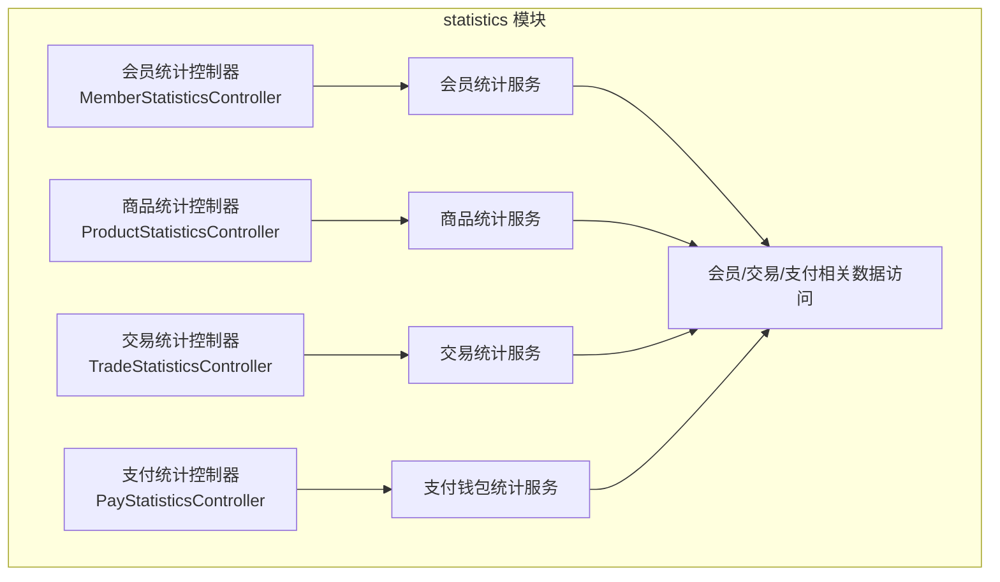
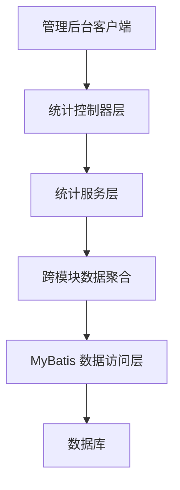
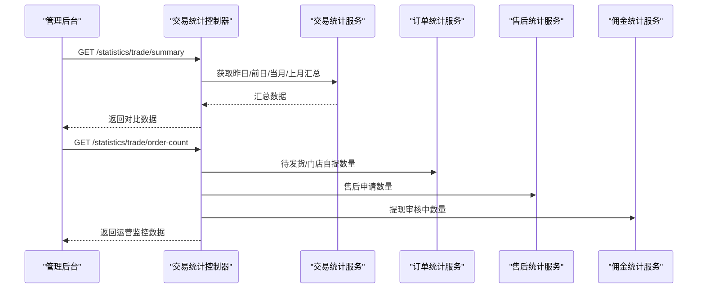
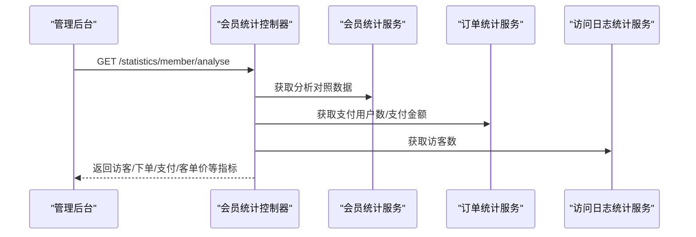
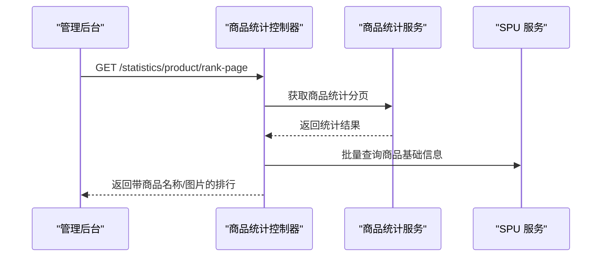
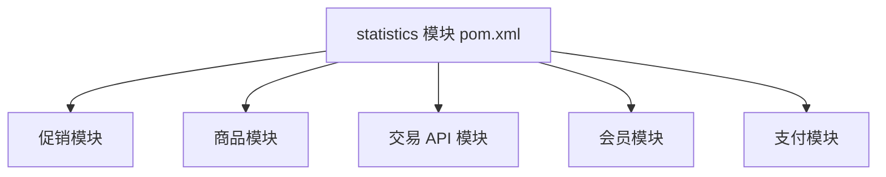

# 统计分析模块

<cite>
**本文引用的文件**
- [statistics 模块 pom.xml](file://qiji-module-mall/qiji-module-statistics/pom.xml)
- [statistics 包说明](file://qiji-module-mall/qiji-module-statistics/src/main/java/com.qiji.cps/module/statistics/package-info.java)
- [会员统计控制器](file://qiji-module-mall/qiji-module-statistics/src/main/java/com.qiji.cps/module/statistics/controller/admin/member/MemberStatisticsController.java)
- [商品统计控制器](file://qiji-module-mall/qiji-module-statistics/src/main/java/com.qiji.cps/module/statistics/controller/admin/product/ProductStatisticsController.java)
- [交易统计控制器](file://qiji-module-mall/qiji-module-statistics/src/main/java/com.qiji.cps/module/statistics/controller/admin/trade/TradeStatisticsController.java)
- [支付统计控制器](file://qiji-module-mall/qiji-module-statistics/src/main/java/com.qiji.cps/module/statistics/controller/admin/pay/PayStatisticsController.java)
- [数据对照响应 VO](file://qiji-module-mall/qiji-module-statistics/src/main/java/com.qiji.cps/module/statistics/controller/admin/common/vo/DataComparisonRespVO.java)
</cite>

## 目录
1. [简介](#简介)
2. [项目结构](#项目结构)
3. [核心组件](#核心组件)
4. [架构总览](#架构总览)
5. [详细组件分析](#详细组件分析)
6. [依赖分析](#依赖分析)
7. [性能考虑](#性能考虑)
8. [故障排查指南](#故障排查指南)
9. [结论](#结论)
10. [附录](#附录)

## 简介
本模块聚焦于多维度数据分析与可视化，覆盖销售数据统计、用户行为分析、商品表现评估、运营指标监控，并提供实时统计、报表生成与数据可视化能力。模块通过独立的服务层聚合来自商品、会员、交易、支付等子系统的数据，形成统一的统计视图，支撑管理后台的决策分析。

## 项目结构
statistics 模块位于 mall 子系统下，采用按功能域划分的包结构，包含控制器、服务、数据访问对象、转换器以及资源映射文件。模块对外提供 REST 接口，内部通过服务层聚合各领域统计能力，并支持 Excel 导出与权限控制。

**图表来源**
- [statistics 模块 pom.xml:20-46](file://qiji-module-mall/qiji-module-statistics/pom.xml#L20-L46)
- [会员统计控制器:1-115](file://qiji-module-mall/qiji-module-statistics/src/main/java/com.qiji.cps/module/statistics/controller/admin/member/MemberStatisticsController.java#L1-115)
- [商品统计控制器:1-87](file://qiji-module-mall/qiji-module-statistics/src/main/java/com.qiji.cps/module/statistics/controller/admin/product/ProductStatisticsController.java#L1-87)
- [交易统计控制器:1-131](file://qiji-module-mall/qiji-module-statistics/src/main/java/com.qiji.cps/module/statistics/controller/admin/trade/TradeStatisticsController.java#L1-131)
- [支付统计控制器:1-37](file://qiji-module-mall/qiji-module-statistics/src/main/java/com.qiji.cps/module/statistics/controller/admin/pay/PayStatisticsController.java#L1-37)

**章节来源**
- [statistics 模块 pom.xml:1-87](file://qiji-module-mall/qiji-module-statistics/pom.xml#L1-L87)
- [statistics 包说明:1-9](file://qiji-module-mall/qiji-module-statistics/src/main/java/com.qiji.cps/module/statistics/package-info.java#L1-L9)

## 核心组件
- 控制器层：提供 REST 接口，负责参数接收、权限校验与结果封装，调用对应服务层进行统计计算。
- 服务层：聚合跨模块数据，执行复杂统计逻辑（如对比分析、趋势计算、排名分页），并处理数据转换。
- 数据访问层：基于 MyBatis 进行统计维度的数据查询与聚合。
- 转换器与 VO：将 DO/BO 转换为前端友好的响应对象，支持导出与可视化。
- 导出能力：基于 Excel 工具类，支持将统计明细导出为 Excel 文件。

**章节来源**
- [会员统计控制器:1-115](file://qiji-module-mall/qiji-module-statistics/src/main/java/com.qiji.cps/module/statistics/controller/admin/member/MemberStatisticsController.java#L1-115)
- [商品统计控制器:1-87](file://qiji-module-mall/qiji-module-statistics/src/main/java/com.qiji.cps/module/statistics/controller/admin/product/ProductStatisticsController.java#L1-87)
- [交易统计控制器:1-131](file://qiji-module-mall/qiji-module-statistics/src/main/java/com.qiji.cps/module/statistics/controller/admin/trade/TradeStatisticsController.java#L1-131)
- [支付统计控制器:1-37](file://qiji-module-mall/qiji-module-statistics/src/main/java/com.qiji.cps/module/statistics/controller/admin/pay/PayStatisticsController.java#L1-37)

## 架构总览
模块遵循“控制器-服务-数据访问”的分层架构，通过服务层聚合多模块数据，统一输出统计口径。接口以 /statistics/* 命名空间提供，避免与其他模块冲突；数据对象表名以 statistics_ 后缀标识，便于数据库层面区分。

**图表来源**
- [statistics 包说明:1-9](file://qiji-module-mall/qiji-module-statistics/src/main/java/com.qiji.cps/module/statistics/package-info.java#L1-L9)

## 详细组件分析

### 销售数据统计（交易与订单）
- 实时概览：提供昨日/前日、当月/上月的对比数据，便于快速掌握趋势变化。
- 明细与导出：支持按时间范围查询交易明细，并导出为 Excel。
- 订单状态监控：提供待发货、门店自提、售后申请、佣金提现审核中的订单/金额统计，辅助运营监控。
- 订单趋势：提供订单量趋势对比，支持按日期维度的趋势分析。

**图表来源**
- [交易统计控制器:52-120](file://qiji-module-mall/qiji-module-statistics/src/main/java/com.qiji.cps/module/statistics/controller/admin/trade/TradeStatisticsController.java#L52-L120)

**章节来源**
- [交易统计控制器:1-131](file://qiji-module-mall/qiji-module-statistics/src/main/java/com.qiji.cps/module/statistics/controller/admin/trade/TradeStatisticsController.java#L1-131)

### 用户行为分析（会员）
- 实时统计：提供会员实时概览，包含访客数、下单用户数、支付用户数、客单价等关键指标。
- 分析维度：支持按地区、性别、终端等维度的会员统计列表。
- 用户增长与对照：提供用户数量对照与注册趋势列表，便于观察增长曲线。

**图表来源**
- [会员统计控制器:49-75](file://qiji-module-mall/qiji-module-statistics/src/main/java/com.qiji.cps/module/statistics/controller/admin/member/MemberStatisticsController.java#L49-L75)

**章节来源**
- [会员统计控制器:1-115](file://qiji-module-mall/qiji-module-statistics/src/main/java/com.qiji.cps/module/statistics/controller/admin/member/MemberStatisticsController.java#L1-115)

### 商品表现评估（商品）
- 统计分析：提供商品维度的销售分析，支持与历史或对照期对比。
- 明细与导出：支持按日期维度的商品统计明细查询与 Excel 导出。
- 排行榜：提供商品维度的销售排行榜分页，结合商品基础信息完善展示。

**图表来源**
- [商品统计控制器:73-85](file://qiji-module-mall/qiji-module-statistics/src/main/java/com.qiji.cps/module/statistics/controller/admin/product/ProductStatisticsController.java#L73-L85)

**章节来源**
- [商品统计控制器:1-87](file://qiji-module-mall/qiji-module-statistics/src/main/java/com.qiji.cps/module/statistics/controller/admin/product/ProductStatisticsController.java#L1-87)

### 运营指标监控（支付）
- 充值统计：提供钱包充值金额汇总，作为运营收入的重要参考指标。

**章节来源**
- [支付统计控制器:1-37](file://qiji-module-mall/qiji-module-statistics/src/main/java/com.qiji.cps/module/statistics/controller/admin/pay/PayStatisticsController.java#L1-37)

### 实时统计
- 会员实时概览：提供会员实时统计接口，便于运营人员快速掌握当前用户活跃情况。
- 交易实时概览：提供交易实时汇总，支持与历史对比，识别异常波动。

**章节来源**
- [会员统计控制器:42-47](file://qiji-module-mall/qiji-module-statistics/src/main/java/com.qiji.cps/module/statistics/controller/admin/member/MemberStatisticsController.java#L42-L47)
- [交易统计控制器:52-67](file://qiji-module-mall/qiji-module-statistics/src/main/java/com.qiji.cps/module/statistics/controller/admin/trade/TradeStatisticsController.java#L52-L67)

### 报表生成功能
- 自定义报表：通过时间范围参数灵活筛选，查询任意周期内的统计明细。
- 定时报表：提供对比口径（如昨日/前日、当月/上月），便于形成固定周期的报表。
- 导出功能：支持将明细数据导出为 Excel，满足线下归档与二次分析需求。

**章节来源**
- [商品统计控制器:63-71](file://qiji-module-mall/qiji-module-statistics/src/main/java/com.qiji.cps/module/statistics/controller/admin/product/ProductStatisticsController.java#L63-L71)
- [交易统计控制器:86-96](file://qiji-module-mall/qiji-module-statistics/src/main/java/com.qiji.cps/module/statistics/controller/admin/trade/TradeStatisticsController.java#L86-L96)

### 数据可视化
- 图表展示：通过对比数据结构（当前值与参照值）与趋势数据，支持折线图、柱状图等可视化呈现。
- 仪表板：结合实时概览与对比数据，构建运营仪表板，直观反映关键指标变化。
- 数据钻取：从总览到明细再到商品/会员维度的钻取路径清晰，便于深入分析。

**章节来源**
- [数据对照响应 VO:1-20](file://qiji-module-mall/qiji-module-statistics/src/main/java/com.qiji.cps/module/statistics/controller/admin/common/vo/DataComparisonRespVO.java#L1-20)

## 依赖分析
statistics 模块对 mall 子系统内多个模块存在运行时依赖，包括促销、商品、交易 API、会员、支付等，用于聚合跨模块的统计数据。

**图表来源**
- [statistics 模块 pom.xml:20-46](file://qiji-module-mall/qiji-module-statistics/pom.xml#L20-L46)

**章节来源**
- [statistics 模块 pom.xml:1-87](file://qiji-module-mall/qiji-module-statistics/pom.xml#L1-L87)

## 性能考虑
- 缓存策略：对高频查询的汇总数据（如实时概览、对比数据）可引入缓存，降低数据库压力。
- 预计算：对常用对比口径（如昨日/前日、当月/上月）可在定时任务中预计算，提升查询响应速度。
- 增量更新：针对订单、支付等高频变动数据，采用增量统计与延迟合并策略，减少全量扫描。
- 分页与排序：排行榜与明细查询使用分页与可排序参数，避免一次性加载大量数据。
- 导出优化：导出接口建议异步化，避免阻塞主线程；对大结果集分批写入 Excel。

## 故障排查指南
- 权限问题：接口均带有权限注解，若出现 403，请确认账号是否具备相应权限。
- 时间范围参数：分析接口依赖时间范围数组，需确保传入的开始/结束时间格式正确且顺序合理。
- 导出失败：导出接口依赖 Excel 工具类，若导出异常，请检查响应输出流与浏览器兼容性。
- 数据不一致：对比数据涉及多模块统计，若发现异常波动，建议核对各模块的统计口径与时间边界。

**章节来源**
- [会员统计控制器:42-47](file://qiji-module-mall/qiji-module-statistics/src/main/java/com.qiji.cps/module/statistics/controller/admin/member/MemberStatisticsController.java#L42-L47)
- [交易统计控制器:86-96](file://qiji-module-mall/qiji-module-statistics/src/main/java/com.qiji.cps/module/statistics/controller/admin/trade/TradeStatisticsController.java#L86-L96)
- [商品统计控制器:63-71](file://qiji-module-mall/qiji-module-statistics/src/main/java/com.qiji.cps/module/statistics/controller/admin/product/ProductStatisticsController.java#L63-L71)

## 结论
statistics 模块通过清晰的分层设计与跨模块数据聚合，实现了销售、用户、商品、运营等多维度的统计分析能力。配合对比数据结构、趋势分析与导出功能，能够有效支撑管理后台的日常运营与决策分析。建议在生产环境中结合缓存、预计算与增量更新等手段进一步提升性能与稳定性。

## 附录
- 接口命名规范：控制器 URL 以 /statistics/* 开头，避免与其他模块冲突。
- 数据对象命名：数据访问层对象表名以 statistics_ 为后缀，便于数据库层面区分。

**章节来源**
- [statistics 包说明:1-9](file://qiji-module-mall/qiji-module-statistics/src/main/java/com.qiji.cps/module/statistics/package-info.java#L1-L9)