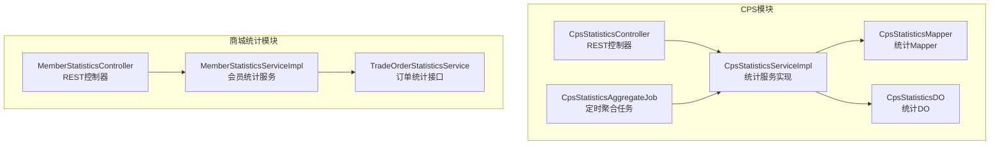
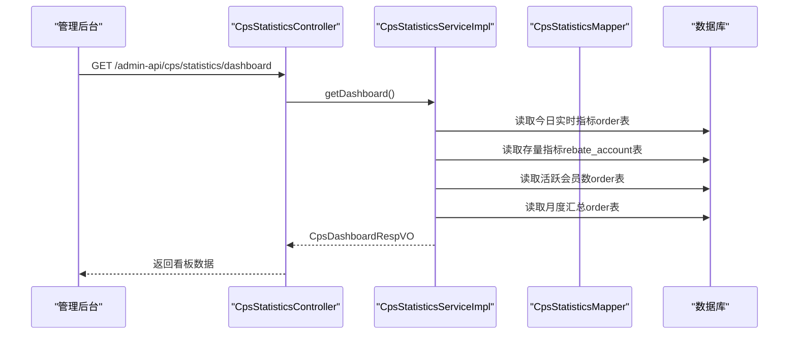
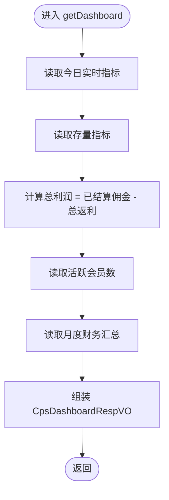
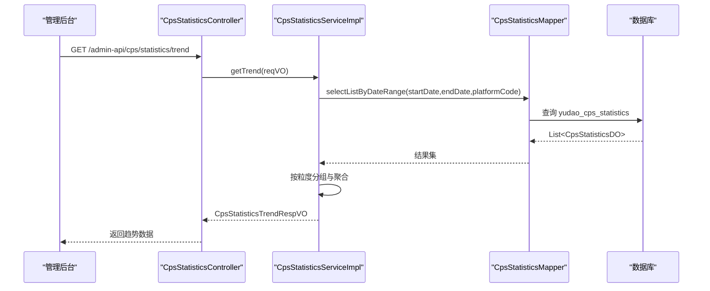
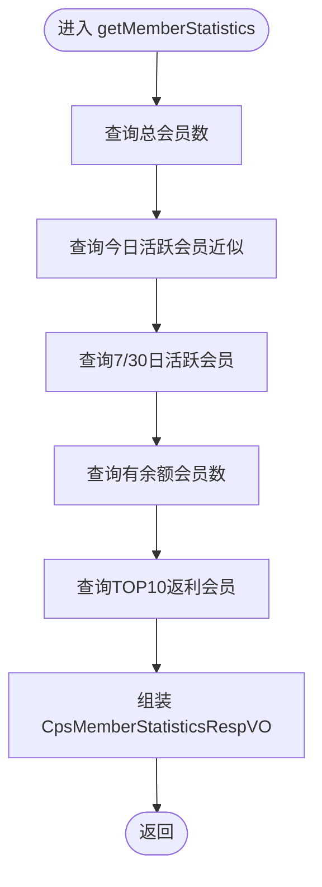
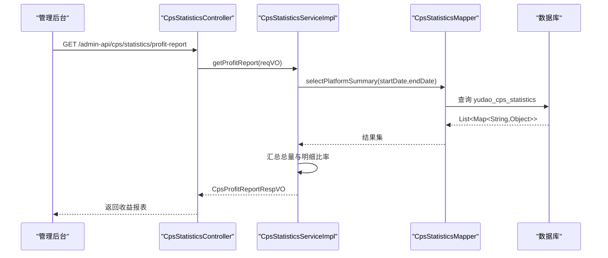
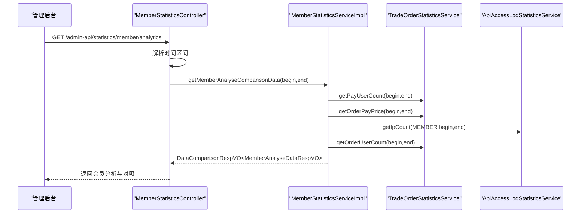
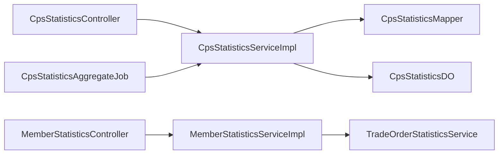

# 运营统计分析

<cite>
**本文引用的文件**
- [CpsStatisticsController.java](file://yudao-module-cps/yudao-module-cps-biz/src/main/java/cn/zhijian/cps/controller/admin/CpsStatisticsController.java)
- [CpsStatisticsService.java](file://yudao-module-cps/yudao-module-cps-biz/src/main/java/cn/zhijian/cps/service/CpsStatisticsService.java)
- [CpsStatisticsServiceImpl.java](file://yudao-module-cps/yudao-module-cps-biz/src/main/java/cn/zhijian/cps/service/CpsStatisticsServiceImpl.java)
- [CpsStatisticsMapper.java](file://yudao-module-cps/yudao-module-cps-biz/src/main/java/cn/zhijian/cps/dal/mysql/CpsStatisticsMapper.java)
- [CpsStatisticsAggregateJob.java](file://yudao-module-cps/yudao-module-cps-biz/src/main/java/cn/zhijian/cps/job/CpsStatisticsAggregateJob.java)
- [MemberStatisticsController.java](file://yudao-module-mall/yudao-module-statistics/src/main/java/cn/iocoder/yudao/module/statistics/controller/admin/member/MemberStatisticsController.java)
- [MemberStatisticsServiceImpl.java](file://yudao-module-mall/yudao-module-statistics/src/main/java/cn/iocoder/yudao/module/statistics/service/member/MemberStatisticsServiceImpl.java)
- [TradeOrderStatisticsService.java](file://yudao-module-mall/yudao-module-statistics/src/main/java/cn/iocoder/yudao/module/StatisticsServiceImpl.java)
- [MemberAnalyseRespVO.java](file://yudao-module-mall/yudao-module-statistics/src/main/java/cn/iocoder/yudao/module/statistics/controller/admin/member/vo/MemberAnalyseRespVO.java)
- [MemberAnalyseDataRespVO.java](file://yudao-module-mall/yudao-module-statistics/src/main/java/cn/iocoder/yudao/module/statistics/controller/admin/member/vo/MemberAnalyseDataRespVO.java)
- [TradeOrderStatisticsServiceImpl.java](file://yudao-module-mall/yudao-module-statistics/src/main/java/cn/iocoder/yudao/module/statistics/service/trade/TradeOrderStatisticsServiceImpl.java)
- [CpsDashboardRespVO.java](file://yudao-module-cps/yudao-module-cps-biz/src/main/java/cn/zhijian/cps/controller/admin/vo/statistics/CpsDashboardRespVO.java)
- [CpsStatisticsTrendRespVO.java](file://yudao-module-cps/yudao-module-cps-biz/src/main/java/cn/zhijian/cps/controller/admin/vo/statistics/CpsStatisticsTrendRespVO.java)
- [CpsMemberStatisticsRespVO.java](file://yudao-module-cps/yudao-module-cps-biz/src/main/java/cn/zhijian/cps/controller/admin/vo/statistics/CpsMemberStatisticsRespVO.java)
- [CpsProfitReportRespVO.java](file://yudao-module-cps/yudao-module-cps-biz/src/main/java/cn/zhijian/cps/controller/admin/vo/statistics/CpsProfitReportRespVO.java)
- [CpsStatisticsDO.java](file://yudao-module-cps/yudao-module-cps-biz/src/main/java/cn/zhijian/cps/dal/dataobject/CpsStatisticsDO.java)
- [cps-schema.sql](file://sql/module/cps-schema.sql)
</cite>

## 目录
1. [简介](#简介)
2. [项目结构](#项目结构)
3. [核心组件](#核心组件)
4. [架构总览](#架构总览)
5. [详细组件分析](#详细组件分析)
6. [依赖分析](#依赖分析)
7. [性能考量](#性能考量)
8. [故障排查指南](#故障排查指南)
9. [结论](#结论)
10. [附录](#附录)

## 简介
本技术文档聚焦于运营统计分析能力，涵盖流量分析、渠道效果、营销ROI、成本分析、渠道绩效评估、运营效率分析以及风险监控与自动化报告等关键主题。系统基于“预聚合+定时任务”的架构设计，提供运营看板、趋势分析、会员统计、收益报表等能力，并通过统一的数据模型与接口对外输出，支撑业务决策与自动化运营。

## 项目结构
- 运营统计主要分布在两个模块：
  - CPS模块：提供运营看板、趋势、会员统计、收益报表、定时聚合等能力。
  - 商城统计模块：提供会员分析、订单趋势、对照数据等能力。
- 数据层采用MyBatis Mapper与DO对象，配合定时任务进行日级预聚合，提升查询性能。

图表来源
- [CpsStatisticsController.java:1-75](file://yudao-module-cps/yudao-module-cps-biz/src/main/java/cn/zhijian/cps/controller/admin/CpsStatisticsController.java#L1-L75)
- [CpsStatisticsServiceImpl.java:1-382](file://yudao-module-cps/yudao-module-cps-biz/src/main/java/cn/zhijian/cps/service/CpsStatisticsServiceImpl.java#L1-L382)
- [CpsStatisticsMapper.java:1-96](file://yudao-module-cps/yudao-module-cps-biz/src/main/java/cn/zhijian/cps/dal/mysql/CpsStatisticsMapper.java#L1-L96)
- [CpsStatisticsAggregateJob.java:1-74](file://yudao-module-cps/yudao-module-cps-biz/src/main/java/cn/zhijian/cps/job/CpsStatisticsAggregateJob.java#L1-L74)
- [MemberStatisticsController.java:1-120](file://yudao-module-mall/yudao-module-statistics/src/main/java/cn/iocoder/yudao/module/statistics/controller/admin/member/MemberStatisticsController.java#L1-L120)
- [MemberStatisticsServiceImpl.java:1-141](file://yudao-module-mall/yudao-module-statistics/src/main/java/cn/iocoder/yudao/module/statistics/service/member/MemberStatisticsServiceImpl.java#L1-L141)
- [TradeOrderStatisticsService.java:1-84](file://yudao-module-mall/yudao-module-statistics/src/main/java/cn/iocoder/yudao/module/statistics/service/trade/TradeOrderStatisticsService.java#L1-L84)

章节来源
- [CpsStatisticsController.java:1-75](file://yudao-module-cps/yudao-module-cps-biz/src/main/java/cn/zhijian/cps/controller/admin/CpsStatisticsController.java#L1-L75)
- [MemberStatisticsController.java:1-120](file://yudao-module-mall/yudao-module-statistics/src/main/java/cn/iocoder/yudao/module/statistics/controller/admin/member/MemberStatisticsController.java#L1-L120)

## 核心组件
- 控制器层：提供运营看板、趋势、会员统计、收益报表等接口，负责参数校验与权限控制。
- 服务层：封装统计计算逻辑，包括实时指标与预聚合指标的组合、比率计算、分组汇总等。
- 数据访问层：提供分页、范围查询、按平台汇总、全平台汇总等SQL查询能力。
- 定时任务：每日凌晨聚合前一日数据到统计表，支持手动补跑。

章节来源
- [CpsStatisticsService.java:1-55](file://yudao-module-cps/yudao-module-cps-biz/src/main/java/cn/zhijian/cps/service/CpsStatisticsService.java#L1-L55)
- [CpsStatisticsServiceImpl.java:1-382](file://yudao-module-cps/yudao-module-cps-biz/src/main/java/cn/zhijian/cps/service/CpsStatisticsServiceImpl.java#L1-L382)
- [CpsStatisticsMapper.java:1-96](file://yudao-module-cps/yudao-module-cps-biz/src/main/java/cn/zhijian/cps/dal/mysql/CpsStatisticsMapper.java#L1-L96)
- [CpsStatisticsAggregateJob.java:1-74](file://yudao-module-cps/yudao-module-cps-biz/src/main/java/cn/zhijian/cps/job/CpsStatisticsAggregateJob.java#L1-L74)

## 架构总览
系统采用“接口层-服务层-数据层-定时任务”的分层架构，结合预聚合表提升查询性能，支持多粒度趋势与平台维度分析。

图表来源
- [CpsStatisticsController.java:42-48](file://yudao-module-cps/yudao-module-cps-biz/src/main/java/cn/zhijian/cps/controller/admin/CpsStatisticsController.java#L42-L48)
- [CpsStatisticsServiceImpl.java:52-90](file://yudao-module-cps/yudao-module-cps-biz/src/main/java/cn/zhijian/cps/service/CpsStatisticsServiceImpl.java#L52-L90)
- [CpsStatisticsMapper.java:46-93](file://yudao-module-cps/yudao-module-cps-biz/src/main/java/cn/zhijian/cps/dal/mysql/CpsStatisticsMapper.java#L46-L93)

## 详细组件分析

### 运营看板（Dashboard）
- 功能要点
  - 今日实时指标：订单数、订单金额、佣金、返利。
  - 存量指标：待结算佣金、已结算佣金、总返利。
  - 利润与会员：总利润（已结算佣金-总返利）、7/30日活跃会员、总会员数、本月指标。
- 计算逻辑
  - 利润 = 已结算佣金 - 总返利。
  - 比率计算采用固定精度，避免除零。
  - 空值兜底为0或0.00，保证前端稳定显示。
- 接口路径
  - GET /admin-api/cps/statistics/dashboard

图表来源
- [CpsStatisticsServiceImpl.java:52-90](file://yudao-module-cps/yudao-module-cps-biz/src/main/java/cn/zhijian/cps/service/CpsStatisticsServiceImpl.java#L52-L90)

章节来源
- [CpsStatisticsController.java:42-48](file://yudao-module-cps/yudao-module-cps-biz/src/main/java/cn/zhijian/cps/controller/admin/CpsStatisticsController.java#L42-L48)
- [CpsStatisticsServiceImpl.java:52-90](file://yudao-module-cps/yudao-module-cps-biz/src/main/java/cn/zhijian/cps/service/CpsStatisticsServiceImpl.java#L52-L90)
- [CpsDashboardRespVO.java:1-200](file://yudao-module-cps/yudao-module-cps-biz/src/main/java/cn/zhijian/cps/controller/admin/vo/statistics/CpsDashboardRespVO.java#L1-L200)

### 趋势分析（Trend）
- 功能要点
  - 支持按日/周/月粒度的趋势数据，返回订单数、订单金额、佣金、返利、利润、活跃会员等。
  - 从预聚合表读取，按日期分组聚合，再排序输出。
- 计算逻辑
  - 按粒度格式化日期标签（如 yyyy-MM-dd、yyyy-WW、yyyy-MM）。
  - 对同一天内的多项指标进行求和或累加。
- 接口路径
  - GET /admin-api/cps/statistics/trend

图表来源
- [CpsStatisticsController.java:50-56](file://yudao-module-cps/yudao-module-cps-biz/src/main/java/cn/zhijian/cps/controller/admin/CpsStatisticsController.java#L50-L56)
- [CpsStatisticsServiceImpl.java:92-124](file://yudao-module-cps/yudao-module-cps-biz/src/main/java/cn/zhijian/cps/service/CpsStatisticsServiceImpl.java#L92-L124)
- [CpsStatisticsMapper.java:27-32](file://yudao-module-cps/yudao-module-cps-biz/src/main/java/cn/zhijian/cps/dal/mysql/CpsStatisticsMapper.java#L27-L32)

章节来源
- [CpsStatisticsController.java:50-56](file://yudao-module-cps/yudao-module-cps-biz/src/main/java/cn/zhijian/cps/controller/admin/CpsStatisticsController.java#L50-L56)
- [CpsStatisticsServiceImpl.java:92-124](file://yudao-module-cps/yudao-module-cps-biz/src/main/java/cn/zhijian/cps/service/CpsStatisticsServiceImpl.java#L92-L124)
- [CpsStatisticsTrendRespVO.java:1-200](file://yudao-module-cps/yudao-module-cps-biz/src/main/java/cn/zhijian/cps/controller/admin/vo/statistics/CpsStatisticsTrendRespVO.java#L1-L200)

### 会员统计（Member Statistics）
- 功能要点
  - 总会员数、今日新增会员、7/30日活跃会员、有余额会员数。
  - TOP10返利会员（昵称占位，实际需关联用户表）。
- 计算逻辑
  - 今日新增 = 当日活跃会员数（近似）。
  - 活跃会员 = 指定周期活跃会员数。
  - 余额会员 = 可用余额大于0的会员数。
- 接口路径
  - GET /admin-api/cps/statistics/member

图表来源
- [CpsStatisticsServiceImpl.java:126-156](file://yudao-module-cps/yudao-module-cps-biz/src/main/java/cn/zhijian/cps/service/CpsStatisticsServiceImpl.java#L126-L156)

章节来源
- [CpsStatisticsController.java:58-64](file://yudao-module-cps/yudao-module-cps-biz/src/main/java/cn/zhijian/cps/controller/admin/CpsStatisticsController.java#L58-L64)
- [CpsStatisticsServiceImpl.java:126-156](file://yudao-module-cps/yudao-module-cps-biz/src/main/java/cn/zhijian/cps/service/CpsStatisticsServiceImpl.java#L126-L156)
- [CpsMemberStatisticsRespVO.java:1-200](file://yudao-module-cps/yudao-module-cps-biz/src/main/java/cn/zhijian/cps/controller/admin/vo/statistics/CpsMemberStatisticsRespVO.java#L1-L200)

### 收益报表（Profit Report）
- 功能要点
  - 按平台分组的佣金、返利、利润、订单数、订单金额汇总。
  - 计算利润率（利润/佣金）、佣金占比（平台佣金/总佣金）。
  - 支持按日期范围与平台筛选。
- 计算逻辑
  - 汇总：对平台维度进行 SUM 聚合。
  - 比率：calcRate(numerator, denominator)，分母为空时返回0，保留固定精度。
- 接口路径
  - GET /admin-api/cps/statistics/profit-report

图表来源
- [CpsStatisticsController.java:66-72](file://yudao-module-cps/yudao-module-cps-biz/src/main/java/cn/zhijian/cps/controller/admin/CpsStatisticsController.java#L66-L72)
- [CpsStatisticsServiceImpl.java:158-219](file://yudao-module-cps/yudao-module-cps-biz/src/main/java/cn/zhijian/cps/service/CpsStatisticsServiceImpl.java#L158-L219)
- [CpsStatisticsMapper.java:57-75](file://yudao-module-cps/yudao-module-cps-biz/src/main/java/cn/zhijian/cps/dal/mysql/CpsStatisticsMapper.java#L57-L75)
- [CpsProfitReportRespVO.java:42-78](file://yudao-module-cps/yudao-module-cps-biz/src/main/java/cn/zhijian/cps/controller/admin/vo/statistics/CpsProfitReportRespVO.java#L42-L78)

章节来源
- [CpsStatisticsController.java:66-72](file://yudao-module-cps/yudao-module-cps-biz/src/main/java/cn/zhijian/cps/controller/admin/CpsStatisticsController.java#L66-L72)
- [CpsStatisticsServiceImpl.java:158-219](file://yudao-module-cps/yudao-module-cps-biz/src/main/java/cn/zhijian/cps/service/CpsStatisticsServiceImpl.java#L158-L219)
- [CpsStatisticsMapper.java:57-75](file://yudao-module-cps/yudao-module-cps-biz/src/main/java/cn/zhijian/cps/dal/mysql/CpsStatisticsMapper.java#L57-L75)
- [CpsProfitReportRespVO.java:42-78](file://yudao-module-cps/yudao-module-cps-biz/src/main/java/cn/zhijian/cps/controller/admin/vo/statistics/CpsProfitReportRespVO.java#L42-L78)

### 会员分析（商城侧）
- 功能要点
  - 访客数、下单用户数、成交用户数、客单价（成交金额/成交用户数）。
  - 对照数据：按相同时间段长度的前一周期进行对比。
- 计算逻辑
  - 客单价：若成交用户数为0则为0。
  - 访客数：基于会员用户类型与访问日志统计。
- 接口路径
  - GET /admin-api/statistics/member/analytics

图表来源
- [MemberStatisticsController.java:55-76](file://yudao-module-mall/yudao-module-statistics/src/main/java/cn/iocoder/yudao/module/statistics/controller/admin/member/MemberStatisticsController.java#L55-L76)
- [MemberStatisticsServiceImpl.java:85-104](file://yudao-module-mall/yudao-module-statistics/src/main/java/cn/iocoder/yudao/module/statistics/service/member/MemberStatisticsServiceImpl.java#L85-L104)
- [TradeOrderStatisticsService.java:1-84](file://yudao-module-mall/yudao-module-statistics/src/main/java/cn/iocoder/yudao/module/statistics/service/trade/TradeOrderStatisticsService.java#L1-L84)
- [MemberAnalyseRespVO.java:1-26](file://yudao-module-mall/yudao-module-statistics/src/main/java/cn/iocoder/yudao/module/statistics/controller/admin/member/vo/MemberAnalyseRespVO.java#L1-L26)
- [MemberAnalyseDataRespVO.java:1-19](file://yudao-module-mall/yudao-module-statistics/src/main/java/cn/iocoder/yudao/module/statistics/controller/admin/member/vo/MemberAnalyseDataRespVO.java#L1-L19)

章节来源
- [MemberStatisticsController.java:55-76](file://yudao-module-mall/yudao-module-statistics/src/main/java/cn/iocoder/yudao/module/statistics/controller/admin/member/MemberStatisticsController.java#L55-L76)
- [MemberStatisticsServiceImpl.java:85-104](file://yudao-module-mall/yudao-module-statistics/src/main/java/cn/iocoder/yudao/module/statistics/service/member/MemberStatisticsServiceImpl.java#L85-L104)
- [MemberAnalyseRespVO.java:1-26](file://yudao-module-mall/yudao-module-statistics/src/main/java/cn/iocoder/yudao/module/statistics/controller/admin/member/vo/MemberAnalyseRespVO.java#L1-L26)
- [MemberAnalyseDataRespVO.java:1-19](file://yudao-module-mall/yudao-module-statistics/src/main/java/cn/iocoder/yudao/module/statistics/controller/admin/member/vo/MemberAnalyseDataRespVO.java#L1-L19)

### 订单趋势（商城侧）
- 功能要点
  - 订单量趋势（按年/月/周/日分组），支持与上一周期对照。
  - 自动根据时间粒度选择按月或按日分组。
- 计算逻辑
  - 年粒度：按月分组。
  - 非年粒度：按日分组。
  - 对照：按相同跨度的前一周期进行对比。
- 接口路径
  - GET /admin-api/statistics/trade/order-trend

章节来源
- [TradeOrderStatisticsService.java:75-84](file://yudao-module-mall/yudao-module-statistics/src/main/java/cn/iocoder/yudao/module/statistics/service/trade/TradeOrderStatisticsService.java#L75-L84)
- [TradeOrderStatisticsServiceImpl.java:86-107](file://yudao-module-mall/yudao-module-statistics/src/main/java/cn/iocoder/yudao/module/statistics/service/trade/TradeOrderStatisticsServiceImpl.java#L86-L107)

### 数据模型与表结构
- 关键表
  - yudao_cps_statistics：预聚合统计表，按日期与平台编码唯一。
  - yudao_cps_order：订单表，提供实时聚合与月度汇总查询。
  - yudao_cps_rebate_record：返利记录表，提供返利相关统计。
- 字段要点
  - 统计表：stat_date、platform_code、order_count、order_amount、commission_amount、rebate_amount、profit_amount。
  - 订单表：order_status、settle_time、rebate_time、confirm_receipt_time等影响统计口径的时间字段。

章节来源
- [cps-schema.sql:196-216](file://sql/module/cps-schema.sql#L196-L216)
- [CpsStatisticsDO.java:1-200](file://yudao-module-cps/yudao-module-cps-biz/src/main/java/cn/zhijian/cps/dal/dataobject/CpsStatisticsDO.java#L1-L200)

## 依赖分析
- 组件耦合
  - 控制器依赖服务接口，服务实现依赖Mapper与DO，Mapper依赖数据库。
  - 服务层内部通过多个统计服务协作（订单、会员、访问日志等）。
- 外部依赖
  - 定时任务依赖Spring Scheduled，cron表达式可配置。
  - 比率计算与空值处理集中在服务层，降低重复逻辑。
- 循环依赖
  - 未发现循环依赖迹象，分层清晰。

图表来源
- [CpsStatisticsController.java:1-75](file://yudao-module-cps/yudao-module-cps-biz/src/main/java/cn/zhijian/cps/controller/admin/CpsStatisticsController.java#L1-L75)
- [CpsStatisticsServiceImpl.java:1-382](file://yudao-module-cps/yudao-module-cps-biz/src/main/java/cn/zhijian/cps/service/CpsStatisticsServiceImpl.java#L1-L382)
- [CpsStatisticsMapper.java:1-96](file://yudao-module-cps/yudao-module-cps-biz/src/main/java/cn/zhijian/cps/dal/mysql/CpsStatisticsMapper.java#L1-L96)
- [CpsStatisticsAggregateJob.java:1-74](file://yudao-module-cps/yudao-module-cps-biz/src/main/java/cn/zhijian/cps/job/CpsStatisticsAggregateJob.java#L1-L74)
- [MemberStatisticsController.java:1-120](file://yudao-module-mall/yudao-module-statistics/src/main/java/cn/iocoder/yudao/module/statistics/controller/admin/member/MemberStatisticsController.java#L1-L120)
- [MemberStatisticsServiceImpl.java:1-141](file://yudao-module-mall/yudao-module-statistics/src/main/java/cn/iocoder/yudao/module/statistics/service/member/MemberStatisticsServiceImpl.java#L1-L141)
- [TradeOrderStatisticsService.java:1-84](file://yudao-module-mall/yudao-module-statistics/src/main/java/cn/iocoder/yudao/module/statistics/service/trade/TradeOrderStatisticsService.java#L1-L84)

## 性能考量
- 预聚合策略
  - 将按日/周/月的统计写入 yudao_cps_statistics，查询时直接读取，避免复杂聚合。
- 粒度与分组
  - 年粒度按月分组，其他按日分组，减少大数据量扫描。
- 空值与精度
  - 空值统一兜底为0或0.00，避免null传播。
  - 比率计算固定精度，避免浮点误差累积。
- 定时任务
  - 每日凌晨2:30执行，确保当日结算完成后再聚合，支持手动补跑。

章节来源
- [CpsStatisticsServiceImpl.java:92-124](file://yudao-module-cps/yudao-module-cps-biz/src/main/java/cn/zhijian/cps/service/CpsStatisticsServiceImpl.java#L92-L124)
- [CpsStatisticsAggregateJob.java:25-42](file://yudao-module-cps/yudao-module-cps-biz/src/main/java/cn/zhijian/cps/job/CpsStatisticsAggregateJob.java#L25-L42)

## 故障排查指南
- 常见问题
  - 看板指标为空：检查定时任务是否执行、数据库是否写入、cron配置是否正确。
  - 比率异常为0：确认分母是否为0，服务层已做保护，但需核对上游数据。
  - 会员统计缺失昵称：TOP10返利会员的昵称需关联用户表，当前为占位实现。
- 排查步骤
  - 查看定时任务日志与耗时。
  - 核对 yudao_cps_statistics 是否存在目标日期记录。
  - 检查Mapper SQL条件与参数绑定。
  - 使用手动补跑接口验证数据一致性。

章节来源
- [CpsStatisticsAggregateJob.java:25-74](file://yudao-module-cps/yudao-module-cps-biz/src/main/java/cn/zhijian/cps/job/CpsStatisticsAggregateJob.java#L25-L74)
- [CpsStatisticsMapper.java:34-93](file://yudao-module-cps/yudao-module-cps-biz/src/main/java/cn/zhijian/cps/dal/mysql/CpsStatisticsMapper.java#L34-L93)

## 结论
本系统通过“接口-服务-数据-任务”分层与预聚合策略，实现了高效、稳定的运营统计能力。看板、趋势、会员与收益报表覆盖了核心运营指标，支持多粒度与多平台分析。建议在后续迭代中完善用户昵称关联、异常告警与趋势预测等智能化能力，进一步提升自动化运营水平。

## 附录
- 接口清单
  - GET /admin-api/cps/statistics/dashboard：运营看板
  - GET /admin-api/cps/statistics/trend：趋势数据
  - GET /admin-api/cps/statistics/member：会员统计
  - GET /admin-api/cps/statistics/profit-report：收益报表
  - GET /admin-api/statistics/member/analytics：会员分析
  - GET /admin-api/statistics/trade/order-trend：订单趋势
- 数据模型
  - yudao_cps_statistics：按日期与平台编码唯一，包含订单、金额、佣金、返利、利润等字段。
  - yudao_cps_order：订单主表，包含状态、结算、返利、确认收货等时间字段。
  - yudao_cps_rebate_record：返利明细表，包含类型、状态、金额等字段。