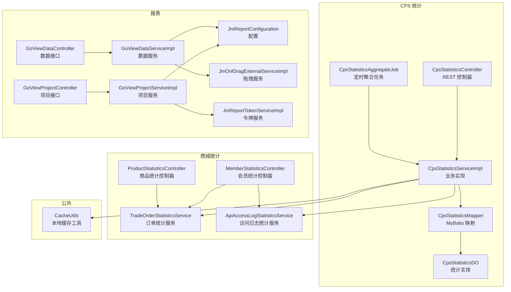
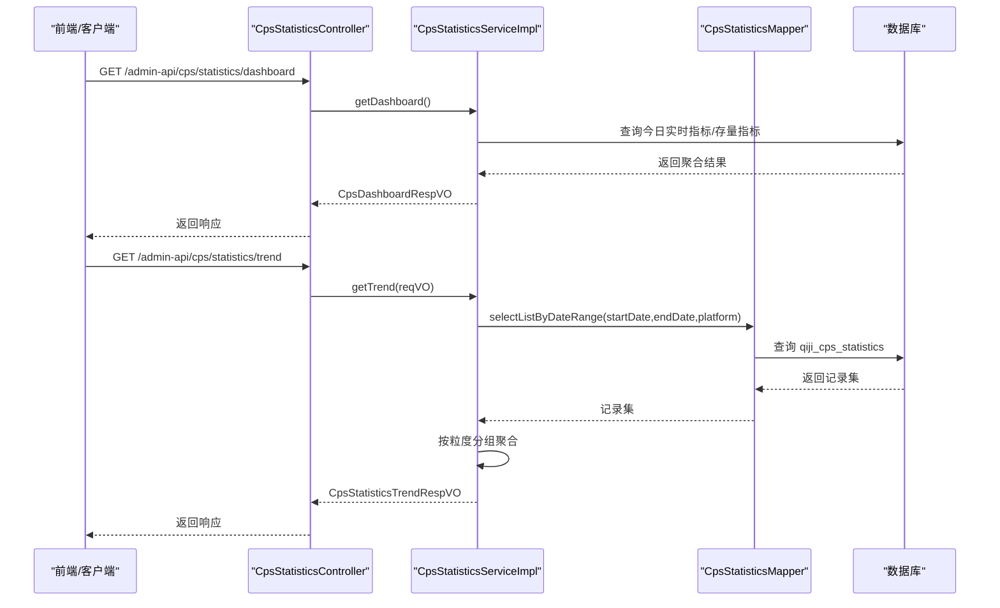
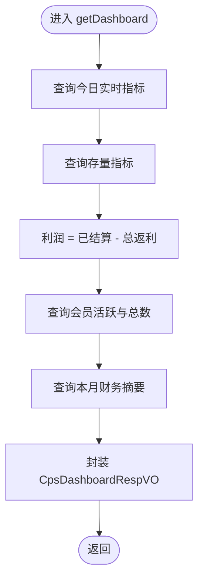
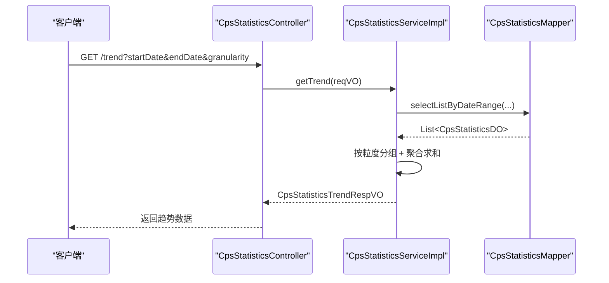
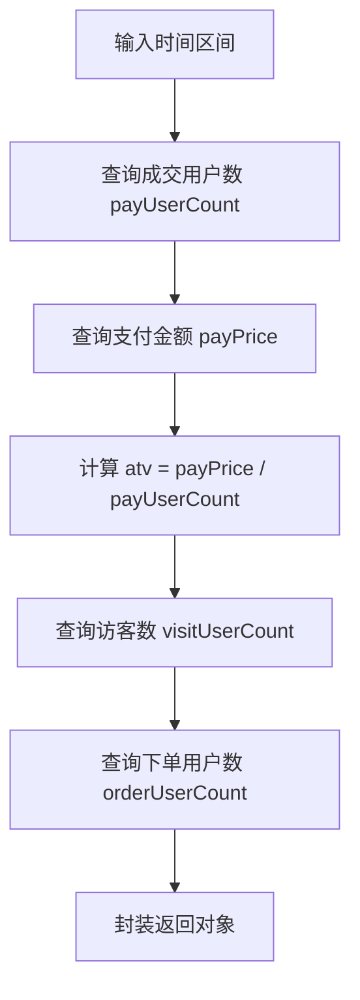
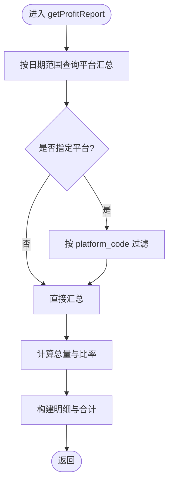
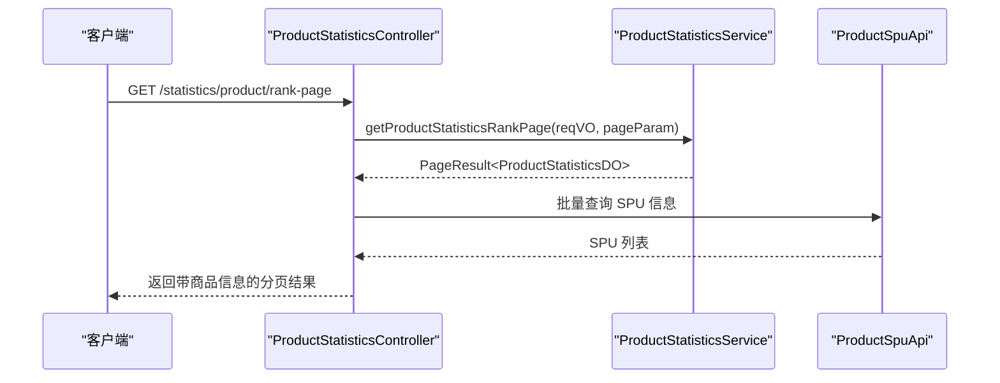
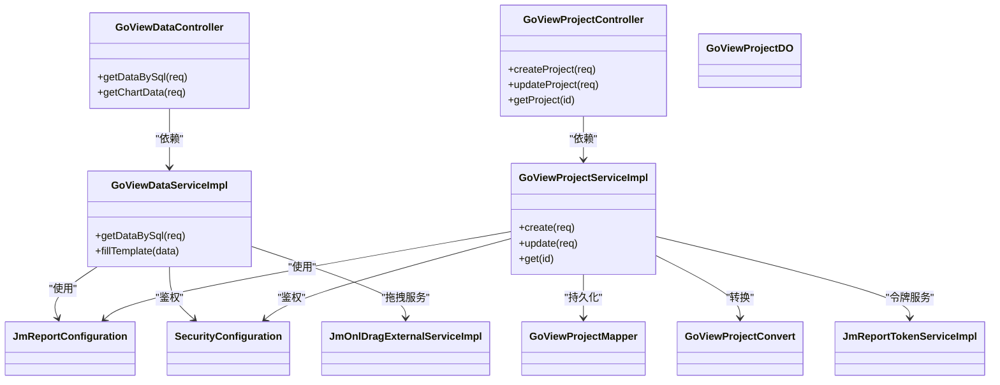
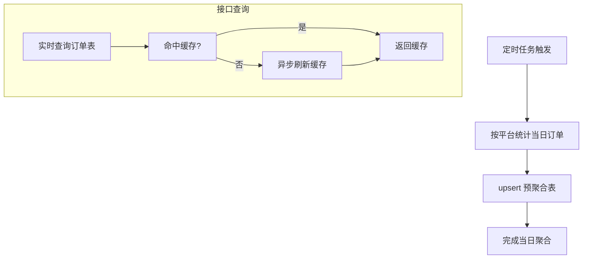
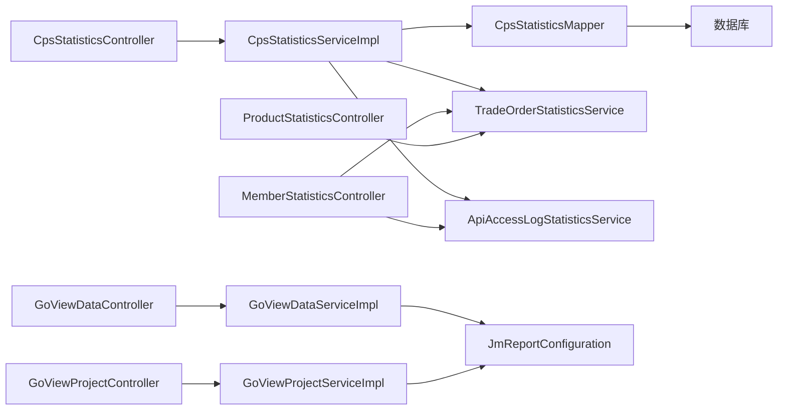

# 销售统计分析

<cite>
**本文引用的文件**   
- [CpsStatisticsController.java](file://qiji-module-cps/qiji-module-cps-biz/src/main/java/cn/zhijian/cps/controller/admin/CpsStatisticsController.java)
- [CpsStatisticsService.java](file://qiji-module-cps/qiji-module-cps-biz/src/main/java/cn/zhijian/cps/service/CpsStatisticsService.java)
- [CpsStatisticsServiceImpl.java](file://qiji-module-cps/qiji-module-cps-biz/src/main/java/cn/zhijian/cps/service/CpsStatisticsServiceImpl.java)
- [CpsStatisticsMapper.java](file://qiji-module-cps/qiji-module-cps-biz/src/main/java/cn/zhijian/cps/dal/mysql/CpsStatisticsMapper.java)
- [CpsStatisticsDO.java](file://qiji-module-cps/qiji-module-cps-biz/src/main/java/cn/zhijian/cps/dal/dataobject/CpsStatisticsDO.java)
- [CpsStatisticsTrendReqVO.java](file://qiji-module-cps/qiji-module-cps-biz/src/main/java/cn/zhijian/cps/controller/admin/vo/statistics/CpsStatisticsTrendReqVO.java)
- [CpsStatisticsTrendRespVO.java](file://qiji-module-cps/qiji-module-cps-biz/src/main/java/cn/zhijian/cps/controller/admin/vo/statistics/CpsStatisticsTrendRespVO.java)
- [CpsDashboardRespVO.java](file://qiji-module-cps/qiji-module-cps-biz/src/main/java/cn/zhijian/cps/controller/admin/vo/statistics/CpsDashboardRespVO.java)
- [CpsProfitReportReqVO.java](file://qiji-module-cps/qiji-module-cps-biz/src/main/java/cn/zhijian/cps/controller/admin/vo/statistics/CpsProfitReportReqVO.java)
- [CpsProfitReportRespVO.java](file://qiji-module-cps/qiji-module-cps-biz/src/main/java/cn/zhijian/cps/controller/admin/vo/statistics/CpsProfitReportRespVO.java)
- [CpsMemberStatisticsRespVO.java](file://qiji-module-cps/qiji-module-cps-biz/src/main/java/cn/zhijian/cps/controller/admin/vo/statistics/CpsMemberStatisticsRespVO.java)
- [CpsStatisticsServiceImplTest.java](file://qiji-module-cps/qiji-module-cps-biz/src/test/java/cn/zhijian/cps/service/CpsStatisticsServiceImplTest.java)
- [MemberStatisticsController.java](file://qiji-module-mall/qiji-module-statistics/src/main/java/com.qiji.cps/module/statistics/controller/admin/member/MemberStatisticsController.java)
- [ProductStatisticsController.java](file://qiji-module-mall/qiji-module-statistics/src/main/java/com.qiji.cps/module/statistics/controller/admin/product/ProductStatisticsController.java)
- [ProductStatisticsRespVO.java](file://qiji-module-mall/qiji-module-statistics/src/main/java/com.qiji.cps/module/statistics/controller/admin/product/vo/ProductStatisticsRespVO.java)
- [TradeOrderStatisticsService.java](file://qiji-module-mall/qiji-module-statistics/src/main/java/com.qiji.cps/module/statistics/service/trade/TradeOrderStatisticsService.java)
- [ApiAccessLogStatisticsService.java](file://qiji-module-mall/qiji-module-statistics/src/main/java/com.qiji.cps/module/statistics/service/infra/ApiAccessLogStatisticsService.java)
- [CacheUtils.java](file://qiji-framework/qiji-common/src/main/java/com.qiji.cps/framework/common/util/cache/CacheUtils.java)
- [CpsStatisticsAggregateJob.java](file://qiji-module-cps/qiji-module-cps-biz/src/main/java/cn/zhijian/cps/job/CpsStatisticsAggregateJob.java)
- [GoViewDataController.java](file://qiji-module-report/src/main/java/com.qiji.cps/module/report/controller/admin/goview/GoViewDataController.java)
- [GoViewProjectController.java](file://qiji-module-report/src/main/java/com.qiji.cps/module/report/controller/admin/goview/GoViewProjectController.java)
- [GoViewDataServiceImpl.java](file://qiji-module-report/src/main/java/com.qiji.cps/module/report/service/goview/GoViewDataServiceImpl.java)
- [GoViewProjectServiceImpl.java](file://qiji-module-report/src/main/java/com.qiji.cps/module/report/service/goview/GoViewProjectServiceImpl.java)
- [GoViewDataGetBySqlReqVO.java](file://qiji-module-report/src/main/java/com.qiji.cps/module/report/controller/admin/goview/vo/data/GoViewDataGetBySqlReqVO.java)
- [GoViewProjectCreateReqVO.java](file://qiji-module-report/src/main/java/com.qiji.cps/module/report/controller/admin/goview/vo/project/GoViewProjectCreateReqVO.java)
- [GoViewProjectUpdateReqVO.java](file://qiji-module-report/src/main/java/com.qiji.cps/module/report/controller/admin/goview/vo/project/GoViewProjectUpdateReqVO.java)
- [GoViewProjectDO.java](file://qiji-module-report/src/main/java/com.qiji.cps/module/report/dal/dataobject/GoViewProjectDO.java)
- [GoViewProjectMapper.java](file://qiji-module-report/src/main/java/com.qiji.cps/module/report/dal/mysql/GoViewProjectMapper.java)
- [GoViewProjectConvert.java](file://qiji-module-report/src/main/java/com.qiji.cps/module/report/convert/goview/GoViewProjectConvert.java)
- [JmReportConfiguration.java](file://qiji-module-report/src/main/java/com.qiji.cps/module/report/framework/jmreport/config/JmReportConfiguration.java)
- [SecurityConfiguration.java](file://qiji-module-report/src/main/java/com.qiji.cps/module/report/framework/security/config/SecurityConfiguration.java)
- [JmOnlDragExternalServiceImpl.java](file://qiji-module-report/src/main/java/com.qiji.cps/module/report/framework/jmreport/core/service/JmOnlDragExternalServiceImpl.java)
- [JmReportTokenServiceImpl.java](file://qiji-module-report/src/main/java/com.qiji.cps/module/report/framework/jmreport/core/service/JmReportTokenServiceImpl.java)
</cite>

## 目录
1. [简介](#简介)
2. [项目结构](#项目结构)
3. [核心组件](#核心组件)
4. [架构总览](#架构总览)
5. [详细组件分析](#详细组件分析)
6. [依赖分析](#依赖分析)
7. [性能考虑](#性能考虑)
8. [故障排查指南](#故障排查指南)
9. [结论](#结论)
10. [附录](#附录)

## 简介
本技术文档围绕销售统计分析功能展开，系统性梳理了销售额、订单量、客单价、转化率等关键指标的计算逻辑，覆盖日/周/月等时间维度聚合，以及平台维度的收益报表。同时，文档阐述了趋势预测、异常检测、报表生成、实时性保障与性能优化策略，帮助读者快速理解并高效扩展销售统计能力。

## 项目结构
销售统计分析功能主要分布在以下模块：
- CPS 统计模块：提供运营看板、趋势分析、会员统计、收益报表与定时聚合。
- 商城统计模块：提供会员维度与商品维度的实时统计与导出。
- 报表模块：提供 GoView 与 JmReport 的集成能力，支撑动态数据填充与可视化。
- 公共缓存工具：提供本地异步刷新缓存能力，辅助提升查询性能。

**图表来源**
- [CpsStatisticsController.java:1-75](file://qiji-module-cps/qiji-module-cps-biz/src/main/java/cn/zhijian/cps/controller/admin/CpsStatisticsController.java#L1-L75)
- [CpsStatisticsServiceImpl.java:1-382](file://qiji-module-cps/qiji-module-cps-biz/src/main/java/cn/zhijian/cps/service/CpsStatisticsServiceImpl.java#L1-L382)
- [CpsStatisticsMapper.java:1-96](file://qiji-module-cps/qiji-module-cps-biz/src/main/java/cn/zhijian/cps/dal/mysql/CpsStatisticsMapper.java#L1-L96)
- [CpsStatisticsDO.java:1-50](file://qiji-module-cps/qiji-module-cps-biz/src/main/java/cn/zhijian/cps/dal/dataobject/CpsStatisticsDO.java#L1-L50)
- [MemberStatisticsController.java:1-115](file://qiji-module-mall/qiji-module-statistics/src/main/java/com.qiji.cps/module/statistics/controller/admin/member/MemberStatisticsController.java#L1-L115)
- [ProductStatisticsController.java:1-87](file://qiji-module-mall/qiji-module-statistics/src/main/java/com.qiji.cps/module/statistics/controller/admin/product/ProductStatisticsController.java#L1-L87)
- [GoViewDataController.java](file://qiji-module-report/src/main/java/com.qiji.cps/module/report/controller/admin/goview/GoViewDataController.java)
- [GoViewProjectController.java](file://qiji-module-report/src/main/java/com.qiji.cps/module/report/controller/admin/goview/GoViewProjectController.java)
- [GoViewDataServiceImpl.java](file://qiji-module-report/src/main/java/com.qiji.cps/module/report/service/goview/GoViewDataServiceImpl.java)
- [GoViewProjectServiceImpl.java](file://qiji-module-report/src/main/java/com.qiji.cps/module/report/service/goview/GoViewProjectServiceImpl.java)
- [CacheUtils.java:1-61](file://qiji-framework/qiji-common/src/main/java/com.qiji.cps/framework/common/util/cache/CacheUtils.java#L1-L61)

**章节来源**
- [CpsStatisticsController.java:1-75](file://qiji-module-cps/qiji-module-cps-biz/src/main/java/cn/zhijian/cps/controller/admin/CpsStatisticsController.java#L1-L75)
- [MemberStatisticsController.java:1-115](file://qiji-module-mall/qiji-module-statistics/src/main/java/com.qiji.cps/module/statistics/controller/admin/member/MemberStatisticsController.java#L1-L115)
- [ProductStatisticsController.java:1-87](file://qiji-module-mall/qiji-module-statistics/src/main/java/com.qiji.cps/module/statistics/controller/admin/product/ProductStatisticsController.java#L1-L87)
- [GoViewDataController.java](file://qiji-module-report/src/main/java/com.qiji.cps/module/report/controller/admin/goview/GoViewDataController.java)
- [GoViewProjectController.java](file://qiji-module-report/src/main/java/com.qiji.cps/module/report/controller/admin/goview/GoViewProjectController.java)
- [CacheUtils.java:1-61](file://qiji-framework/qiji-common/src/main/java/com.qiji.cps/framework/common/util/cache/CacheUtils.java#L1-L61)

## 核心组件
- 运营看板：聚合今日实时指标、存量指标、利润与会员活跃度。
- 趋势分析：按日/周/月粒度对订单量、金额、佣金、返利、利润进行聚合。
- 会员统计：总会员、新增会员、7/30日活跃、有余额会员与TOP返利会员排行。
- 收益报表：按平台分组的佣金、返利、利润与利润率汇总。
- 商品统计：商品维度的访客、下单、支付、退款、转化率等指标。
- 报表系统：基于 GoView/JmReport 的动态数据填充与可视化。
- 实时性保障：定时聚合 + 缓存工具 + 接口层实时聚合。
- 性能优化：预聚合表 + SQL 聚合 + 缓存 + 分页。

**章节来源**
- [CpsStatisticsServiceImpl.java:52-90](file://qiji-module-cps/qiji-module-cps-biz/src/main/java/cn/zhijian/cps/service/CpsStatisticsServiceImpl.java#L52-L90)
- [CpsStatisticsServiceImpl.java:92-124](file://qiji-module-cps/qiji-module-cps-biz/src/main/java/cn/zhijian/cps/service/CpsStatisticsServiceImpl.java#L92-L124)
- [CpsStatisticsServiceImpl.java:126-156](file://qiji-module-cps/qiji-module-cps-biz/src/main/java/cn/zhijian/cps/service/CpsStatisticsServiceImpl.java#L126-L156)
- [CpsStatisticsServiceImpl.java:158-219](file://qiji-module-cps/qiji-module-cps-biz/src/main/java/cn/zhijian/cps/service/CpsStatisticsServiceImpl.java#L158-L219)
- [MemberStatisticsController.java:42-75](file://qiji-module-mall/qiji-module-statistics/src/main/java/com.qiji.cps/module/statistics/controller/admin/member/MemberStatisticsController.java#L42-L75)
- [ProductStatisticsController.java:48-85](file://qiji-module-mall/qiji-module-statistics/src/main/java/com.qiji.cps/module/statistics/controller/admin/product/ProductStatisticsController.java#L48-L85)

## 架构总览
销售统计分析采用“接口层 → 业务层 → 数据访问层 → 数据存储”的分层架构，并结合预聚合表与缓存提升查询性能。CPS 统计模块负责核心指标与趋势分析，商城统计模块补充会员与商品维度，报表模块提供可视化与动态数据填充。

**图表来源**
- [CpsStatisticsController.java:42-56](file://qiji-module-cps/qiji-module-cps-biz/src/main/java/cn/zhijian/cps/controller/admin/CpsStatisticsController.java#L42-L56)
- [CpsStatisticsServiceImpl.java:52-90](file://qiji-module-cps/qiji-module-cps-biz/src/main/java/cn/zhijian/cps/service/CpsStatisticsServiceImpl.java#L52-L90)
- [CpsStatisticsServiceImpl.java:92-124](file://qiji-module-cps/qiji-module-cps-biz/src/main/java/cn/zhijian/cps/service/CpsStatisticsServiceImpl.java#L92-L124)
- [CpsStatisticsMapper.java:27-32](file://qiji-module-cps/qiji-module-cps-biz/src/main/java/cn/zhijian/cps/dal/mysql/CpsStatisticsMapper.java#L27-L32)

**章节来源**
- [CpsStatisticsController.java:1-75](file://qiji-module-cps/qiji-module-cps-biz/src/main/java/cn/zhijian/cps/controller/admin/CpsStatisticsController.java#L1-L75)
- [CpsStatisticsServiceImpl.java:1-382](file://qiji-module-cps/qiji-module-cps-biz/src/main/java/cn/zhijian/cps/service/CpsStatisticsServiceImpl.java#L1-L382)
- [CpsStatisticsMapper.java:1-96](file://qiji-module-cps/qiji-module-cps-biz/src/main/java/cn/zhijian/cps/dal/mysql/CpsStatisticsMapper.java#L1-L96)

## 详细组件分析

### 运营看板（Dashboard）
- 今日实时指标：今日订单数、金额、佣金、返利。
- 存量指标：待结算、已结算佣金与总返利。
- 利润：已结算佣金 - 总返利。
- 会员活跃：7/30日活跃与总会员数。
- 本月指标：订单数、佣金、返利、利润。

**图表来源**
- [CpsStatisticsServiceImpl.java:52-90](file://qiji-module-cps/qiji-module-cps-biz/src/main/java/cn/zhijian/cps/service/CpsStatisticsServiceImpl.java#L52-L90)

**章节来源**
- [CpsStatisticsServiceImpl.java:52-90](file://qiji-module-cps/qiji-module-cps-biz/src/main/java/cn/zhijian/cps/service/CpsStatisticsServiceImpl.java#L52-L90)

### 趋势分析（Trend）
- 输入：起止日期、平台编码、时间粒度（day/week/month）。
- 流程：从预聚合表按日期范围查询，按粒度格式化日期标签并聚合。
- 输出：按日期升序排列的趋势项集合。

**图表来源**
- [CpsStatisticsController.java:50-56](file://qiji-module-cps/qiji-module-cps-biz/src/main/java/cn/zhijian/cps/controller/admin/CpsStatisticsController.java#L50-L56)
- [CpsStatisticsServiceImpl.java:92-124](file://qiji-module-cps/qiji-module-cps-biz/src/main/java/cn/zhijian/cps/service/CpsStatisticsServiceImpl.java#L92-L124)
- [CpsStatisticsMapper.java:27-32](file://qiji-module-cps/qiji-module-cps-biz/src/main/java/cn/zhijian/cps/dal/mysql/CpsStatisticsMapper.java#L27-L32)

**章节来源**
- [CpsStatisticsTrendReqVO.java:1-30](file://qiji-module-cps/qiji-module-cps-biz/src/main/java/cn/zhijian/cps/controller/admin/vo/statistics/CpsStatisticsTrendReqVO.java#L1-L30)
- [CpsStatisticsServiceImpl.java:92-124](file://qiji-module-cps/qiji-module-cps-biz/src/main/java/cn/zhijian/cps/service/CpsStatisticsServiceImpl.java#L92-L124)
- [CpsStatisticsServiceImplTest.java:116-160](file://qiji-module-cps/qiji-module-cps-biz/src/test/java/cn/zhijian/cps/service/CpsStatisticsServiceImplTest.java#L116-L160)

### 会员统计（Member）
- 指标：总会员、今日新增、7/30日活跃、有余额会员。
- TOP10返利会员：按可用余额与订单数展示。
- 客单价：支付金额 ÷ 成交用户数。

**图表来源**
- [MemberStatisticsController.java:54-75](file://qiji-module-mall/qiji-module-statistics/src/main/java/com.qiji.cps/module/statistics/controller/admin/member/MemberStatisticsController.java#L54-L75)
- [TradeOrderStatisticsService.java](file://qiji-module-mall/qiji-module-statistics/src/main/java/com.qiji.cps/module/statistics/service/trade/TradeOrderStatisticsService.java)
- [ApiAccessLogStatisticsService.java](file://qiji-module-mall/qiji-module-statistics/src/main/java/com.qiji.cps/module/statistics/service/infra/ApiAccessLogStatisticsService.java)

**章节来源**
- [MemberStatisticsController.java:42-75](file://qiji-module-mall/qiji-module-statistics/src/main/java/com.qiji.cps/module/statistics/controller/admin/member/MemberStatisticsController.java#L42-L75)

### 收益报表（Profit Report）
- 按平台分组汇总：订单数、金额、佣金、返利、利润。
- 计算利润率与佣金占比。
- 支持按日期范围与平台筛选。

**图表来源**
- [CpsStatisticsServiceImpl.java:158-219](file://qiji-module-cps/qiji-module-cps-biz/src/main/java/cn/zhijian/cps/service/CpsStatisticsServiceImpl.java#L158-L219)
- [CpsStatisticsMapper.java:57-75](file://qiji-module-cps/qiji-module-cps-biz/src/main/java/cn/zhijian/cps/dal/mysql/CpsStatisticsMapper.java#L57-L75)

**章节来源**
- [CpsStatisticsServiceImpl.java:158-219](file://qiji-module-cps/qiji-module-cps-biz/src/main/java/cn/zhijian/cps/service/CpsStatisticsServiceImpl.java#L158-L219)
- [CpsProfitReportReqVO.java](file://qiji-module-cps/qiji-module-cps-biz/src/main/java/cn/zhijian/cps/controller/admin/vo/statistics/CpsProfitReportReqVO.java)
- [CpsProfitReportRespVO.java](file://qiji-module-cps/qiji-module-cps-biz/src/main/java/cn/zhijian/cps/controller/admin/vo/statistics/CpsProfitReportRespVO.java)

### 商品统计（Product）
- 提供商品维度的分析、列表、排行榜与导出。
- 指标示例：支付件数、支付金额、退款件数、退款金额、访客支付转化率。

**图表来源**
- [ProductStatisticsController.java:73-85](file://qiji-module-mall/qiji-module-statistics/src/main/java/com.qiji.cps/module/statistics/controller/admin/product/ProductStatisticsController.java#L73-L85)
- [ProductStatisticsRespVO.java:63-81](file://qiji-module-mall/qiji-module-statistics/src/main/java/com.qiji.cps/module/statistics/controller/admin/product/vo/ProductStatisticsRespVO.java#L63-L81)

**章节来源**
- [ProductStatisticsController.java:48-85](file://qiji-module-mall/qiji-module-statistics/src/main/java/com.qiji.cps/module/statistics/controller/admin/product/ProductStatisticsController.java#L48-L85)
- [ProductStatisticsRespVO.java:63-81](file://qiji-module-mall/qiji-module-statistics/src/main/java/com.qiji.cps/module/statistics/controller/admin/product/vo/ProductStatisticsRespVO.java#L63-L81)

### 报表系统（GoView/JmReport）
- 动态数据填充：通过 SQL 请求获取数据，支持 GoView 项目与数据接口。
- 项目管理：创建、更新 GoView 项目。
- 安全与配置：安全配置与令牌服务，拖拽外部服务集成。

**图表来源**
- [GoViewDataController.java](file://qiji-module-report/src/main/java/com.qiji.cps/module/report/controller/admin/goview/GoViewDataController.java)
- [GoViewProjectController.java](file://qiji-module-report/src/main/java/com.qiji.cps/module/report/controller/admin/goview/GoViewProjectController.java)
- [GoViewDataServiceImpl.java](file://qiji-module-report/src/main/java/com.qiji.cps/module/report/service/goview/GoViewDataServiceImpl.java)
- [GoViewProjectServiceImpl.java](file://qiji-module-report/src/main/java/com.qiji.cps/module/report/service/goview/GoViewProjectServiceImpl.java)
- [GoViewProjectDO.java](file://qiji-module-report/src/main/java/com.qiji.cps/module/report/dal/dataobject/GoViewProjectDO.java)
- [GoViewProjectMapper.java](file://qiji-module-report/src/main/java/com.qiji.cps/module/report/dal/mysql/GoViewProjectMapper.java)
- [GoViewProjectConvert.java](file://qiji-module-report/src/main/java/com.qiji.cps/module/report/convert/goview/GoViewProjectConvert.java)
- [JmReportConfiguration.java](file://qiji-module-report/src/main/java/com.qiji.cps/module/report/framework/jmreport/config/JmReportConfiguration.java)
- [SecurityConfiguration.java](file://qiji-module-report/src/main/java/com.qiji.cps/module/report/framework/security/config/SecurityConfiguration.java)
- [JmOnlDragExternalServiceImpl.java](file://qiji-module-report/src/main/java/com.qiji.cps/module/report/framework/jmreport/core/service/JmOnlDragExternalServiceImpl.java)
- [JmReportTokenServiceImpl.java](file://qiji-module-report/src/main/java/com.qiji.cps/module/report/framework/jmreport/core/service/JmReportTokenServiceImpl.java)

**章节来源**
- [GoViewDataController.java](file://qiji-module-report/src/main/java/com.qiji.cps/module/report/controller/admin/goview/GoViewDataController.java)
- [GoViewProjectController.java](file://qiji-module-report/src/main/java/com.qiji.cps/module/report/controller/admin/goview/GoViewProjectController.java)
- [GoViewDataServiceImpl.java](file://qiji-module-report/src/main/java/com.qiji.cps/module/report/service/goview/GoViewDataServiceImpl.java)
- [GoViewProjectServiceImpl.java](file://qiji-module-report/src/main/java/com.qiji.cps/module/report/service/goview/GoViewProjectServiceImpl.java)

### 实时性保障与缓存
- 定时聚合：每日定时任务将订单数据按平台与日期聚合到 qiji_cps_statistics。
- 接口实时：运营看板与部分趋势数据从订单表实时聚合，保证最新数据。
- 本地缓存：使用 Guava Cache 提供异步刷新与最大容量控制，降低热点查询压力。

**图表来源**
- [CpsStatisticsServiceImpl.java:221-268](file://qiji-module-cps/qiji-module-cps-biz/src/main/java/cn/zhijian/cps/service/CpsStatisticsServiceImpl.java#L221-L268)
- [CacheUtils.java:37-59](file://qiji-framework/qiji-common/src/main/java/com.qiji.cps/framework/common/util/cache/CacheUtils.java#L37-L59)

**章节来源**
- [CpsStatisticsAggregateJob.java](file://qiji-module-cps/qiji-module-cps-biz/src/main/java/cn/zhijian/cps/job/CpsStatisticsAggregateJob.java)
- [CacheUtils.java:1-61](file://qiji-framework/qiji-common/src/main/java/com.qiji.cps/framework/common/util/cache/CacheUtils.java#L1-L61)

## 依赖分析
- 控制器依赖业务服务；业务服务依赖映射器与服务接口；映射器依赖数据库。
- 会员统计与商品统计依赖订单与访问日志统计服务。
- 报表模块依赖配置与安全组件，提供数据服务与项目服务。

**图表来源**
- [CpsStatisticsController.java:1-75](file://qiji-module-cps/qiji-module-cps-biz/src/main/java/cn/zhijian/cps/controller/admin/CpsStatisticsController.java#L1-L75)
- [CpsStatisticsServiceImpl.java:1-382](file://qiji-module-cps/qiji-module-cps-biz/src/main/java/cn/zhijian/cps/service/CpsStatisticsServiceImpl.java#L1-L382)
- [MemberStatisticsController.java:1-115](file://qiji-module-mall/qiji-module-statistics/src/main/java/com.qiji.cps/module/statistics/controller/admin/member/MemberStatisticsController.java#L1-L115)
- [ProductStatisticsController.java:1-87](file://qiji-module-mall/qiji-module-statistics/src/main/java/com.qiji.cps/module/statistics/controller/admin/product/ProductStatisticsController.java#L1-L87)
- [GoViewDataController.java](file://qiji-module-report/src/main/java/com.qiji.cps/module/report/controller/admin/goview/GoViewDataController.java)
- [GoViewProjectController.java](file://qiji-module-report/src/main/java/com.qiji.cps/module/report/controller/admin/goview/GoViewProjectController.java)

**章节来源**
- [CpsStatisticsController.java:1-75](file://qiji-module-cps/qiji-module-cps-biz/src/main/java/cn/zhijian/cps/controller/admin/CpsStatisticsController.java#L1-L75)
- [MemberStatisticsController.java:1-115](file://qiji-module-mall/qiji-module-statistics/src/main/java/com.qiji.cps/module/statistics/controller/admin/member/MemberStatisticsController.java#L1-L115)
- [ProductStatisticsController.java:1-87](file://qiji-module-mall/qiji-module-statistics/src/main/java/com.qiji.cps/module/statistics/controller/admin/product/ProductStatisticsController.java#L1-L87)
- [GoViewDataController.java](file://qiji-module-report/src/main/java/com.qiji.cps/module/report/controller/admin/goview/GoViewDataController.java)
- [GoViewProjectController.java](file://qiji-module-report/src/main/java/com.qiji.cps/module/report/controller/admin/goview/GoViewProjectController.java)

## 性能考虑
- 预聚合表：将高频查询的聚合结果写入 qiji_cps_statistics，减少在线交易表的复杂聚合。
- SQL 聚合：在映射器中使用原生 SQL 进行 SUM/GROUP BY，避免应用层二次聚合。
- 缓存策略：使用异步刷新缓存，设置最大容量与过期时间，降低热点查询延迟。
- 分页与排序：接口层使用分页参数与排序字段，避免一次性返回大量数据。
- 定时任务：每日定时聚合，确保趋势与报表的稳定性与一致性。

**章节来源**
- [CpsStatisticsMapper.java:46-93](file://qiji-module-cps/qiji-module-cps-biz/src/main/java/cn/zhijian/cps/dal/mysql/CpsStatisticsMapper.java#L46-L93)
- [CacheUtils.java:37-59](file://qiji-framework/qiji-common/src/main/java/com.qiji.cps/framework/common/util/cache/CacheUtils.java#L37-L59)
- [CpsStatisticsServiceImpl.java:221-268](file://qiji-module-cps/qiji-module-cps-biz/src/main/java/cn/zhijian/cps/service/CpsStatisticsServiceImpl.java#L221-L268)

## 故障排查指南
- 看板指标为空：检查订单表实时聚合查询是否返回空，确认定时聚合任务是否执行。
- 趋势数据缺失：确认预聚合表是否存在目标日期与平台记录，核对粒度格式化逻辑。
- 收益报表异常：检查平台汇总 SQL 是否正确过滤 total 平台，确认日期范围与平台筛选条件。
- 报表数据不更新：确认 GoView 数据服务是否正确执行 SQL，检查项目与令牌配置。
- 缓存问题：检查缓存过期时间与异步刷新线程池配置，必要时清理缓存后重试。

**章节来源**
- [CpsStatisticsServiceImplTest.java:105-114](file://qiji-module-cps/qiji-module-cps-biz/src/test/java/cn/zhijian/cps/service/CpsStatisticsServiceImplTest.java#L105-L114)
- [CpsStatisticsServiceImpl.java:313-324](file://qiji-module-cps/qiji-module-cps-biz/src/main/java/cn/zhijian/cps/service/CpsStatisticsServiceImpl.java#L313-L324)
- [GoViewDataServiceImpl.java](file://qiji-module-report/src/main/java/com.qiji.cps/module/report/service/goview/GoViewDataServiceImpl.java)
- [CacheUtils.java:37-59](file://qiji-framework/qiji-common/src/main/java/com.qiji.cps/framework/common/util/cache/CacheUtils.java#L37-L59)

## 结论
本销售统计分析体系以预聚合表为核心，结合接口层实时聚合与报表系统，实现了高性能、可扩展的销售数据分析能力。通过明确的时间粒度与平台维度聚合，配合会员与商品维度的补充分析，能够满足多场景的销售洞察需求。建议持续完善趋势预测与异常检测能力，并进一步优化缓存与查询策略以应对更大规模的数据增长。

## 附录
- 关键指标计算要点
  - 客单价：支付金额 ÷ 成交用户数
  - 转化率：成交用户数 ÷ 访客数（可按商品维度计算访客支付转化率）
  - 利润率：利润 ÷ 佣金（收益报表中按平台与合计维度计算）
- 时间粒度
  - day：按自然日聚合
  - week：按 ISO 周格式 yyyy-WW 聚合
  - month：按 yyyy-MM 聚合