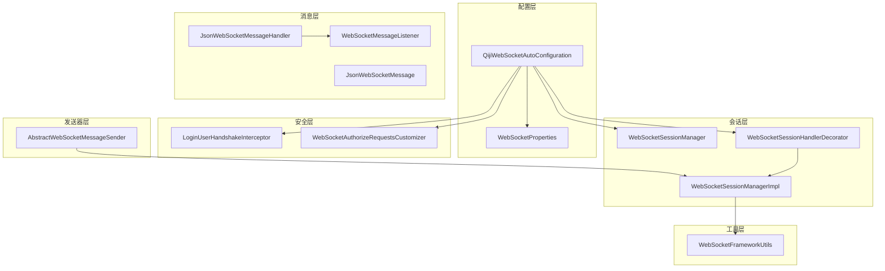
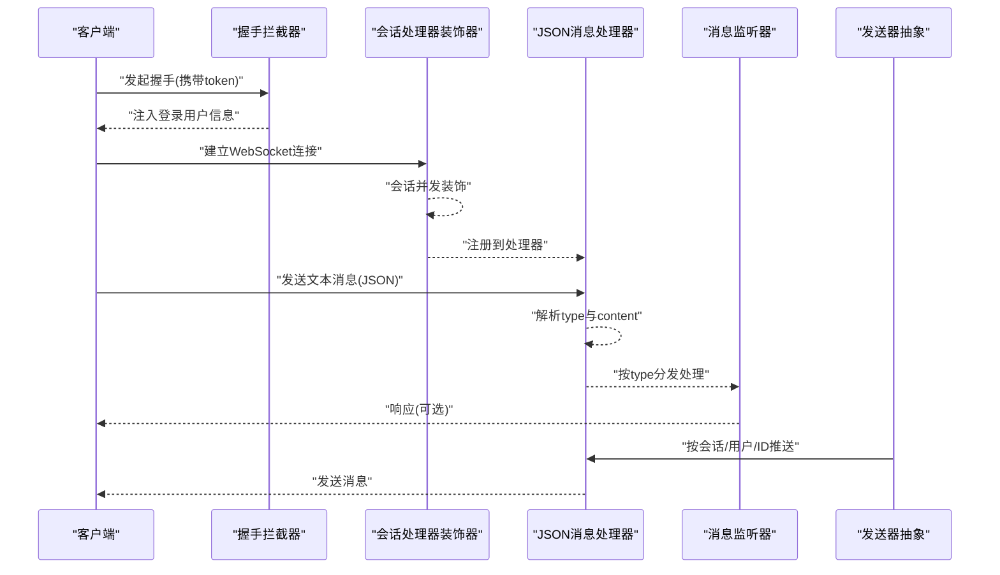
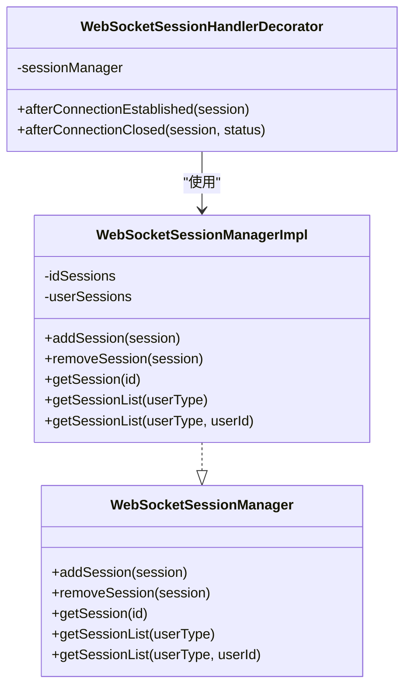
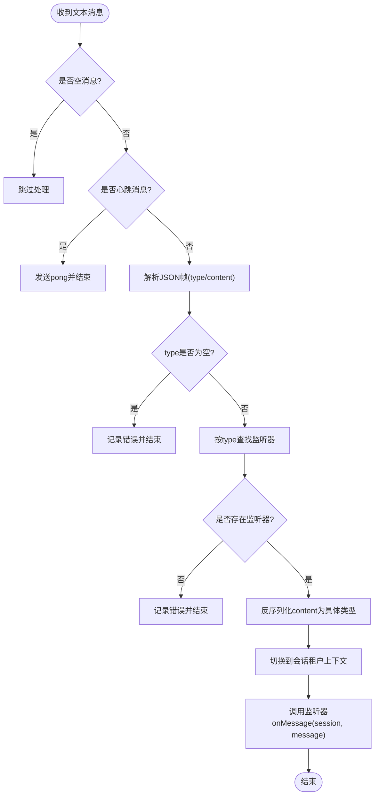
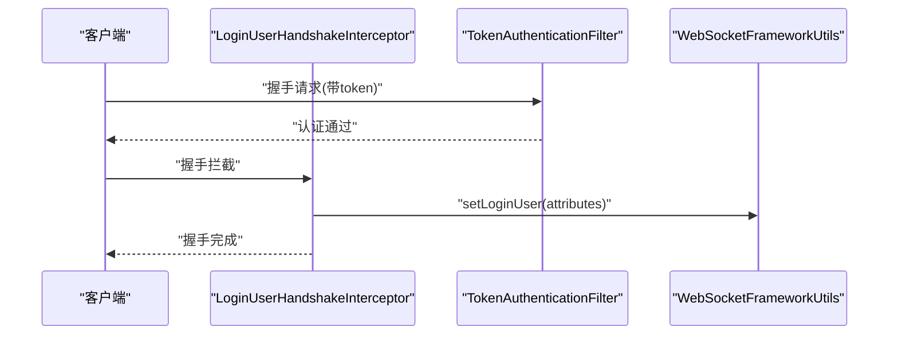
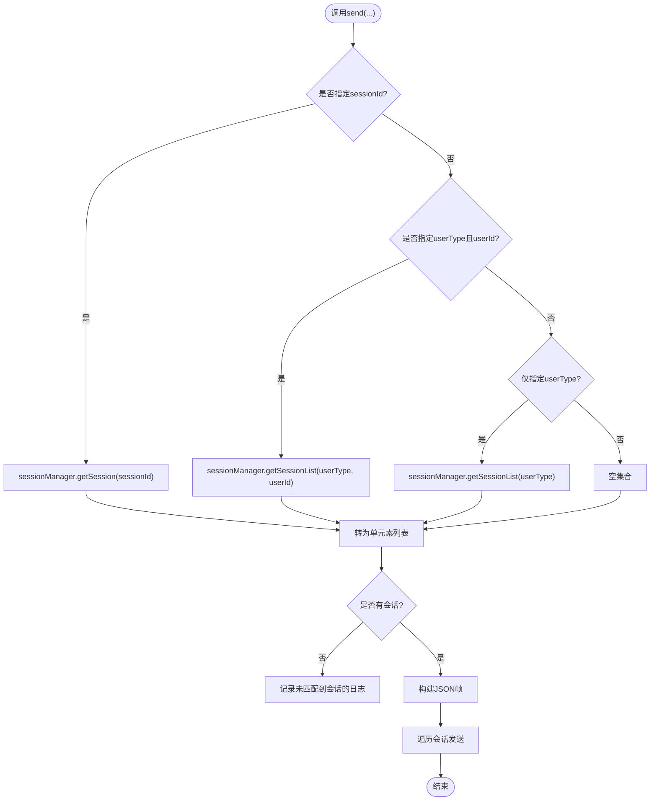
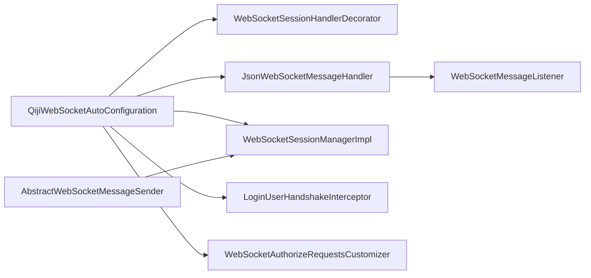

# WebSocket通信

<cite>
**本文引用的文件**
- [WebSocketSessionManager.java](file://qiji-framework/qiji-spring-boot-starter-websocket/src/main/java/com.qiji.cps/framework/websocket/core/session/WebSocketSessionManager.java)
- [WebSocketSessionManagerImpl.java](file://qiji-framework/qiji-spring-boot-starter-websocket/src/main/java/com.qiji.cps/framework/websocket/core/session/WebSocketSessionManagerImpl.java)
- [WebSocketSessionHandlerDecorator.java](file://qiji-framework/qiji-spring-boot-starter-websocket/src/main/java/com.qiji.cps/framework/websocket/core/session/WebSocketSessionHandlerDecorator.java)
- [QijiWebSocketAutoConfiguration.java](file://qiji-framework/qiji-spring-boot-starter-websocket/src/main/java/com.qiji.cps/framework/websocket/config/QijiWebSocketAutoConfiguration.java)
- [JsonWebSocketMessageHandler.java](file://qiji-framework/qiji-spring-boot-starter-websocket/src/main/java/com.qiji.cps/framework/websocket/core/handler/JsonWebSocketMessageHandler.java)
- [JsonWebSocketMessage.java](file://qiji-framework/qiji-spring-boot-starter-websocket/src/main/java/com.qiji.cps/framework/websocket/core/message/JsonWebSocketMessage.java)
- [WebSocketMessageListener.java](file://qiji-framework/qiji-spring-boot-starter-websocket/src/main/java/com.qiji.cps/framework/websocket/core/listener/WebSocketMessageListener.java)
- [WebSocketProperties.java](file://qiji-framework/qiji-spring-boot-starter-websocket/src/main/java/com.qiji.cps/framework/websocket/config/WebSocketProperties.java)
- [LoginUserHandshakeInterceptor.java](file://qiji-framework/qiji-spring-boot-starter-websocket/src/main/java/com.qiji.cps/framework/websocket/core/security/LoginUserHandshakeInterceptor.java)
- [WebSocketAuthorizeRequestsCustomizer.java](file://qiji-framework/qiji-spring-boot-starter-websocket/src/main/java/com.qiji.cps/framework/websocket/core/security/WebSocketAuthorizeRequestsCustomizer.java)
- [AbstractWebSocketMessageSender.java](file://qiji-framework/qiji-spring-boot-starter-websocket/src/main/java/com.qiji.cps/framework/websocket/core/sender/AbstractWebSocketMessageSender.java)
- [WebSocketFrameworkUtils.java](file://qiji-framework/qiji-spring-boot-starter-websocket/src/main/java/com.qiji.cps/framework/websocket/core/util/WebSocketFrameworkUtils.java)
- [org.springframework.boot.autoconfigure.AutoConfiguration.imports](file://qiji-framework/qiji-spring-boot-starter-websocket/src/main/resources/META-INF/spring/org.springframework.boot.autoconfigure.AutoConfiguration.imports)
</cite>

## 目录
1. [简介](#简介)
2. [项目结构](#项目结构)
3. [核心组件](#核心组件)
4. [架构总览](#架构总览)
5. [详细组件分析](#详细组件分析)
6. [依赖分析](#依赖分析)
7. [性能考虑](#性能考虑)
8. [故障排查指南](#故障排查指南)
9. [结论](#结论)
10. [附录](#附录)

## 简介
本技术文档围绕 WebSocket 实时通信能力进行系统化梳理，覆盖连接建立、消息传输、会话管理、消息监听与分发、安全控制、消息发送器（本地/多消息中间件）、以及配置项等内容。目标是帮助开发者快速理解并高效实现点对点、广播、群组等消息推送场景，并在多租户、并发、异常处理等方面具备工程化落地能力。

## 项目结构
WebSocket 能力位于 qiji-spring-boot-starter-websocket 模块中，采用“自动装配 + 分层职责”的组织方式：
- 配置层：自动装配与属性配置
- 会话层：连接生命周期管理与并发封装
- 消息层：消息解析、监听与分发
- 安全层：握手拦截与鉴权
- 发送器层：本地与多消息中间件（Redis/RocketMQ/Kafka/RabbitMQ）的统一抽象
- 工具层：会话与登录用户上下文工具

图表来源
- [QijiWebSocketAutoConfiguration.java:1-183](file://qiji-framework/qiji-spring-boot-starter-websocket/src/main/java/com.qiji.cps/framework/websocket/config/QijiWebSocketAutoConfiguration.java#L1-L183)
- [WebSocketSessionManager.java:1-53](file://qiji-framework/qiji-spring-boot-starter-websocket/src/main/java/com.qiji.cps/framework/websocket/core/session/WebSocketSessionManager.java#L1-L53)
- [WebSocketSessionManagerImpl.java:1-126](file://qiji-framework/qiji-spring-boot-starter-websocket/src/main/java/com.qiji.cps/framework/websocket/core/session/WebSocketSessionManagerImpl.java#L1-L126)
- [WebSocketSessionHandlerDecorator.java:1-50](file://qiji-framework/qiji-spring-boot-starter-websocket/src/main/java/com.qiji.cps/framework/websocket/core/session/WebSocketSessionHandlerDecorator.java#L1-L50)
- [JsonWebSocketMessageHandler.java:1-84](file://qiji-framework/qiji-spring-boot-starter-websocket/src/main/java/com.qiji.cps/framework/websocket/core/handler/JsonWebSocketMessageHandler.java#L1-L84)
- [JsonWebSocketMessage.java:1-30](file://qiji-framework/qiji-spring-boot-starter-websocket/src/main/java/com.qiji.cps/framework/websocket/core/message/JsonWebSocketMessage.java#L1-L30)
- [WebSocketMessageListener.java:1-32](file://qiji-framework/qiji-spring-boot-starter-websocket/src/main/java/com.qiji.cps/framework/websocket/core/listener/WebSocketMessageListener.java#L1-L32)
- [LoginUserHandshakeInterceptor.java:1-43](file://qiji-framework/qiji-spring-boot-starter-websocket/src/main/java/com.qiji.cps/framework/websocket/core/security/LoginUserHandshakeInterceptor.java#L1-L43)
- [WebSocketAuthorizeRequestsCustomizer.java:1-25](file://qiji-framework/qiji-spring-boot-starter-websocket/src/main/java/com.qiji.cps/framework/websocket/core/security/WebSocketAuthorizeRequestsCustomizer.java#L1-L25)
- [AbstractWebSocketMessageSender.java:1-107](file://qiji-framework/qiji-spring-boot-starter-websocket/src/main/java/com.qiji.cps/framework/websocket/core/sender/AbstractWebSocketMessageSender.java#L1-L107)
- [WebSocketFrameworkUtils.java:1-68](file://qiji-framework/qiji-spring-boot-starter-websocket/src/main/java/com.qiji.cps/framework/websocket/core/util/WebSocketFrameworkUtils.java#L1-L68)

章节来源
- [QijiWebSocketAutoConfiguration.java:1-183](file://qiji-framework/qiji-spring-boot-starter-websocket/src/main/java/com.qiji.cps/framework/websocket/config/QijiWebSocketAutoConfiguration.java#L1-L183)
- [org.springframework.boot.autoconfigure.AutoConfiguration.imports:1-1](file://qiji-framework/qiji-spring-boot-starter-websocket/src/main/resources/META-INF/spring/org.springframework.boot.autoconfigure.AutoConfiguration.imports#L1-L1)

## 核心组件
- 会话管理器接口与实现：负责会话的注册、注销、按用户维度查询与租户隔离
- 会话处理器装饰器：在连接建立/关闭时注入会话管理，在并发场景下对会话进行装饰
- 消息处理器：基于 JSON 文本消息，按消息类型分发至监听器
- 消息监听器接口：定义消息类型与处理方法，支持泛型消息对象
- 消息模型：统一的 JSON 帧结构（type/content）
- 安全拦截器与鉴权定制：握手阶段注入登录用户信息；授权策略允许 WebSocket 路径放行
- 发送器抽象：统一对点对点/按用户类型/按会话 ID 的消息发送流程
- 工具类：会话属性中存取登录用户、获取用户与租户标识

章节来源
- [WebSocketSessionManager.java:1-53](file://qiji-framework/qiji-spring-boot-starter-websocket/src/main/java/com.qiji.cps/framework/websocket/core/session/WebSocketSessionManager.java#L1-L53)
- [WebSocketSessionManagerImpl.java:1-126](file://qiji-framework/qiji-spring-boot-starter-websocket/src/main/java/com.qiji.cps/framework/websocket/core/session/WebSocketSessionManagerImpl.java#L1-L126)
- [WebSocketSessionHandlerDecorator.java:1-50](file://qiji-framework/qiji-spring-boot-starter-websocket/src/main/java/com.qiji.cps/framework/websocket/core/session/WebSocketSessionHandlerDecorator.java#L1-L50)
- [JsonWebSocketMessageHandler.java:1-84](file://qiji-framework/qiji-spring-boot-starter-websocket/src/main/java/com.qiji.cps/framework/websocket/core/handler/JsonWebSocketMessageHandler.java#L1-L84)
- [JsonWebSocketMessage.java:1-30](file://qiji-framework/qiji-spring-boot-starter-websocket/src/main/java/com.qiji.cps/framework/websocket/core/message/JsonWebSocketMessage.java#L1-L30)
- [WebSocketMessageListener.java:1-32](file://qiji-framework/qiji-spring-boot-starter-websocket/src/main/java/com.qiji.cps/framework/websocket/core/listener/WebSocketMessageListener.java#L1-L32)
- [LoginUserHandshakeInterceptor.java:1-43](file://qiji-framework/qiji-spring-boot-starter-websocket/src/main/java/com.qiji.cps/framework/websocket/core/security/LoginUserHandshakeInterceptor.java#L1-L43)
- [WebSocketAuthorizeRequestsCustomizer.java:1-25](file://qiji-framework/qiji-spring-boot-starter-websocket/src/main/java/com.qiji.cps/framework/websocket/core/security/WebSocketAuthorizeRequestsCustomizer.java#L1-L25)
- [AbstractWebSocketMessageSender.java:1-107](file://qiji-framework/qiji-spring-boot-starter-websocket/src/main/java/com.qiji.cps/framework/websocket/core/sender/AbstractWebSocketMessageSender.java#L1-L107)
- [WebSocketFrameworkUtils.java:1-68](file://qiji-framework/qiji-spring-boot-starter-websocket/src/main/java/com.qiji.cps/framework/websocket/core/util/WebSocketFrameworkUtils.java#L1-L68)

## 架构总览
WebSocket 在服务端的运行链路如下：
- 自动装配注册 WebSocket 路径、握手拦截器、消息处理器与会话管理器
- 握手阶段注入登录用户信息，开启并发安全的会话装饰
- 建立连接后，消息处理器解析 JSON 帧，按 type 分发到对应监听器
- 发送侧通过抽象发送器，支持按会话 ID、用户类型、用户 ID 等维度推送
- 多消息中间件发送器作为扩展，实现跨进程/集群的消息广播

图表来源
- [QijiWebSocketAutoConfiguration.java:49-78](file://qiji-framework/qiji-spring-boot-starter-websocket/src/main/java/com.qiji.cps/framework/websocket/config/QijiWebSocketAutoConfiguration.java#L49-L78)
- [WebSocketSessionHandlerDecorator.java:36-47](file://qiji-framework/qiji-spring-boot-starter-websocket/src/main/java/com.qiji.cps/framework/websocket/core/session/WebSocketSessionHandlerDecorator.java#L36-L47)
- [JsonWebSocketMessageHandler.java:44-81](file://qiji-framework/qiji-spring-boot-starter-websocket/src/main/java/com.qiji.cps/framework/websocket/core/handler/JsonWebSocketMessageHandler.java#L44-L81)
- [AbstractWebSocketMessageSender.java:53-74](file://qiji-framework/qiji-spring-boot-starter-websocket/src/main/java/com.qiji.cps/framework/websocket/core/sender/AbstractWebSocketMessageSender.java#L53-L74)

## 详细组件分析

### 会话管理与连接生命周期
- 会话注册与注销：在连接建立时加入管理器，在连接关闭时移除
- 并发安全：对会话进行装饰，限制发送耗时与缓冲区大小
- 按用户维度检索：支持按用户类型、用户 ID 查询会话列表，便于点对点/群组推送
- 租户隔离：查询时根据上下文租户 ID 过滤，避免跨租户消息泄露

图表来源
- [WebSocketSessionManager.java:12-53](file://qiji-framework/qiji-spring-boot-starter-websocket/src/main/java/com.qiji.cps/framework/websocket/core/session/WebSocketSessionManager.java#L12-L53)
- [WebSocketSessionManagerImpl.java:22-126](file://qiji-framework/qiji-spring-boot-starter-websocket/src/main/java/com.qiji.cps/framework/websocket/core/session/WebSocketSessionManagerImpl.java#L22-L126)
- [WebSocketSessionHandlerDecorator.java:17-47](file://qiji-framework/qiji-spring-boot-starter-websocket/src/main/java/com.qiji.cps/framework/websocket/core/session/WebSocketSessionHandlerDecorator.java#L17-L47)

章节来源
- [WebSocketSessionManager.java:12-53](file://qiji-framework/qiji-spring-boot-starter-websocket/src/main/java/com.qiji.cps/framework/websocket/core/session/WebSocketSessionManager.java#L12-L53)
- [WebSocketSessionManagerImpl.java:41-123](file://qiji-framework/qiji-spring-boot-starter-websocket/src/main/java/com.qiji.cps/framework/websocket/core/session/WebSocketSessionManagerImpl.java#L41-L123)
- [WebSocketSessionHandlerDecorator.java:36-47](file://qiji-framework/qiji-spring-boot-starter-websocket/src/main/java/com.qiji.cps/framework/websocket/core/session/WebSocketSessionHandlerDecorator.java#L36-L47)

### 消息解析与监听分发
- JSON 帧结构：type 字段用于路由，content 为具体消息体
- 文本消息处理：空消息跳过；心跳“ping”返回“pong”
- 监听器注册：按类型注册监听器，按类型查找并执行
- 租户上下文：在处理前切换到会话所属租户，确保数据隔离

图表来源
- [JsonWebSocketMessageHandler.java:44-81](file://qiji-framework/qiji-spring-boot-starter-websocket/src/main/java/com.qiji.cps/framework/websocket/core/handler/JsonWebSocketMessageHandler.java#L44-L81)
- [JsonWebSocketMessage.java:14-29](file://qiji-framework/qiji-spring-boot-starter-websocket/src/main/java/com.qiji.cps/framework/websocket/core/message/JsonWebSocketMessage.java#L14-L29)
- [WebSocketMessageListener.java:13-31](file://qiji-framework/qiji-spring-boot-starter-websocket/src/main/java/com.qiji.cps/framework/websocket/core/listener/WebSocketMessageListener.java#L13-L31)

章节来源
- [JsonWebSocketMessageHandler.java:44-81](file://qiji-framework/qiji-spring-boot-starter-websocket/src/main/java/com.qiji.cps/framework/websocket/core/handler/JsonWebSocketMessageHandler.java#L44-L81)
- [JsonWebSocketMessage.java:14-29](file://qiji-framework/qiji-spring-boot-starter-websocket/src/main/java/com.qiji.cps/framework/websocket/core/message/JsonWebSocketMessage.java#L14-L29)
- [WebSocketMessageListener.java:13-31](file://qiji-framework/qiji-spring-boot-starter-websocket/src/main/java/com.qiji.cps/framework/websocket/core/listener/WebSocketMessageListener.java#L13-L31)

### 安全控制与权限
- 握手拦截：从全局安全上下文中获取登录用户，注入到 WebSocket 会话属性
- 权限放行：WebSocket 路径在安全配置中被允许访问，无需额外认证
- 用户上下文：工具类提供从会话属性读取登录用户、用户 ID、用户类型、租户 ID 的方法

图表来源
- [LoginUserHandshakeInterceptor.java:26-34](file://qiji-framework/qiji-spring-boot-starter-websocket/src/main/java/com.qiji.cps/framework/websocket/core/security/LoginUserHandshakeInterceptor.java#L26-L34)
- [WebSocketAuthorizeRequestsCustomizer.java:20-22](file://qiji-framework/qiji-spring-boot-starter-websocket/src/main/java/com.qiji.cps/framework/websocket/core/security/WebSocketAuthorizeRequestsCustomizer.java#L20-L22)
- [WebSocketFrameworkUtils.java:23-34](file://qiji-framework/qiji-spring-boot-starter-websocket/src/main/java/com.qiji.cps/framework/websocket/core/util/WebSocketFrameworkUtils.java#L23-L34)

章节来源
- [LoginUserHandshakeInterceptor.java:26-34](file://qiji-framework/qiji-spring-boot-starter-websocket/src/main/java/com.qiji.cps/framework/websocket/core/security/LoginUserHandshakeInterceptor.java#L26-L34)
- [WebSocketAuthorizeRequestsCustomizer.java:20-22](file://qiji-framework/qiji-spring-boot-starter-websocket/src/main/java/com.qiji.cps/framework/websocket/core/security/WebSocketAuthorizeRequestsCustomizer.java#L20-L22)
- [WebSocketFrameworkUtils.java:23-34](file://qiji-framework/qiji-spring-boot-starter-websocket/src/main/java/com.qiji.cps/framework/websocket/core/util/WebSocketFrameworkUtils.java#L23-L34)

### 消息发送器与推送模式
- 统一抽象：支持按会话 ID、用户类型、用户 ID 三种维度推送
- 发送流程：构建 JSON 帧，校验会话是否打开，逐个发送并记录日志
- 扩展性：提供本地与多种消息中间件（Redis/RocketMQ/Kafka/RabbitMQ）的发送器实现

图表来源
- [AbstractWebSocketMessageSender.java:53-104](file://qiji-framework/qiji-spring-boot-starter-websocket/src/main/java/com.qiji.cps/framework/websocket/core/sender/AbstractWebSocketMessageSender.java#L53-L104)

章节来源
- [AbstractWebSocketMessageSender.java:53-104](file://qiji-framework/qiji-spring-boot-starter-websocket/src/main/java/com.qiji.cps/framework/websocket/core/sender/AbstractWebSocketMessageSender.java#L53-L104)

### 自动装配与配置
- 自动装配：注册 WebSocket 路径、握手拦截器、消息处理器、会话管理器、发送器 Bean
- 属性配置：连接路径与消息发送器类型
- 多发送器条件装配：根据 senderType 选择本地或消息中间件发送器

章节来源
- [QijiWebSocketAutoConfiguration.java:49-183](file://qiji-framework/qiji-spring-boot-starter-websocket/src/main/java/com.qiji.cps/framework/websocket/config/QijiWebSocketAutoConfiguration.java#L49-L183)
- [WebSocketProperties.java:18-34](file://qiji-framework/qiji-spring-boot-starter-websocket/src/main/java/com.qiji.cps/framework/websocket/config/WebSocketProperties.java#L18-L34)

## 依赖分析
- 组件内聚与耦合
  - 会话管理器与处理器装饰器高内聚，通过接口解耦
  - 消息处理器依赖监听器集合，按类型分发，低耦合
  - 发送器抽象依赖会话管理器，便于替换实现
- 外部依赖
  - Spring WebSocket、Spring Security、Hutool、JSON 工具
  - 多消息中间件（Redis/RocketMQ/Kafka/RabbitMQ）可选启用

图表来源
- [QijiWebSocketAutoConfiguration.java:49-183](file://qiji-framework/qiji-spring-boot-starter-websocket/src/main/java/com.qiji.cps/framework/websocket/config/QijiWebSocketAutoConfiguration.java#L49-L183)
- [JsonWebSocketMessageHandler.java:38-42](file://qiji-framework/qiji-spring-boot-starter-websocket/src/main/java/com.qiji.cps/framework/websocket/core/handler/JsonWebSocketMessageHandler.java#L38-L42)
- [AbstractWebSocketMessageSender.java:27](file://qiji-framework/qiji-spring-boot-starter-websocket/src/main/java/com.qiji.cps/framework/websocket/core/sender/AbstractWebSocketMessageSender.java#L27)

章节来源
- [QijiWebSocketAutoConfiguration.java:49-183](file://qiji-framework/qiji-spring-boot-starter-websocket/src/main/java/com.qiji.cps/framework/websocket/config/QijiWebSocketAutoConfiguration.java#L49-L183)

## 性能考虑
- 会话并发装饰：限制单次发送耗时与缓冲区大小，避免阻塞
- 并发容器：使用并发 Map/CopyOnWrite 列表，降低锁竞争
- 租户过滤：在查询会话时按租户过滤，减少无效遍历
- 发送批量化：按用户类型批量获取会话再统一发送，减少多次查找
- 日志与异常：对发送失败与空会话进行日志记录，便于定位性能瓶颈

## 故障排查指南
- 握手失败
  - 检查是否正确传递 token 参数
  - 确认握手拦截器已注入登录用户
- 连接建立但无法收发
  - 核对 WebSocket 路径是否与配置一致
  - 检查消息监听器是否注册了对应 type
- 消息未送达
  - 确认会话是否仍处于打开状态
  - 检查发送器维度（按会话 ID/用户类型/用户 ID）是否正确
- 多租户误推
  - 确认当前线程租户上下文与会话用户租户一致

章节来源
- [LoginUserHandshakeInterceptor.java:26-34](file://qiji-framework/qiji-spring-boot-starter-websocket/src/main/java/com.qiji.cps/framework/websocket/core/security/LoginUserHandshakeInterceptor.java#L26-L34)
- [QijiWebSocketAutoConfiguration.java:52-59](file://qiji-framework/qiji-spring-boot-starter-websocket/src/main/java/com.qiji.cps/framework/websocket/config/QijiWebSocketAutoConfiguration.java#L52-L59)
- [AbstractWebSocketMessageSender.java:86-103](file://qiji-framework/qiji-spring-boot-starter-websocket/src/main/java/com.qiji.cps/framework/websocket/core/sender/AbstractWebSocketMessageSender.java#L86-L103)

## 结论
该 WebSocket 实现以自动装配为核心，结合会话管理、消息监听与分发、安全拦截与鉴权、以及多发送器抽象，形成一套可扩展、可配置、可落地的实时通信方案。通过租户隔离、并发装饰与日志监控，满足生产环境对稳定性与性能的要求。

## 附录

### 配置项说明
- 连接路径：qiji.websocket.path，默认“/ws”
- 发送器类型：qiji.websocket.sender-type，默认“local”，可选“redis”、“rocketmq”、“kafka”、“rabbitmq”

章节来源
- [WebSocketProperties.java:20-34](file://qiji-framework/qiji-spring-boot-starter-websocket/src/main/java/com.qiji.cps/framework/websocket/config/WebSocketProperties.java#L20-L34)

### 使用示例（步骤说明）
- 客户端
  - 通过 ws://host:port/ws?token=xxx 建立连接
  - 发送 JSON 帧：{"type":"chat","content":"{\"msg\":\"hello\"}"}
- 服务端
  - 实现 WebSocketMessageListener 并声明 getType 返回“chat”
  - 在 onMessage 中处理业务逻辑
  - 使用发送器按需推送：按会话 ID、按用户类型、按用户 ID

章节来源
- [JsonWebSocketMessageHandler.java:44-81](file://qiji-framework/qiji-spring-boot-starter-websocket/src/main/java/com.qiji.cps/framework/websocket/core/handler/JsonWebSocketMessageHandler.java#L44-L81)
- [WebSocketMessageListener.java:13-31](file://qiji-framework/qiji-spring-boot-starter-websocket/src/main/java/com.qiji.cps/framework/websocket/core/listener/WebSocketMessageListener.java#L13-L31)
- [AbstractWebSocketMessageSender.java:53-74](file://qiji-framework/qiji-spring-boot-starter-websocket/src/main/java/com.qiji.cps/framework/websocket/core/sender/AbstractWebSocketMessageSender.java#L53-L74)