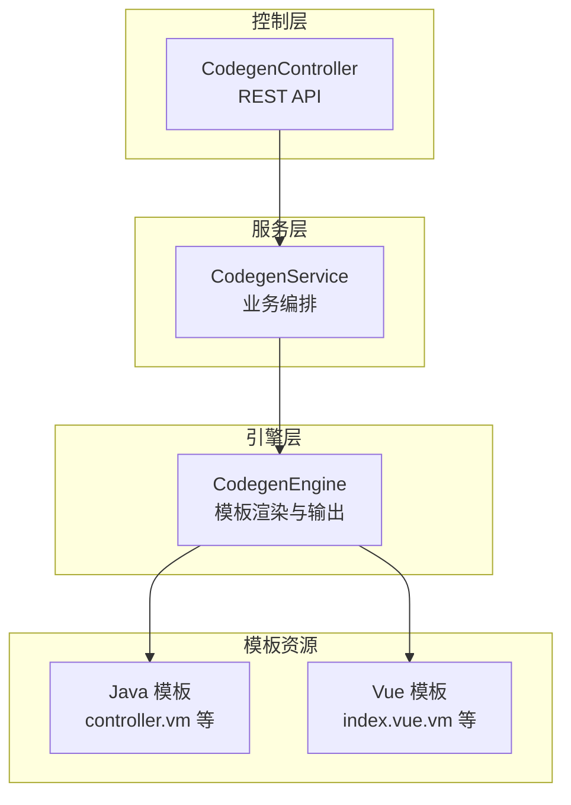
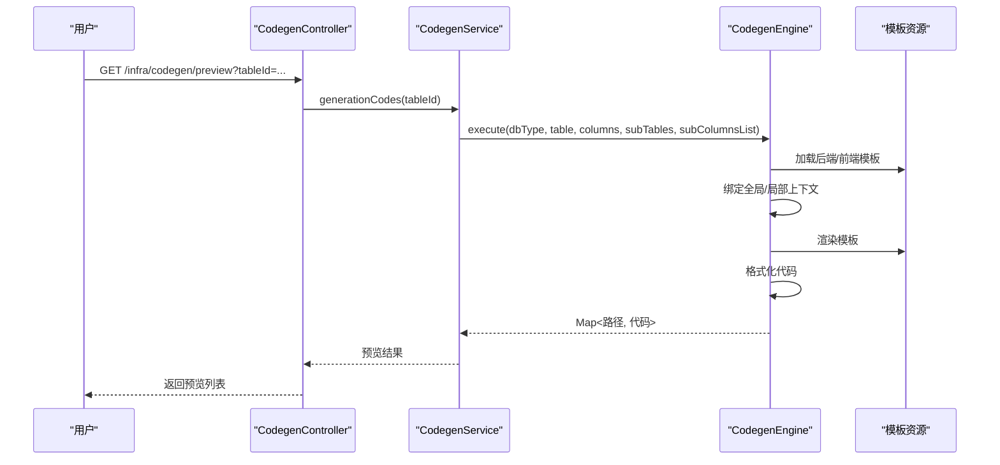
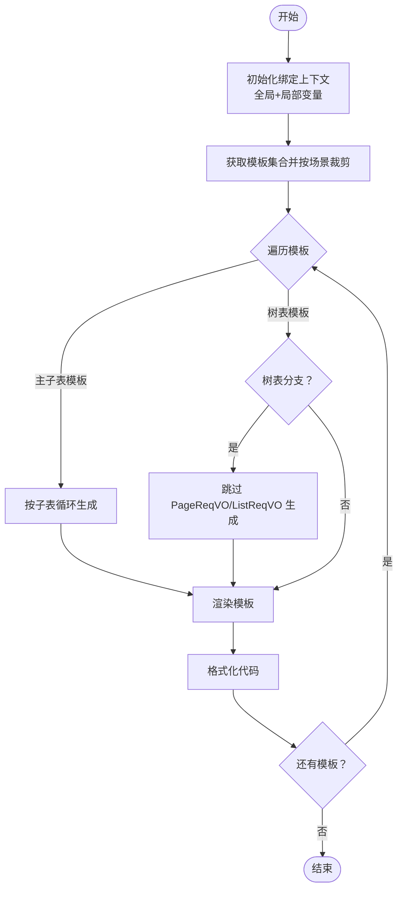
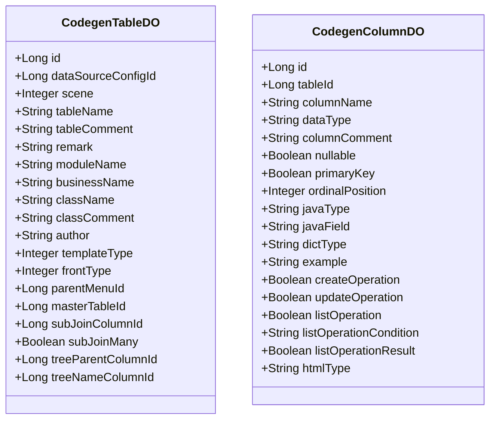
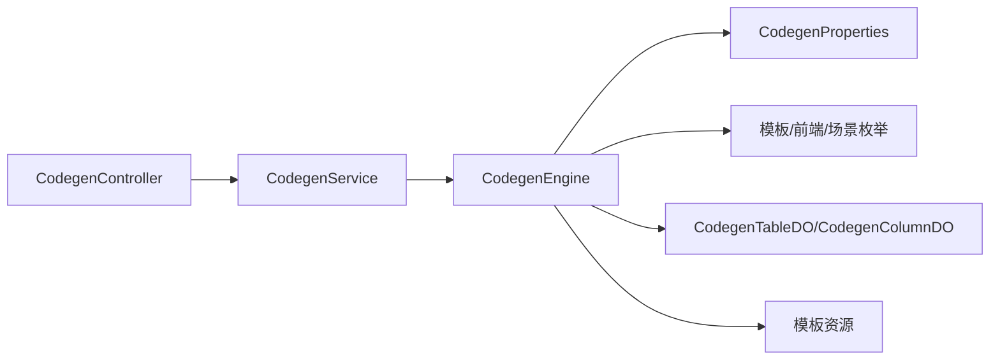

# 代码生成器

<cite>
**本文引用的文件**
- [CodegenController.java](file://yudao-module-infra/src/main/java/cn/iocoder/yudao/module/infra/controller/admin/codegen/CodegenController.java)
- [CodegenEngine.java](file://yudao-module-infra/src/main/java/cn/iocoder/yudao/module/infra/service/codegen/inner/CodegenEngine.java)
- [CodegenService.java](file://yudao-module-infra/src/main/java/cn/iocoder/yudao/module/infra/service/codegen/CodegenService.java)
- [CodegenTableDO.java](file://yudao-module-infra/src/main/java/cn/iocoder/yudao/module/infra/dal/dataobject/codegen/CodegenTableDO.java)
- [CodegenColumnDO.java](file://yudao-module-infra/src/main/java/cn/iocoder/yudao/module/infra/dal/dataobject/codegen/CodegenColumnDO.java)
- [CodegenTemplateTypeEnum.java](file://yudao-module-infra/src/main/java/cn/iocoder/yudao/module/infra/enums/codegen/CodegenTemplateTypeEnum.java)
- [CodegenFrontTypeEnum.java](file://yudao-module-infra/src/main/java/cn/iocoder/yudao/module/infra/enums/codegen/CodegenFrontTypeEnum.java)
- [CodegenSceneEnum.java](file://yudao-module-infra/src/main/java/cn/iocoder/yudao/module/infra/enums/codegen/CodegenSceneEnum.java)
- [CodegenProperties.java](file://yudao-module-infra/src/main/java/cn/iocoder/yudao/module/infra/framework/codegen/config/CodegenProperties.java)
- [CodegenConfiguration.java](file://yudao-module-infra/src/main/java/cn/iocoder/yudao/module/infra/framework/codegen/config/CodegenConfiguration.java)
- [controller.vm](file://yudao-module-infra/src/main/resources/codegen/java/controller/controller.vm)
- [index.vue.vm](file://yudao-module-infra/src/main/resources/codegen/vue/views/index.vue.vm)
</cite>

## 目录
1. [简介](#简介)
2. [项目结构](#项目结构)
3. [核心组件](#核心组件)
4. [架构总览](#架构总览)
5. [详细组件分析](#详细组件分析)
6. [依赖分析](#依赖分析)
7. [性能考虑](#性能考虑)
8. [故障排查指南](#故障排查指南)
9. [结论](#结论)
10. [附录](#附录)

## 简介
本文件面向“代码生成器”功能，系统性阐述其架构设计、模板引擎、生成流程、多语言模板支持、配置项与使用方法。目标是帮助开发者理解如何基于数据库表结构自动生成前后端代码（Java 实体类、Mapper 接口、Service 实现、Controller 控制器、Vue 页面组件等），并掌握模板选择、字段映射、注解生成、分页查询、主子表与树表等高级特性，从而显著提升开发效率、降低重复劳动、统一代码风格。

## 项目结构
代码生成器位于基础模块 yudao-module-infra 中，采用“控制层 + 服务层 + 引擎层 + 模板资源”的分层组织方式：
- 控制层：对外暴露 REST API，提供数据库表查询、表/字段定义管理、预览与打包下载等功能
- 服务层：封装业务逻辑，协调引擎执行代码生成
- 引擎层：基于 Velocity 模板引擎，负责模板加载、上下文绑定、代码渲染与格式化
- 模板资源：后端 Java 模板与前端 Vue 模板，覆盖 CRUD、分页、导出、主子表、树表等场景

图表来源
- [CodegenController.java:40-161](file://yudao-module-infra/src/main/java/cn/iocoder/yudao/module/infra/controller/admin/codegen/CodegenController.java#L40-L161)
- [CodegenEngine.java:60-680](file://yudao-module-infra/src/main/java/cn/iocoder/yudao/module/infra/service/codegen/inner/CodegenEngine.java#L60-L680)
- [controller.vm:1-271](file://yudao-module-infra/src/main/resources/codegen/java/controller/controller.vm#L1-L271)
- [index.vue.vm:1-387](file://yudao-module-infra/src/main/resources/codegen/vue/views/index.vue.vm#L1-L387)

章节来源
- [CodegenController.java:40-161](file://yudao-module-infra/src/main/java/cn/iocoder/yudao/module/infra/controller/admin/codegen/CodegenController.java#L40-L161)
- [CodegenEngine.java:60-680](file://yudao-module-infra/src/main/java/cn/iocoder/yudao/module/infra/service/codegen/inner/CodegenEngine.java#L60-L680)

## 核心组件
- 控制器 CodegenController：提供数据库表列表、表/字段定义的增删改查、同步、预览与打包下载等接口
- 引擎 CodegenEngine：负责模板加载、上下文初始化、模板渲染、代码格式化、主子表/树表分支处理、前后端模板聚合
- 数据对象 CodegenTableDO/CodegenColumnDO：持久化表与字段的元数据，驱动模板渲染
- 枚举 CodegenTemplateTypeEnum/CodegenFrontTypeEnum/CodegenSceneEnum：模板类型、前端类型、生成场景的约束
- 配置 CodegenProperties/CodegenConfiguration：基础包、数据库 Schema、前端类型默认值、VO 类型、批量删除开关、单元测试开关等

章节来源
- [CodegenController.java:40-161](file://yudao-module-infra/src/main/java/cn/iocoder/yudao/module/infra/controller/admin/codegen/CodegenController.java#L40-L161)
- [CodegenEngine.java:60-680](file://yudao-module-infra/src/main/java/cn/iocoder/yudao/module/infra/service/codegen/inner/CodegenEngine.java#L60-L680)
- [CodegenTableDO.java:24-157](file://yudao-module-infra/src/main/java/cn/iocoder/yudao/module/infra/dal/dataobject/codegen/CodegenTableDO.java#L24-L157)
- [CodegenColumnDO.java:22-135](file://yudao-module-infra/src/main/java/cn/iocoder/yudao/module/infra/dal/dataobject/codegen/CodegenColumnDO.java#L22-L135)
- [CodegenTemplateTypeEnum.java:14-53](file://yudao-module-infra/src/main/java/cn/iocoder/yudao/module/infra/enums/codegen/CodegenTemplateTypeEnum.java#L14-L53)
- [CodegenFrontTypeEnum.java:11-35](file://yudao-module-infra/src/main/java/cn/iocoder/yudao/module/infra/enums/codegen/CodegenFrontTypeEnum.java#L11-L35)
- [CodegenSceneEnum.java:13-41](file://yudao-module-infra/src/main/java/cn/iocoder/yudao/module/infra/enums/codegen/CodegenSceneEnum.java#L13-L41)
- [CodegenProperties.java:13-59](file://yudao-module-infra/src/main/java/cn/iocoder/yudao/module/infra/framework/codegen/config/CodegenProperties.java#L13-L59)
- [CodegenConfiguration.java:1-9](file://yudao-module-infra/src/main/java/cn/iocoder/yudao/module/infra/framework/codegen/config/CodegenConfiguration.java#L1-L9)

## 架构总览
代码生成器遵循“请求 → 控制器 → 服务 → 引擎 → 模板”的调用链路；引擎根据前端类型聚合后端与前端模板，结合全局与局部上下文变量，渲染出最终代码并进行格式化处理。

图表来源
- [CodegenController.java:134-141](file://yudao-module-infra/src/main/java/cn/iocoder/yudao/module/infra/controller/admin/codegen/CodegenController.java#L134-L141)
- [CodegenEngine.java:321-351](file://yudao-module-infra/src/main/java/cn/iocoder/yudao/module/infra/service/codegen/inner/CodegenEngine.java#L321-L351)

## 详细组件分析

### 控制器层：CodegenController
- 提供数据库表列表查询、表/字段定义列表/分页、详情、创建/更新/同步/删除、预览与打包下载
- 下载时将生成的代码打包为 zip 并输出附件流
- 权限注解确保对不同场景的操作权限控制

章节来源
- [CodegenController.java:49-158](file://yudao-module-infra/src/main/java/cn/iocoder/yudao/module/infra/controller/admin/codegen/CodegenController.java#L49-L158)

### 引擎层：CodegenEngine
- 模板配置
  - 后端模板：按模块与场景生成 VO、Controller、DO、Mapper、Mapper XML、Service、ServiceImpl、测试类、错误码常量、SQL 脚本等
  - 前端模板：按前端类型（Vue2 Element UI、Vue3 Element Plus、VBEN 系列、UniApp 等）生成 index.vue、api.ts/js、Form 组件等
- 上下文绑定
  - 全局变量：基础包、框架包、Jakarta/Javax 兼容、VO 类型、批量删除开关、常用类名、工具类等
  - 局部变量：表与字段元数据、主键字段、场景枚举、类名变体、权限前缀、树表父子字段、主子表关联与子表集合等
- 生成流程
  - 初始化绑定上下文
  - 获取模板集合并按场景裁剪（Boot/Cloud、是否启用单元测试、是否启用 VO 类型）
  - 逐模板渲染并格式化，支持主子表循环生成与树表分支跳过
- 代码格式化
  - 去除 Vue 末尾多余逗号、清理未使用的 dateFormatter/dict 相关、修正 refs 引用、统一换行与缩进

图表来源
- [CodegenEngine.java:321-428](file://yudao-module-infra/src/main/java/cn/iocoder/yudao/module/infra/service/codegen/inner/CodegenEngine.java#L321-L428)

章节来源
- [CodegenEngine.java:69-232](file://yudao-module-infra/src/main/java/cn/iocoder/yudao/module/infra/service/codegen/inner/CodegenEngine.java#L69-L232)
- [CodegenEngine.java:277-309](file://yudao-module-infra/src/main/java/cn/iocoder/yudao/module/infra/service/codegen/inner/CodegenEngine.java#L277-L309)
- [CodegenEngine.java:321-351](file://yudao-module-infra/src/main/java/cn/iocoder/yudao/module/infra/service/codegen/inner/CodegenEngine.java#L321-L351)
- [CodegenEngine.java:353-428](file://yudao-module-infra/src/main/java/cn/iocoder/yudao/module/infra/service/codegen/inner/CodegenEngine.java#L353-L428)

### 数据模型：表与字段
- CodegenTableDO：记录表级元数据（场景、模块、业务名、类名、作者、模板类型、前端类型、主子表/树表关联等）
- CodegenColumnDO：记录字段级元数据（数据库类型、Java 类型/属性、字典类型、CRUD 开关、列表查询条件与返回、UI 显示类型等）

图表来源
- [CodegenTableDO.java:24-157](file://yudao-module-infra/src/main/java/cn/iocoder/yudao/module/infra/dal/dataobject/codegen/CodegenTableDO.java#L24-L157)
- [CodegenColumnDO.java:22-135](file://yudao-module-infra/src/main/java/cn/iocoder/yudao/module/infra/dal/dataobject/codegen/CodegenColumnDO.java#L22-L135)

章节来源
- [CodegenTableDO.java:24-157](file://yudao-module-infra/src/main/java/cn/iocoder/yudao/module/infra/dal/dataobject/codegen/CodegenTableDO.java#L24-L157)
- [CodegenColumnDO.java:22-135](file://yudao-module-infra/src/main/java/cn/iocoder/yudao/module/infra/dal/dataobject/codegen/CodegenColumnDO.java#L22-L135)

### 模板与生成产物
- 后端模板（以 controller.vm 为例）：生成 Controller 类，包含创建、更新、删除、单条查询、分页/列表查询、Excel 导出等接口；根据模板类型决定是否生成分页接口；支持主子表场景下的子表分页/列表/增删改查接口
- 前端模板（以 index.vue.vm 为例）：生成页面视图，包含搜索栏、操作工具栏、表格、分页、对话框表单、批量删除、导出等；根据模板类型决定是否生成分页、树形展开/折叠、主子表内嵌/ERP 模式

章节来源
- [controller.vm:1-271](file://yudao-module-infra/src/main/resources/codegen/java/controller/controller.vm#L1-L271)
- [index.vue.vm:1-387](file://yudao-module-infra/src/main/resources/codegen/vue/views/index.vue.vm#L1-L387)

### 配置与扩展点
- CodegenProperties：基础包、数据库 Schema 列表、前端类型默认值、VO 类型、批量删除开关、单元测试开关
- CodegenConfiguration：启用配置类，使配置生效
- 枚举扩展：模板类型、前端类型、场景枚举均可扩展以支持新的生成策略

章节来源
- [CodegenProperties.java:13-59](file://yudao-module-infra/src/main/java/cn/iocoder/yudao/module/infra/framework/codegen/config/CodegenProperties.java#L13-L59)
- [CodegenConfiguration.java:1-9](file://yudao-module-infra/src/main/java/cn/iocoder/yudao/module/infra/framework/codegen/config/CodegenConfiguration.java#L1-L9)
- [CodegenTemplateTypeEnum.java:14-53](file://yudao-module-infra/src/main/java/cn/iocoder/yudao/module/infra/enums/codegen/CodegenTemplateTypeEnum.java#L14-L53)
- [CodegenFrontTypeEnum.java:11-35](file://yudao-module-infra/src/main/java/cn/iocoder/yudao/module/infra/enums/codegen/CodegenFrontTypeEnum.java#L11-L35)
- [CodegenSceneEnum.java:13-41](file://yudao-module-infra/src/main/java/cn/iocoder/yudao/module/infra/enums/codegen/CodegenSceneEnum.java#L13-L41)

## 依赖分析
- 控制器依赖服务接口，服务接口委托引擎执行模板渲染
- 引擎依赖模板资源与配置，按前端类型聚合模板并按场景裁剪
- 数据模型作为上下文输入，驱动模板变量与分支逻辑

图表来源
- [CodegenController.java:44-47](file://yudao-module-infra/src/main/java/cn/iocoder/yudao/module/infra/controller/admin/codegen/CodegenController.java#L44-L47)
- [CodegenEngine.java:234-236](file://yudao-module-infra/src/main/java/cn/iocoder/yudao/module/infra/service/codegen/inner/CodegenEngine.java#L234-L236)
- [CodegenProperties.java:13-59](file://yudao-module-infra/src/main/java/cn/iocoder/yudao/module/infra/framework/codegen/config/CodegenProperties.java#L13-L59)
- [CodegenTableDO.java:24-157](file://yudao-module-infra/src/main/java/cn/iocoder/yudao/module/infra/dal/dataobject/codegen/CodegenTableDO.java#L24-L157)
- [CodegenColumnDO.java:22-135](file://yudao-module-infra/src/main/java/cn/iocoder/yudao/module/infra/dal/dataobject/codegen/CodegenColumnDO.java#L22-L135)

章节来源
- [CodegenController.java:44-47](file://yudao-module-infra/src/main/java/cn/iocoder/yudao/module/infra/controller/admin/codegen/CodegenController.java#L44-L47)
- [CodegenEngine.java:520-543](file://yudao-module-infra/src/main/java/cn/iocoder/yudao/module/infra/service/codegen/inner/CodegenEngine.java#L520-L543)

## 性能考虑
- 模板渲染：采用 Velocity 引擎与 hutool 模板抽象，避免复杂逻辑进入模板，提升渲染效率
- 代码格式化：对 Vue 侧进行轻量正则替换与清理，避免重型 AST 解析
- 模板裁剪：按场景动态移除不必要模板（如禁用单元测试时移除测试与 SQL 模板），减少 IO 与渲染开销
- 主子表循环：按需生成，避免空子表时的无效渲染

## 故障排查指南
- 生成结果为空
  - 检查是否正确传入 tableId，确认表与字段定义已创建/同步
  - 检查前端类型与模板类型是否匹配，确认模板路径存在
- 预览报错或格式异常
  - 查看引擎格式化逻辑，确认是否存在未使用的 dateFormatter/dict 相关代码
  - 确认 Vue 侧是否正确替换 refs 与逗号
- 下载失败
  - 检查打包流程是否成功生成 zip 流
- 权限不足
  - 确认接口权限注解与登录用户权限一致

章节来源
- [CodegenController.java:143-158](file://yudao-module-infra/src/main/java/cn/iocoder/yudao/module/infra/controller/admin/codegen/CodegenController.java#L143-L158)
- [CodegenEngine.java:401-428](file://yudao-module-infra/src/main/java/cn/iocoder/yudao/module/infra/service/codegen/inner/CodegenEngine.java#L401-L428)

## 结论
该代码生成器通过清晰的分层设计、灵活的模板体系与完善的上下文绑定，实现了从数据库表结构到前后端代码的一站式自动化生成。借助配置项与枚举扩展，可覆盖多场景需求（管理后台/APP、单表/树表/主子表、多种前端框架）。建议在团队内统一配置与模板，持续沉淀最佳实践，最大化提升研发效率与代码质量。

## 附录

### 使用方法与流程
- 在管理后台中，选择“代码生成器”
- 选择数据源配置，查询数据库表，创建/同步表与字段定义
- 配置模板类型（单表/树表/主子表）、前端类型（Vue2/Vue3 等）、场景（管理后台/APP）、作者等
- 预览生成结果，确认无误后下载压缩包，解压至对应模块目录

章节来源
- [CodegenController.java:49-114](file://yudao-module-infra/src/main/java/cn/iocoder/yudao/module/infra/controller/admin/codegen/CodegenController.java#L49-L114)

### 配置项说明
- 基础包：生成代码的基础包名
- 数据库 Schema：数据库名数组
- 前端类型默认值：默认前端模板类型
- VO 类型：生成 VO 还是直接使用 DO
- 批量删除开关：是否生成批量删除接口
- 单元测试开关：是否生成单元测试与 SQL 脚本

章节来源
- [CodegenProperties.java:18-56](file://yudao-module-infra/src/main/java/cn/iocoder/yudao/module/infra/framework/codegen/config/CodegenProperties.java#L18-L56)