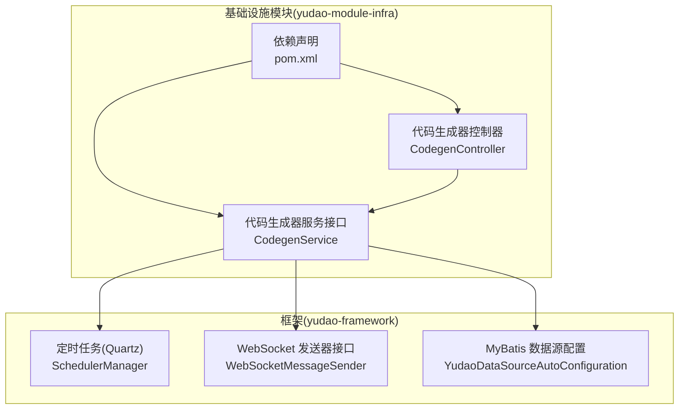
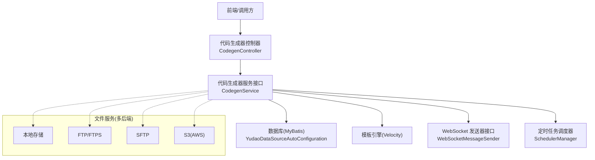
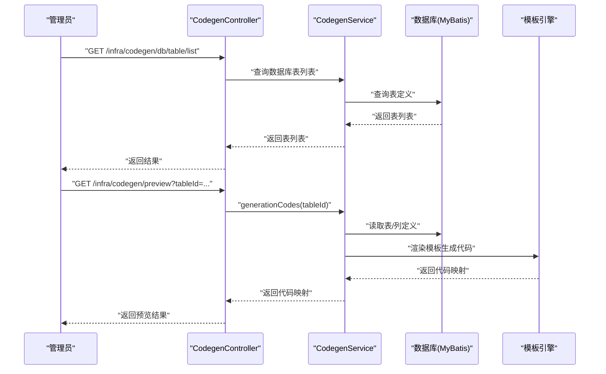
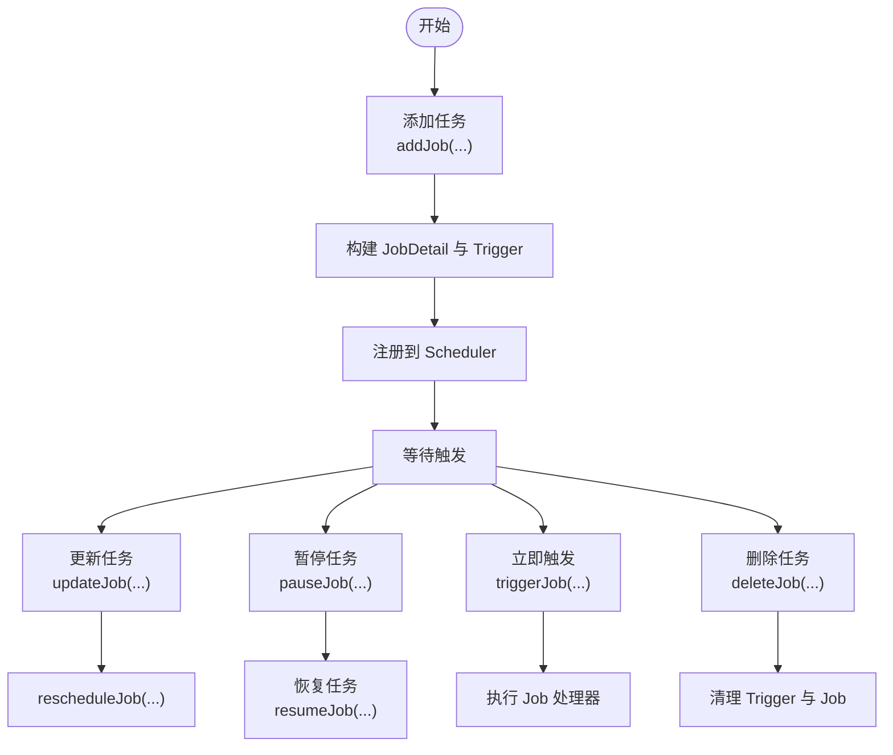
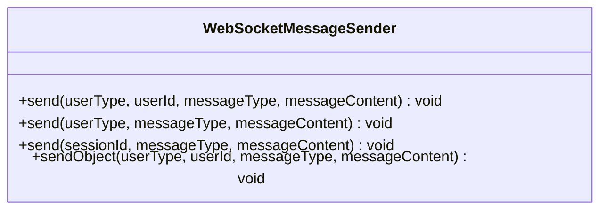
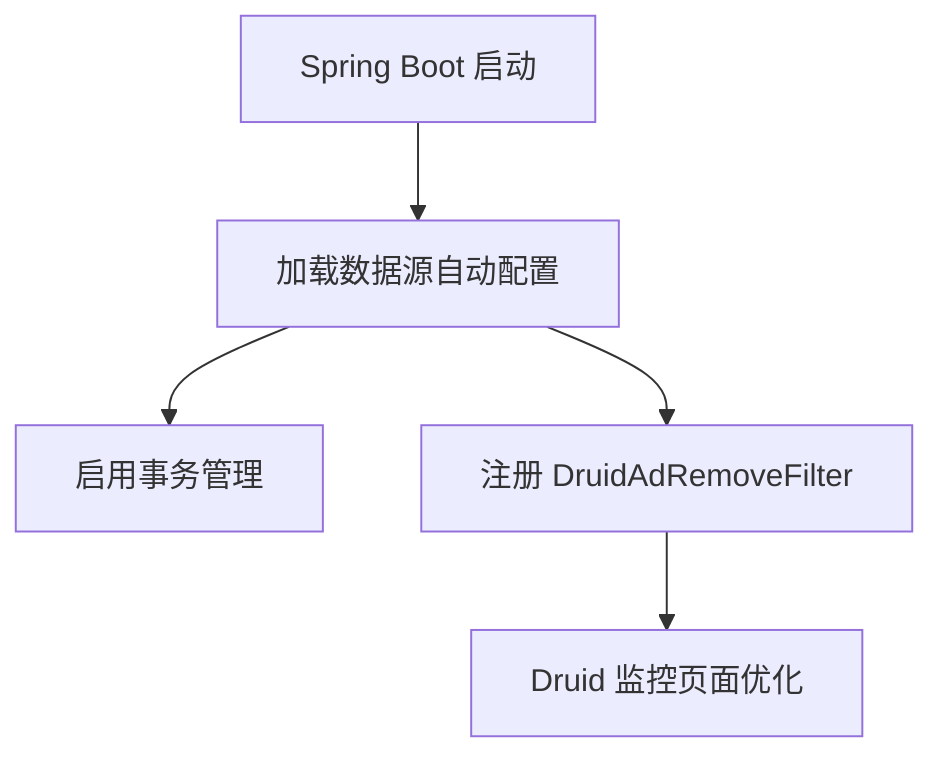
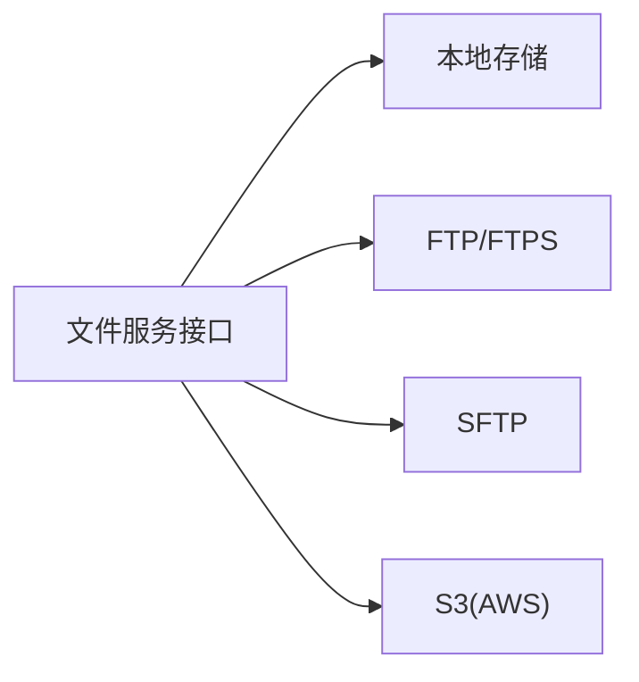
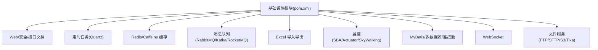

# 基础设施模块

<cite>
**本文引用的文件**
- [yudao-module-infra/pom.xml](file://yudao-module-infra/pom.xml)
- [yudao-module-infra/src/main/java/cn/iocoder/yudao/module/infra/controller/admin/codegen/CodegenController.java](file://yudao-module-infra/src/main/java/cn/iocoder/yudao/module/infra/controller/admin/codegen/CodegenController.java)
- [yudao-module-infra/src/main/java/cn/iocoder/yudao/module/infra/service/codegen/CodegenService.java](file://yudao-module-infra/src/main/java/cn/iocoder/yudao/module/infra/service/codegen/CodegenService.java)
- [yudao-framework/yudao-spring-boot-starter-job/src/main/java/cn/iocoder/yudao/framework/quartz/core/scheduler/SchedulerManager.java](file://yudao-framework/yudao-spring-boot-starter-job/src/main/java/cn/iocoder/yudao/framework/quartz/core/scheduler/SchedulerManager.java)
- [yudao-framework/yudao-spring-boot-starter-websocket/src/main/java/cn/iocoder/yudao/framework/websocket/core/sender/WebSocketMessageSender.java](file://yudao-framework/yudao-spring-boot-starter-websocket/src/main/java/cn/iocoder/yudao/framework/websocket/core/sender/WebSocketMessageSender.java)
- [yudao-framework/yudao-spring-boot-starter-mybatis/src/main/java/cn/iocoder/yudao/framework/datasource/config/YudaoDataSourceAutoConfiguration.java](file://yudao-framework/yudao-spring-boot-starter-mybatis/src/main/java/cn/iocoder/yudao/framework/datasource/config/YudaoDataSourceAutoConfiguration.java)
</cite>

## 目录
1. [引言](#引言)
2. [项目结构](#项目结构)
3. [核心组件](#核心组件)
4. [架构总览](#架构总览)
5. [详细组件分析](#详细组件分析)
6. [依赖分析](#依赖分析)
7. [性能考虑](#性能考虑)
8. [故障排查指南](#故障排查指南)
9. [结论](#结论)
10. [附录](#附录)

## 引言
基础设施模块是 AgenticCPS 系统的“底座”，承担两大职责：
- 基础设施运维与管理：如定时任务、服务器信息、数据库监控等
- 研发工具：如代码生成器、接口文档、文件服务等

本技术文档聚焦以下核心能力：
- 代码生成器：基于模板引擎自动生成前后端代码，提升研发效率
- 定时任务管理：任务配置、执行监控、失败重试与调度控制
- 文件服务：统一抽象本地、FTP、SFTP、S3 等多种存储后端
- WebSocket 通信：连接管理、消息推送、会话状态维护
- 数据库管理：连接池、监控、SQL 分析与治理
- 微服务治理：服务发现、配置管理、健康检查等

## 项目结构
基础设施模块位于 yudao-module-infra，采用按功能域划分的多模块组织方式，核心依赖来自 yudao-framework 的多个启动器模块，覆盖 Web、安全、WebSocket、定时任务、消息队列、监控、MyBatis、Redis、Excel 等。

**图示来源**
- [yudao-module-infra/pom.xml](file://yudao-module-infra/pom.xml)
- [yudao-module-infra/src/main/java/cn/iocoder/yudao/module/infra/controller/admin/codegen/CodegenController.java](file://yudao-module-infra/src/main/java/cn/iocoder/yudao/module/infra/controller/admin/codegen/CodegenController.java)
- [yudao-module-infra/src/main/java/cn/iocoder/yudao/module/infra/service/codegen/CodegenService.java](file://yudao-module-infra/src/main/java/cn/iocoder/yudao/module/infra/service/codegen/CodegenService.java)
- [yudao-framework/yudao-spring-boot-starter-job/src/main/java/cn/iocoder/yudao/framework/quartz/core/scheduler/SchedulerManager.java](file://yudao-framework/yudao-spring-boot-starter-job/src/main/java/cn/iocoder/yudao/framework/quartz/core/scheduler/SchedulerManager.java)
- [yudao-framework/yudao-spring-boot-starter-websocket/src/main/java/cn/iocoder/yudao/framework/websocket/core/sender/WebSocketMessageSender.java](file://yudao-framework/yudao-spring-boot-starter-websocket/src/main/java/cn/iocoder/yudao/framework/websocket/core/sender/WebSocketMessageSender.java)
- [yudao-framework/yudao-spring-boot-starter-mybatis/src/main/java/cn/iocoder/yudao/framework/datasource/config/YudaoDataSourceAutoConfiguration.java](file://yudao-framework/yudao-spring-boot-starter-mybatis/src/main/java/cn/iocoder/yudao/framework/datasource/config/YudaoDataSourceAutoConfiguration.java)

**章节来源**
- [yudao-module-infra/pom.xml](file://yudao-module-infra/pom.xml)

## 核心组件
- 代码生成器：提供数据库表到代码的自动化生成，支持预览与打包下载
- 定时任务调度：基于 Quartz 的任务注册、更新、暂停、恢复与立即触发
- WebSocket 消息发送器：统一的跨后端消息推送接口（本地/Redis/RabbitMQ/Kafka）
- 数据库管理：MyBatis 数据源自动装配与 Druid 监控过滤器
- 文件服务：通过第三方库支持 FTP、SFTP、S3 等多种存储后端（在 infra 模块资源中体现）

**章节来源**
- [yudao-module-infra/src/main/java/cn/iocoder/yudao/module/infra/controller/admin/codegen/CodegenController.java](file://yudao-module-infra/src/main/java/cn/iocoder/yudao/module/infra/controller/admin/codegen/CodegenController.java)
- [yudao-module-infra/src/main/java/cn/iocoder/yudao/module/infra/service/codegen/CodegenService.java](file://yudao-module-infra/src/main/java/cn/iocoder/yudao/module/infra/service/codegen/CodegenService.java)
- [yudao-framework/yudao-spring-boot-starter-job/src/main/java/cn/iocoder/yudao/framework/quartz/core/scheduler/SchedulerManager.java](file://yudao-framework/yudao-spring-boot-starter-job/src/main/java/cn/iocoder/yudao/framework/quartz/core/scheduler/SchedulerManager.java)
- [yudao-framework/yudao-spring-boot-starter-websocket/src/main/java/cn/iocoder/yudao/framework/websocket/core/sender/WebSocketMessageSender.java](file://yudao-framework/yudao-spring-boot-starter-websocket/src/main/java/cn/iocoder/yudao/framework/websocket/core/sender/WebSocketMessageSender.java)
- [yudao-framework/yudao-spring-boot-starter-mybatis/src/main/java/cn/iocoder/yudao/framework/datasource/config/YudaoDataSourceAutoConfiguration.java](file://yudao-framework/yudao-spring-boot-starter-mybatis/src/main/java/cn/iocoder/yudao/framework/datasource/config/YudaoDataSourceAutoConfiguration.java)
- [yudao-module-infra/pom.xml](file://yudao-module-infra/pom.xml)

## 架构总览
基础设施模块通过统一的依赖装配与接口抽象，向上层业务模块提供稳定可靠的运行时能力。下图展示了关键组件之间的交互关系：

**图示来源**
- [yudao-module-infra/src/main/java/cn/iocoder/yudao/module/infra/controller/admin/codegen/CodegenController.java](file://yudao-module-infra/src/main/java/cn/iocoder/yudao/module/infra/controller/admin/codegen/CodegenController.java)
- [yudao-module-infra/src/main/java/cn/iocoder/yudao/module/infra/service/codegen/CodegenService.java](file://yudao-module-infra/src/main/java/cn/iocoder/yudao/module/infra/service/codegen/CodegenService.java)
- [yudao-framework/yudao-spring-boot-starter-mybatis/src/main/java/cn/iocoder/yudao/framework/datasource/config/YudaoDataSourceAutoConfiguration.java](file://yudao-framework/yudao-spring-boot-starter-mybatis/src/main/java/cn/iocoder/yudao/framework/datasource/config/YudaoDataSourceAutoConfiguration.java)
- [yudao-framework/yudao-spring-boot-starter-websocket/src/main/java/cn/iocoder/yudao/framework/websocket/core/sender/WebSocketMessageSender.java](file://yudao-framework/yudao-spring-boot-starter-websocket/src/main/java/cn/iocoder/yudao/framework/websocket/core/sender/WebSocketMessageSender.java)
- [yudao-framework/yudao-spring-boot-starter-job/src/main/java/cn/iocoder/yudao/framework/quartz/core/scheduler/SchedulerManager.java](file://yudao-framework/yudao-spring-boot-starter-job/src/main/java/cn/iocoder/yudao/framework/quartz/core/scheduler/SchedulerManager.java)
- [yudao-module-infra/pom.xml](file://yudao-module-infra/pom.xml)

## 详细组件分析

### 代码生成器
- 功能概述
  - 支持从数据库表结构生成代码，包含表与字段定义的 CRUD、分页查询、预览与打包下载
  - 通过模板引擎渲染生成前后端代码，降低重复劳动
- 关键接口与流程
  - 控制器：提供获取数据库表列表、分页查询、详情、创建/更新/同步/删除、预览与下载等接口
  - 服务接口：定义生成入口、分页查询、详情查询、数据库表列表等契约
  - 生成流程：根据表 ID 读取表与字段定义，结合模板引擎生成文件内容，支持预览与打包下载

**图示来源**
- [yudao-module-infra/src/main/java/cn/iocoder/yudao/module/infra/controller/admin/codegen/CodegenController.java](file://yudao-module-infra/src/main/java/cn/iocoder/yudao/module/infra/controller/admin/codegen/CodegenController.java)
- [yudao-module-infra/src/main/java/cn/iocoder/yudao/module/infra/service/codegen/CodegenService.java](file://yudao-module-infra/src/main/java/cn/iocoder/yudao/module/infra/service/codegen/CodegenService.java)

**章节来源**
- [yudao-module-infra/src/main/java/cn/iocoder/yudao/module/infra/controller/admin/codegen/CodegenController.java](file://yudao-module-infra/src/main/java/cn/iocoder/yudao/module/infra/controller/admin/codegen/CodegenController.java)
- [yudao-module-infra/src/main/java/cn/iocoder/yudao/module/infra/service/codegen/CodegenService.java](file://yudao-module-infra/src/main/java/cn/iocoder/yudao/module/infra/service/codegen/CodegenService.java)

### 定时任务调度系统
- 设计要点
  - 使用 Quartz 作为调度内核，通过 SchedulerManager 统一管理任务生命周期
  - 以 jobHandlerName 作为任务唯一标识，简化调度与触发逻辑
  - 支持添加、更新、删除、暂停、恢复、立即触发等操作
  - 通过 JobDataMap 传递任务参数与重试策略
- 关键流程
  - 添加任务：构建 JobDetail 与 Trigger，并注册到调度器
  - 更新任务：重新构建 Trigger 并 reschedule
  - 删除任务：先暂停 Trigger，再取消并删除 Job
  - 立即触发：构造 JobDataMap 并直接触发指定 Job

**图示来源**
- [yudao-framework/yudao-spring-boot-starter-job/src/main/java/cn/iocoder/yudao/framework/quartz/core/scheduler/SchedulerManager.java](file://yudao-framework/yudao-spring-boot-starter-job/src/main/java/cn/iocoder/yudao/framework/quartz/core/scheduler/SchedulerManager.java)

**章节来源**
- [yudao-framework/yudao-spring-boot-starter-job/src/main/java/cn/iocoder/yudao/framework/quartz/core/scheduler/SchedulerManager.java](file://yudao-framework/yudao-spring-boot-starter-job/src/main/java/cn/iocoder/yudao/framework/quartz/core/scheduler/SchedulerManager.java)

### WebSocket 实时通信
- 能力概述
  - 提供统一的消息发送器接口，屏蔽底层传输细节（本地/Redis/RabbitMQ/Kafka）
  - 支持按用户、按用户类型、按 Session 发送消息
  - 内置 JSON 序列化便捷方法
- 设计要点
  - 抽象接口定义消息发送契约
  - 通过不同实现适配多后端消息通道
  - 结合握手拦截与鉴权定制器，保障连接安全

**图示来源**
- [yudao-framework/yudao-spring-boot-starter-websocket/src/main/java/cn/iocoder/yudao/framework/websocket/core/sender/WebSocketMessageSender.java](file://yudao-framework/yudao-spring-boot-starter-websocket/src/main/java/cn/iocoder/yudao/framework/websocket/core/sender/WebSocketMessageSender.java)

**章节来源**
- [yudao-framework/yudao-spring-boot-starter-websocket/src/main/java/cn/iocoder/yudao/framework/websocket/core/sender/WebSocketMessageSender.java](file://yudao-framework/yudao-spring-boot-starter-websocket/src/main/java/cn/iocoder/yudao/framework/websocket/core/sender/WebSocketMessageSender.java)

### 数据库管理
- 能力概述
  - MyBatis 数据源自动装配，启用事务管理
  - 针对 Druid 监控页面的广告脚本过滤，优化监控体验
- 关键点
  - 条件化注册 DruidAdRemoveFilter，仅在开启监控视图时生效
  - 启用事务注解驱动，确保数据一致性

**图示来源**
- [yudao-framework/yudao-spring-boot-starter-mybatis/src/main/java/cn/iocoder/yudao/framework/datasource/config/YudaoDataSourceAutoConfiguration.java](file://yudao-framework/yudao-spring-boot-starter-mybatis/src/main/java/cn/iocoder/yudao/framework/datasource/config/YudaoDataSourceAutoConfiguration.java)

**章节来源**
- [yudao-framework/yudao-spring-boot-starter-mybatis/src/main/java/cn/iocoder/yudao/framework/datasource/config/YudaoDataSourceAutoConfiguration.java](file://yudao-framework/yudao-spring-boot-starter-mybatis/src/main/java/cn/iocoder/yudao/framework/datasource/config/YudaoDataSourceAutoConfiguration.java)

### 文件服务（多存储后端）
- 能力概述
  - 通过第三方库统一抽象文件访问，支持本地、FTP、SFTP、S3 等多种存储后端
  - 在基础设施模块中引入 commons-net、jsch、aws-sdk-s3、tika 等依赖
- 设计要点
  - 以接口抽象屏蔽后端差异
  - 通过配置切换存储类型，便于横向扩展

**图示来源**
- [yudao-module-infra/pom.xml](file://yudao-module-infra/pom.xml)

**章节来源**
- [yudao-module-infra/pom.xml](file://yudao-module-infra/pom.xml)

## 依赖分析
基础设施模块通过聚合依赖的方式，将各类能力以启动器形式引入，形成松耦合、可插拔的基础设施栈。

**图示来源**
- [yudao-module-infra/pom.xml](file://yudao-module-infra/pom.xml)

**章节来源**
- [yudao-module-infra/pom.xml](file://yudao-module-infra/pom.xml)

## 性能考虑
- 代码生成器
  - 模板渲染与 IO 操作建议异步化，避免阻塞请求线程
  - 大型项目打包下载时注意内存占用，可采用流式输出
- 定时任务
  - 合理设置 CRON 表达式与重试间隔，避免热点时段集中触发
  - 对耗时任务进行拆分与并发控制
- WebSocket
  - 选择合适的后端传输（本地/Redis/RabbitMQ/Kafka），平衡延迟与吞吐
  - 对消息体进行压缩与限流，防止风暴
- 数据库
  - 使用连接池与慢 SQL 监控，定期优化热点查询
  - 启用事务批处理，减少往返开销
- 文件服务
  - 对大文件采用分片上传与断点续传
  - 后端选择就近节点，降低网络抖动

## 故障排查指南
- 定时任务未执行
  - 检查调度器是否初始化完成，确认未被禁用
  - 核对 CRON 表达式与重试配置
  - 查看任务处理器是否存在或已正确注册
- WebSocket 无法推送
  - 确认发送器实现已启用（本地/Redis/RabbitMQ/Kafka）
  - 检查握手拦截与鉴权配置
  - 核对用户会话状态与目标 Session
- 代码生成失败
  - 检查数据库表结构是否完整
  - 确认模板引擎可用且模板路径正确
  - 查看生成日志与异常堆栈
- 数据库连接问题
  - 检查连接池配置与监控指标
  - 确认 Druid 监控页面过滤器是否正确注册
  - 排查慢 SQL 与锁等待

## 结论
基础设施模块通过“接口抽象 + 多后端实现”的设计，为上层业务提供了高可用、高性能、易扩展的运行时支撑。代码生成器显著提升研发效率；定时任务调度体系完善；WebSocket 消息通道灵活多样；数据库管理稳健可靠；文件服务覆盖主流存储形态。配合监控与治理能力，基础设施模块成为系统稳定运行的基石。

## 附录
- 术语
  - 代码生成器：将数据库表结构自动转换为前后端代码的工具链
  - 定时任务：基于 CRON 表达式的周期性或一次性任务
  - WebSocket：双向实时通信协议，支持多后端传输
  - 文件服务：统一抽象的文件存储与访问能力
  - 数据库管理：连接池、监控、事务与 SQL 分析