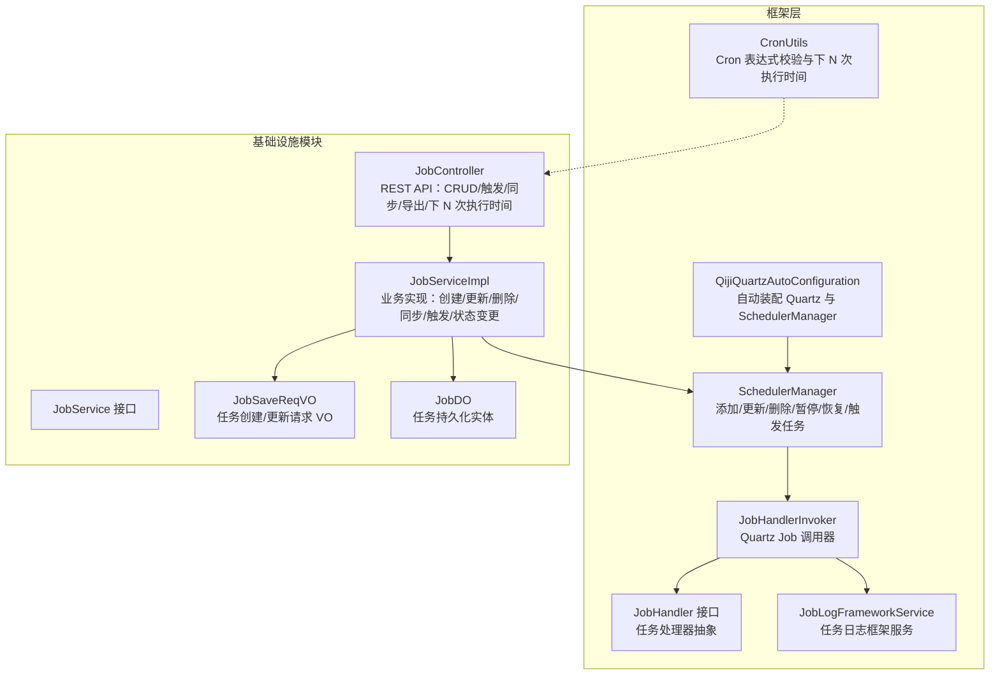
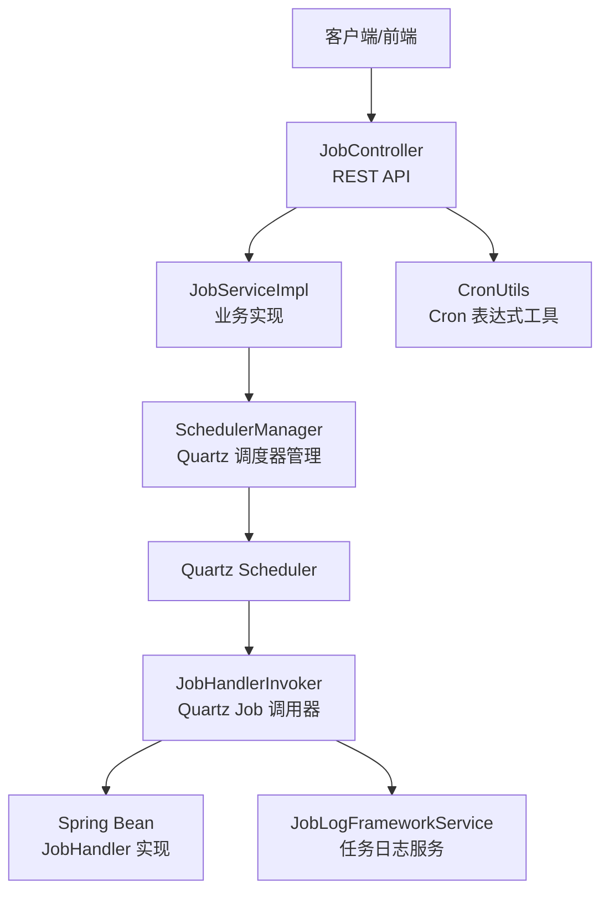
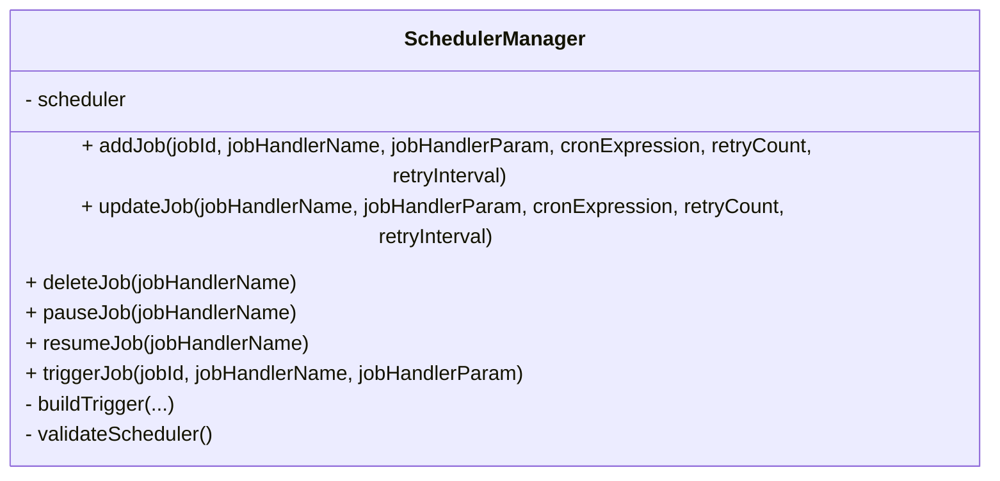
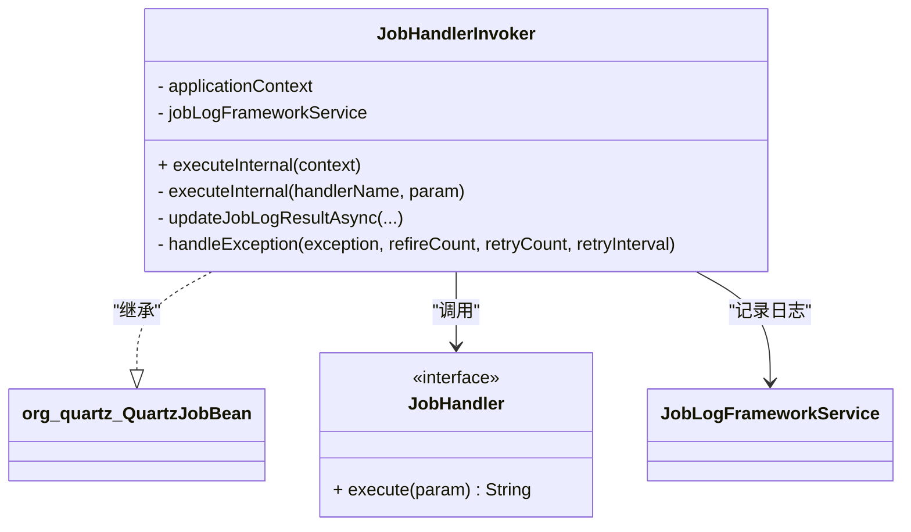
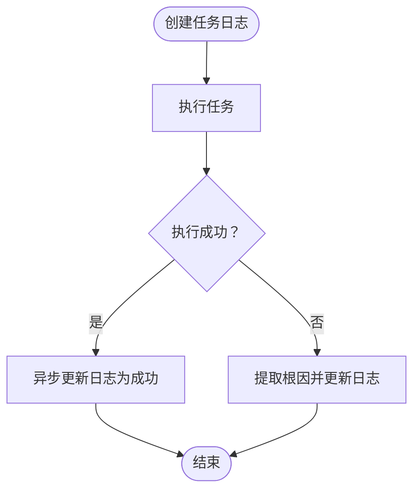
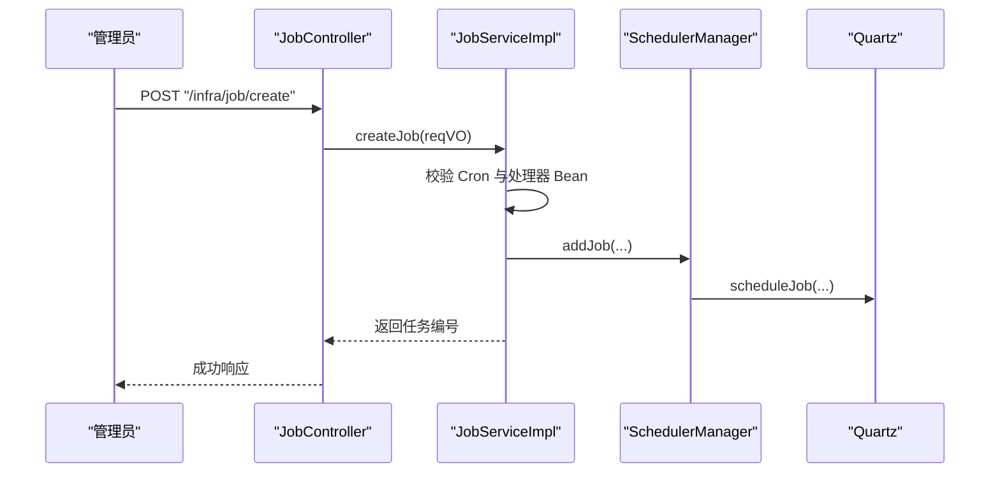
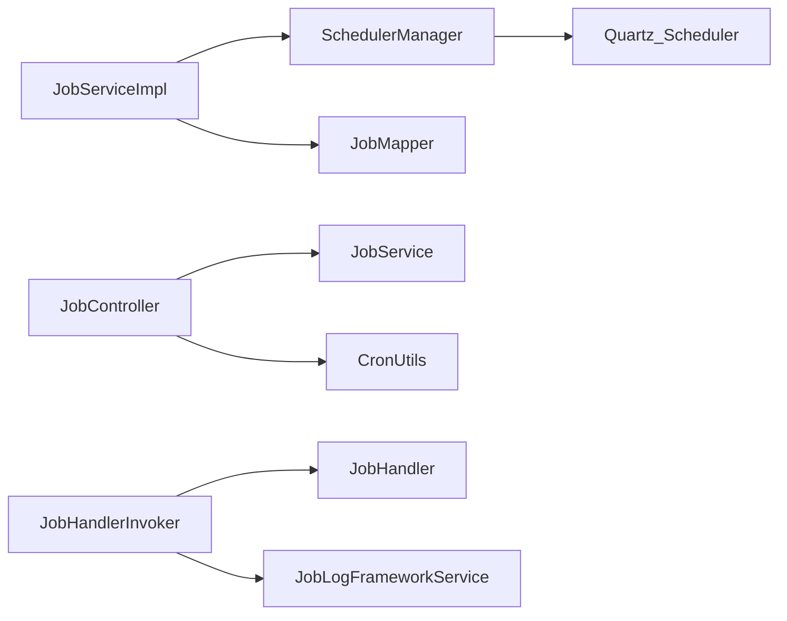
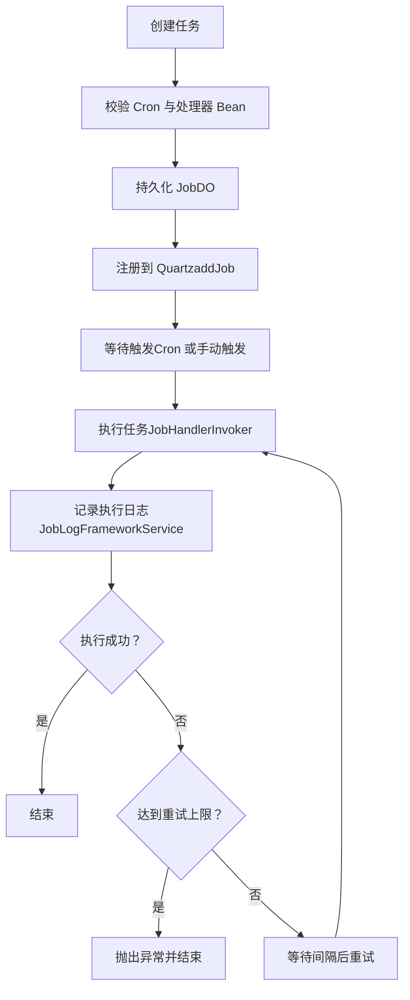

# 定时任务管理

<cite>
**本文引用的文件**   
- [QijiQuartzAutoConfiguration.java](file://qiji-framework/qiji-spring-boot-starter-job/src/main/java/com.qiji.cps/framework/quartz/config/QijiQuartzAutoConfiguration.java)
- [SchedulerManager.java](file://qiji-framework/qiji-spring-boot-starter-job/src/main/java/com.qiji.cps/framework/quartz/core/scheduler/SchedulerManager.java)
- [JobHandler.java](file://qiji-framework/qiji-spring-boot-starter-job/src/main/java/com.qiji.cps/framework/quartz/core/handler/JobHandler.java)
- [JobHandlerInvoker.java](file://qiji-framework/qiji-spring-boot-starter-job/src/main/java/com.qiji.cps/framework/quartz/core/handler/JobHandlerInvoker.java)
- [JobDataKeyEnum.java](file://qiji-framework/qiji-spring-boot-starter-job/src/main/java/com.qiji.cps/framework/quartz/core/enums/JobDataKeyEnum.java)
- [JobLogFrameworkService.java](file://qiji-framework/qiji-spring-boot-starter-job/src/main/java/com.qiji.cps/framework/quartz/core/service/JobLogFrameworkService.java)
- [CronUtils.java](file://qiji-framework/qiji-spring-boot-starter-job/src/main/java/com.qiji.cps/framework/quartz/core/util/CronUtils.java)
- [JobService.java](file://qiji-module-infra/src/main/java/com.qiji.cps/module/infra/service/job/JobService.java)
- [JobServiceImpl.java](file://qiji-module-infra/src/main/java/com.qiji.cps/module/infra/service/job/JobServiceImpl.java)
- [JobController.java](file://qiji-module-infra/src/main/java/com.qiji.cps/module/infra/controller/admin/job/JobController.java)
- [JobSaveReqVO.java](file://qiji-module-infra/src/main/java/com.qiji.cps/module/infra/controller/admin/job/vo/job/JobSaveReqVO.java)
- [JobDO.java](file://qiji-module-infra/src/main/java/com.qiji.cps/module/infra/dal/dataobject/job/JobDO.java)
- [application-local.yaml](file://qiji-server/src/main/resources/application-local.yaml)
</cite>

## 目录
1. [简介](#简介)
2. [项目结构](#项目结构)
3. [核心组件](#核心组件)
4. [架构总览](#架构总览)
5. [详细组件分析](#详细组件分析)
6. [依赖分析](#依赖分析)
7. [性能考虑](#性能考虑)
8. [故障排查指南](#故障排查指南)
9. [结论](#结论)
10. [附录](#附录)

## 简介
本技术文档围绕定时任务管理系统展开，系统基于 Quartz 调度器实现，结合 Spring Boot 自动装配与基础设施模块，提供完整的定时任务生命周期管理能力：从任务创建、配置、调度到执行完成的全流程支持；包含并发控制、失败重试、超时监控与告警；提供任务模板化（通过处理器名与参数）快速创建常用任务；并给出最佳实践与常见问题排查方法。

## 项目结构
定时任务相关代码主要分布在以下位置：
- 框架层（qiji-spring-boot-starter-job）：Quartz 自动装配、调度器管理、任务处理器接口与调用器、日志框架服务、Cron 工具类等
- 基础设施模块（qiji-module-infra）：定时任务的业务服务、控制器、数据对象与 VO

图表来源
- [QijiQuartzAutoConfiguration.java:1-29](file://qiji-framework/qiji-spring-boot-starter-job/src/main/java/com.qiji.cps/framework/quartz/config/QijiQuartzAutoConfiguration.java#L1-L29)
- [SchedulerManager.java:1-151](file://qiji-framework/qiji-spring-boot-starter-job/src/main/java/com.qiji.cps/framework/quartz/core/scheduler/SchedulerManager.java#L1-L151)
- [JobHandler.java:1-20](file://qiji-framework/qiji-spring-boot-starter-job/src/main/java/com.qiji.cps/framework/quartz/core/handler/JobHandler.java#L1-L20)
- [JobHandlerInvoker.java:1-114](file://qiji-framework/qiji-spring-boot-starter-job/src/main/java/com.qiji.cps/framework/quartz/core/handler/JobHandlerInvoker.java#L1-L114)
- [JobLogFrameworkService.java:1-44](file://qiji-framework/qiji-spring-boot-starter-job/src/main/java/com.qiji.cps/framework/quartz/core/service/JobLogFrameworkService.java#L1-L44)
- [CronUtils.java:1-61](file://qiji-framework/qiji-spring-boot-starter-job/src/main/java/com.qiji.cps/framework/quartz/core/util/CronUtils.java#L1-L61)
- [JobService.java:1-86](file://qiji-module-infra/src/main/java/com.qiji.cps/module/infra/service/job/JobService.java#L1-L86)
- [JobServiceImpl.java:1-216](file://qiji-module-infra/src/main/java/com.qiji.cps/module/infra/service/job/JobServiceImpl.java#L1-L216)
- [JobController.java:1-159](file://qiji-module-infra/src/main/java/com.qiji.cps/module/infra/controller/admin/job/JobController.java#L1-L159)
- [JobSaveReqVO.java:1-42](file://qiji-module-infra/src/main/java/com.qiji.cps/module/infra/controller/admin/job/vo/job/JobSaveReqVO.java#L1-L42)
- [JobDO.java:1-77](file://qiji-module-infra/src/main/java/com.qiji.cps/module/infra/dal/dataobject/job/JobDO.java#L1-L77)

章节来源
- [QijiQuartzAutoConfiguration.java:1-29](file://qiji-framework/qiji-spring-boot-starter-job/src/main/java/com.qiji.cps/framework/quartz/config/QijiQuartzAutoConfiguration.java#L1-L29)
- [JobController.java:1-159](file://qiji-module-infra/src/main/java/com.qiji.cps/module/infra/controller/admin/job/JobController.java#L1-L159)

## 核心组件
- Quartz 自动装配与调度器管理
  - 自动装配启用 Spring 定时任务，并按需注入 SchedulerManager
  - SchedulerManager 提供 add/update/delete/pause/resume/trigger 等操作
- 任务处理器与调用器
  - JobHandler 抽象任务执行接口
  - JobHandlerInvoker 实现 Quartz Job，负责并发控制、重试、日志记录与异常处理
- 日志与监控
  - JobLogFrameworkService 统一日志创建与结果更新
  - CronUtils 提供 Cron 表达式校验与下 N 次执行时间计算
- 业务层
  - JobService/JobServiceImpl 实现任务 CRUD、状态变更、触发、同步
  - JobController 提供 REST API
  - JobSaveReqVO/JobDO 封装任务配置与持久化

章节来源
- [QijiQuartzAutoConfiguration.java:1-29](file://qiji-framework/qiji-spring-boot-starter-job/src/main/java/com.qiji.cps/framework/quartz/config/QijiQuartzAutoConfiguration.java#L1-L29)
- [SchedulerManager.java:1-151](file://qiji-framework/qiji-spring-boot-starter-job/src/main/java/com.qiji.cps/framework/quartz/core/scheduler/SchedulerManager.java#L1-L151)
- [JobHandler.java:1-20](file://qiji-framework/qiji-spring-boot-starter-job/src/main/java/com.qiji.cps/framework/quartz/core/handler/JobHandler.java#L1-L20)
- [JobHandlerInvoker.java:1-114](file://qiji-framework/qiji-spring-boot-starter-job/src/main/java/com.qiji.cps/framework/quartz/core/handler/JobHandlerInvoker.java#L1-L114)
- [JobLogFrameworkService.java:1-44](file://qiji-framework/qiji-spring-boot-starter-job/src/main/java/com.qiji.cps/framework/quartz/core/service/JobLogFrameworkService.java#L1-L44)
- [CronUtils.java:1-61](file://qiji-framework/qiji-spring-boot-starter-job/src/main/java/com.qiji.cps/framework/quartz/core/util/CronUtils.java#L1-L61)
- [JobService.java:1-86](file://qiji-module-infra/src/main/java/com.qiji.cps/module/infra/service/job/JobService.java#L1-L86)
- [JobServiceImpl.java:1-216](file://qiji-module-infra/src/main/java/com.qiji.cps/module/infra/service/job/JobServiceImpl.java#L1-L216)
- [JobController.java:1-159](file://qiji-module-infra/src/main/java/com.qiji.cps/module/infra/controller/admin/job/JobController.java#L1-L159)
- [JobSaveReqVO.java:1-42](file://qiji-module-infra/src/main/java/com.qiji.cps/module/infra/controller/admin/job/vo/job/JobSaveReqVO.java#L1-L42)
- [JobDO.java:1-77](file://qiji-module-infra/src/main/java/com.qiji.cps/module/infra/dal/dataobject/job/JobDO.java#L1-L77)

## 架构总览
系统采用“框架层 + 业务层”的分层设计：
- 框架层提供 Quartz 集成、调度器管理、任务处理器与日志框架
- 业务层封装定时任务的业务逻辑，提供 REST API 与数据模型

图表来源
- [JobController.java:1-159](file://qiji-module-infra/src/main/java/com.qiji.cps/module/infra/controller/admin/job/JobController.java#L1-L159)
- [JobServiceImpl.java:1-216](file://qiji-module-infra/src/main/java/com.qiji.cps/module/infra/service/job/JobServiceImpl.java#L1-L216)
- [SchedulerManager.java:1-151](file://qiji-framework/qiji-spring-boot-starter-job/src/main/java/com.qiji.cps/framework/quartz/core/scheduler/SchedulerManager.java#L1-L151)
- [JobHandlerInvoker.java:1-114](file://qiji-framework/qiji-spring-boot-starter-job/src/main/java/com.qiji.cps/framework/quartz/core/handler/JobHandlerInvoker.java#L1-L114)
- [JobLogFrameworkService.java:1-44](file://qiji-framework/qiji-spring-boot-starter-job/src/main/java/com.qiji.cps/framework/quartz/core/service/JobLogFrameworkService.java#L1-L44)
- [CronUtils.java:1-61](file://qiji-framework/qiji-spring-boot-starter-job/src/main/java/com.qiji.cps/framework/quartz/core/util/CronUtils.java#L1-L61)

## 详细组件分析

### 组件一：调度器管理（SchedulerManager）
- 职责
  - 将任务注册到 Quartz：构建 JobDetail 与 Trigger，设置 Cron 表达式与重试参数
  - 支持更新、删除、暂停、恢复、立即触发
- 关键点
  - 使用 jobHandlerName 作为 Quartz 的 Job/Trigger 唯一键
  - 通过 JobDataKeyEnum 注入任务参数与重试策略
  - 在禁用模式下抛出明确错误提示

图表来源
- [SchedulerManager.java:1-151](file://qiji-framework/qiji-spring-boot-starter-job/src/main/java/com.qiji.cps/framework/quartz/core/scheduler/SchedulerManager.java#L1-L151)
- [JobDataKeyEnum.java:1-15](file://qiji-framework/qiji-spring-boot-starter-job/src/main/java/com.qiji.cps/framework/quartz/core/enums/JobDataKeyEnum.java#L1-L15)

章节来源
- [SchedulerManager.java:1-151](file://qiji-framework/qiji-spring-boot-starter-job/src/main/java/com.qiji.cps/framework/quartz/core/scheduler/SchedulerManager.java#L1-L151)
- [JobDataKeyEnum.java:1-15](file://qiji-framework/qiji-spring-boot-starter-job/src/main/java/com.qiji.cps/framework/quartz/core/enums/JobDataKeyEnum.java#L1-L15)

### 组件二：任务处理器与调用器（JobHandler / JobHandlerInvoker）
- JobHandler
  - 任务执行接口，由具体业务 Bean 实现
- JobHandlerInvoker
  - Quartz Job 实现，负责：
    - 并发控制：@DisallowConcurrentExecution
    - 执行前创建日志、执行任务、异步更新日志
    - 失败重试：根据 refireCount 与 retryCount 决定是否重试
    - 异常处理：记录根因并按策略抛出或重试

图表来源
- [JobHandler.java:1-20](file://qiji-framework/qiji-spring-boot-starter-job/src/main/java/com.qiji.cps/framework/quartz/core/handler/JobHandler.java#L1-L20)
- [JobHandlerInvoker.java:1-114](file://qiji-framework/qiji-spring-boot-starter-job/src/main/java/com.qiji.cps/framework/quartz/core/handler/JobHandlerInvoker.java#L1-L114)
- [JobLogFrameworkService.java:1-44](file://qiji-framework/qiji-spring-boot-starter-job/src/main/java/com.qiji.cps/framework/quartz/core/service/JobLogFrameworkService.java#L1-L44)

章节来源
- [JobHandler.java:1-20](file://qiji-framework/qiji-spring-boot-starter-job/src/main/java/com.qiji.cps/framework/quartz/core/handler/JobHandler.java#L1-L20)
- [JobHandlerInvoker.java:1-114](file://qiji-framework/qiji-spring-boot-starter-job/src/main/java/com.qiji.cps/framework/quartz/core/handler/JobHandlerInvoker.java#L1-L114)

### 组件三：日志与监控（JobLogFrameworkService / CronUtils）
- JobLogFrameworkService
  - 创建任务日志、异步更新执行结果（含耗时、成功与否、返回数据）
- CronUtils
  - 校验 Cron 表达式有效性
  - 计算下 N 个计划执行时间，便于排障与可视化展示

图表来源
- [JobLogFrameworkService.java:1-44](file://qiji-framework/qiji-spring-boot-starter-job/src/main/java/com.qiji.cps/framework/quartz/core/service/JobLogFrameworkService.java#L1-L44)
- [JobHandlerInvoker.java:76-91](file://qiji-framework/qiji-spring-boot-starter-job/src/main/java/com.qiji.cps/framework/quartz/core/handler/JobHandlerInvoker.java#L76-L91)

章节来源
- [JobLogFrameworkService.java:1-44](file://qiji-framework/qiji-spring-boot-starter-job/src/main/java/com.qiji.cps/framework/quartz/core/service/JobLogFrameworkService.java#L1-L44)
- [CronUtils.java:1-61](file://qiji-framework/qiji-spring-boot-starter-job/src/main/java/com.qiji.cps/framework/quartz/core/util/CronUtils.java#L1-L61)

### 组件四：业务层（JobService/JobServiceImpl / JobController / VO/DO）
- JobController
  - 提供创建、更新、删除、状态变更、触发、同步、分页、导出、下 N 次执行时间等接口
- JobServiceImpl
  - 校验 Cron 表达式与处理器 Bean 存在性
  - 在事务中完成持久化与 Quartz 同步
  - 支持批量删除与状态切换
- JobSaveReqVO / JobDO
  - 封装任务配置：名称、处理器名、参数、Cron、重试次数/间隔、监控超时等

图表来源
- [JobController.java:44-59](file://qiji-module-infra/src/main/java/com.qiji.cps/module/infra/controller/admin/job/JobController.java#L44-L59)
- [JobServiceImpl.java:47-69](file://qiji-module-infra/src/main/java/com.qiji.cps/module/infra/service/job/JobServiceImpl.java#L47-L69)
- [SchedulerManager.java:40-53](file://qiji-framework/qiji-spring-boot-starter-job/src/main/java/com.qiji.cps/framework/quartz/core/scheduler/SchedulerManager.java#L40-L53)

章节来源
- [JobController.java:1-159](file://qiji-module-infra/src/main/java/com.qiji.cps/module/infra/controller/admin/job/JobController.java#L1-L159)
- [JobServiceImpl.java:1-216](file://qiji-module-infra/src/main/java/com.qiji.cps/module/infra/service/job/JobServiceImpl.java#L1-L216)
- [JobSaveReqVO.java:1-42](file://qiji-module-infra/src/main/java/com.qiji.cps/module/infra/controller/admin/job/vo/job/JobSaveReqVO.java#L1-L42)
- [JobDO.java:1-77](file://qiji-module-infra/src/main/java/com.qiji.cps/module/infra/dal/dataobject/job/JobDO.java#L1-L77)

## 依赖分析
- 组件耦合
  - JobServiceImpl 依赖 SchedulerManager 与 JobMapper，同时通过 SpringUtil 校验处理器 Bean
  - JobController 仅依赖 JobService，职责清晰
  - SchedulerManager 依赖 Quartz Scheduler 与 JobDataKeyEnum
  - JobHandlerInvoker 依赖 ApplicationContext 与 JobLogFrameworkService
- 外部依赖
  - Quartz（调度器）、Spring Quartz Starter（自动装配）
  - Hutool（日期与断言工具）

图表来源
- [JobController.java:1-159](file://qiji-module-infra/src/main/java/com.qiji.cps/module/infra/controller/admin/job/JobController.java#L1-L159)
- [JobServiceImpl.java:1-216](file://qiji-module-infra/src/main/java/com.qiji.cps/module/infra/service/job/JobServiceImpl.java#L1-L216)
- [SchedulerManager.java:1-151](file://qiji-framework/qiji-spring-boot-starter-job/src/main/java/com.qiji.cps/framework/quartz/core/scheduler/SchedulerManager.java#L1-L151)
- [JobHandlerInvoker.java:1-114](file://qiji-framework/qiji-spring-boot-starter-job/src/main/java/com.qiji.cps/framework/quartz/core/handler/JobHandlerInvoker.java#L1-L114)

章节来源
- [JobServiceImpl.java:94-104](file://qiji-module-infra/src/main/java/com.qiji.cps/module/infra/service/job/JobServiceImpl.java#L94-L104)
- [SchedulerManager.java:23-27](file://qiji-framework/qiji-spring-boot-starter-job/src/main/java/com.qiji.cps/framework/quartz/core/scheduler/SchedulerManager.java#L23-L27)

## 性能考虑
- 并发控制
  - 使用 @DisallowConcurrentExecution 避免同一定时任务并发执行
- 线程池与集群
  - 通过 Quartz 线程池大小与集群配置提升吞吐与高可用
- 重试策略
  - 基于 refireCount 与 retryCount 控制重试上限与间隔
- 日志异步化
  - 执行结果异步更新日志，降低阻塞风险

章节来源
- [JobHandlerInvoker.java:26](file://qiji-framework/qiji-spring-boot-starter-job/src/main/java/com.qiji.cps/framework/quartz/core/handler/JobHandlerInvoker.java#L26)
- [application-local.yaml:90-113](file://qiji-server/src/main/resources/application-local.yaml#L90-L113)

## 故障排查指南
- 常见问题定位
  - 定时任务未生效：确认 Quartz 是否启用、SchedulerManager 是否被正确注入
  - Cron 表达式无效：使用 CronUtils 校验或计算下 N 次执行时间辅助定位
  - 处理器 Bean 不存在：确保处理器 Bean 名称与配置一致且实现 JobHandler 接口
  - 重试未生效：检查任务重试次数与间隔配置
  - 日志缺失：确认 JobLogFrameworkService 是否正常工作
- 排查步骤
  - 通过 JobController 的“同步”接口将数据库中的任务强制同步到 Quartz
  - 使用“下 N 次执行时间”接口验证 Cron 表达式
  - 查看任务状态（NORMAL/STOP）与 Quartz 中 Trigger 状态

章节来源
- [JobServiceImpl.java:140-158](file://qiji-module-infra/src/main/java/com.qiji.cps/module/infra/service/job/JobServiceImpl.java#L140-L158)
- [JobController.java:141-156](file://qiji-module-infra/src/main/java/com.qiji.cps/module/infra/controller/admin/job/JobController.java#L141-L156)
- [CronUtils.java:19-58](file://qiji-framework/qiji-spring-boot-starter-job/src/main/java/com.qiji.cps/framework/quartz/core/util/CronUtils.java#L19-L58)

## 结论
该定时任务系统以 Quartz 为核心，结合框架层的调度器管理与调用器实现，以及业务层的 REST API 与数据模型，提供了从创建、配置、调度到执行监控的完整能力。通过并发控制、失败重试与日志异步化，系统具备良好的稳定性与可观测性。配合 Cron 工具与状态同步机制，便于运维与排障。

## 附录

### 任务生命周期流程图

图表来源
- [JobServiceImpl.java:47-69](file://qiji-module-infra/src/main/java/com.qiji.cps/module/infra/service/job/JobServiceImpl.java#L47-L69)
- [SchedulerManager.java:40-53](file://qiji-framework/qiji-spring-boot-starter-job/src/main/java/com.qiji.cps/framework/quartz/core/scheduler/SchedulerManager.java#L40-L53)
- [JobHandlerInvoker.java:37-111](file://qiji-framework/qiji-spring-boot-starter-job/src/main/java/com.qiji.cps/framework/quartz/core/handler/JobHandlerInvoker.java#L37-L111)
- [JobLogFrameworkService.java:24-42](file://qiji-framework/qiji-spring-boot-starter-job/src/main/java/com.qiji.cps/framework/quartz/core/service/JobLogFrameworkService.java#L24-L42)

### 配置项说明（节选）
- Quartz 基础配置
  - auto-startup：是否自动启动调度器
  - job-store-type：内存或 JDBC 存储
  - wait-for-jobs-to-complete-on-shutdown：优雅关闭等待
  - org.quartz.scheduler.*：调度器实例配置
  - org.quartz.jobStore.*：集群与检查间隔、Misfire 阀值
  - org.quartz.threadPool.*：线程池大小

章节来源
- [application-local.yaml:90-113](file://qiji-server/src/main/resources/application-local.yaml#L90-L113)