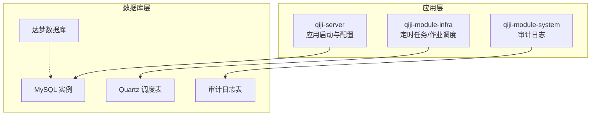
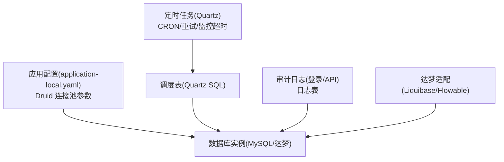
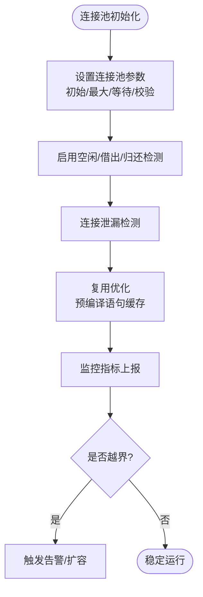
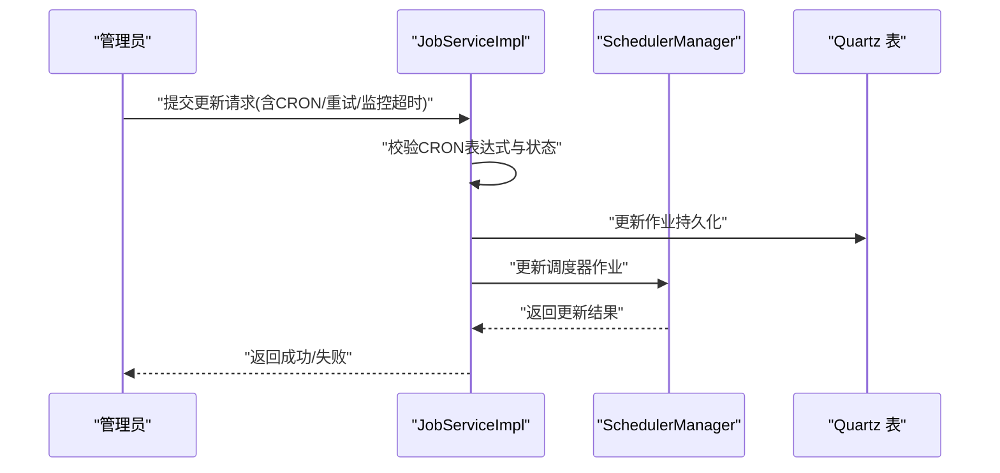
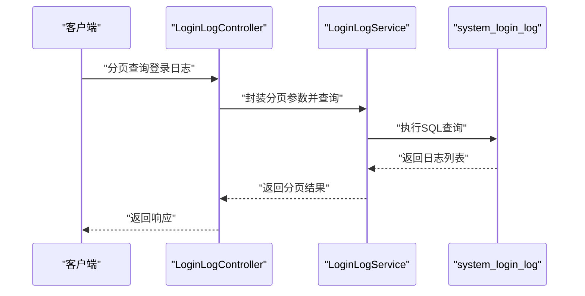
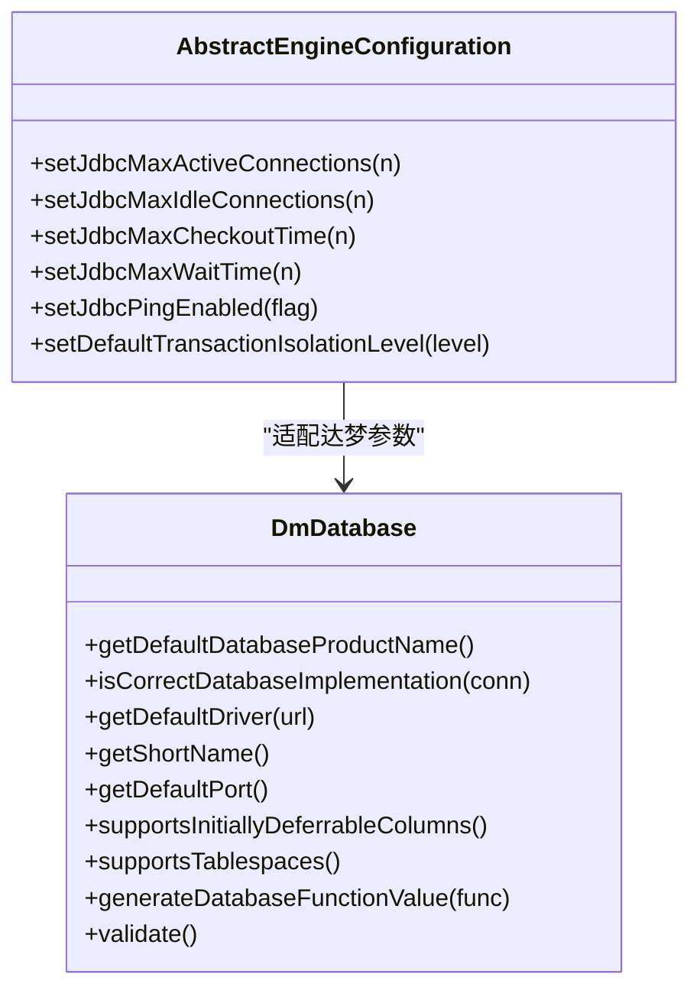
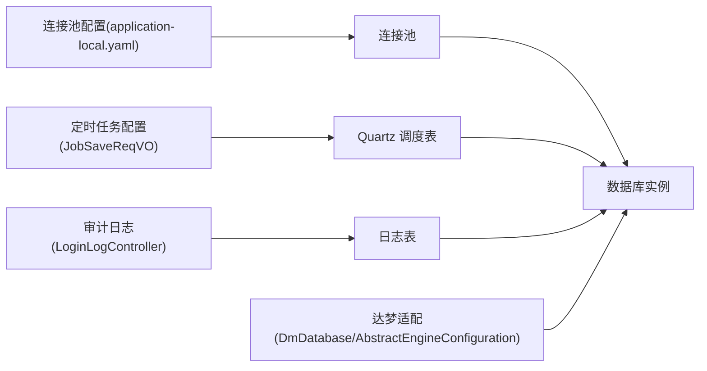

# 数据库管理

<cite>
**本文引用的文件**
- [README.md](file://README.md)
- [AbstractEngineConfiguration.java](file://sql/dm/flowable-patch/src/main/java/org/flowable/common/engine/impl/AbstractEngineConfiguration.java)
- [DmDatabase.java](file://sql/dm/flowable-patch/src/main/java/liquibase/database/core/DmDatabase.java)
- [application-local.yaml](file://qiji-server/src/main/resources/application-local.yaml)
- [JobSaveReqVO.java](file://qiji-module-infra/src/main/java/com.qiji.cps/module/infra/controller/admin/job/vo/job/JobSaveReqVO.java)
- [JobServiceImpl.java](file://qiji-module-infra/src/main/java/com.qiji.cps/module/infra/service/job/JobServiceImpl.java)
- [LoginLogController.java](file://qiji-module-system/src/main/java/com.qiji.cps/module/system/controller/admin/logger/LoginLogController.java)
- [ruoyi-vue-pro.sql](file://sql/sqlserver/ruoyi-vue-pro.sql)
- [quartz.sql](file://sql/kingbase/quartz.sql)
</cite>

## 目录
1. [简介](#简介)
2. [项目结构](#项目结构)
3. [核心组件](#核心组件)
4. [架构总览](#架构总览)
5. [组件详解](#组件详解)
6. [依赖关系分析](#依赖关系分析)
7. [性能考量](#性能考量)
8. [故障排查指南](#故障排查指南)
9. [结论](#结论)
10. [附录](#附录)

## 简介
本技术文档围绕数据库管理能力展开，结合仓库中的基础设施与模块化实现，系统性梳理以下主题：
- 数据库监控：连接池状态监控、慢查询分析、性能指标统计、资源使用情况
- SQL 执行分析：SQL 语句收集、执行计划分析、性能优化建议
- 连接池管理：连接池配置、连接泄漏检测、连接复用优化
- 数据库维护：索引优化、表结构分析、数据一致性检查
- 数据库备份与恢复：自动备份策略、增量备份、快速恢复
- 数据库安全：SQL 注入防护、访问控制、审计日志
- 最佳实践与故障排查：运维建议与常见问题定位

说明：仓库中明确体现“MySQL 监控”能力描述，但未发现独立的数据库管理模块或通用的数据库监控实现；本文在“数据库监控”和“SQL 执行分析”部分以概念性指导为主，不直接映射到具体代码文件。

## 项目结构
本项目采用多模块分层架构，数据库相关能力主要分布在如下位置：
- qiji-server：应用启动与配置，包含连接池配置样例
- qiji-module-infra：定时任务、作业调度、监控与运维相关能力
- qiji-module-system：登录日志、操作日志等审计能力
- sql：各数据库方言的初始化脚本与 Quartz 调度表定义
- sql/dm/flowable-patch：适配达梦数据库的 Liquibase 与 Flowable 配置片段

图示来源
- [application-local.yaml:33-50](file://qiji-server/src/main/resources/application-local.yaml#L33-L50)
- [quartz.sql:15-45](file://sql/kingbase/quartz.sql#L15-L45)
- [ruoyi-vue-pro.sql:68-122](file://sql/sqlserver/ruoyi-vue-pro.sql#L68-L122)

章节来源
- [README.md:103-122](file://README.md#L103-L122)
- [application-local.yaml:33-50](file://qiji-server/src/main/resources/application-local.yaml#L33-L50)

## 核心组件
- 连接池配置与管理
  - 通过应用配置文件展示 Druid 连接池的关键参数，如初始大小、最大活跃数、最大等待时间、空闲检测周期、校验查询等，用于连接池状态监控与资源使用统计的基础支撑。
- 定时任务与作业调度
  - 基于 Quartz 的作业调度，支持 CRON 表达式、重试次数与间隔、监控超时等配置，便于执行计划分析与性能优化建议落地。
- 审计日志
  - 登录日志与 API 访问日志等，为慢查询分析与性能瓶颈定位提供数据基础。
- 达梦数据库适配
  - Flowable 与 Liquibase 的达梦适配类，体现跨数据库兼容性与连接池参数设置思路。

章节来源
- [application-local.yaml:33-50](file://qiji-server/src/main/resources/application-local.yaml#L33-L50)
- [JobSaveReqVO.java:19-40](file://qiji-module-infra/src/main/java/com.qiji.cps/module/infra/controller/admin/job/vo/job/JobSaveReqVO.java#L19-L40)
- [JobServiceImpl.java:72-91](file://qiji-module-infra/src/main/java/com.qiji.cps/module/infra/service/job/JobServiceImpl.java#L72-L91)
- [LoginLogController.java:1-26](file://qiji-module-system/src/main/java/com.qiji.cps/module/system/controller/admin/logger/LoginLogController.java#L1-L26)
- [AbstractEngineConfiguration.java:460-483](file://sql/dm/flowable-patch/src/main/java/org/flowable/common/engine/impl/AbstractEngineConfiguration.java#L460-L483)
- [DmDatabase.java:41-80](file://sql/dm/flowable-patch/src/main/java/liquibase/database/core/DmDatabase.java#L41-L80)

## 架构总览
下图展示数据库管理相关能力在系统中的交互关系：应用层通过连接池访问数据库，定时任务驱动作业执行，审计日志记录关键行为，达梦适配确保跨数据库一致性。

图示来源
- [application-local.yaml:33-50](file://qiji-server/src/main/resources/application-local.yaml#L33-L50)
- [quartz.sql:15-45](file://sql/kingbase/quartz.sql#L15-L45)
- [ruoyi-vue-pro.sql:68-122](file://sql/sqlserver/ruoyi-vue-pro.sql#L68-L122)
- [AbstractEngineConfiguration.java:460-483](file://sql/dm/flowable-patch/src/main/java/org/flowable/common/engine/impl/AbstractEngineConfiguration.java#L460-L483)
- [DmDatabase.java:41-80](file://sql/dm/flowable-patch/src/main/java/liquibase/database/core/DmDatabase.java#L41-L80)

## 组件详解

### 连接池管理
- 配置要点
  - 初始连接数、最小空闲连接、最大活跃连接、最大等待时间、空闲连接检测周期、连接最大生存时间、校验查询、空闲检测开关、借出/归还检测开关、预编译语句缓存与每连接缓存上限等。
- 监控与告警
  - 结合连接池指标（活跃数、空闲数、等待数、超时次数、泄漏检测触发次数）进行阈值告警与容量规划。
- 泄漏检测与复用优化
  - 启用空闲检测与超时检测，合理设置最大等待与最大生存时间，避免连接泄漏；通过预编译语句缓存减少解析开销，提升复用效率。

图示来源
- [application-local.yaml:33-50](file://qiji-server/src/main/resources/application-local.yaml#L33-L50)

章节来源
- [application-local.yaml:33-50](file://qiji-server/src/main/resources/application-local.yaml#L33-L50)

### SQL 执行分析（概念性）
- SQL 语句收集
  - 通过审计日志与慢查询日志采集 SQL 文本、执行时间、参数、用户信息等。
- 执行计划分析
  - 借助数据库执行计划工具评估索引使用、扫描范围、排序与连接代价。
- 性能优化建议
  - 基于热点 SQL 与执行计划，提出索引优化、SQL 重写、分页优化、批量处理等建议。

说明：本节为通用实践指导，未直接对应具体代码文件。

### 数据库监控（概念性）
- 连接状态监控
  - 关注活跃连接、等待连接、空闲连接、超时与拒绝次数。
- 慢查询分析
  - 基于慢日志与执行计划，识别长事务、全表扫描、锁等待等瓶颈。
- 性能指标统计
  - QPS、TPS、缓冲池命中率、锁等待、临时表与排序开销等。
- 资源使用情况
  - CPU、内存、磁盘 IO、网络带宽与连接池资源占用。

说明：本节为通用实践指导，未直接对应具体代码文件。

### 数据库维护（概念性）
- 索引优化
  - 删除冗余索引、补充缺失索引、重建碎片化索引。
- 表结构分析
  - 字段类型与长度评估、字符集与排序规则统一、分区策略评估。
- 数据一致性检查
  - 主从延迟、唯一约束冲突、外键一致性、业务规则校验。

说明：本节为通用实践指导，未直接对应具体代码文件。

### 数据库备份与恢复（概念性）
- 自动备份策略
  - 全量/增量备份周期、保留策略、压缩与加密。
- 增量备份
  - 基于二进制日志或增量快照，支持按时间点恢复。
- 快速恢复
  - 多副本与异地容灾、自动化切换与回滚流程。

说明：本节为通用实践指导，未直接对应具体代码文件。

### 数据库安全（概念性）
- SQL 注入防护
  - 使用参数化查询、ORM 框架白名单过滤、输入校验与输出编码。
- 访问控制
  - 最小权限原则、IP 白名单、会话超时与强制退出。
- 审计日志
  - 操作日志、登录日志、敏感操作告警与合规报表。

说明：本节为通用实践指导，未直接对应具体代码文件。

### 定时任务与作业调度（代码级）
- 作业配置
  - 处理器名称、参数、CRON 表达式、重试次数与间隔、监控超时。
- 作业更新流程
  - 校验 CRON 表达式、仅允许正常状态更新、更新持久化并同步到调度器。
- Quartz 调度表
  - 作业详情、触发器、简单/复杂触发器、状态与时间字段等。

图示来源
- [JobSaveReqVO.java:19-40](file://qiji-module-infra/src/main/java/com.qiji.cps/module/infra/controller/admin/job/vo/job/JobSaveReqVO.java#L19-L40)
- [JobServiceImpl.java:72-91](file://qiji-module-infra/src/main/java/com.qiji.cps/module/infra/service/job/JobServiceImpl.java#L72-L91)
- [quartz.sql:15-45](file://sql/kingbase/quartz.sql#L15-L45)

章节来源
- [JobSaveReqVO.java:1-41](file://qiji-module-infra/src/main/java/com.qiji.cps/module/infra/controller/admin/job/vo/job/JobSaveReqVO.java#L1-L41)
- [JobServiceImpl.java:64-91](file://qiji-module-infra/src/main/java/com.qiji.cps/module/infra/service/job/JobServiceImpl.java#L64-L91)
- [quartz.sql:15-45](file://sql/kingbase/quartz.sql#L15-L45)

### 审计日志（代码级）
- 登录日志控制器
  - 提供登录日志分页查询与导出能力，支撑安全审计与性能分析。
- 日志表结构
  - 包含请求时间、用户信息、IP、UA、链路追踪等字段，便于慢查询与异常定位。

图示来源
- [LoginLogController.java:1-26](file://qiji-module-system/src/main/java/com.qiji.cps/module/system/controller/admin/logger/LoginLogController.java#L1-L26)
- [ruoyi-vue-pro.sql:3671-3729](file://sql/sqlserver/ruoyi-vue-pro.sql#L3671-L3729)

章节来源
- [LoginLogController.java:1-26](file://qiji-module-system/src/main/java/com.qiji.cps/module/system/controller/admin/logger/LoginLogController.java#L1-L26)
- [ruoyi-vue-pro.sql:68-122](file://sql/sqlserver/ruoyi-vue-pro.sql#L68-L122)

### 达梦数据库适配（代码级）
- Flowable 连接池参数
  - 设置最大活动连接、最大空闲连接、借出最大等待时间、空闲等待时间、连接健康检查与事务隔离级别等。
- Liquibase 达梦数据库支持
  - 产品名识别、默认驱动、短名、端口、保留字、序列函数、回收站访问警告等。

图示来源
- [AbstractEngineConfiguration.java:460-483](file://sql/dm/flowable-patch/src/main/java/org/flowable/common/engine/impl/AbstractEngineConfiguration.java#L460-L483)
- [DmDatabase.java:41-80](file://sql/dm/flowable-patch/src/main/java/liquibase/database/core/DmDatabase.java#L41-L80)
- [DmDatabase.java:473-485](file://sql/dm/flowable-patch/src/main/java/liquibase/database/core/DmDatabase.java#L473-L485)

章节来源
- [AbstractEngineConfiguration.java:460-483](file://sql/dm/flowable-patch/src/main/java/org/flowable/common/engine/impl/AbstractEngineConfiguration.java#L460-L483)
- [DmDatabase.java:41-80](file://sql/dm/flowable-patch/src/main/java/liquibase/database/core/DmDatabase.java#L41-L80)
- [DmDatabase.java:473-485](file://sql/dm/flowable-patch/src/main/java/liquibase/database/core/DmDatabase.java#L473-L485)

## 依赖关系分析
- 应用配置对数据库连接池的影响
  - 连接池参数直接影响系统吞吐与稳定性，需与数据库实例规格匹配。
- 定时任务对数据库压力的影响
  - 作业数量、CRON 密度、重试策略与监控超时共同决定数据库峰值负载。
- 审计日志对数据库写入的影响
  - 登录与 API 日志写入频率与字段规模影响写入性能与存储成本。
- 达梦适配对跨数据库的一致性影响
  - 通过统一的连接池参数与数据库方言支持，降低迁移与兼容成本。

图示来源
- [application-local.yaml:33-50](file://qiji-server/src/main/resources/application-local.yaml#L33-L50)
- [JobSaveReqVO.java:19-40](file://qiji-module-infra/src/main/java/com.qiji.cps/module/infra/controller/admin/job/vo/job/JobSaveReqVO.java#L19-L40)
- [LoginLogController.java:1-26](file://qiji-module-system/src/main/java/com.qiji.cps/module/system/controller/admin/logger/LoginLogController.java#L1-L26)
- [AbstractEngineConfiguration.java:460-483](file://sql/dm/flowable-patch/src/main/java/org/flowable/common/engine/impl/AbstractEngineConfiguration.java#L460-L483)
- [DmDatabase.java:41-80](file://sql/dm/flowable-patch/src/main/java/liquibase/database/core/DmDatabase.java#L41-L80)

章节来源
- [application-local.yaml:33-50](file://qiji-server/src/main/resources/application-local.yaml#L33-L50)
- [JobSaveReqVO.java:1-41](file://qiji-module-infra/src/main/java/com.qiji.cps/module/infra/controller/admin/job/vo/job/JobSaveReqVO.java#L1-L41)
- [LoginLogController.java:1-26](file://qiji-module-system/src/main/java/com.qiji.cps/module/system/controller/admin/logger/LoginLogController.java#L1-L26)
- [AbstractEngineConfiguration.java:460-483](file://sql/dm/flowable-patch/src/main/java/org/flowable/common/engine/impl/AbstractEngineConfiguration.java#L460-L483)
- [DmDatabase.java:41-80](file://sql/dm/flowable-patch/src/main/java/liquibase/database/core/DmDatabase.java#L41-L80)

## 性能考量
- 连接池参数调优
  - 根据 QPS 与事务持续时间设定初始/最大连接数与等待时间，避免过度连接导致上下文切换开销。
- SQL 与索引优化
  - 通过慢查询日志与执行计划，减少全表扫描与临时排序，补充缺失索引。
- 定时任务削峰填谷
  - 合理分布 CRON 时间窗，避免同时触发大量作业；设置重试间隔与监控超时，防止雪崩。
- 审计日志异步化
  - 将高频写入的日志落盘异步化，降低对主库写入路径的压力。

## 故障排查指南
- 连接池相关
  - 现象：连接不足、频繁超时、连接泄漏。
  - 排查：核对最大活跃连接、最大等待时间、空闲检测周期与校验查询；检查是否存在长时间事务或未释放连接。
- 定时任务相关
  - 现象：任务未执行、重复执行、执行超时。
  - 排查：确认 CRON 表达式与状态；检查重试次数与间隔；验证调度器与数据库连接状态。
- 审计日志相关
  - 现象：日志缺失、查询缓慢。
  - 排查：确认日志表索引（如时间字段）；检查写入频率与存储空间；核对导出与查询参数。
- 达梦数据库相关
  - 现象：连接失败、事务隔离异常。
  - 排查：确认驱动与端口；核对连接池健康检查与事务隔离级别设置。

章节来源
- [application-local.yaml:33-50](file://qiji-server/src/main/resources/application-local.yaml#L33-L50)
- [JobServiceImpl.java:72-91](file://qiji-module-infra/src/main/java/com.qiji.cps/module/infra/service/job/JobServiceImpl.java#L72-L91)
- [LoginLogController.java:1-26](file://qiji-module-system/src/main/java/com.qiji.cps/module/system/controller/admin/logger/LoginLogController.java#L1-L26)
- [AbstractEngineConfiguration.java:460-483](file://sql/dm/flowable-patch/src/main/java/org/flowable/common/engine/impl/AbstractEngineConfiguration.java#L460-L483)
- [DmDatabase.java:473-485](file://sql/dm/flowable-patch/src/main/java/liquibase/database/core/DmDatabase.java#L473-L485)

## 结论
本项目在连接池配置、定时任务调度、审计日志与达梦数据库适配上提供了可落地的实现基础。结合通用的数据库监控、SQL 分析、维护与安全实践，可形成完整的数据库管理闭环。建议在生产环境中配套完善的监控告警体系与自动化运维流程，持续优化性能与可靠性。

## 附录
- 关键配置参考
  - 连接池参数：[application-local.yaml:33-50](file://qiji-server/src/main/resources/application-local.yaml#L33-L50)
  - 作业配置模型：[JobSaveReqVO.java:1-41](file://qiji-module-infra/src/main/java/com.qiji.cps/module/infra/controller/admin/job/vo/job/JobSaveReqVO.java#L1-L41)
  - 作业服务实现：[JobServiceImpl.java:64-91](file://qiji-module-infra/src/main/java/com.qiji.cps/module/infra/service/job/JobServiceImpl.java#L64-L91)
  - 登录日志控制器：[LoginLogController.java:1-26](file://qiji-module-system/src/main/java/com.qiji.cps/module/system/controller/admin/logger/LoginLogController.java#L1-L26)
  - Quartz 调度表定义：[quartz.sql:15-45](file://sql/kingbase/quartz.sql#L15-L45)
  - 达梦数据库适配：[DmDatabase.java:41-80](file://sql/dm/flowable-patch/src/main/java/liquibase/database/core/DmDatabase.java#L41-L80)，[AbstractEngineConfiguration.java:460-483](file://sql/dm/flowable-patch/src/main/java/org/flowable/common/engine/impl/AbstractEngineConfiguration.java#L460-L483)