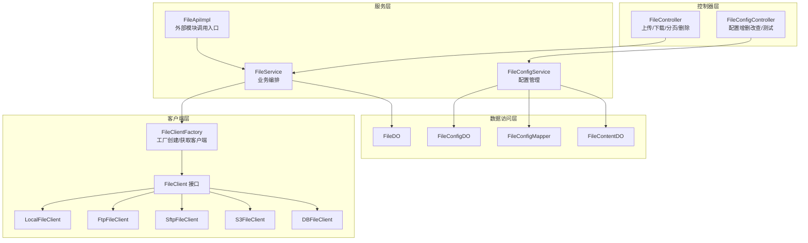
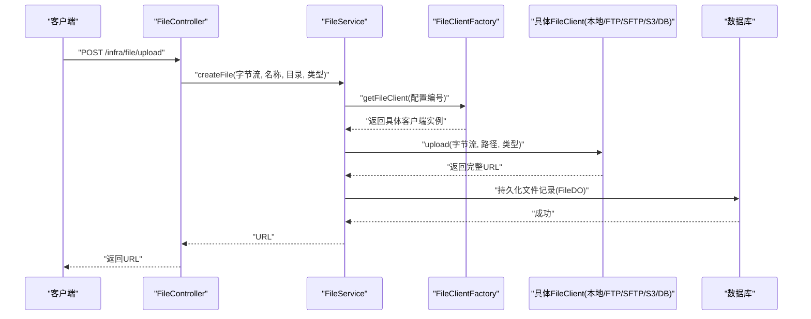
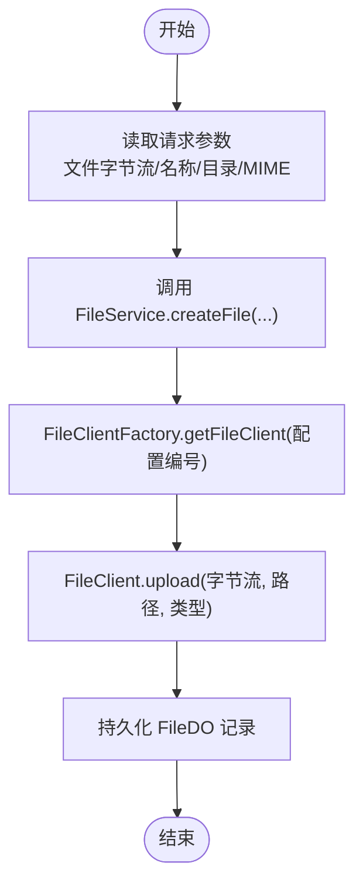
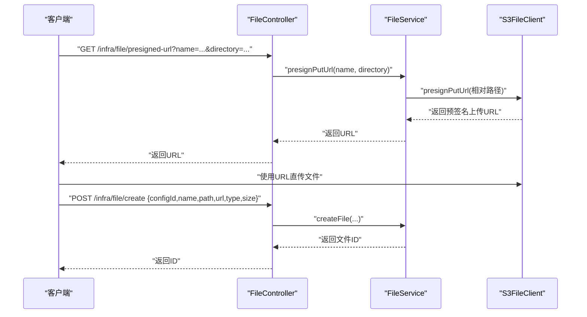
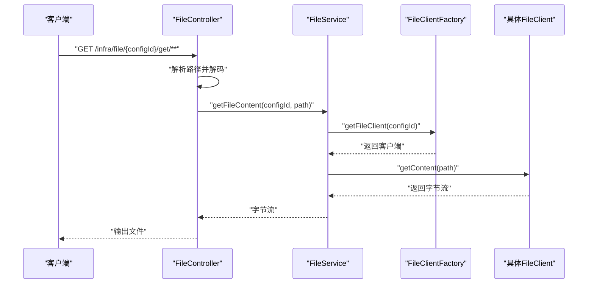
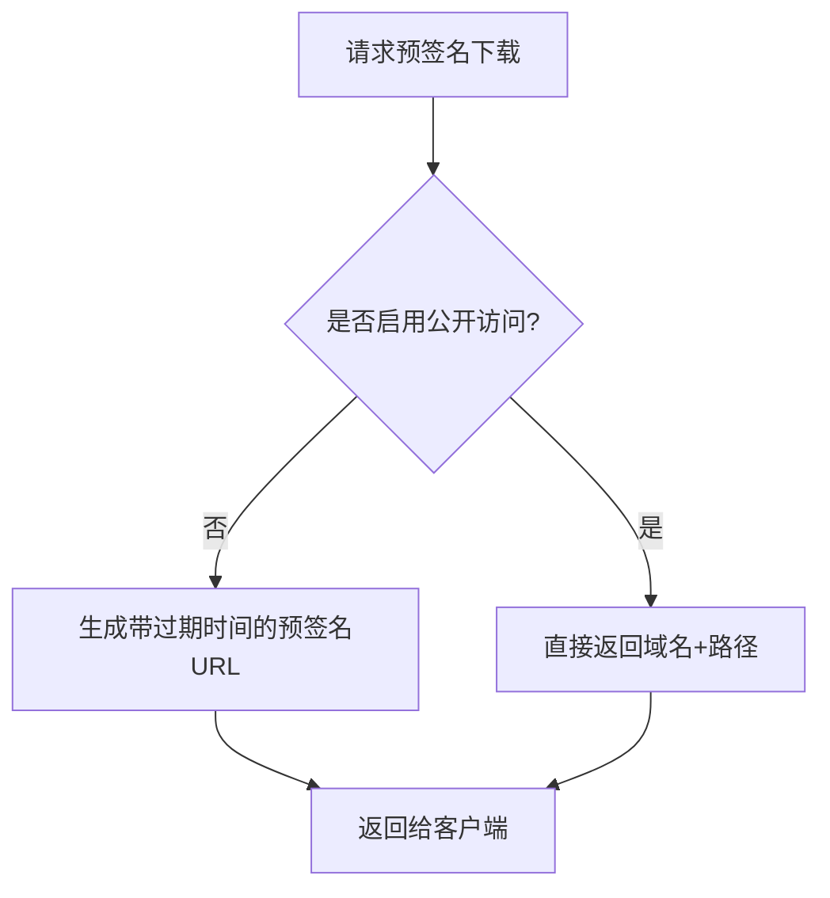
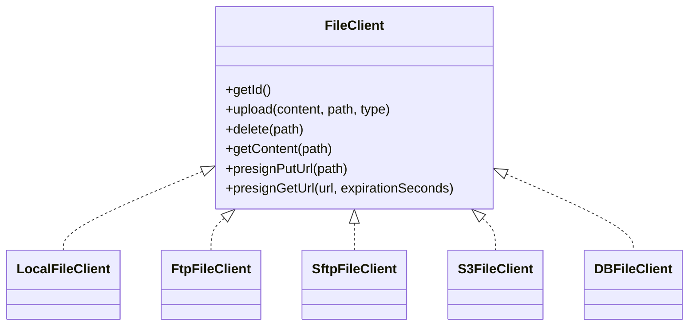
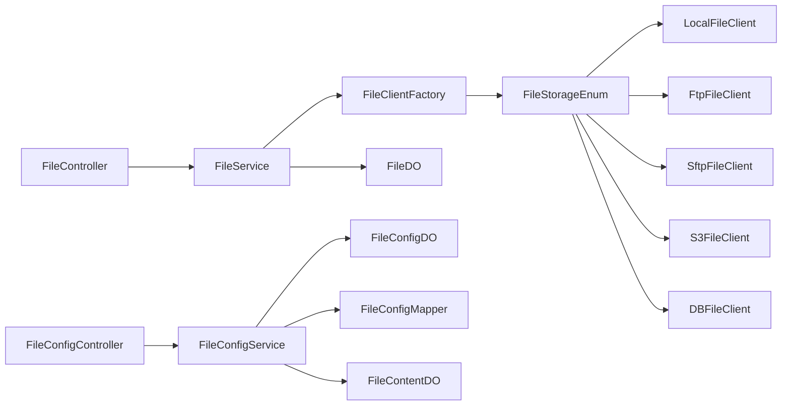

# 文件服务

<cite>
**本文引用的文件**
- [FileService.java](file://yudao-module-infra/src/main/java/cn/iocoder/yudao/module/infra/service/file/FileService.java)
- [FileController.java](file://yudao-module-infra/src/main/java/cn/iocoder/yudao/module/infra/controller/admin/file/FileController.java)
- [FileConfigController.java](file://yudao-module-infra/src/main/java/cn/iocoder/yudao/module/infra/controller/admin/file/FileConfigController.java)
- [FileApiImpl.java](file://yudao-module-infra/src/main/java/cn/iocoder/yudao/module/infra/api/file/FileApiImpl.java)
- [FileClient.java](file://yudao-module-infra/src/main/java/cn/iocoder/yudao/module/infra/framework/file/core/client/FileClient.java)
- [FileClientFactory.java](file://yudao-module-infra/src/main/java/cn/iocoder/yudao/module/infra/framework/file/core/client/FileClientFactory.java)
- [FileStorageEnum.java](file://yudao-module-infra/src/main/java/cn/iocoder/yudao/module/infra/framework/file/core/enums/FileStorageEnum.java)
- [LocalFileClient.java](file://yudao-module-infra/src/main/java/cn/iocoder/yudao/module/infra/framework/file/core/client/local/LocalFileClient.java)
- [FtpFileClient.java](file://yudao-module-infra/src/main/java/cn/iocoder/yudao/module/infra/framework/file/core/client/ftp/FtpFileClient.java)
- [SftpFileClient.java](file://yudao-module-infra/src/main/java/cn/iocoder/yudao/module/infra/framework/file/core/client/sftp/SftpFileClient.java)
- [S3FileClient.java](file://yudao-module-infra/src/main/java/cn/iocoder/yudao/module/infra/framework/file/core/client/s3/S3FileClient.java)
- [DBFileClient.java](file://yudao-module-infra/src/main/java/cn/iocoder/yudao/module/infra/framework/file/core/client/db/DBFileClient.java)
- [FileDO.java](file://yudao-module-infra/src/main/java/cn/iocoder/yudao/module/infra/dal/dataobject/file/FileDO.java)
- [FileConfigDO.java](file://yudao-module-infra/src/main/java/cn/iocoder/yudao/module/infra/dal/dataobject/file/FileConfigDO.java)
- [FileContentDO.java](file://yudao-module-infra/src/main/java/cn/iocoder/yudao/module/infra/dal/dataobject/file/FileContentDO.java)
- [FileConfigMapper.java](file://yudao-module-infra/src/main/java/cn/iocoder/yudao/module/infra/dal/mysql/file/FileConfigMapper.java)
- [FileServiceImplTest.java](file://yudao-module-infra/src/test/java/cn/iocoder/yudao/module/infra/service/file/FileServiceImplTest.java)
- [FileConfigServiceImplTest.java](file://yudao-module-infra/src/test/java/cn/iocoder/yudao/module/infra/service/file/FileConfigServiceImplTest.java)
</cite>

## 目录
1. [简介](#简介)
2. [项目结构](#项目结构)
3. [核心组件](#核心组件)
4. [架构总览](#架构总览)
5. [详细组件分析](#详细组件分析)
6. [依赖关系分析](#依赖关系分析)
7. [性能考量](#性能考量)
8. [故障排查指南](#故障排查指南)
9. [结论](#结论)
10. [附录](#附录)

## 简介
本文件服务模块提供统一的文件上传、下载、存储与访问控制能力，支持多种存储后端（本地、FTP、SFTP、S3/MinIO 等），并提供预签名上传、预签名下载、文件列表与分页、批量删除、内容读取等能力。通过“文件配置”集中管理不同存储后端的连接参数与访问域名，实现灵活切换与扩展。

## 项目结构
文件服务相关代码集中在 infra 模块中，采用“接口 + 多实现 + 控制器 + VO/DO 映射”的分层设计：
- 控制器层：对外暴露 HTTP 接口，负责参数接收、鉴权与响应封装
- 服务层：业务编排，协调文件配置与具体文件客户端
- 客户端层：抽象文件客户端接口与多种后端实现
- 数据访问层：文件与配置的持久化对象与映射器
- API 层：对外模块调用的简化接口

图表来源
- [FileController.java:41-137](file://yudao-module-infra/src/main/java/cn/iocoder/yudao/module/infra/controller/admin/file/FileController.java#L41-L137)
- [FileConfigController.java:28-98](file://yudao-module-infra/src/main/java/cn/iocoder/yudao/module/infra/controller/admin/file/FileConfigController.java#L28-L98)
- [FileService.java:17-89](file://yudao-module-infra/src/main/java/cn/iocoder/yudao/module/infra/service/file/FileService.java#L17-L89)
- [FileClientFactory.java:1-24](file://yudao-module-infra/src/main/java/cn/iocoder/yudao/module/infra/framework/file/core/client/FileClientFactory.java#L1-L24)
- [FileClient.java:8-66](file://yudao-module-infra/src/main/java/cn/iocoder/yudao/module/infra/framework/file/core/client/FileClient.java#L8-L66)
- [LocalFileClient.java:14-56](file://yudao-module-infra/src/main/java/cn/iocoder/yudao/module/infra/framework/file/core/client/local/LocalFileClient.java#L14-L56)
- [FtpFileClient.java:20-88](file://yudao-module-infra/src/main/java/cn/iocoder/yudao/module/infra/framework/file/core/client/ftp/FtpFileClient.java#L20-L88)
- [SftpFileClient.java:20-93](file://yudao-module-infra/src/main/java/cn/iocoder/yudao/module/infra/framework/file/core/client/sftp/SftpFileClient.java#L20-L93)
- [S3FileClient.java:32-233](file://yudao-module-infra/src/main/java/cn/iocoder/yudao/module/infra/framework/file/core/client/s3/S3FileClient.java#L32-L233)
- [DBFileClient.java:17-42](file://yudao-module-infra/src/main/java/cn/iocoder/yudao/module/infra/framework/file/core/client/db/DBFileClient.java#L17-L42)
- [FileDO.java:24-57](file://yudao-module-infra/src/main/java/cn/iocoder/yudao/module/infra/dal/dataobject/file/FileDO.java#L24-L57)
- [FileConfigDO.java](file://yudao-module-infra/src/main/java/cn/iocoder/yudao/module/infra/dal/dataobject/file/FileConfigDO.java)
- [FileContentDO.java](file://yudao-module-infra/src/main/java/cn/iocoder/yudao/module/infra/dal/dataobject/file/FileContentDO.java)
- [FileConfigMapper.java](file://yudao-module-infra/src/main/java/cn/iocoder/yudao/module/infra/dal/mysql/file/FileConfigMapper.java)

章节来源
- [FileController.java:41-137](file://yudao-module-infra/src/main/java/cn/iocoder/yudao/module/infra/controller/admin/file/FileController.java#L41-L137)
- [FileConfigController.java:28-98](file://yudao-module-infra/src/main/java/cn/iocoder/yudao/module/infra/controller/admin/file/FileConfigController.java#L28-L98)

## 核心组件
- 文件服务接口：定义上传、预签名、创建、删除、分页、内容读取等能力
- 文件控制器：提供 HTTP 接口，支持后端直传、前端直传（预签名）、下载、分页与批量删除
- 文件配置控制器：提供配置的增删改查与连通性测试
- 文件客户端接口与实现：抽象统一上传/删除/读取/预签名能力，内置本地、FTP、SFTP、S3、DB 等实现
- 数据模型：FileDO（文件记录）、FileConfigDO（存储配置）、FileContentDO（DB 存储的文件内容）
- 工厂与枚举：FileClientFactory 负责客户端创建与获取；FileStorageEnum 统一枚举存储类型与对应实现类

章节来源
- [FileService.java:17-89](file://yudao-module-infra/src/main/java/cn/iocoder/yudao/module/infra/service/file/FileService.java#L17-L89)
- [FileController.java:46-137](file://yudao-module-infra/src/main/java/cn/iocoder/yudao/module/infra/controller/admin/file/FileController.java#L46-L137)
- [FileConfigController.java:33-97](file://yudao-module-infra/src/main/java/cn/iocoder/yudao/module/infra/controller/admin/file/FileConfigController.java#L33-L97)
- [FileClient.java:8-66](file://yudao-module-infra/src/main/java/cn/iocoder/yudao/module/infra/framework/file/core/client/FileClient.java#L8-L66)
- [FileStorageEnum.java:26-55](file://yudao-module-infra/src/main/java/cn/iocoder/yudao/module/infra/framework/file/core/enums/FileStorageEnum.java#L26-L55)
- [FileDO.java:24-57](file://yudao-module-infra/src/main/java/cn/iocoder/yudao/module/infra/dal/dataobject/file/FileDO.java#L24-L57)
- [FileConfigDO.java](file://yudao-module-infra/src/main/java/cn/iocoder/yudao/module/infra/dal/dataobject/file/FileConfigDO.java)
- [FileContentDO.java](file://yudao-module-infra/src/main/java/cn/iocoder/yudao/module/infra/dal/dataobject/file/FileContentDO.java)

## 架构总览
文件服务通过“配置驱动 + 客户端多态”的方式实现跨存储后端的统一能力：
- 上传流程：后端直传或前端直传（预签名）。后端直传由 FileController 调用 FileService，再由 FileService 选择对应 FileClient 执行上传
- 下载流程：通过 FileController 的下载接口，根据配置编号与路径读取内容并输出
- 预签名流程：FileService 提供预签名上传/下载 URL，前端可直接上传至第三方存储或生成临时访问链接
- 配置管理：FileConfigController 管理存储配置，支持测试连通性

图表来源
- [FileController.java:50-54](file://yudao-module-infra/src/main/java/cn/iocoder/yudao/module/infra/controller/admin/file/FileController.java#L50-L54)
- [FileService.java:36-37](file://yudao-module-infra/src/main/java/cn/iocoder/yudao/module/infra/service/file/FileService.java#L36-L37)
- [FileClientFactory.java:13-22](file://yudao-module-infra/src/main/java/cn/iocoder/yudao/module/infra/framework/file/core/client/FileClientFactory.java#L13-L22)
- [FileClient.java:25-41](file://yudao-module-infra/src/main/java/cn/iocoder/yudao/module/infra/framework/file/core/client/FileClient.java#L25-L41)
- [FileDO.java:24-57](file://yudao-module-infra/src/main/java/cn/iocoder/yudao/module/infra/dal/dataobject/file/FileDO.java#L24-L57)

## 详细组件分析

### 文件上传流程（后端直传）
- 控制器接收文件字节流，提取原始文件名、目录与 MIME 类型
- 调用 FileService.createFile，内部委派给 FileClientFactory 获取具体客户端
- 客户端执行上传并返回完整访问 URL
- 持久化文件记录（FileDO）

图表来源
- [FileController.java:50-54](file://yudao-module-infra/src/main/java/cn/iocoder/yudao/module/infra/controller/admin/file/FileController.java#L50-L54)
- [FileService.java:36-37](file://yudao-module-infra/src/main/java/cn/iocoder/yudao/module/infra/service/file/FileService.java#L36-L37)
- [FileClientFactory.java:13-22](file://yudao-module-infra/src/main/java/cn/iocoder/yudao/module/infra/framework/file/core/client/FileClientFactory.java#L13-L22)
- [FileClient.java:25-41](file://yudao-module-infra/src/main/java/cn/iocoder/yudao/module/infra/framework/file/core/client/FileClient.java#L25-L41)
- [FileDO.java:24-57](file://yudao-module-infra/src/main/java/cn/iocoder/yudao/module/infra/dal/dataobject/file/FileDO.java#L24-L57)

章节来源
- [FileController.java:50-54](file://yudao-module-infra/src/main/java/cn/iocoder/yudao/module/infra/controller/admin/file/FileController.java#L50-L54)
- [FileServiceImplTest.java:126-144](file://yudao-module-infra/src/test/java/cn/iocoder/yudao/module/infra/service/file/FileServiceImplTest.java#L126-L144)

### 文件上传流程（前端直传 + 预签名）
- 生成预签名上传 URL：FileService.presignPutUrl 返回可用于前端直传的 URL
- 前端携带签名 URL 直接上传至目标存储
- 上传完成后调用 FileService.createFile 记录文件信息

图表来源
- [FileController.java:63-72](file://yudao-module-infra/src/main/java/cn/iocoder/yudao/module/infra/controller/admin/file/FileController.java#L63-L72)
- [FileService.java:46-55](file://yudao-module-infra/src/main/java/cn/iocoder/yudao/module/infra/service/file/FileService.java#L46-L55)
- [S3FileClient.java:108-113](file://yudao-module-infra/src/main/java/cn/iocoder/yudao/module/infra/framework/file/core/client/s3/S3FileClient.java#L108-L113)

章节来源
- [FileService.java:46-55](file://yudao-module-infra/src/main/java/cn/iocoder/yudao/module/infra/service/file/FileService.java#L46-L55)
- [S3FileClient.java:108-113](file://yudao-module-infra/src/main/java/cn/iocoder/yudao/module/infra/framework/file/core/client/s3/S3FileClient.java#L108-L113)

### 文件下载与内容读取
- 下载接口：FileController.get/{configId}/get/** 根据路径解码后调用 FileService.getFileContent
- 内容读取：FileService 委派具体 FileClient.getContent 获取字节流并写出

图表来源
- [FileController.java:106-126](file://yudao-module-infra/src/main/java/cn/iocoder/yudao/module/infra/controller/admin/file/FileController.java#L106-L126)
- [FileService.java:87-87](file://yudao-module-infra/src/main/java/cn/iocoder/yudao/module/infra/service/file/FileService.java#L87-L87)
- [FileClient.java:41-41](file://yudao-module-infra/src/main/java/cn/iocoder/yudao/module/infra/framework/file/core/client/FileClient.java#L41-L41)

章节来源
- [FileController.java:106-126](file://yudao-module-infra/src/main/java/cn/iocoder/yudao/module/infra/controller/admin/file/FileController.java#L106-L126)
- [FileService.java:87-87](file://yudao-module-infra/src/main/java/cn/iocoder/yudao/module/infra/service/file/FileService.java#L87-L87)

### 文件访问控制与安全
- 预签名下载：S3FileClient 支持生成带过期时间的预签名下载 URL；当启用公开访问时可直接返回域名路径
- 权限控制：控制器方法使用注解进行权限校验（如“删除文件”、“分页查询”）
- 防盗链：通过预签名 URL 限定访问有效期，避免长期有效链接泄露

图表来源
- [S3FileClient.java:116-135](file://yudao-module-infra/src/main/java/cn/iocoder/yudao/module/infra/framework/file/core/client/s3/S3FileClient.java#L116-L135)

章节来源
- [S3FileClient.java:116-135](file://yudao-module-infra/src/main/java/cn/iocoder/yudao/module/infra/framework/file/core/client/s3/S3FileClient.java#L116-L135)
- [FileController.java:86-98](file://yudao-module-infra/src/main/java/cn/iocoder/yudao/module/infra/controller/admin/file/FileController.java#L86-L98)

### 文件管理功能
- 文件列表与分页：FileController.page 返回 PageResult<FileRespVO>
- 批量删除：FileController.delete-list 支持批量 ID 删除
- 删除流程：FileService.deleteFile/deleteFileList 委派 FileClient 删除并清理记录

章节来源
- [FileController.java:129-99](file://yudao-module-infra/src/main/java/cn/iocoder/yudao/module/infra/controller/admin/file/FileController.java#L129-L99)
- [FileService.java:67-78](file://yudao-module-infra/src/main/java/cn/iocoder/yudao/module/infra/service/file/FileService.java#L67-L78)

### 支持的存储方式与配置
- 本地存储：LocalFileClient，基于本地文件系统写入与读取
- FTP：FtpFileClient，基于 Hutool FTP 客户端
- SFTP：SftpFileClient，基于 Hutool SFTP 客户端
- S3/MinIO：S3FileClient，基于 AWS SDK，支持预签名上传/下载
- 数据库存储：DBFileClient，将文件内容存入数据库

图表来源
- [FileClient.java:8-66](file://yudao-module-infra/src/main/java/cn/iocoder/yudao/module/infra/framework/file/core/client/FileClient.java#L8-L66)
- [LocalFileClient.java:14-56](file://yudao-module-infra/src/main/java/cn/iocoder/yudao/module/infra/framework/file/core/client/local/LocalFileClient.java#L14-L56)
- [FtpFileClient.java:20-88](file://yudao-module-infra/src/main/java/cn/iocoder/yudao/module/infra/framework/file/core/client/ftp/FtpFileClient.java#L20-L88)
- [SftpFileClient.java:20-93](file://yudao-module-infra/src/main/java/cn/iocoder/yudao/module/infra/framework/file/core/client/sftp/SftpFileClient.java#L20-L93)
- [S3FileClient.java:32-233](file://yudao-module-infra/src/main/java/cn/iocoder/yudao/module/infra/framework/file/core/client/s3/S3FileClient.java#L32-L233)
- [DBFileClient.java:17-42](file://yudao-module-infra/src/main/java/cn/iocoder/yudao/module/infra/framework/file/core/client/db/DBFileClient.java#L17-L42)

章节来源
- [FileStorageEnum.java:26-55](file://yudao-module-infra/src/main/java/cn/iocoder/yudao/module/infra/framework/file/core/enums/FileStorageEnum.java#L26-L55)
- [LocalFileClient.java:25-50](file://yudao-module-infra/src/main/java/cn/iocoder/yudao/module/infra/framework/file/core/client/local/LocalFileClient.java#L25-L50)
- [FtpFileClient.java:48-77](file://yudao-module-infra/src/main/java/cn/iocoder/yudao/module/infra/framework/file/core/client/ftp/FtpFileClient.java#L48-L77)
- [SftpFileClient.java:53-82](file://yudao-module-infra/src/main/java/cn/iocoder/yudao/module/infra/framework/file/core/client/sftp/SftpFileClient.java#L53-L82)
- [S3FileClient.java:75-105](file://yudao-module-infra/src/main/java/cn/iocoder/yudao/module/infra/framework/file/core/client/s3/S3FileClient.java#L75-L105)
- [DBFileClient.java:31-42](file://yudao-module-infra/src/main/java/cn/iocoder/yudao/module/infra/framework/file/core/client/db/DBFileClient.java#L31-L42)

### 文件处理能力
- 图片压缩/视频转码/文档预览等增值服务不在当前文件服务模块内实现，可通过在应用侧集成第三方服务或在业务模块中扩展实现。

## 依赖关系分析
- FileController 依赖 FileService
- FileConfigController 依赖 FileConfigService
- FileService 依赖 FileClientFactory 与 FileClient
- FileClientFactory 依据 FileStorageEnum 选择具体客户端实现
- FileDO、FileConfigDO、FileContentDO 作为数据载体，FileConfigMapper 负责配置持久化

图表来源
- [FileController.java:44-44](file://yudao-module-infra/src/main/java/cn/iocoder/yudao/module/infra/controller/admin/file/FileController.java#L44-L44)
- [FileConfigController.java:31-31](file://yudao-module-infra/src/main/java/cn/iocoder/yudao/module/infra/controller/admin/file/FileConfigController.java#L31-L31)
- [FileClientFactory.java:13-22](file://yudao-module-infra/src/main/java/cn/iocoder/yudao/module/infra/framework/file/core/client/FileClientFactory.java#L13-L22)
- [FileStorageEnum.java:51-53](file://yudao-module-infra/src/main/java/cn/iocoder/yudao/module/infra/framework/file/core/enums/FileStorageEnum.java#L51-L53)
- [FileDO.java:24-57](file://yudao-module-infra/src/main/java/cn/iocoder/yudao/module/infra/dal/dataobject/file/FileDO.java#L24-L57)
- [FileConfigDO.java](file://yudao-module-infra/src/main/java/cn/iocoder/yudao/module/infra/dal/dataobject/file/FileConfigDO.java)
- [FileConfigMapper.java](file://yudao-module-infra/src/main/java/cn/iocoder/yudao/module/infra/dal/mysql/file/FileConfigMapper.java)

章节来源
- [FileController.java:44-44](file://yudao-module-infra/src/main/java/cn/iocoder/yudao/module/infra/controller/admin/file/FileController.java#L44-L44)
- [FileConfigController.java:31-31](file://yudao-module-infra/src/main/java/cn/iocoder/yudao/module/infra/controller/admin/file/FileConfigController.java#L31-L31)
- [FileClientFactory.java:13-22](file://yudao-module-infra/src/main/java/cn/iocoder/yudao/module/infra/framework/file/core/client/FileClientFactory.java#L13-L22)
- [FileStorageEnum.java:51-53](file://yudao-module-infra/src/main/java/cn/iocoder/yudao/module/infra/framework/file/core/enums/FileStorageEnum.java#L51-L53)

## 性能考量
- 本地/FTP/SFTP 上传为流式写入，注意磁盘/网络 IO 峰值
- S3 上传建议使用分块传输（SDK 默认行为），结合合适的并发与超时配置
- 预签名下载可显著降低服务端带宽压力，但需合理设置过期时间
- 大文件下载建议使用分段/断点续传策略（可在应用层实现）

## 故障排查指南
- 上传失败：检查 FileClient 实现与配置参数（主机、端口、用户名、密码、桶/目录、域名等）
- 下载 404：确认路径解码与 FileService.getFileContent 返回为空的情况
- 预签名无效：确认 S3FileClient 的公开访问开关、过期时间与签名算法
- 连通性测试：使用 FileConfigController.test 接口验证配置可用性

章节来源
- [FileController.java:119-125](file://yudao-module-infra/src/main/java/cn/iocoder/yudao/module/infra/controller/admin/file/FileController.java#L119-L125)
- [FileConfigServiceImplTest.java:208-221](file://yudao-module-infra/src/test/java/cn/iocoder/yudao/module/infra/service/file/FileConfigServiceImplTest.java#L208-L221)

## 结论
文件服务模块以“配置驱动 + 客户端多态”为核心，统一了多种存储后端的上传、下载与访问控制能力。通过预签名机制支持前端直传与临时访问，结合权限控制与连通性测试，满足生产环境的稳定性与安全性需求。对于图片压缩、视频转码、文档预览等增值服务，可在应用层或业务模块中按需扩展。

## 附录

### 使用示例与集成方案
- 后端直传
  - 请求：POST /infra/file/upload，表单字段包含 file、directory、type
  - 响应：返回文件访问 URL
- 前端直传 + 记录
  - 步骤1：GET /infra/file/presigned-url 获取预签名上传 URL
  - 步骤2：前端使用该 URL 直接上传至目标存储
  - 步骤3：POST /infra/file/create 记录文件信息
- 下载
  - GET /infra/file/{configId}/get/**，自动输出文件内容
- 配置管理
  - 通过 /infra/file-config 接口完成存储配置的增删改查与测试

章节来源
- [FileController.java:46-137](file://yudao-module-infra/src/main/java/cn/iocoder/yudao/module/infra/controller/admin/file/FileController.java#L46-L137)
- [FileConfigController.java:33-97](file://yudao-module-infra/src/main/java/cn/iocoder/yudao/module/infra/controller/admin/file/FileConfigController.java#L33-L97)
- [FileApiImpl.java:21-28](file://yudao-module-infra/src/main/java/cn/iocoder/yudao/module/infra/api/file/FileApiImpl.java#L21-L28)