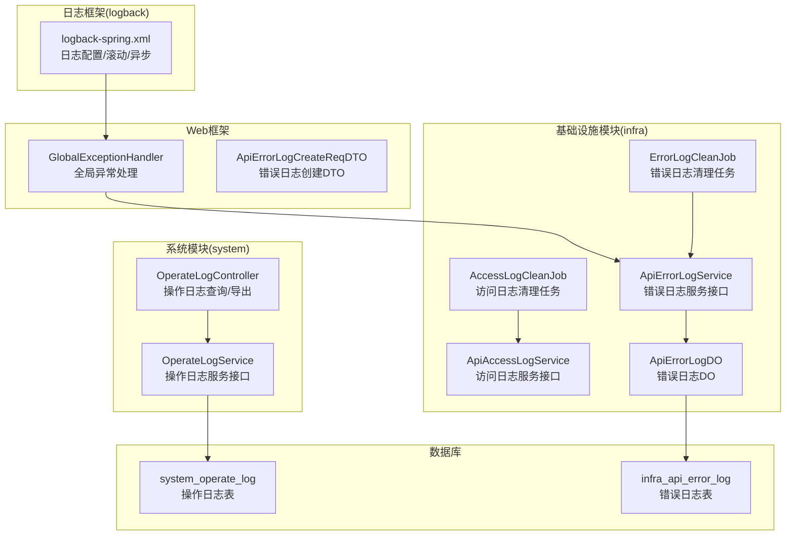
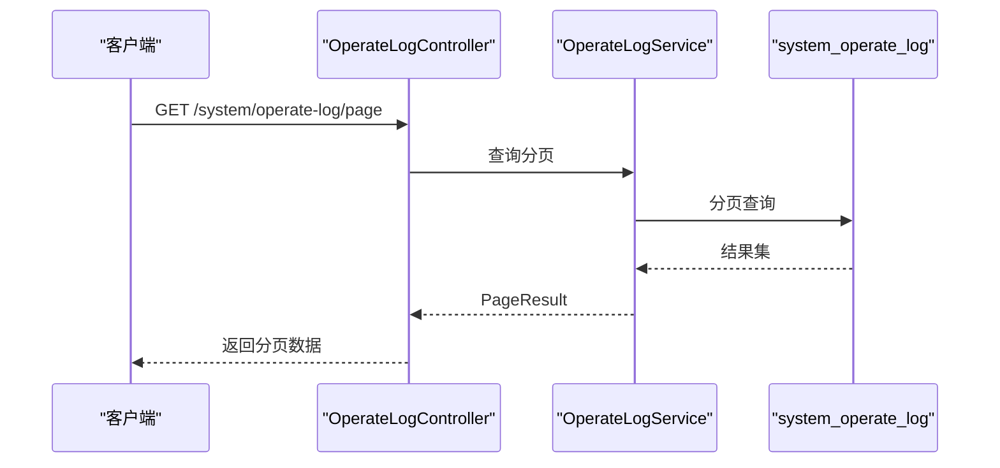
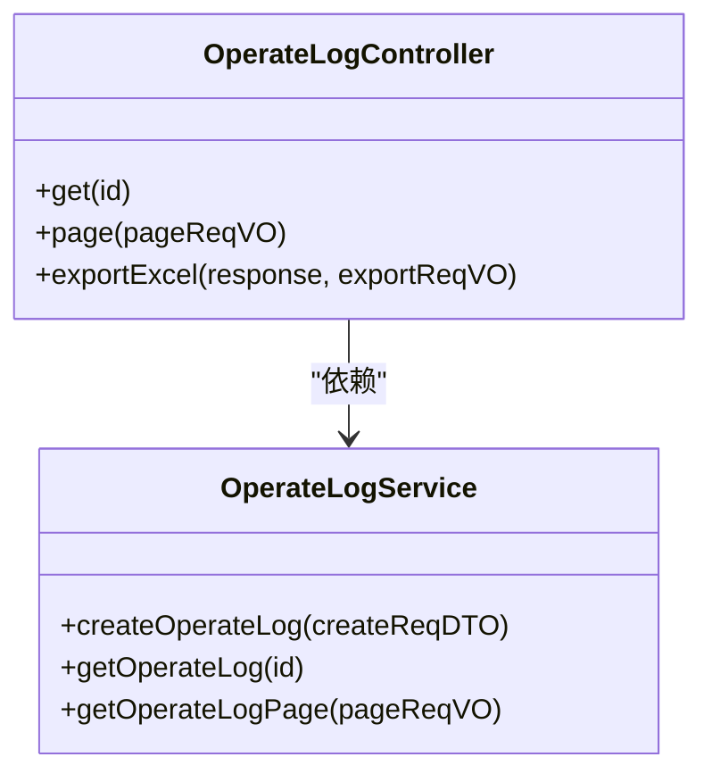
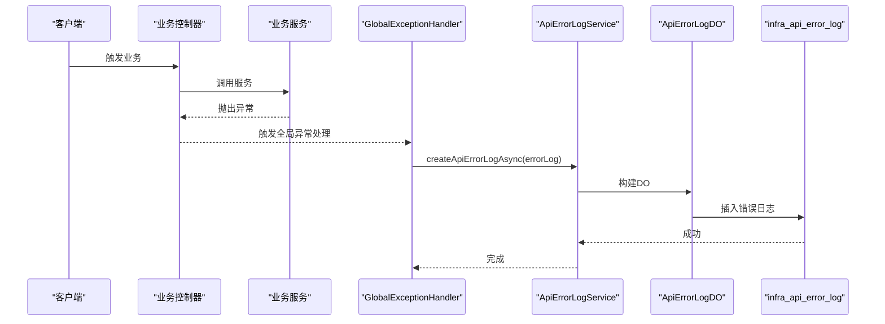
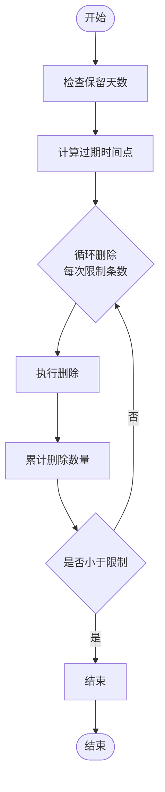
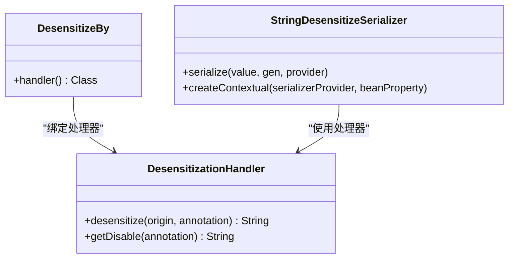
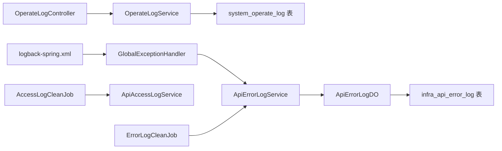

# 日志管理

<cite>
**本文引用的文件**
- [qiji-module-system\src\main\java\com.qiji.cps\module\system\controller\admin\logger\OperateLogController.java](file://qiji-module-system\src\main\java\com.qiji.cps\module\system\controller\admin\logger\OperateLogController.java)
- [qiji-module-system\src\main\java\com.qiji.cps\module\system\service\logger\OperateLogService.java](file://qiji-module-system\src\main\java\com.qiji.cps\module\system\service\logger\OperateLogService.java)
- [qiji-module-infra\src\main\java\com.qiji.cps\module\infra\service\logger\ApiAccessLogService.java](file://qiji-module-infra\src\main\java\com.qiji.cps\module\infra\service\logger\ApiAccessLogService.java)
- [qiji-module-infra\src\main\java\com.qiji.cps\module\infra\service\logger\ApiErrorLogService.java](file://qiji-module-infra\src\main\java\com.qiji.cps\module\infra\service\logger\ApiErrorLogService.java)
- [qiji-module-infra\src\main\java\com.qiji.cps\module\infra\dal\dataobject\logger\ApiErrorLogDO.java](file://qiji-module-infra\src\main\java\com.qiji.cps\module\infra\dal\dataobject\logger\ApiErrorLogDO.java)
- [qiji-module-infra\src\main\java\com.qiji.cps\module\infra\job\logger\AccessLogCleanJob.java](file://qiji-module-infra\src\main\java\com.qiji.cps\module\infra\job\logger\AccessLogCleanJob.java)
- [qiji-module-infra\src\main\java\com.qiji.cps\module\infra\job\logger\ErrorLogCleanJob.java](file://qiji-module-infra\src\main\java\com.qiji.cps\module\infra\job\logger\ErrorLogCleanJob.java)
- [qiji-module-infra\src\main\java\com.qiji.cps\module\infra\dal\mysql\job\JobLogMapper.java](file://qiji-module-infra\src\main\java\com.qiji.cps\module\infra\dal\mysql\job\JobLogMapper.java)
- [qiji-module-infra\src\main\java\com.qiji.cps\module\infra\service\logger\ApiAccessLogServiceImpl.java](file://qiji-module-infra\src\main\java\com.qiji.cps\module\infra\service\logger\ApiAccessLogServiceImpl.java)
- [qiji-module-infra\src\main\java\com.qiji.cps\module\infra\service\logger\ApiErrorLogServiceImpl.java](file://qiji-module-infra\src\main\java\com.qiji.cps\module\infra\service\logger\ApiErrorLogServiceImpl.java)
- [qiji-framework\qiji-spring-boot-starter-web\src\main\java\com.qiji.cps\framework\web\core\handler\GlobalExceptionHandler.java](file://qiji-framework\qiji-spring-boot-starter-web\src\main\java\com.qiji.cps\framework\web\core\handler\GlobalExceptionHandler.java)
- [qiji-framework\qiji-common\src\main\java\com.qiji.cps\framework\common\biz\infra\logger\dto\ApiErrorLogCreateReqDTO.java](file://qiji-framework\qiji-common\src\main\java\com.qiji.cps\framework\common\biz\infra\logger\dto\ApiErrorLogCreateReqDTO.java)
- [qiji-server\src\main\resources\logback-spring.xml](file://qiji-server\src\main\resources\logback-spring.xml)
- [sql\mysql\ruoyi-vue-pro.sql](file://sql\mysql\ruoyi-vue-pro.sql)
- [sql\postgresql\ruoyi-vue-pro.sql](file://sql\postgresql\ruoyi-vue-pro.sql)
- [sql\sqlserver\ruoyi-vue-pro.sql](file://sql\sqlserver\ruoyi-vue-pro.sql)
- [sql\dm\ruoyi-vue-pro-dm8.sql](file://sql\dm\ruoyi-vue-pro-dm8.sql)
- [qiji-framework\qiji-spring-boot-starter-web\src\main\java\com.qiji.cps\framework\desensitize\core\base\annotation\DesensitizeBy.java](file://qiji-framework\qiji-spring-boot-starter-web\src\main\java\com.qiji.cps\framework\desensitize\core\base\annotation\DesensitizeBy.java)
- [qiji-framework\qiji-spring-boot-starter-web\src\main\java\com.qiji.cps\framework\desensitize\core\base\serializer\StringDesensitizeSerializer.java](file://qiji-framework\qiji-spring-boot-starter-web\src\main\java\com.qiji.cps\framework\desensitize\core\base\serializer\StringDesensitizeSerializer.java)
- [qiji-framework\qiji-spring-boot-starter-web\src\main\java\com.qiji.cps\framework\desensitize\core\base\handler\DesensitizationHandler.java](file://qiji-framework\qiji-spring-boot-starter-web\src\main\java\com.qiji.cps\framework\desensitize\core\base\handler\DesensitizationHandler.java)
</cite>

## 目录
1. [引言](#引言)
2. [项目结构](#项目结构)
3. [核心组件](#核心组件)
4. [架构总览](#架构总览)
5. [详细组件分析](#详细组件分析)
6. [依赖关系分析](#依赖关系分析)
7. [性能考量](#性能考量)
8. [故障排查指南](#故障排查指南)
9. [结论](#结论)
10. [附录](#附录)

## 引言
本技术文档围绕日志管理功能展开，系统性阐述操作日志记录、错误日志收集、日志分析统计、日志存储管理、日志安全与脱敏、日志监控告警以及使用指南与最佳实践。文档以代码为依据，结合数据库表结构与运行时配置，帮助开发者与运维人员高效利用日志进行系统监控与问题定位。

## 项目结构
日志管理涉及多个模块与框架层：
- 系统模块（system）提供操作日志的查询与导出接口；
- 基础设施模块（infra）提供访问日志、错误日志的持久化、清理与定时任务；
- Web框架提供全局异常处理，自动采集错误日志并异步落库；
- 日志框架（logback）负责应用侧日志输出、滚动与可选 SkyWalking 集成；
- 脱敏框架提供对敏感字段在响应中的脱敏能力；
- 数据库脚本定义了操作日志与错误日志的表结构。

**图表来源**
- [qiji-module-system\src\main\java\com.qiji.cps\module\system\controller\admin\logger\OperateLogController.java:34-74](file://qiji-module-system\src\main\java\com.qiji.cps\module\system\controller\admin\logger\OperateLogController.java#L34-L74)
- [qiji-module-system\src\main\java\com.qiji.cps\module\system\service\logger\OperateLogService.java:14-48](file://qiji-module-system\src\main\java\com.qiji.cps\module\system\service\logger\OperateLogService.java#L14-L48)
- [qiji-module-infra\src\main\java\com.qiji.cps\module\infra\service\logger\ApiAccessLogService.java:13-47](file://qiji-module-infra\src\main\java\com.qiji.cps\module\infra\service\logger\ApiAccessLogService.java#L13-L47)
- [qiji-module-infra\src\main\java\com.qiji.cps\module\infra\service\logger\ApiErrorLogService.java:13-56](file://qiji-module-infra\src\main\java\com.qiji.cps\module\infra\service\logger\ApiErrorLogService.java#L13-L56)
- [qiji-module-infra\src\main\java\com.qiji.cps\module\infra\dal\dataobject\logger\ApiErrorLogDO.java:18-162](file://qiji-module-infra\src\main\java\com.qiji.cps\module\infra\dal\dataobject\logger\ApiErrorLogDO.java#L18-L162)
- [qiji-module-infra\src\main\java\com.qiji.cps\module\infra\job\logger\AccessLogCleanJob.java:16-41](file://qiji-module-infra\src\main\java\com.qiji.cps\module\infra\job\logger\AccessLogCleanJob.java#L16-L41)
- [qiji-module-infra\src\main\java\com.qiji.cps\module\infra\job\logger\ErrorLogCleanJob.java:16-41](file://qiji-module-infra\src\main\java\com.qiji.cps\module\infra\job\logger\ErrorLogCleanJob.java#L16-L41)
- [qiji-framework\qiji-spring-boot-starter-web\src\main\java\com.qiji.cps\framework\web\core\handler\GlobalExceptionHandler.java:345-394](file://qiji-framework\qiji-spring-boot-starter-web\src\main\java\com.qiji.cps\framework\web\core\handler\GlobalExceptionHandler.java#L345-L394)
- [qiji-framework\qiji-common\src\main\java\com.qiji.cps\framework\common\biz\infra\logger\dto\ApiErrorLogCreateReqDTO.java:58-107](file://qiji-framework\qiji-common\src\main\java\com.qiji.cps\framework\common\biz\infra\logger\dto\ApiErrorLogCreateReqDTO.java#L58-L107)
- [qiji-server\src\main\resources\logback-spring.xml:1-56](file://qiji-server\src\main\resources\logback-spring.xml#L1-L56)
- [sql\mysql\ruoyi-vue-pro.sql:2609-2628](file://sql\mysql\ruoyi-vue-pro.sql#L2609-L2628)
- [sql\postgresql\ruoyi-vue-pro.sql:3151-3180](file://sql\postgresql\ruoyi-vue-pro.sql#L3151-L3180)
- [sql\sqlserver\ruoyi-vue-pro.sql:7435-7467](file://sql\sqlserver\ruoyi-vue-pro.sql#L7435-L7467)
- [sql\dm\ruoyi-vue-pro-dm8.sql:2910-2933](file://sql\dm\ruoyi-vue-pro-dm8.sql#L2910-L2933)

**章节来源**
- [qiji-module-system\src\main\java\com.qiji.cps\module\system\controller\admin\logger\OperateLogController.java:34-74](file://qiji-module-system\src\main\java\com.qiji.cps\module\system\controller\admin\logger\OperateLogController.java#L34-L74)
- [qiji-module-infra\src\main\java\com.qiji.cps\module\infra\service\logger\ApiAccessLogService.java:13-47](file://qiji-module-infra\src\main\java\com.qiji.cps\module\infra\service\logger\ApiAccessLogService.java#L13-L47)
- [qiji-module-infra\src\main\java\com.qiji.cps\module\infra\service\logger\ApiErrorLogService.java:13-56](file://qiji-module-infra\src\main\java\com.qiji.cps\module\infra\service\logger\ApiErrorLogService.java#L13-L56)
- [qiji-server\src\main\resources\logback-spring.xml:1-56](file://qiji-server\src\main\resources\logback-spring.xml#L1-L56)

## 核心组件
- 操作日志控制器与服务：提供操作日志的分页查询、详情获取与导出功能，支撑审计与回溯。
- 访问日志与错误日志服务：负责访问日志与错误日志的创建、查询与清理。
- 全局异常处理：统一捕获异常，构建错误日志并异步入库。
- 日志配置：基于 Logback 的滚动与异步写入，支持可选 SkyWalking 日志采集。
- 脱敏框架：对敏感字段在响应中进行脱敏，保障数据安全。
- 定时清理任务：按保留天数定期物理删除过期日志，避免表膨胀。

**章节来源**
- [qiji-module-system\src\main\java\com.qiji.cps\module\system\controller\admin\logger\OperateLogController.java:34-74](file://qiji-module-system\src\main\java\com.qiji.cps\module\system\controller\admin\logger\OperateLogController.java#L34-L74)
- [qiji-module-system\src\main\java\com.qiji.cps\module\system\service\logger\OperateLogService.java:14-48](file://qiji-module-system\src\main\java\com.qiji.cps\module\system\service\logger\OperateLogService.java#L14-L48)
- [qiji-module-infra\src\main\java\com.qiji.cps\module\infra\service\logger\ApiAccessLogService.java:13-47](file://qiji-module-infra\src\main\java\com.qiji.cps\module\infra\service\logger\ApiAccessLogService.java#L13-L47)
- [qiji-module-infra\src\main\java\com.qiji.cps\module\infra\service\logger\ApiErrorLogService.java:13-56](file://qiji-module-infra\src\main\java\com.qiji.cps\module\infra\service\logger\ApiErrorLogService.java#L13-L56)
- [qiji-framework\qiji-spring-boot-starter-web\src\main\java\com.qiji.cps\framework\web\core\handler\GlobalExceptionHandler.java:345-394](file://qiji-framework\qiji-spring-boot-starter-web\src\main\java\com.qiji.cps\framework\web\core\handler\GlobalExceptionHandler.java#L345-L394)
- [qiji-server\src\main\resources\logback-spring.xml:1-56](file://qiji-server\src\main\resources\logback-spring.xml#L1-L56)

## 架构总览
日志管理由“接口层-服务层-持久层-基础设施-日志框架-数据库”构成闭环：
- 接口层：提供操作日志查询与导出；
- 服务层：封装业务逻辑，调用持久层；
- 持久层：MyBatis Mapper/DO，映射数据库表；
- 基础设施：定时任务清理过期日志；
- 日志框架：Logback 输出应用日志，异步写入与滚动策略；
- 全局异常：统一捕获异常，构建错误日志并异步入库。

**图表来源**
- [qiji-module-system\src\main\java\com.qiji.cps\module\system\controller\admin\logger\OperateLogController.java:52-59](file://qiji-module-system\src\main\java\com.qiji.cps\module\system\controller\admin\logger\OperateLogController.java#L52-L59)
- [qiji-module-system\src\main\java\com.qiji.cps\module\system\service\logger\OperateLogService.java:37-45](file://qiji-module-system\src\main\java\com.qiji.cps\module\system\service\logger\OperateLogService.java#L37-L45)
- [sql\mysql\ruoyi-vue-pro.sql:2609-2628](file://sql\mysql\ruoyi-vue-pro.sql#L2609-L2628)

**章节来源**
- [qiji-module-system\src\main\java\com.qiji.cps\module\system\controller\admin\logger\OperateLogController.java:34-74](file://qiji-module-system\src\main\java\com.qiji.cps\module\system\controller\admin\logger\OperateLogController.java#L34-L74)
- [qiji-module-system\src\main\java\com.qiji.cps\module\system\service\logger\OperateLogService.java:14-48](file://qiji-module-system\src\main\java\com.qiji.cps\module\system\service\logger\OperateLogService.java#L14-L48)

## 详细组件分析

### 操作日志记录与查询
- 记录机制：通过系统模块的服务接口记录操作日志，包含用户、模块、动作、结果、扩展信息、请求上下文等。
- 查询与导出：提供分页查询与导出 Excel 功能，便于审计与报表。

**图表来源**
- [qiji-module-system\src\main\java\com.qiji.cps\module\system\controller\admin\logger\OperateLogController.java:34-74](file://qiji-module-system\src\main\java\com.qiji.cps\module\system\controller\admin\logger\OperateLogController.java#L34-L74)
- [qiji-module-system\src\main\java\com.qiji.cps\module\system\service\logger\OperateLogService.java:14-48](file://qiji-module-system\src\main\java\com.qiji.cps\module\system\service\logger\OperateLogService.java#L14-L48)

**章节来源**
- [qiji-module-system\src\main\java\com.qiji.cps\module\system\controller\admin\logger\OperateLogController.java:34-74](file://qiji-module-system\src\main\java\com.qiji.cps\module\system\controller\admin\logger\OperateLogController.java#L34-L74)
- [qiji-module-system\src\main\java\com.qiji.cps\module\system\service\logger\OperateLogService.java:14-48](file://qiji-module-system\src\main\java\com.qiji.cps\module\system\service\logger\OperateLogService.java#L14-L48)

### 错误日志收集与处理
- 异常捕获：全局异常处理器统一捕获异常，提取异常栈、类名、方法、行号等信息。
- 日志创建：构造错误日志 DTO 并异步创建，避免阻塞主线程。
- 存储与清理：错误日志持久化至 infra_api_error_log，定时任务定期清理过期数据。

**图表来源**
- [qiji-framework\qiji-spring-boot-starter-web\src\main\java\com.qiji.cps\framework\web\core\handler\GlobalExceptionHandler.java:345-394](file://qiji-framework\qiji-spring-boot-starter-web\src\main\java\com.qiji.cps\framework\web\core\handler\GlobalExceptionHandler.java#L345-L394)
- [qiji-module-infra\src\main\java\com.qiji.cps\module\infra\service\logger\ApiErrorLogService.java:13-56](file://qiji-module-infra\src\main\java\com.qiji.cps\module\infra\service\logger\ApiErrorLogService.java#L13-L56)
- [qiji-module-infra\src\main\java\com.qiji.cps\module\infra\dal\dataobject\logger\ApiErrorLogDO.java:18-162](file://qiji-module-infra\src\main\java\com.qiji.cps\module\infra\dal\dataobject\logger\ApiErrorLogDO.java#L18-L162)

**章节来源**
- [qiji-framework\qiji-spring-boot-starter-web\src\main\java\com.qiji.cps\framework\web\core\handler\GlobalExceptionHandler.java:345-394](file://qiji-framework\qiji-spring-boot-starter-web\src\main\java\com.qiji.cps\framework\web\core\handler\GlobalExceptionHandler.java#L345-L394)
- [qiji-module-infra\src\main\java\com.qiji.cps\module\infra\service\logger\ApiErrorLogService.java:13-56](file://qiji-module-infra\src\main\java\com.qiji.cps\module\infra\service\logger\ApiErrorLogService.java#L13-L56)
- [qiji-module-infra\src\main\java\com.qiji.cps\module\infra\dal\dataobject\logger\ApiErrorLogDO.java:18-162](file://qiji-module-infra\src\main\java\com.qiji.cps\module\infra\dal\dataobject\logger\ApiErrorLogDO.java#L18-L162)

### 日志分析与统计
- 操作日志：支持按用户、模块、时间、关键字等维度分页查询与导出，用于审计与统计。
- 错误日志：按异常类型、时间、应用名等维度查询，支持标记处理状态，便于问题闭环管理。
- 统计报表：通过导出功能生成报表，结合外部 BI 工具进行趋势分析。

**章节来源**
- [qiji-module-system\src\main\java\com.qiji.cps\module\system\controller\admin\logger\OperateLogController.java:52-71](file://qiji-module-system\src\main\java\com.qiji.cps\module\system\controller\admin\logger\OperateLogController.java#L52-L71)
- [qiji-module-infra\src\main\java\com.qiji.cps\module\infra\service\logger\ApiErrorLogService.java:30-45](file://qiji-module-infra\src\main\java\com.qiji.cps\module\infra\service\logger\ApiErrorLogService.java#L30-L45)

### 日志存储管理
- 表结构：操作日志表与错误日志表分别记录不同类型的日志；均包含用户、请求上下文、链路追踪、时间戳、租户等字段。
- 存储策略：Logback 使用滚动策略按大小与时间滚动，异步写入提升吞吐。
- 归档清理：定时任务按保留天数清理过期日志，避免无限增长。

**图表来源**
- [qiji-module-infra\src\main\java\com.qiji.cps\module\infra\job\logger\AccessLogCleanJob.java:16-41](file://qiji-module-infra\src\main\java\com.qiji.cps\module\infra\job\logger\AccessLogCleanJob.java#L16-L41)
- [qiji-module-infra\src\main\java\com.qiji.cps\module\infra\job\logger\ErrorLogCleanJob.java:16-41](file://qiji-module-infra\src\main\java\com.qiji.cps\module\infra\job\logger\ErrorLogCleanJob.java#L16-L41)
- [qiji-module-infra\src\main\java\com.qiji.cps\module\infra\service\logger\ApiAccessLogServiceImpl.java:61-75](file://qiji-module-infra\src\main\java\com.qiji.cps\module\infra\service\logger\ApiAccessLogServiceImpl.java#L61-L75)
- [qiji-module-infra\src\main\java\com.qiji.cps\module\infra\service\logger\ApiErrorLogServiceImpl.java:85-97](file://qiji-module-infra\src\main\java\com.qiji.cps\module\infra\service\logger\ApiErrorLogServiceImpl.java#L85-L97)

**章节来源**
- [qiji-server\src\main\resources\logback-spring.xml:17-35](file://qiji-server\src\main\resources\logback-spring.xml#L17-L35)
- [qiji-module-infra\src\main\java\com.qiji.cps\module\infra\job\logger\AccessLogCleanJob.java:16-41](file://qiji-module-infra\src\main\java\com.qiji.cps\module\infra\job\logger\AccessLogCleanJob.java#L16-L41)
- [qiji-module-infra\src\main\java\com.qiji.cps\module\infra\job\logger\ErrorLogCleanJob.java:16-41](file://qiji-module-infra\src\main\java\com.qiji.cps\module\infra\job\logger\ErrorLogCleanJob.java#L16-L41)

### 日志安全与脱敏
- 敏感信息脱敏：通过脱敏注解与序列化器，在 JSON 响应中对敏感字段进行脱敏处理，支持多种规则与禁用表达式。
- 访问控制：操作日志查询与导出接口受权限控制，仅授权用户可访问。
- 日志加密：当前未见通用日志加密实现，建议在传输与存储层面结合 TLS 与数据库加密策略。

**图表来源**
- [qiji-framework\qiji-spring-boot-starter-web\src\main\java\com.qiji.cps\framework\desensitize\core\base\annotation\DesensitizeBy.java:19-32](file://qiji-framework\qiji-spring-boot-starter-web\src\main\java\com.qiji.cps\framework\desensitize\core\base\annotation\DesensitizeBy.java#L19-L32)
- [qiji-framework\qiji-spring-boot-starter-web\src\main\java\com.qiji.cps\framework\desensitize\core\base\serializer\StringDesensitizeSerializer.java:42-68](file://qiji-framework\qiji-spring-boot-starter-web\src\main\java\com.qiji.cps\framework\desensitize\core\base\serializer\StringDesensitizeSerializer.java#L42-L68)
- [qiji-framework\qiji-spring-boot-starter-web\src\main\java\com.qiji.cps\framework\desensitize\core\base\handler\DesensitizationHandler.java:12-40](file://qiji-framework\qiji-spring-boot-starter-web\src\main\java\com.qiji.cps\framework\desensitize\core\base\handler\DesensitizationHandler.java#L12-L40)

**章节来源**
- [qiji-framework\qiji-spring-boot-starter-web\src\main\java\com.qiji.cps\framework\desensitize\core\base\annotation\DesensitizeBy.java:19-32](file://qiji-framework\qiji-spring-boot-starter-web\src\main\java\com.qiji.cps\framework\desensitize\core\base\annotation\DesensitizeBy.java#L19-L32)
- [qiji-framework\qiji-spring-boot-starter-web\src\main\java\com.qiji.cps\framework\desensitize\core\base\serializer\StringDesensitizeSerializer.java:42-68](file://qiji-framework\qiji-spring-boot-starter-web\src\main\java\com.qiji.cps\framework\desensitize\core\base\serializer\StringDesensitizeSerializer.java#L42-L68)
- [qiji-module-system\src\main\java\com.qiji.cps\module\system\controller\admin\logger\OperateLogController.java:46-66](file://qiji-module-system\src\main\java\com.qiji.cps\module\system\controller\admin\logger\OperateLogController.java#L46-L66)

### 日志监控告警
- 异常检测：通过全局异常处理与错误日志表，可对异常进行集中统计与趋势分析。
- 性能预警：结合访问日志与错误日志的 QPS、错误率、耗时分布，建立阈值告警。
- 系统故障通知：可将错误日志与外部监控平台对接，触发告警通知。

**章节来源**
- [qiji-framework\qiji-spring-boot-starter-web\src\main\java\com.qiji.cps\framework\web\core\handler\GlobalExceptionHandler.java:345-394](file://qiji-framework\qiji-spring-boot-starter-web\src\main\java\com.qiji.cps\framework\web\core\handler\GlobalExceptionHandler.java#L345-L394)
- [qiji-module-infra\src\main\java\com.qiji.cps\module\infra\dal\dataobject\logger\ApiErrorLogDO.java:88-140](file://qiji-module-infra\src\main\java\com.qiji.cps\module\infra\dal\dataobject\logger\ApiErrorLogDO.java#L88-L140)

## 依赖关系分析
- 控制器依赖服务接口，服务接口依赖 DO 与 Mapper；
- 全局异常处理依赖错误日志服务与 DTO；
- 日志配置影响异常处理的输出与采集；
- 定时任务依赖服务接口进行清理。

**图表来源**
- [qiji-module-system\src\main\java\com.qiji.cps\module\system\controller\admin\logger\OperateLogController.java:34-74](file://qiji-module-system\src\main\java\com.qiji.cps\module\system\controller\admin\logger\OperateLogController.java#L34-L74)
- [qiji-module-system\src\main\java\com.qiji.cps\module\system\service\logger\OperateLogService.java:14-48](file://qiji-module-system\src\main\java\com.qiji.cps\module\system\service\logger\OperateLogService.java#L14-L48)
- [qiji-framework\qiji-spring-boot-starter-web\src\main\java\com.qiji.cps\framework\web\core\handler\GlobalExceptionHandler.java:345-394](file://qiji-framework\qiji-spring-boot-starter-web\src\main\java\com.qiji.cps\framework\web\core\handler\GlobalExceptionHandler.java#L345-L394)
- [qiji-module-infra\src\main\java\com.qiji.cps\module\infra\service\logger\ApiErrorLogService.java:13-56](file://qiji-module-infra\src\main\java\com.qiji.cps\module\infra\service\logger\ApiErrorLogService.java#L13-L56)
- [qiji-module-infra\src\main\java\com.qiji.cps\module\infra\dal\dataobject\logger\ApiErrorLogDO.java:18-162](file://qiji-module-infra\src\main\java\com.qiji.cps\module\infra\dal\dataobject\logger\ApiErrorLogDO.java#L18-L162)
- [qiji-module-infra\src\main\java\com.qiji.cps\module\infra\job\logger\AccessLogCleanJob.java:16-41](file://qiji-module-infra\src\main\java\com.qiji.cps\module\infra\job\logger\AccessLogCleanJob.java#L16-L41)
- [qiji-module-infra\src\main\java\com.qiji.cps\module\infra\job\logger\ErrorLogCleanJob.java:16-41](file://qiji-module-infra\src\main\java\com.qiji.cps\module\infra\job\logger\ErrorLogCleanJob.java#L16-L41)
- [qiji-server\src\main\resources\logback-spring.xml:1-56](file://qiji-server\src\main\resources\logback-spring.xml#L1-L56)

**章节来源**
- [qiji-module-system\src\main\java\com.qiji.cps\module\system\controller\admin\logger\OperateLogController.java:34-74](file://qiji-module-system\src\main\java\com.qiji.cps\module\system\controller\admin\logger\OperateLogController.java#L34-L74)
- [qiji-framework\qiji-spring-boot-starter-web\src\main\java\com.qiji.cps\framework\web\core\handler\GlobalExceptionHandler.java:345-394](file://qiji-framework\qiji-spring-boot-starter-web\src\main\java\com.qiji.cps\framework\web\core\handler\GlobalExceptionHandler.java#L345-L394)

## 性能考量
- 异步写日志：Logback 异步 Appender 提升吞吐，避免 IO 阻塞；
- 滚动策略：按大小与时间滚动，平衡磁盘占用与查询效率；
- 清理策略：分批删除，避免一次性删除造成数据库压力；
- 导出限制：导出时设置无分页上限，注意内存与网络开销。

**章节来源**
- [qiji-server\src\main\resources\logback-spring.xml:31-35](file://qiji-server\src\main\resources\logback-spring.xml#L31-L35)
- [qiji-module-infra\src\main\java\com.qiji.cps\module\infra\service\logger\ApiAccessLogServiceImpl.java:61-75](file://qiji-module-infra\src\main\java\com.qiji.cps\module\infra\service\logger\ApiAccessLogServiceImpl.java#L61-L75)
- [qiji-module-infra\src\main\java\com.qiji.cps\module\infra\service\logger\ApiErrorLogServiceImpl.java:85-97](file://qiji-module-infra\src\main\java\com.qiji.cps\module\infra\service\logger\ApiErrorLogServiceImpl.java#L85-L97)

## 故障排查指南
- 错误日志未入库：检查全局异常处理是否被触发、异步创建是否抛出异常、数据库连接与表是否存在；
- 日志量过大：调整滚动策略、增大保留天数或增加清理频率；
- 导出失败或内存溢出：减少单次导出条数或分批导出；
- 脱敏不生效：确认字段是否标注脱敏注解、序列化器是否启用。

**章节来源**
- [qiji-framework\qiji-spring-boot-starter-web\src\main\java\com.qiji.cps\framework\web\core\handler\GlobalExceptionHandler.java:345-394](file://qiji-framework\qiji-spring-boot-starter-web\src\main\java\com.qiji.cps\framework\web\core\handler\GlobalExceptionHandler.java#L345-L394)
- [qiji-module-infra\src\main\java\com.qiji.cps\module\infra\job\logger\AccessLogCleanJob.java:16-41](file://qiji-module-infra\src\main\java\com.qiji.cps\module\infra\job\logger\AccessLogCleanJob.java#L16-L41)
- [qiji-module-infra\src\main\java\com.qiji.cps\module\infra\job\logger\ErrorLogCleanJob.java:16-41](file://qiji-module-infra\src\main\java\com.qiji.cps\module\infra\job\logger\ErrorLogCleanJob.java#L16-L41)

## 结论
本日志管理方案覆盖操作日志、错误日志、访问日志的采集、存储、清理与分析，配合脱敏与权限控制，形成完整的安全与可观测体系。通过异步日志与滚动策略保障性能，定时清理避免数据膨胀，结合导出与统计实现审计与报表需求。

## 附录
- 使用指南与最佳实践
  - 操作日志：仅记录必要字段，避免冗余；使用分页查询与导出功能定期归档；
  - 错误日志：关注异常类型分布与根因，建立处理闭环；合理设置保留天数；
  - 日志安全：对敏感字段统一脱敏；严格控制查询与导出权限；
  - 性能优化：根据流量调整滚动与异步队列大小；定期评估清理策略；
  - 监控告警：基于错误日志与访问日志建立阈值告警，联动运维流程。