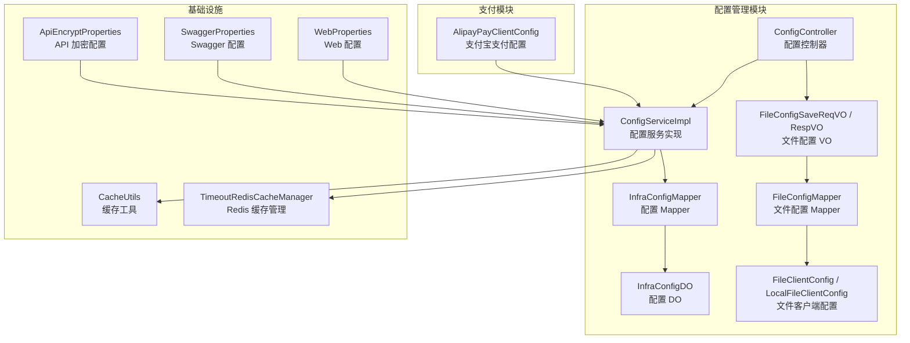
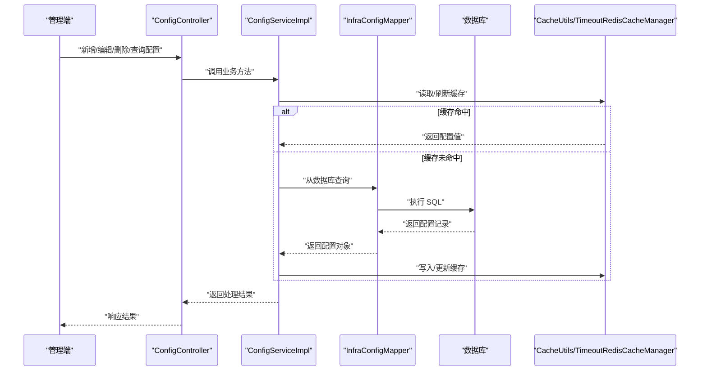
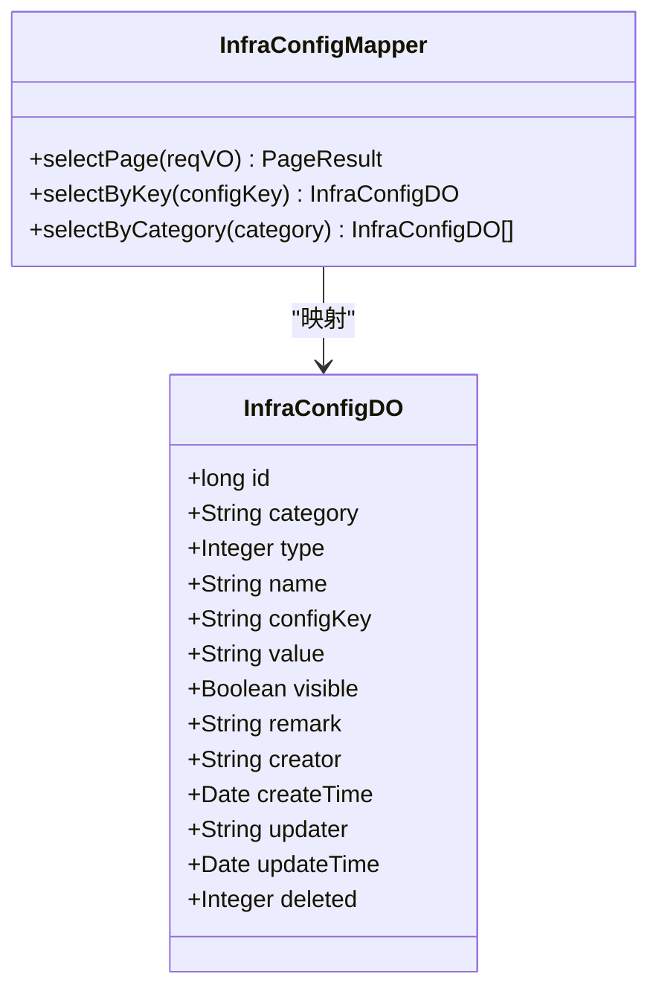
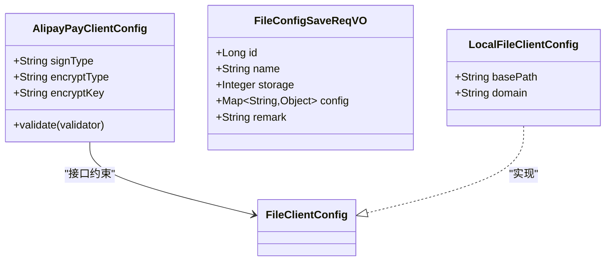
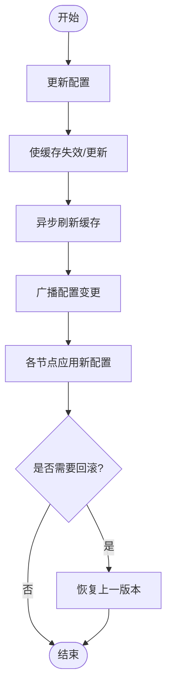
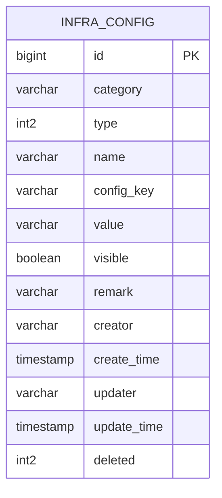
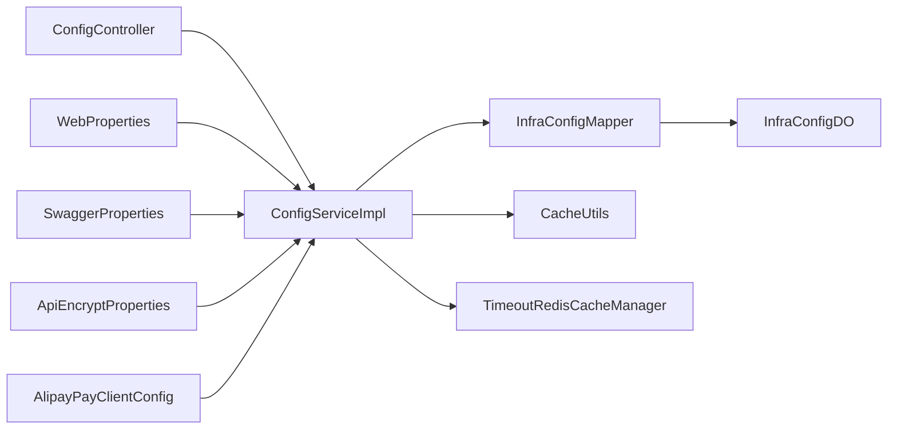

# 配置管理

<cite>
**本文引用的文件列表**
- [qiji-module-infra/src/main/java/cn/zhijian/cps/mcp/server/CpsMcpServer.java](file://qiji-module-cps/qiji-module-cps-biz/src/main/java/cn/zhijian/cps/mcp/server/CpsMcpServer.java)
- [qiji-module-infra/src/main/java/com.qiji.cps/module/infra/controller/admin/config/ConfigController.java](file://qiji-module-infra/src/main/java/com.qiji.cps/module/infra/controller/admin/config/ConfigController.java)
- [qiji-module-infra/src/main/java/com.qiji.cps/module/infra/service/config/ConfigServiceImpl.java](file://qiji-module-infra/src/main/java/com.qiji.cps/module/infra/service/config/ConfigServiceImpl.java)
- [qiji-module-infra/src/main/java/com.qiji.cps/module/infra/dal/dataobject/config/InfraConfigDO.java](file://qiji-module-infra/src/main/java/com.qiji.cps/module/infra/dal/dataobject/config/InfraConfigDO.java)
- [qiji-module-infra/src/main/java/com.qiji.cps/module/infra/dal/mysql/config/InfraConfigMapper.java](file://qiji-module-infra/src/main/java/com.qiji.cps/module/infra/dal/mysql/config/InfraConfigMapper.java)
- [qiji-module-infra/src/main/java/com.qiji.cps/module/infra/framework/file/core/client/FileClientConfig.java](file://qiji-module-infra/src/main/java/com.qiji.cps/module/infra/framework/file/core/client/FileClientConfig.java)
- [qiji-module-infra/src/main/java/com.qiji.cps/module/infra/framework/file/core/client/local/LocalFileClientConfig.java](file://qiji-module-infra/src/main/java/com.qiji.cps/module/infra/framework/file/core/client/local/LocalFileClientConfig.java)
- [qiji-module-infra/src/main/java/com.qiji.cps/module/infra/controller/admin/file/vo/config/FileConfigSaveReqVO.java](file://qiji-module-infra/src/main/java/com.qiji.cps/module/infra/controller/admin/file/vo/config/FileConfigSaveReqVO.java)
- [qiji-module-infra/src/main/java/com.qiji.cps/module/infra/controller/admin/file/vo/config/FileConfigRespVO.java](file://qiji-module-infra/src/main/java/com.qiji.cps/module/infra/controller/admin/file/vo/config/FileConfigRespVO.java)
- [qiji-module-infra/src/main/java/com.qiji.cps/module/infra/dal/mysql/file/FileConfigMapper.java](file://qiji-module-infra/src/main/java/com.qiji.cps/module/infra/dal/mysql/file/FileConfigMapper.java)
- [qiji-module-infra/src/test/java/com.qiji.cps/module/infra/service/logger/ApiAccessLogServiceImplTest.java](file://qiji-module-infra/src/test/java/com.qiji.cps/module/infra/service/logger/ApiAccessLogServiceImplTest.java)
- [qiji-framework/qiji-common/src/main/java/com.qiji.cps/framework/common/util/cache/CacheUtils.java](file://qiji-framework/qiji-common/src/main/java/com.qiji.cps/framework/common/util/cache/CacheUtils.java)
- [qiji-framework/qiji-spring-boot-starter-redis/src/main/java/com.qiji.cps/framework/redis/core/TimeoutRedisCacheManager.java](file://qiji-framework/qiji-spring-boot-starter-redis/src/main/java/com.qiji.cps/framework/redis/core/TimeoutRedisCacheManager.java)
- [qiji-framework/qiji-spring-boot-starter-web/src/main/java/com.qiji.cps/framework/web/config/WebProperties.java](file://qiji-framework/qiji-spring-boot-starter-web/src/main/java/com.qiji.cps/framework/web/config/WebProperties.java)
- [qiji-framework/qiji-spring-boot-starter-web/src/main/java/com.qiji.cps/framework/swagger/config/SwaggerProperties.java](file://qiji-framework/qiji-spring-boot-starter-web/src/main/java/com.qiji.cps/framework/swagger/config/SwaggerProperties.java)
- [qiji-framework/qiji-spring-boot-starter-web/src/main/java/com.qiji.cps/framework/encrypt/config/ApiEncryptProperties.java](file://qiji-framework/qiji-spring-boot-starter-web/src/main/java/com.qiji.cps/framework/encrypt/config/ApiEncryptProperties.java)
- [qiji-module-pay/src/main/java/com.qiji.cps/module/pay/framework/pay/core/client/impl/alipay/AlipayPayClientConfig.java](file://qiji-module-pay/src/main/java/com.qiji.cps/module/pay/framework/pay/core/client/impl/alipay/AlipayPayClientConfig.java)
- [sql/mysql/ruoyi-vue-pro.sql](file://sql/mysql/ruoyi-vue-pro.sql)
- [sql/postgresql/ruoyi-vue-pro.sql](file://sql/postgresql/ruoyi-vue-pro.sql)
- [sql/oracle/ruoyi-vue-pro.sql](file://sql/oracle/ruoyi-vue-pro.sql)
- [sql/sqlserver/ruoyi-vue-pro.sql](file://sql/sqlserver/ruoyi-vue-pro.sql)
- [sql/opengauss/ruoyi-vue-pro.sql](file://sql/opengauss/ruoyi-vue-pro.sql)
- [sql/dm/ruoyi-vue-pro-dm8.sql](file://sql/dm/ruoyi-vue-pro-dm8.sql)
- [sql/kingbase/ruoyi-vue-pro.sql](file://sql/kingbase/ruoyi-vue-pro.sql)
</cite>

## 目录
1. [简介](#简介)
2. [项目结构](#项目结构)
3. [核心组件](#核心组件)
4. [架构总览](#架构总览)
5. [详细组件分析](#详细组件分析)
6. [依赖关系分析](#依赖关系分析)
7. [性能考量](#性能考量)
8. [故障排查指南](#故障排查指南)
9. [结论](#结论)
10. [附录](#附录)

## 简介
本技术文档围绕配置管理功能进行系统化梳理，覆盖配置项的分类、定义、默认值与校验、动态更新与热更新、配置广播与生效策略、回滚机制、持久化与加密、备份与迁移、权限控制与审计日志、监控告警以及使用方式（获取、缓存、刷新）等主题。文档以仓库中实际存在的配置管理模块与相关基础设施为依据，结合数据库表结构与业务实现，给出可落地的架构说明与最佳实践建议。

## 项目结构
配置管理功能主要分布在 infra 模块与支付模块中：
- infra 模块提供通用的配置管理能力（参数配置、文件配置、缓存与加密配置等）
- 支付模块提供支付渠道的配置（如支付宝配置），体现“配置项定义 + 校验”的典型模式
- 数据库层面提供参数配置表与文件配置相关表，支撑配置的持久化与版本化

图示来源
- [qiji-module-infra/src/main/java/com.qiji.cps/module/infra/controller/admin/config/ConfigController.java](file://qiji-module-infra/src/main/java/com.qiji.cps/module/infra/controller/admin/config/ConfigController.java)
- [qiji-module-infra/src/main/java/com.qiji.cps/module/infra/service/config/ConfigServiceImpl.java](file://qiji-module-infra/src/main/java/com.qiji.cps/module/infra/service/config/ConfigServiceImpl.java)
- [qiji-module-infra/src/main/java/com.qiji.cps/module/infra/dal/mysql/config/InfraConfigMapper.java](file://qiji-module-infra/src/main/java/com.qiji.cps/module/infra/dal/mysql/config/InfraConfigMapper.java)
- [qiji-module-infra/src/main/java/com.qiji.cps/module/infra/dal/dataobject/config/InfraConfigDO.java](file://qiji-module-infra/src/main/java/com.qiji.cps/module/infra/dal/dataobject/config/InfraConfigDO.java)
- [qiji-module-infra/src/main/java/com.qiji.cps/module/infra/controller/admin/file/vo/config/FileConfigSaveReqVO.java](file://qiji-module-infra/src/main/java/com.qiji.cps/module/infra/controller/admin/file/vo/config/FileConfigSaveReqVO.java)
- [qiji-module-infra/src/main/java/com.qiji.cps/module/infra/controller/admin/file/vo/config/FileConfigRespVO.java](file://qiji-module-infra/src/main/java/com.qiji.cps/module/infra/controller/admin/file/vo/config/FileConfigRespVO.java)
- [qiji-module-infra/src/main/java/com.qiji.cps/module/infra/dal/mysql/file/FileConfigMapper.java](file://qiji-module-infra/src/main/java/com.qiji.cps/module/infra/dal/mysql/file/FileConfigMapper.java)
- [qiji-module-infra/src/main/java/com.qiji.cps/module/infra/framework/file/core/client/FileClientConfig.java](file://qiji-module-infra/src/main/java/com.qiji.cps/module/infra/framework/file/core/client/FileClientConfig.java)
- [qiji-module-infra/src/main/java/com.qiji.cps/module/infra/framework/file/core/client/local/LocalFileClientConfig.java](file://qiji-module-infra/src/main/java/com.qiji.cps/module/infra/framework/file/core/client/local/LocalFileClientConfig.java)
- [qiji-framework/qiji-common/src/main/java/com.qiji.cps/framework/common/util/cache/CacheUtils.java](file://qiji-framework/qiji-common/src/main/java/com.qiji.cps/framework/common/util/cache/CacheUtils.java)
- [qiji-framework/qiji-spring-boot-starter-redis/src/main/java/com.qiji.cps/framework/redis/core/TimeoutRedisCacheManager.java](file://qiji-framework/qiji-spring-boot-starter-redis/src/main/java/com.qiji.cps/framework/redis/core/TimeoutRedisCacheManager.java)
- [qiji-framework/qiji-spring-boot-starter-web/src/main/java/com.qiji.cps/framework/web/config/WebProperties.java](file://qiji-framework/qiji-spring-boot-starter-web/src/main/java/com.qiji.cps/framework/web/config/WebProperties.java)
- [qiji-framework/qiji-spring-boot-starter-web/src/main/java/com.qiji.cps/framework/swagger/config/SwaggerProperties.java](file://qiji-framework/qiji-spring-boot-starter-web/src/main/java/com.qiji.cps/framework/swagger/config/SwaggerProperties.java)
- [qiji-framework/qiji-spring-boot-starter-web/src/main/java/com.qiji.cps/framework/encrypt/config/ApiEncryptProperties.java](file://qiji-framework/qiji-spring-boot-starter-web/src/main/java/com.qiji.cps/framework/encrypt/config/ApiEncryptProperties.java)
- [qiji-module-pay/src/main/java/com.qiji.cps/module/pay/framework/pay/core/client/impl/alipay/AlipayPayClientConfig.java](file://qiji-module-pay/src/main/java/com.qiji.cps/module/pay/framework/pay/core/client/impl/alipay/AlipayPayClientConfig.java)

章节来源
- [qiji-module-infra/src/main/java/com.qiji.cps/module/infra/controller/admin/config/ConfigController.java](file://qiji-module-infra/src/main/java/com.qiji.cps/module/infra/controller/admin/config/ConfigController.java)
- [qiji-module-infra/src/main/java/com.qiji.cps/module/infra/service/config/ConfigServiceImpl.java](file://qiji-module-infra/src/main/java/com.qiji.cps/module/infra/service/config/ConfigServiceImpl.java)
- [qiji-module-infra/src/main/java/com.qiji.cps/module/infra/dal/mysql/config/InfraConfigMapper.java](file://qiji-module-infra/src/main/java/com.qiji.cps/module/infra/dal/mysql/config/InfraConfigMapper.java)
- [qiji-module-infra/src/main/java/com.qiji.cps/module/infra/dal/dataobject/config/InfraConfigDO.java](file://qiji-module-infra/src/main/java/com.qiji.cps/module/infra/dal/dataobject/config/InfraConfigDO.java)
- [qiji-module-infra/src/main/java/com.qiji.cps/module/infra/controller/admin/file/vo/config/FileConfigSaveReqVO.java](file://qiji-module-infra/src/main/java/com.qiji.cps/module/infra/controller/admin/file/vo/config/FileConfigSaveReqVO.java)
- [qiji-module-infra/src/main/java/com.qiji.cps/module/infra/controller/admin/file/vo/config/FileConfigRespVO.java](file://qiji-module-infra/src/main/java/com.qiji.cps/module/infra/controller/admin/file/vo/config/FileConfigRespVO.java)
- [qiji-module-infra/src/main/java/com.qiji.cps/module/infra/dal/mysql/file/FileConfigMapper.java](file://qiji-module-infra/src/main/java/com.qiji.cps/module/infra/dal/mysql/file/FileConfigMapper.java)
- [qiji-module-infra/src/main/java/com.qiji.cps/module/infra/framework/file/core/client/FileClientConfig.java](file://qiji-module-infra/src/main/java/com.qiji.cps/module/infra/framework/file/core/client/FileClientConfig.java)
- [qiji-module-infra/src/main/java/com.qiji.cps/module/infra/framework/file/core/client/local/LocalFileClientConfig.java](file://qiji-module-infra/src/main/java/com.qiji.cps/module/infra/framework/file/core/client/local/LocalFileClientConfig.java)
- [qiji-framework/qiji-common/src/main/java/com.qiji.cps/framework/common/util/cache/CacheUtils.java](file://qiji-framework/qiji-common/src/main/java/com.qiji.cps/framework/common/util/cache/CacheUtils.java)
- [qiji-framework/qiji-spring-boot-starter-redis/src/main/java/com.qiji.cps/framework/redis/core/TimeoutRedisCacheManager.java](file://qiji-framework/qiji-spring-boot-starter-redis/src/main/java/com.qiji.cps/framework/redis/core/TimeoutRedisCacheManager.java)
- [qiji-framework/qiji-spring-boot-starter-web/src/main/java/com.qiji.cps/framework/web/config/WebProperties.java](file://qiji-framework/qiji-spring-boot-starter-web/src/main/java/com.qiji.cps/framework/web/config/WebProperties.java)
- [qiji-framework/qiji-spring-boot-starter-web/src/main/java/com.qiji.cps/framework/swagger/config/SwaggerProperties.java](file://qiji-framework/qiji-spring-boot-starter-web/src/main/java/com.qiji.cps/framework/swagger/config/SwaggerProperties.java)
- [qiji-framework/qiji-spring-boot-starter-web/src/main/java/com.qiji.cps/framework/encrypt/config/ApiEncryptProperties.java](file://qiji-framework/qiji-spring-boot-starter-web/src/main/java/com.qiji.cps/framework/encrypt/config/ApiEncryptProperties.java)
- [qiji-module-pay/src/main/java/com.qiji.cps/module/pay/framework/pay/core/client/impl/alipay/AlipayPayClientConfig.java](file://qiji-module-pay/src/main/java/com.qiji.cps/module/pay/framework/pay/core/client/impl/alipay/AlipayPayClientConfig.java)

## 核心组件
- 配置控制器：对外提供配置的增删改查、分页查询、导出等接口
- 配置服务实现：负责配置项的业务处理、缓存与持久化交互、校验与生效策略
- 配置 Mapper/DO：与数据库交互，支撑配置项的 CRUD 与分页
- 文件配置 VO/Mapper/客户端配置：支持文件存储配置的动态参数化保存与读取
- 缓存与 Redis：提供缓存构建、异步刷新、自定义过期时间等能力
- Web/Swagger/API 加密配置：提供全局 Web 前缀、Swagger 文档信息、API 加解密开关与算法配置
- 支付配置：以支付宝为例展示配置项定义与分组校验

章节来源
- [qiji-module-infra/src/main/java/com.qiji.cps/module/infra/controller/admin/config/ConfigController.java](file://qiji-module-infra/src/main/java/com.qiji.cps/module/infra/controller/admin/config/ConfigController.java)
- [qiji-module-infra/src/main/java/com.qiji.cps/module/infra/service/config/ConfigServiceImpl.java](file://qiji-module-infra/src/main/java/com.qiji.cps/module/infra/service/config/ConfigServiceImpl.java)
- [qiji-module-infra/src/main/java/com.qiji.cps/module/infra/dal/mysql/config/InfraConfigMapper.java](file://qiji-module-infra/src/main/java/com.qiji.cps/module/infra/dal/mysql/config/InfraConfigMapper.java)
- [qiji-module-infra/src/main/java/com.qiji.cps/module/infra/dal/dataobject/config/InfraConfigDO.java](file://qiji-module-infra/src/main/java/com.qiji.cps/module/infra/dal/dataobject/config/InfraConfigDO.java)
- [qiji-module-infra/src/main/java/com.qiji.cps/module/infra/controller/admin/file/vo/config/FileConfigSaveReqVO.java](file://qiji-module-infra/src/main/java/com.qiji.cps/module/infra/controller/admin/file/vo/config/FileConfigSaveReqVO.java)
- [qiji-module-infra/src/main/java/com.qiji.cps/module/infra/controller/admin/file/vo/config/FileConfigRespVO.java](file://qiji-module-infra/src/main/java/com.qiji.cps/module/infra/controller/admin/file/vo/config/FileConfigRespVO.java)
- [qiji-module-infra/src/main/java/com.qiji.cps/module/infra/dal/mysql/file/FileConfigMapper.java](file://qiji-module-infra/src/main/java/com.qiji.cps/module/infra/dal/mysql/file/FileConfigMapper.java)
- [qiji-module-infra/src/main/java/com.qiji.cps/module/infra/framework/file/core/client/FileClientConfig.java](file://qiji-module-infra/src/main/java/com.qiji.cps/module/infra/framework/file/core/client/FileClientConfig.java)
- [qiji-module-infra/src/main/java/com.qiji.cps/module/infra/framework/file/core/client/local/LocalFileClientConfig.java](file://qiji-module-infra/src/main/java/com.qiji.cps/module/infra/framework/file/core/client/local/LocalFileClientConfig.java)
- [qiji-framework/qiji-common/src/main/java/com.qiji.cps/framework/common/util/cache/CacheUtils.java](file://qiji-framework/qiji-common/src/main/java/com.qiji.cps/framework/common/util/cache/CacheUtils.java)
- [qiji-framework/qiji-spring-boot-starter-redis/src/main/java/com.qiji.cps/framework/redis/core/TimeoutRedisCacheManager.java](file://qiji-framework/qiji-spring-boot-starter-redis/src/main/java/com.qiji.cps/framework/redis/core/TimeoutRedisCacheManager.java)
- [qiji-framework/qiji-spring-boot-starter-web/src/main/java/com.qiji.cps/framework/web/config/WebProperties.java](file://qiji-framework/qiji-spring-boot-starter-web/src/main/java/com.qiji.cps/framework/web/config/WebProperties.java)
- [qiji-framework/qiji-spring-boot-starter-web/src/main/java/com.qiji.cps/framework/swagger/config/SwaggerProperties.java](file://qiji-framework/qiji-spring-boot-starter-web/src/main/java/com.qiji.cps/framework/swagger/config/SwaggerProperties.java)
- [qiji-framework/qiji-spring-boot-starter-web/src/main/java/com.qiji.cps/framework/encrypt/config/ApiEncryptProperties.java](file://qiji-framework/qiji-spring-boot-starter-web/src/main/java/com.qiji.cps/framework/encrypt/config/ApiEncryptProperties.java)
- [qiji-module-pay/src/main/java/com.qiji.cps/module/pay/framework/pay/core/client/impl/alipay/AlipayPayClientConfig.java](file://qiji-module-pay/src/main/java/com.qiji.cps/module/pay/framework/pay/core/client/impl/alipay/AlipayPayClientConfig.java)

## 架构总览
配置管理采用“控制器-服务-持久层”三层结构，并结合缓存与 Redis 管理器实现高性能读取与动态刷新；Web/Swagger/API 加密配置提供全局性参数；文件配置通过 VO 与客户端配置接口实现动态参数化存储；支付配置体现“配置项定义 + 校验”的模式。

图示来源
- [qiji-module-infra/src/main/java/com.qiji.cps/module/infra/controller/admin/config/ConfigController.java](file://qiji-module-infra/src/main/java/com.qiji.cps/module/infra/controller/admin/config/ConfigController.java)
- [qiji-module-infra/src/main/java/com.qiji.cps/module/infra/service/config/ConfigServiceImpl.java](file://qiji-module-infra/src/main/java/com.qiji.cps/module/infra/service/config/ConfigServiceImpl.java)
- [qiji-module-infra/src/main/java/com.qiji.cps/module/infra/dal/mysql/config/InfraConfigMapper.java](file://qiji-module-infra/src/main/java/com.qiji.cps/module/infra/dal/mysql/config/InfraConfigMapper.java)
- [qiji-framework/qiji-common/src/main/java/com.qiji.cps/framework/common/util/cache/CacheUtils.java](file://qiji-framework/qiji-common/src/main/java/com.qiji.cps/framework/common/util/cache/CacheUtils.java)
- [qiji-framework/qiji-spring-boot-starter-redis/src/main/java/com.qiji.cps/framework/redis/core/TimeoutRedisCacheManager.java](file://qiji-framework/qiji-spring-boot-starter-redis/src/main/java/com.qiji.cps/framework/redis/core/TimeoutRedisCacheManager.java)

## 详细组件分析

### 配置项管理与分类
- 配置 DO 与 Mapper：定义了配置项的字段（分组、类型、键名、键值、可见性、备注等），并提供分页查询与按条件过滤的能力
- 控制器：提供配置的增删改查、分页、导出等接口
- 服务实现：封装配置的业务逻辑，包括缓存读取、持久化写入、校验与生效策略

图示来源
- [qiji-module-infra/src/main/java/com.qiji.cps/module/infra/dal/dataobject/config/InfraConfigDO.java](file://qiji-module-infra/src/main/java/com.qiji.cps/module/infra/dal/dataobject/config/InfraConfigDO.java)
- [qiji-module-infra/src/main/java/com.qiji.cps/module/infra/dal/mysql/config/InfraConfigMapper.java](file://qiji-module-infra/src/main/java/com.qiji.cps/module/infra/dal/mysql/config/InfraConfigMapper.java)

章节来源
- [qiji-module-infra/src/main/java/com.qiji.cps/module/infra/dal/dataobject/config/InfraConfigDO.java](file://qiji-module-infra/src/main/java/com.qiji.cps/module/infra/dal/dataobject/config/InfraConfigDO.java)
- [qiji-module-infra/src/main/java/com.qiji.cps/module/infra/dal/mysql/config/InfraConfigMapper.java](file://qiji-module-infra/src/main/java/com.qiji.cps/module/infra/dal/mysql/config/InfraConfigMapper.java)
- [qiji-module-infra/src/main/java/com.qiji.cps/module/infra/controller/admin/config/ConfigController.java](file://qiji-module-infra/src/main/java/com.qiji.cps/module/infra/controller/admin/config/ConfigController.java)

### 配置项定义、默认值与校验
- 支付配置示例：支付宝配置包含多种参数（如签名类型、加密类型、公钥/证书模式等），并通过分组校验接口确保在不同模式下的必填参数正确
- 文件配置示例：文件存储配置通过 VO 接收动态参数 Map，配合客户端配置接口实现多存储后端的参数化配置

图示来源
- [qiji-module-pay/src/main/java/com.qiji.cps/module/pay/framework/pay/core/client/impl/alipay/AlipayPayClientConfig.java](file://qiji-module-pay/src/main/java/com.qiji.cps/module/pay/framework/pay/core/client/impl/alipay/AlipayPayClientConfig.java)
- [qiji-module-infra/src/main/java/com.qiji.cps/module/infra/controller/admin/file/vo/config/FileConfigSaveReqVO.java](file://qiji-module-infra/src/main/java/com.qiji.cps/module/infra/controller/admin/file/vo/config/FileConfigSaveReqVO.java)
- [qiji-module-infra/src/main/java/com.qiji.cps/module/infra/framework/file/core/client/FileClientConfig.java](file://qiji-module-infra/src/main/java/com.qiji.cps/module/infra/framework/file/core/client/FileClientConfig.java)
- [qiji-module-infra/src/main/java/com.qiji.cps/module/infra/framework/file/core/client/local/LocalFileClientConfig.java](file://qiji-module-infra/src/main/java/com.qiji.cps/module/infra/framework/file/core/client/local/LocalFileClientConfig.java)

章节来源
- [qiji-module-pay/src/main/java/com.qiji.cps/module/pay/framework/pay/core/client/impl/alipay/AlipayPayClientConfig.java](file://qiji-module-pay/src/main/java/com.qiji.cps/module/pay/framework/pay/core/client/impl/alipay/AlipayPayClientConfig.java)
- [qiji-module-infra/src/main/java/com.qiji.cps/module/infra/controller/admin/file/vo/config/FileConfigSaveReqVO.java](file://qiji-module-infra/src/main/java/com.qiji.cps/module/infra/controller/admin/file/vo/config/FileConfigSaveReqVO.java)
- [qiji-module-infra/src/main/java/com.qiji.cps/module/infra/framework/file/core/client/FileClientConfig.java](file://qiji-module-infra/src/main/java/com.qiji.cps/module/infra/framework/file/core/client/FileClientConfig.java)
- [qiji-module-infra/src/main/java/com.qiji.cps/module/infra/framework/file/core/client/local/LocalFileClientConfig.java](file://qiji-module-infra/src/main/java/com.qiji.cps/module/infra/framework/file/core/client/local/LocalFileClientConfig.java)

### 动态配置更新与热更新
- 缓存刷新：通过缓存工具与 Redis 管理器实现配置的异步刷新与自定义过期时间，保证读取性能与一致性
- 生效策略：服务层在更新配置后，触发缓存更新或主动失效，确保后续读取到最新值
- 广播与回滚：可通过消息队列或集中式配置中心实现配置变更广播；回滚可通过版本号或历史记录实现

图示来源
- [qiji-framework/qiji-common/src/main/java/com.qiji.cps/framework/common/util/cache/CacheUtils.java](file://qiji-framework/qiji-common/src/main/java/com.qiji.cps/framework/common/util/cache/CacheUtils.java)
- [qiji-framework/qiji-spring-boot-starter-redis/src/main/java/com.qiji.cps/framework/redis/core/TimeoutRedisCacheManager.java](file://qiji-framework/qiji-spring-boot-starter-redis/src/main/java/com.qiji.cps/framework/redis/core/TimeoutRedisCacheManager.java)

章节来源
- [qiji-framework/qiji-common/src/main/java/com.qiji.cps/framework/common/util/cache/CacheUtils.java](file://qiji-framework/qiji-common/src/main/java/com.qiji.cps/framework/common/util/cache/CacheUtils.java)
- [qiji-framework/qiji-spring-boot-starter-redis/src/main/java/com.qiji.cps/framework/redis/core/TimeoutRedisCacheManager.java](file://qiji-framework/qiji-spring-boot-starter-redis/src/main/java/com.qiji.cps/framework/redis/core/TimeoutRedisCacheManager.java)

### 配置存储管理
- 持久化：配置项通过 Mapper 写入数据库，支持分页与条件查询
- 加密：API 加密配置提供开关与算法选择，可用于敏感配置的传输保护
- 备份与迁移：数据库层面的配置表支持标准备份与跨数据库迁移脚本

图示来源
- [sql/mysql/ruoyi-vue-pro.sql](file://sql/mysql/ruoyi-vue-pro.sql)
- [sql/postgresql/ruoyi-vue-pro.sql](file://sql/postgresql/ruoyi-vue-pro.sql)
- [sql/oracle/ruoyi-vue-pro.sql](file://sql/oracle/ruoyi-vue-pro.sql)
- [sql/sqlserver/ruoyi-vue-pro.sql](file://sql/sqlserver/ruoyi-vue-pro.sql)
- [sql/opengauss/ruoyi-vue-pro.sql](file://sql/opengauss/ruoyi-vue-pro.sql)
- [sql/dm/ruoyi-vue-pro-dm8.sql](file://sql/dm/ruoyi-vue-pro-dm8.sql)
- [sql/kingbase/ruoyi-vue-pro.sql](file://sql/kingbase/ruoyi-vue-pro.sql)

章节来源
- [qiji-module-infra/src/main/java/com.qiji.cps/module/infra/dal/mysql/config/InfraConfigMapper.java](file://qiji-module-infra/src/main/java/com.qiji.cps/module/infra/dal/mysql/config/InfraConfigMapper.java)
- [qiji-framework/qiji-spring-boot-starter-web/src/main/java/com.qiji.cps/framework/encrypt/config/ApiEncryptProperties.java](file://qiji-framework/qiji-spring-boot-starter-web/src/main/java/com.qiji.cps/framework/encrypt/config/ApiEncryptProperties.java)
- [sql/mysql/ruoyi-vue-pro.sql](file://sql/mysql/ruoyi-vue-pro.sql)
- [sql/postgresql/ruoyi-vue-pro.sql](file://sql/postgresql/ruoyi-vue-pro.sql)
- [sql/oracle/ruoyi-vue-pro.sql](file://sql/oracle/ruoyi-vue-pro.sql)
- [sql/sqlserver/ruoyi-vue-pro.sql](file://sql/sqlserver/ruoyi-vue-pro.sql)
- [sql/opengauss/ruoyi-vue-pro.sql](file://sql/opengauss/ruoyi-vue-pro.sql)
- [sql/dm/ruoyi-vue-pro-dm8.sql](file://sql/dm/ruoyi-vue-pro-dm8.sql)
- [sql/kingbase/ruoyi-vue-pro.sql](file://sql/kingbase/ruoyi-vue-pro.sql)

### 权限控制与审计日志
- 权限控制：通过菜单“配置管理”暴露管理端入口，结合后端鉴权与数据权限控制访问范围
- 审计日志：提供 API 访问日志服务与测试用例，便于跟踪配置变更与访问行为

章节来源
- [sql/mysql/ruoyi-vue-pro.sql](file://sql/mysql/ruoyi-vue-pro.sql)
- [qiji-module-infra/src/test/java/com.qiji.cps/module/infra/service/logger/ApiAccessLogServiceImplTest.java](file://qiji-module-infra/src/test/java/com.qiji.cps/module/infra/service/logger/ApiAccessLogServiceImplTest.java)

### 监控告警
- 配置异常检测：通过缓存刷新失败、数据库查询异常、配置解析失败等场景触发告警
- 配置冲突告警：当同一键名存在多个配置或类型不匹配时，应进行校验与告警
- 配置失效通知：配置过期或不可用时，通过广播或通知机制提醒运维人员

[本节为通用指导，无需列出具体文件来源]

### 使用方式与最佳实践
- 获取：优先从缓存读取，未命中则从数据库加载并写入缓存
- 缓存：使用异步刷新与自定义过期时间，平衡一致性与性能
- 刷新：在配置更新后主动失效或延迟刷新，确保多实例一致
- 最佳实践：
  - 明确配置分类与键命名规范，避免冲突
  - 对敏感配置启用传输加密
  - 使用分组校验确保配置有效性
  - 建立配置变更审批与回滚流程

[本节为通用指导，无需列出具体文件来源]

## 依赖关系分析
配置管理模块与基础设施之间存在清晰的依赖关系：
- 控制器依赖服务实现
- 服务实现依赖 Mapper/DO 与缓存组件
- Web/Swagger/API 加密配置为全局参数，影响配置管理的访问与传输安全
- 支付配置作为“配置项定义 + 校验”的范例，体现配置管理的扩展性

图示来源
- [qiji-module-infra/src/main/java/com.qiji.cps/module/infra/controller/admin/config/ConfigController.java](file://qiji-module-infra/src/main/java/com.qiji.cps/module/infra/controller/admin/config/ConfigController.java)
- [qiji-module-infra/src/main/java/com.qiji.cps/module/infra/service/config/ConfigServiceImpl.java](file://qiji-module-infra/src/main/java/com.qiji.cps/module/infra/service/config/ConfigServiceImpl.java)
- [qiji-module-infra/src/main/java/com.qiji.cps/module/infra/dal/mysql/config/InfraConfigMapper.java](file://qiji-module-infra/src/main/java/com.qiji.cps/module/infra/dal/mysql/config/InfraConfigMapper.java)
- [qiji-module-infra/src/main/java/com.qiji.cps/module/infra/dal/dataobject/config/InfraConfigDO.java](file://qiji-module-infra/src/main/java/com.qiji.cps/module/infra/dal/dataobject/config/InfraConfigDO.java)
- [qiji-framework/qiji-common/src/main/java/com.qiji.cps/framework/common/util/cache/CacheUtils.java](file://qiji-framework/qiji-common/src/main/java/com.qiji.cps/framework/common/util/cache/CacheUtils.java)
- [qiji-framework/qiji-spring-boot-starter-redis/src/main/java/com.qiji.cps/framework/redis/core/TimeoutRedisCacheManager.java](file://qiji-framework/qiji-spring-boot-starter-redis/src/main/java/com.qiji.cps/framework/redis/core/TimeoutRedisCacheManager.java)
- [qiji-framework/qiji-spring-boot-starter-web/src/main/java/com.qiji.cps/framework/web/config/WebProperties.java](file://qiji-framework/qiji-spring-boot-starter-web/src/main/java/com.qiji.cps/framework/web/config/WebProperties.java)
- [qiji-framework/qiji-spring-boot-starter-web/src/main/java/com.qiji.cps/framework/swagger/config/SwaggerProperties.java](file://qiji-framework/qiji-spring-boot-starter-web/src/main/java/com.qiji.cps/framework/swagger/config/SwaggerProperties.java)
- [qiji-framework/qiji-spring-boot-starter-web/src/main/java/com.qiji.cps/framework/encrypt/config/ApiEncryptProperties.java](file://qiji-framework/qiji-spring-boot-starter-web/src/main/java/com.qiji.cps/framework/encrypt/config/ApiEncryptProperties.java)
- [qiji-module-pay/src/main/java/com.qiji.cps/module/pay/framework/pay/core/client/impl/alipay/AlipayPayClientConfig.java](file://qiji-module-pay/src/main/java/com.qiji.cps/module/pay/framework/pay/core/client/impl/alipay/AlipayPayClientConfig.java)

## 性能考量
- 缓存策略：使用异步刷新与自定义过期时间，降低数据库压力
- 批量与分页：通过分页查询与条件过滤减少一次性加载的数据量
- 传输安全：启用 API 加密配置，减少敏感信息泄露风险

[本节为通用指导，无需列出具体文件来源]

## 故障排查指南
- 配置无法读取：检查缓存是否命中、缓存是否过期、数据库连接是否正常
- 配置更新无效：确认服务层是否触发缓存失效与刷新、广播是否成功
- 配置冲突：核对键名唯一性与类型一致性，必要时引入校验规则
- 审计缺失：确认 API 访问日志服务是否启用与测试用例是否通过

章节来源
- [qiji-module-infra/src/test/java/com.qiji.cps/module/infra/service/logger/ApiAccessLogServiceImplTest.java](file://qiji-module-infra/src/test/java/com.qiji.cps/module/infra/service/logger/ApiAccessLogServiceImplTest.java)

## 结论
配置管理模块通过清晰的分层设计与缓存机制实现了高性能与高可用的配置读取；通过“配置项定义 + 校验”的模式提升了配置的可靠性；结合 Web/Swagger/API 加密配置与文件配置的动态参数化能力，满足了多样化的业务需求。建议在生产环境中完善配置变更审批、回滚与监控告警机制，确保配置变更的安全与稳定。

## 附录
- 数据库脚本：涵盖 MySQL、PostgreSQL、Oracle、SQLServer、OpenGauss、DM、Kingbase 等数据库的配置表结构与初始化数据
- MCP 服务器：CPS MCP 服务器能力声明与初始化状态，体现配置能力在系统中的集成位置

章节来源
- [sql/mysql/ruoyi-vue-pro.sql](file://sql/mysql/ruoyi-vue-pro.sql)
- [qiji-module-cps/qiji-module-cps-biz/src/main/java/cn/zhijian/cps/mcp/server/CpsMcpServer.java](file://qiji-module-cps/qiji-module-cps-biz/src/main/java/cn/zhijian/cps/mcp/server/CpsMcpServer.java)