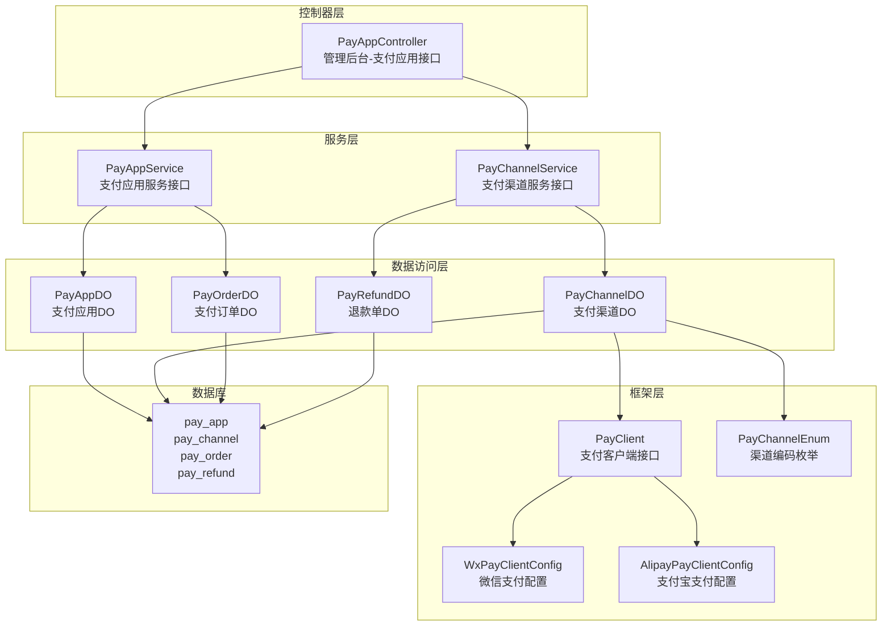
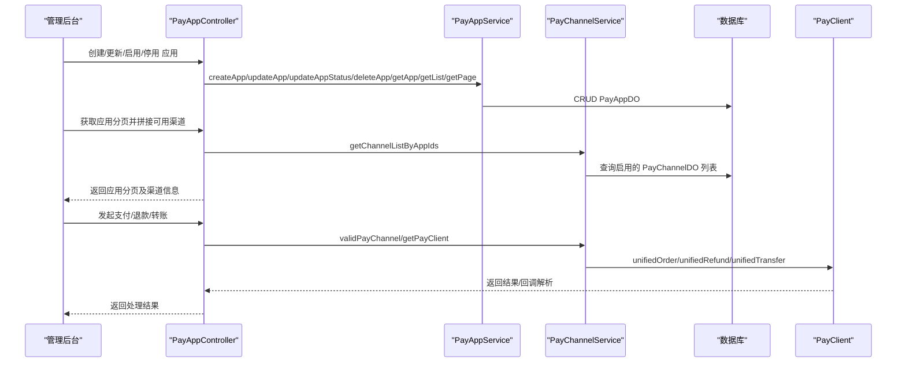
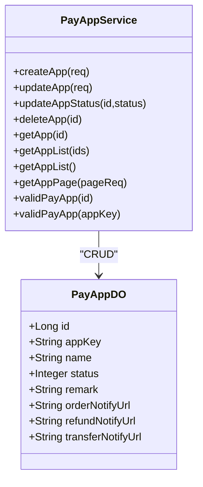
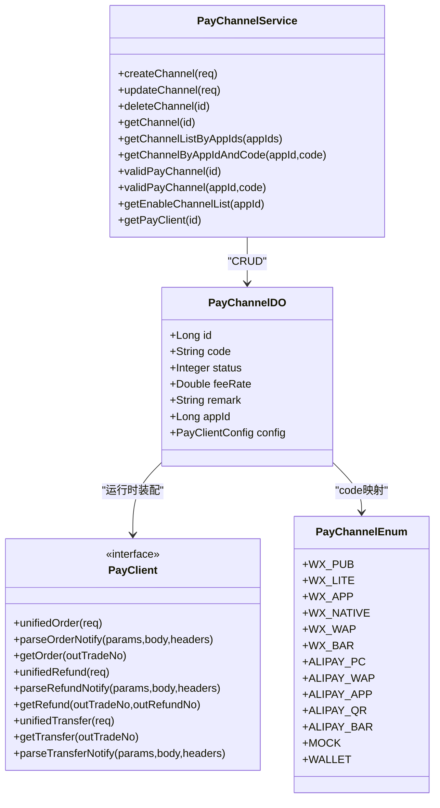
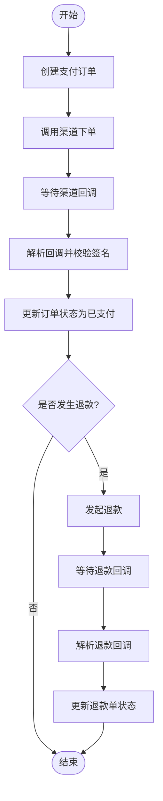
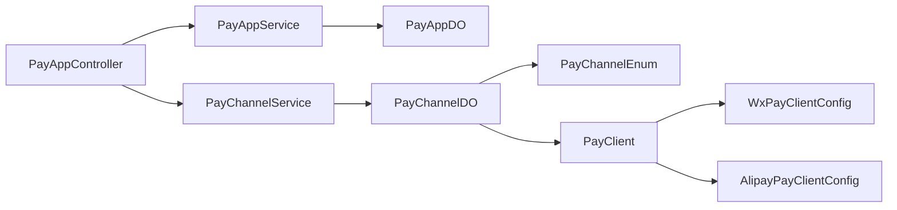

# 支付应用管理

<cite>
**本文档引用的文件**
- [PayAppController.java](file://yudao-module-pay/src/main/java/cn/iocoder/yudao/module/pay/controller/admin/app/PayAppController.java)
- [PayAppService.java](file://yudao-module-pay/src/main/java/cn/iocoder/yudao/module/pay/service/app/PayAppService.java)
- [PayAppDO.java](file://yudao-module-pay/src/main/java/cn/iocoder/yudao/module/pay/dal/dataobject/app/PayAppDO.java)
- [PayChannelService.java](file://yudao-module-pay/src/main/java/cn/iocoder/yudao/module/pay/service/channel/PayChannelService.java)
- [PayChannelDO.java](file://yudao-module-pay/src/main/java/cn/iocoder/yudao/module/pay/dal/dataobject/channel/PayChannelDO.java)
- [PayOrderDO.java](file://yudao-module-pay/src/main/java/cn/iocoder/yudao/module/pay/dal/dataobject/order/PayOrderDO.java)
- [PayRefundDO.java](file://yudao-module-pay/src/main/java/cn/iocoder/yudao/module/pay/dal/dataobject/refund/PayRefundDO.java)
- [PayChannelEnum.java](file://yudao-module-pay/src/main/java/cn/iocoder/yudao/module/pay/enums/PayChannelEnum.java)
- [PayClient.java](file://yudao-module-pay/src/main/java/cn/iocoder/yudao/module/pay/framework/pay/core/client/PayClient.java)
- [WxPayClientConfig.java](file://yudao-module-pay/src/main/java/cn/iocoder/yudao/module/pay/framework/pay/core/client/impl/weixin/WxPayClientConfig.java)
- [AlipayPayClientConfig.java](file://yudao-module-pay/src/main/java/cn/iocoder/yudao/module/pay/framework/pay/core/client/impl/alipay/AlipayPayClientConfig.java)
- [pay-2025-07-27.sql](file://sql/module/pay-2025-07-27.sql)
</cite>

## 目录
1. [简介](#简介)
2. [项目结构](#项目结构)
3. [核心组件](#核心组件)
4. [架构概览](#架构概览)
5. [详细组件分析](#详细组件分析)
6. [依赖分析](#依赖分析)
7. [性能考虑](#性能考虑)
8. [故障排查指南](#故障排查指南)
9. [结论](#结论)
10. [附录](#附录)

## 简介
本技术文档围绕支付应用管理功能展开，系统性阐述支付应用配置、支付渠道管理、商户参数设置、应用生命周期管理、多渠道集成方案、安全配置以及与业务系统的关联关系。文档基于实际代码与数据库结构，提供架构图、类图、时序图与流程图，帮助开发者快速理解并实施支付应用管理。

## 项目结构
支付模块采用分层设计，控制器层负责对外接口，服务层处理业务逻辑，数据访问层封装持久化操作，框架层提供支付客户端抽象与具体实现，枚举与配置类支撑渠道能力与安全策略。

**图表来源**
- [PayAppController.java:1-109](file://yudao-module-pay/src/main/java/cn/iocoder/yudao/module/pay/controller/admin/app/PayAppController.java#L1-L109)
- [PayAppService.java:1-116](file://yudao-module-pay/src/main/java/cn/iocoder/yudao/module/pay/service/app/PayAppService.java#L1-L116)
- [PayChannelService.java:1-105](file://yudao-module-pay/src/main/java/cn/iocoder/yudao/module/pay/service/channel/PayChannelService.java#L1-L105)
- [PayAppDO.java:1-67](file://yudao-module-pay/src/main/java/cn/iocoder/yudao/module/pay/dal/dataobject/app/PayAppDO.java#L1-L67)
- [PayChannelDO.java:1-119](file://yudao-module-pay/src/main/java/cn/iocoder/yudao/module/pay/dal/dataobject/channel/PayChannelDO.java#L1-L119)
- [PayOrderDO.java:1-148](file://yudao-module-pay/src/main/java/cn/iocoder/yudao/module/pay/dal/dataobject/order/PayOrderDO.java#L1-L148)
- [PayRefundDO.java:1-170](file://yudao-module-pay/src/main/java/cn/iocoder/yudao/module/pay/dal/dataobject/refund/PayRefundDO.java#L1-L170)
- [PayClient.java:1-119](file://yudao-module-pay/src/main/java/cn/iocoder/yudao/module/pay/framework/pay/core/client/PayClient.java#L1-L119)
- [WxPayClientConfig.java:1-107](file://yudao-module-pay/src/main/java/cn/iocoder/yudao/module/pay/framework/pay/core/client/impl/weixin/WxPayClientConfig.java#L1-L107)
- [AlipayPayClientConfig.java:1-129](file://yudao-module-pay/src/main/java/cn/iocoder/yudao/module/pay/framework/pay/core/client/impl/alipay/AlipayPayClientConfig.java#L1-L129)
- [PayChannelEnum.java:1-68](file://yudao-module-pay/src/main/java/cn/iocoder/yudao/module/pay/enums/PayChannelEnum.java#L1-L68)

**章节来源**
- [PayAppController.java:1-109](file://yudao-module-pay/src/main/java/cn/iocoder/yudao/module/pay/controller/admin/app/PayAppController.java#L1-L109)
- [PayAppService.java:1-116](file://yudao-module-pay/src/main/java/cn/iocoder/yudao/module/pay/service/app/PayAppService.java#L1-L116)
- [PayChannelService.java:1-105](file://yudao-module-pay/src/main/java/cn/iocoder/yudao/module/pay/service/channel/PayChannelService.java#L1-L105)

## 核心组件
- 支付应用（PayApp）
  - 负责应用基本信息、状态、回调地址等配置
  - 一对多关联支付渠道
- 支付渠道（PayChannel）
  - 以JSON形式存储渠道配置（如微信、支付宝）
  - 关联应用与支付客户端配置
- 支付订单（PayOrder）
  - 记录支付金额、手续费、状态、扩展信息等
- 退款单（PayRefund）
  - 记录退款金额、原因、渠道退款号、状态等
- 支付客户端（PayClient）
  - 抽象支付能力，支持下单、查询、退款、转账与回调解析
- 渠道配置（WxPayClientConfig、AlipayPayClientConfig）
  - 微信/支付宝的密钥、证书、签名算法、加密方式等
- 渠道枚举（PayChannelEnum）
  - 定义微信、支付宝、钱包、模拟等渠道编码

**章节来源**
- [PayAppDO.java:1-67](file://yudao-module-pay/src/main/java/cn/iocoder/yudao/module/pay/dal/dataobject/app/PayAppDO.java#L1-L67)
- [PayChannelDO.java:1-119](file://yudao-module-pay/src/main/java/cn/iocoder/yudao/module/pay/dal/dataobject/channel/PayChannelDO.java#L1-L119)
- [PayOrderDO.java:1-148](file://yudao-module-pay/src/main/java/cn/iocoder/yudao/module/pay/dal/dataobject/order/PayOrderDO.java#L1-L148)
- [PayRefundDO.java:1-170](file://yudao-module-pay/src/main/java/cn/iocoder/yudao/module/pay/dal/dataobject/refund/PayRefundDO.java#L1-L170)
- [PayClient.java:1-119](file://yudao-module-pay/src/main/java/cn/iocoder/yudao/module/pay/framework/pay/core/client/PayClient.java#L1-L119)
- [WxPayClientConfig.java:1-107](file://yudao-module-pay/src/main/java/cn/iocoder/yudao/module/pay/framework/pay/core/client/impl/weixin/WxPayClientConfig.java#L1-L107)
- [AlipayPayClientConfig.java:1-129](file://yudao-module-pay/src/main/java/cn/iocoder/yudao/module/pay/framework/pay/core/client/impl/alipay/AlipayPayClientConfig.java#L1-L129)
- [PayChannelEnum.java:1-68](file://yudao-module-pay/src/main/java/cn/iocoder/yudao/module/pay/enums/PayChannelEnum.java#L1-L68)

## 架构概览
支付应用管理贯穿“配置—下发—执行—回调—对账”的闭环。应用层通过控制器暴露REST接口；服务层编排业务；数据层持久化；框架层对接第三方支付SDK。

**图表来源**
- [PayAppController.java:40-106](file://yudao-module-pay/src/main/java/cn/iocoder/yudao/module/pay/controller/admin/app/PayAppController.java#L40-L106)
- [PayAppService.java:21-115](file://yudao-module-pay/src/main/java/cn/iocoder/yudao/module/pay/service/app/PayAppService.java#L21-L115)
- [PayChannelService.java:18-104](file://yudao-module-pay/src/main/java/cn/iocoder/yudao/module/pay/service/channel/PayChannelService.java#L18-L104)
- [PayClient.java:17-118](file://yudao-module-pay/src/main/java/cn/iocoder/yudao/module/pay/framework/pay/core/client/PayClient.java#L17-L118)

## 详细组件分析

### 支付应用（PayApp）与生命周期
- 应用基本信息：应用标识、名称、状态、备注、回调地址（支付/退款/转账）
- 生命周期管理：
  - 创建：提交应用信息，生成应用ID
  - 更新：修改名称、回调地址、状态
  - 启用/停用：通过状态字段控制
  - 删除：软删除标记
- 分页与列表：支持按条件分页查询与导出列表

**图表来源**
- [PayAppDO.java:27-66](file://yudao-module-pay/src/main/java/cn/iocoder/yudao/module/pay/dal/dataobject/app/PayAppDO.java#L27-L66)
- [PayAppService.java:21-115](file://yudao-module-pay/src/main/java/cn/iocoder/yudao/module/pay/service/app/PayAppService.java#L21-L115)

**章节来源**
- [PayAppDO.java:1-67](file://yudao-module-pay/src/main/java/cn/iocoder/yudao/module/pay/dal/dataobject/app/PayAppDO.java#L1-L67)
- [PayAppService.java:1-116](file://yudao-module-pay/src/main/java/cn/iocoder/yudao/module/pay/service/app/PayAppService.java#L1-L116)
- [PayAppController.java:40-106](file://yudao-module-pay/src/main/java/cn/iocoder/yudao/module/pay/controller/admin/app/PayAppController.java#L40-L106)

### 支付渠道（PayChannel）与多渠道集成
- 渠道与应用：一对一应用，多渠道
- 渠道配置：JSON字段存储不同渠道的配置对象
- 渠道枚举：定义微信、支付宝、钱包、模拟等编码
- 客户端适配：通过PayClient接口对接不同SDK

**图表来源**
- [PayChannelDO.java:40-118](file://yudao-module-pay/src/main/java/cn/iocoder/yudao/module/pay/dal/dataobject/channel/PayChannelDO.java#L40-L118)
- [PayChannelService.java:18-104](file://yudao-module-pay/src/main/java/cn/iocoder/yudao/module/pay/service/channel/PayChannelService.java#L18-L104)
- [PayClient.java:17-118](file://yudao-module-pay/src/main/java/cn/iocoder/yudao/module/pay/framework/pay/core/client/PayClient.java#L17-L118)
- [PayChannelEnum.java:18-67](file://yudao-module-pay/src/main/java/cn/iocoder/yudao/module/pay/enums/PayChannelEnum.java#L18-L67)

**章节来源**
- [PayChannelDO.java:1-119](file://yudao-module-pay/src/main/java/cn/iocoder/yudao/module/pay/dal/dataobject/channel/PayChannelDO.java#L1-L119)
- [PayChannelService.java:1-105](file://yudao-module-pay/src/main/java/cn/iocoder/yudao/module/pay/service/channel/PayChannelService.java#L1-L105)
- [PayChannelEnum.java:1-68](file://yudao-module-pay/src/main/java/cn/iocoder/yudao/module/pay/enums/PayChannelEnum.java#L1-L68)

### 支付订单与退款流程
- 支付订单：记录商户订单号、金额、手续费率/金额、状态、用户信息、渠道信息、扩展单号等
- 退款单：记录退款金额、原因、渠道退款号、状态、错误信息等
- 流程要点：下单—回调—入账—退款—对账

**图表来源**
- [PayOrderDO.java:27-147](file://yudao-module-pay/src/main/java/cn/iocoder/yudao/module/pay/dal/dataobject/order/PayOrderDO.java#L27-L147)
- [PayRefundDO.java:33-169](file://yudao-module-pay/src/main/java/cn/iocoder/yudao/module/pay/dal/dataobject/refund/PayRefundDO.java#L33-L169)
- [PayClient.java:40-116](file://yudao-module-pay/src/main/java/cn/iocoder/yudao/module/pay/framework/pay/core/client/PayClient.java#L40-L116)

**章节来源**
- [PayOrderDO.java:1-148](file://yudao-module-pay/src/main/java/cn/iocoder/yudao/module/pay/dal/dataobject/order/PayOrderDO.java#L1-L148)
- [PayRefundDO.java:1-170](file://yudao-module-pay/src/main/java/cn/iocoder/yudao/module/pay/dal/dataobject/refund/PayRefundDO.java#L1-L170)

### 支付应用与业务系统的关联
- 应用ID作为业务隔离标识：不同业务线/商户使用不同应用ID
- 回调地址绑定：应用层面配置支付/退款/转账回调地址，确保业务系统能正确接收并处理
- 权限控制：控制器使用权限注解，限制对应用的增删改查操作

**章节来源**
- [PayAppDO.java:53-64](file://yudao-module-pay/src/main/java/cn/iocoder/yudao/module/pay/dal/dataobject/app/PayAppDO.java#L53-L64)
- [PayAppController.java:40-106](file://yudao-module-pay/src/main/java/cn/iocoder/yudao/module/pay/controller/admin/app/PayAppController.java#L40-L106)

### 多支付渠道集成方案
- 微信支付
  - 支持V2/V3协议，分别配置商户密钥、证书或私钥、APIv3密钥、证书序列号等
  - 通过WxPayClientConfig进行参数校验与适配
- 支付宝
  - 支持公钥模式与证书模式，配置网关地址、应用ID、签名算法、公钥类型、证书内容、接口加密方式等
  - 通过AlipayPayClientConfig进行参数校验与适配
- 钱包/模拟
  - 通过NonePayClientConfig简化配置，便于演示与测试

**章节来源**
- [WxPayClientConfig.java:15-106](file://yudao-module-pay/src/main/java/cn/iocoder/yudao/module/pay/framework/pay/core/client/impl/weixin/WxPayClientConfig.java#L15-L106)
- [AlipayPayClientConfig.java:17-128](file://yudao-module-pay/src/main/java/cn/iocoder/yudao/module/pay/framework/pay/core/client/impl/alipay/AlipayPayClientConfig.java#L17-L128)
- [PayChannelEnum.java:18-67](file://yudao-module-pay/src/main/java/cn/iocoder/yudao/module/pay/enums/PayChannelEnum.java#L18-L67)

### 安全配置与最佳实践
- 密钥与证书管理
  - 微信：V2使用商户密钥与p12证书；V3使用私钥、APIv3密钥、证书序列号与公钥信息
  - 支付宝：公钥模式使用商户私钥与支付宝公钥；证书模式使用应用证书、支付宝公钥证书与根证书
- 签名算法与加密
  - 支付宝默认RSA2签名；接口内容可选AES加密
- 最佳实践
  - 使用沙箱环境先行验证，再切换生产
  - 严格区分公钥模式与证书模式，避免配置错误
  - 回调地址务必可访问且具备幂等处理能力
  - 对回调参数进行严格签名校验与参数校验

**章节来源**
- [WxPayClientConfig.java:36-86](file://yudao-module-pay/src/main/java/cn/iocoder/yudao/module/pay/framework/pay/core/client/impl/weixin/WxPayClientConfig.java#L36-L86)
- [AlipayPayClientConfig.java:45-114](file://yudao-module-pay/src/main/java/cn/iocoder/yudao/module/pay/framework/pay/core/client/impl/alipay/AlipayPayClientConfig.java#L45-L114)

## 依赖分析
- 控制器依赖服务层，服务层依赖数据访问层
- 渠道DO持有PayClientConfig，运行时通过PayChannelService装配PayClient
- 渠道枚举用于code映射与校验

**图表来源**
- [PayAppController.java:35-38](file://yudao-module-pay/src/main/java/cn/iocoder/yudao/module/pay/controller/admin/app/PayAppController.java#L35-L38)
- [PayAppService.java:21-115](file://yudao-module-pay/src/main/java/cn/iocoder/yudao/module/pay/service/app/PayAppService.java#L21-L115)
- [PayChannelService.java:18-104](file://yudao-module-pay/src/main/java/cn/iocoder/yudao/module/pay/service/channel/PayChannelService.java#L18-L104)
- [PayChannelDO.java:76-77](file://yudao-module-pay/src/main/java/cn/iocoder/yudao/module/pay/dal/dataobject/channel/PayChannelDO.java#L76-L77)
- [PayClient.java:17-31](file://yudao-module-pay/src/main/java/cn/iocoder/yudao/module/pay/framework/pay/core/client/PayClient.java#L17-L31)
- [WxPayClientConfig.java:15-106](file://yudao-module-pay/src/main/java/cn/iocoder/yudao/module/pay/framework/pay/core/client/impl/weixin/WxPayClientConfig.java#L15-L106)
- [AlipayPayClientConfig.java:17-128](file://yudao-module-pay/src/main/java/cn/iocoder/yudao/module/pay/framework/pay/core/client/impl/alipay/AlipayPayClientConfig.java#L17-L128)

**章节来源**
- [PayAppController.java:1-109](file://yudao-module-pay/src/main/java/cn/iocoder/yudao/module/pay/controller/admin/app/PayAppController.java#L1-L109)
- [PayChannelDO.java:1-119](file://yudao-module-pay/src/main/java/cn/iocoder/yudao/module/pay/dal/dataobject/channel/PayChannelDO.java#L1-L119)

## 性能考虑
- 分页查询：应用分页与渠道合并需注意批量查询与过滤，避免N+1查询
- JSON配置反序列化：PayChannelDO的配置字段采用类型处理器，建议缓存常用配置
- 回调处理：幂等性与重试策略，避免重复入账
- 并发控制：退款与转账并发场景下的状态一致性

## 故障排查指南
- 回调地址不可达或格式错误
  - 检查应用回调地址配置与网络可达性
- 签名验证失败
  - 确认渠道密钥/证书配置正确，签名算法一致
- 商户订单号不匹配
  - 核对业务系统与支付系统的商户订单号生成规则与传递
- 渠道证书/密钥错误
  - 校验证书序列号、APIv3密钥、私钥内容等
- 状态更新失败
  - 检查回调解析逻辑与状态机

**章节来源**
- [pay-2025-07-27.sql:144-160](file://sql/module/pay-2025-07-27.sql#L144-L160)

## 结论
支付应用管理通过清晰的分层设计与抽象接口，实现了应用配置、渠道管理、安全配置与业务系统的有效解耦。依托多渠道SDK适配与严格的参数校验，系统在保证安全性的同时提供了良好的扩展性与可维护性。建议在生产环境中优先使用沙箱验证、完善回调幂等与重试机制，并持续优化分页与配置加载性能。

## 附录
- 数据库脚本要点
  - 支付应用表：应用ID、应用标识、名称、状态、回调地址等
  - 支付渠道表：渠道编码、状态、费率、所属应用、配置JSON等
  - 支付订单与退款单：金额、手续费、状态、扩展信息、渠道订单号等

**章节来源**
- [pay-2025-07-27.sql:20-68](file://sql/module/pay-2025-07-27.sql#L20-L68)
- [pay-2025-07-27.sql:77-110](file://sql/module/pay-2025-07-27.sql#L77-L110)
- [pay-2025-07-27.sql:111-142](file://sql/module/pay-2025-07-27.sql#L111-L142)