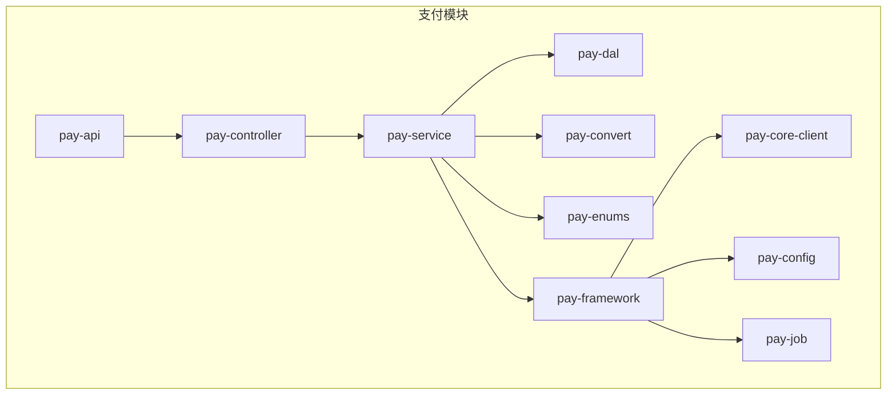
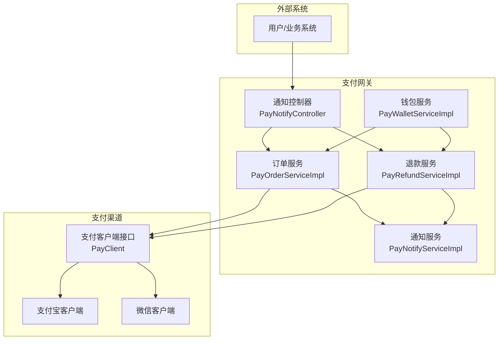
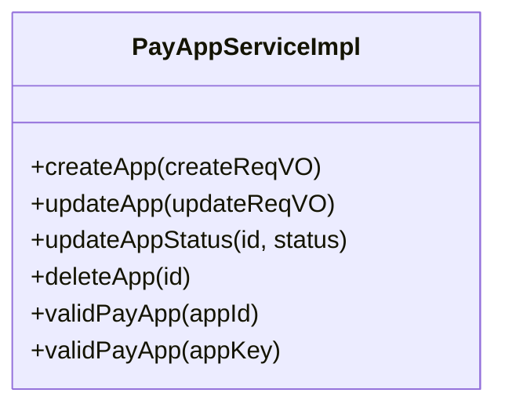
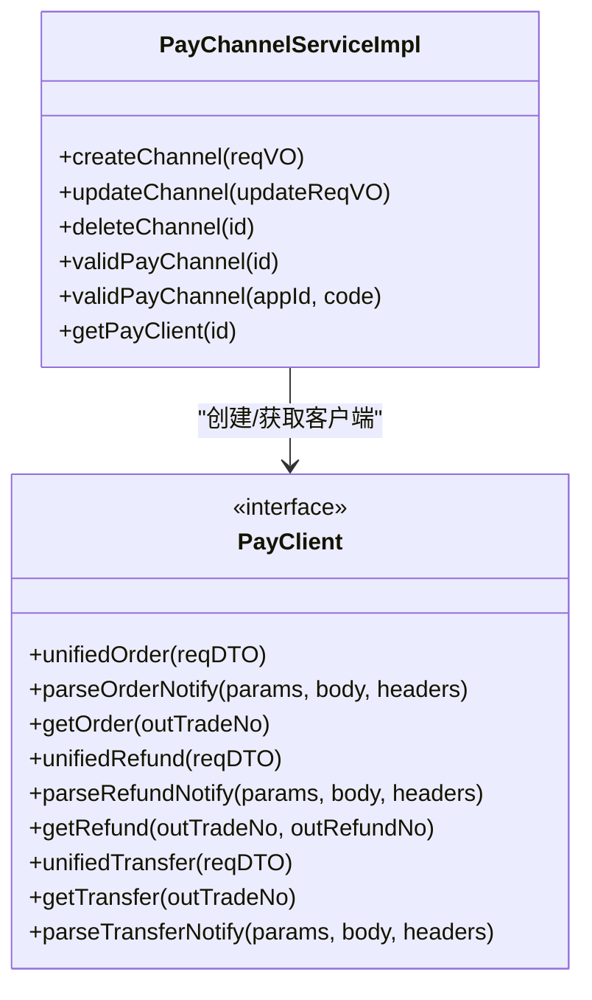
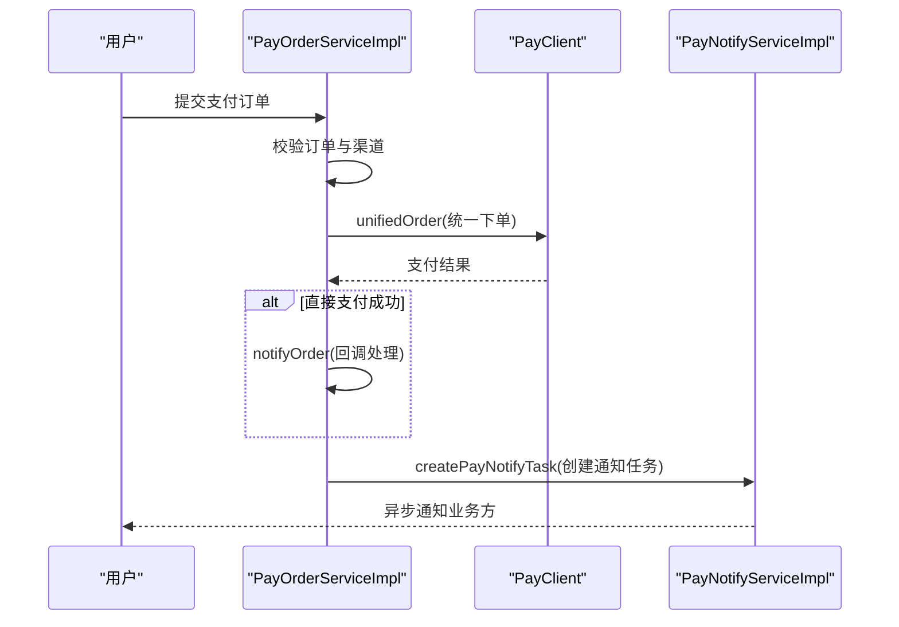
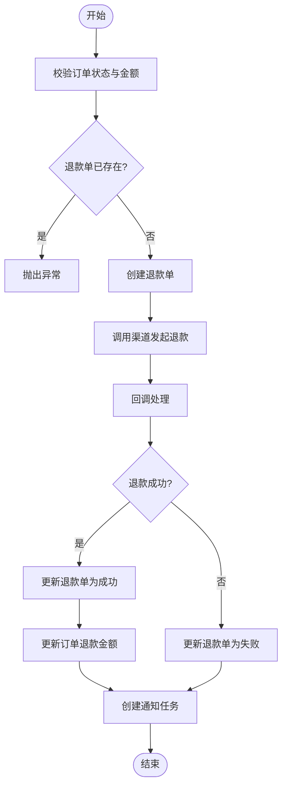
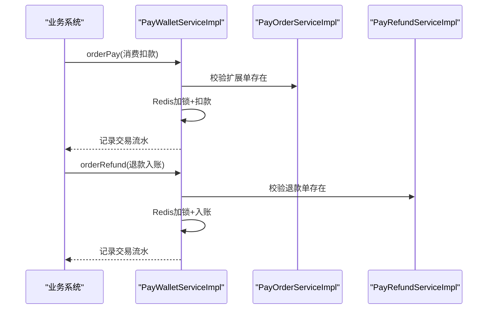
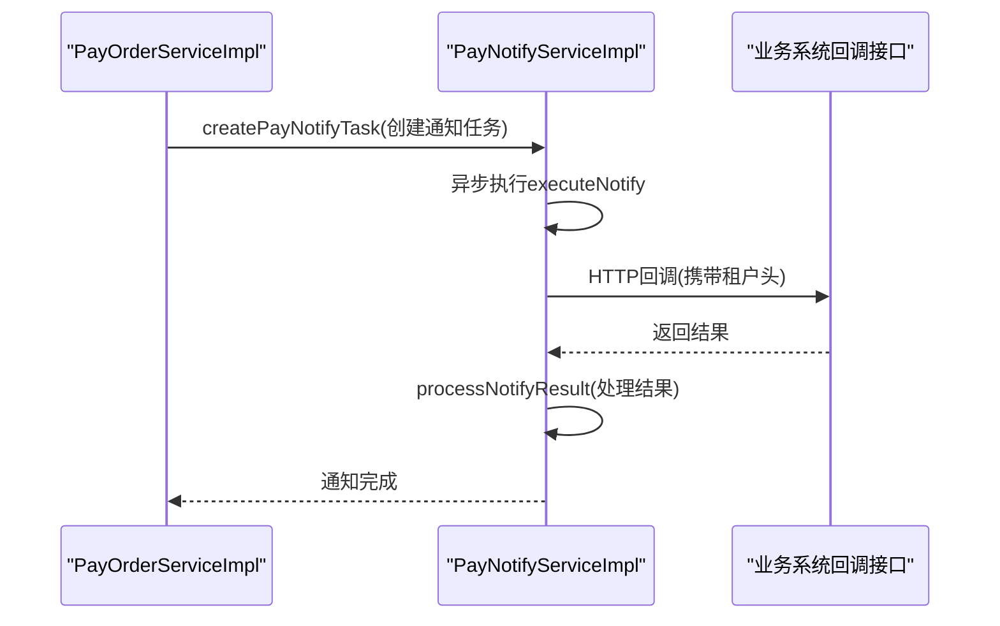
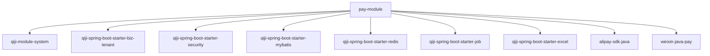

# 支付系统模块

<cite>
**本文引用的文件**
- [支付模块包说明](file://qiji-module-pay/src/main/java/com.qiji.cps/module/pay/package-info.java)
- [支付渠道枚举](file://qiji-module-pay/src/main/java/com.qiji.cps/module/pay/enums/PayChannelEnum.java)
- [支付订单服务实现](file://qiji-module-pay/src/main/java/com.qiji.cps/module/pay/service/order/PayOrderServiceImpl.java)
- [支付退款服务实现](file://qiji-module-pay/src/main/java/com.qiji.cps/module/pay/service/refund/PayRefundServiceImpl.java)
- [钱包服务实现](file://qiji-module-pay/src/main/java/com.qiji.cps/module/pay/service/wallet/PayWalletServiceImpl.java)
- [支付通知服务实现](file://qiji-module-pay/src/main/java/com.qiji.cps/module/pay/service/nofity/PayNotifyServiceImpl.java)
- [支付客户端接口](file://qiji-module-pay/src/main/java/com.qiji.cps/module/pay/framework/pay/core/client/PayClient.java)
- [支付通知控制器](file://qiji-module-pay/src/main/java/com.qiji.cps/module/pay/controller/admin/notify/PayNotifyController.java)
- [支付应用服务实现](file://qiji-module-pay/src/main/java/com.qiji.cps/module/pay/service/app/PayAppServiceImpl.java)
- [支付渠道服务实现](file://qiji-module-pay/src/main/java/com.qiji.cps/module/pay/service/channel/PayChannelServiceImpl.java)
- [支付模块POM依赖](file://qiji-module-pay/pom.xml)
- [支付模块SQL脚本](file://sql/module/pay-2025-07-27.sql)
</cite>

## 目录
1. [引言](#引言)
2. [项目结构](#项目结构)
3. [核心组件](#核心组件)
4. [架构概览](#架构概览)
5. [详细组件分析](#详细组件分析)
6. [依赖分析](#依赖分析)
7. [性能考虑](#性能考虑)
8. [故障排查指南](#故障排查指南)
9. [结论](#结论)
10. [附录](#附录)

## 引言
本文件面向CPS系统中的支付系统模块，系统性阐述支付应用配置、支付订单管理、退款订单处理、回调通知机制、多支付渠道集成方案、支付安全机制、钱包功能实现、支付通知机制以及与CPS返利系统的集成方案。文档基于实际代码实现，提供业务流程图与代码实现示例路径，帮助开发者快速理解与扩展支付能力。

## 项目结构
支付模块采用清晰的分层设计，遵循“接口 + 实现 + DTO + 枚举 + 配置”的组织方式，便于扩展与维护。

图表来源
- [支付模块包说明:1-11](file://qiji-module-pay/src/main/java/com.qiji.cps/module/pay/package-info.java#L1-L11)

章节来源
- [支付模块包说明:1-11](file://qiji-module-pay/src/main/java/com.qiji.cps/module/pay/package-info.java#L1-L11)

## 核心组件
- 支付应用管理：负责应用的创建、校验与状态控制，确保支付入口的安全与合规。
- 支付渠道管理：负责渠道的配置解析、客户端工厂创建与校验，支持微信、支付宝等多渠道。
- 支付订单管理：负责订单创建、提交、状态同步、过期处理与回调处理。
- 退款订单管理：负责退款申请、渠道发起、状态同步与回调处理。
- 钱包功能：负责余额管理、充值、提现、交易明细与并发安全控制。
- 支付通知：负责异步回调通知的调度、重试与日志记录，确保状态同步可靠。

章节来源
- [支付应用服务实现:1-168](file://qiji-module-pay/src/main/java/com.qiji.cps/module/pay/service/app/PayAppServiceImpl.java#L1-L168)
- [支付渠道服务实现:1-166](file://qiji-module-pay/src/main/java/com.qiji.cps/module/pay/service/channel/PayChannelServiceImpl.java#L1-L166)
- [支付订单服务实现:1-611](file://qiji-module-pay/src/main/java/com.qiji.cps/module/pay/service/order/PayOrderServiceImpl.java#L1-L611)
- [支付退款服务实现:1-332](file://qiji-module-pay/src/main/java/com.qiji.cps/module/pay/service/refund/PayRefundServiceImpl.java#L1-L332)
- [钱包服务实现:1-247](file://qiji-module-pay/src/main/java/com.qiji.cps/module/pay/service/wallet/PayWalletServiceImpl.java#L1-L247)
- [支付通知服务实现:1-324](file://qiji-module-pay/src/main/java/com.qiji.cps/module/pay/service/nofity/PayNotifyServiceImpl.java#L1-L324)

## 架构概览
支付系统通过统一的支付客户端接口对接不同支付渠道，订单与退款流程均通过渠道客户端发起，并通过回调控制器接收渠道通知，最终由通知服务异步通知业务方。钱包功能独立于渠道，提供余额与交易明细管理。

图表来源
- [支付通知控制器:1-170](file://qiji-module-pay/src/main/java/com.qiji.cps/module/pay/controller/admin/notify/PayNotifyController.java#L1-L170)
- [支付订单服务实现:1-611](file://qiji-module-pay/src/main/java/com.qiji.cps/module/pay/service/order/PayOrderServiceImpl.java#L1-L611)
- [支付退款服务实现:1-332](file://qiji-module-pay/src/main/java/com.qiji.cps/module/pay/service/refund/PayRefundServiceImpl.java#L1-L332)
- [支付通知服务实现:1-324](file://qiji-module-pay/src/main/java/com.qiji.cps/module/pay/service/nofity/PayNotifyServiceImpl.java#L1-L324)
- [支付客户端接口:1-119](file://qiji-module-pay/src/main/java/com.qiji.cps/module/pay/framework/pay/core/client/PayClient.java#L1-L119)

## 详细组件分析

### 支付应用配置
- 应用创建与校验：校验appKey唯一性，启用/禁用状态控制，删除前关联数据检查。
- 与订单/退款服务的耦合：应用状态直接影响支付与退款流程的可用性。

图表来源
- [支付应用服务实现:1-168](file://qiji-module-pay/src/main/java/com.qiji.cps/module/pay/service/app/PayAppServiceImpl.java#L1-L168)

章节来源
- [支付应用服务实现:1-168](file://qiji-module-pay/src/main/java/com.qiji.cps/module/pay/service/app/PayAppServiceImpl.java#L1-L168)

### 支付渠道集成
- 渠道配置解析：根据渠道编码选择对应配置类（如支付宝、微信），并进行参数校验。
- 客户端工厂：根据渠道配置动态创建/更新支付客户端实例。
- 渠道有效性校验：启用状态检查与客户端存在性检查。

图表来源
- [支付渠道服务实现:1-166](file://qiji-module-pay/src/main/java/com.qiji.cps/module/pay/service/channel/PayChannelServiceImpl.java#L1-L166)
- [支付客户端接口:1-119](file://qiji-module-pay/src/main/java/com.qiji.cps/module/pay/framework/pay/core/client/PayClient.java#L1-L119)

章节来源
- [支付渠道服务实现:1-166](file://qiji-module-pay/src/main/java/com.qiji.cps/module/pay/service/channel/PayChannelServiceImpl.java#L1-L166)
- [支付客户端接口:1-119](file://qiji-module-pay/src/main/java/com.qiji.cps/module/pay/framework/pay/core/client/PayClient.java#L1-L119)

### 支付订单管理
- 订单创建：校验应用、幂等检查、设置初始状态。
- 订单提交：生成扩展单、调用渠道下单、处理直付成功场景、并发保护。
- 状态同步：定时任务同步待支付订单、过期处理、回调处理。
- 回调处理：区分成功/失败/关闭状态，更新订单与扩展单，创建通知任务。

图表来源
- [支付订单服务实现:141-187](file://qiji-module-pay/src/main/java/com.qiji.cps/module/pay/service/order/PayOrderServiceImpl.java#L141-L187)
- [支付通知服务实现:95-129](file://qiji-module-pay/src/main/java/com.qiji.cps/module/pay/service/nofity/PayNotifyServiceImpl.java#L95-L129)

章节来源
- [支付订单服务实现:1-611](file://qiji-module-pay/src/main/java/com.qiji.cps/module/pay/service/order/PayOrderServiceImpl.java#L1-L611)

### 退款订单处理
- 退款申请：校验订单状态与金额、幂等检查、生成退款单、调用渠道发起退款。
- 回调处理：区分成功/失败，更新退款单与订单退款金额，创建通知任务。
- 同步机制：定时任务同步退款状态，兜底处理异常场景。

图表来源
- [支付退款服务实现:92-147](file://qiji-module-pay/src/main/java/com.qiji.cps/module/pay/service/refund/PayRefundServiceImpl.java#L92-L147)
- [支付退款服务实现:187-213](file://qiji-module-pay/src/main/java/com.qiji.cps/module/pay/service/refund/PayRefundServiceImpl.java#L187-L213)

章节来源
- [支付退款服务实现:1-332](file://qiji-module-pay/src/main/java/com.qiji.cps/module/pay/service/refund/PayRefundServiceImpl.java#L1-L332)

### 钱包功能实现
- 钱包创建：用户首次使用时创建钱包，使用分布式锁避免并发创建。
- 余额管理：消费扣款、退款入账、冻结/解冻、余额更新与流水记录。
- 并发控制：Redis分布式锁保障余额更新一致性，防止流水并发导致的余额不一致。

图表来源
- [钱包服务实现:91-119](file://qiji-module-pay/src/main/java/com.qiji.cps/module/pay/service/wallet/PayWalletServiceImpl.java#L91-L119)
- [钱包服务实现:142-228](file://qiji-module-pay/src/main/java/com.qiji.cps/module/pay/service/wallet/PayWalletServiceImpl.java#L142-L228)

章节来源
- [钱包服务实现:1-247](file://qiji-module-pay/src/main/java/com.qiji.cps/module/pay/service/wallet/PayWalletServiceImpl.java#L1-L247)

### 支付通知机制
- 通知创建：订单/退款成功后创建通知任务，补充应用与回调URL信息。
- 异步通知：线程池异步执行通知，支持重试策略与超时控制。
- 结果处理：根据回调结果更新任务状态，记录通知日志，支持最大重试次数。

图表来源
- [支付通知服务实现:95-129](file://qiji-module-pay/src/main/java/com.qiji.cps/module/pay/service/nofity/PayNotifyServiceImpl.java#L95-L129)
- [支付通知服务实现:177-203](file://qiji-module-pay/src/main/java/com.qiji.cps/module/pay/service/nofity/PayNotifyServiceImpl.java#L177-L203)
- [支付通知控制器:63-83](file://qiji-module-pay/src/main/java/com.qiji.cps/module/pay/controller/admin/notify/PayNotifyController.java#L63-L83)

章节来源
- [支付通知服务实现:1-324](file://qiji-module-pay/src/main/java/com.qiji.cps/module/pay/service/nofity/PayNotifyServiceImpl.java#L1-L324)
- [支付通知控制器:1-170](file://qiji-module-pay/src/main/java/com.qiji.cps/module/pay/controller/admin/notify/PayNotifyController.java#L1-L170)

### 多支付渠道集成方案
- 渠道编码规范：统一使用带前缀的编码（如wx_、alipay_），便于识别与路由。
- 客户端适配：通过接口抽象统一下单、回调解析、状态查询等能力。
- 配置解析：根据渠道编码自动选择配置类并进行参数校验，确保接入一致性。

章节来源
- [支付渠道枚举:1-68](file://qiji-module-pay/src/main/java/com.qiji.cps/module/pay/enums/PayChannelEnum.java#L1-L68)
- [支付渠道服务实现:83-97](file://qiji-module-pay/src/main/java/com.qiji.cps/module/pay/service/channel/PayChannelServiceImpl.java#L83-L97)

### 支付安全机制
- 签名验证：回调解析通过客户端接口统一处理，确保渠道签名验证与参数完整性。
- 防重放攻击：通知任务具备重试频率与最大次数限制，结合分布式锁避免并发重复处理。
- 数据加密：敏感配置通过配置类承载，接入时进行参数校验与序列化控制。

章节来源
- [支付客户端接口:44-51](file://qiji-module-pay/src/main/java/com.qiji.cps/module/pay/framework/pay/core/client/PayClient.java#L44-L51)
- [支付通知服务实现:187-203](file://qiji-module-pay/src/main/java/com.qiji.cps/module/pay/service/nofity/PayNotifyServiceImpl.java#L187-L203)

### 与CPS返利系统的集成方案
- 触发时机：支付订单成功回调后，创建通知任务，业务方可在此时触发返利计算与入账。
- 数据传递：通知任务包含商户订单号与支付单ID，业务方据此查询订单详情并执行返利逻辑。
- 可靠性：通知服务具备重试与日志记录，确保返利触发的最终一致性。

章节来源
- [支付订单服务实现:292-304](file://qiji-module-pay/src/main/java/com.qiji.cps/module/pay/service/order/PayOrderServiceImpl.java#L292-L304)
- [支付通知服务实现:95-129](file://qiji-module-pay/src/main/java/com.qiji.cps/module/pay/service/nofity/PayNotifyServiceImpl.java#L95-L129)

## 依赖分析
支付模块对外依赖系统模块与基础能力组件，内部通过客户端工厂与配置类实现对多渠道SDK的解耦。

图表来源
- [支付模块POM依赖:21-80](file://qiji-module-pay/pom.xml#L21-L80)

章节来源
- [支付模块POM依赖:1-84](file://qiji-module-pay/pom.xml#L1-L84)

## 性能考虑
- 异步通知：通过线程池异步执行通知，避免阻塞主事务，提升吞吐量。
- 分布式锁：钱包余额更新与通知任务执行均使用Redis锁，降低并发冲突。
- 定时同步：订单与退款的定时同步任务作为兜底，减少回调丢失的影响。
- 重试策略：通知服务具备指数级重试间隔与最大次数限制，平衡可靠性与资源消耗。

## 故障排查指南
- 回调未到达：检查通知任务状态与日志，确认回调URL配置正确与网络可达。
- 重复回调：关注并发保护逻辑与幂等处理，避免重复入账。
- 余额不一致：核对Redis锁使用与流水记录，确保更新原子性。
- 渠道配置错误：核对渠道编码与配置类解析，确保参数校验通过。

章节来源
- [支付通知服务实现:269-297](file://qiji-module-pay/src/main/java/com.qiji.cps/module/pay/service/nofity/PayNotifyServiceImpl.java#L269-L297)
- [钱包服务实现:155-187](file://qiji-module-pay/src/main/java/com.qiji.cps/module/pay/service/wallet/PayWalletServiceImpl.java#L155-L187)

## 结论
支付系统模块通过清晰的分层设计与统一的客户端接口，实现了对多支付渠道的统一接入与可靠的状态同步。结合异步通知与分布式锁机制，系统在高并发场景下仍能保证数据一致性与业务连续性。钱包功能与通知机制为CPS返利系统的集成提供了坚实基础。

## 附录
- 支付模块SQL脚本：用于初始化支付相关表结构与数据。
  
章节来源
- [支付模块SQL脚本](file://sql/module/pay-2025-07-27.sql)