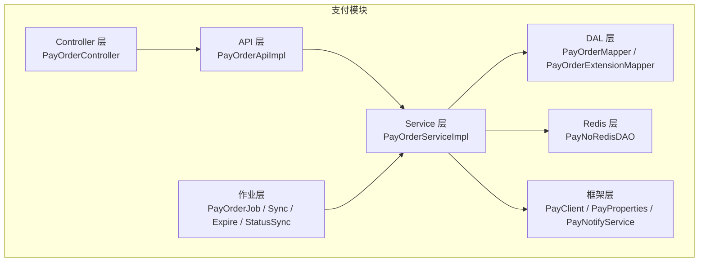
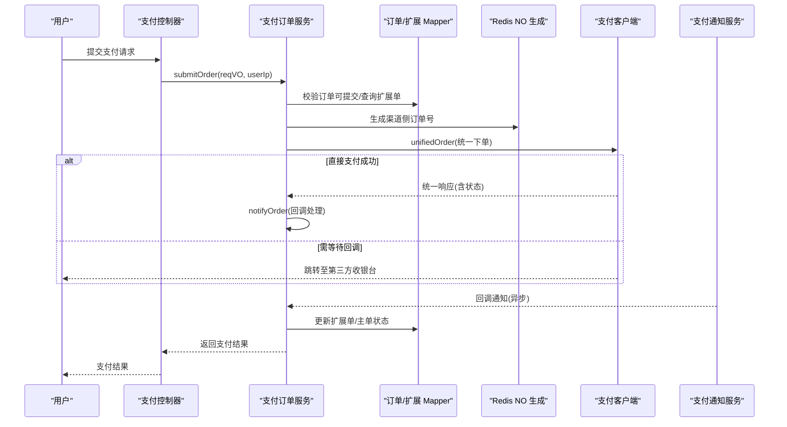
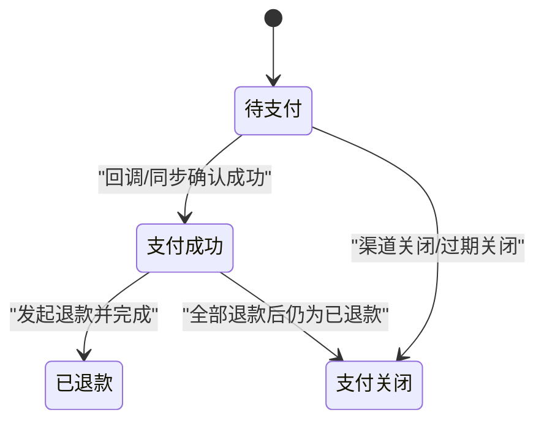
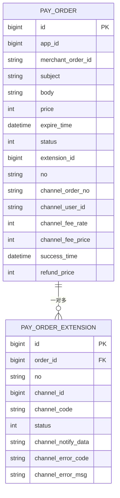
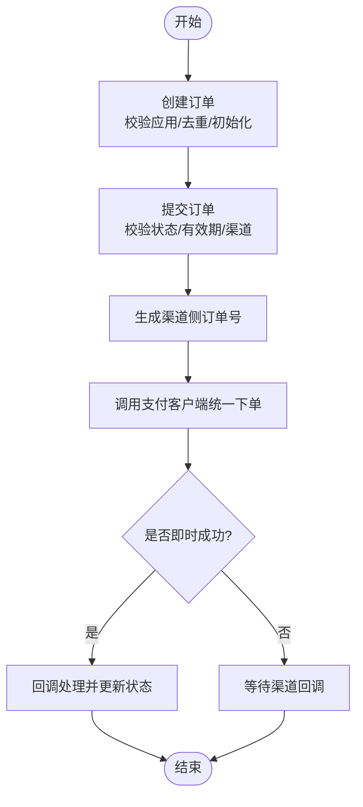
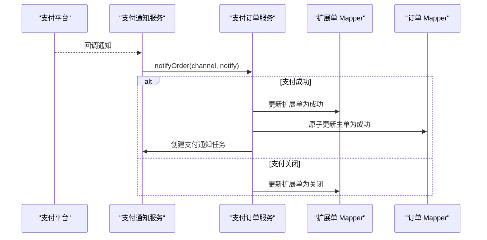
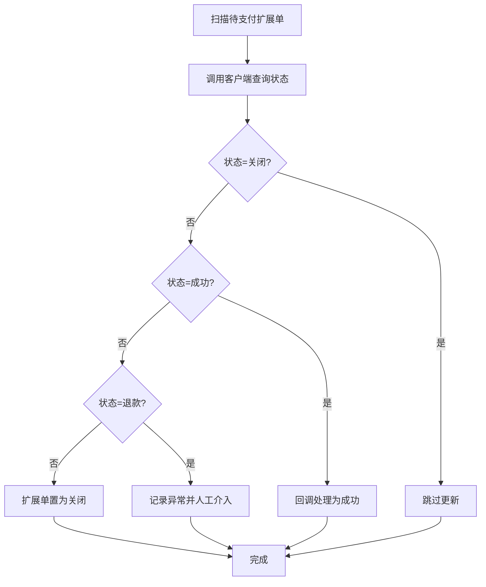
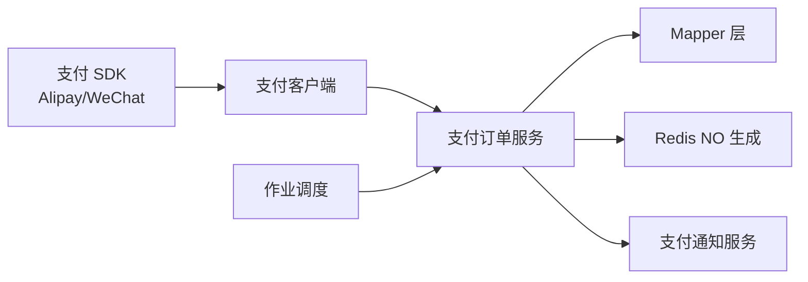

# 支付订单管理

<cite>
**本文引用的文件**
- [支付模块 POM 文件](file://qiji-module-pay/pom.xml)
- [支付订单状态枚举](file://qiji-module-pay/src/main/java/com.qiji.cps/module/pay/enums/order/PayOrderStatusEnum.java)
- [支付订单服务实现](file://qiji-module-pay/src/main/java/com.qiji.cps/module/pay/service/order/PayOrderServiceImpl.java)
- [支付订单 API 实现](file://qiji-module-pay/src/main/java/com.qiji.cps/module/pay/api/order/PayOrderApiImpl.java)
- [支付订单 API 接口](file://qiji-module-pay/src/main/java/com.qiji.cps/module/pay/api/order/PayOrderApi.java)
- [支付订单 DO](file://qiji-module-pay/src/main/java/com.qiji.cps/module/pay/dal/dataobject/order/PayOrderDO.java)
- [支付订单扩展 DO](file://qiji-module-pay/src/main/java/com.qiji.cps/module/pay/dal/dataobject/order/PayOrderExtensionDO.java)
- [支付订单 Mapper](file://qiji-module-pay/src/main/java/com.qiji.cps/module/pay/dal/mysql/order/PayOrderMapper.java)
- [支付订单扩展 Mapper](file://qiji-module-pay/src/main/java/com.qiji.cps/module/pay/dal/mysql/order/PayOrderExtensionMapper.java)
- [支付订单 NO 生成 DAO](file://qiji-module-pay/src/main/java/com.qiji.cps/module/pay/dal/redis/no/PayNoRedisDAO.java)
- [支付订单控制器](file://qiji-module-pay/src/main/java/com.qiji.cps/module/pay/controller/admin/order/PayOrderController.java)
- [支付订单导出请求 VO](file://qiji-module-pay/src/main/java/com.qiji.cps/module/pay/controller/admin/order/vo/PayOrderExportReqVO.java)
- [支付订单分页请求 VO](file://qiji-module-pay/src/main/java/com.qiji.cps/module/pay/controller/admin/order/vo/PayOrderPageReqVO.java)
- [支付订单提交请求 VO](file://qiji-module-pay/src/main/java/com.qiji.cps/module/pay/controller/admin/order/vo/PayOrderSubmitReqVO.java)
- [支付订单提交响应 VO](file://qiji-module-pay/src/main/java/com.qiji.cps/module/pay/controller/admin/order/vo/PayOrderSubmitRespVO.java)
- [支付订单创建请求 DTO](file://qiji-module-pay/src/main/java/com.qiji.cps/module/pay/api/order/dto/PayOrderCreateReqDTO.java)
- [支付订单统一下单请求 DTO](file://qiji-module-pay/src/main/java/com.qiji.cps/module/pay/framework/pay/core/client/dto/order/PayOrderUnifiedReqDTO.java)
- [支付订单统一下单响应 DTO](file://qiji-module-pay/src/main/java/com.qiji.cps/module/pay/framework/pay/core/client/dto/order/PayOrderRespDTO.java)
- [支付通知服务](file://qiji-module-pay/src/main/java/com.qiji.cps/module/pay/service/notify/PayNotifyService.java)
- [支付应用服务](file://qiji-module-pay/src/main/java/com.qiji.cps/module/pay/service/app/PayAppService.java)
- [支付渠道服务](file://qiji-module-pay/src/main/java/com.qiji.cps/module/pay/service/channel/PayChannelService.java)
- [支付订单作业（同步/过期）](file://qiji-module-pay/src/main/java/com.qiji.cps/module/pay/job/order/PayOrderJob.java)
- [支付订单同步作业](file://qiji-module-pay/src/main/java/com.qiji.cps/module/pay/job/order/PayOrderSyncJob.java)
- [支付订单过期作业](file://qiji-module-pay/src/main/java/com.qiji.cps/module/pay/job/order/PayOrderExpireJob.java)
- [支付订单状态同步作业](file://qiji-module-pay/src/main/java/com.qiji.cps/module/pay/job/order/PayOrderStatusSyncJob.java)
- [支付订单状态同步配置](file://qiji-module-pay/src/main/java/com.qiji.cps/module/pay/framework/pay/config/PayProperties.java)
- [支付客户端接口](file://qiji-module-pay/src/main/java/com.qiji.cps/module/pay/framework/pay/core/client/PayClient.java)
- [支付客户端工厂/实现](file://qiji-module-pay/src/main/java/com.qiji.cps/module/pay/framework/pay/core/client/impl/)
- [支付订单转换器](file://qiji-module-pay/src/main/java/com.qiji.cps/module/pay/convert/order/PayOrderConvert.java)
- [支付订单错误码常量](file://qiji-module-pay/src/main/java/com.qiji.cps/module/pay/enums/ErrorCodeConstants.java)
- [支付订单业务异常](file://qiji-module-pay/src/main/java/com.qiji.cps/module/pay/enums/ErrorCodeConstants.java)
</cite>

## 目录
1. [简介](#简介)
2. [项目结构](#项目结构)
3. [核心组件](#核心组件)
4. [架构总览](#架构总览)
5. [详细组件分析](#详细组件分析)
6. [依赖关系分析](#依赖关系分析)
7. [性能考量](#性能考量)
8. [故障排查指南](#故障排查指南)
9. [结论](#结论)
10. [附录](#附录)

## 简介
本技术文档围绕支付订单管理功能进行全面梳理，覆盖订单生命周期（创建、提交、支付、状态跟踪、退款、过期关闭）、状态机设计、数据模型、查询筛选、对账与差异处理、异常处理策略，并提供业务流程图与关键实现路径参考，帮助开发者快速理解与扩展支付订单能力。

## 项目结构
支付模块位于 qiji-module-pay，采用典型的分层架构：API 层负责对外暴露能力；Service 层承载业务逻辑；DAL 层负责数据持久化；Framework 层封装支付客户端、作业调度、配置等通用能力；Controller 层提供管理端与应用端接口。

图表来源
- [支付模块 POM 文件:1-84](file://qiji-module-pay/pom.xml#L1-L84)
- [支付订单服务实现:1-611](file://qiji-module-pay/src/main/java/com.qiji.cps/module/pay/service/order/PayOrderServiceImpl.java#L1-L611)
- [支付订单控制器](file://qiji-module-pay/src/main/java/com.qiji.cps/module/pay/controller/admin/order/PayOrderController.java)

章节来源
- [支付模块 POM 文件:1-84](file://qiji-module-pay/pom.xml#L1-L84)

## 核心组件
- 支付订单状态枚举：定义“待支付、支付成功、已退款、支付关闭”等状态及辅助判断方法。
- 支付订单服务实现：负责订单创建、提交、回调处理、同步/过期、退款金额更新、价格调整等核心逻辑。
- 支付订单数据对象：包含订单主表与扩展表，分别存储基础信息与渠道侧扩展信息。
- 支付客户端与渠道服务：对接第三方支付平台，统一下单、查询、回调处理。
- 作业调度：定时同步订单状态、处理过期订单、对账与差异处理。
- 控制器与 VO/DTO：提供管理端与应用端的查询、导出、提交等接口。

章节来源
- [支付订单状态枚举:1-85](file://qiji-module-pay/src/main/java/com.qiji.cps/module/pay/enums/order/PayOrderStatusEnum.java#L1-L85)
- [支付订单服务实现:1-611](file://qiji-module-pay/src/main/java/com.qiji.cps/module/pay/service/order/PayOrderServiceImpl.java#L1-L611)
- [支付订单 DO](file://qiji-module-pay/src/main/java/com.qiji.cps/module/pay/dal/dataobject/order/PayOrderDO.java)
- [支付订单扩展 DO](file://qiji-module-pay/src/main/java/com.qiji.cps/module/pay/dal/dataobject/order/PayOrderExtensionDO.java)
- [支付订单控制器](file://qiji-module-pay/src/main/java/com.qiji.cps/module/pay/controller/admin/order/PayOrderController.java)

## 架构总览
支付订单管理的整体架构围绕“订单主表 + 渠道扩展表 + 支付客户端 + 作业调度”的模式展开，通过回调与定时任务双通道保证状态一致性，通过 NO 生成器与幂等校验避免重复支付。

图表来源
- [支付订单服务实现:141-187](file://qiji-module-pay/src/main/java/com.qiji.cps/module/pay/service/order/PayOrderServiceImpl.java#L141-L187)
- [支付订单统一下单请求 DTO](file://qiji-module-pay/src/main/java/com.qiji.cps/module/pay/framework/pay/core/client/dto/order/PayOrderUnifiedReqDTO.java)
- [支付订单统一下单响应 DTO](file://qiji-module-pay/src/main/java/com.qiji.cps/module/pay/framework/pay/core/client/dto/order/PayOrderRespDTO.java)
- [支付通知服务](file://qiji-module-pay/src/main/java/com.qiji.cps/module/pay/service/notify/PayNotifyService.java)

## 详细组件分析

### 支付订单状态机设计
- 状态定义：待支付、支付成功、已退款、支付关闭。
- 关键判定：提供 isWaiting/isSuccess/isRefund/isClosed 及 isSuccessOrRefund 等静态方法，便于状态判断。
- 状态转换：
  - 待支付 → 支付成功：回调或同步查询确认成功后更新。
  - 待支付 → 支付关闭：渠道关闭或过期关闭。
  - 支付成功 → 已退款：退款流程完成后更新主单退款金额并置为已退款。
- 并发与幂等：回调处理中对已支付/已关闭状态进行幂等保护，避免重复更新。

图表来源
- [支付订单状态枚举:17-23](file://qiji-module-pay/src/main/java/com.qiji.cps/module/pay/enums/order/PayOrderStatusEnum.java#L17-L23)
- [支付订单服务实现:276-304](file://qiji-module-pay/src/main/java/com.qiji.cps/module/pay/service/order/PayOrderServiceImpl.java#L276-L304)

章节来源
- [支付订单状态枚举:1-85](file://qiji-module-pay/src/main/java/com.qiji.cps/module/pay/enums/order/PayOrderStatusEnum.java#L1-L85)
- [支付订单服务实现:276-304](file://qiji-module-pay/src/main/java/com.qiji.cps/module/pay/service/order/PayOrderServiceImpl.java#L276-L304)

### 订单数据模型设计
- 主订单表（PayOrderDO）
  - 字段要点：应用标识、商户订单号、订单标题/描述、金额、过期时间、状态、扩展单 ID、渠道信息、成功时间、退款金额、NO 等。
  - 作用：承载订单基本信息与最终状态。
- 订单扩展表（PayOrderExtensionDO）
  - 字段要点：对应主单 ID、渠道侧订单号、渠道 ID/编码、状态、渠道回调原始数据、错误码/错误信息等。
  - 作用：承载渠道侧状态与回调数据，支持多渠道、多扩展单。
- NO 生成
  - 使用 Redis 原子计数生成渠道侧订单号，避免重复与并发冲突。

图表来源
- [支付订单 DO](file://qiji-module-pay/src/main/java/com.qiji.cps/module/pay/dal/dataobject/order/PayOrderDO.java)
- [支付订单扩展 DO](file://qiji-module-pay/src/main/java/com.qiji.cps/module/pay/dal/dataobject/order/PayOrderExtensionDO.java)
- [支付订单 NO 生成 DAO](file://qiji-module-pay/src/main/java/com.qiji.cps/module/pay/dal/redis/no/PayNoRedisDAO.java)

章节来源
- [支付订单 DO](file://qiji-module-pay/src/main/java/com.qiji.cps/module/pay/dal/dataobject/order/PayOrderDO.java)
- [支付订单扩展 DO](file://qiji-module-pay/src/main/java/com.qiji.cps/module/pay/dal/dataobject/order/PayOrderExtensionDO.java)
- [支付订单 NO 生成 DAO](file://qiji-module-pay/src/main/java/com.qiji.cps/module/pay/dal/redis/no/PayNoRedisDAO.java)

### 订单创建与提交流程
- 创建订单
  - 校验应用有效性，按应用 + 商户订单号去重，若已存在则直接返回。
  - 初始化状态为“待支付”，设置通知地址、退款金额等。
- 提交订单
  - 校验订单状态与有效期，防止重复提交与过期订单。
  - 生成渠道侧订单号并插入扩展单。
  - 调用支付客户端统一下单，若渠道即时返回成功则立即回调处理。
  - 返回统一结果（含渠道侧订单号、跳转链接等）。

图表来源
- [支付订单服务实现:115-187](file://qiji-module-pay/src/main/java/com.qiji.cps/module/pay/service/order/PayOrderServiceImpl.java#L115-L187)
- [支付订单创建请求 DTO](file://qiji-module-pay/src/main/java/com.qiji.cps/module/pay/api/order/dto/PayOrderCreateReqDTO.java)
- [支付订单统一下单请求 DTO](file://qiji-module-pay/src/main/java/com.qiji.cps/module/pay/framework/pay/core/client/dto/order/PayOrderUnifiedReqDTO.java)

章节来源
- [支付订单服务实现:115-187](file://qiji-module-pay/src/main/java/com.qiji.cps/module/pay/service/order/PayOrderServiceImpl.java#L115-L187)

### 支付回调与状态更新
- 回调入口
  - 通过支付通知服务触发，按渠道 ID 解析回调并进入服务层处理。
- 成功回调
  - 更新扩展单为“支付成功”，再原子更新主单为“支付成功”，并插入支付通知任务。
- 关闭回调
  - 更新扩展单为“支付关闭”，若扩展单已是“支付成功”则不重复更新。
- 幂等保护
  - 基于“按状态+主键”更新，失败即表示已被其他路径更新，直接忽略。

图表来源
- [支付订单服务实现:262-304](file://qiji-module-pay/src/main/java/com.qiji.cps/module/pay/service/order/PayOrderServiceImpl.java#L262-L304)
- [支付订单统一下单响应 DTO](file://qiji-module-pay/src/main/java/com.qiji.cps/module/pay/framework/pay/core/client/dto/order/PayOrderRespDTO.java)
- [支付通知服务](file://qiji-module-pay/src/main/java/com.qiji.cps/module/pay/service/notify/PayNotifyService.java)

章节来源
- [支付订单服务实现:262-304](file://qiji-module-pay/src/main/java/com.qiji.cps/module/pay/service/order/PayOrderServiceImpl.java#L262-L304)

### 订单查询与筛选
- 分页查询：支持按应用、订单号、状态、时间范围等条件分页。
- 导出查询：支持按导出条件批量拉取。
- 扩展查询：提供 VO/DTO 封装查询参数，Mapper 层按条件拼装 SQL。

章节来源
- [支付订单分页请求 VO](file://qiji-module-pay/src/main/java/com.qiji.cps/module/pay/controller/admin/order/vo/PayOrderPageReqVO.java)
- [支付订单导出请求 VO](file://qiji-module-pay/src/main/java/com.qiji.cps/module/pay/controller/admin/order/vo/PayOrderExportReqVO.java)
- [支付订单 Mapper](file://qiji-module-pay/src/main/java/com.qiji.cps/module/pay/dal/mysql/order/PayOrderMapper.java)

### 订单对账机制与差异处理
- 同步对账
  - 定时任务扫描“待支付 + 创建时间阈值”的扩展单，逐条调用支付客户端查询状态并回调处理。
  - 若查询到“已支付”，触发成功回调；若查询到“已退款”，记录异常并人工介入补齐流程。
- 过期对账
  - 扫描“待支付 + 已过期”的主单，逐一校验扩展单状态，若存在已支付或已退款则记录异常；否则将扩展单与主单置为“支付关闭”。

图表来源
- [支付订单服务实现:460-519](file://qiji-module-pay/src/main/java/com.qiji.cps/module/pay/service/order/PayOrderServiceImpl.java#L460-L519)
- [支付订单服务实现:521-599](file://qiji-module-pay/src/main/java/com.qiji.cps/module/pay/service/order/PayOrderServiceImpl.java#L521-L599)

章节来源
- [支付订单服务实现:460-599](file://qiji-module-pay/src/main/java/com.qiji.cps/module/pay/service/order/PayOrderServiceImpl.java#L460-L599)

### 异常处理策略
- 重复支付
  - 创建阶段按“应用 + 商户订单号”去重；提交阶段校验状态与扩展单是否已支付，必要时调用客户端查询真实状态。
- 支付超时
  - 过期对账将扩展单与主单置为“支付关闭”，并记录异常日志以便人工核查。
- 系统异常
  - 回调处理采用幂等更新；同步/过期任务捕获异常并继续处理其他订单，避免单点阻塞。
- 渠道错误
  - 若统一下单返回渠道错误码，抛出业务异常并提示用户。

章节来源
- [支付订单服务实现:189-237](file://qiji-module-pay/src/main/java/com.qiji.cps/module/pay/service/order/PayOrderServiceImpl.java#L189-L237)
- [支付订单服务实现:521-599](file://qiji-module-pay/src/main/java/com.qiji.cps/module/pay/service/order/PayOrderServiceImpl.java#L521-L599)

## 依赖关系分析
- 外部依赖
  - 支付 SDK：Alipay Java SDK、WeChat Pay Java SDK。
- 内部依赖
  - Service 依赖 Mapper、Redis、支付客户端、通知服务、应用/渠道服务。
  - 作业层依赖 Service，定期执行同步与过期逻辑。

图表来源
- [支付模块 POM 文件:70-80](file://qiji-module-pay/pom.xml#L70-L80)
- [支付订单服务实现:1-611](file://qiji-module-pay/src/main/java/com.qiji.cps/module/pay/service/order/PayOrderServiceImpl.java#L1-L611)

章节来源
- [支付模块 POM 文件:1-84](file://qiji-module-pay/pom.xml#L1-L84)

## 性能考量
- 原子更新与幂等：扩展单与主单更新均采用“按状态+主键”更新，减少锁竞争与回滚成本。
- 批量处理：同步/过期任务按批次处理，避免一次性扫描过多数据。
- 缓存与去重：Redis 生成渠道侧订单号，避免重复与并发冲突。
- 异步通知：回调与通知任务异步化，降低主流程阻塞风险。

## 故障排查指南
- 回调重复
  - 现象：同一笔订单多次回调。
  - 处理：服务层已做幂等保护，若仍出现异常，检查回调幂等校验与日志。
- 回调延迟
  - 现象：支付成功后长时间未回调。
  - 处理：启用同步对账任务，定时查询状态并回调处理。
- 过期未关闭
  - 现象：订单已过期但状态未更新。
  - 处理：检查过期对账任务是否运行，确认扩展单状态与主单状态一致性。
- 渠道错误
  - 现象：统一下单返回渠道错误码。
  - 处理：根据错误码提示用户或重试，必要时切换支付渠道。

章节来源
- [支付订单服务实现:168-187](file://qiji-module-pay/src/main/java/com.qiji.cps/module/pay/service/order/PayOrderServiceImpl.java#L168-L187)
- [支付订单服务实现:460-519](file://qiji-module-pay/src/main/java/com.qiji.cps/module/pay/service/order/PayOrderServiceImpl.java#L460-L519)
- [支付订单服务实现:521-599](file://qiji-module-pay/src/main/java/com.qiji.cps/module/pay/service/order/PayOrderServiceImpl.java#L521-L599)

## 结论
支付订单管理通过清晰的状态机、严谨的数据模型、完善的回调与对账机制，以及健壮的异常处理策略，实现了高可用的支付闭环。结合 Redis 原子计数、Mapper 幂等更新与定时任务，系统在并发与可靠性方面具备良好表现。建议在生产环境持续监控回调延迟与对账差异，完善人工介入流程，保障资金安全。

## 附录
- 关键实现路径参考
  - 订单创建与提交：[支付订单服务实现:115-187](file://qiji-module-pay/src/main/java/com.qiji.cps/module/pay/service/order/PayOrderServiceImpl.java#L115-L187)
  - 回调处理与状态更新：[支付订单服务实现:262-304](file://qiji-module-pay/src/main/java/com.qiji.cps/module/pay/service/order/PayOrderServiceImpl.java#L262-L304)
  - 同步对账与过期处理：[支付订单服务实现:460-599](file://qiji-module-pay/src/main/java/com.qiji.cps/module/pay/service/order/PayOrderServiceImpl.java#L460-L599)
  - 支付客户端与渠道服务：[支付客户端接口](file://qiji-module-pay/src/main/java/com.qiji.cps/module/pay/framework/pay/core/client/PayClient.java)
  - 错误码与异常：[支付订单业务异常](file://qiji-module-pay/src/main/java/com.qiji.cps/module/pay/enums/ErrorCodeConstants.java)