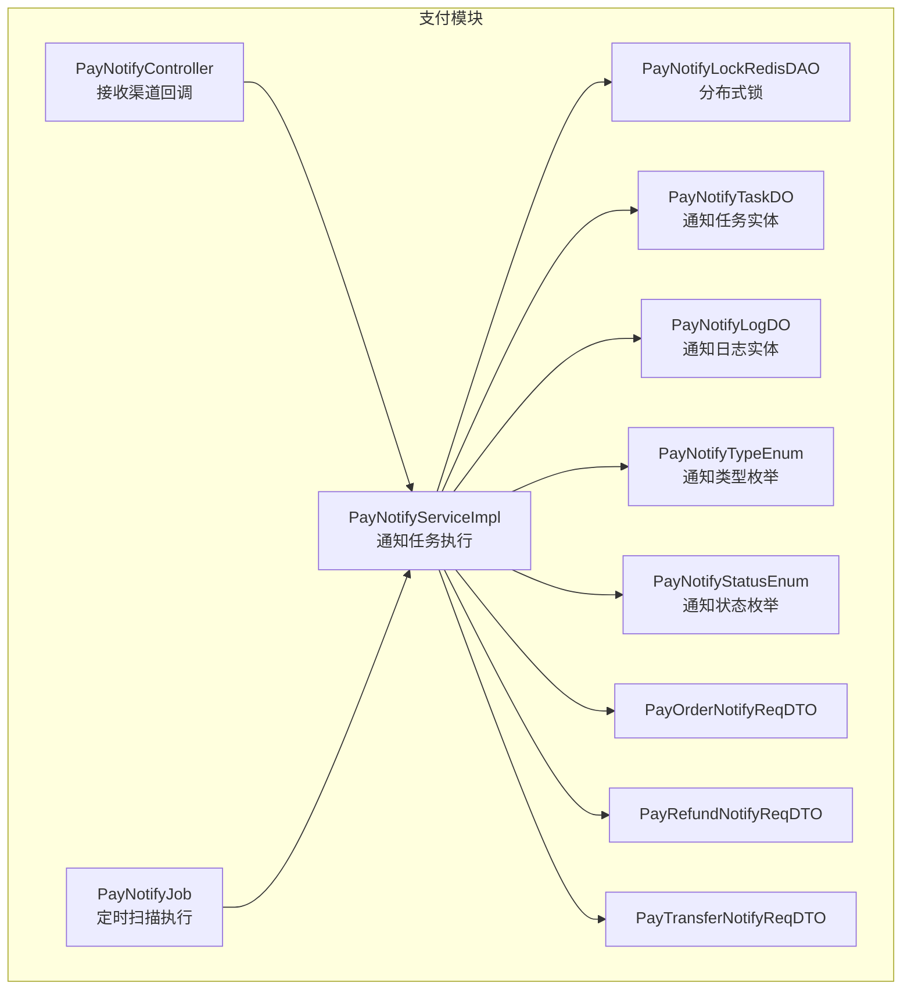
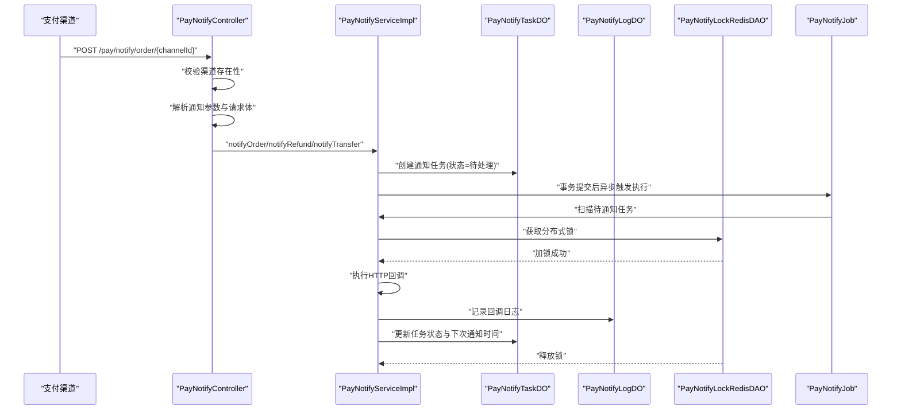
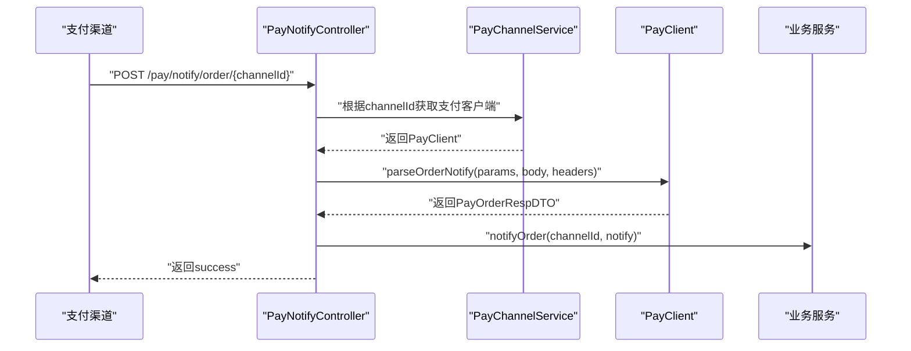
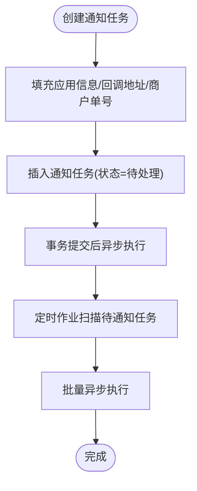
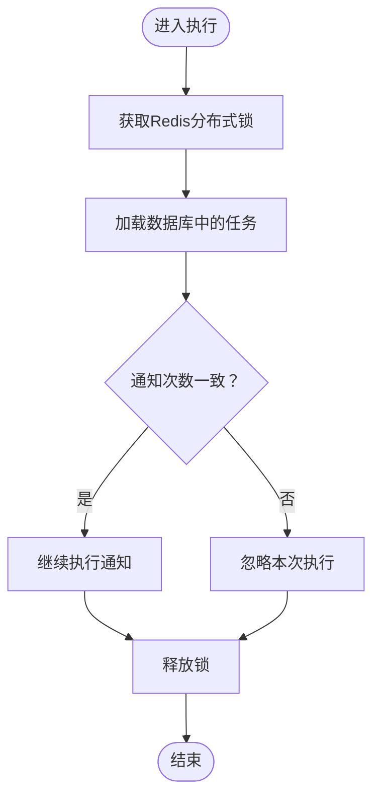
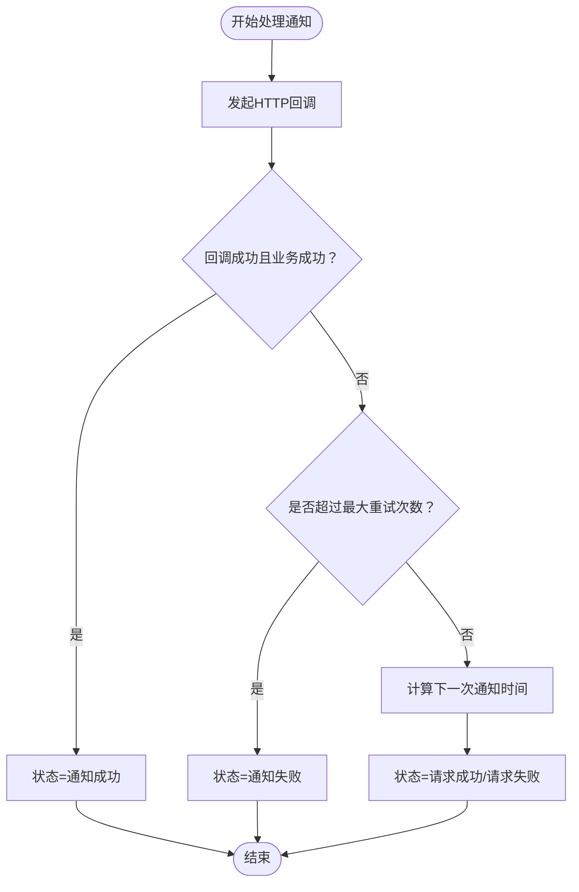
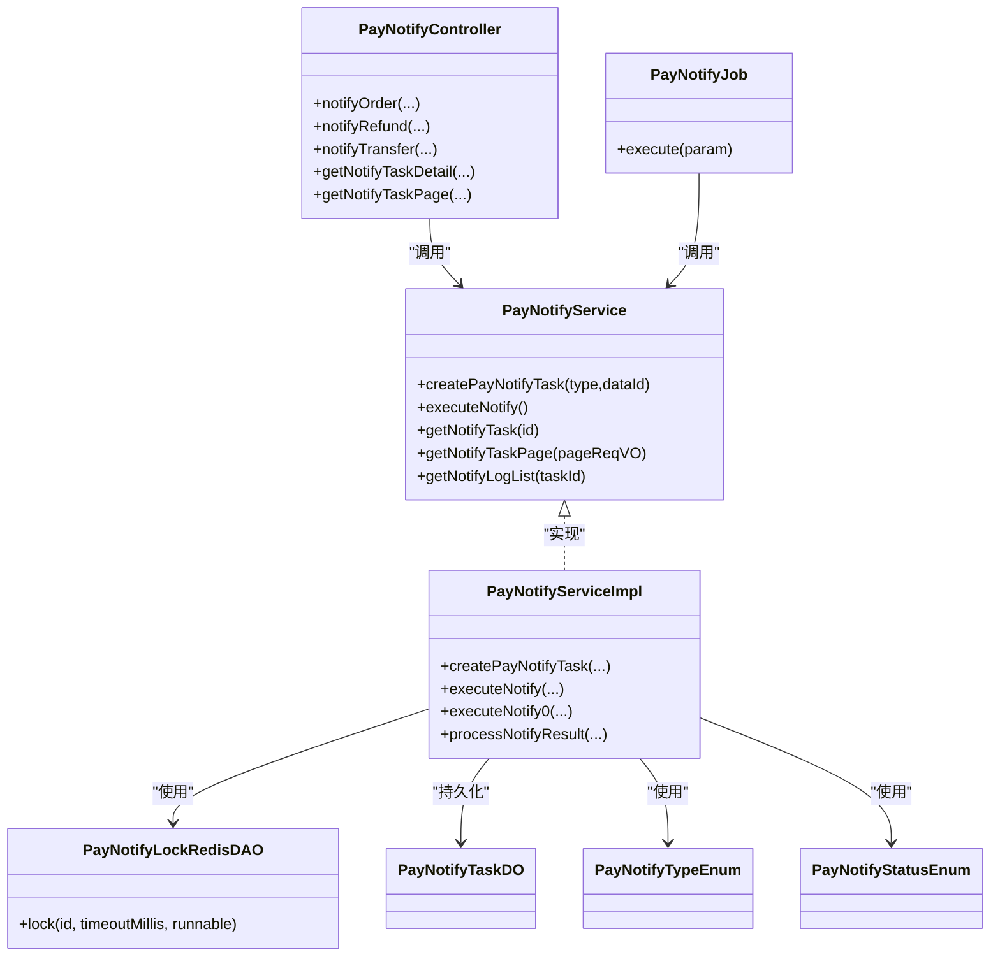

# 支付通知机制

<cite>
**本文引用的文件**
- [PayNotifyController.java](file://yudao-module-pay/src/main/java/cn/iocoder/yudao/module/pay/controller/admin/notify/PayNotifyController.java)
- [PayNotifyService.java](file://yudao-module-pay/src/main/java/cn/iocoder/yudao/module/pay/service/notify/PayNotifyService.java)
- [PayNotifyServiceImpl.java](file://yudao-module-pay/src/main/java/cn/iocoder/yudao/module/pay/service/notify/PayNotifyServiceImpl.java)
- [PayNotifyJob.java](file://yudao-module-pay/src/main/java/cn/iocoder/yudao/module/pay/job/notify/PayNotifyJob.java)
- [PayNotifyLockRedisDAO.java](file://yudao-module-pay/src/main/java/cn/iocoder/yudao/module/pay/dal/redis/notify/PayNotifyLockRedisDAO.java)
- [PayNotifyTaskDO.java](file://yudao-module-pay/src/main/java/cn/iocoder/yudao/module/pay/dal/dataobject/notify/PayNotifyTaskDO.java)
- [PayNotifyTypeEnum.java](file://yudao-module-pay/src/main/java/cn/iocoder/yudao/module/pay/enums/notify/PayNotifyTypeEnum.java)
- [PayNotifyStatusEnum.java](file://yudao-module-pay/src/main/java/cn/iocoder/yudao/module/pay/enums/notify/PayNotifyStatusEnum.java)
- [PayOrderNotifyReqDTO.java](file://yudao-module-pay/src/main/java/cn/iocoder/yudao/module/pay/api/notify/dto/PayOrderNotifyReqDTO.java)
- [PayRefundNotifyReqDTO.java](file://yudao-module-pay/src/main/java/cn/iocoder/yudao/module/pay/api/notify/dto/PayRefundNotifyReqDTO.java)
- [PayTransferNotifyReqDTO.java](file://yudao-module-pay/src/main/java/cn/iocoder/yudao/module/pay/api/notify/dto/PayTransferNotifyReqDTO.java)
</cite>

## 目录
1. [简介](#简介)
2. [项目结构](#项目结构)
3. [核心组件](#核心组件)
4. [架构总览](#架构总览)
5. [详细组件分析](#详细组件分析)
6. [依赖关系分析](#依赖关系分析)
7. [性能考量](#性能考量)
8. [故障排查指南](#故障排查指南)
9. [结论](#结论)
10. [附录](#附录)

## 简介
本技术文档围绕支付通知机制展开，系统性阐述支付回调通知的设计与实现，覆盖以下关键主题：
- 通知接收流程：通知验证、签名验证、数据解析、业务处理
- 通知状态管理：待处理、处理中、处理成功、处理失败、已忽略
- 幂等性设计：防重复通知导致的业务异常
- 失败处理机制：重试策略、最大重试次数、死信队列（容错）
- 与订单状态同步：确保支付状态的准确性和一致性
- 调试与监控：通知日志记录、异常告警、性能监控
- 流程图与实现路径：提供通知流程图与关键代码片段路径

## 项目结构
支付通知相关代码主要位于支付模块的 controller、service、dal、enums、job、api 等包中，采用按职责分层组织：
- 控制器层：接收来自支付渠道的回调，解析参数与请求体，调用业务服务
- 服务层：创建通知任务、执行通知、处理结果、记录日志
- 数据访问层：通知任务与日志的持久化
- 枚举层：通知类型与状态定义
- 作业层：定时扫描并执行通知任务
- API DTO 层：对外通知请求的参数封装

图表来源
- [PayNotifyController.java:63-127](file://yudao-module-pay/src/main/java/cn/iocoder/yudao/module/pay/controller/admin/notify/PayNotifyController.java#L63-L127)
- [PayNotifyServiceImpl.java:95-203](file://yudao-module-pay/src/main/java/cn/iocoder/yudao/module/pay/service/notify/PayNotifyServiceImpl.java#L95-L203)
- [PayNotifyJob.java:24-29](file://yudao-module-pay/src/main/java/cn/iocoder/yudao/module/pay/job/notify/PayNotifyJob.java#L24-L29)
- [PayNotifyTaskDO.java:23-102](file://yudao-module-pay/src/main/java/cn/iocoder/yudao/module/pay/dal/dataobject/notify/PayNotifyTaskDO.java#L23-L102)
- [PayNotifyTypeEnum.java:13-29](file://yudao-module-pay/src/main/java/cn/iocoder/yudao/module/pay/enums/notify/PayNotifyTypeEnum.java#L13-L29)
- [PayNotifyStatusEnum.java:13-32](file://yudao-module-pay/src/main/java/cn/iocoder/yudao/module/pay/enums/notify/PayNotifyStatusEnum.java#L13-L32)
- [PayNotifyLockRedisDAO.java:23-33](file://yudao-module-pay/src/main/java/cn/iocoder/yudao/module/pay/dal/redis/notify/PayNotifyLockRedisDAO.java#L23-L33)
- [PayOrderNotifyReqDTO.java:20-34](file://yudao-module-pay/src/main/java/cn/iocoder/yudao/module/pay/api/notify/dto/PayOrderNotifyReqDTO.java#L20-L34)
- [PayRefundNotifyReqDTO.java:20-40](file://yudao-module-pay/src/main/java/cn/iocoder/yudao/module/pay/api/notify/dto/PayRefundNotifyReqDTO.java#L20-L40)
- [PayTransferNotifyReqDTO.java:20-34](file://yudao-module-pay/src/main/java/cn/iocoder/yudao/module/pay/api/notify/dto/PayTransferNotifyReqDTO.java#L20-L34)

章节来源
- [PayNotifyController.java:43-170](file://yudao-module-pay/src/main/java/cn/iocoder/yudao/module/pay/controller/admin/notify/PayNotifyController.java#L43-L170)
- [PayNotifyServiceImpl.java:55-324](file://yudao-module-pay/src/main/java/cn/iocoder/yudao/module/pay/service/notify/PayNotifyServiceImpl.java#L55-L324)
- [PayNotifyJob.java:11-32](file://yudao-module-pay/src/main/java/cn/iocoder/yudao/module/pay/job/notify/PayNotifyJob.java#L11-L32)
- [PayNotifyTaskDO.java:17-102](file://yudao-module-pay/src/main/java/cn/iocoder/yudao/module/pay/dal/dataobject/notify/PayNotifyTaskDO.java#L17-L102)
- [PayNotifyTypeEnum.java:6-29](file://yudao-module-pay/src/main/java/cn/iocoder/yudao/module/pay/enums/notify/PayNotifyTypeEnum.java#L6-L29)
- [PayNotifyStatusEnum.java:6-32](file://yudao-module-pay/src/main/java/cn/iocoder/yudao/module/pay/enums/notify/PayNotifyStatusEnum.java#L6-L32)
- [PayNotifyLockRedisDAO.java:12-39](file://yudao-module-pay/src/main/java/cn/iocoder/yudao/module/pay/dal/redis/notify/PayNotifyLockRedisDAO.java#L12-L39)
- [PayOrderNotifyReqDTO.java:11-34](file://yudao-module-pay/src/main/java/cn/iocoder/yudao/module/pay/api/notify/dto/PayOrderNotifyReqDTO.java#L11-L34)
- [PayRefundNotifyReqDTO.java:11-40](file://yudao-module-pay/src/main/java/cn/iocoder/yudao/module/pay/api/notify/dto/PayRefundNotifyReqDTO.java#L11-L40)
- [PayTransferNotifyReqDTO.java:11-34](file://yudao-module-pay/src/main/java/cn/iocoder/yudao/module/pay/api/notify/dto/PayTransferNotifyReqDTO.java#L11-L34)

## 核心组件
- 控制器：接收支付渠道回调，解析参数与请求体，调用业务服务处理通知
- 服务：创建通知任务、异步执行通知、处理结果、记录日志
- 作业：定时扫描待通知任务并批量执行
- 锁：基于 Redis 的分布式锁，保证并发安全
- 数据模型：通知任务与日志实体，包含通知类型、状态、重试策略等
- 枚举：通知类型与状态定义
- DTO：对外通知请求的参数封装

章节来源
- [PayNotifyController.java:63-127](file://yudao-module-pay/src/main/java/cn/iocoder/yudao/module/pay/controller/admin/notify/PayNotifyController.java#L63-L127)
- [PayNotifyService.java:10-57](file://yudao-module-pay/src/main/java/cn/iocoder/yudao/module/pay/service/notify/PayNotifyService.java#L10-L57)
- [PayNotifyServiceImpl.java:95-203](file://yudao-module-pay/src/main/java/cn/iocoder/yudao/module/pay/service/notify/PayNotifyServiceImpl.java#L95-L203)
- [PayNotifyJob.java:24-29](file://yudao-module-pay/src/main/java/cn/iocoder/yudao/module/pay/job/notify/PayNotifyJob.java#L24-L29)
- [PayNotifyLockRedisDAO.java:23-33](file://yudao-module-pay/src/main/java/cn/iocoder/yudao/module/pay/dal/redis/notify/PayNotifyLockRedisDAO.java#L23-L33)
- [PayNotifyTaskDO.java:28-96](file://yudao-module-pay/src/main/java/cn/iocoder/yudao/module/pay/dal/dataobject/notify/PayNotifyTaskDO.java#L28-L96)
- [PayNotifyTypeEnum.java:13-29](file://yudao-module-pay/src/main/java/cn/iocoder/yudao/module/pay/enums/notify/PayNotifyTypeEnum.java#L13-L29)
- [PayNotifyStatusEnum.java:13-32](file://yudao-module-pay/src/main/java/cn/iocoder/yudao/module/pay/enums/notify/PayNotifyStatusEnum.java#L13-L32)
- [PayOrderNotifyReqDTO.java:20-34](file://yudao-module-pay/src/main/java/cn/iocoder/yudao/module/pay/api/notify/dto/PayOrderNotifyReqDTO.java#L20-L34)
- [PayRefundNotifyReqDTO.java:20-40](file://yudao-module-pay/src/main/java/cn/iocoder/yudao/module/pay/api/notify/dto/PayRefundNotifyReqDTO.java#L20-L40)
- [PayTransferNotifyReqDTO.java:20-34](file://yudao-module-pay/src/main/java/cn/iocoder/yudao/module/pay/api/notify/dto/PayTransferNotifyReqDTO.java#L20-L34)

## 架构总览
支付通知机制由“渠道回调 → 业务处理 → 通知任务创建 → 定时扫描执行 → 分布式锁并发控制 → 结果处理与日志记录”构成闭环。

图表来源
- [PayNotifyController.java:63-127](file://yudao-module-pay/src/main/java/cn/iocoder/yudao/module/pay/controller/admin/notify/PayNotifyController.java#L63-L127)
- [PayNotifyServiceImpl.java:95-203](file://yudao-module-pay/src/main/java/cn/iocoder/yudao/module/pay/service/notify/PayNotifyServiceImpl.java#L95-L203)
- [PayNotifyJob.java:24-29](file://yudao-module-pay/src/main/java/cn/iocoder/yudao/module/pay/job/notify/PayNotifyJob.java#L24-L29)
- [PayNotifyLockRedisDAO.java:23-33](file://yudao-module-pay/src/main/java/cn/iocoder/yudao/module/pay/dal/redis/notify/PayNotifyLockRedisDAO.java#L23-L33)
- [PayNotifyTaskDO.java:28-96](file://yudao-module-pay/src/main/java/cn/iocoder/yudao/module/pay/dal/dataobject/notify/PayNotifyTaskDO.java#L28-L96)
- [PayNotifyStatusEnum.java:13-32](file://yudao-module-pay/src/main/java/cn/iocoder/yudao/module/pay/enums/notify/PayNotifyStatusEnum.java#L13-L32)

## 详细组件分析

### 通知接收与解析
- 支付渠道回调统一入口：分别针对支付、退款、转账三类回调提供接口
- 参数与请求体解析：结合支付客户端能力，解析渠道通知中的参数与请求体
- 业务处理：调用对应业务服务（订单/退款/转账）进行状态更新与后续处理
- 返回值：固定返回“success”，表示接收成功

图表来源
- [PayNotifyController.java:63-83](file://yudao-module-pay/src/main/java/cn/iocoder/yudao/module/pay/controller/admin/notify/PayNotifyController.java#L63-L83)
- [PayNotifyController.java:85-105](file://yudao-module-pay/src/main/java/cn/iocoder/yudao/module/pay/controller/admin/notify/PayNotifyController.java#L85-L105)
- [PayNotifyController.java:107-127](file://yudao-module-pay/src/main/java/cn/iocoder/yudao/module/pay/controller/admin/notify/PayNotifyController.java#L107-L127)

章节来源
- [PayNotifyController.java:63-127](file://yudao-module-pay/src/main/java/cn/iocoder/yudao/module/pay/controller/admin/notify/PayNotifyController.java#L63-L127)

### 通知任务创建与执行
- 任务创建：在事务提交后创建通知任务，填充应用信息、回调地址、商户单号等，并设置初始状态为“待处理”
- 异步执行：使用线程池异步执行通知，避免阻塞当前事务
- 批量执行：定时作业扫描待通知任务，批量异步执行，支持超时等待与日志输出

图表来源
- [PayNotifyServiceImpl.java:95-129](file://yudao-module-pay/src/main/java/cn/iocoder/yudao/module/pay/service/notify/PayNotifyServiceImpl.java#L95-L129)
- [PayNotifyJob.java:24-29](file://yudao-module-pay/src/main/java/cn/iocoder/yudao/module/pay/job/notify/PayNotifyJob.java#L24-L29)

章节来源
- [PayNotifyServiceImpl.java:95-129](file://yudao-module-pay/src/main/java/cn/iocoder/yudao/module/pay/service/notify/PayNotifyServiceImpl.java#L95-L129)
- [PayNotifyJob.java:11-32](file://yudao-module-pay/src/main/java/cn/iocoder/yudao/module/pay/job/notify/PayNotifyJob.java#L11-L32)

### 并发控制与幂等性
- 分布式锁：使用 Redisson 获取任务级锁，避免多个实例并发执行同一任务
- 幂等性：通过比较任务的“通知次数”与数据库中的值，若不一致则忽略本次执行，防止重复通知导致的业务异常

图表来源
- [PayNotifyServiceImpl.java:187-203](file://yudao-module-pay/src/main/java/cn/iocoder/yudao/module/pay/service/notify/PayNotifyServiceImpl.java#L187-L203)
- [PayNotifyLockRedisDAO.java:23-33](file://yudao-module-pay/src/main/java/cn/iocoder/yudao/module/pay/dal/redis/notify/PayNotifyLockRedisDAO.java#L23-L33)

章节来源
- [PayNotifyServiceImpl.java:187-203](file://yudao-module-pay/src/main/java/cn/iocoder/yudao/module/pay/service/notify/PayNotifyServiceImpl.java#L187-L203)
- [PayNotifyLockRedisDAO.java:12-39](file://yudao-module-pay/src/main/java/cn/iocoder/yudao/module/pay/dal/redis/notify/PayNotifyLockRedisDAO.java#L12-L39)

### 通知重试策略与状态管理
- 重试频率：内置重试间隔数组，包含首次与多次重试的时间间隔（单位秒），总计最多 9 次通知（含首次）
- 状态流转：
  - 成功：回调返回成功，状态置为“通知成功”
  - 请求成功但业务失败：状态置为“请求成功，但是结果失败”
  - 请求失败或异常：状态置为“请求失败”，并安排下一次通知时间
  - 超过最大重试次数：状态置为“通知失败”

图表来源
- [PayNotifyTaskDO.java:33-36](file://yudao-module-pay/src/main/java/cn/iocoder/yudao/module/pay/dal/dataobject/notify/PayNotifyTaskDO.java#L33-L36)
- [PayNotifyServiceImpl.java:269-297](file://yudao-module-pay/src/main/java/cn/iocoder/yudao/module/pay/service/notify/PayNotifyServiceImpl.java#L269-L297)
- [PayNotifyStatusEnum.java:13-21](file://yudao-module-pay/src/main/java/cn/iocoder/yudao/module/pay/enums/notify/PayNotifyStatusEnum.java#L13-L21)

章节来源
- [PayNotifyTaskDO.java:28-96](file://yudao-module-pay/src/main/java/cn/iocoder/yudao/module/pay/dal/dataobject/notify/PayNotifyTaskDO.java#L28-L96)
- [PayNotifyServiceImpl.java:269-297](file://yudao-module-pay/src/main/java/cn/iocoder/yudao/module/pay/service/notify/PayNotifyServiceImpl.java#L269-L297)
- [PayNotifyStatusEnum.java:13-21](file://yudao-module-pay/src/main/java/cn/iocoder/yudao/module/pay/enums/notify/PayNotifyStatusEnum.java#L13-L21)

### 通知内容与对外请求
- 支付通知请求：包含商户订单号与支付订单编号
- 退款通知请求：包含商户订单号、商户退款号与支付退款编号
- 转账通知请求：包含商户转账单号与转账订单编号
- 请求头：自动注入租户信息，确保多租户隔离

章节来源
- [PayOrderNotifyReqDTO.java:20-34](file://yudao-module-pay/src/main/java/cn/iocoder/yudao/module/pay/api/notify/dto/PayOrderNotifyReqDTO.java#L20-L34)
- [PayRefundNotifyReqDTO.java:20-40](file://yudao-module-pay/src/main/java/cn/iocoder/yudao/module/pay/api/notify/dto/PayRefundNotifyReqDTO.java#L20-L40)
- [PayTransferNotifyReqDTO.java:20-34](file://yudao-module-pay/src/main/java/cn/iocoder/yudao/module/pay/api/notify/dto/PayTransferNotifyReqDTO.java#L20-L34)
- [PayNotifyServiceImpl.java:232-259](file://yudao-module-pay/src/main/java/cn/iocoder/yudao/module/pay/service/notify/PayNotifyServiceImpl.java#L232-L259)

### 通知日志与监控
- 日志记录：每次通知完成后记录响应结果或异常信息，包含通知次数、状态与响应内容
- 监控指标：定时作业执行数量、通知超时等待日志、失败统计
- 可视化：提供通知任务详情与分页查询接口，便于人工排查

章节来源
- [PayNotifyServiceImpl.java:219-224](file://yudao-module-pay/src/main/java/cn/iocoder/yudao/module/pay/service/notify/PayNotifyServiceImpl.java#L219-L224)
- [PayNotifyController.java:129-167](file://yudao-module-pay/src/main/java/cn/iocoder/yudao/module/pay/controller/admin/notify/PayNotifyController.java#L129-L167)

## 依赖关系分析
- 控制器依赖支付渠道服务与业务服务，负责回调入口与参数解析
- 服务层依赖任务与日志 Mapper、分布式锁 DAO、业务服务（订单/退款/转账），负责任务生命周期管理
- 作业层依赖服务层，定时扫描并批量执行通知
- 数据模型与枚举为服务层提供状态与类型约束

图表来源
- [PayNotifyController.java:43-170](file://yudao-module-pay/src/main/java/cn/iocoder/yudao/module/pay/controller/admin/notify/PayNotifyController.java#L43-L170)
- [PayNotifyService.java:10-57](file://yudao-module-pay/src/main/java/cn/iocoder/yudao/module/pay/service/notify/PayNotifyService.java#L10-L57)
- [PayNotifyServiceImpl.java:55-324](file://yudao-module-pay/src/main/java/cn/iocoder/yudao/module/pay/service/notify/PayNotifyServiceImpl.java#L55-L324)
- [PayNotifyJob.java:11-32](file://yudao-module-pay/src/main/java/cn/iocoder/yudao/module/pay/job/notify/PayNotifyJob.java#L11-L32)
- [PayNotifyLockRedisDAO.java:12-39](file://yudao-module-pay/src/main/java/cn/iocoder/yudao/module/pay/dal/redis/notify/PayNotifyLockRedisDAO.java#L12-L39)
- [PayNotifyTaskDO.java:17-102](file://yudao-module-pay/src/main/java/cn/iocoder/yudao/module/pay/dal/dataobject/notify/PayNotifyTaskDO.java#L17-L102)
- [PayNotifyTypeEnum.java:6-29](file://yudao-module-pay/src/main/java/cn/iocoder/yudao/module/pay/enums/notify/PayNotifyTypeEnum.java#L6-L29)
- [PayNotifyStatusEnum.java:6-32](file://yudao-module-pay/src/main/java/cn/iocoder/yudao/module/pay/enums/notify/PayNotifyStatusEnum.java#L6-L32)

## 性能考量
- 异步执行：通过线程池异步执行通知，避免阻塞事务
- 批量处理：定时作业批量扫描与执行，减少频繁查询
- 超时控制：HTTP 请求设置超时时间，防止长时间阻塞
- 并发控制：分布式锁保障高并发下的幂等性与一致性
- 重试策略：指数退避式重试间隔，降低对下游系统的压力

## 故障排查指南
- 通知未触发：检查任务状态是否为“待处理”，确认事务提交后是否异步执行
- 通知超时：关注等待完成的日志输出，确认线程池配置与超时时间
- 幂等性问题：核对通知次数与数据库记录是否一致，排查锁释放逻辑
- 回调失败：查看通知日志中的响应内容或异常信息，定位业务失败原因
- 多次失败：确认最大重试次数是否已达上限，必要时人工介入处理

章节来源
- [PayNotifyServiceImpl.java:161-170](file://yudao-module-pay/src/main/java/cn/iocoder/yudao/module/pay/service/notify/PayNotifyServiceImpl.java#L161-L170)
- [PayNotifyServiceImpl.java:219-224](file://yudao-module-pay/src/main/java/cn/iocoder/yudao/module/pay/service/notify/PayNotifyServiceImpl.java#L219-L224)
- [PayNotifyStatusEnum.java:13-21](file://yudao-module-pay/src/main/java/cn/iocoder/yudao/module/pay/enums/notify/PayNotifyStatusEnum.java#L13-L21)

## 结论
支付通知机制通过“渠道回调 → 任务创建 → 定时扫描 → 分布式锁并发控制 → 重试与状态管理 → 日志记录”的闭环设计，实现了高可靠、可扩展、可观测的通知体系。其幂等性与重试策略有效降低了重复通知与网络波动带来的风险；通过可视化接口与日志记录，便于运维与开发人员快速定位问题。

## 附录
- 关键实现路径参考
  - 通知接收与解析：[PayNotifyController.java:63-127](file://yudao-module-pay/src/main/java/cn/iocoder/yudao/module/pay/controller/admin/notify/PayNotifyController.java#L63-L127)
  - 通知任务创建与执行：[PayNotifyServiceImpl.java:95-129](file://yudao-module-pay/src/main/java/cn/iocoder/yudao/module/pay/service/notify/PayNotifyServiceImpl.java#L95-L129)
  - 定时作业执行：[PayNotifyJob.java:24-29](file://yudao-module-pay/src/main/java/cn/iocoder/yudao/module/pay/job/notify/PayNotifyJob.java#L24-L29)
  - 分布式锁与幂等：[PayNotifyLockRedisDAO.java:23-33](file://yudao-module-pay/src/main/java/cn/iocoder/yudao/module/pay/dal/redis/notify/PayNotifyLockRedisDAO.java#L23-L33)
  - 通知状态与类型：[PayNotifyStatusEnum.java:13-32](file://yudao-module-pay/src/main/java/cn/iocoder/yudao/module/pay/enums/notify/PayNotifyStatusEnum.java#L13-L32)、[PayNotifyTypeEnum.java:13-29](file://yudao-module-pay/src/main/java/cn/iocoder/yudao/module/pay/enums/notify/PayNotifyTypeEnum.java#L13-L29)
  - 通知任务与日志：[PayNotifyTaskDO.java:28-96](file://yudao-module-pay/src/main/java/cn/iocoder/yudao/module/pay/dal/dataobject/notify/PayNotifyTaskDO.java#L28-L96)
  - 对外通知请求DTO：[PayOrderNotifyReqDTO.java:20-34](file://yudao-module-pay/src/main/java/cn/iocoder/yudao/module/pay/api/notify/dto/PayOrderNotifyReqDTO.java#L20-L34)、[PayRefundNotifyReqDTO.java:20-40](file://yudao-module-pay/src/main/java/cn/iocoder/yudao/module/pay/api/notify/dto/PayRefundNotifyReqDTO.java#L20-L40)、[PayTransferNotifyReqDTO.java:20-34](file://yudao-module-pay/src/main/java/cn/iocoder/yudao/module/pay/api/notify/dto/PayTransferNotifyReqDTO.java#L20-L34)