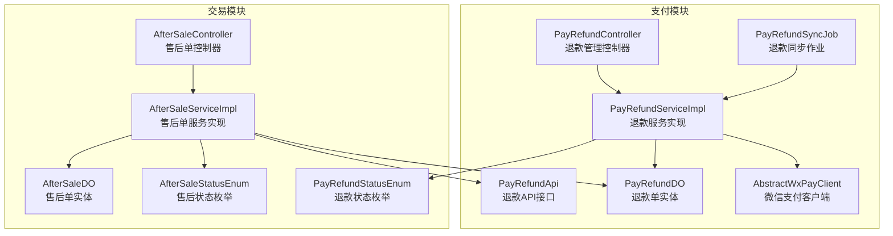
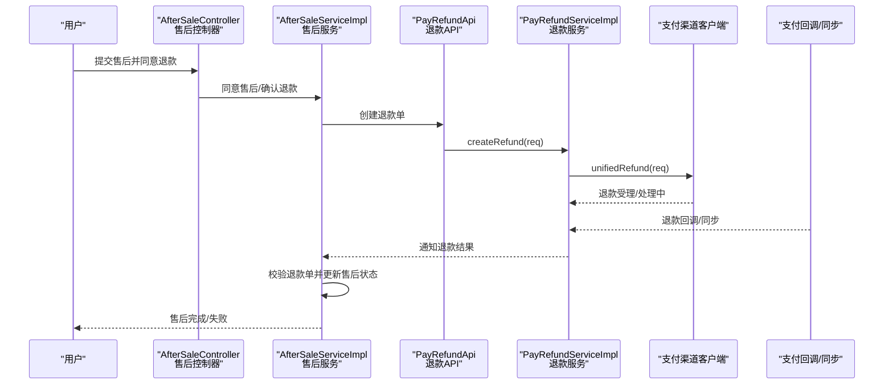
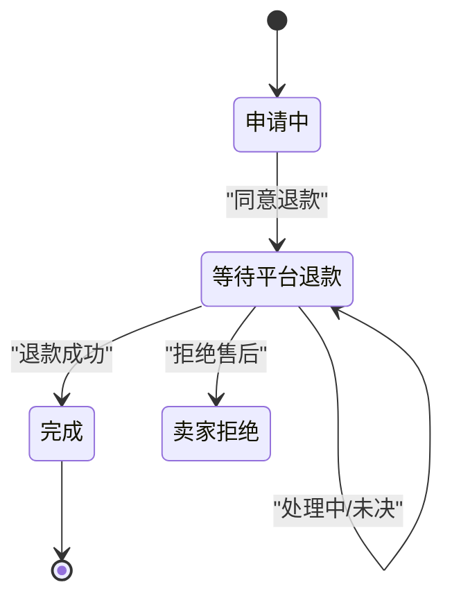
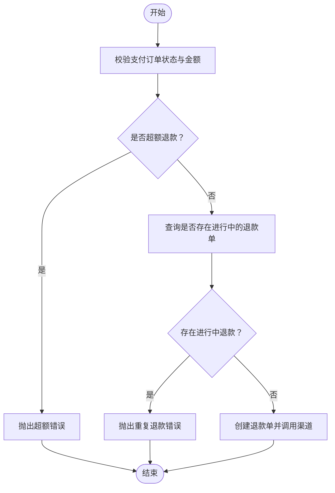
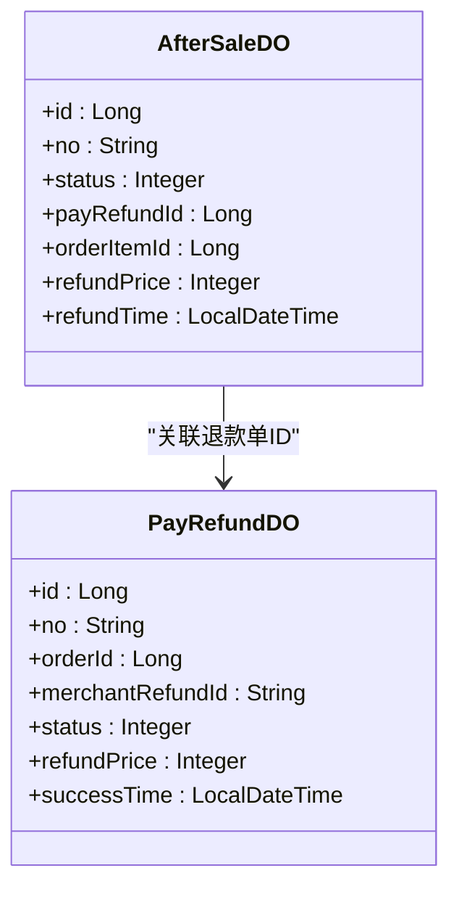
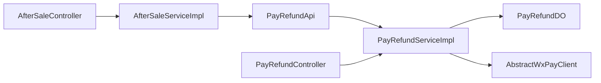
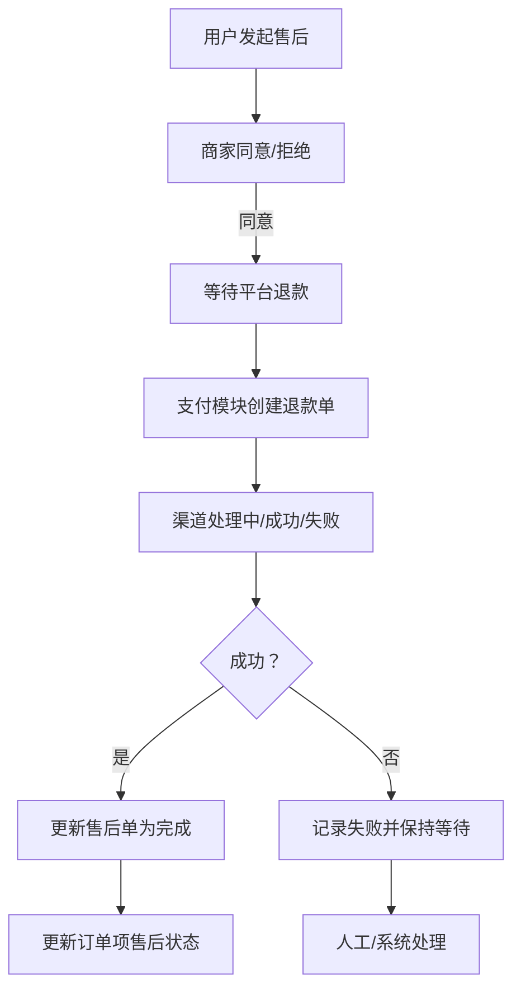

# 退款订单管理

<cite>
**本文引用的文件**
- [PayRefundStatusEnum.java](file://qiji-module-pay/src/main/java/com.qiji.cps/module/pay/enums/refund/PayRefundStatusEnum.java)
- [PayRefundApi.java](file://qiji-module-pay/src/main/java/com.qiji.cps/module/pay/api/refund/PayRefundApi.java)
- [PayRefundServiceImpl.java](file://qiji-module-pay/src/main/java/com.qiji.cps/module/pay/service/refund/PayRefundServiceImpl.java)
- [PayRefundDO.java](file://qiji-module-pay/src/main/java/com.qiji.cps/module/pay/dal/dataobject/refund/PayRefundDO.java)
- [PayRefundController.java](file://qiji-module-pay/src/main/java/com.qiji.cps/module/pay/controller/admin/refund/PayRefundController.java)
- [PayRefundSyncJob.java](file://qiji-module-pay/src/main/java/com.qiji.cps/module/pay/job/refund/PayRefundSyncJob.java)
- [AfterSaleStatusEnum.java](file://qiji-module-mall/qiji-module-trade-api/src/main/java/com.qiji.cps/module/trade/enums/aftersale/AfterSaleStatusEnum.java)
- [AfterSaleTypeEnum.java](file://qiji-module-mall/qiji-module-trade-api/src/main/java/com.qiji.cps/module/trade/enums/aftersale/AfterSaleTypeEnum.java)
- [AfterSaleWayEnum.java](file://qiji-module-mall/qiji-module-trade-api/src/main/java/com.qiji.cps/module/trade/enums/aftersale/AfterSaleWayEnum.java)
- [AfterSaleServiceImpl.java](file://qiji-module-mall/qiji-module-trade/src/main/java/com.qiji.cps/module/trade/service/aftersale/AfterSaleServiceImpl.java)
- [AfterSaleController.java](file://qiji-module-mall/qiji-module-trade/src/main/java/com.qiji.cps/module/trade/controller/admin/aftersale/AfterSaleController.java)
- [AfterSaleDO.java](file://qiji-module-mall/qiji-module-trade/src/main/java/com.qiji.cps/module/trade/dal/dataobject/aftersale/AfterSaleDO.java)
- [AbstractWxPayClient.java](file://qiji-module-pay/src/main/java/com.qiji.cps/module/pay/framework/pay/core/client/impl/weixin/AbstractWxPayClient.java)
</cite>

## 目录
1. [引言](#引言)
2. [项目结构](#项目结构)
3. [核心组件](#核心组件)
4. [架构总览](#架构总览)
5. [详细组件分析](#详细组件分析)
6. [依赖分析](#依赖分析)
7. [性能考虑](#性能考虑)
8. [故障排查指南](#故障排查指南)
9. [结论](#结论)
10. [附录](#附录)

## 引言
本技术文档围绕“退款订单管理”功能，系统性梳理退款业务从申请、审核、执行到通知的完整闭环，覆盖退款状态管理、规则配置、安全机制、与订单的关联关系、通知机制以及异常处理策略。文档以代码级分析为基础，辅以流程图与时序图，帮助开发者快速理解与落地实现。

## 项目结构
退款能力由两个子模块协同实现：
- 支付模块（pay-module）：负责退款单的创建、渠道对接、状态同步与通知。
- 商城交易模块（trade-module）：负责售后单的生命周期管理，触发退款并承接退款结果，更新订单项状态。

**图表来源**
- [PayRefundServiceImpl.java:48-332](file://qiji-module-pay/src/main/java/com.qiji.cps/module/pay/service/refund/PayRefundServiceImpl.java#L48-L332)
- [PayRefundApi.java:13-31](file://qiji-module-pay/src/main/java/com.qiji.cps/module/pay/api/refund/PayRefundApi.java#L13-L31)
- [PayRefundDO.java:33-169](file://qiji-module-pay/src/main/java/com.qiji.cps/module/pay/dal/dataobject/refund/PayRefundDO.java#L33-L169)
- [PayRefundController.java](file://qiji-module-pay/src/main/java/com.qiji.cps/module/pay/controller/admin/refund/PayRefundController.java)
- [AbstractWxPayClient.java:394-417](file://qiji-module-pay/src/main/java/com.qiji.cps/module/pay/framework/pay/core/client/impl/weixin/AbstractWxPayClient.java#L394-L417)
- [PayRefundSyncJob.java](file://qiji-module-pay/src/main/java/com.qiji.cps/module/pay/job/refund/PayRefundSyncJob.java)
- [AfterSaleServiceImpl.java:64-487](file://qiji-module-mall/qiji-module-trade/src/main/java/com.qiji.cps/module/trade/service/aftersale/AfterSaleServiceImpl.java#L64-L487)
- [AfterSaleController.java:44-156](file://qiji-module-mall/qiji-module-trade/src/main/java/com.qiji.cps/module/trade/controller/admin/aftersale/AfterSaleController.java#L44-L156)
- [AfterSaleDO.java:26-37](file://qiji-module-mall/qiji-module-trade/src/main/java/com.qiji.cps/module/trade/dal/dataobject/aftersale/AfterSaleDO.java#L26-L37)
- [AfterSaleStatusEnum.java:21-95](file://qiji-module-mall/qiji-module-trade-api/src/main/java/com.qiji.cps/module/trade/enums/aftersale/AfterSaleStatusEnum.java#L21-L95)
- [PayRefundStatusEnum.java:15-32](file://qiji-module-pay/src/main/java/com.qiji.cps/module/pay/enums/refund/PayRefundStatusEnum.java#L15-L32)

**章节来源**
- [PayRefundServiceImpl.java:48-332](file://qiji-module-pay/src/main/java/com.qiji.cps/module/pay/service/refund/PayRefundServiceImpl.java#L48-L332)
- [AfterSaleServiceImpl.java:64-487](file://qiji-module-mall/qiji-module-trade/src/main/java/com.qiji.cps/module/trade/service/aftersale/AfterSaleServiceImpl.java#L64-L487)

## 核心组件
- 退款状态枚举（PayRefundStatusEnum）：定义“未退款/退款成功/退款失败”，并提供成功/失败判定工具方法。
- 售后状态枚举（AfterSaleStatusEnum）：定义“申请中/卖家通过/待卖家收货/等待平台退款/完成/买家取消/卖家拒绝/卖家拒绝收货”等状态及进行中集合。
- 售后方式与类型枚举（AfterSaleWayEnum、AfterSaleTypeEnum）：区分“仅退款/退货退款”、“售中退款/售后退款”。
- 支付退款服务（PayRefundServiceImpl）：负责创建退款单、调用支付渠道、接收回调、状态同步、更新订单退款金额与通知。
- 售后服务（AfterSaleServiceImpl）：负责售后单生命周期管理，触发退款、校验退款结果、更新售后与订单项状态。
- 控制器（AfterSaleController、PayRefundController）：对外暴露售后与退款管理接口，接收支付回调并驱动售后状态变更。

**章节来源**
- [PayRefundStatusEnum.java:15-32](file://qiji-module-pay/src/main/java/com.qiji.cps/module/pay/enums/refund/PayRefundStatusEnum.java#L15-L32)
- [AfterSaleStatusEnum.java:21-95](file://qiji-module-mall/qiji-module-trade-api/src/main/java/com.qiji.cps/module/trade/enums/aftersale/AfterSaleStatusEnum.java#L21-L95)
- [AfterSaleWayEnum.java:16-37](file://qiji-module-mall/qiji-module-trade-api/src/main/java/com.qiji.cps/module/trade/enums/aftersale/AfterSaleWayEnum.java#L16-L37)
- [AfterSaleTypeEnum.java:16-37](file://qiji-module-mall/qiji-module-trade-api/src/main/java/com.qiji.cps/module/trade/enums/aftersale/AfterSaleTypeEnum.java#L16-L37)
- [PayRefundServiceImpl.java:93-147](file://qiji-module-pay/src/main/java/com.qiji.cps/module/pay/service/refund/PayRefundServiceImpl.java#L93-L147)
- [AfterSaleServiceImpl.java:343-381](file://qiji-module-mall/qiji-module-trade/src/main/java/com.qiji.cps/module/trade/service/aftersale/AfterSaleServiceImpl.java#L343-L381)

## 架构总览
退款流程贯穿“交易模块—支付模块—支付渠道”的协作：
- 交易模块在售后单进入“等待平台退款”后，调用支付模块创建退款单。
- 支付模块向支付渠道发起退款，接收异步回调或定时同步，更新退款单状态。
- 支付模块通知交易模块退款结果，交易模块更新售后单与订单项状态。

**图表来源**
- [AfterSaleController.java:129-136](file://qiji-module-mall/qiji-module-trade/src/main/java/com.qiji.cps/module/trade/controller/admin/aftersale/AfterSaleController.java#L129-L136)
- [AfterSaleServiceImpl.java:343-381](file://qiji-module-mall/qiji-module-trade/src/main/java/com.qiji.cps/module/trade/service/aftersale/AfterSaleServiceImpl.java#L343-L381)
- [PayRefundApi.java:15-29](file://qiji-module-pay/src/main/java/com.qiji.cps/module/pay/api/refund/PayRefundApi.java#L15-L29)
- [PayRefundServiceImpl.java:134-147](file://qiji-module-pay/src/main/java/com.qiji.cps/module/pay/service/refund/PayRefundServiceImpl.java#L134-L147)
- [AbstractWxPayClient.java:394-417](file://qiji-module-pay/src/main/java/com.qiji.cps/module/pay/framework/pay/core/client/impl/weixin/AbstractWxPayClient.java#L394-L417)

## 详细组件分析

### 退款状态管理
- 支付侧状态：未退款（等待）、退款成功、退款失败。
- 售后侧状态：申请中、卖家通过、待卖家收货、等待平台退款、完成、买家取消、卖家拒绝、卖家拒绝收货。
- 状态流转要点：
  - 售后同意退款后进入“等待平台退款”，由支付模块回调或同步后转为“完成”或保持“等待平台退款”。
  - 若支付回调显示失败，则售后维持原状态并记录失败日志。

**图表来源**
- [AfterSaleStatusEnum.java:21-55](file://qiji-module-mall/qiji-module-trade-api/src/main/java/com.qiji.cps/module/trade/enums/aftersale/AfterSaleStatusEnum.java#L21-L55)
- [PayRefundStatusEnum.java:15-32](file://qiji-module-pay/src/main/java/com.qiji.cps/module/pay/enums/refund/PayRefundStatusEnum.java#L15-L32)

**章节来源**
- [AfterSaleStatusEnum.java:21-95](file://qiji-module-mall/qiji-module-trade-api/src/main/java/com.qiji.cps/module/trade/enums/aftersale/AfterSaleStatusEnum.java#L21-L95)
- [PayRefundStatusEnum.java:15-32](file://qiji-module-pay/src/main/java/com.qiji.cps/module/pay/enums/refund/PayRefundStatusEnum.java#L15-L32)

### 退款规则配置
- 退款比例与金额：支付模块在创建退款时校验“已退款金额+本次退款金额≤支付订单金额”，防止超额退款。
- 退款时限：当前代码未体现显式的“超时不可退款”逻辑，建议在业务层扩展（如按订单完成时间计算）。
- 部分/全额退款：通过传入退款金额实现，支持多次部分退款。
- 重复退款防护：支付模块在创建退款前检查“同一订单是否存在进行中的退款单”，避免并发重复发起。

**图表来源**
- [PayRefundServiceImpl.java:155-175](file://qiji-module-pay/src/main/java/com.qiji.cps/module/pay/service/refund/PayRefundServiceImpl.java#L155-L175)
- [PayRefundServiceImpl.java:105-110](file://qiji-module-pay/src/main/java/com.qiji.cps/module/pay/service/refund/PayRefundServiceImpl.java#L105-L110)

**章节来源**
- [PayRefundServiceImpl.java:155-175](file://qiji-module-pay/src/main/java/com.qiji.cps/module/pay/service/refund/PayRefundServiceImpl.java#L155-L175)
- [PayRefundServiceImpl.java:105-110](file://qiji-module-pay/src/main/java/com.qiji.cps/module/pay/service/refund/PayRefundServiceImpl.java#L105-L110)

### 退款安全机制
- 权限控制：售后控制器接口使用权限注解保护，仅授权用户可执行同意/拒绝/确认退款等操作。
- 金额与订单匹配校验：支付模块在回调/同步时校验退款金额与订单金额一致性，以及商户退款单号与售后单号匹配。
- 幂等与重入：退款单状态更新采用“按状态更新”的乐观锁策略，避免并发覆盖。
- 异常兜底：创建退款时若渠道调用异常，记录日志并等待回调/同步补偿，不阻断主流程。

**章节来源**
- [AfterSaleController.java:94-136](file://qiji-module-mall/qiji-module-trade/src/main/java/com.qiji.cps/module/trade/controller/admin/aftersale/AfterSaleController.java#L94-L136)
- [PayRefundServiceImpl.java:202-213](file://qiji-module-pay/src/main/java/com.qiji.cps/module/pay/service/refund/PayRefundServiceImpl.java#L202-L213)
- [PayRefundServiceImpl.java:425-452](file://qiji-module-pay/src/main/java/com.qiji.cps/module/pay/service/refund/PayRefundServiceImpl.java#L425-L452)

### 退款与订单的关联关系
- 售后单与退款单：售后单保存支付模块返回的退款单ID，便于后续对账与追踪。
- 订单项状态联动：当售后退款成功时，交易模块更新订单项的售后状态为“已完成”，并记录退款完成时间。
- 支付订单退款累计：支付模块在退款成功时更新支付订单的累计退款金额，确保总额度控制。

**图表来源**
- [AfterSaleDO.java:26-37](file://qiji-module-mall/qiji-module-trade/src/main/java/com.qiji.cps/module/trade/dal/dataobject/aftersale/AfterSaleDO.java#L26-L37)
- [PayRefundDO.java:33-169](file://qiji-module-pay/src/main/java/com.qiji.cps/module/pay/dal/dataobject/refund/PayRefundDO.java#L33-L169)

**章节来源**
- [AfterSaleServiceImpl.java:383-416](file://qiji-module-mall/qiji-module-trade/src/main/java/com.qiji.cps/module/trade/service/aftersale/AfterSaleServiceImpl.java#L383-L416)
- [PayRefundServiceImpl.java:241-247](file://qiji-module-pay/src/main/java/com.qiji.cps/module/pay/service/refund/PayRefundServiceImpl.java#L241-L247)

### 退款通知机制
- 支付回调：支付模块在收到渠道回调后，更新退款单状态并插入退款通知任务，供下游消费。
- 售后回调适配：交易模块控制器接收支付回调，区分“订单退款”与“售后退款”，分别调用订单或售后更新流程。
- 通知内容：包含退款状态、渠道错误码/错误信息、成功时间等，便于对账与排查。

**章节来源**
- [PayRefundServiceImpl.java:244-247](file://qiji-module-pay/src/main/java/com.qiji.cps/module/pay/service/refund/PayRefundServiceImpl.java#L244-L247)
- [PayRefundServiceImpl.java:187-213](file://qiji-module-pay/src/main/java/com.qiji.cps/module/pay/service/refund/PayRefundServiceImpl.java#L187-L213)
- [AfterSaleController.java:138-153](file://qiji-module-mall/qiji-module-trade/src/main/java/com.qiji.cps/module/trade/controller/admin/aftersale/AfterSaleController.java#L138-L153)

### 退款异常处理方案
- 渠道调用异常：创建退款时捕获异常并记录日志，不中断流程，等待回调/同步补偿。
- 退款结果未决：通过定时同步作业轮询渠道状态，直至成功或失败。
- 人工干预：售后模块提供“拒绝收货/拒绝售后”等操作，允许运营人员介入。
- 争议处理：售后单保留日志与证据（物流、图片等），配合客服处理争议。

**章节来源**
- [PayRefundServiceImpl.java:137-143](file://qiji-module-pay/src/main/java/com.qiji.cps/module/pay/service/refund/PayRefundServiceImpl.java#L137-L143)
- [PayRefundSyncJob.java](file://qiji-module-pay/src/main/java/com.qiji.cps/module/pay/job/refund/PayRefundSyncJob.java)
- [AfterSaleServiceImpl.java:300-324](file://qiji-module-mall/qiji-module-trade/src/main/java/com.qiji.cps/module/trade/service/aftersale/AfterSaleServiceImpl.java#L300-L324)

## 依赖分析
- 低耦合高内聚：交易模块仅通过API与支付模块交互，支付模块封装渠道差异，降低上层复杂度。
- 可观测性：退款单持久化、回调/同步日志、通知任务，形成闭环可追踪。
- 并发控制：退款状态更新采用“按状态更新”，避免竞态；售后状态更新通过幂等校验保障一致性。

**图表来源**
- [AfterSaleServiceImpl.java:80-85](file://qiji-module-mall/qiji-module-trade/src/main/java/com.qiji.cps/module/trade/service/aftersale/AfterSaleServiceImpl.java#L80-L85)
- [PayRefundServiceImpl.java:93-147](file://qiji-module-pay/src/main/java/com.qiji.cps/module/pay/service/refund/PayRefundServiceImpl.java#L93-L147)
- [PayRefundController.java](file://qiji-module-pay/src/main/java/com.qiji.cps/module/pay/controller/admin/refund/PayRefundController.java)
- [AfterSaleController.java:44-156](file://qiji-module-mall/qiji-module-trade/src/main/java/com.qiji.cps/module/trade/controller/admin/aftersale/AfterSaleController.java#L44-L156)

**章节来源**
- [AfterSaleServiceImpl.java:80-85](file://qiji-module-mall/qiji-module-trade/src/main/java/com.qiji.cps/module/trade/service/aftersale/AfterSaleServiceImpl.java#L80-L85)
- [PayRefundServiceImpl.java:93-147](file://qiji-module-pay/src/main/java/com.qiji.cps/module/pay/service/refund/PayRefundServiceImpl.java#L93-L147)

## 性能考虑
- 异步回调与定时同步：通过回调与同步作业双通道，减少轮询压力，提升成功率与实时性。
- 乐观更新：退款状态更新采用“按状态更新”，降低锁竞争。
- 分页与批量：退款同步作业按批次处理，避免一次性扫描过多待处理单。

## 故障排查指南
- 退款未到账
  - 检查支付回调是否到达：查看退款通知任务与回调日志。
  - 核对退款金额与订单金额是否一致。
  - 查看渠道错误码/错误信息定位问题。
- 重复退款
  - 检查是否存在进行中的退款单，避免并发重复发起。
- 状态不一致
  - 核对售后单与退款单状态，必要时触发同步作业补偿。

**章节来源**
- [PayRefundServiceImpl.java:202-213](file://qiji-module-pay/src/main/java/com.qiji.cps/module/pay/service/refund/PayRefundServiceImpl.java#L202-L213)
- [PayRefundServiceImpl.java:281-320](file://qiji-module-pay/src/main/java/com.qiji.cps/module/pay/service/refund/PayRefundServiceImpl.java#L281-L320)
- [AfterSaleServiceImpl.java:425-452](file://qiji-module-mall/qiji-module-trade/src/main/java/com.qiji.cps/module/trade/service/aftersale/AfterSaleServiceImpl.java#L425-L452)

## 结论
退款订单管理通过“售后单+退款单”的双轨设计，结合支付模块的渠道抽象与交易模块的业务编排，实现了从申请、审核、执行到通知的完整闭环。通过严格的校验、幂等更新与异步补偿机制，系统在保证安全性的同时具备良好的可维护性与扩展性。

## 附录
- 退款流程图（概念示意）

