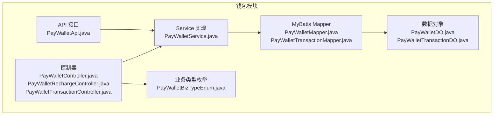
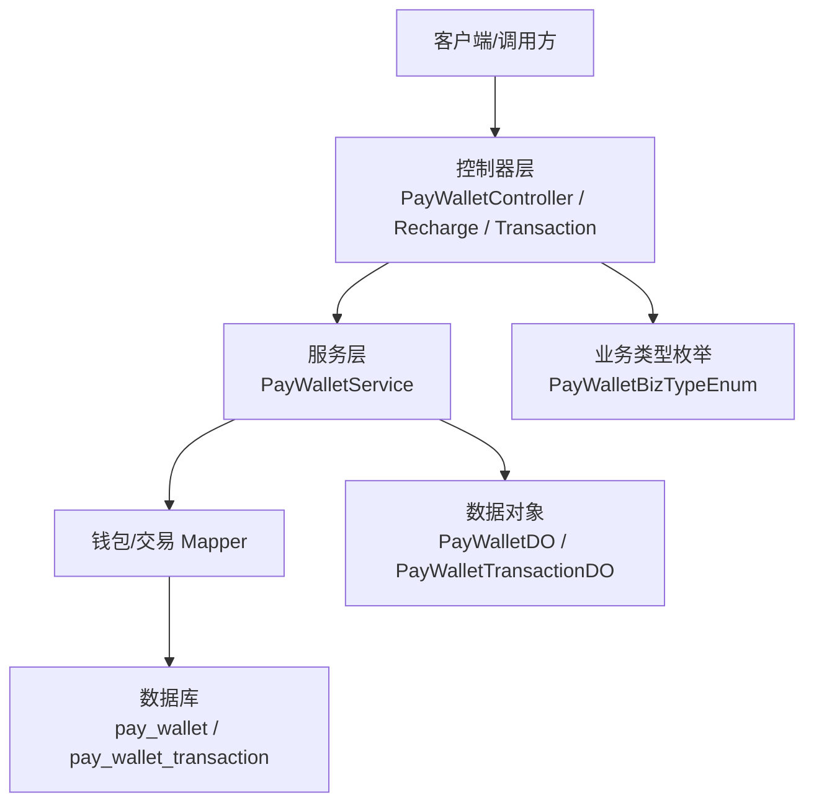
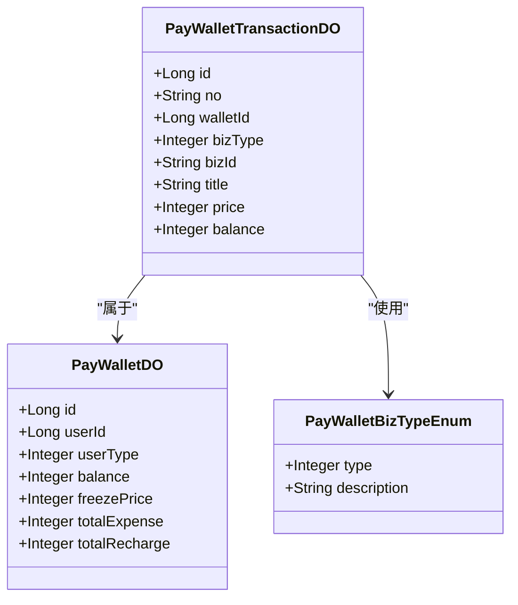
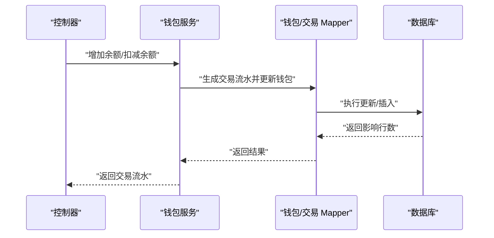
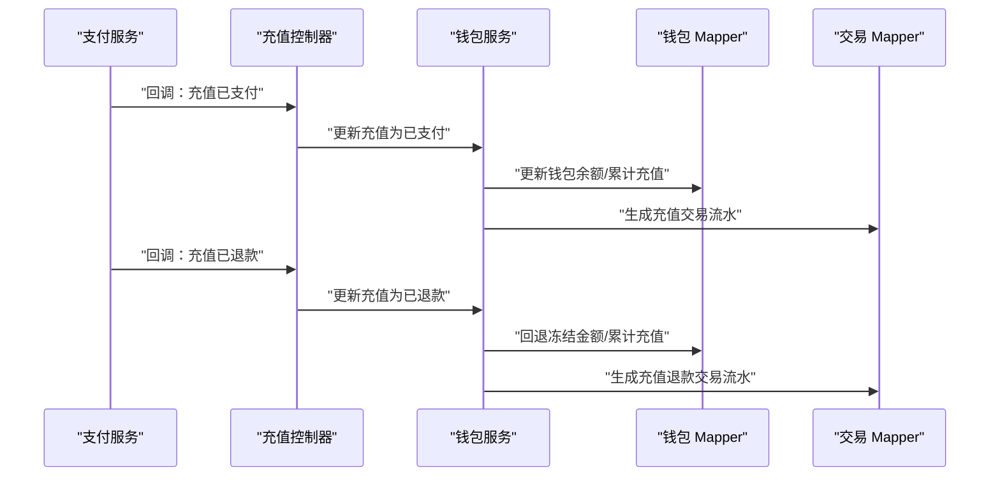
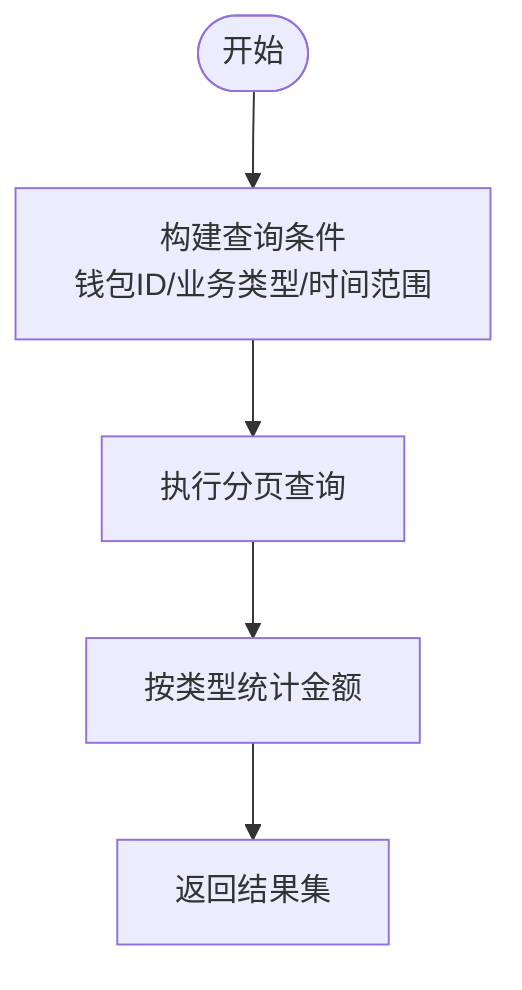
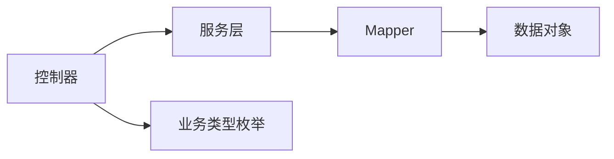

# 钱包管理

<cite>
**本文引用的文件**
- [PayWalletApi.java](file://yudao-module-pay/src/main/java/cn/iocoder/yudao/module/pay/api/wallet/PayWalletApi.java)
- [PayWalletService.java](file://yudao-module-pay/src/main/java/cn/iocoder/yudao/module/pay/service/wallet/PayWalletService.java)
- [PayWalletController.java](file://yudao-module-pay/src/main/java/cn/iocoder/yudao/module/pay/controller/admin/wallet/PayWalletController.java)
- [PayWalletRechargeController.java](file://yudao-module-pay/src/main/java/cn/iocoder/yudao/module/pay/controller/admin/wallet/PayWalletRechargeController.java)
- [PayWalletTransactionController.java](file://yudao-module-pay/src/main/java/cn/iocoder/yudao/module/pay/controller/admin/wallet/PayWalletTransactionController.java)
- [PayWalletDO.java](file://yudao-module-pay/src/main/java/cn/iocoder/yudao/module/pay/dal/dataobject/wallet/PayWalletDO.java)
- [PayWalletTransactionDO.java](file://yudao-module-pay/src/main/java/cn/iocoder/yudao/module/pay/dal/dataobject/wallet/PayWalletTransactionDO.java)
- [PayWalletBizTypeEnum.java](file://yudao-module-pay/src/main/java/cn/iocoder/yudao/module/pay/enums/wallet/PayWalletBizTypeEnum.java)
- [PayWalletMapper.java](file://yudao-module-pay/src/main/java/cn/iocoder/yudao/module/pay/dal/mysql/wallet/PayWalletMapper.java)
- [PayWalletTransactionMapper.java](file://yudao-module-pay/src/main/java/cn/iocoder/yudao/module/pay/dal/mysql/wallet/PayWalletTransactionMapper.java)
- [pay-2025-07-27.sql](file://sql/module/pay-2025-07-27.sql)
</cite>

## 目录
1. [简介](#简介)
2. [项目结构](#项目结构)
3. [核心组件](#核心组件)
4. [架构总览](#架构总览)
5. [详细组件分析](#详细组件分析)
6. [依赖分析](#依赖分析)
7. [性能考虑](#性能考虑)
8. [故障排查指南](#故障排查指南)
9. [结论](#结论)
10. [附录](#附录)

## 简介
本技术文档围绕“钱包管理”功能进行全面梳理，覆盖余额管理、充值处理、提现申请、交易明细、风控机制以及与CPS返利系统的集成方案。文档从系统架构、数据模型、业务流程到接口定义与实现要点逐层展开，并提供流程图与类图帮助读者快速理解与落地实施。

## 项目结构
钱包模块位于 yudao-module-pay 中，采用典型的分层架构：API 层负责对外暴露能力；Service 层承载核心业务；DAO 层封装数据库访问；Controller 层提供管理后台接口；枚举与数据对象定义业务域模型；SQL 文件提供表结构与初始化数据。

图表来源
- [PayWalletApi.java:1-30](file://yudao-module-pay/src/main/java/cn/iocoder/yudao/module/pay/api/wallet/PayWalletApi.java#L1-L30)
- [PayWalletService.java:1-100](file://yudao-module-pay/src/main/java/cn/iocoder/yudao/module/pay/service/wallet/PayWalletService.java#L1-L100)
- [PayWalletController.java:1-71](file://yudao-module-pay/src/main/java/cn/iocoder/yudao/module/pay/controller/admin/wallet/PayWalletController.java#L1-L71)
- [PayWalletRechargeController.java:1-60](file://yudao-module-pay/src/main/java/cn/iocoder/yudao/module/pay/controller/admin/wallet/PayWalletRechargeController.java#L1-L60)
- [PayWalletTransactionController.java:1-44](file://yudao-module-pay/src/main/java/cn/iocoder/yudao/module/pay/controller/admin/wallet/PayWalletTransactionController.java#L1-L44)
- [PayWalletBizTypeEnum.java:1-46](file://yudao-module-pay/src/main/java/cn/iocoder/yudao/module/pay/enums/wallet/PayWalletBizTypeEnum.java#L1-L46)
- [PayWalletDO.java:1-60](file://yudao-module-pay/src/main/java/cn/iocoder/yudao/module/pay/dal/dataobject/wallet/PayWalletDO.java#L1-L60)
- [PayWalletTransactionDO.java:1-67](file://yudao-module-pay/src/main/java/cn/iocoder/yudao/module/pay/dal/dataobject/wallet/PayWalletTransactionDO.java#L1-L67)
- [PayWalletMapper.java:1-135](file://yudao-module-pay/src/main/java/cn/iocoder/yudao/module/pay/dal/mysql/wallet/PayWalletMapper.java#L1-L135)
- [PayWalletTransactionMapper.java:1-68](file://yudao-module-pay/src/main/java/cn/iocoder/yudao/module/pay/dal/mysql/wallet/PayWalletTransactionMapper.java#L1-L68)

章节来源
- [PayWalletApi.java:1-30](file://yudao-module-pay/src/main/java/cn/iocoder/yudao/module/pay/api/wallet/PayWalletApi.java#L1-L30)
- [PayWalletService.java:1-100](file://yudao-module-pay/src/main/java/cn/iocoder/yudao/module/pay/service/wallet/PayWalletService.java#L1-L100)
- [PayWalletController.java:1-71](file://yudao-module-pay/src/main/java/cn/iocoder/yudao/module/pay/controller/admin/wallet/PayWalletController.java#L1-L71)
- [PayWalletRechargeController.java:1-60](file://yudao-module-pay/src/main/java/cn/iocoder/yudao/module/pay/controller/admin/wallet/PayWalletRechargeController.java#L1-L60)
- [PayWalletTransactionController.java:1-44](file://yudao-module-pay/src/main/java/cn/iocoder/yudao/module/pay/controller/admin/wallet/PayWalletTransactionController.java#L1-L44)
- [PayWalletBizTypeEnum.java:1-46](file://yudao-module-pay/src/main/java/cn/iocoder/yudao/module/pay/enums/wallet/PayWalletBizTypeEnum.java#L1-L46)
- [PayWalletDO.java:1-60](file://yudao-module-pay/src/main/java/cn/iocoder/yudao/module/pay/dal/dataobject/wallet/PayWalletDO.java#L1-L60)
- [PayWalletTransactionDO.java:1-67](file://yudao-module-pay/src/main/java/cn/iocoder/yudao/module/pay/dal/dataobject/wallet/PayWalletTransactionDO.java#L1-L67)
- [PayWalletMapper.java:1-135](file://yudao-module-pay/src/main/java/cn/iocoder/yudao/module/pay/dal/mysql/wallet/PayWalletMapper.java#L1-L135)
- [PayWalletTransactionMapper.java:1-68](file://yudao-module-pay/src/main/java/cn/iocoder/yudao/module/pay/dal/mysql/wallet/PayWalletTransactionMapper.java#L1-L68)

## 核心组件
- API 接口层：提供钱包余额增减与钱包查询能力，作为上层调用入口。
- Service 层：实现钱包余额变动、冻结/解冻、交易流水生成、订单支付与退款等核心业务。
- 控制器层：管理后台提供钱包查询、余额调整、充值状态更新与退款、交易明细分页查询。
- 数据对象与枚举：定义钱包账户、交易流水及业务类型，确保领域语义清晰。
- DAO 层：基于 MyBatis 封装钱包与交易流水的增删改查与条件统计。

章节来源
- [PayWalletApi.java:11-29](file://yudao-module-pay/src/main/java/cn/iocoder/yudao/module/pay/api/wallet/PayWalletApi.java#L11-L29)
- [PayWalletService.java:14-99](file://yudao-module-pay/src/main/java/cn/iocoder/yudao/module/pay/service/wallet/PayWalletService.java#L14-L99)
- [PayWalletController.java:32-70](file://yudao-module-pay/src/main/java/cn/iocoder/yudao/module/pay/controller/admin/wallet/PayWalletController.java#L32-L70)
- [PayWalletRechargeController.java:26-59](file://yudao-module-pay/src/main/java/cn/iocoder/yudao/module/pay/controller/admin/wallet/PayWalletRechargeController.java#L26-L59)
- [PayWalletTransactionController.java:24-43](file://yudao-module-pay/src/main/java/cn/iocoder/yudao/module/pay/controller/admin/wallet/PayWalletTransactionController.java#L24-L43)
- [PayWalletBizTypeEnum.java:14-45](file://yudao-module-pay/src/main/java/cn/iocoder/yudao/module/pay/enums/wallet/PayWalletBizTypeEnum.java#L14-L45)
- [PayWalletDO.java:15-59](file://yudao-module-pay/src/main/java/cn/iocoder/yudao/module/pay/dal/dataobject/wallet/PayWalletDO.java#L15-L59)
- [PayWalletTransactionDO.java:15-66](file://yudao-module-pay/src/main/java/cn/iocoder/yudao/module/pay/dal/dataobject/wallet/PayWalletTransactionDO.java#L15-L66)

## 架构总览
钱包系统遵循“接口-服务-持久层”的分层设计，控制器通过 Service 调用 DAO 完成数据库操作；业务类型通过枚举统一管理；充值与退款通过通知回调驱动状态变更。

图表来源
- [PayWalletController.java:32-70](file://yudao-module-pay/src/main/java/cn/iocoder/yudao/module/pay/controller/admin/wallet/PayWalletController.java#L32-L70)
- [PayWalletRechargeController.java:26-59](file://yudao-module-pay/src/main/java/cn/iocoder/yudao/module/pay/controller/admin/wallet/PayWalletRechargeController.java#L26-L59)
- [PayWalletTransactionController.java:24-43](file://yudao-module-pay/src/main/java/cn/iocoder/yudao/module/pay/controller/admin/wallet/PayWalletTransactionController.java#L24-L43)
- [PayWalletService.java:14-99](file://yudao-module-pay/src/main/java/cn/iocoder/yudao/module/pay/service/wallet/PayWalletService.java#L14-L99)
- [PayWalletBizTypeEnum.java:14-45](file://yudao-module-pay/src/main/java/cn/iocoder/yudao/module/pay/enums/wallet/PayWalletBizTypeEnum.java#L14-L45)
- [PayWalletDO.java:15-59](file://yudao-module-pay/src/main/java/cn/iocoder/yudao/module/pay/dal/dataobject/wallet/PayWalletDO.java#L15-L59)
- [PayWalletTransactionDO.java:15-66](file://yudao-module-pay/src/main/java/cn/iocoder/yudao/module/pay/dal/dataobject/wallet/PayWalletTransactionDO.java#L15-L66)
- [PayWalletMapper.java:13-135](file://yudao-module-pay/src/main/java/cn/iocoder/yudao/module/pay/dal/mysql/wallet/PayWalletMapper.java#L13-L135)
- [PayWalletTransactionMapper.java:24-68](file://yudao-module-pay/src/main/java/cn/iocoder/yudao/module/pay/dal/mysql/wallet/PayWalletTransactionMapper.java#L24-L68)

## 详细组件分析

### 钱包账户模型与关系
- 用户钱包（PayWalletDO）：包含用户标识、余额、冻结金额、累计充值与累计支出等字段，支持按用户与用户类型唯一化。
- 交易流水（PayWalletTransactionDO）：记录每次余额变动的流水号、业务类型、业务编号、金额与变动后余额，支持按时间范围与收支类型查询。
- 业务类型（PayWalletBizTypeEnum）：统一定义充值、充值退款、支付、支付退款、余额调整、转账等类型，便于扩展与一致性控制。

图表来源
- [PayWalletDO.java:15-59](file://yudao-module-pay/src/main/java/cn/iocoder/yudao/module/pay/dal/dataobject/wallet/PayWalletDO.java#L15-L59)
- [PayWalletTransactionDO.java:15-66](file://yudao-module-pay/src/main/java/cn/iocoder/yudao/module/pay/dal/dataobject/wallet/PayWalletTransactionDO.java#L15-L66)
- [PayWalletBizTypeEnum.java:14-45](file://yudao-module-pay/src/main/java/cn/iocoder/yudao/module/pay/enums/wallet/PayWalletBizTypeEnum.java#L14-L45)

章节来源
- [PayWalletDO.java:15-59](file://yudao-module-pay/src/main/java/cn/iocoder/yudao/module/pay/dal/dataobject/wallet/PayWalletDO.java#L15-L59)
- [PayWalletTransactionDO.java:15-66](file://yudao-module-pay/src/main/java/cn/iocoder/yudao/module/pay/dal/dataobject/wallet/PayWalletTransactionDO.java#L15-L66)
- [PayWalletBizTypeEnum.java:14-45](file://yudao-module-pay/src/main/java/cn/iocoder/yudao/module/pay/enums/wallet/PayWalletBizTypeEnum.java#L14-L45)

### 余额管理与交易流水
- 余额变动：通过 Service 提供的增加/扣减方法生成交易流水并更新钱包余额与累计值。
- 冻结/解冻：支持对部分余额进行冻结与解冻，冻结金额不参与可用余额计算。
- 交易明细：支持按钱包 ID、业务类型（收入/支出）、时间范围分页查询，并提供汇总统计。

图表来源
- [PayWalletService.java:68-81](file://yudao-module-pay/src/main/java/cn/iocoder/yudao/module/pay/service/wallet/PayWalletService.java#L68-L81)
- [PayWalletMapper.java:77-82](file://yudao-module-pay/src/main/java/cn/iocoder/yudao/module/pay/dal/mysql/wallet/PayWalletMapper.java#L77-L82)
- [PayWalletTransactionMapper.java:27-39](file://yudao-module-pay/src/main/java/cn/iocoder/yudao/module/pay/dal/mysql/wallet/PayWalletTransactionMapper.java#L27-L39)

章节来源
- [PayWalletService.java:68-81](file://yudao-module-pay/src/main/java/cn/iocoder/yudao/module/pay/service/wallet/PayWalletService.java#L68-L81)
- [PayWalletMapper.java:77-82](file://yudao-module-pay/src/main/java/cn/iocoder/yudao/module/pay/dal/mysql/wallet/PayWalletMapper.java#L77-L82)
- [PayWalletTransactionMapper.java:27-39](file://yudao-module-pay/src/main/java/cn/iocoder/yudao/module/pay/dal/mysql/wallet/PayWalletTransactionMapper.java#L27-L39)

### 充值处理流程
- 充值回调：通过管理后台充值控制器接收支付服务回调，更新充值状态为已充值。
- 发起退款：支持管理员发起充值退款，随后接收退款回调更新为已退款。
- 充值退款：当发生充值退款时，冻结金额与累计充值同步回退。

图表来源
- [PayWalletRechargeController.java:31-57](file://yudao-module-pay/src/main/java/cn/iocoder/yudao/module/pay/controller/admin/wallet/PayWalletRechargeController.java#L31-L57)
- [PayWalletMapper.java:63-68](file://yudao-module-pay/src/main/java/cn/iocoder/yudao/module/pay/dal/mysql/wallet/PayWalletMapper.java#L63-L68)
- [PayWalletMapper.java:120-127](file://yudao-module-pay/src/main/java/cn/iocoder/yudao/module/pay/dal/mysql/wallet/PayWalletMapper.java#L120-L127)

章节来源
- [PayWalletRechargeController.java:31-57](file://yudao-module-pay/src/main/java/cn/iocoder/yudao/module/pay/controller/admin/wallet/PayWalletRechargeController.java#L31-L57)
- [PayWalletMapper.java:63-68](file://yudao-module-pay/src/main/java/cn/iocoder/yudao/module/pay/dal/mysql/wallet/PayWalletMapper.java#L63-L68)
- [PayWalletMapper.java:120-127](file://yudao-module-pay/src/main/java/cn/iocoder/yudao/module/pay/dal/mysql/wallet/PayWalletMapper.java#L120-L127)

### 提现管理机制
- 提现申请：通过业务系统提交提现申请，生成提现单据并冻结相应余额。
- 审核与打款：人工审核通过后，执行解冻与实际打款，更新钱包余额与交易流水。
- 手续费与状态：可在业务类型中体现手续费扣除或在流水备注中记录，状态流转通过业务单据与回调完成。

说明：当前仓库未发现独立的“提现申请/审核/打款”控制器与服务实现，建议在业务单据模块中新增对应控制器与服务，并复用钱包余额冻结/解冻与交易流水能力。

章节来源
- [PayWalletService.java:89-97](file://yudao-module-pay/src/main/java/cn/iocoder/yudao/module/pay/service/wallet/PayWalletService.java#L89-L97)
- [PayWalletBizTypeEnum.java:18-23](file://yudao-module-pay/src/main/java/cn/iocoder/yudao/module/pay/enums/wallet/PayWalletBizTypeEnum.java#L18-L23)

### 交易明细与查询
- 收支类型筛选：支持仅查询收入（正向金额）或支出（负向金额）。
- 时间范围与分页：按钱包 ID 与时间范围查询，支持汇总统计。
- 业务维度：可通过业务编号与业务类型定位特定流水。

图表来源
- [PayWalletTransactionMapper.java:27-52](file://yudao-module-pay/src/main/java/cn/iocoder/yudao/module/pay/dal/mysql/wallet/PayWalletTransactionMapper.java#L27-L52)

章节来源
- [PayWalletTransactionController.java:34-41](file://yudao-module-pay/src/main/java/cn/iocoder/yudao/module/pay/controller/admin/wallet/PayWalletTransactionController.java#L34-L41)
- [PayWalletTransactionMapper.java:27-52](file://yudao-module-pay/src/main/java/cn/iocoder/yudao/module/pay/dal/mysql/wallet/PayWalletTransactionMapper.java#L27-L52)

### 风控机制与安全措施
- 可用余额校验：消费与冻结/解冻均采用“余额>=金额”的 CAS 条件，避免超扣。
- 交易类型约束：通过枚举统一业务类型，防止误用导致的余额错乱。
- 交易明细审计：每笔变动均生成流水，便于对账与追溯。
- 黑名单与限额：建议在业务单据模块中结合风控策略（如单日/单笔限额、IP/设备白名单）进行前置拦截与告警。

章节来源
- [PayWalletMapper.java:48-54](file://yudao-module-pay/src/main/java/cn/iocoder/yudao/module/pay/dal/mysql/wallet/PayWalletMapper.java#L48-L54)
- [PayWalletMapper.java:90-96](file://yudao-module-pay/src/main/java/cn/iocoder/yudao/module/pay/dal/mysql/wallet/PayWalletMapper.java#L90-L96)
- [PayWalletMapper.java:105-111](file://yudao-module-pay/src/main/java/cn/iocoder/yudao/module/pay/dal/mysql/wallet/PayWalletMapper.java#L105-L111)
- [PayWalletBizTypeEnum.java:14-45](file://yudao-module-pay/src/main/java/cn/iocoder/yudao/module/pay/enums/wallet/PayWalletBizTypeEnum.java#L14-L45)

### 与CPS返利系统的集成方案
- 返利入账：当返利订单确认后，调用钱包服务增加余额并生成“更新余额”类型的交易流水，bizId 指向返利单据 ID。
- 佣金结算：结算周期结束后，生成结算单据，冻结对应金额，打款完成后解冻并生成结算流水。
- 对账与报表：通过交易明细与统计接口，核对返利与结算数据，确保账实相符。

章节来源
- [PayWalletService.java:80-81](file://yudao-module-pay/src/main/java/cn/iocoder/yudao/module/pay/service/wallet/PayWalletService.java#L80-L81)
- [PayWalletBizTypeEnum.java:22-23](file://yudao-module-pay/src/main/java/cn/iocoder/yudao/module/pay/enums/wallet/PayWalletBizTypeEnum.java#L22-L23)

## 依赖分析
- 控制器依赖服务层，服务层依赖 Mapper 与数据对象。
- 业务类型枚举被控制器与服务层广泛使用，保证业务语义一致。
- Mapper 使用 MyBatis 的条件构造器与原生 SQL 片段，确保并发安全与性能。

图表来源
- [PayWalletController.java:32-70](file://yudao-module-pay/src/main/java/cn/iocoder/yudao/module/pay/controller/admin/wallet/PayWalletController.java#L32-L70)
- [PayWalletService.java:14-99](file://yudao-module-pay/src/main/java/cn/iocoder/yudao/module/pay/service/wallet/PayWalletService.java#L14-L99)
- [PayWalletBizTypeEnum.java:14-45](file://yudao-module-pay/src/main/java/cn/iocoder/yudao/module/pay/enums/wallet/PayWalletBizTypeEnum.java#L14-L45)
- [PayWalletMapper.java:13-135](file://yudao-module-pay/src/main/java/cn/iocoder/yudao/module/pay/dal/mysql/wallet/PayWalletMapper.java#L13-L135)

章节来源
- [PayWalletController.java:32-70](file://yudao-module-pay/src/main/java/cn/iocoder/yudao/module/pay/controller/admin/wallet/PayWalletController.java#L32-L70)
- [PayWalletService.java:14-99](file://yudao-module-pay/src/main/java/cn/iocoder/yudao/module/pay/service/wallet/PayWalletService.java#L14-L99)
- [PayWalletBizTypeEnum.java:14-45](file://yudao-module-pay/src/main/java/cn/iocoder/yudao/module/pay/enums/wallet/PayWalletBizTypeEnum.java#L14-L45)
- [PayWalletMapper.java:13-135](file://yudao-module-pay/src/main/java/cn/iocoder/yudao/module/pay/dal/mysql/wallet/PayWalletMapper.java#L13-L135)

## 性能考虑
- 并发安全：消费、充值、冻结/解冻均使用 CAS 条件（余额/冻结金额>=金额），避免超扣与超冻。
- 索引建议：钱包表按用户与用户类型组合索引，交易表按钱包 ID、创建时间、业务类型建立索引以优化查询。
- 分页与统计：交易明细分页查询与金额汇总应配合合适索引，避免全表扫描。
- 事务边界：余额与流水需在同一事务内提交，保证一致性。

章节来源
- [PayWalletMapper.java:48-54](file://yudao-module-pay/src/main/java/cn/iocoder/yudao/module/pay/dal/mysql/wallet/PayWalletMapper.java#L48-L54)
- [PayWalletMapper.java:63-68](file://yudao-module-pay/src/main/java/cn/iocoder/yudao/module/pay/dal/mysql/wallet/PayWalletMapper.java#L63-L68)
- [PayWalletMapper.java:90-96](file://yudao-module-pay/src/main/java/cn/iocoder/yudao/module/pay/dal/mysql/wallet/PayWalletMapper.java#L90-L96)
- [PayWalletMapper.java:105-111](file://yudao-module-pay/src/main/java/cn/iocoder/yudao/module/pay/dal/mysql/wallet/PayWalletMapper.java#L105-L111)
- [PayWalletTransactionMapper.java:27-52](file://yudao-module-pay/src/main/java/cn/iocoder/yudao/module/pay/dal/mysql/wallet/PayWalletTransactionMapper.java#L27-L52)

## 故障排查指南
- 余额不足：消费失败时检查钱包余额与冻结金额，确认是否存在并发扣款导致的不足。
- 冻结金额异常：核查冻结/解冻调用是否成对出现，以及 CAS 条件是否满足。
- 交易流水缺失：确认业务类型与流水生成逻辑，检查事务是否成功提交。
- 充值/退款状态不同步：核对回调地址与参数，确保回调幂等与顺序。

章节来源
- [PayWalletMapper.java:48-54](file://yudao-module-pay/src/main/java/cn/iocoder/yudao/module/pay/dal/mysql/wallet/PayWalletMapper.java#L48-L54)
- [PayWalletMapper.java:90-96](file://yudao-module-pay/src/main/java/cn/iocoder/yudao/module/pay/dal/mysql/wallet/PayWalletMapper.java#L90-L96)
- [PayWalletMapper.java:105-111](file://yudao-module-pay/src/main/java/cn/iocoder/yudao/module/pay/dal/mysql/wallet/PayWalletMapper.java#L105-L111)
- [PayWalletRechargeController.java:31-57](file://yudao-module-pay/src/main/java/cn/iocoder/yudao/module/pay/controller/admin/wallet/PayWalletRechargeController.java#L31-L57)

## 结论
钱包模块通过清晰的数据模型与严格的并发控制，实现了余额管理、交易流水、充值与退款的闭环。建议后续补充提现模块与CPS返利对接细节，并完善风控策略与报表统计，以支撑更复杂的业务场景。

## 附录
- 表结构参考：钱包表与交易流水表的建表脚本与字段定义可参考以下 SQL 文件。
  
章节来源
- [pay-2025-07-27.sql](file://sql/module/pay-2025-07-27.sql)