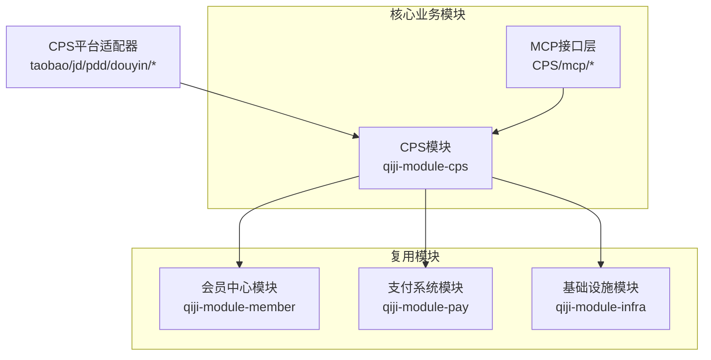
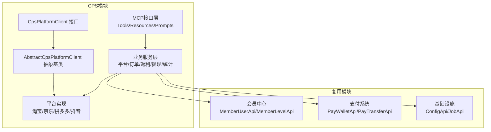
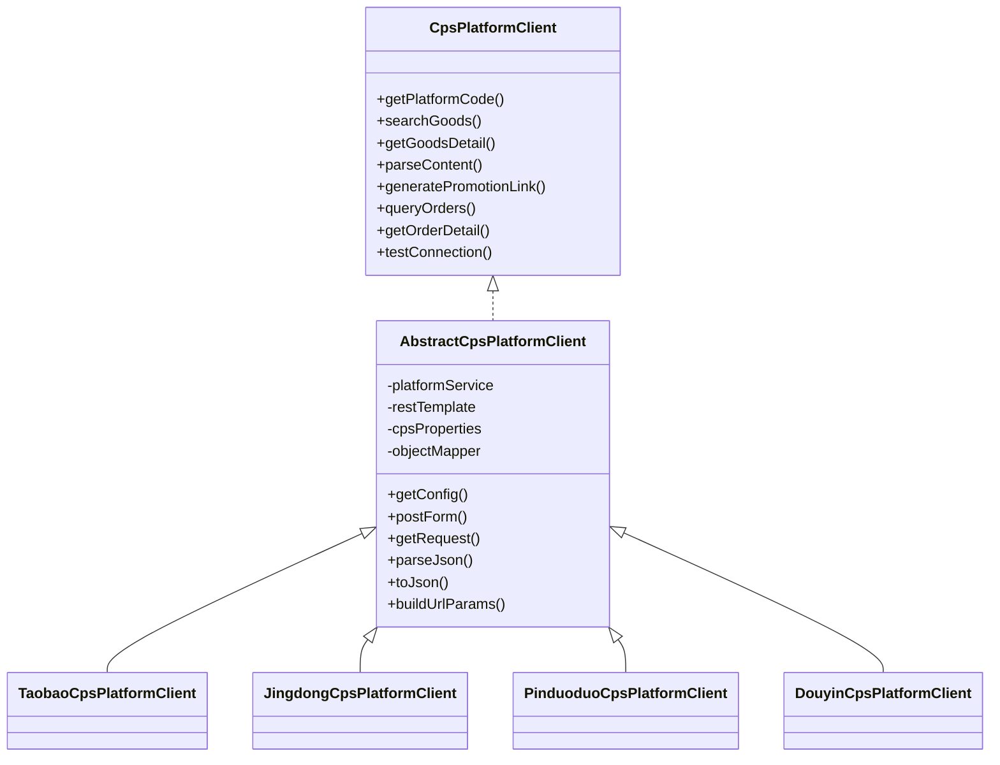
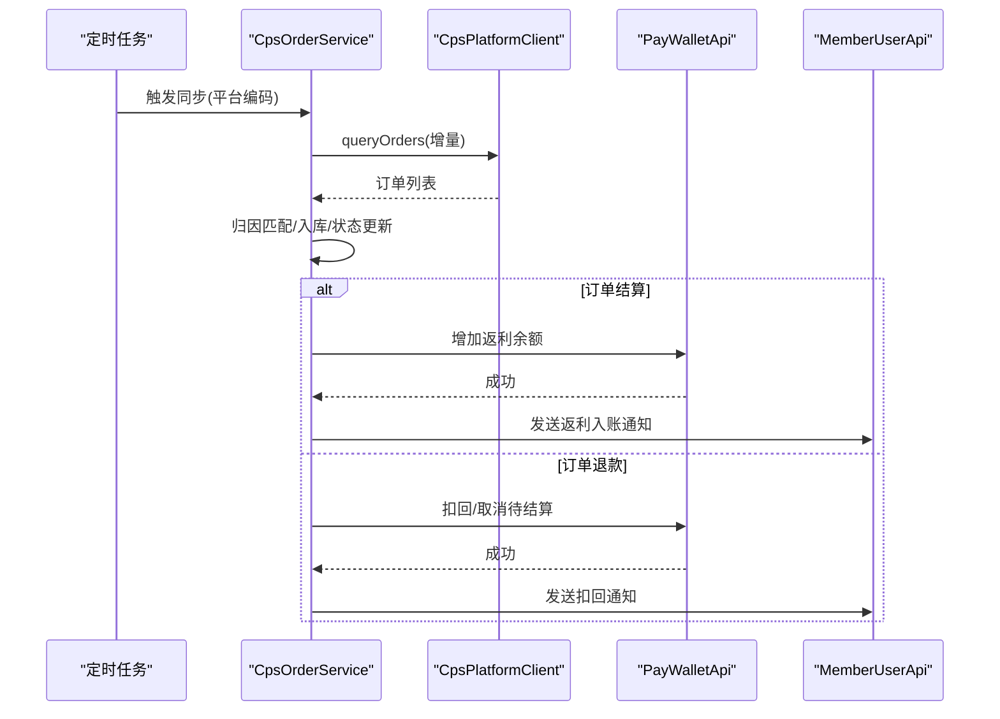
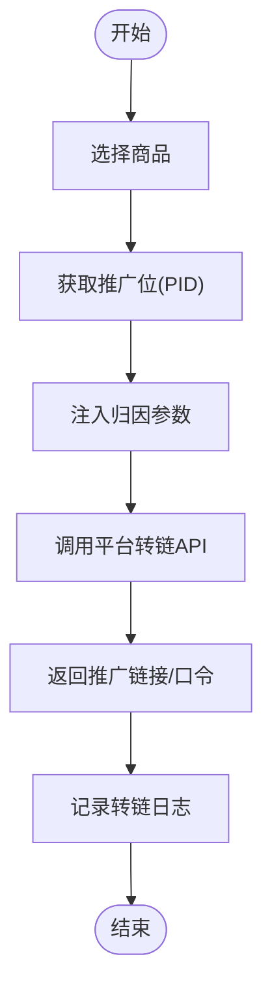
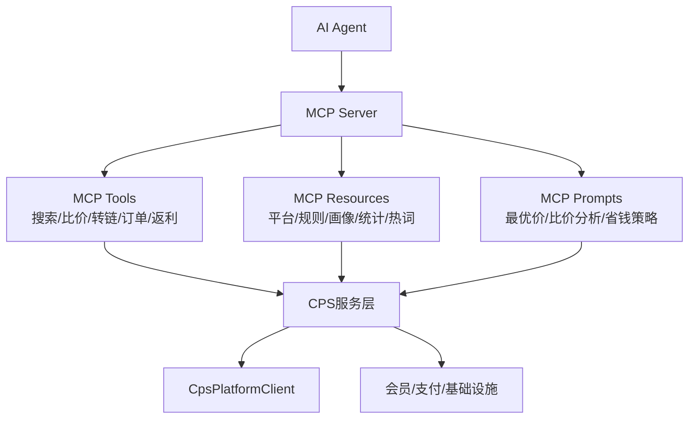
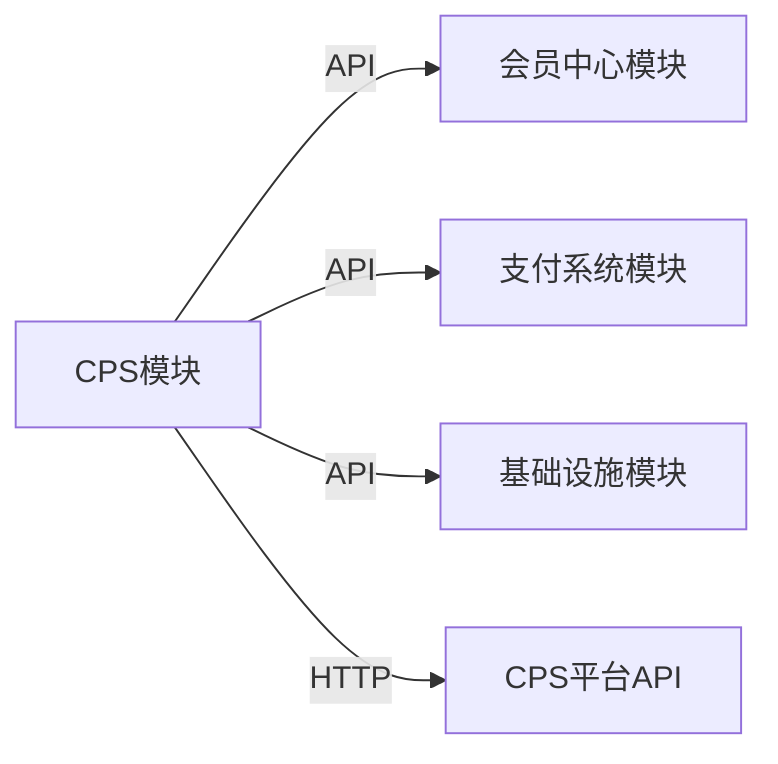

# 核心业务模块

<cite>
**本文引用的文件**
- [README.md](file://README.md)
- [CPS系统PRD文档.md](file://docs/CPS系统PRD文档.md)
- [CpsPlatformClient.java](file://qiji-module-cps/qiji-module-cps-biz/src/main/java/cn/zhijian/cps/client/CpsPlatformClient.java)
- [AbstractCpsPlatformClient.java](file://qiji-module-cps/qiji-module-cps-biz/src/main/java/cn/zhijian/cps/client/AbstractCpsPlatformClient.java)
- [CpsPlatformService.java](file://qiji-module-cps/qiji-module-cps-biz/src/main/java/cn/zhijian/cps/service/CpsPlatformService.java)
- [CpsOrderService.java](file://qiji-module-cps/qiji-module-cps-biz/src/main/java/cn/zhijian/cps/service/CpsOrderService.java)
- [DouyinCpsPlatformClient.java](file://qiji-module-cps/qiji-module-cps-biz/src/main/java/cn/zhijian/cps/client/DouyinCpsPlatformClient.java)
- [JingdongCpsPlatformClient.java](file://qiji-module-cps/qiji-module-cps-biz/src/main/java/cn/zhijian/cps/client/JingdongCpsPlatformClient.java)
- [PinduoduoCpsPlatformClient.java](file://qiji-module-cps/qiji-module-cps-biz/src/main/java/cn/zhijian/cps/client/PinduoduoCpsPlatformClient.java)
- [TaobaoCpsPlatformClient.java](file://qiji-module-cps/qiji-module-cps-biz/src/main/java/cn/zhijian/cps/client/TaobaoCpsPlatformClient.java)
- [MemberUserApi.java](file://qiji-module-member/src/main/java/com.qiji.cps/module/member/api/user/MemberUserApi.java)
- [MemberLevelApi.java](file://qiji-module-member/src/main/java/com.qiji.cps/module/member/api/level/MemberLevelApi.java)
- [PayWalletApi.java](file://qiji-module-pay/src/main/java/com.qiji.cps/module/pay/api/wallet/PayWalletApi.java)
- [PayTransferApi.java](file://qiji-module-pay/src/main/java/com.qiji.cps/module/pay/api/transfer/PayTransferApi.java)
- [InfraConfigApi.java](file://qiji-module-infra/src/main/java/com.qiji.cps/module/infra/api/config/ConfigApi.java)
- [InfraJobApi.java](file://qiji-module-infra/src/main/java/com.qiji.cps/module/infra/api/job/JobApi.java)
</cite>

## 目录
1. [引言](#引言)
2. [项目结构](#项目结构)
3. [核心组件](#核心组件)
4. [架构总览](#架构总览)
5. [详细组件分析](#详细组件分析)
6. [依赖分析](#依赖分析)
7. [性能考虑](#性能考虑)
8. [故障排查指南](#故障排查指南)
9. [结论](#结论)
10. [附录](#附录)

## 引言
本文件面向AgenticCPS系统的核心业务模块，围绕CPS联盟返利模块（核心业务）、系统管理模块、会员中心模块、基础设施模块、支付系统模块展开，系统性阐述模块职责、相互关系、数据交互模式与扩展机制。重点说明CPS模块的技术架构：多平台CPS接入（策略适配器模式）、商品搜索与比价、推广链接生成、订单全链路追踪、MCP AI接口层等，并给出模块化设计如何实现业务解耦与扩展、接口设计与数据格式规范，帮助开发者快速理解整体业务架构。

## 项目结构
AgenticCPS基于多模块架构，核心业务集中在qiji-module-cps，同时复用qiji-module-member（会员）、qiji-module-pay（支付）、qiji-module-infra（基础设施）等模块能力，形成“核心业务 + 复用模块”的清晰边界。

**图表来源**
- [README.md:196-233](file://README.md#L196-L233)

**章节来源**
- [README.md:196-233](file://README.md#L196-L233)

## 核心组件
- CPS平台适配层（策略模式）
  - 统一接口：CpsPlatformClient
  - 抽象基类：AbstractCpsPlatformClient（HTTP、签名、JSON工具）
  - 平台实现：淘宝、京东、拼多多、抖音等
- 业务服务层
  - 平台配置：CpsPlatformService
  - 订单管理：CpsOrderService
  - 返利配置与记录：CpsRebateConfigService、CpsRebateRecordService
  - 提现：CpsWithdrawService
  - 推广位：CpsAdzoneService
  - 统计：CpsStatisticsService
- 复用模块对接
  - 会员：MemberUserApi、MemberLevelApi
  - 支付：PayWalletApi、PayTransferApi
  - 基础设施：InfraConfigApi、InfraJobApi

**章节来源**
- [CpsPlatformClient.java:1-67](file://qiji-module-cps/qiji-module-cps-biz/src/main/java/cn/zhijian/cps/client/CpsPlatformClient.java#L1-L67)
- [AbstractCpsPlatformClient.java:1-144](file://qiji-module-cps/qiji-module-cps-biz/src/main/java/cn/zhijian/cps/client/AbstractCpsPlatformClient.java#L1-L144)
- [CpsPlatformService.java:1-28](file://qiji-module-cps/qiji-module-cps-biz/src/main/java/cn/zhijian/cps/service/CpsPlatformService.java#L1-L28)
- [CpsOrderService.java:1-21](file://qiji-module-cps/qiji-module-cps-biz/src/main/java/cn/zhijian/cps/service/CpsOrderService.java#L1-L21)

## 架构总览
CPS模块采用“策略适配器 + 服务编排”的架构，通过CpsPlatformClient抽象统一各平台差异，结合定时任务与外部平台API实现订单全链路追踪；通过复用会员与支付模块实现用户权益与资金流转；通过MCP接口层对外提供AI Agent可调用能力。

**图表来源**
- [CpsPlatformClient.java:1-67](file://qiji-module-cps/qiji-module-cps-biz/src/main/java/cn/zhijian/cps/client/CpsPlatformClient.java#L1-L67)
- [AbstractCpsPlatformClient.java:1-144](file://qiji-module-cps/qiji-module-cps-biz/src/main/java/cn/zhijian/cps/client/AbstractCpsPlatformClient.java#L1-L144)
- [TaobaoCpsPlatformClient.java](file://qiji-module-cps/qiji-module-cps-biz/src/main/java/cn/zhijian/cps/client/TaobaoCpsPlatformClient.java)
- [JingdongCpsPlatformClient.java](file://qiji-module-cps/qiji-module-cps-biz/src/main/java/cn/zhijian/cps/client/JingdongCpsPlatformClient.java)
- [PinduoduoCpsPlatformClient.java](file://qiji-module-cps/qiji-module-cps-biz/src/main/java/cn/zhijian/cps/client/PinduoduoCpsPlatformClient.java)
- [DouyinCpsPlatformClient.java](file://qiji-module-cps/qiji-module-cps-biz/src/main/java/cn/zhijian/cps/client/DouyinCpsPlatformClient.java)
- [MemberUserApi.java](file://qiji-module-member/src/main/java/com.qiji.cps/module/member/api/user/MemberUserApi.java)
- [MemberLevelApi.java](file://qiji-module-member/src/main/java/com.qiji.cps/module/member/api/level/MemberLevelApi.java)
- [PayWalletApi.java](file://qiji-module-pay/src/main/java/com.qiji.cps/module/pay/api/wallet/PayWalletApi.java)
- [PayTransferApi.java](file://qiji-module-pay/src/main/java/com.qiji.cps/module/pay/api/transfer/PayTransferApi.java)
- [InfraConfigApi.java](file://qiji-module-infra/src/main/java/com.qiji.cps/module/infra/api/config/ConfigApi.java)
- [InfraJobApi.java](file://qiji-module-infra/src/main/java/com.qiji.cps/module/infra/api/job/JobApi.java)

## 详细组件分析

### 组件A：CPS平台适配器（策略模式）
- 设计要点
  - 统一接口CpsPlatformClient定义平台能力：搜索、详情、解析、转链、订单查询等
  - 抽象基类AbstractCpsPlatformClient封装HTTP调用、参数构造、JSON解析、签名工具等通用逻辑
  - 各平台客户端（淘宝/京东/拼多多/抖音）实现具体差异
- 扩展机制
  - 新增平台只需实现CpsPlatformClient或继承AbstractCpsPlatformClient，注册到工厂/路由即可
- 依赖关系
  - 依赖CpsPlatformService获取平台配置
  - 依赖RestTemplate进行HTTP调用
  - 依赖CpsProperties读取全局配置

**图表来源**
- [CpsPlatformClient.java:1-67](file://qiji-module-cps/qiji-module-cps-biz/src/main/java/cn/zhijian/cps/client/CpsPlatformClient.java#L1-L67)
- [AbstractCpsPlatformClient.java:1-144](file://qiji-module-cps/qiji-module-cps-biz/src/main/java/cn/zhijian/cps/client/AbstractCpsPlatformClient.java#L1-L144)
- [TaobaoCpsPlatformClient.java](file://qiji-module-cps/qiji-module-cps-biz/src/main/java/cn/zhijian/cps/client/TaobaoCpsPlatformClient.java)
- [JingdongCpsPlatformClient.java](file://qiji-module-cps/qiji-module-cps-biz/src/main/java/cn/zhijian/cps/client/JingdongCpsPlatformClient.java)
- [PinduoduoCpsPlatformClient.java](file://qiji-module-cps/qiji-module-cps-biz/src/main/java/cn/zhijian/cps/client/PinduoduoCpsPlatformClient.java)
- [DouyinCpsPlatformClient.java](file://qiji-module-cps/qiji-module-cps-biz/src/main/java/cn/zhijian/cps/client/DouyinCpsPlatformClient.java)

**章节来源**
- [CpsPlatformClient.java:1-67](file://qiji-module-cps/qiji-module-cps-biz/src/main/java/cn/zhijian/cps/client/CpsPlatformClient.java#L1-L67)
- [AbstractCpsPlatformClient.java:1-144](file://qiji-module-cps/qiji-module-cps-biz/src/main/java/cn/zhijian/cps/client/AbstractCpsPlatformClient.java#L1-L144)

### 组件B：订单全链路追踪（定时同步与结算）
- 流程要点
  - 定时任务（每5分钟）遍历启用平台，增量查询订单
  - 解析订单、匹配会员、入库
  - 订单状态变更（结算/退款）触发返利结算/扣回
  - 调用支付模块钱包服务增加余额并通知会员
- 关键接口
  - CpsOrderService：订单查询、分页、同步
  - 复用PayWalletApi：钱包余额变动
  - 复用InfraJobApi：定时任务编排

**图表来源**
- [CpsOrderService.java:1-21](file://qiji-module-cps/qiji-module-cps-biz/src/main/java/cn/zhijian/cps/service/CpsOrderService.java#L1-L21)
- [CpsPlatformClient.java:1-67](file://qiji-module-cps/qiji-module-cps-biz/src/main/java/cn/zhijian/cps/client/CpsPlatformClient.java#L1-L67)
- [PayWalletApi.java](file://qiji-module-pay/src/main/java/com.qiji.cps/module/pay/api/wallet/PayWalletApi.java)
- [MemberUserApi.java](file://qiji-module-member/src/main/java/com.qiji.cps/module/member/api/user/MemberUserApi.java)

**章节来源**
- [CpsOrderService.java:1-21](file://qiji-module-cps/qiji-module-cps-biz/src/main/java/cn/zhijian/cps/service/CpsOrderService.java#L1-L21)
- [CPS系统PRD文档.md:183-223](file://docs/CPS系统PRD文档.md#L183-L223)

### 组件C：推广链接生成与归因
- 流程要点
  - 会员选择商品，获取推广位（PID）
  - 注入平台归因参数（淘宝adzone_id/external_info、京东subUnionId、拼多多custom_parameters等）
  - 调用平台转链API，返回推广链接/口令
  - 记录转链日志
- 关键接口
  - CpsPlatformClient.generatePromotionLink
  - 复用MemberLevelApi：会员等级影响返利展示

**图表来源**
- [CpsPlatformClient.java:1-67](file://qiji-module-cps/qiji-module-cps-biz/src/main/java/cn/zhijian/cps/client/CpsPlatformClient.java#L1-L67)
- [MemberLevelApi.java](file://qiji-module-member/src/main/java/com.qiji.cps/module/member/api/level/MemberLevelApi.java)

**章节来源**
- [CPS系统PRD文档.md:152-181](file://docs/CPS系统PRD文档.md#L152-L181)

### 组件D：MCP AI接口层
- 设计要点
  - 基于MCP协议提供AI Agent可调用工具（搜索/比价/转链/订单/返利）
  - 支持HTTP/STDIO两种传输方式
  - 提供Prompt、Resource、Tool等能力
- 与核心模块的协作
  - 通过CPS服务编排调用平台适配器与业务服务
  - 复用会员与支付模块能力

**图表来源**
- [README.md:271-291](file://README.md#L271-L291)

**章节来源**
- [README.md:271-291](file://README.md#L271-L291)

## 依赖分析
- 模块内聚与耦合
  - CPS模块内部通过CpsPlatformClient实现与平台的低耦合，平台差异由具体实现类承载
  - 业务服务层通过API接口与复用模块解耦，避免直接依赖第三方SDK
- 外部依赖
  - 平台API：通过RestTemplate与HTTP调用
  - 会员/支付：通过远程API接口调用
  - 基础设施：通过配置与定时任务接口

**图表来源**
- [MemberUserApi.java](file://qiji-module-member/src/main/java/com.qiji.cps/module/member/api/user/MemberUserApi.java)
- [PayWalletApi.java](file://qiji-module-pay/src/main/java/com.qiji.cps/module/pay/api/wallet/PayWalletApi.java)
- [InfraConfigApi.java](file://qiji-module-infra/src/main/java/com.qiji.cps/module/infra/api/config/ConfigApi.java)
- [InfraJobApi.java](file://qiji-module-infra/src/main/java/com.qiji.cps/module/infra/api/job/JobApi.java)

**章节来源**
- [MemberUserApi.java](file://qiji-module-member/src/main/java/com.qiji.cps/module/member/api/user/MemberUserApi.java)
- [PayWalletApi.java](file://qiji-module-pay/src/main/java/com.qiji.cps/module/pay/api/wallet/PayWalletApi.java)
- [InfraConfigApi.java](file://qiji-module-infra/src/main/java/com.qiji.cps/module/infra/api/config/ConfigApi.java)
- [InfraJobApi.java](file://qiji-module-infra/src/main/java/com.qiji.cps/module/infra/api/job/JobApi.java)

## 性能考虑
- 搜索与比价
  - 多平台并发查询，P99单平台搜索<2秒，多平台比价<5秒
- 订单同步
  - 定时任务每5分钟增量同步，订单同步延迟<30分钟
- 返利入账
  - 平台结算后24小时内入账
- 转链生成
  - 单次转链<1秒

**章节来源**
- [README.md:306-315](file://README.md#L306-L315)

## 故障排查指南
- 平台连通性
  - 使用CpsPlatformService.testConnection进行连通性测试
- 订单同步异常
  - 检查定时任务状态与平台返回状态码
  - 核对订单增量时间窗口与平台API限制
- 返利结算/扣回异常
  - 核对订单状态变更与钱包余额变动日志
  - 检查会员等级与返利配置优先级
- 提现异常
  - 核对提现规则、余额与转账接口返回
  - 检查风控与黑名单状态

**章节来源**
- [CpsPlatformService.java:25](file://qiji-module-cps/qiji-module-cps-biz/src/main/java/cn/zhijian/cps/service/CpsPlatformService.java#L25)
- [CPS系统PRD文档.md:225-261](file://docs/CPS系统PRD文档.md#L225-L261)

## 结论
AgenticCPS通过模块化设计与策略适配器模式，实现了多平台CPS接入的高扩展性；通过定时任务与平台API的协同，完成了从商品查询到返利入账的全链路闭环；通过MCP接口层，为AI Agent提供了标准化的可调用能力。模块间通过API解耦、复用现有会员与支付能力，既保证了业务的灵活性，也为后续扩展与演进奠定了坚实基础。

## 附录
- 接口概览（会员端/管理端/MCP）
  - 会员端：商品搜索、比价、详情、推荐、链接生成、订单与返利、提现
  - 管理端：平台配置、推广位、订单管理、返利配置、提现审核、统计看板、MCP管理
  - MCP：Tools（搜索/比价/转链/订单/返利）、Resources（平台/规则/画像/统计/热词）、Prompts（最优价/比价分析/省钱策略）

**章节来源**
- [README.md:235-269](file://README.md#L235-L269)
- [README.md:271-291](file://README.md#L271-L291)