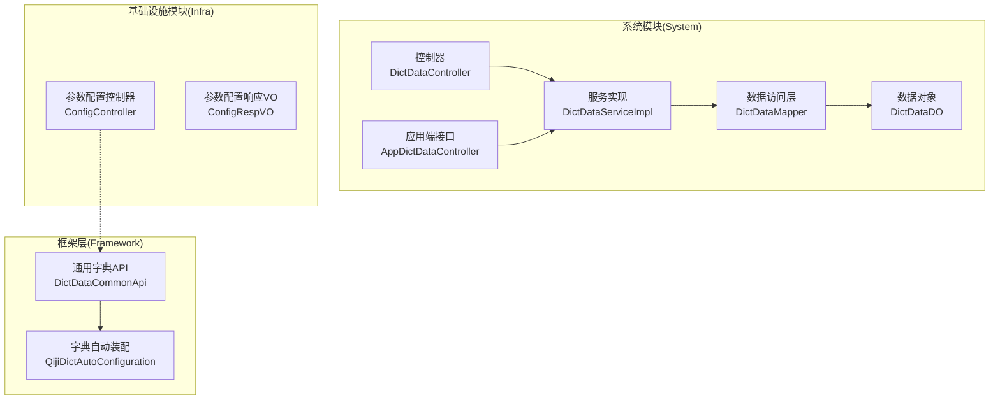
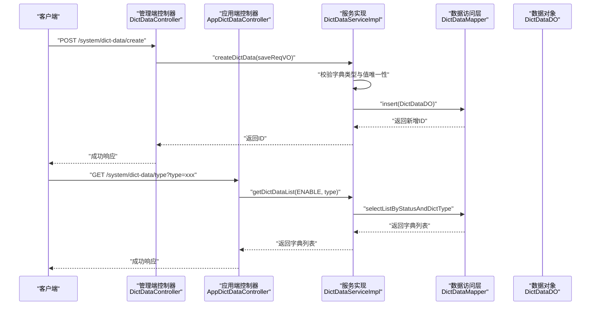
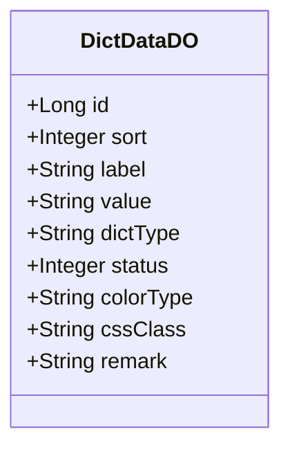
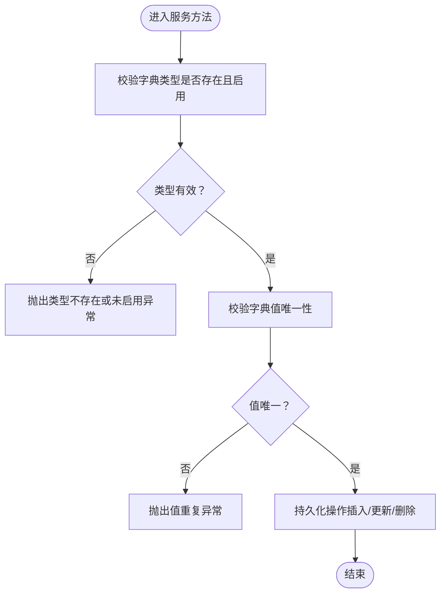
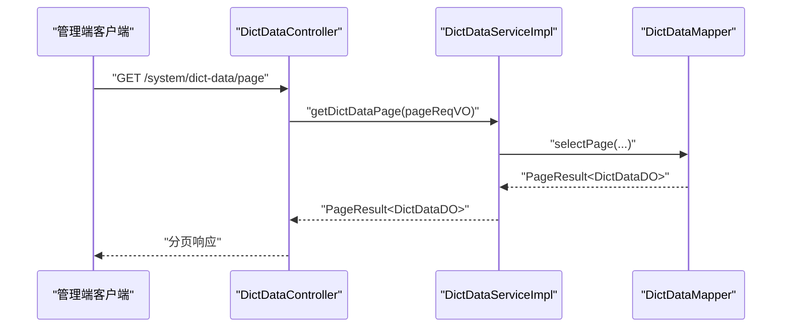
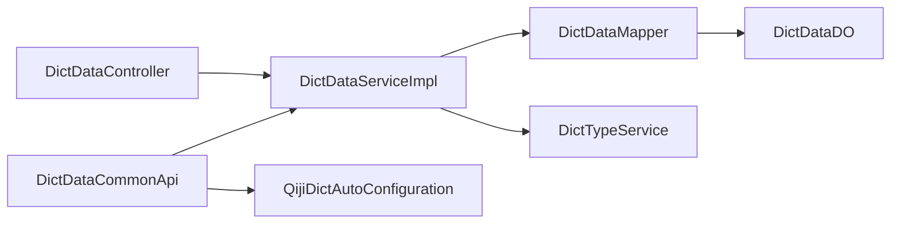

# 字典配置管理

<cite>
**本文引用的文件**
- [DictTypeConstants.java](file://qiji-module-system/src/main/java/com.qiji.cps/module/system/enums/DictTypeConstants.java)
- [DictDataDO.java](file://qiji-module-system/src/main/java/com.qiji.cps/module/system/dal/dataobject/DictDataDO.java)
- [DictDataMapper.java](file://qiji-module-system/src/main/java/com.qiji.cps/module/system/dal/mysql/DictDataMapper.java)
- [DictDataServiceImpl.java](file://qiji-module-system/src/main/java/com.qiji.cps/module/system/service/dict/DictDataServiceImpl.java)
- [DictDataController.java](file://qiji-module-system/src/main/java/com.qiji.cps/module/system/controller/admin/dict/DictDataController.java)
- [DictDataSaveReqVO.java](file://qiji-module-system/src/main/java/com.qiji.cps/module/system/controller/admin/dict/vo/data/DictDataSaveReqVO.java)
- [DictDataPageReqVO.java](file://qiji-module-system/src/main/java/com.qiji.cps/module/system/controller/admin/dict/vo/data/DictDataPageReqVO.java)
- [DictDataRespVO.java](file://qiji-module-system/src/main/java/com.qiji.cps/module/system/controller/admin/dict/vo/data/DictDataRespVO.java)
- [DictDataSimpleRespVO.java](file://qiji-module-system/src/main/java/com.qiji.cps/module/system/controller/admin/dict/vo/data/DictDataSimpleRespVO.java)
- [AppDictDataController.java](file://qiji-module-system/src/main/java/com.qiji.cps/module/system/controller/app/dict/AppDictDataController.java)
- [AppDictDataRespVO.java](file://qiji-module-system/src/main/java/com.qiji.cps/module/system/controller/app/dict/vo/AppDictDataRespVO.java)
- [DictDataCommonApi.java](file://qiji-framework/qiji-common/src/main/java/com.qiji.cps/framework/common/biz/system/dict/DictDataCommonApi.java)
- [QijiDictAutoConfiguration.java](file://qiji-framework/qiji-spring-boot-starter-excel/src/main/java/com.qiji.cps/framework/dict/config/QijiDictAutoConfiguration.java)
- [ruoyi-vue-pro.sql](file://sql/mysql/ruoyi-vue-pro.sql)
- [ConfigController.java](file://qiji-module-infra/src/main/java/com.qiji.cps/module/infra/controller/admin/config/ConfigController.java)
- [ConfigRespVO.java](file://qiji-module-infra/src/main/java/com.qiji.cps/module/infra/controller/admin/config/vo/ConfigRespVO.java)
</cite>

## 目录
1. [简介](#简介)
2. [项目结构](#项目结构)
3. [核心组件](#核心组件)
4. [架构总览](#架构总览)
5. [详细组件分析](#详细组件分析)
6. [依赖关系分析](#依赖关系分析)
7. [性能考量](#性能考量)
8. [故障排查指南](#故障排查指南)
9. [结论](#结论)
10. [附录](#附录)

## 简介
本技术文档围绕“字典配置管理”主题，系统化梳理系统参数配置与字典数据管理的实现方式，涵盖以下关键能力：
- 字典类型与字典数据的定义、维护与查询
- 字典数据的增删改查、状态管理、排序控制
- 系统参数配置的分类与字段说明
- 字典与配置的缓存策略、热更新与一致性保障
- 完整的 API 接口清单与使用示例
- 在业务系统中的应用场景与最佳实践
- 安全与版本控制建议

## 项目结构
字典配置管理主要分布在 system 模块（字典数据与类型）、infra 模块（参数配置）、以及 framework 层（字典公共能力与自动装配）。下图展示了与字典配置相关的核心模块与文件：

图表来源
- [DictDataController.java:1-114](file://qiji-module-system/src/main/java/com.qiji.cps/module/system/controller/admin/dict/DictDataController.java#L1-L114)
- [DictDataServiceImpl.java:1-185](file://qiji-module-system/src/main/java/com.qiji.cps/module/system/service/dict/DictDataServiceImpl.java#L1-L185)
- [DictDataMapper.java:1-50](file://qiji-module-system/src/main/java/com.qiji.cps/module/system/dal/mysql/DictDataMapper.java#L1-L50)
- [DictDataDO.java:1-68](file://qiji-module-system/src/main/java/com.qiji.cps/module/system/dal/dataobject/DictDataDO.java#L1-L68)
- [AppDictDataController.java:1-43](file://qiji-module-system/src/main/java/com.qiji.cps/module/system/controller/app/dict/AppDictDataController.java#L1-L43)
- [DictDataCommonApi.java:1-22](file://qiji-framework/qiji-common/src/main/java/com.qiji.cps/framework/common/biz/system/dict/DictDataCommonApi.java#L1-L22)
- [QijiDictAutoConfiguration.java:1-18](file://qiji-framework/qiji-spring-boot-starter-excel/src/main/java/com.qiji.cps/framework/dict/config/QijiDictAutoConfiguration.java#L1-L18)
- [ConfigController.java](file://qiji-module-infra/src/main/java/com.qiji.cps/module/infra/controller/admin/config/ConfigController.java)
- [ConfigRespVO.java:1-33](file://qiji-module-infra/src/main/java/com.qiji.cps/module/infra/controller/admin/config/vo/ConfigRespVO.java#L1-L33)

章节来源
- [DictDataController.java:1-114](file://qiji-module-system/src/main/java/com.qiji.cps/module/system/controller/admin/dict/DictDataController.java#L1-L114)
- [DictDataServiceImpl.java:1-185](file://qiji-module-system/src/main/java/com.qiji.cps/module/system/service/dict/DictDataServiceImpl.java#L1-L185)
- [DictDataMapper.java:1-50](file://qiji-module-system/src/main/java/com.qiji.cps/module/system/dal/mysql/DictDataMapper.java#L1-L50)
- [DictDataDO.java:1-68](file://qiji-module-system/src/main/java/com.qiji.cps/module/system/dal/dataobject/DictDataDO.java#L1-L68)
- [AppDictDataController.java:1-43](file://qiji-module-system/src/main/java/com.qiji.cps/module/system/controller/app/dict/AppDictDataController.java#L1-L43)
- [DictDataCommonApi.java:1-22](file://qiji-framework/qiji-common/src/main/java/com.qiji.cps/framework/common/biz/system/dict/DictDataCommonApi.java#L1-L22)
- [QijiDictAutoConfiguration.java:1-18](file://qiji-framework/qiji-spring-boot-starter-excel/src/main/java/com.qiji.cps/framework/dict/config/QijiDictAutoConfiguration.java#L1-L18)
- [ConfigController.java](file://qiji-module-infra/src/main/java/com.qiji.cps/module/infra/controller/admin/config/ConfigController.java)
- [ConfigRespVO.java:1-33](file://qiji-module-infra/src/main/java/com.qiji.cps/module/infra/controller/admin/config/vo/ConfigRespVO.java#L1-L33)

## 核心组件
- 字典数据模型：包含字典标签、字典值、字典类型、排序、状态、颜色类型、CSS 样式、备注等字段，支持按类型与状态过滤与排序。
- 字典服务实现：提供字典数据的增删改查、唯一性校验、启用状态校验、批量删除、按类型统计、解析字典等能力。
- 字典控制器：提供管理端的新增、修改、删除、分页、导出、简单列表等接口；提供应用端按类型查询字典数据的接口。
- 应用端字典接口：面向移动端或前端应用，提供按类型查询启用状态字典数据的能力。
- 框架层字典能力：通过通用 API 与自动装配，为上层模块提供统一的字典数据访问入口。

章节来源
- [DictDataDO.java:1-68](file://qiji-module-system/src/main/java/com.qiji.cps/module/system/dal/dataobject/DictDataDO.java#L1-L68)
- [DictDataServiceImpl.java:1-185](file://qiji-module-system/src/main/java/com.qiji.cps/module/system/service/dict/DictDataServiceImpl.java#L1-L185)
- [DictDataController.java:1-114](file://qiji-module-system/src/main/java/com.qiji.cps/module/system/controller/admin/dict/DictDataController.java#L1-L114)
- [AppDictDataController.java:1-43](file://qiji-module-system/src/main/java/com.qiji.cps/module/system/controller/app/dict/AppDictDataController.java#L1-L43)
- [DictDataCommonApi.java:1-22](file://qiji-framework/qiji-common/src/main/java/com.qiji.cps/framework/common/biz/system/dict/DictDataCommonApi.java#L1-L22)
- [QijiDictAutoConfiguration.java:1-18](file://qiji-framework/qiji-spring-boot-starter-excel/src/main/java/com.qiji.cps/framework/dict/config/QijiDictAutoConfiguration.java#L1-L18)

## 架构总览
系统采用分层架构，控制器负责对外暴露 API，服务层封装业务逻辑，数据访问层负责数据库交互，框架层提供通用能力与自动装配。

图表来源
- [DictDataController.java:41-47](file://qiji-module-system/src/main/java/com.qiji.cps/module/system/controller/admin/dict/DictDataController.java#L41-L47)
- [DictDataServiceImpl.java:66-76](file://qiji-module-system/src/main/java/com.qiji.cps/module/system/service/dict/DictDataServiceImpl.java#L66-L76)
- [DictDataMapper.java:43-47](file://qiji-module-system/src/main/java/com.qiji.cps/module/system/dal/mysql/DictDataMapper.java#L43-L47)
- [AppDictDataController.java:37-41](file://qiji-module-system/src/main/java/com.qiji.cps/module/system/controller/app/dict/AppDictDataController.java#L37-L41)

## 详细组件分析

### 字典数据模型与字段说明
- 字段设计覆盖标签、值、类型、排序、状态、颜色类型、CSS 样式、备注等，满足前端展示与业务校验需求。
- 支持按类型与状态进行过滤与排序，确保查询效率与展示一致性。

图表来源
- [DictDataDO.java:20-66](file://qiji-module-system/src/main/java/com.qiji.cps/module/system/dal/dataobject/DictDataDO.java#L20-L66)

章节来源
- [DictDataDO.java:1-68](file://qiji-module-system/src/main/java/com.qiji.cps/module/system/dal/dataobject/DictDataDO.java#L1-L68)

### 字典服务实现与校验逻辑
- 增删改查：提供创建、更新、删除、批量删除、分页、计数、按类型查询等方法。
- 校验逻辑：创建/更新前校验字典类型是否存在且启用、字典值唯一性；查询时支持按类型与值解析字典。
- 排序与比较：按类型与排序字段进行稳定排序，保证展示顺序一致。

图表来源
- [DictDataServiceImpl.java:66-90](file://qiji-module-system/src/main/java/com.qiji.cps/module/system/service/dict/DictDataServiceImpl.java#L66-L90)
- [DictDataServiceImpl.java:111-146](file://qiji-module-system/src/main/java/com.qiji.cps/module/system/service/dict/DictDataServiceImpl.java#L111-L146)

章节来源
- [DictDataServiceImpl.java:1-185](file://qiji-module-system/src/main/java/com.qiji.cps/module/system/service/dict/DictDataServiceImpl.java#L1-L185)

### 管理端控制器与应用端控制器
- 管理端控制器：提供新增、修改、删除、批量删除、分页查询、详情查询、导出 Excel、获取全部启用字典等接口。
- 应用端控制器：提供按类型查询启用字典数据的接口，便于前端与移动端直接消费。

图表来源
- [DictDataController.java:84-90](file://qiji-module-system/src/main/java/com.qiji.cps/module/system/controller/admin/dict/DictDataController.java#L84-L90)
- [DictDataMapper.java:35-41](file://qiji-module-system/src/main/java/com.qiji.cps/module/system/dal/mysql/DictDataMapper.java#L35-L41)

章节来源
- [DictDataController.java:1-114](file://qiji-module-system/src/main/java/com.qiji.cps/module/system/controller/admin/dict/DictDataController.java#L1-L114)
- [AppDictDataController.java:1-43](file://qiji-module-system/src/main/java/com.qiji.cps/module/system/controller/app/dict/AppDictDataController.java#L1-L43)

### 字典类型常量与枚举
- 系统模块提供字典类型常量接口，集中管理常用字典类型，便于跨模块复用与统一维护。

章节来源
- [DictTypeConstants.java:1-27](file://qiji-module-system/src/main/java/com.qiji.cps/module/system/enums/DictTypeConstants.java#L1-L27)

### 框架层字典能力与自动装配
- 通过通用字典 API 与自动装配，为上层模块提供统一的字典数据访问入口，简化集成成本。

章节来源
- [DictDataCommonApi.java:1-22](file://qiji-framework/qiji-common/src/main/java/com.qiji.cps/framework/common/biz/system/dict/DictDataCommonApi.java#L1-L22)
- [QijiDictAutoConfiguration.java:1-18](file://qiji-framework/qiji-spring-boot-starter-excel/src/main/java/com.qiji.cps/framework/dict/config/QijiDictAutoConfiguration.java#L1-L18)

### 系统参数配置（Infra 模块）
- 参数配置控制器与响应 VO 提供参数分类、名称、键名、键值、备注等字段，支持参数的增删改查与导出。
- 参数配置与字典配置在概念上类似，均属于“运行期可配置”的业务参数，可通过统一的缓存与热更新机制进行管理。

章节来源
- [ConfigController.java](file://qiji-module-infra/src/main/java/com.qiji.cps/module/infra/controller/admin/config/ConfigController.java)
- [ConfigRespVO.java:1-33](file://qiji-module-infra/src/main/java/com.qiji.cps/module/infra/controller/admin/config/vo/ConfigRespVO.java#L1-L33)

## 依赖关系分析
- 控制器依赖服务实现；服务实现依赖数据访问层；数据访问层依赖数据对象。
- 框架层通过自动装配初始化字典工具，为上层模块提供统一的字典访问能力。
- 参数配置模块与字典模块相互独立，但共享“配置即代码”的理念，均可通过缓存与事件驱动实现热更新。

图表来源
- [DictDataController.java:38-39](file://qiji-module-system/src/main/java/com.qiji.cps/module/system/controller/admin/dict/DictDataController.java#L38-L39)
- [DictDataServiceImpl.java:42-46](file://qiji-module-system/src/main/java/com.qiji.cps/module/system/service/dict/DictDataServiceImpl.java#L42-L46)
- [DictDataMapper.java:15-16](file://qiji-module-system/src/main/java/com.qiji.cps/module/system/dal/mysql/DictDataMapper.java#L15-L16)
- [DictDataDO.java:15-19](file://qiji-module-system/src/main/java/com.qiji.cps/module/system/dal/dataobject/DictDataDO.java#L15-L19)
- [DictDataCommonApi.java:12-22](file://qiji-framework/qiji-common/src/main/java/com.qiji.cps/framework/common/biz/system/dict/DictDataCommonApi.java#L12-L22)
- [QijiDictAutoConfiguration.java:11-16](file://qiji-framework/qiji-spring-boot-starter-excel/src/main/java/com.qiji.cps/framework/dict/config/QijiDictAutoConfiguration.java#L11-L16)

章节来源
- [DictDataController.java:1-114](file://qiji-module-system/src/main/java/com.qiji.cps/module/system/controller/admin/dict/DictDataController.java#L1-L114)
- [DictDataServiceImpl.java:1-185](file://qiji-module-system/src/main/java/com.qiji.cps/module/system/service/dict/DictDataServiceImpl.java#L1-L185)
- [DictDataMapper.java:1-50](file://qiji-module-system/src/main/java/com.qiji.cps/module/system/dal/mysql/DictDataMapper.java#L1-L50)
- [DictDataDO.java:1-68](file://qiji-module-system/src/main/java/com.qiji.cps/module/system/dal/dataobject/DictDataDO.java#L1-L68)
- [DictDataCommonApi.java:1-22](file://qiji-framework/qiji-common/src/main/java/com.qiji.cps/framework/common/biz/system/dict/DictDataCommonApi.java#L1-L22)
- [QijiDictAutoConfiguration.java:1-18](file://qiji-framework/qiji-spring-boot-starter-excel/src/main/java/com.qiji.cps/framework/dict/config/QijiDictAutoConfiguration.java#L1-L18)

## 性能考量
- 查询优化：分页查询与条件过滤（标签、类型、状态）结合，避免全表扫描；按类型与排序字段排序，减少前端处理开销。
- 缓存策略：建议对“全部启用字典”与“按类型字典”建立本地缓存，结合事件总线在字典变更时失效缓存，实现热更新。
- 并发控制：字典值唯一性校验在高并发场景下需注意数据库层面的唯一约束与分布式锁，避免竞态条件。
- 导出性能：导出接口建议限制一次性导出的数据量，或采用分页导出策略，避免内存溢出。

## 故障排查指南
- 类型不存在或未启用：当字典类型无效或状态非启用时，服务层会抛出相应异常，需检查类型常量与类型状态。
- 值重复：字典值需全局唯一，若重复会触发异常；请先清理历史数据或调整值。
- 数据不存在：删除或更新前需确认数据存在，否则会触发异常。
- 权限不足：管理端接口均带有权限注解，需确保调用方具备相应权限。

章节来源
- [DictDataServiceImpl.java:111-146](file://qiji-module-system/src/main/java/com.qiji.cps/module/system/service/dict/DictDataServiceImpl.java#L111-L146)
- [DictDataController.java:41-64](file://qiji-module-system/src/main/java/com.qiji.cps/module/system/controller/admin/dict/DictDataController.java#L41-L64)

## 结论
字典配置管理通过清晰的分层设计与严格的校验逻辑，实现了字典数据的标准化维护与高效查询。配合缓存与热更新机制，可在保证一致性的同时提升系统性能。参数配置模块与字典模块共享类似的配置理念，建议采用统一的缓存与事件驱动方案，以实现更灵活的业务规则调整与快速迭代。

## 附录

### API 接口清单（字典数据）
- 新增字典数据
  - 方法：POST
  - 路径：/system/dict-data/create
  - 请求体：DictDataSaveReqVO
  - 权限：system:dict:create
- 修改字典数据
  - 方法：PUT
  - 路径：/system/dict-data/update
  - 请求体：DictDataSaveReqVO
  - 权限：system:dict:update
- 删除字典数据
  - 方法：DELETE
  - 路径：/system/dict-data/delete
  - 参数：id
  - 权限：system:dict:delete
- 批量删除字典数据
  - 方法：DELETE
  - 路径：/system/dict-data/delete-list
  - 参数：ids
  - 权限：system:dict:delete
- 获取全部启用字典（简单列表）
  - 方法：GET
  - 路径：/system/dict-data/list-all-simple 或 /system/dict-data/simple-list
  - 返回：DictDataSimpleRespVO 列表
- 分页查询字典数据
  - 方法：GET
  - 路径：/system/dict-data/page
  - 查询参数：DictDataPageReqVO
  - 权限：system:dict:query
- 查询字典数据详情
  - 方法：GET
  - 路径：/system/dict-data/get
  - 查询参数：id
  - 权限：system:dict:query
- 导出字典数据
  - 方法：GET
  - 路径：/system/dict-data/export-excel
  - 查询参数：DictDataPageReqVO
  - 权限：system:dict:export

章节来源
- [DictDataController.java:41-111](file://qiji-module-system/src/main/java/com.qiji.cps/module/system/controller/admin/dict/DictDataController.java#L41-L111)
- [DictDataSaveReqVO.java:1-53](file://qiji-module-system/src/main/java/com.qiji.cps/module/system/controller/admin/dict/vo/data/DictDataSaveReqVO.java#L1-L53)
- [DictDataPageReqVO.java:1-29](file://qiji-module-system/src/main/java/com.qiji.cps/module/system/controller/admin/dict/vo/data/DictDataPageReqVO.java#L1-L29)
- [DictDataRespVO.java:1-33](file://qiji-module-system/src/main/java/com.qiji.cps/module/system/controller/admin/dict/vo/data/DictDataRespVO.java#L1-L33)
- [DictDataSimpleRespVO.java:1-19](file://qiji-module-system/src/main/java/com.qiji.cps/module/system/controller/admin/dict/vo/data/DictDataSimpleRespVO.java#L1-L19)

### API 接口清单（应用端字典数据）
- 根据字典类型查询启用字典数据
  - 方法：GET
  - 路径：/system/dict-data/type
  - 查询参数：type
  - 返回：AppDictDataRespVO 列表

章节来源
- [AppDictDataController.java:33-41](file://qiji-module-system/src/main/java/com.qiji.cps/module/system/controller/app/dict/AppDictDataController.java#L33-L41)
- [AppDictDataRespVO.java](file://qiji-module-system/src/main/java/com.qiji.cps/module/system/controller/app/dict/vo/AppDictDataRespVO.java)

### 数据模型与表结构
- 字典数据表（system_dict_data）字段概览
  - 字典数据编号、字典排序、字典标签、字典值、字典类型、状态、颜色类型、CSS 样式、备注
- 字典类型表（system_dict_type）字段概览
  - 字典主键、字典名称、字典类型、状态、备注、创建者、创建时间、更新者、更新时间、是否删除、删除时间

章节来源
- [DictDataDO.java:20-66](file://qiji-module-system/src/main/java/com.qiji.cps/module/system/dal/dataobject/DictDataDO.java#L20-L66)
- [ruoyi-vue-pro.sql](file://sql/mysql/ruoyi-vue-pro.sql)

### 缓存策略与热更新建议
- 缓存维度
  - 全部启用字典：适合前端全局缓存，降低频繁查询压力
  - 按类型字典：按类型维度缓存，便于按需加载
- 热更新机制
  - 事件驱动：字典变更后发布事件，订阅方失效对应缓存键
  - 时间轮询：定时刷新缓存，适用于弱实时场景
  - 双写一致性：写入数据库后同步更新缓存，失败回滚
- 一致性保障
  - 读多写少场景优先使用缓存；写操作严格校验与幂等
  - 使用分布式锁或数据库唯一约束防止竞态

### 安全与版本控制建议
- 安全
  - 管理端接口均带权限注解，防止未授权访问
  - 参数配置与字典配置均需最小权限原则，避免敏感信息泄露
- 版本控制
  - 字典与配置变更纳入版本管理，记录变更人、时间、原因
  - 建议引入灰度发布与回滚机制，降低变更风险