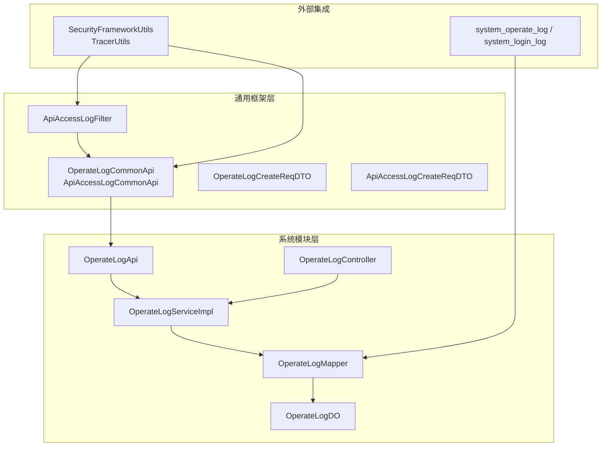
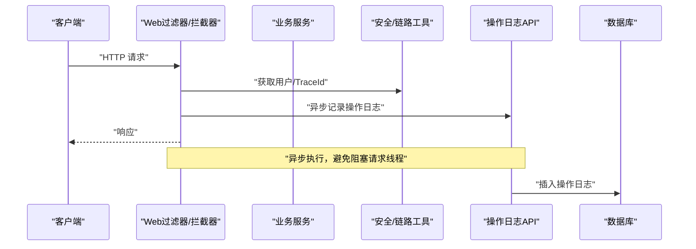
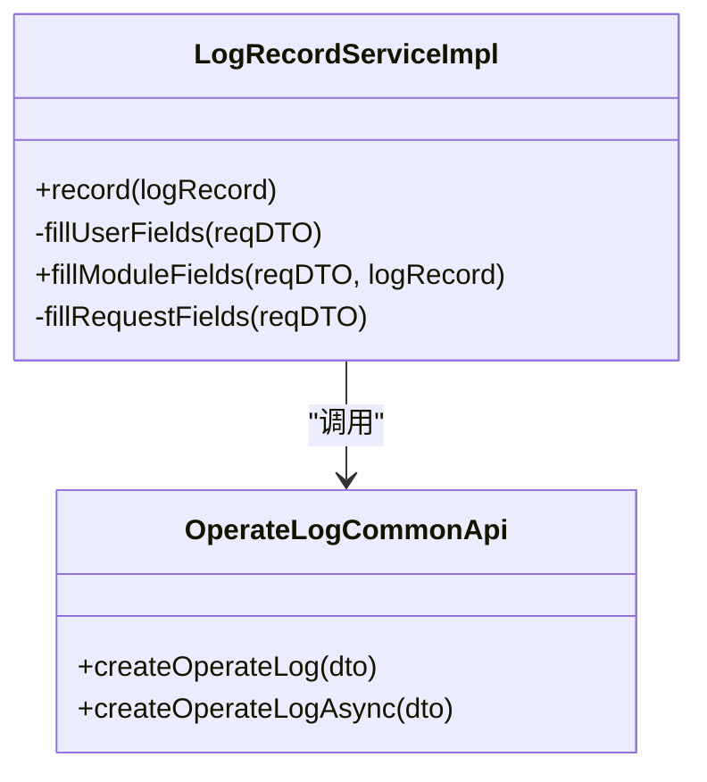
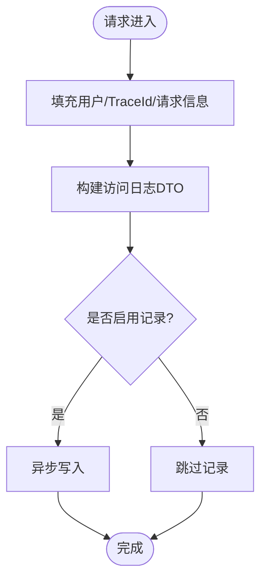
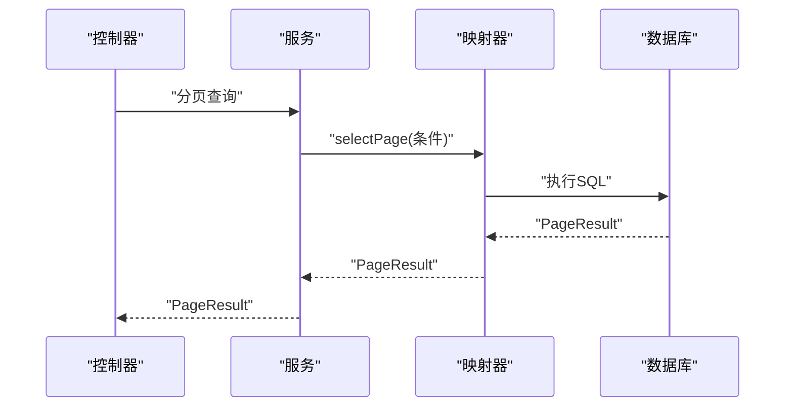
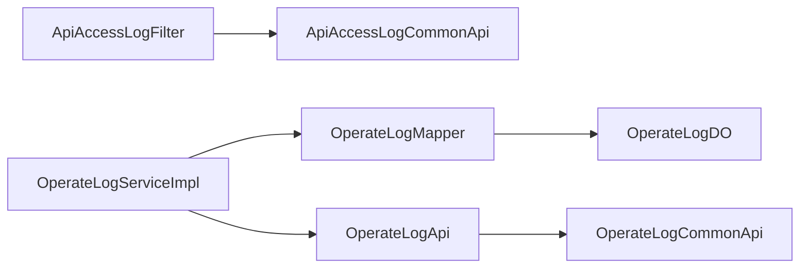
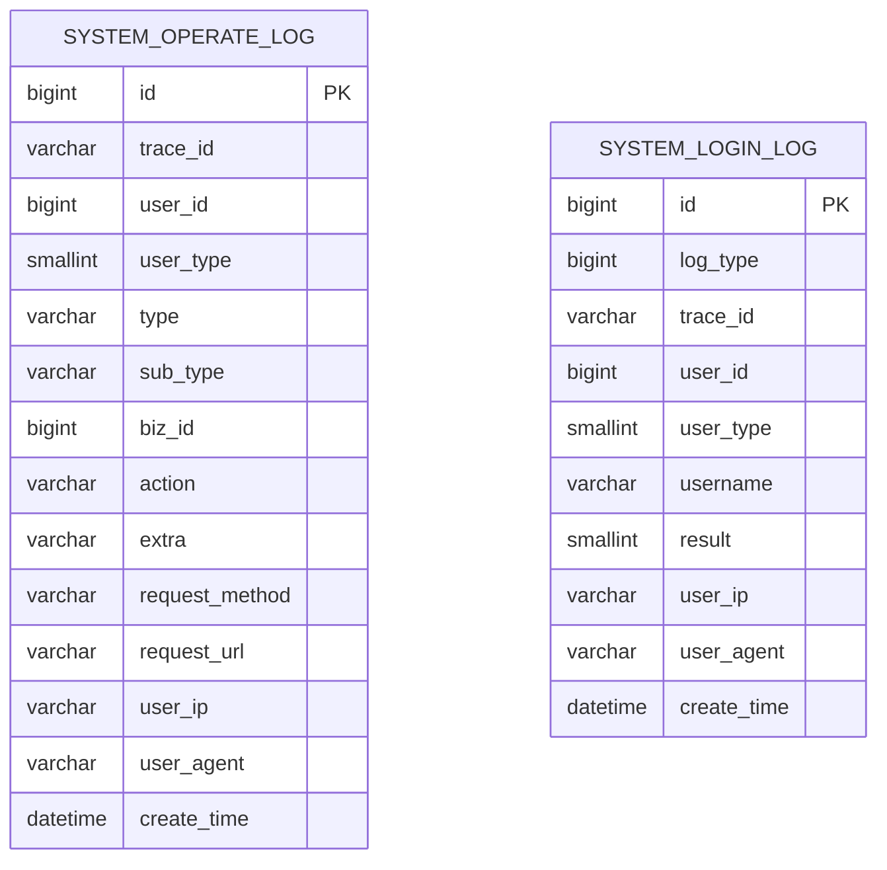
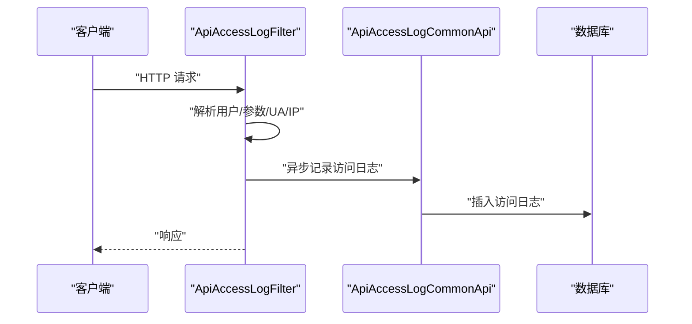

# 日志通知管理

<cite>
**本文引用的文件**
- [LogRecordServiceImpl.java](file://qiji-framework/qiji-spring-boot-starter-security/src/main/java/com.qiji.cps/framework/operatelog/core/service/LogRecordServiceImpl.java)
- [QijiOperateLogConfiguration.java](file://qiji-framework/qiji-spring-boot-starter-security/src/main/java/com.qiji.cps/framework/operatelog/config/QijiOperateLogConfiguration.java)
- [ApiAccessLogFilter.java](file://qiji-framework/qiji-spring-boot-starter-web/src/main/java/com.qiji.cps/framework/apilog/core/filter/ApiAccessLogFilter.java)
- [OperateLogController.java](file://qiji-module-system/src/main/java/com.qiji.cps/module/system/controller/admin/logger/OperateLogController.java)
- [OperateLogServiceImpl.java](file://qiji-module-system/src/main/java/com.qiji.cps/module/system/service/logger/OperateLogServiceImpl.java)
- [OperateLogMapper.java](file://qiji-module-system/src/main/java/com.qiji.cps/module/system/dal/mysql/logger/OperateLogMapper.java)
- [OperateLogDO.java](file://qiji-module-system/src/main/java/com.qiji.cps/module/system/dal/dataobject/logger/OperateLogDO.java)
- [OperateLogApi.java](file://qiji-module-system/src/main/java/com.qiji.cps/module/system/api/logger/OperateLogApi.java)
- [OperateLogCommonApi.java](file://qiji-framework/qiji-common/src/main/java/com.qiji.cps/framework/common/biz/system/logger/OperateLogCommonApi.java)
- [ApiAccessLogCommonApi.java](file://qiji-framework/qiji-common/src/main/java/com.qiji.cps/framework/common/biz/infra/logger/ApiAccessLogCommonApi.java)
- [ApiAccessLogCreateReqDTO.java](file://qiji-framework/qiji-common/src/main/java/com.qiji.cps/framework/common/biz/infra/logger/dto/ApiAccessLogCreateReqDTO.java)
- [OperateLogCreateReqDTO.java](file://qiji-framework/qiji-common/src/main/java/com.qiji.cps/framework/common/biz/system/logger/dto/OperateLogCreateReqDTO.java)
- [ruoyi-vue-pro.sql(MySQL)](file://sql/mysql/ruoyi-vue-pro.sql)
- [ruoyi-vue-pro.sql(PostgreSQL)](file://sql/postgresql/ruoyi-vue-pro.sql)
- [ruoyi-vue-pro.sql(SQLServer)](file://sql/sqlserver/ruoyi-vue-pro.sql)
- [OperateLogServiceImplTest.java](file://qiji-module-system/src/test/java/com.qiji.cps/module/system/service/logger/OperateLogServiceImplTest.java)
</cite>

## 目录
1. [简介](#简介)
2. [项目结构](#项目结构)
3. [核心组件](#核心组件)
4. [架构总览](#架构总览)
5. [详细组件分析](#详细组件分析)
6. [依赖分析](#依赖分析)
7. [性能考量](#性能考量)
8. [故障排查指南](#故障排查指南)
9. [结论](#结论)
10. [附录](#附录)

## 简介
本技术文档围绕“日志通知管理”主题，系统化梳理系统日志管理的实现架构与关键流程，覆盖操作日志、API 访问日志、登录日志与异常日志的采集、存储、查询与分析能力，并给出完整的 API 接口定义、性能优化建议与安全注意事项。通过链路追踪编号(trace_id)串联访问日志、错误日志与业务日志，实现跨维度的日志关联与问题定位。

## 项目结构
日志相关能力由“通用框架层”和“系统模块层”协同实现：
- 通用框架层提供日志抽象接口与通用 DTO，以及 Web 层的 API 访问日志过滤器。
- 系统模块层提供操作日志的控制器、服务与持久化映射，负责具体的数据落库与查询。
- 数据库层面提供操作日志与登录日志的表结构定义与注释。

图表来源
- [OperateLogCommonApi.java:12-31](file://qiji-framework/qiji-common/src/main/java/com.qiji.cps/framework/common/biz/system/logger/OperateLogCommonApi.java#L12-L31)
- [ApiAccessLogCommonApi.java:12-31](file://qiji-framework/qiji-common/src/main/java/com.qiji.cps/framework/common/biz/infra/logger/ApiAccessLogCommonApi.java#L12-L31)
- [ApiAccessLogFilter.java:49-98](file://qiji-framework/qiji-spring-boot-starter-web/src/main/java/com.qiji.cps/framework/apilog/core/filter/ApiAccessLogFilter.java#L49-L98)
- [OperateLogController.java:34-73](file://qiji-module-system/src/main/java/com.qiji.cps/module/system/controller/admin/logger/OperateLogController.java#L34-L73)
- [OperateLogServiceImpl.java:20-49](file://qiji-module-system/src/main/java/com.qiji.cps/module/system/service/logger/OperateLogServiceImpl.java#L20-L49)
- [OperateLogMapper.java:11-33](file://qiji-module-system/src/main/java/com.qiji.cps/module/system/dal/mysql/logger/OperateLogMapper.java#L11-L33)
- [OperateLogDO.java:15-85](file://qiji-module-system/src/main/java/com.qiji.cps/module/system/dal/dataobject/logger/OperateLogDO.java#L15-L85)
- [OperateLogApi.java:13-23](file://qiji-module-system/src/main/java/com.qiji.cps/module/system/api/logger/OperateLogApi.java#L13-L23)

章节来源
- [OperateLogController.java:34-73](file://qiji-module-system/src/main/java/com.qiji.cps/module/system/controller/admin/logger/OperateLogController.java#L34-L73)
- [OperateLogServiceImpl.java:20-49](file://qiji-module-system/src/main/java/com.qiji.cps/module/system/service/logger/OperateLogServiceImpl.java#L20-L49)
- [OperateLogMapper.java:11-33](file://qiji-module-system/src/main/java/com.qiji.cps/module/system/dal/mysql/logger/OperateLogMapper.java#L11-L33)
- [OperateLogDO.java:15-85](file://qiji-module-system/src/main/java/com.qiji.cps/module/system/dal/dataobject/logger/OperateLogDO.java#L15-L85)

## 核心组件
- 操作日志记录器：基于日志记录框架，填充用户、模块、请求上下文并异步写入。
- API 访问日志过滤器：拦截请求，构建访问日志 DTO，支持请求/响应脱敏与操作类型推断。
- 操作日志服务：接收 DTO 并持久化，提供分页查询与详情查询。
- 控制器：对外暴露查询、分页与导出接口。
- 通用接口与 DTO：统一异步写入契约与数据载体。

章节来源
- [LogRecordServiceImpl.java:25-48](file://qiji-framework/qiji-spring-boot-starter-security/src/main/java/com.qiji.cps/framework/operatelog/core/service/LogRecordServiceImpl.java#L25-L48)
- [ApiAccessLogFilter.java:49-98](file://qiji-framework/qiji-spring-boot-starter-web/src/main/java/com.qiji.cps/framework/apilog/core/filter/ApiAccessLogFilter.java#L49-L98)
- [OperateLogServiceImpl.java:28-47](file://qiji-module-system/src/main/java/com.qiji.cps/module/system/service/logger/OperateLogServiceImpl.java#L28-L47)
- [OperateLogController.java:43-71](file://qiji-module-system/src/main/java/com.qiji.cps/module/system/controller/admin/logger/OperateLogController.java#L43-L71)

## 架构总览
日志采集采用“同步上下文填充 + 异步落库”的模式，保证请求链路的低侵入性与高可用性。Web 层与业务层分别承担 API 访问日志与操作日志的采集职责，最终统一写入数据库。

图表来源
- [LogRecordServiceImpl.java:30-47](file://qiji-framework/qiji-spring-boot-starter-security/src/main/java/com.qiji.cps/framework/operatelog/core/service/LogRecordServiceImpl.java#L30-L47)
- [OperateLogCommonApi.java:26-29](file://qiji-framework/qiji-common/src/main/java/com.qiji.cps/framework/common/biz/system/logger/OperateLogCommonApi.java#L26-L29)

## 详细组件分析

### 操作日志记录器
- 触发时机：业务侧通过日志记录框架触发，内部自动填充 trace_id、用户信息、模块信息与请求上下文。
- 记录内容：包含用户标识、模块类型、子类型、业务编号、操作动作、扩展字段、请求方法、URL、IP、UA 等。
- 异步策略：通过 @Async 异步写入，降低对主流程的影响。

图表来源
- [LogRecordServiceImpl.java:25-89](file://qiji-framework/qiji-spring-boot-starter-security/src/main/java/com.qiji.cps/framework/operatelog/core/service/LogRecordServiceImpl.java#L25-L89)
- [OperateLogCommonApi.java:12-31](file://qiji-framework/qiji-common/src/main/java/com.qiji.cps/framework/common/biz/system/logger/OperateLogCommonApi.java#L12-L31)

章节来源
- [LogRecordServiceImpl.java:30-79](file://qiji-framework/qiji-spring-boot-starter-security/src/main/java/com.qiji.cps/framework/operatelog/core/service/LogRecordServiceImpl.java#L30-L79)
- [OperateLogCreateReqDTO.java:14-84](file://qiji-framework/qiji-common/src/main/java/com.qiji.cps/framework/common/biz/system/logger/dto/OperateLogCreateReqDTO.java#L14-L84)

### API 访问日志过滤器
- 触发时机：每个 HTTP 请求进入 Web 过滤链时触发，无论成功或异常都会记录。
- 记录内容：应用名、请求方法、URL、参数（支持脱敏）、响应体（可选）、用户信息、操作模块/名称/类型、耗时、结果码/消息、开始/结束时间。
- 脱敏策略：内置敏感字段白名单，支持对请求体与响应体 data 字段进行脱敏处理。

图表来源
- [ApiAccessLogFilter.java:66-98](file://qiji-framework/qiji-spring-boot-starter-web/src/main/java/com.qiji.cps/framework/apilog/core/filter/ApiAccessLogFilter.java#L66-L98)
- [ApiAccessLogFilter.java:100-160](file://qiji-framework/qiji-spring-boot-starter-web/src/main/java/com.qiji.cps/framework/apilog/core/filter/ApiAccessLogFilter.java#L100-L160)

章节来源
- [ApiAccessLogFilter.java:86-160](file://qiji-framework/qiji-spring-boot-starter-web/src/main/java/com.qiji.cps/framework/apilog/core/filter/ApiAccessLogFilter.java#L86-L160)
- [ApiAccessLogCreateReqDTO.java:14-103](file://qiji-framework/qiji-common/src/main/java/com.qiji.cps/framework/common/biz/infra/logger/dto/ApiAccessLogCreateReqDTO.java#L14-L103)

### 操作日志服务与持久化
- 写入：服务层将 DTO 转换为 DO 并插入数据库。
- 查询：提供按用户、业务编号、模块类型、子类型、关键词、时间范围的分页查询。
- 导出：支持导出全部数据为 Excel。

图表来源
- [OperateLogController.java:52-59](file://qiji-module-system/src/main/java/com.qiji.cps/module/system/controller/admin/logger/OperateLogController.java#L52-L59)
- [OperateLogServiceImpl.java:40-47](file://qiji-module-system/src/main/java/com.qiji.cps/module/system/service/logger/OperateLogServiceImpl.java#L40-L47)
- [OperateLogMapper.java:14-31](file://qiji-module-system/src/main/java/com.qiji.cps/module/system/dal/mysql/logger/OperateLogMapper.java#L14-L31)

章节来源
- [OperateLogController.java:43-71](file://qiji-module-system/src/main/java/com.qiji.cps/module/system/controller/admin/logger/OperateLogController.java#L43-L71)
- [OperateLogServiceImpl.java:28-47](file://qiji-module-system/src/main/java/com.qiji.cps/module/system/service/logger/OperateLogServiceImpl.java#L28-L47)
- [OperateLogMapper.java:14-31](file://qiji-module-system/src/main/java/com.qiji.cps/module/system/dal/mysql/logger/OperateLogMapper.java#L14-L31)

### 登录日志与异常日志
- 登录日志：独立表 system_login_log，记录登录结果、用户信息、IP、UA 等，便于审计与风控。
- 异常日志：Web 层在异常路径也会记录 API 访问日志，结合 TraceId 可与链路日志联动分析。

章节来源
- [ruoyi-vue-pro.sql(MySQL):1246-1266](file://sql/mysql/ruoyi-vue-pro.sql#L1246-L1266)
- [ruoyi-vue-pro.sql(PostgreSQL):1539-1549](file://sql/postgresql/ruoyi-vue-pro.sql#L1539-L1549)
- [ruoyi-vue-pro.sql(SQLServer):3671-3729](file://sql/sqlserver/ruoyi-vue-pro.sql#L3671-L3729)
- [ApiAccessLogFilter.java:74-83](file://qiji-framework/qiji-spring-boot-starter-web/src/main/java/com.qiji.cps/framework/apilog/core/filter/ApiAccessLogFilter.java#L74-L83)

## 依赖分析
- 模块耦合：Web 层仅依赖通用日志接口，业务层通过系统模块 API 与服务实现解耦。
- 外部依赖：安全框架与链路追踪工具用于获取用户与 trace_id；MyBatis 用于数据持久化。
- 循环依赖：未发现循环依赖迹象。

图表来源
- [ApiAccessLogFilter.java:56-94](file://qiji-framework/qiji-spring-boot-starter-web/src/main/java/com.qiji.cps/framework/apilog/core/filter/ApiAccessLogFilter.java#L56-L94)
- [OperateLogServiceImpl.java:25-32](file://qiji-module-system/src/main/java/com.qiji.cps/module/system/service/logger/OperateLogServiceImpl.java#L25-L32)
- [OperateLogMapper.java:12-23](file://qiji-module-system/src/main/java/com.qiji.cps/module/system/dal/mysql/logger/OperateLogMapper.java#L12-L23)
- [OperateLogApi.java:13-23](file://qiji-module-system/src/main/java/com.qiji.cps/module/system/api/logger/OperateLogApi.java#L13-L23)
- [OperateLogCommonApi.java:12-31](file://qiji-framework/qiji-common/src/main/java/com.qiji.cps/framework/common/biz/system/logger/OperateLogCommonApi.java#L12-L31)

章节来源
- [QijiOperateLogConfiguration.java:21-25](file://qiji-framework/qiji-spring-boot-starter-security/src/main/java/com.qiji.cps/framework/operatelog/config/QijiOperateLogConfiguration.java#L21-L25)

## 性能考量
- 异步写入：操作日志与 API 访问日志均提供异步写入接口，避免阻塞请求线程。
- 脱敏成本：请求/响应脱敏在 JSON 层进行，建议控制脱敏字段数量与层级深度，减少序列化开销。
- 分页查询：分页接口默认按主键倒序，建议在高频查询字段上建立合适索引（如用户、业务编号、时间）。
- 导出优化：导出接口设置最大分页大小，避免一次性拉取过多数据；可考虑分批写入 Excel 或流式输出。
- 存储策略：建议对历史日志进行归档与清理，控制主表规模，保障查询性能。

## 故障排查指南
- 异步记录异常：当异步写入抛出异常时，记录器会打印错误日志，便于快速定位。
- 查询不匹配：单元测试展示了按用户、业务编号、模块类型、子类型、时间范围的过滤逻辑，可据此核对查询条件。
- TraceId 关联：通过 trace_id 将访问日志、错误日志与链路日志串联，便于跨维度排障。

章节来源
- [LogRecordServiceImpl.java:44-47](file://qiji-framework/qiji-spring-boot-starter-security/src/main/java/com.qiji.cps/framework/operatelog/core/service/LogRecordServiceImpl.java#L44-L47)
- [OperateLogServiceImplTest.java:42-59](file://qiji-module-system/src/test/java/com.qiji.cps/module/system/service/logger/OperateLogServiceImplTest.java#L42-L59)

## 结论
该日志通知管理方案以“异步 + 脱敏 + TraceId 关联”为核心，兼顾性能与可观测性。通过统一的通用接口与 DTO，实现 Web 层与业务层的日志采集解耦；通过完善的分页查询与导出能力，满足审计与分析需求。建议在生产环境中配合索引优化、日志清理与容量规划，持续保障系统稳定性与可维护性。

## 附录

### 数据模型
- 操作日志表：包含 trace_id、用户、模块、业务编号、动作、扩展字段、请求信息等。
- 登录日志表：包含登录结果、用户信息、IP、UA 等。

图表来源
- [ruoyi-vue-pro.sql(MySQL):1246-1266](file://sql/mysql/ruoyi-vue-pro.sql#L1246-L1266)
- [ruoyi-vue-pro.sql(PostgreSQL):1539-1549](file://sql/postgresql/ruoyi-vue-pro.sql#L1539-L1549)
- [ruoyi-vue-pro.sql(SQLServer):3671-3729](file://sql/sqlserver/ruoyi-vue-pro.sql#L3671-L3729)

### API 接口定义（系统模块）
- 查看操作日志
  - 方法：GET
  - 路径：/system/operate-log/get
  - 权限：system:operate-log:query
  - 参数：id（编号）
  - 返回：单条日志详情
- 分页查询操作日志
  - 方法：GET
  - 路径：/system/operate-log/page
  - 权限：system:operate-log:query
  - 查询参数：用户ID、业务编号、模块类型、子类型、动作、创建时间范围等（支持分页）
  - 返回：分页结果
- 导出操作日志
  - 方法：GET
  - 路径：/system/operate-log/export-excel
  - 权限：system:operate-log:export
  - 查询参数：同分页查询
  - 返回：Excel 文件流

章节来源
- [OperateLogController.java:43-71](file://qiji-module-system/src/main/java/com.qiji.cps/module/system/controller/admin/logger/OperateLogController.java#L43-L71)

### 关键流程图（API 访问日志）

图表来源
- [ApiAccessLogFilter.java:66-98](file://qiji-framework/qiji-spring-boot-starter-web/src/main/java/com.qiji.cps/framework/apilog/core/filter/ApiAccessLogFilter.java#L66-L98)
- [ApiAccessLogCommonApi.java:26-29](file://qiji-framework/qiji-common/src/main/java/com.qiji.cps/framework/common/biz/infra/logger/ApiAccessLogCommonApi.java#L26-L29)