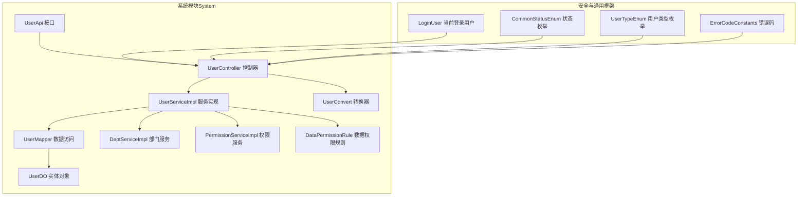
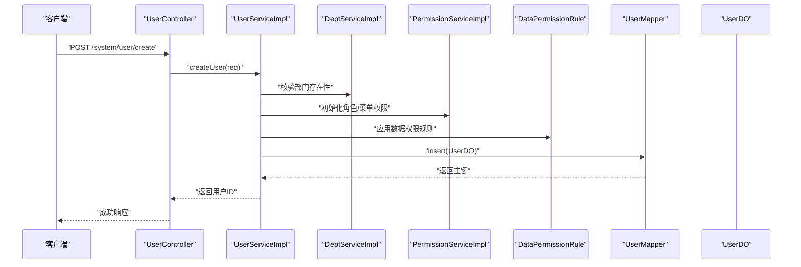
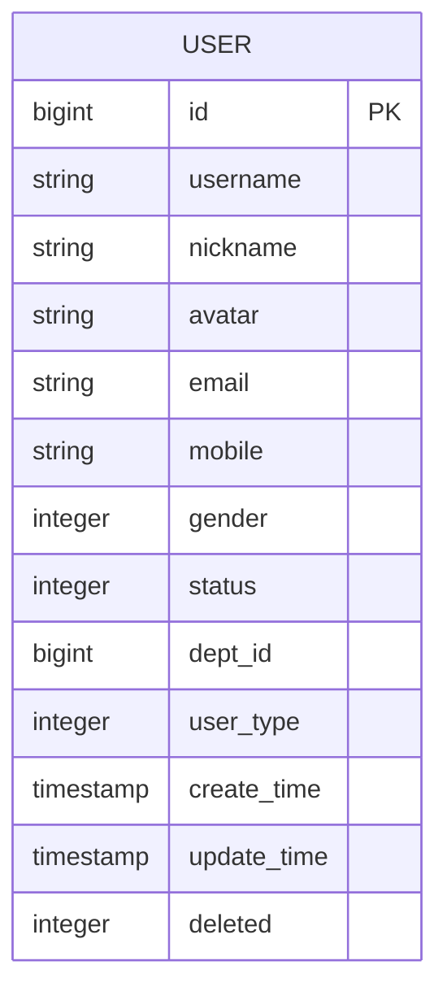
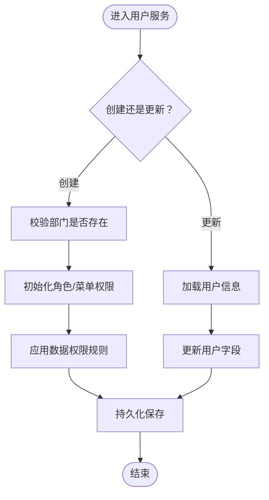
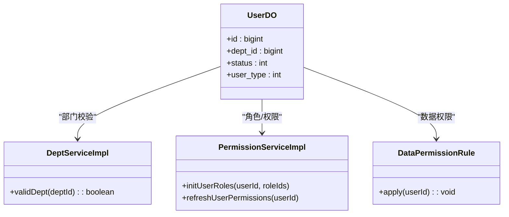
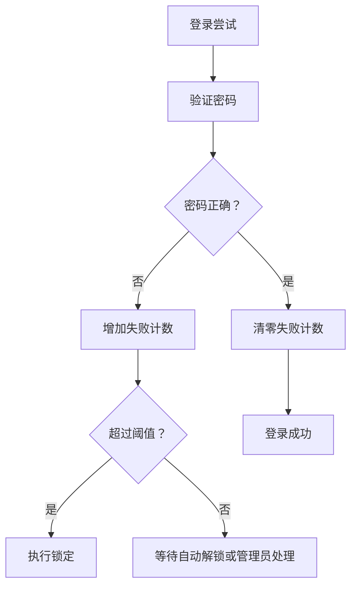
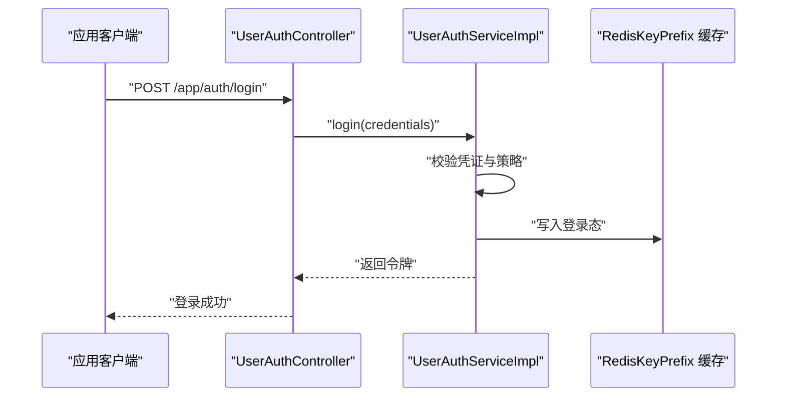
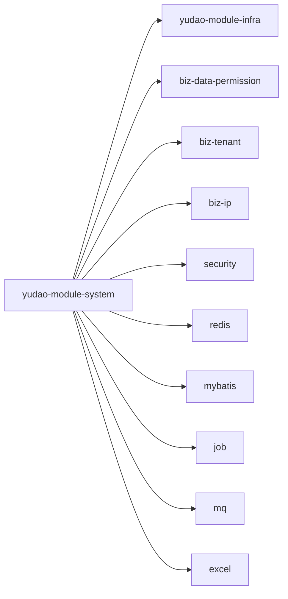

# 用户管理

<cite>
**本文引用的文件**
- [pom.xml](file://yudao-module-system/pom.xml)
- [UserApi.java](file://yudao-module-system/src/main/java/cn/iocoder/yudao/module/system/api/user/UserApi.java)
- [UserServiceImpl.java](file://yudao-module-system/src/main/java/cn/iocoder/yudao/module/system/service/user/UserServiceImpl.java)
- [UserController.java](file://yudao-module-system/src/main/java/cn/iocoder/yudao/module/system/controller/admin/system/user/UserController.java)
- [UserConvert.java](file://yudao-module-system/src/main/java/cn/iocoder/yudao/module/system/convert/user/UserConvert.java)
- [UserMapper.java](file://yudao-module-system/src/main/java/cn/iocoder/yudao/module/system/dal/mysql/UserMapper.java)
- [UserDO.java](file://yudao-module-system/src/main/java/cn/iocoder/yudao/module/system/dal/dataobject/UserDO.java)
- [DeptServiceImpl.java](file://yudao-module-system/src/main/java/cn/iocoder/yudao/module/system/service/dept/DeptServiceImpl.java)
- [PermissionServiceImpl.java](file://yudao-module-system/src/main/java/cn/iocoder/yudao/module/system/service/permission/PermissionServiceImpl.java)
- [DataPermissionRule.java](file://yudao-module-system/src/main/java/cn/iocoder/yudao/module/system/framework/datapermission/core/DataPermissionRule.java)
- [ErrorCodeConstants.java](file://yudao-module-system/src/main/java/cn/iocoder/yudao/module/system/enums/ErrorCodeConstants.java)
- [CommonStatusEnum.java](file://yudao-framework/yudao-common/src/main/java/cn/iocoder/yudao/framework/common/enums/CommonStatusEnum.java)
- [LoginUser.java](file://yudao-framework/yudao-spring-boot-starter-security/src/main/java/cn/iocoder/yudao/framework/security/core/LoginUser.java)
- [SecurityFrameworkService.java](file://yudao-module-system/src/main/java/cn/iocoder/yudao/module/system/framework/web/core/SecurityFrameworkService.java)
- [UserTypeEnum.java](file://yudao-framework/yudao-common/src/main/java/cn/iocoder/yudao/framework/common/enums/UserTypeEnum.java)
- [UserLockoutStrategy.java](file://yudao-module-system/src/main/java/cn/iocoder/yudao/module/system/framework/security/core/UserLockoutStrategy.java)
- [PasswordSecurityPolicy.java](file://yudao-module-system/src/main/java/cn/iocoder/yudao/module/system/framework/security/core/PasswordSecurityPolicy.java)
- [UserAuthController.java](file://yudao-module-system/src/main/java/cn/iocoder/yudao/module/system/controller/app/auth/UserAuthController.java)
- [UserAuthServiceImpl.java](file://yudao-module-system/src/main/java/cn/iocoder/yudao/module/system/service/auth/UserAuthServiceImpl.java)
- [RedisKeyPrefix.java](file://yudao-module-system/src/main/java/cn/iocoder/yudao/module/system/framework/redis/RedisKeyPrefix.java)
</cite>

## 目录
1. [简介](#简介)
2. [项目结构](#项目结构)
3. [核心组件](#核心组件)
4. [架构总览](#架构总览)
5. [详细组件分析](#详细组件分析)
6. [依赖分析](#依赖分析)
7. [性能考虑](#性能考虑)
8. [故障排查指南](#故障排查指南)
9. [结论](#结论)
10. [附录](#附录)

## 简介
本文件面向“用户管理”功能，系统性梳理用户创建、修改、删除、查询等基础能力，以及用户状态管理、密码安全策略、用户锁定机制等安全特性；阐述用户与部门、角色的关联关系及数据权限控制；给出用户管理接口的完整API文档与调用流程；并说明该功能在系统中的集成方式与最佳实践。

## 项目结构
用户管理位于系统模块（system）中，采用分层架构：API 接口定义、控制器（Controller）、服务（Service）、数据访问（Mapper/DO）、转换器（Convert）、枚举与错误码、安全框架与数据权限规则等。系统模块还引入了基础设施（Infra）模块以复用通用能力，并通过依赖注入与事务管理保证一致性。

**图表来源**
- [pom.xml:1-125](file://yudao-module-system/pom.xml#L1-L125)
- [UserApi.java](file://yudao-module-system/src/main/java/cn/iocoder/yudao/module/system/api/user/UserApi.java)
- [UserController.java](file://yudao-module-system/src/main/java/cn/iocoder/yudao/module/system/controller/admin/system/user/UserController.java)
- [UserServiceImpl.java](file://yudao-module-system/src/main/java/cn/iocoder/yudao/module/system/service/user/UserServiceImpl.java)
- [UserConvert.java](file://yudao-module-system/src/main/java/cn/iocoder/yudao/module/system/convert/user/UserConvert.java)
- [UserMapper.java](file://yudao-module-system/src/main/java/cn/iocoder/yudao/module/system/dal/mysql/UserMapper.java)
- [UserDO.java](file://yudao-module-system/src/main/java/cn/iocoder/yudao/module/system/dal/dataobject/UserDO.java)
- [DeptServiceImpl.java](file://yudao-module-system/src/main/java/cn/iocoder/yudao/module/system/service/dept/DeptServiceImpl.java)
- [PermissionServiceImpl.java](file://yudao-module-system/src/main/java/cn/iocoder/yudao/module/system/service/permission/PermissionServiceImpl.java)
- [DataPermissionRule.java](file://yudao-module-system/src/main/java/cn/iocoder/yudao/module/system/framework/datapermission/core/DataPermissionRule.java)
- [LoginUser.java](file://yudao-framework/yudao-spring-boot-starter-security/src/main/java/cn/iocoder/yudao/framework/security/core/LoginUser.java)
- [CommonStatusEnum.java](file://yudao-framework/yudao-common/src/main/java/cn/iocoder/yudao/framework/common/enums/CommonStatusEnum.java)
- [UserTypeEnum.java](file://yudao-framework/yudao-common/src/main/java/cn/iocoder/yudao/framework/common/enums/UserTypeEnum.java)
- [ErrorCodeConstants.java](file://yudao-module-system/src/main/java/cn/iocoder/yudao/module/system/enums/ErrorCodeConstants.java)

**章节来源**
- [pom.xml:1-125](file://yudao-module-system/pom.xml#L1-L125)

## 核心组件
- 用户接口与控制器：对外暴露用户管理的 REST API，负责请求参数解析、鉴权与响应封装。
- 用户服务实现：编排业务逻辑，协调部门、权限、数据权限规则等。
- 数据访问层：基于 MyBatis 的 Mapper 与实体对象，完成数据库 CRUD。
- 转换器：VO/DTO/DO 之间的映射，保持接口稳定与领域模型清晰。
- 安全与通用框架：当前登录用户上下文、状态与类型枚举、错误码常量等。

**章节来源**
- [UserApi.java](file://yudao-module-system/src/main/java/cn/iocoder/yudao/module/system/api/user/UserApi.java)
- [UserController.java](file://yudao-module-system/src/main/java/cn/iocoder/yudao/module/system/controller/admin/system/user/UserController.java)
- [UserServiceImpl.java](file://yudao-module-system/src/main/java/cn/iocoder/yudao/module/system/service/user/UserServiceImpl.java)
- [UserMapper.java](file://yudao-module-system/src/main/java/cn/iocoder/yudao/module/system/dal/mysql/UserMapper.java)
- [UserDO.java](file://yudao-module-system/src/main/java/cn/iocoder/yudao/module/system/dal/dataobject/UserDO.java)
- [UserConvert.java](file://yudao-module-system/src/main/java/cn/iocoder/yudao/module/system/convert/user/UserConvert.java)
- [LoginUser.java](file://yudao-framework/yudao-spring-boot-starter-security/src/main/java/cn/iocoder/yudao/framework/security/core/LoginUser.java)
- [CommonStatusEnum.java](file://yudao-framework/yudao-common/src/main/java/cn/iocoder/yudao/framework/common/enums/CommonStatusEnum.java)
- [UserTypeEnum.java](file://yudao-framework/yudao-common/src/main/java/cn/iocoder/yudao/framework/common/enums/UserTypeEnum.java)
- [ErrorCodeConstants.java](file://yudao-module-system/src/main/java/cn/iocoder/yudao/module/system/enums/ErrorCodeConstants.java)

## 架构总览
用户管理围绕“控制器—服务—数据访问—实体”的分层设计展开，同时与部门、权限、数据权限、安全框架进行协作，形成统一的身份与权限管理体系。

**图表来源**
- [UserController.java](file://yudao-module-system/src/main/java/cn/iocoder/yudao/module/system/controller/admin/system/user/UserController.java)
- [UserServiceImpl.java](file://yudao-module-system/src/main/java/cn/iocoder/yudao/module/system/service/user/UserServiceImpl.java)
- [DeptServiceImpl.java](file://yudao-module-system/src/main/java/cn/iocoder/yudao/module/system/service/dept/DeptServiceImpl.java)
- [PermissionServiceImpl.java](file://yudao-module-system/src/main/java/cn/iocoder/yudao/module/system/service/permission/PermissionServiceImpl.java)
- [DataPermissionRule.java](file://yudao-module-system/src/main/java/cn/iocoder/yudao/module/system/framework/datapermission/core/DataPermissionRule.java)
- [UserMapper.java](file://yudao-module-system/src/main/java/cn/iocoder/yudao/module/system/dal/mysql/UserMapper.java)
- [UserDO.java](file://yudao-module-system/src/main/java/cn/iocoder/yudao/module/system/dal/dataobject/UserDO.java)

## 详细组件分析

### 用户实体与数据模型
用户实体包含关键字段：用户标识、用户名、昵称、头像、邮箱、手机号、性别、状态、部门ID、用户类型、创建时间等。状态枚举用于控制启用/停用，用户类型用于区分内部/外部等场景。

**图表来源**
- [UserDO.java](file://yudao-module-system/src/main/java/cn/iocoder/yudao/module/system/dal/dataobject/UserDO.java)
- [CommonStatusEnum.java](file://yudao-framework/yudao-common/src/main/java/cn/iocoder/yudao/framework/common/enums/CommonStatusEnum.java)
- [UserTypeEnum.java](file://yudao-framework/yudao-common/src/main/java/cn/iocoder/yudao/framework/common/enums/UserTypeEnum.java)

**章节来源**
- [UserDO.java](file://yudao-module-system/src/main/java/cn/iocoder/yudao/module/system/dal/dataobject/UserDO.java)
- [CommonStatusEnum.java](file://yudao-framework/yudao-common/src/main/java/cn/iocoder/yudao/framework/common/enums/CommonStatusEnum.java)
- [UserTypeEnum.java](file://yudao-framework/yudao-common/src/main/java/cn/iocoder/yudao/framework/common/enums/UserTypeEnum.java)

### 用户服务与业务流程
用户服务负责用户生命周期管理：创建、更新、删除、查询、状态变更、重置密码、关联角色/部门等。服务层会调用部门服务校验部门有效性，调用权限服务初始化或更新角色/菜单授权，并应用数据权限规则以确保数据隔离。

**图表来源**
- [UserServiceImpl.java](file://yudao-module-system/src/main/java/cn/iocoder/yudao/module/system/service/user/UserServiceImpl.java)
- [DeptServiceImpl.java](file://yudao-module-system/src/main/java/cn/iocoder/yudao/module/system/service/dept/DeptServiceImpl.java)
- [PermissionServiceImpl.java](file://yudao-module-system/src/main/java/cn/iocoder/yudao/module/system/service/permission/PermissionServiceImpl.java)
- [DataPermissionRule.java](file://yudao-module-system/src/main/java/cn/iocoder/yudao/module/system/framework/datapermission/core/DataPermissionRule.java)

**章节来源**
- [UserServiceImpl.java](file://yudao-module-system/src/main/java/cn/iocoder/yudao/module/system/service/user/UserServiceImpl.java)

### 用户与部门、角色的关联关系
- 部门关联：用户属于一个部门，服务在创建/更新时校验部门存在性，支持按部门维度进行数据权限过滤。
- 角色/权限关联：用户拥有多个角色，角色绑定菜单与数据权限，服务在创建/更新时同步初始化或更新权限集合。
- 数据权限：通过数据权限规则对用户可访问的数据范围进行限制，避免越权访问。

**图表来源**
- [UserDO.java](file://yudao-module-system/src/main/java/cn/iocoder/yudao/module/system/dal/dataobject/UserDO.java)
- [DeptServiceImpl.java](file://yudao-module-system/src/main/java/cn/iocoder/yudao/module/system/service/dept/DeptServiceImpl.java)
- [PermissionServiceImpl.java](file://yudao-module-system/src/main/java/cn/iocoder/yudao/module/system/service/permission/PermissionServiceImpl.java)
- [DataPermissionRule.java](file://yudao-module-system/src/main/java/cn/iocoder/yudao/module/system/framework/datapermission/core/DataPermissionRule.java)

**章节来源**
- [DeptServiceImpl.java](file://yudao-module-system/src/main/java/cn/iocoder/yudao/module/system/service/dept/DeptServiceImpl.java)
- [PermissionServiceImpl.java](file://yudao-module-system/src/main/java/cn/iocoder/yudao/module/system/service/permission/PermissionServiceImpl.java)
- [DataPermissionRule.java](file://yudao-module-system/src/main/java/cn/iocoder/yudao/module/system/framework/datapermission/core/DataPermissionRule.java)

### 密码安全策略与用户锁定机制
- 密码安全策略：提供密码复杂度、历史密码保留、强制到期等策略配置与校验逻辑，防止弱密码与重复使用旧密码。
- 用户锁定机制：基于失败登录次数与时间窗口的锁定策略，支持自动解锁与管理员手动解锁，降低暴力破解风险。

**图表来源**
- [PasswordSecurityPolicy.java](file://yudao-module-system/src/main/java/cn/iocoder/yudao/module/system/framework/security/core/PasswordSecurityPolicy.java)
- [UserLockoutStrategy.java](file://yudao-module-system/src/main/java/cn/iocoder/yudao/module/system/framework/security/core/UserLockoutStrategy.java)

**章节来源**
- [PasswordSecurityPolicy.java](file://yudao-module-system/src/main/java/cn/iocoder/yudao/module/system/framework/security/core/PasswordSecurityPolicy.java)
- [UserLockoutStrategy.java](file://yudao-module-system/src/main/java/cn/iocoder/yudao/module/system/framework/security/core/UserLockoutStrategy.java)

### 用户状态管理
- 状态枚举：包含启用、停用等状态，控制器与服务层在创建/更新/查询时均需校验状态合法性。
- 状态变更：仅允许管理员进行状态变更，变更后同步刷新缓存与权限。

**章节来源**
- [CommonStatusEnum.java](file://yudao-framework/yudao-common/src/main/java/cn/iocoder/yudao/framework/common/enums/CommonStatusEnum.java)
- [UserController.java](file://yudao-module-system/src/main/java/cn/iocoder/yudao/module/system/controller/admin/system/user/UserController.java)

### 用户数据权限控制机制
- 数据权限规则：根据用户所属部门、岗位、角色等维度，动态生成可访问的数据集合。
- 应用时机：在用户查询列表、详情、导出等场景自动应用规则，确保最小可见原则。

**章节来源**
- [DataPermissionRule.java](file://yudao-module-system/src/main/java/cn/iocoder/yudao/module/system/framework/datapermission/core/DataPermissionRule.java)

### 用户认证与登录（应用侧）
- 登录控制器：提供账号密码登录、短信验证码登录、第三方社交登录等入口。
- 认证服务：生成令牌、刷新令牌、注销登出、校验令牌有效性。
- 登录用户上下文：通过 LoginUser 提供当前登录用户信息，贯穿整个请求链路。

**图表来源**
- [UserAuthController.java](file://yudao-module-system/src/main/java/cn/iocoder/yudao/module/system/controller/app/auth/UserAuthController.java)
- [UserAuthServiceImpl.java](file://yudao-module-system/src/main/java/cn/iocoder/yudao/module/system/service/auth/UserAuthServiceImpl.java)
- [LoginUser.java](file://yudao-framework/yudao-spring-boot-starter-security/src/main/java/cn/iocoder/yudao/framework/security/core/LoginUser.java)
- [RedisKeyPrefix.java](file://yudao-module-system/src/main/java/cn/iocoder/yudao/module/system/framework/redis/RedisKeyPrefix.java)

**章节来源**
- [UserAuthController.java](file://yudao-module-system/src/main/java/cn/iocoder/yudao/module/system/controller/app/auth/UserAuthController.java)
- [UserAuthServiceImpl.java](file://yudao-module-system/src/main/java/cn/iocoder/yudao/module/system/service/auth/UserAuthServiceImpl.java)
- [LoginUser.java](file://yudao-framework/yudao-spring-boot-starter-security/src/main/java/cn/iocoder/yudao/framework/security/core/LoginUser.java)
- [RedisKeyPrefix.java](file://yudao-module-system/src/main/java/cn/iocoder/yudao/module/system/framework/redis/RedisKeyPrefix.java)

## 依赖分析
系统模块对基础设施与安全框架有强依赖，包括：
- 基础设施：数据权限、租户、IP、Excel、定时任务、消息队列等。
- 安全框架：Spring Security、操作日志、Web 安全拦截等。
- DB 与缓存：MyBatis、Redis。

**图表来源**
- [pom.xml:20-121](file://yudao-module-system/pom.xml#L20-L121)

**章节来源**
- [pom.xml:1-125](file://yudao-module-system/pom.xml#L1-L125)

## 性能考虑
- 查询优化：对常用查询条件建立索引（如用户名、手机号、部门ID），分页查询避免一次性加载大量数据。
- 缓存策略：登录态、用户基本信息、角色/权限集合使用 Redis 缓存，设置合理过期时间与失效策略。
- 批量操作：批量导入/导出使用分批处理与异步任务，避免阻塞主线程。
- 并发控制：登录失败次数统计使用原子操作与分布式锁，防止并发竞争导致的误判。

## 故障排查指南
- 常见错误码：参考系统模块错误码常量，定位业务异常原因（如用户不存在、部门无效、状态不合法、权限不足等）。
- 日志与追踪：开启操作日志与链路追踪，定位请求耗时与异常堆栈。
- 安全检查：确认登录用户上下文是否正确注入，令牌是否过期或被篡改。
- 数据权限：核对数据权限规则是否生效，是否存在遗漏的过滤条件。

**章节来源**
- [ErrorCodeConstants.java](file://yudao-module-system/src/main/java/cn/iocoder/yudao/module/system/enums/ErrorCodeConstants.java)
- [LoginUser.java](file://yudao-framework/yudao-spring-boot-starter-security/src/main/java/cn/iocoder/yudao/framework/security/core/LoginUser.java)

## 结论
用户管理模块通过清晰的分层设计与完善的配套能力（部门、权限、数据权限、安全策略、认证），实现了统一的身份与权限管理体系。开发者可在此基础上快速扩展用户相关功能，同时遵循统一的安全与权限约束，保障系统的安全性与稳定性。

## 附录

### 用户管理接口定义（Admin）

- 创建用户
  - 方法与路径：POST /system/user/create
  - 请求参数：用户名、昵称、头像、邮箱、手机号、性别、状态、部门ID、用户类型、角色ID列表等
  - 响应结果：用户ID
  - 权限要求：需要“用户管理-新增”权限
  - 错误码：参考错误码常量

- 更新用户
  - 方法与路径：PUT /system/user/update
  - 请求参数：用户ID、昵称、邮箱、手机号、性别、状态、部门ID、用户类型、角色ID列表等
  - 响应结果：布尔值（是否成功）
  - 权限要求：需要“用户管理-修改”权限

- 删除用户
  - 方法与路径：DELETE /system/user/delete
  - 请求参数：用户ID（支持批量）
  - 响应结果：布尔值（是否成功）
  - 权限要求：需要“用户管理-删除”权限

- 查询用户
  - 方法与路径：GET /system/user/list
  - 请求参数：用户名、昵称、开始/结束时间、状态、部门ID等（支持分页）
  - 响应结果：用户列表（含部门名称、角色名称等）
  - 权限要求：需要“用户管理-查询”权限

- 获取用户详情
  - 方法与路径：GET /system/user/get
  - 请求参数：用户ID
  - 响应结果：用户详情（含部门、角色、权限集合）
  - 权限要求：需要“用户管理-查询”权限

- 修改用户状态
  - 方法与路径：PUT /system/user/update-status
  - 请求参数：用户ID、状态
  - 响应结果：布尔值（是否成功）
  - 权限要求：需要“用户管理-修改”权限

- 重置用户密码
  - 方法与路径：PUT /system/user/reset-password
  - 请求参数：用户ID、新密码
  - 响应结果：布尔值（是否成功）
  - 权限要求：需要“用户管理-修改”权限

- 导出用户
  - 方法与路径：GET /system/user/export
  - 请求参数：查询条件（同列表）
  - 响应结果：Excel 文件流
  - 权限要求：需要“用户管理-导出”权限

- 错误码说明
  - 参考系统模块错误码常量，涵盖用户不存在、部门无效、状态非法、权限不足、数据冲突等场景

**章节来源**
- [UserApi.java](file://yudao-module-system/src/main/java/cn/iocoder/yudao/module/system/api/user/UserApi.java)
- [UserController.java](file://yudao-module-system/src/main/java/cn/iocoder/yudao/module/system/controller/admin/system/user/UserController.java)
- [ErrorCodeConstants.java](file://yudao-module-system/src/main/java/cn/iocoder/yudao/module/system/enums/ErrorCodeConstants.java)

### 用户认证接口定义（App）

- 账号密码登录
  - 方法与路径：POST /app/auth/login
  - 请求参数：账号、密码
  - 响应结果：令牌与用户信息
  - 安全策略：应用密码安全策略与用户锁定机制

- 刷新令牌
  - 方法与路径：POST /app/auth/refresh-token
  - 请求参数：刷新令牌
  - 响应结果：新的访问令牌

- 注销登录
  - 方法与路径：POST /app/auth/logout
  - 请求参数：无
  - 响应结果：布尔值（是否成功）

**章节来源**
- [UserAuthController.java](file://yudao-module-system/src/main/java/cn/iocoder/yudao/module/system/controller/app/auth/UserAuthController.java)
- [UserAuthServiceImpl.java](file://yudao-module-system/src/main/java/cn/iocoder/yudao/module/system/service/auth/UserAuthServiceImpl.java)
- [PasswordSecurityPolicy.java](file://yudao-module-system/src/main/java/cn/iocoder/yudao/module/system/framework/security/core/PasswordSecurityPolicy.java)
- [UserLockoutStrategy.java](file://yudao-module-system/src/main/java/cn/iocoder/yudao/module/system/framework/security/core/UserLockoutStrategy.java)