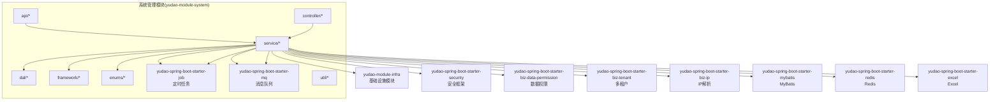
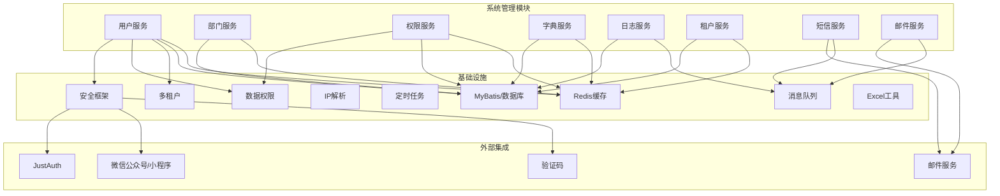
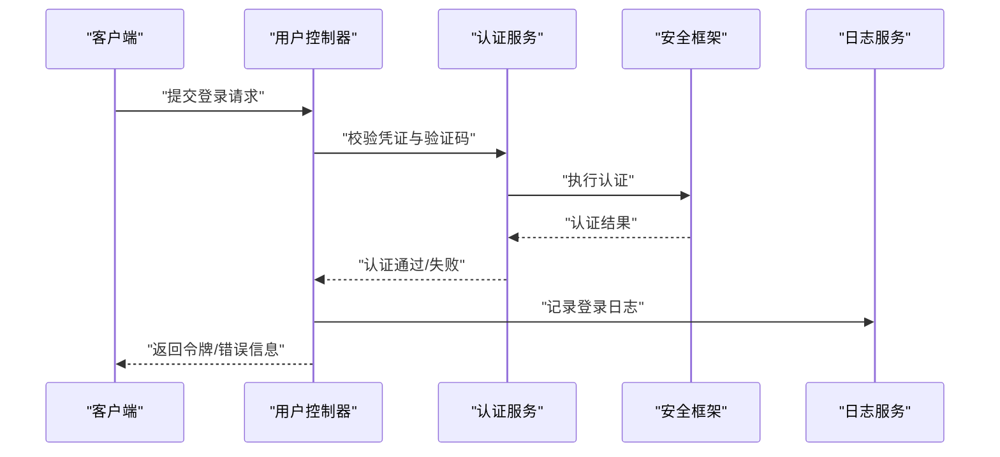
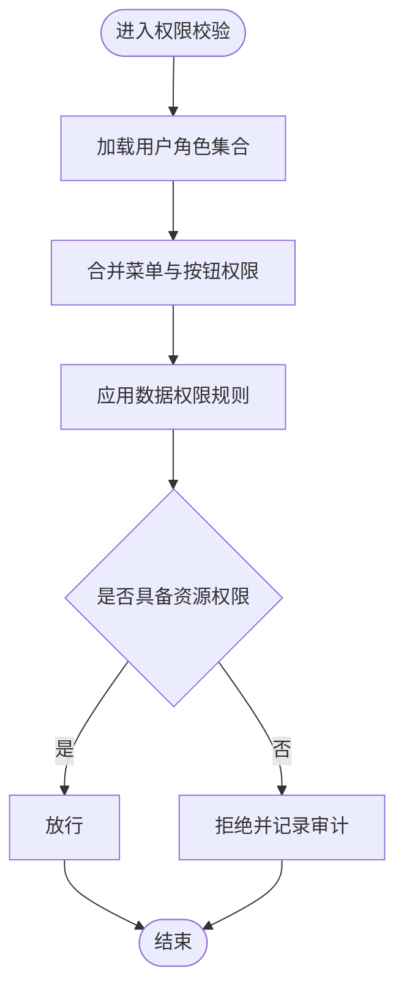
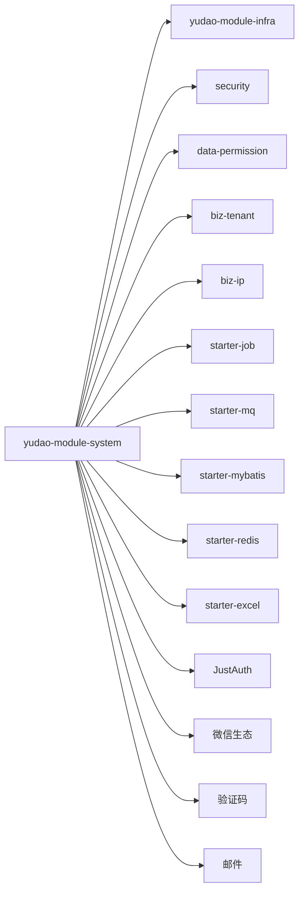

# 系统管理模块

<cite>
**本文引用的文件**
- [yudao-module-system/pom.xml](file://yudao-module-system/pom.xml)
- [yudao-module-system/src/main/java/cn/iocoder/yudao/module/system/package-info.java](file://yudao-module-system/src/main/java/cn/iocoder/yudao/module/system/package-info.java)
- [yudao-module-system/src/main/java/cn/iocoder/yudao/module/system/api/package-info.java](file://yudao-module-system/src/main/java/cn/iocoder/yudao/module/system/api/package-info.java)
- [yudao-module-infra/pom.xml](file://yudao-module-infra/pom.xml)
- [yudao-framework/yudao-spring-boot-starter-security/pom.xml](file://yudao-framework/yudao-spring-boot-starter-security/pom.xml)
- [yudao-framework/yudao-spring-boot-starter-biz-data-permission/pom.xml](file://yudao-framework/yudao-spring-boot-starter-biz-data-permission/pom.xml)
- [yudao-framework/yudao-spring-boot-starter-biz-tenant/pom.xml](file://yudao-framework/yudao-spring-boot-starter-biz-tenant/pom.xml)
- [yudao-framework/yudao-spring-boot-starter-biz-ip/pom.xml](file://yudao-framework/yudao-spring-boot-starter-biz-ip/pom.xml)
- [yudao-framework/yudao-spring-boot-starter-job/pom.xml](file://yudao-framework/yudao-spring-boot-starter-job/pom.xml)
- [yudao-framework/yudao-spring-boot-starter-mq/pom.xml](file://yudao-framework/yudao-spring-boot-starter-mq/pom.xml)
- [yudao-framework/yudao-spring-boot-starter-mybatis/pom.xml](file://yudao-framework/yudao-spring-boot-starter-mybatis/pom.xml)
- [yudao-framework/yudao-spring-boot-starter-redis/pom.xml](file://yudao-framework/yudao-spring-boot-starter-redis/pom.xml)
- [yudao-framework/yudao-spring-boot-starter-excel/pom.xml](file://yudao-framework/yudao-spring-boot-starter-excel/pom.xml)
</cite>

## 目录
1. [引言](#引言)
2. [项目结构](#项目结构)
3. [核心组件](#核心组件)
4. [架构总览](#架构总览)
5. [详细组件分析](#详细组件分析)
6. [依赖分析](#依赖分析)
7. [性能考虑](#性能考虑)
8. [故障排查指南](#故障排查指南)
9. [结论](#结论)
10. [附录](#附录)

## 引言
本文件为 AgenticCPS 系统中“系统管理模块”的权威架构文档。该模块是平台的“基础设施与通用能力中枢”，负责用户、部门、角色权限、菜单、数据字典、操作日志、短信邮件、租户、验证码等基础能力，向上支撑各业务模块安全稳定运行，向下对接基础设施与中间件。其核心定位如下：
- 统一身份与权限：提供认证授权、权限控制、数据隔离与访问控制。
- 运行支撑：提供日志审计、消息通知、定时任务、缓存与数据库访问等通用能力。
- 集成枢纽：作为各业务模块的“系统能力供应商”，通过清晰的 API 与接口契约进行解耦协作。

## 项目结构
系统管理模块采用“按功能域分层”的组织方式，核心包与职责概览：
- api：对外暴露的领域接口，供其他模块调用。
- controller：Admin 端与 App 端的接口控制器，Admin 负责系统管理，App 提供移动端能力。
- service：系统管理领域的业务逻辑实现，如用户、部门、权限、字典、日志等。
- dal：数据访问层，包含 DO/DAO/MySQL/Redis 等。
- framework：系统级框架能力，如数据权限、操作日志、短信、Web 安全、验证码等。
- enums：系统管理相关的枚举类型与常量。
- job/mq/util：定时任务、消息队列、工具类等。

图表来源
- [yudao-module-system/pom.xml:20-122](file://yudao-module-system/pom.xml#L20-L122)
- [yudao-module-infra/pom.xml](file://yudao-module-infra/pom.xml)
- [yudao-framework/yudao-spring-boot-starter-security/pom.xml](file://yudao-framework/yudao-spring-boot-starter-security/pom.xml)
- [yudao-framework/yudao-spring-boot-starter-biz-data-permission/pom.xml](file://yudao-framework/yudao-spring-boot-starter-biz-data-permission/pom.xml)
- [yudao-framework/yudao-spring-boot-starter-biz-tenant/pom.xml](file://yudao-framework/yudao-spring-boot-starter-biz-tenant/pom.xml)
- [yudao-framework/yudao-spring-boot-starter-biz-ip/pom.xml](file://yudao-framework/yudao-spring-boot-starter-biz-ip/pom.xml)
- [yudao-framework/yudao-spring-boot-starter-job/pom.xml](file://yudao-framework/yudao-spring-boot-starter-job/pom.xml)
- [yudao-framework/yudao-spring-boot-starter-mq/pom.xml](file://yudao-framework/yudao-spring-boot-starter-mq/pom.xml)
- [yudao-framework/yudao-spring-boot-starter-mybatis/pom.xml](file://yudao-framework/yudao-spring-boot-starter-mybatis/pom.xml)
- [yudao-framework/yudao-spring-boot-starter-redis/pom.xml](file://yudao-framework/yudao-spring-boot-starter-redis/pom.xml)
- [yudao-framework/yudao-spring-boot-starter-excel/pom.xml](file://yudao-framework/yudao-spring-boot-starter-excel/pom.xml)

章节来源
- [yudao-module-system/src/main/java/cn/iocoder/yudao/module/system/package-info.java:1-9](file://yudao-module-system/src/main/java/cn/iocoder/yudao/module/system/package-info.java#L1-L9)
- [yudao-module-system/src/main/java/cn/iocoder/yudao/module/system/api/package-info.java:1-5](file://yudao-module-system/src/main/java/cn/iocoder/yudao/module/system/api/package-info.java#L1-L5)

## 核心组件
系统管理模块围绕以下核心能力展开：
- 用户管理：用户注册、登录、信息维护、状态与锁定、登录限制、第三方社交登录等。
- 角色权限管理：角色定义、菜单授权、数据权限规则、动态权限计算。
- 菜单管理：菜单树结构、按钮权限、前端路由映射、权限标识。
- 部门与岗位：组织架构建模、上下级关系、岗位绑定、人员与岗位关联。
- 数据字典：字典类型与键值对管理，支持多租户隔离与缓存。
- 操作日志：请求轨迹记录、敏感操作审计、异常与耗时统计。
- 短信与邮件：模板化发送、通道配置、失败重试与回调处理。
- 租户与多租户：租户生命周期、资源隔离、初始化脚本与切换。
- 定时任务：统一调度平台、任务执行与失败处理。
- 消息队列：异步解耦、事件驱动、可靠投递。
- 缓存与数据库：Redis 缓存热点数据，MyBatis 访问持久层。
- Excel 导入导出：批量数据处理与报表生成。

章节来源
- [yudao-module-system/pom.xml:14-18](file://yudao-module-system/pom.xml#L14-L18)

## 架构总览
系统管理模块的总体架构由“领域服务 + 基础设施 + 外部集成”三层组成：
- 领域服务层：用户、部门、权限、字典、日志、租户等业务服务。
- 基础设施层：安全框架、数据权限、多租户、IP 解析、定时任务、消息队列、MyBatis、Redis、Excel。
- 外部集成：JustAuth 社交登录、微信公众号/小程序、验证码服务、邮件服务等。

图表来源
- [yudao-module-system/pom.xml:20-122](file://yudao-module-system/pom.xml#L20-L122)
- [yudao-framework/yudao-spring-boot-starter-security/pom.xml](file://yudao-framework/yudao-spring-boot-starter-security/pom.xml)
- [yudao-framework/yudao-spring-boot-starter-biz-data-permission/pom.xml](file://yudao-framework/yudao-spring-boot-starter-biz-data-permission/pom.xml)
- [yudao-framework/yudao-spring-boot-starter-biz-tenant/pom.xml](file://yudao-framework/yudao-spring-boot-starter-biz-tenant/pom.xml)
- [yudao-framework/yudao-spring-boot-starter-biz-ip/pom.xml](file://yudao-framework/yudao-spring-boot-starter-biz-ip/pom.xml)
- [yudao-framework/yudao-spring-boot-starter-job/pom.xml](file://yudao-framework/yudao-spring-boot-starter-job/pom.xml)
- [yudao-framework/yudao-spring-boot-starter-mq/pom.xml](file://yudao-framework/yudao-spring-boot-starter-mq/pom.xml)
- [yudao-framework/yudao-spring-boot-starter-mybatis/pom.xml](file://yudao-framework/yudao-spring-boot-starter-mybatis/pom.xml)
- [yudao-framework/yudao-spring-boot-starter-redis/pom.xml](file://yudao-framework/yudao-spring-boot-starter-redis/pom.xml)
- [yudao-framework/yudao-spring-boot-starter-excel/pom.xml](file://yudao-framework/yudao-spring-boot-starter-excel/pom.xml)

## 详细组件分析

### 用户管理
- 功能要点
  - 登录认证：用户名密码、手机验证码、第三方社交登录（JustAuth）、微信公众号/小程序登录。
  - 会话与令牌：JWT 令牌签发与刷新、在线会话管理、强制下线。
  - 用户信息：基本信息维护、状态变更、锁定与解锁、登录限制策略。
  - 安全防护：登录失败次数限制、IP 白名单、验证码校验。
- 关键流程
  - 登录流程：校验凭证 -> 校验验证码 -> 权限与状态检查 -> 生成令牌 -> 记录登录日志。
  - 第三方登录：回调验证 -> 绑定账号或新建账号 -> 生成令牌 -> 记录社交登录日志。
- 最佳实践
  - 使用安全框架统一拦截器链，集中处理认证与权限。
  - 对登录失败与高危操作进行限流与告警。
  - 将敏感字段脱敏存储与传输。

图表来源
- [yudao-module-system/pom.xml:44](file://yudao-module-system/pom.xml#L44)
- [yudao-framework/yudao-spring-boot-starter-security/pom.xml](file://yudao-framework/yudao-spring-boot-starter-security/pom.xml)

章节来源
- [yudao-module-system/pom.xml:94-110](file://yudao-module-system/pom.xml#L94-L110)

### 角色权限管理
- 功能要点
  - 角色定义与分配：角色树、角色与用户的绑定、角色与菜单/按钮的授权。
  - 菜单与按钮权限：菜单树结构、按钮级权限标识、前端路由与按钮显隐。
  - 数据权限：按部门、岗位、自定义规则过滤查询结果，支持多租户隔离。
- 关键流程
  - 权限计算：合并用户所有角色 -> 合并菜单与按钮权限 -> 应用数据权限规则 -> 生成最终权限集合。
  - 授权变更：角色/菜单/数据规则更新 -> 清理相关缓存 -> 重新下发权限。
- 最佳实践
  - 权限最小化原则：默认拒绝，显式授权。
  - 数据权限与业务表强关联，避免跨租户数据泄露。

图表来源
- [yudao-module-system/pom.xml:30-31](file://yudao-module-system/pom.xml#L30-L31)
- [yudao-framework/yudao-spring-boot-starter-biz-data-permission/pom.xml](file://yudao-framework/yudao-spring-boot-starter-biz-data-permission/pom.xml)

章节来源
- [yudao-module-system/pom.xml:30-35](file://yudao-module-system/pom.xml#L30-L35)

### 菜单管理
- 功能要点
  - 菜单树：父子关系、排序、图标与前端路由配置。
  - 按钮权限：菜单下的按钮级权限标识，用于前端按钮显隐。
  - 权限映射：菜单与角色授权、动态路由生成。
- 最佳实践
  - 菜单命名规范与层级控制，避免过深树结构影响前端渲染。
  - 按钮权限与后端接口保持一致，防止前端绕过。

章节来源
- [yudao-module-system/pom.xml:44](file://yudao-module-system/pom.xml#L44)

### 部门与岗位
- 功能要点
  - 组织架构：树形结构、上下级关系、负责人与成员。
  - 岗位绑定：岗位与用户绑定、岗位继承与覆盖。
  - 数据权限联动：部门维度的数据隔离与查询过滤。
- 最佳实践
  - 部门与岗位变更需同步清理相关缓存与权限。
  - 岗位与角色解耦，避免权限复杂度爆炸。

章节来源
- [yudao-module-system/pom.xml:20-25](file://yudao-module-system/pom.xml#L20-L25)

### 数据字典
- 功能要点
  - 字典类型与键值：类型分组、键值对、排序与启用状态。
  - 多租户隔离：字典可按租户隔离，避免冲突。
  - 缓存优化：热键值缓存，降低数据库压力。
- 最佳实践
  - 字典键值唯一性约束，避免重复与歧义。
  - 字典变更需广播或失效缓存，确保全局一致性。

章节来源
- [yudao-module-system/pom.xml:83-86](file://yudao-module-system/pom.xml#L83-L86)

### 操作日志
- 功能要点
  - 请求轨迹：URL、方法、参数、耗时、结果状态。
  - 敏感操作审计：登录、权限变更、删除、修改等。
  - 异步落库：通过消息队列异步写入，保证主流程性能。
- 最佳实践
  - 日志脱敏与字段裁剪，保护隐私与性能。
  - 异常与超时日志单独标记，便于监控与告警。

章节来源
- [yudao-module-system/pom.xml:70-73](file://yudao-module-system/pom.xml#L70-L73)

### 短信与邮件
- 功能要点
  - 模板化发送：短信与邮件模板管理、变量替换。
  - 通道配置：多通道轮询与降级策略。
  - 回调处理：发送结果回传、失败重试与人工干预。
- 最佳实践
  - 发送前参数校验与白名单校验。
  - 失败重试与退避策略，避免雪崩。

章节来源
- [yudao-module-system/pom.xml:94-110](file://yudao-module-system/pom.xml#L94-L110)
- [yudao-module-system/pom.xml:89-91](file://yudao-module-system/pom.xml#L89-L91)

### 租户与多租户
- 功能要点
  - 租户生命周期：创建、初始化、停用、切换。
  - 资源隔离：数据库 Schema/表前缀、缓存 Key 前缀、字典隔离。
  - 切换与校验：请求头/上下文识别当前租户。
- 最佳实践
  - 初始化脚本与字典预置，保证租户可用性。
  - 多租户开关与白名单控制，防止误用。

章节来源
- [yudao-module-system/pom.xml:32-35](file://yudao-module-system/pom.xml#L32-L35)

### 定时任务与消息队列
- 功能要点
  - 任务调度：统一调度平台、任务执行与失败处理。
  - 消息队列：异步解耦、事件驱动、可靠投递。
- 最佳实践
  - 幂等设计与去重键，避免重复消费。
  - 分片与并发控制，提升吞吐。

章节来源
- [yudao-module-system/pom.xml:63-67](file://yudao-module-system/pom.xml#L63-L67)
- [yudao-module-system/pom.xml:69-73](file://yudao-module-system/pom.xml#L69-L73)

### 缓存与数据库
- 功能要点
  - Redis：用户会话、验证码、字典、权限缓存。
  - MyBatis：SQL 映射、分页、批量操作。
- 最佳实践
  - 缓存双写与失效策略，保证一致性。
  - SQL 优化与索引设计，避免慢查询。

章节来源
- [yudao-module-system/pom.xml:52-61](file://yudao-module-system/pom.xml#L52-L61)

## 依赖分析
系统管理模块通过 Maven 依赖整合各类基础设施与第三方能力，形成“模块内聚、依赖外置”的架构特征：
- 对内：依赖 yudao-module-infra 提供的基础设施能力。
- 对外：依赖安全框架、数据权限、多租户、IP 解析、定时任务、消息队列、MyBatis、Redis、Excel 等启动器。
- 第三方：JustAuth、微信生态、验证码、邮件等。

图表来源
- [yudao-module-system/pom.xml:20-122](file://yudao-module-system/pom.xml#L20-L122)

章节来源
- [yudao-module-system/pom.xml:20-122](file://yudao-module-system/pom.xml#L20-L122)

## 性能考虑
- 缓存优先：热点数据（字典、权限、验证码）放入 Redis，减少数据库压力。
- 异步化：日志、短信、邮件等 IO 密集型操作通过消息队列异步处理。
- 分页与索引：大数据量查询必须配合分页与合理索引。
- 幂等与去重：消息消费与任务执行需幂等，避免重复计算。
- 监控与告警：对慢查询、超时、异常进行指标采集与告警。

## 故障排查指南
- 登录失败
  - 检查验证码是否正确、是否触发风控、账户状态是否正常。
  - 查看登录日志与安全框架拦截器链输出。
- 权限不足
  - 核对用户角色与菜单授权、数据权限规则是否生效。
  - 清理相关缓存后重试。
- 短信/邮件发送失败
  - 检查通道配置与签名模板、重试队列与回调日志。
- 多租户隔离问题
  - 核对租户切换逻辑与初始化脚本，确认资源隔离是否生效。
- 定时任务异常
  - 检查任务调度日志与失败重试策略，关注幂等键。

## 结论
系统管理模块是 AgenticCPS 的“中枢神经”，通过统一的身份认证、权限控制、数据字典、日志审计、消息与任务调度等能力，为上层业务模块提供安全、稳定、可扩展的运行基座。建议在后续演进中持续完善：
- 插件化扩展：基于 SPI 与配置中心，支持动态加载与卸载能力。
- 可观测性：增强链路追踪与指标埋点，完善告警与自愈机制。
- 自动化：完善初始化脚本与迁移工具，降低运维成本。

## 附录
- 术语
  - 租户：多租户场景下的独立业务实体。
  - 数据权限：按组织、角色或自定义规则过滤数据访问范围。
  - 幂等：同一操作多次执行产生相同结果。
- 参考路径
  - 模块依赖与能力清单：[yudao-module-system/pom.xml:20-122](file://yudao-module-system/pom.xml#L20-L122)
  - 包结构说明：[yudao-module-system/src/main/java/cn/iocoder/yudao/module/system/package-info.java:1-9](file://yudao-module-system/src/main/java/cn/iocoder/yudao/module/system/package-info.java#L1-L9)
  - API 包说明：[yudao-module-system/src/main/java/cn/iocoder/yudao/module/system/api/package-info.java:1-5](file://yudao-module-system/src/main/java/cn/iocoder/yudao/module/system/api/package-info.java#L1-L5)