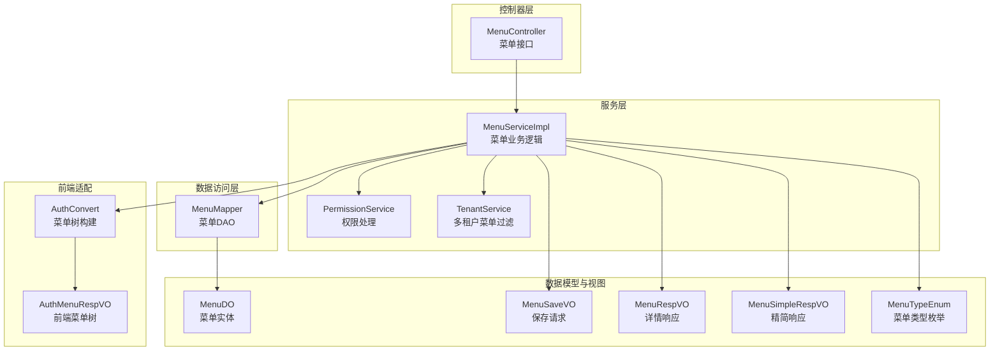
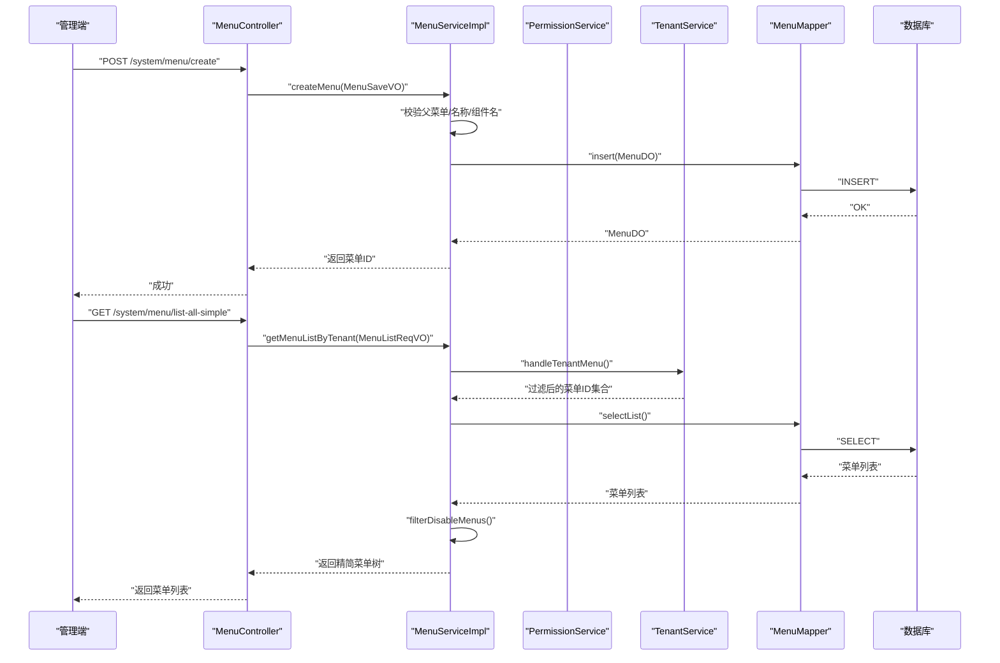
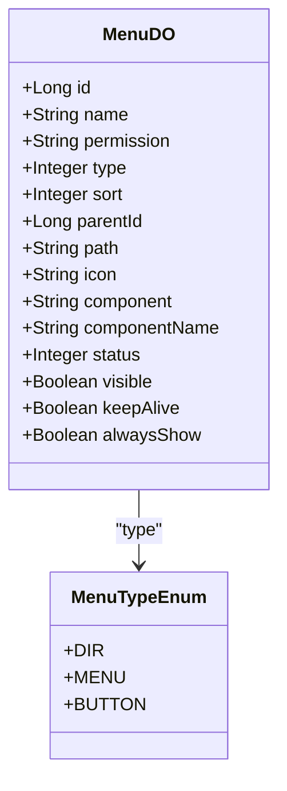
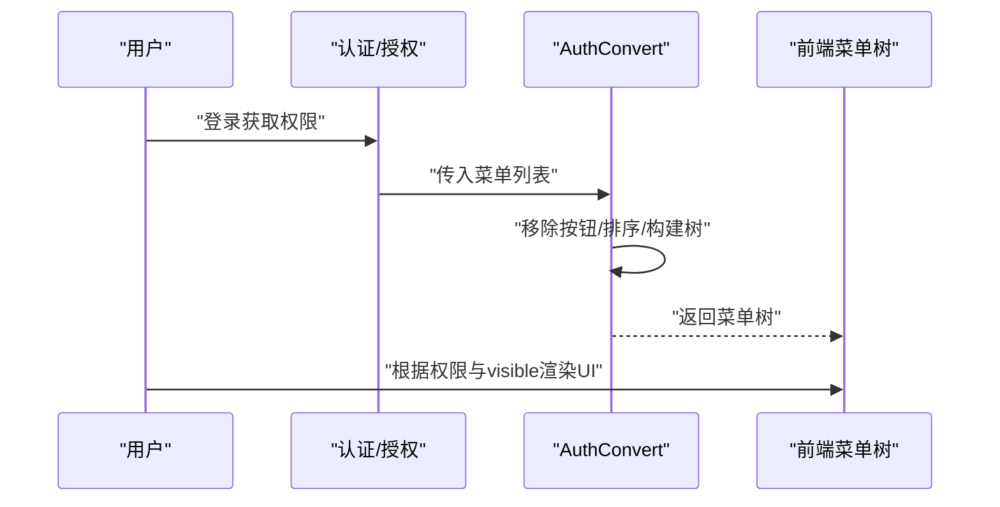
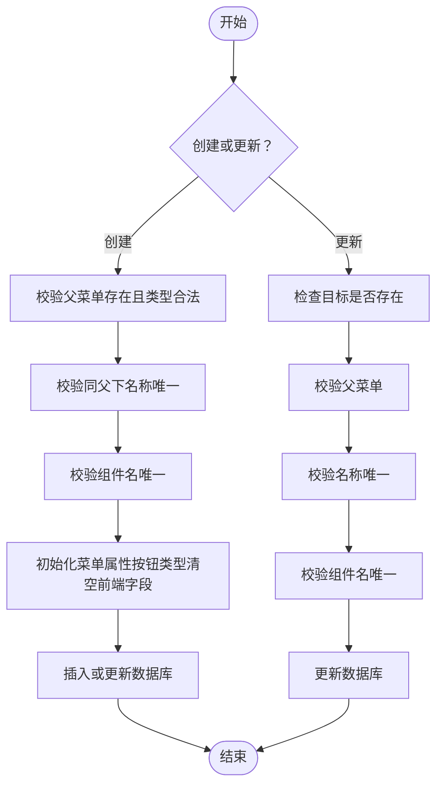
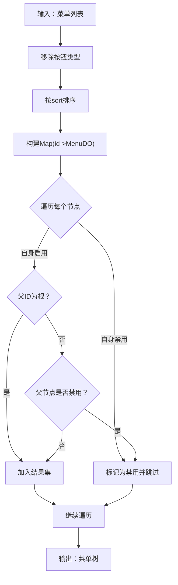
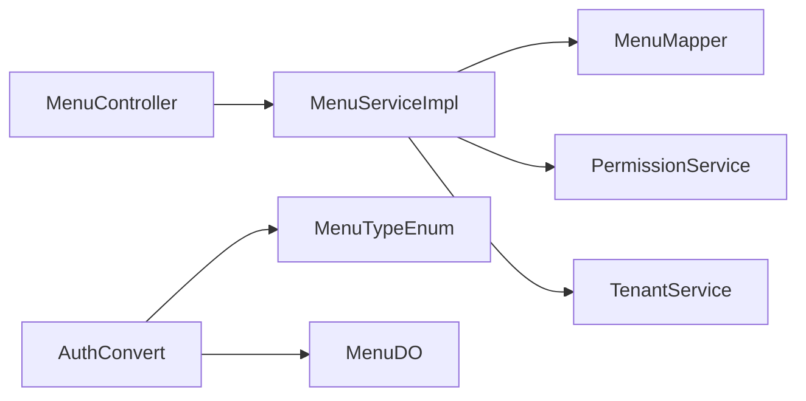

# 菜单管理

<cite>
**本文引用的文件**
- [MenuDO.java](file://yudao-module-system/src/main/java/cn/iocoder/yudao/module/system/dal/dataobject/permission/MenuDO.java)
- [MenuController.java](file://yudao-module-system/src/main/java/cn/iocoder/yudao/module/system/controller/admin/permission/MenuController.java)
- [MenuService.java](file://yudao-module-system/src/main/java/cn/iocoder/yudao/module/system/service/permission/MenuService.java)
- [MenuServiceImpl.java](file://yudao-module-system/src/main/java/cn/iocoder/yudao/module/system/service/permission/MenuServiceImpl.java)
- [MenuMapper.java](file://yudao-module-system/src/main/java/cn/iocoder/yudao/module/system/dal/mysql/permission/MenuMapper.java)
- [MenuTypeEnum.java](file://yudao-module-system/src/main/java/cn/iocoder/yudao/module/system/enums/permission/MenuTypeEnum.java)
- [MenuRespVO.java](file://yudao-module-system/src/main/java/cn/iocoder/yudao/module/system/controller/admin/permission/vo/menu/MenuRespVO.java)
- [MenuSaveVO.java](file://yudao-module-system/src/main/java/cn/iocoder/yudao/module/system/controller/admin/permission/vo/menu/MenuSaveVO.java)
- [MenuSimpleRespVO.java](file://yudao-module-system/src/main/java/cn/iocoder/yudao/module/system/controller/admin/permission/vo/menu/MenuSimpleRespVO.java)
- [AuthMenuRespVO.java](file://yudao-module-system/src/main/java/cn/iocoder/yudao/module/system/controller/admin/auth/vo/AuthMenuRespVO.java)
- [AuthConvert.java](file://yudao-module-system/src/main/java/cn/iocoder/yudao/module/system/convert/auth/AuthConvert.java)
- [PermissionAssignRoleMenuReqVO.java](file://yudao-module-system/src/main/java/cn/iocoder/yudao/module/system/controller/admin/permission/vo/permission/PermissionAssignRoleMenuReqVO.java)
- [RedisKeyConstants.java](file://yudao-module-system/src/main/java/cn/iocoder/yudao/module/system/dal/redis/RedisKeyConstants.java)
- [ruoyi-vue-pro.sql（MySQL）](file://sql/mysql/ruoyi-vue-pro.sql)
- [ruoyi-vue-pro.sql（PostgreSQL）](file://sql/postgresql/ruoyi-vue-pro.sql)
- [ruoyi-vue-pro.sql（SQLServer）](file://sql/sqlserver/ruoyi-vue-pro.sql)
- [ruoyi-vue-pro-dm8.sql（DM8）](file://sql/dm/ruoyi-vue-pro-dm8.sql)
</cite>

## 目录
1. [简介](#简介)
2. [项目结构](#项目结构)
3. [核心组件](#核心组件)
4. [架构总览](#架构总览)
5. [详细组件分析](#详细组件分析)
6. [依赖分析](#依赖分析)
7. [性能考量](#性能考量)
8. [故障排查指南](#故障排查指南)
9. [结论](#结论)
10. [附录](#附录)

## 简介
本指南围绕“菜单管理”功能，系统阐述业务需求与技术实现，覆盖菜单树形结构设计、层级关系、权限控制、增删改查、排序与显示隐藏、图标与组件配置、与权限系统的集成、缓存与懒加载策略、菜单树构建算法、接口定义、以及前端Vue组件的动态渲染实践。目标是帮助开发者快速理解并高效落地菜单管理能力。

## 项目结构
菜单管理相关代码主要分布在系统模块的“权限”子模块中，采用典型的分层架构：
- 控制器层：提供菜单管理的REST接口
- 服务层：封装菜单的业务逻辑、校验、缓存与租户过滤
- 数据访问层：MyBatis Mapper负责菜单数据的查询与更新
- 数据模型：MenuDO映射数据库表system_menu
- 视图对象：MenuSaveVO/MenuRespVO/MenuSimpleRespVO用于接口入参与响应
- 枚举：MenuTypeEnum区分目录、菜单、按钮三类
- 转换器：AuthConvert将菜单列表转换为前端可用的菜单树

图表来源
- [MenuController.java:1-98](file://yudao-module-system/src/main/java/cn/iocoder/yudao/module/system/controller/admin/permission/MenuController.java#L1-L98)
- [MenuServiceImpl.java:1-308](file://yudao-module-system/src/main/java/cn/iocoder/yudao/module/system/service/permission/MenuServiceImpl.java#L1-L308)
- [MenuMapper.java:1-37](file://yudao-module-system/src/main/java/cn/iocoder/yudao/module/system/dal/mysql/permission/MenuMapper.java#L1-L37)
- [MenuDO.java:1-110](file://yudao-module-system/src/main/java/cn/iocoder/yudao/module/system/dal/dataobject/permission/MenuDO.java#L1-L110)
- [MenuSaveVO.java:1-66](file://yudao-module-system/src/main/java/cn/iocoder/yudao/module/system/controller/admin/permission/vo/menu/MenuSaveVO.java#L1-L66)
- [MenuRespVO.java:1-70](file://yudao-module-system/src/main/java/cn/iocoder/yudao/module/system/controller/admin/permission/vo/menu/MenuRespVO.java#L1-L70)
- [MenuSimpleRespVO.java:1-22](file://yudao-module-system/src/main/java/cn/iocoder/yudao/module/system/controller/admin/permission/vo/menu/MenuSimpleRespVO.java#L1-L22)
- [MenuTypeEnum.java:1-26](file://yudao-module-system/src/main/java/cn/iocoder/yudao/module/system/enums/permission/MenuTypeEnum.java#L1-L26)
- [AuthConvert.java:24-58](file://yudao-module-system/src/main/java/cn/iocoder/yudao/module/system/convert/auth/AuthConvert.java#L24-L58)
- [AuthMenuRespVO.java:1-54](file://yudao-module-system/src/main/java/cn/iocoder/yudao/module/system/controller/admin/auth/vo/AuthMenuRespVO.java#L1-L54)

章节来源
- [MenuController.java:1-98](file://yudao-module-system/src/main/java/cn/iocoder/yudao/module/system/controller/admin/permission/MenuController.java#L1-L98)
- [MenuServiceImpl.java:1-308](file://yudao-module-system/src/main/java/cn/iocoder/yudao/module/system/service/permission/MenuServiceImpl.java#L1-L308)
- [MenuMapper.java:1-37](file://yudao-module-system/src/main/java/cn/iocoder/yudao/module/system/dal/mysql/permission/MenuMapper.java#L1-L37)
- [MenuDO.java:1-110](file://yudao-module-system/src/main/java/cn/iocoder/yudao/module/system/dal/dataobject/permission/MenuDO.java#L1-L110)
- [MenuSaveVO.java:1-66](file://yudao-module-system/src/main/java/cn/iocoder/yudao/module/system/controller/admin/permission/vo/menu/MenuSaveVO.java#L1-L66)
- [MenuRespVO.java:1-70](file://yudao-module-system/src/main/java/cn/iocoder/yudao/module/system/controller/admin/permission/vo/menu/MenuRespVO.java#L1-L70)
- [MenuSimpleRespVO.java:1-22](file://yudao-module-system/src/main/java/cn/iocoder/yudao/module/system/controller/admin/permission/vo/menu/MenuSimpleRespVO.java#L1-L22)
- [MenuTypeEnum.java:1-26](file://yudao-module-system/src/main/java/cn/iocoder/yudao/module/system/enums/permission/MenuTypeEnum.java#L1-L26)
- [AuthConvert.java:24-58](file://yudao-module-system/src/main/java/cn/iocoder/yudao/module/system/convert/auth/AuthConvert.java#L24-L58)
- [AuthMenuRespVO.java:1-54](file://yudao-module-system/src/main/java/cn/iocoder/yudao/module/system/controller/admin/auth/vo/AuthMenuRespVO.java#L1-L54)

## 核心组件
- 菜单实体与字段
  - 菜单ID、名称、权限标识、类型、排序、父ID、路由地址、图标、组件路径、组件名、状态、可见性、缓存、总是显示等
  - 字段约束与语义详见数据库脚本与实体注释
- 菜单类型枚举
  - 目录、菜单、按钮三类，决定前端渲染与后端权限控制粒度
- 视图对象
  - 保存请求：MenuSaveVO
  - 详情响应：MenuRespVO
  - 精简响应：MenuSimpleRespVO（用于角色分配菜单）
- 控制器接口
  - 创建、更新、删除、批量删除、列表查询、精简列表、详情查询
- 服务实现
  - 校验父子关系、名称唯一性、组件名唯一性
  - 过滤禁用菜单、基于租户筛选菜单
  - 缓存菜单权限到ID列表
  - 删除菜单时联动清理角色授权
- 数据访问
  - 提供按权限查询、按父ID计数、按名称+父ID查询等常用方法

章节来源
- [MenuDO.java:1-110](file://yudao-module-system/src/main/java/cn/iocoder/yudao/module/system/dal/dataobject/permission/MenuDO.java#L1-L110)
- [MenuTypeEnum.java:1-26](file://yudao-module-system/src/main/java/cn/iocoder/yudao/module/system/enums/permission/MenuTypeEnum.java#L1-L26)
- [MenuSaveVO.java:1-66](file://yudao-module-system/src/main/java/cn/iocoder/yudao/module/system/controller/admin/permission/vo/menu/MenuSaveVO.java#L1-L66)
- [MenuRespVO.java:1-70](file://yudao-module-system/src/main/java/cn/iocoder/yudao/module/system/controller/admin/permission/vo/menu/MenuRespVO.java#L1-L70)
- [MenuSimpleRespVO.java:1-22](file://yudao-module-system/src/main/java/cn/iocoder/yudao/module/system/controller/admin/permission/vo/menu/MenuSimpleRespVO.java#L1-L22)
- [MenuController.java:1-98](file://yudao-module-system/src/main/java/cn/iocoder/yudao/module/system/controller/admin/permission/MenuController.java#L1-L98)
- [MenuServiceImpl.java:1-308](file://yudao-module-system/src/main/java/cn/iocoder/yudao/module/system/service/permission/MenuServiceImpl.java#L1-L308)
- [MenuMapper.java:1-37](file://yudao-module-system/src/main/java/cn/iocoder/yudao/module/system/dal/mysql/permission/MenuMapper.java#L1-L37)

## 架构总览
菜单管理遵循“控制器-服务-数据访问-数据模型”的分层设计，结合权限系统与多租户能力，形成完整的菜单生命周期管理闭环。

图表来源
- [MenuController.java:1-98](file://yudao-module-system/src/main/java/cn/iocoder/yudao/module/system/controller/admin/permission/MenuController.java#L1-L98)
- [MenuServiceImpl.java:1-308](file://yudao-module-system/src/main/java/cn/iocoder/yudao/module/system/service/permission/MenuServiceImpl.java#L1-L308)
- [MenuMapper.java:1-37](file://yudao-module-system/src/main/java/cn/iocoder/yudao/module/system/dal/mysql/permission/MenuMapper.java#L1-L37)

## 详细组件分析

### 菜单树形结构与层级关系
- 树形结构
  - 以parentId关联父节点，根节点ID为常量
  - 支持无限层级，通过递归或一次遍历构建
- 展示规则
  - 目录与菜单具备路由、图标、组件等前端渲染字段
  - 按sort升序排列
  - alwaysShow控制“单子菜单时不展示父级”
  - visible控制侧边栏可见性（不影响路由）

图表来源
- [MenuDO.java:1-110](file://yudao-module-system/src/main/java/cn/iocoder/yudao/module/system/dal/dataobject/permission/MenuDO.java#L1-L110)
- [MenuTypeEnum.java:1-26](file://yudao-module-system/src/main/java/cn/iocoder/yudao/module/system/enums/permission/MenuTypeEnum.java#L1-L26)

章节来源
- [MenuDO.java:1-110](file://yudao-module-system/src/main/java/cn/iocoder/yudao/module/system/dal/dataobject/permission/MenuDO.java#L1-L110)
- [MenuTypeEnum.java:1-26](file://yudao-module-system/src/main/java/cn/iocoder/yudao/module/system/enums/permission/MenuTypeEnum.java#L1-L26)

### 菜单权限控制与与前端集成
- 后端权限
  - permission字段作为资源标识，配合@PreAuthorize进行接口级权限控制
- 前端权限
  - AuthConvert将菜单列表转为前端菜单树，移除按钮类型
  - AuthMenuRespVO携带children，支持多级菜单渲染
  - 用户登录后获取AuthPermissionInfoRespVO，其中包含menus树与permissions集合，用于前端按钮级权限显隐

图表来源
- [AuthConvert.java:24-58](file://yudao-module-system/src/main/java/cn/iocoder/yudao/module/system/convert/auth/AuthConvert.java#L24-L58)
- [AuthMenuRespVO.java:1-54](file://yudao-module-system/src/main/java/cn/iocoder/yudao/module/system/controller/admin/auth/vo/AuthMenuRespVO.java#L1-L54)

章节来源
- [MenuDO.java:1-110](file://yudao-module-system/src/main/java/cn/iocoder/yudao/module/system/dal/dataobject/permission/MenuDO.java#L1-L110)
- [AuthConvert.java:24-58](file://yudao-module-system/src/main/java/cn/iocoder/yudao/module/system/convert/auth/AuthConvert.java#L24-L58)
- [AuthMenuRespVO.java:1-54](file://yudao-module-system/src/main/java/cn/iocoder/yudao/module/system/controller/admin/auth/vo/AuthMenuRespVO.java#L1-L54)

### 菜单增删改查与校验逻辑
- 创建
  - 校验父菜单存在且类型为目录或菜单
  - 校验同父下菜单名称唯一
  - 校验组件名唯一（非按钮类型）
  - 初始化按钮类型菜单的前端字段为空
- 更新
  - 校验目标存在、父菜单合法、名称与组件名唯一
- 删除
  - 若存在子菜单则禁止删除
  - 删除后联动清理角色授权
- 列表
  - 支持按名称与状态筛选
  - 按sort排序
- 精简列表
  - 仅返回启用状态菜单，用于角色分配

图表来源
- [MenuServiceImpl.java:50-123](file://yudao-module-system/src/main/java/cn/iocoder/yudao/module/system/service/permission/MenuServiceImpl.java#L50-L123)
- [MenuServiceImpl.java:221-288](file://yudao-module-system/src/main/java/cn/iocoder/yudao/module/system/service/permission/MenuServiceImpl.java#L221-L288)

章节来源
- [MenuServiceImpl.java:50-123](file://yudao-module-system/src/main/java/cn/iocoder/yudao/module/system/service/permission/MenuServiceImpl.java#L50-L123)
- [MenuServiceImpl.java:221-288](file://yudao-module-system/src/main/java/cn/iocoder/yudao/module/system/service/permission/MenuServiceImpl.java#L221-L288)

### 菜单排序、显示隐藏与图标配置
- 排序
  - 使用sort字段，后端查询时统一按sort升序
- 显示隐藏
  - visible控制侧边栏可见性；alwaysShow控制“单子菜单时不展示父级”
- 图标与组件
  - 目录/菜单类型支持icon、path、component、componentName
  - 按钮类型自动清空上述字段

章节来源
- [MenuDO.java:1-110](file://yudao-module-system/src/main/java/cn/iocoder/yudao/module/system/dal/dataobject/permission/MenuDO.java#L1-L110)
- [MenuServiceImpl.java:297-305](file://yudao-module-system/src/main/java/cn/iocoder/yudao/module/system/service/permission/MenuServiceImpl.java#L297-L305)
- [MenuController.java:69-95](file://yudao-module-system/src/main/java/cn/iocoder/yudao/module/system/controller/admin/permission/MenuController.java#L69-L95)

### 菜单树构建算法与禁用菜单过滤
- 禁用过滤
  - 从叶子节点向上回溯，若任一祖先被禁用，则整条链路不可见
- 菜单树
  - 移除按钮类型
  - 按sort排序
  - 递归构建children

图表来源
- [MenuServiceImpl.java:139-183](file://yudao-module-system/src/main/java/cn/iocoder/yudao/module/system/service/permission/MenuServiceImpl.java#L139-L183)
- [AuthConvert.java:43-58](file://yudao-module-system/src/main/java/cn/iocoder/yudao/module/system/convert/auth/AuthConvert.java#L43-L58)

章节来源
- [MenuServiceImpl.java:139-183](file://yudao-module-system/src/main/java/cn/iocoder/yudao/module/system/service/permission/MenuServiceImpl.java#L139-L183)
- [AuthConvert.java:43-58](file://yudao-module-system/src/main/java/cn/iocoder/yudao/module/system/convert/auth/AuthConvert.java#L43-L58)

### 缓存策略与懒加载机制
- 缓存键
  - 使用RedisKeyConstants.PERMISSION_MENU_ID_LIST作为缓存命名空间
- 缓存内容
  - 以permission为key，缓存对应的所有菜单ID列表
- 缓存失效
  - 创建/更新/删除菜单时，针对permission或全量清理，确保一致性
- 懒加载
  - 前端按需加载子菜单，后端通过树构建减少重复查询

章节来源
- [MenuServiceImpl.java:190-195](file://yudao-module-system/src/main/java/cn/iocoder/yudao/module/system/service/permission/MenuServiceImpl.java#L190-L195)
- [MenuServiceImpl.java:50-123](file://yudao-module-system/src/main/java/cn/iocoder/yudao/module/system/service/permission/MenuServiceImpl.java#L50-L123)
- [RedisKeyConstants.java](file://yudao-module-system/src/main/java/cn/iocoder/yudao/module/system/dal/redis/RedisKeyConstants.java)

### 数据模型与数据库设计
- 表system_menu字段
  - 包含id、name、permission、type、sort、parentId、path、icon、component、componentName、status、visible、keepAlive、alwaysShow等
- 外键与索引
  - parentId用于树形关联
  - 建议在name+parentId、permission上建立索引以优化查询
- 多数据库兼容
  - MySQL、PostgreSQL、SQLServer、DM8等脚本均包含完整字段定义

章节来源
- [ruoyi-vue-pro.sql（MySQL）](file://sql/mysql/ruoyi-vue-pro.sql)
- [ruoyi-vue-pro.sql（PostgreSQL）:1758-1787](file://sql/postgresql/ruoyi-vue-pro.sql#L1758-L1787)
- [ruoyi-vue-pro.sql（SQLServer）:4271-4413](file://sql/sqlserver/ruoyi-vue-pro.sql#L4271-L4413)
- [ruoyi-vue-pro-dm8.sql（DM8）:1600-1624](file://sql/dm/ruoyi-vue-pro-dm8.sql#L1600-L1624)

### 前端Vue组件使用与动态渲染
- 后端提供两种菜单数据
  - 管理端菜单列表：用于菜单管理界面
  - 登录用户菜单树：用于前端侧边栏与面包屑
- 前端渲染要点
  - 使用AuthMenuRespVO的children递归渲染
  - 根据visible与alwaysShow控制展示
  - 根据permission集合控制按钮级显隐
- 角色分配菜单
  - 使用精简列表（MenuSimpleRespVO），仅返回启用状态菜单

章节来源
- [MenuController.java:69-95](file://yudao-module-system/src/main/java/cn/iocoder/yudao/module/system/controller/admin/permission/MenuController.java#L69-L95)
- [AuthMenuRespVO.java:1-54](file://yudao-module-system/src/main/java/cn/iocoder/yudao/module/system/controller/admin/auth/vo/AuthMenuRespVO.java#L1-L54)
- [MenuSimpleRespVO.java:1-22](file://yudao-module-system/src/main/java/cn/iocoder/yudao/module/system/controller/admin/permission/vo/menu/MenuSimpleRespVO.java#L1-L22)

## 依赖分析
- 组件耦合
  - MenuController依赖MenuService
  - MenuServiceImpl依赖MenuMapper、PermissionService、TenantService
  - AuthConvert依赖MenuTypeEnum与MenuDO
- 外部依赖
  - Redis缓存（键空间PERMISSION_MENU_ID_LIST）
  - 多租户服务TenantService
  - 权限服务PermissionService（菜单删除联动清理）

图表来源
- [MenuController.java:1-98](file://yudao-module-system/src/main/java/cn/iocoder/yudao/module/system/controller/admin/permission/MenuController.java#L1-L98)
- [MenuServiceImpl.java:1-308](file://yudao-module-system/src/main/java/cn/iocoder/yudao/module/system/service/permission/MenuServiceImpl.java#L1-L308)
- [MenuMapper.java:1-37](file://yudao-module-system/src/main/java/cn/iocoder/yudao/module/system/dal/mysql/permission/MenuMapper.java#L1-L37)
- [AuthConvert.java:24-58](file://yudao-module-system/src/main/java/cn/iocoder/yudao/module/system/convert/auth/AuthConvert.java#L24-L58)

章节来源
- [MenuController.java:1-98](file://yudao-module-system/src/main/java/cn/iocoder/yudao/module/system/controller/admin/permission/MenuController.java#L1-L98)
- [MenuServiceImpl.java:1-308](file://yudao-module-system/src/main/java/cn/iocoder/yudao/module/system/service/permission/MenuServiceImpl.java#L1-L308)
- [MenuMapper.java:1-37](file://yudao-module-system/src/main/java/cn/iocoder/yudao/module/system/dal/mysql/permission/MenuMapper.java#L1-L37)
- [AuthConvert.java:24-58](file://yudao-module-system/src/main/java/cn/iocoder/yudao/module/system/convert/auth/AuthConvert.java#L24-L58)

## 性能考量
- 查询优化
  - 在name、status、parentId、permission等字段建立索引
  - 列表查询使用模糊/等值条件组合，避免全表扫描
- 缓存策略
  - 以permission为key缓存菜单ID列表，降低重复查询成本
  - 写操作时按需清理，避免脏读
- 构建效率
  - 一次性拉取全量菜单，服务端构建树，避免前端多次请求
- 分页与租户
  - 精简列表默认启用状态，结合租户过滤，减少数据量

## 故障排查指南
- 常见错误与定位
  - 父菜单不存在或类型非法：检查parentId与MenuTypeEnum
  - 菜单名称重复：同一父下重名冲突
  - 组件名重复：全局唯一约束
  - 删除失败（存在子菜单）：先删除子菜单再删除父级
- 日志与异常
  - 服务层抛出具体错误码，便于前端提示
- 缓存问题
  - 更新/删除后未生效：确认缓存键空间与清理策略

章节来源
- [MenuServiceImpl.java:70-123](file://yudao-module-system/src/main/java/cn/iocoder/yudao/module/system/service/permission/MenuServiceImpl.java#L70-L123)
- [MenuServiceImpl.java:221-288](file://yudao-module-system/src/main/java/cn/iocoder/yudao/module/system/service/permission/MenuServiceImpl.java#L221-L288)

## 结论
本方案以清晰的分层架构、完善的校验与缓存策略、以及与权限系统的深度集成，实现了高可用、易扩展的菜单管理能力。通过树构建与禁用过滤，既能满足复杂业务的菜单组织，也能保障前端渲染的正确性与性能。

## 附录

### 接口定义（菜单管理）
- 创建菜单
  - 方法：POST
  - 路径：/system/menu/create
  - 权限：system:menu:create
  - 请求体：MenuSaveVO
  - 返回：菜单ID
- 更新菜单
  - 方法：PUT
  - 路径：/system/menu/update
  - 权限：system:menu:update
  - 请求体：MenuSaveVO
  - 返回：true
- 删除菜单
  - 方法：DELETE
  - 路径：/system/menu/delete?id={id}
  - 权限：system:menu:delete
  - 返回：true
- 批量删除
  - 方法：DELETE
  - 路径：/system/menu/delete-list?ids=...
  - 权限：system:menu:delete
  - 返回：true
- 获取菜单列表
  - 方法：GET
  - 路径：/system/menu/list
  - 权限：system:menu:query
  - 查询参数：MenuListReqVO（name、status）
  - 返回：List<MenuRespVO>
- 获取精简菜单列表
  - 方法：GET
  - 路径：/system/menu/list-all-simple 或 /system/menu/simple-list
  - 返回：List<MenuSimpleRespVO>
- 获取菜单详情
  - 方法：GET
  - 路径：/system/menu/get?id={id}
  - 权限：system:menu:query
  - 返回：MenuRespVO

章节来源
- [MenuController.java:35-95](file://yudao-module-system/src/main/java/cn/iocoder/yudao/module/system/controller/admin/permission/MenuController.java#L35-L95)

### 角色分配菜单接口
- 赋予角色菜单
  - 方法：POST/PUT（视具体实现）
  - 路径：/system/permission/assign-role-menu
  - 请求体：PermissionAssignRoleMenuReqVO（roleId、menuIds）
  - 返回：布尔值

章节来源
- [PermissionAssignRoleMenuReqVO.java:1-21](file://yudao-module-system/src/main/java/cn/iocoder/yudao/module/system/controller/admin/permission/vo/permission/PermissionAssignRoleMenuReqVO.java#L1-L21)

### 前端菜单树结构
- AuthMenuRespVO
  - 字段：id、parentId、name、path、component、componentName、icon、visible、keepAlive、alwaysShow、children
  - 用途：前端侧边栏与路由生成

章节来源
- [AuthMenuRespVO.java:1-54](file://yudao-module-system/src/main/java/cn/iocoder/yudao/module/system/controller/admin/auth/vo/AuthMenuRespVO.java#L1-L54)