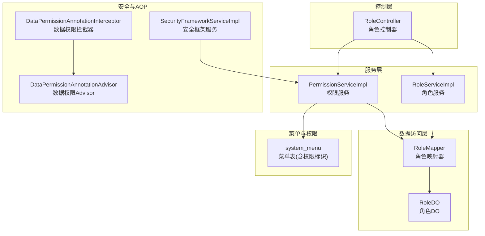
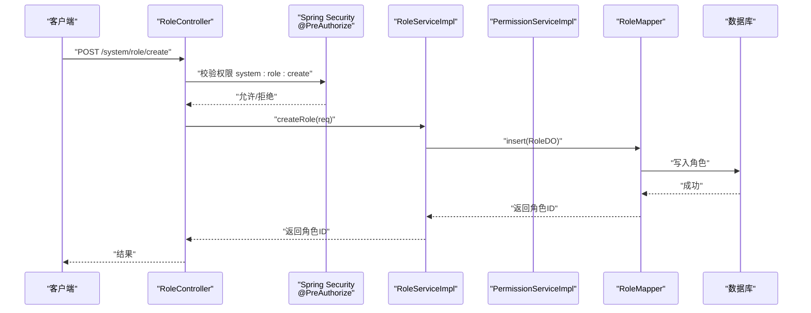
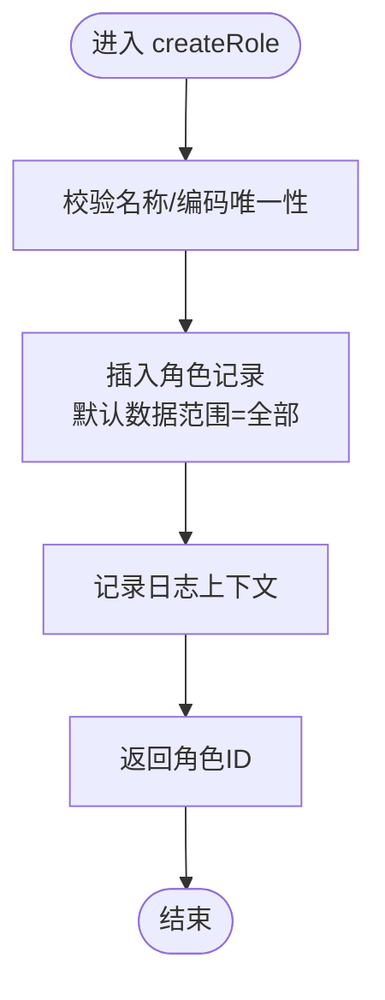
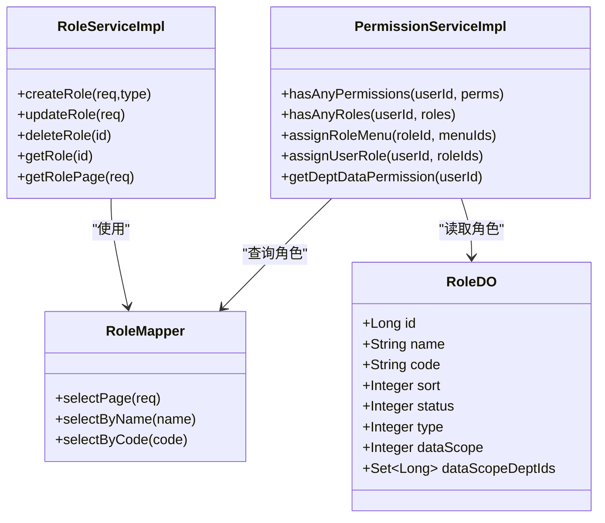
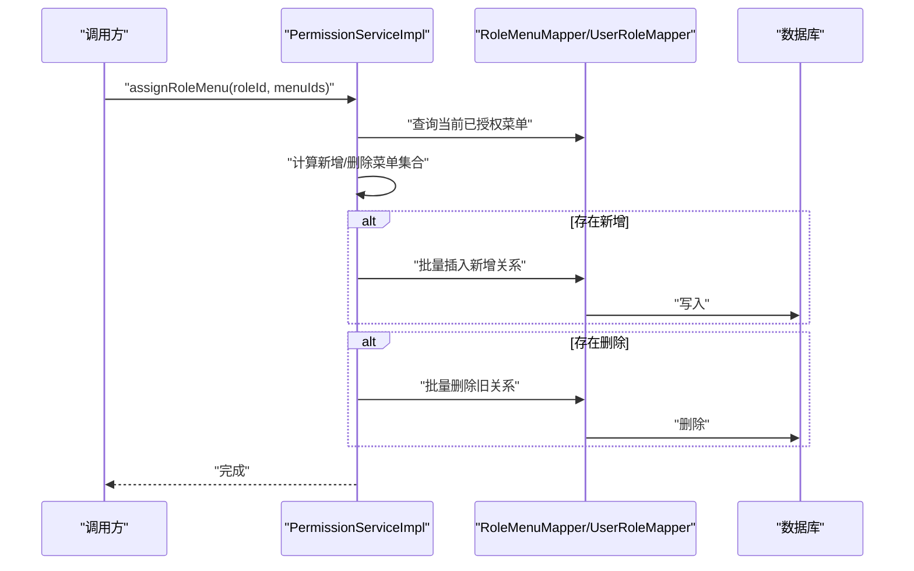
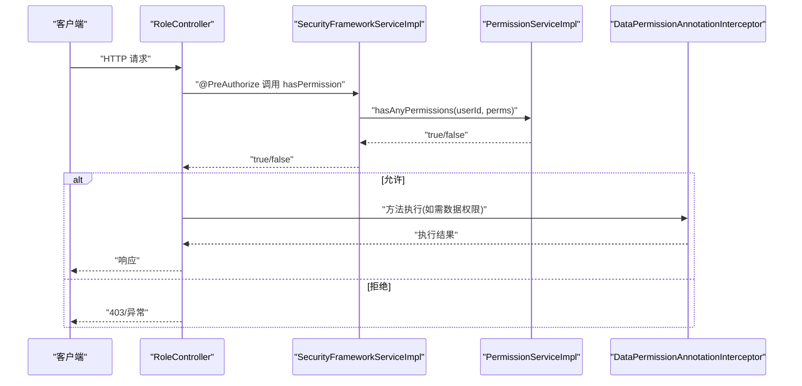
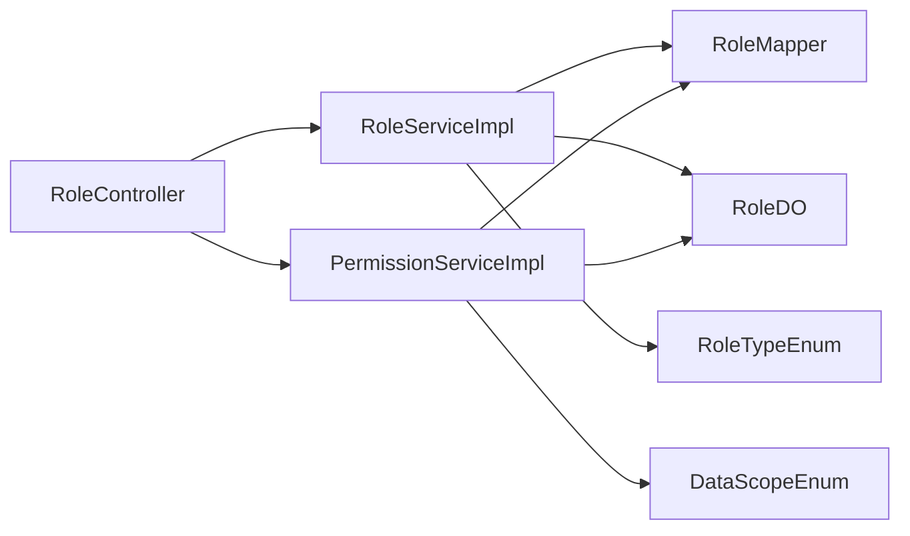

# 角色权限管理

<cite>
**本文引用的文件**   
- [RoleController.java](file://yudao-module-system/src/main/java/cn/iocoder/yudao/module/system/controller/admin/permission/RoleController.java)
- [RoleServiceImpl.java](file://yudao-module-system/src/main/java/cn/iocoder/yudao/module/system/service/permission/RoleServiceImpl.java)
- [PermissionServiceImpl.java](file://yudao-module-system/src/main/java/cn/iocoder/yudao/module/system/service/permission/PermissionServiceImpl.java)
- [RoleDO.java](file://yudao-module-system/src/main/java/cn/iocoder/yudao/module/system/dal/dataobject/permission/RoleDO.java)
- [RoleMapper.java](file://yudao-module-system/src/main/java/cn/iocoder/yudao/module/system/dal/mysql/permission/RoleMapper.java)
- [RoleTypeEnum.java](file://yudao-module-system/src/main/java/cn/iocoder/yudao/module/system/enums/permission/RoleTypeEnum.java)
- [DataScopeEnum.java](file://yudao-module-system/src/main/java/cn/iocoder/yudao/module/system/enums/permission/DataScopeEnum.java)
- [RoleSaveReqVO.java](file://yudao-module-system/src/main/java/cn/iocoder/yudao/module/system/controller/admin/permission/vo/role/RoleSaveReqVO.java)
- [PermissionAssignRoleMenuReqVO.java](file://yudao-module-system/src/main/java/cn/iocoder/yudao/module/system/controller/admin/permission/vo/permission/PermissionAssignRoleMenuReqVO.java)
- [SecurityFrameworkServiceImpl.java](file://yudao-framework/yudao-spring-boot-starter-security/src/main/java/cn/iocoder/yudao/framework/security/core/service/SecurityFrameworkServiceImpl.java)
- [DataPermissionAnnotationInterceptor.java](file://yudao-framework/yudao-spring-boot-starter-biz-data-permission/src/main/java/cn/iocoder/yudao/framework/datapermission/core/aop/DataPermissionAnnotationInterceptor.java)
- [DataPermissionAnnotationAdvisor.java](file://yudao-framework/yudao-spring-boot-starter-biz-data-permission/src/main/java/cn/iocoder/yudao/framework/datapermission/core/aop/DataPermissionAnnotationAdvisor.java)
- [ruoyi-vue-pro.sql](file://sql/sqlserver/ruoyi-vue-pro.sql)
</cite>

## 目录
1. [简介](#简介)
2. [项目结构](#项目结构)
3. [核心组件](#核心组件)
4. [架构总览](#架构总览)
5. [详细组件分析](#详细组件分析)
6. [依赖分析](#依赖分析)
7. [性能考量](#性能考量)
8. [故障排查指南](#故障排查指南)
9. [结论](#结论)
10. [附录](#附录)

## 简介
本文件面向角色权限管理功能，系统化阐述基于角色的访问控制（RBAC）模型在系统中的实现方式，覆盖角色创建、权限分配、角色继承（通过超级管理员角色与数据范围）、角色与用户的绑定、角色与菜单的关联、权限表达式与动态权限判断、以及权限验证在系统中的执行流程与AOP切面拦截机制。同时提供完整的API接口清单、数据流向图、最佳实践与安全建议，帮助开发者构建健壮的权限控制系统。

## 项目结构
围绕角色权限管理的关键模块与文件如下：
- 控制层：角色控制器负责对外暴露REST接口，统一鉴权入口
- 服务层：角色服务与权限服务分别处理角色生命周期与权限判定/分配
- 数据访问层：角色映射器与DO模型定义角色表结构
- 枚举与VO：角色类型、数据范围、请求/响应参数模型
- 安全框架：权限校验服务对接登录用户与权限API
- 数据权限AOP：数据权限注解拦截器与Advisor，避免递归与提升可维护性
- 菜单权限：数据库中菜单记录包含权限标识，用于权限表达式匹配

图表来源
- [RoleController.java:33-112](file://yudao-module-system/src/main/java/cn/iocoder/yudao/module/system/controller/admin/permission/RoleController.java#L33-L112)
- [RoleServiceImpl.java:44-275](file://yudao-module-system/src/main/java/cn/iocoder/yudao/module/system/service/permission/RoleServiceImpl.java#L44-L275)
- [PermissionServiceImpl.java:44-342](file://yudao-module-system/src/main/java/cn/iocoder/yudao/module/system/service/permission/PermissionServiceImpl.java#L44-L342)
- [RoleMapper.java:15-40](file://yudao-module-system/src/main/java/cn/iocoder/yudao/module/system/dal/mysql/permission/RoleMapper.java#L15-L40)
- [RoleDO.java:22-79](file://yudao-module-system/src/main/java/cn/iocoder/yudao/module/system/dal/dataobject/permission/RoleDO.java#L22-L79)
- [SecurityFrameworkServiceImpl.java:19-43](file://yudao-framework/yudao-spring-boot-starter-security/src/main/java/cn/iocoder/yudao/framework/security/core/service/SecurityFrameworkServiceImpl.java#L19-L43)
- [DataPermissionAnnotationInterceptor.java:21-34](file://yudao-framework/yudao-spring-boot-starter-biz-data-permission/src/main/java/cn/iocoder/yudao/framework/datapermission/core/aop/DataPermissionAnnotationInterceptor.java#L21-L34)
- [DataPermissionAnnotationAdvisor.java:17-36](file://yudao-framework/yudao-spring-boot-starter-biz-data-permission/src/main/java/cn/iocoder/yudao/framework/datapermission/core/aop/DataPermissionAnnotationAdvisor.java#L17-L36)
- [ruoyi-vue-pro.sql:4589-4595](file://sql/sqlserver/ruoyi-vue-pro.sql#L4589-L4595)

章节来源
- [RoleController.java:33-112](file://yudao-module-system/src/main/java/cn/iocoder/yudao/module/system/controller/admin/permission/RoleController.java#L33-L112)
- [RoleServiceImpl.java:44-275](file://yudao-module-system/src/main/java/cn/iocoder/yudao/module/system/service/permission/RoleServiceImpl.java#L44-L275)
- [PermissionServiceImpl.java:44-342](file://yudao-module-system/src/main/java/cn/iocoder/yudao/module/system/service/permission/PermissionServiceImpl.java#L44-L342)
- [RoleMapper.java:15-40](file://yudao-module-system/src/main/java/cn/iocoder/yudao/module/system/dal/mysql/permission/RoleMapper.java#L15-L40)
- [RoleDO.java:22-79](file://yudao-module-system/src/main/java/cn/iocoder/yudao/module/system/dal/dataobject/permission/RoleDO.java#L22-L79)
- [SecurityFrameworkServiceImpl.java:19-43](file://yudao-framework/yudao-spring-boot-starter-security/src/main/java/cn/iocoder/yudao/framework/security/core/service/SecurityFrameworkServiceImpl.java#L19-L43)
- [DataPermissionAnnotationInterceptor.java:21-34](file://yudao-framework/yudao-spring-boot-starter-biz-data-permission/src/main/java/cn/iocoder/yudao/framework/datapermission/core/aop/DataPermissionAnnotationInterceptor.java#L21-L34)
- [DataPermissionAnnotationAdvisor.java:17-36](file://yudao-framework/yudao-spring-boot-starter-biz-data-permission/src/main/java/cn/iocoder/yudao/framework/datapermission/core/aop/DataPermissionAnnotationAdvisor.java#L17-L36)
- [ruoyi-vue-pro.sql:4589-4595](file://sql/sqlserver/ruoyi-vue-pro.sql#L4589-L4595)

## 核心组件
- 角色控制器：提供角色的创建、更新、删除、批量删除、查询、分页、导出等接口；统一通过Spring Security的@PreAuthorize进行权限校验
- 角色服务：负责角色的创建、更新、删除、校验、缓存、分页查询、角色列表与校验等
- 权限服务：负责权限表达式解析、角色-菜单授权、用户-角色授权、数据权限计算、菜单-角色缓存管理等
- 角色DO与映射器：定义角色表结构、唯一性约束、分页查询条件、按状态/编码/名称查询
- 枚举：角色类型（内置/自定义）、数据范围（全部/部门/本人等）
- 请求/响应VO：角色保存/更新、角色分页、角色菜单授权等参数模型
- 安全框架服务：封装权限校验入口，结合登录用户ID与权限API进行动态判断
- 数据权限AOP：通过注解拦截器与Advisor，实现方法级数据权限开关，避免递归与提升可维护性
- 菜单权限：system_menu表中permission字段作为权限表达式，用于权限匹配

章节来源
- [RoleController.java:33-112](file://yudao-module-system/src/main/java/cn/iocoder/yudao/module/system/controller/admin/permission/RoleController.java#L33-L112)
- [RoleServiceImpl.java:44-275](file://yudao-module-system/src/main/java/cn/iocoder/yudao/module/system/service/permission/RoleServiceImpl.java#L44-L275)
- [PermissionServiceImpl.java:44-342](file://yudao-module-system/src/main/java/cn/iocoder/yudao/module/system/service/permission/PermissionServiceImpl.java#L44-L342)
- [RoleDO.java:22-79](file://yudao-module-system/src/main/java/cn/iocoder/yudao/module/system/dal/dataobject/permission/RoleDO.java#L22-L79)
- [RoleMapper.java:15-40](file://yudao-module-system/src/main/java/cn/iocoder/yudao/module/system/dal/mysql/permission/RoleMapper.java#L15-L40)
- [RoleTypeEnum.java:8-22](file://yudao-module-system/src/main/java/cn/iocoder/yudao/module/system/enums/permission/RoleTypeEnum.java#L8-L22)
- [DataScopeEnum.java:16-41](file://yudao-module-system/src/main/java/cn/iocoder/yudao/module/system/enums/permission/DataScopeEnum.java#L16-L41)
- [RoleSaveReqVO.java:12-48](file://yudao-module-system/src/main/java/cn/iocoder/yudao/module/system/controller/admin/permission/vo/role/RoleSaveReqVO.java#L12-L48)
- [PermissionAssignRoleMenuReqVO.java:10-21](file://yudao-module-system/src/main/java/cn/iocoder/yudao/module/system/controller/admin/permission/vo/permission/PermissionAssignRoleMenuReqVO.java#L10-L21)
- [SecurityFrameworkServiceImpl.java:19-43](file://yudao-framework/yudao-spring-boot-starter-security/src/main/java/cn/iocoder/yudao/framework/security/core/service/SecurityFrameworkServiceImpl.java#L19-L43)
- [DataPermissionAnnotationInterceptor.java:21-34](file://yudao-framework/yudao-spring-boot-starter-biz-data-permission/src/main/java/cn/iocoder/yudao/framework/datapermission/core/aop/DataPermissionAnnotationInterceptor.java#L21-L34)
- [DataPermissionAnnotationAdvisor.java:17-36](file://yudao-framework/yudao-spring-boot-starter-biz-data-permission/src/main/java/cn/iocoder/yudao/framework/datapermission/core/aop/DataPermissionAnnotationAdvisor.java#L17-L36)
- [ruoyi-vue-pro.sql:4589-4595](file://sql/sqlserver/ruoyi-vue-pro.sql#L4589-L4595)

## 架构总览
角色权限管理采用“控制器-服务-数据访问-安全/AOP”的分层架构，核心流程：
- 控制器接收请求并进行基础校验与权限拦截
- 服务层完成业务逻辑（角色生命周期、权限表达式匹配、角色-菜单/用户授权、数据权限计算）
- 数据访问层持久化与缓存（Redis Key常量由服务层统一使用）
- 安全框架服务与AOP拦截器贯穿权限判断与数据权限控制

图表来源
- [RoleController.java:42-47](file://yudao-module-system/src/main/java/cn/iocoder/yudao/module/system/controller/admin/permission/RoleController.java#L42-L47)
- [RoleServiceImpl.java:54-72](file://yudao-module-system/src/main/java/cn/iocoder/yudao/module/system/service/permission/RoleServiceImpl.java#L54-L72)
- [RoleMapper.java:15-40](file://yudao-module-system/src/main/java/cn/iocoder/yudao/module/system/dal/mysql/permission/RoleMapper.java#L15-L40)

## 详细组件分析

### 角色管理（创建/更新/删除/查询/分页/导出）
- 创建角色：校验唯一性（名称/编码），默认数据范围为“全部”，插入数据库并记录日志上下文
- 更新角色：校验可更新性（非内置角色），校验唯一性，更新并记录差异日志
- 删除角色：校验可删除性，标记删除并清理角色相关的用户与菜单授权
- 查询与分页：支持按名称/编码/状态/创建时间过滤，排序字段为sort
- 导出Excel：导出全部角色数据

图表来源
- [RoleServiceImpl.java:54-72](file://yudao-module-system/src/main/java/cn/iocoder/yudao/module/system/service/permission/RoleServiceImpl.java#L54-L72)
- [RoleMapper.java:27-33](file://yudao-module-system/src/main/java/cn/iocoder/yudao/module/system/dal/mysql/permission/RoleMapper.java#L27-L33)

章节来源
- [RoleController.java:42-97](file://yudao-module-system/src/main/java/cn/iocoder/yudao/module/system/controller/admin/permission/RoleController.java#L42-L97)
- [RoleServiceImpl.java:54-135](file://yudao-module-system/src/main/java/cn/iocoder/yudao/module/system/service/permission/RoleServiceImpl.java#L54-L135)
- [RoleMapper.java:15-40](file://yudao-module-system/src/main/java/cn/iocoder/yudao/module/system/dal/mysql/permission/RoleMapper.java#L15-L40)
- [RoleSaveReqVO.java:12-48](file://yudao-module-system/src/main/java/cn/iocoder/yudao/module/system/controller/admin/permission/vo/role/RoleSaveReqVO.java#L12-L48)

### 权限控制与RBAC模型
- RBAC模型要素
  - 角色：系统角色（内置）与自定义角色
  - 用户：通过用户-角色关联
  - 菜单：通过角色-菜单关联
  - 权限表达式：system_menu.permission字段作为权限标识
- 动态权限判断
  - hasAnyPermissions：给定用户，任一权限满足即通过；若用户拥有超级管理员角色则直接通过
  - hasAnyRoles：给定用户，任一角色满足即通过
  - 菜单-角色匹配：根据权限表达式获取菜单ID集合，再查对应角色集合，取交集判断
- 数据权限
  - 基于角色的数据范围枚举（全部/部门/本人等），结合部门树计算可见范围
  - 使用@DSTransactional保证多数据源事务一致性
  - 通过@CacheEvict与@Cacheable管理菜单-角色、用户-角色、权限-菜单ID等缓存

图表来源
- [RoleDO.java:22-79](file://yudao-module-system/src/main/java/cn/iocoder/yudao/module/system/dal/dataobject/permission/RoleDO.java#L22-L79)
- [RoleServiceImpl.java:44-275](file://yudao-module-system/src/main/java/cn/iocoder/yudao/module/system/service/permission/RoleServiceImpl.java#L44-L275)
- [PermissionServiceImpl.java:44-342](file://yudao-module-system/src/main/java/cn/iocoder/yudao/module/system/service/permission/PermissionServiceImpl.java#L44-L342)
- [RoleMapper.java:15-40](file://yudao-module-system/src/main/java/cn/iocoder/yudao/module/system/dal/mysql/permission/RoleMapper.java#L15-L40)

章节来源
- [PermissionServiceImpl.java:62-129](file://yudao-module-system/src/main/java/cn/iocoder/yudao/module/system/service/permission/PermissionServiceImpl.java#L62-L129)
- [PermissionServiceImpl.java:133-195](file://yudao-module-system/src/main/java/cn/iocoder/yudao/module/system/service/permission/PermissionServiceImpl.java#L133-L195)
- [PermissionServiceImpl.java:205-245](file://yudao-module-system/src/main/java/cn/iocoder/yudao/module/system/service/permission/PermissionServiceImpl.java#L205-L245)
- [PermissionServiceImpl.java:270-330](file://yudao-module-system/src/main/java/cn/iocoder/yudao/module/system/service/permission/PermissionServiceImpl.java#L270-L330)
- [DataScopeEnum.java:16-41](file://yudao-module-system/src/main/java/cn/iocoder/yudao/module/system/enums/permission/DataScopeEnum.java#L16-L41)

### 角色-菜单与角色-用户绑定
- 角色-菜单：assignRoleMenu通过计算差集进行批量新增/删除，事务与缓存一致性由服务层保障
- 角色-用户：assignUserRole通过计算差集进行批量新增/删除，事务与缓存一致性由服务层保障
- 删除处理：processRoleDeleted与processUserDeleted清理关联表，避免脏数据

图表来源
- [PermissionServiceImpl.java:133-160](file://yudao-module-system/src/main/java/cn/iocoder/yudao/module/system/service/permission/PermissionServiceImpl.java#L133-L160)
- [PermissionServiceImpl.java:205-228](file://yudao-module-system/src/main/java/cn/iocoder/yudao/module/system/service/permission/PermissionServiceImpl.java#L205-L228)

章节来源
- [PermissionServiceImpl.java:133-195](file://yudao-module-system/src/main/java/cn/iocoder/yudao/module/system/service/permission/PermissionServiceImpl.java#L133-L195)
- [PermissionServiceImpl.java:205-245](file://yudao-module-system/src/main/java/cn/iocoder/yudao/module/system/service/permission/PermissionServiceImpl.java#L205-L245)

### 权限验证执行流程与AOP拦截
- 控制器层：@PreAuthorize("@ss.hasPermission('...')")对HTTP接口进行权限拦截
- 安全框架：SecurityFrameworkServiceImpl根据登录用户ID调用权限API进行动态判断
- 数据权限AOP：DataPermissionAnnotationInterceptor在方法执行前后入栈/出栈注解，DataPermissionAnnotationAdvisor组合类/方法注解切入点

图表来源
- [RoleController.java:42-64](file://yudao-module-system/src/main/java/cn/iocoder/yudao/module/system/controller/admin/permission/RoleController.java#L42-L64)
- [SecurityFrameworkServiceImpl.java:24-42](file://yudao-framework/yudao-spring-boot-starter-security/src/main/java/cn/iocoder/yudao/framework/security/core/service/SecurityFrameworkServiceImpl.java#L24-L42)
- [DataPermissionAnnotationInterceptor.java:32-34](file://yudao-framework/yudao-spring-boot-starter-biz-data-permission/src/main/java/cn/iocoder/yudao/framework/datapermission/core/aop/DataPermissionAnnotationInterceptor.java#L32-L34)
- [DataPermissionAnnotationAdvisor.java:25-34](file://yudao-framework/yudao-spring-boot-starter-biz-data-permission/src/main/java/cn/iocoder/yudao/framework/datapermission/core/aop/DataPermissionAnnotationAdvisor.java#L25-L34)

章节来源
- [SecurityFrameworkServiceImpl.java:19-43](file://yudao-framework/yudao-spring-boot-starter-security/src/main/java/cn/iocoder/yudao/framework/security/core/service/SecurityFrameworkServiceImpl.java#L19-L43)
- [DataPermissionAnnotationInterceptor.java:21-34](file://yudao-framework/yudao-spring-boot-starter-biz-data-permission/src/main/java/cn/iocoder/yudao/framework/datapermission/core/aop/DataPermissionAnnotationInterceptor.java#L21-L34)
- [DataPermissionAnnotationAdvisor.java:17-36](file://yudao-framework/yudao-spring-boot-starter-biz-data-permission/src/main/java/cn/iocoder/yudao/framework/datapermission/core/aop/DataPermissionAnnotationAdvisor.java#L17-L36)

### 菜单权限与权限表达式
- system_menu表中permission字段作为权限表达式，用于权限匹配
- 权限服务根据权限表达式获取菜单ID集合，再查对应角色集合，取交集判断

章节来源
- [ruoyi-vue-pro.sql:4589-4595](file://sql/sqlserver/ruoyi-vue-pro.sql#L4589-L4595)
- [PermissionServiceImpl.java:93-111](file://yudao-module-system/src/main/java/cn/iocoder/yudao/module/system/service/permission/PermissionServiceImpl.java#L93-L111)

## 依赖分析
- 控制器依赖服务：RoleController依赖RoleService与PermissionService
- 服务依赖DAO：RoleServiceImpl依赖RoleMapper；PermissionServiceImpl依赖RoleMenuMapper/UserRoleMapper等
- 枚举与DO：RoleDO依赖角色类型与数据范围枚举
- 安全与AOP：SecurityFrameworkServiceImpl依赖PermissionCommonApi；数据权限AOP通过Advisor注册

图表来源
- [RoleController.java:39-40](file://yudao-module-system/src/main/java/cn/iocoder/yudao/module/system/controller/admin/permission/RoleController.java#L39-L40)
- [RoleServiceImpl.java:48-52](file://yudao-module-system/src/main/java/cn/iocoder/yudao/module/system/service/permission/RoleServiceImpl.java#L48-L52)
- [PermissionServiceImpl.java:48-60](file://yudao-module-system/src/main/java/cn/iocoder/yudao/module/system/service/permission/PermissionServiceImpl.java#L48-L60)
- [RoleDO.java:22-79](file://yudao-module-system/src/main/java/cn/iocoder/yudao/module/system/dal/dataobject/permission/RoleDO.java#L22-L79)
- [RoleTypeEnum.java:8-22](file://yudao-module-system/src/main/java/cn/iocoder/yudao/module/system/enums/permission/RoleTypeEnum.java#L8-L22)
- [DataScopeEnum.java:16-41](file://yudao-module-system/src/main/java/cn/iocoder/yudao/module/system/enums/permission/DataScopeEnum.java#L16-L41)

章节来源
- [RoleController.java:33-112](file://yudao-module-system/src/main/java/cn/iocoder/yudao/module/system/controller/admin/permission/RoleController.java#L33-L112)
- [RoleServiceImpl.java:44-275](file://yudao-module-system/src/main/java/cn/iocoder/yudao/module/system/service/permission/RoleServiceImpl.java#L44-L275)
- [PermissionServiceImpl.java:44-342](file://yudao-module-system/src/main/java/cn/iocoder/yudao/module/system/service/permission/PermissionServiceImpl.java#L44-L342)
- [RoleDO.java:22-79](file://yudao-module-system/src/main/java/cn/iocoder/yudao/module/system/dal/dataobject/permission/RoleDO.java#L22-L79)
- [RoleTypeEnum.java:8-22](file://yudao-module-system/src/main/java/cn/iocoder/yudao/module/system/enums/permission/RoleTypeEnum.java#L8-L22)
- [DataScopeEnum.java:16-41](file://yudao-module-system/src/main/java/cn/iocoder/yudao/module/system/enums/permission/DataScopeEnum.java#L16-L41)

## 性能考量
- 缓存策略：角色、用户-角色、菜单-角色、权限-菜单ID等均采用缓存，降低DB压力
- 批量操作：角色-菜单/用户授权采用差集计算与批量插入/删除，减少多次往返
- 事务与数据源：多数据源场景使用@DSTransactional保证一致性
- 数据权限惰性求值：部门ID通过Supplier.memoize惰性加载，避免重复查询

章节来源
- [PermissionServiceImpl.java:133-160](file://yudao-module-system/src/main/java/cn/iocoder/yudao/module/system/service/permission/PermissionServiceImpl.java#L133-L160)
- [PermissionServiceImpl.java:205-228](file://yudao-module-system/src/main/java/cn/iocoder/yudao/module/system/service/permission/PermissionServiceImpl.java#L205-L228)
- [PermissionServiceImpl.java:275-330](file://yudao-module-system/src/main/java/cn/iocoder/yudao/module/system/service/permission/PermissionServiceImpl.java#L275-L330)

## 故障排查指南
- 角色唯一性冲突：名称或编码重复导致创建/更新失败
- 角色类型限制：内置角色不可更新/删除
- 权限不足：控制器使用@PreAuthorize，未满足权限表达式将被拒绝
- 数据权限递归：使用@DSTransactional与@CacheEvict避免并发与缓存不一致
- 日志与审计：服务层使用日志上下文记录变更，便于定位问题

章节来源
- [RoleServiceImpl.java:147-185](file://yudao-module-system/src/main/java/cn/iocoder/yudao/module/system/service/permission/RoleServiceImpl.java#L147-L185)
- [RoleController.java:42-64](file://yudao-module-system/src/main/java/cn/iocoder/yudao/module/system/controller/admin/permission/RoleController.java#L42-L64)
- [PermissionServiceImpl.java:133-160](file://yudao-module-system/src/main/java/cn/iocoder/yudao/module/system/service/permission/PermissionServiceImpl.java#L133-L160)

## 结论
本方案以RBAC为核心，结合权限表达式、角色-菜单/用户绑定、数据范围与AOP拦截，形成一套可扩展、高性能、易维护的权限体系。通过严格的权限校验、缓存与事务策略，确保系统在高并发下的稳定性与安全性。

## 附录

### API接口清单（角色管理）
- 创建角色
  - 方法：POST
  - 路径：/system/role/create
  - 权限：system:role:create
  - 请求体：RoleSaveReqVO
  - 返回：角色ID
- 修改角色
  - 方法：PUT
  - 路径：/system/role/update
  - 权限：system:role:update
  - 请求体：RoleSaveReqVO
  - 返回：布尔
- 删除角色
  - 方法：DELETE
  - 路径：/system/role/delete
  - 权限：system:role:delete
  - 参数：id
  - 返回：布尔
- 批量删除角色
  - 方法：DELETE
  - 路径：/system/role/delete-list
  - 权限：system:role:delete
  - 参数：ids
  - 返回：布尔
- 获取角色详情
  - 方法：GET
  - 路径：/system/role/get
  - 权限：system:role:query
  - 参数：id
  - 返回：RoleRespVO
- 角色分页
  - 方法：GET
  - 路径：/system/role/page
  - 权限：system:role:query
  - 查询：RolePageReqVO
  - 返回：分页结果
- 获取精简角色列表
  - 方法：GET
  - 路径：/system/role/list-all-simple 或 /system/role/simple-list
  - 返回：启用状态的角色列表
- 导出角色Excel
  - 方法：GET
  - 路径：/system/role/export-excel
  - 权限：system:role:export
  - 查询：RolePageReqVO
  - 返回：Excel文件流

章节来源
- [RoleController.java:42-109](file://yudao-module-system/src/main/java/cn/iocoder/yudao/module/system/controller/admin/permission/RoleController.java#L42-L109)
- [RoleSaveReqVO.java:12-48](file://yudao-module-system/src/main/java/cn/iocoder/yudao/module/system/controller/admin/permission/vo/role/RoleSaveReqVO.java#L12-L48)

### API接口清单（权限分配）
- 设置角色菜单权限
  - 方法：POST
  - 路径：/system/permission/assign-role-menu
  - 权限：system:permission:assign-role-menu
  - 请求体：PermissionAssignRoleMenuReqVO
  - 返回：布尔
- 设置角色数据权限
  - 方法：POST
  - 路径：/system/permission/assign-role-data-scope
  - 权限：system:permission:assign-role-data-scope
  - 请求体：角色ID、数据范围、部门ID集合
  - 返回：布尔
- 设置用户角色
  - 方法：POST
  - 路径：/system/permission/assign-user-role
  - 权限：system:permission:assign-user-role
  - 请求体：用户ID、角色ID集合
  - 返回：布尔

章节来源
- [PermissionAssignRoleMenuReqVO.java:10-21](file://yudao-module-system/src/main/java/cn/iocoder/yudao/module/system/controller/admin/permission/vo/permission/PermissionAssignRoleMenuReqVO.java#L10-L21)
- [ruoyi-vue-pro.sql:4589-4595](file://sql/sqlserver/ruoyi-vue-pro.sql#L4589-L4595)

### 最佳实践与安全建议
- 权限表达式规范：菜单permission字段应语义清晰、唯一，避免歧义
- 角色类型治理：内置角色禁止外部修改/删除，防止权限逃逸
- 数据范围配置：优先使用“部门及以下”等范围，避免过度授权
- 缓存一致性：批量授权后及时清理相关缓存，避免脏读
- AOP与事务：涉及多表/多数据源时使用@DSTransactional，避免部分提交
- 审计与日志：关键操作记录日志上下文，便于回溯与审计