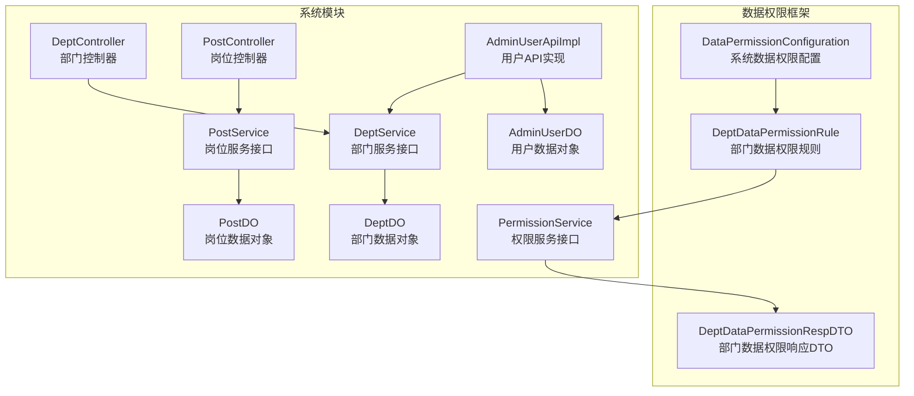
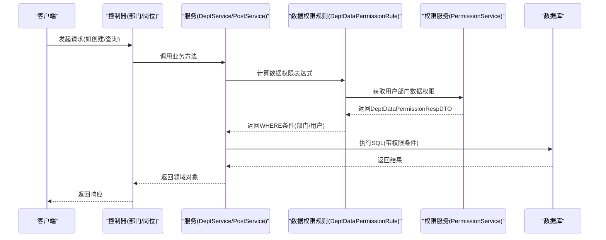
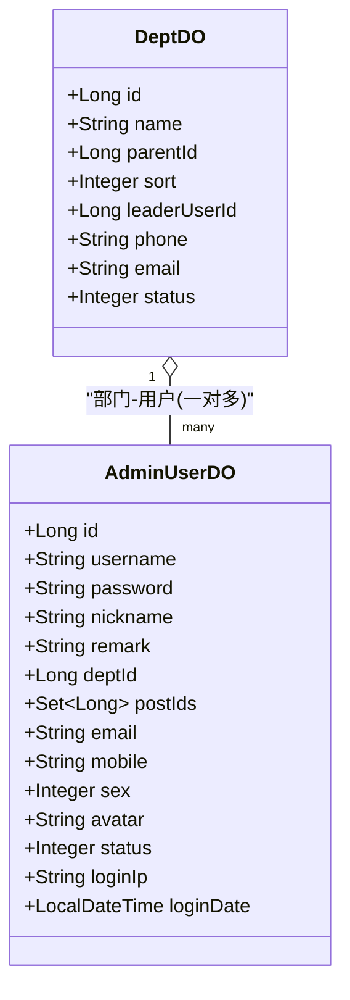
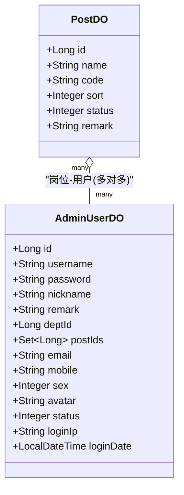
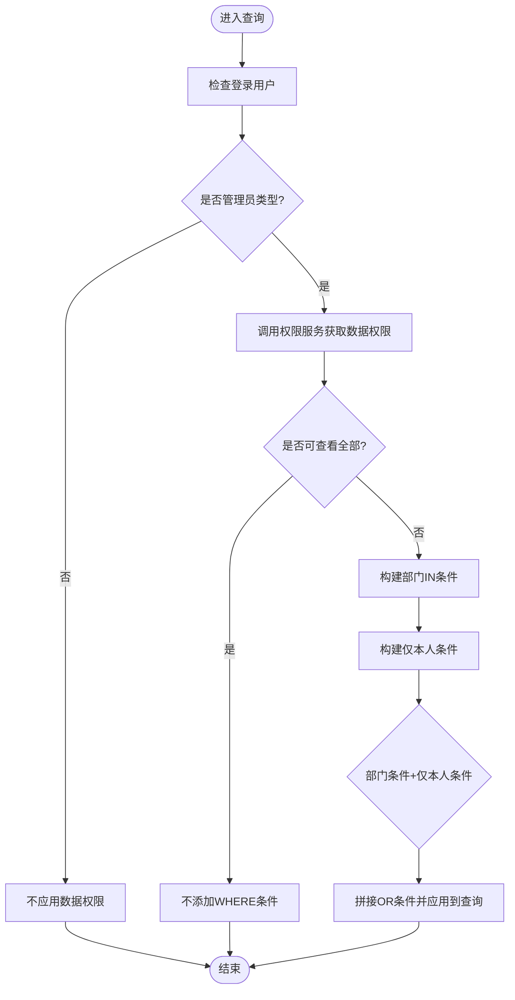
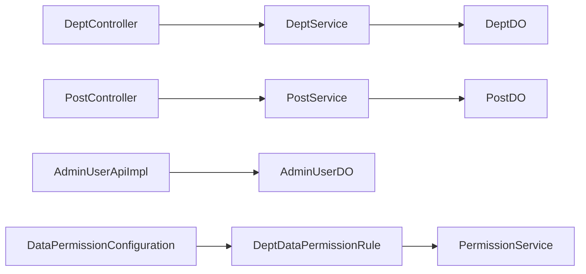

# 部门岗位管理

<cite>
**本文引用的文件**
- [DeptController.java](file://qiji-module-system/src/main/java/com.qiji.cps/module/system/controller/admin/dept/DeptController.java)
- [PostController.java](file://qiji-module-system/src/main/java/com.qiji.cps/module/system/controller/admin/dept/PostController.java)
- [DeptService.java](file://qiji-module-system/src/main/java/com.qiji.cps/module/system/service/dept/DeptService.java)
- [PostService.java](file://qiji-module-system/src/main/java/com.qiji.cps/module/system/service/dept/PostService.java)
- [DeptDO.java](file://qiji-module-system/src/main/java/com.qiji.cps/module/system/dal/dataobject/dept/DeptDO.java)
- [PostDO.java](file://qiji-module-system/src/main/java/com.qiji.cps/module/system/dal/dataobject/dept/PostDO.java)
- [AdminUserDO.java](file://qiji-module-system/src/main/java/com.qiji.cps/module/system/dal/dataobject/user/AdminUserDO.java)
- [DeptDataPermissionRule.java](file://qiji-framework/qiji-spring-boot-starter-biz-data-permission/src/main/java/com.qiji.cps/framework/datapermission/core/rule/dept/DeptDataPermissionRule.java)
- [DataPermissionConfiguration.java](file://qiji-module-system/src/main/java/com.qiji.cps/module/system/framework/datapermission/config/DataPermissionConfiguration.java)
- [PermissionService.java](file://qiji-module-system/src/main/java/com.qiji.cps/module/system/service/permission/PermissionService.java)
- [DeptDataPermissionRespDTO.java](file://qiji-framework/qiji-common/src/main/java/com.qiji.cps/framework/common/biz/system/permission/dto/DeptDataPermissionRespDTO.java)
- [AdminUserApiImpl.java](file://qiji-module-system/src/main/java/com.qiji.cps/module/system/api/user/AdminUserApiImpl.java)
- [DeptRespDTO.java](file://qiji-module-system/src/main/java/com.qiji.cps/module/system/api/dept/dto/DeptRespDTO.java)
- [PostRespDTO.java](file://qiji-module-system/src/main/java/com.qiji.cps/module/system/api/dept/dto/PostRespDTO.java)
- [DeptListReqVO.java](file://qiji-module-system/src/main/java/com.qiji.cps/module/system/controller/admin/dept/vo/dept/DeptListReqVO.java)
- [DeptSimpleRespVO.java](file://qiji-module-system/src/main/java/com.qiji.cps/module/system/controller/admin/dept/vo/dept/DeptSimpleRespVO.java)
- [PostPageReqVO.java](file://qiji-module-system/src/main/java/com.qiji.cps/module/system/controller/admin/dept/vo/post/PostPageReqVO.java)
- [PostSimpleRespVO.java](file://qiji-module-system/src/main/java/com.qiji.cps/module/system/controller/admin/dept/vo/post/PostSimpleRespVO.java)
</cite>

## 目录
1. [简介](#简介)
2. [项目结构](#项目结构)
3. [核心组件](#核心组件)
4. [架构总览](#架构总览)
5. [详细组件分析](#详细组件分析)
6. [依赖分析](#依赖分析)
7. [性能考量](#性能考量)
8. [故障排查指南](#故障排查指南)
9. [结论](#结论)
10. [附录](#附录)

## 简介
本技术文档围绕“部门岗位管理”主题，系统化梳理组织架构与岗位管理的业务逻辑、数据模型、权限控制与API接口，并结合数据权限框架，说明部门层级如何实现数据隔离与访问控制。文档同时覆盖部门与岗位与用户管理的关联关系，以及在权限体系中的作用，帮助读者快速理解并扩展该能力。

## 项目结构
部门岗位管理相关代码主要分布在 system 模块的 controller、service、dal、api 层，以及 datapermission 权限框架。核心目录与职责如下：
- controller 层：对外暴露 REST API，负责参数接收、鉴权与结果封装
- service 层：业务编排与校验，协调 DAO 与权限服务
- dal 层：数据对象与数据库映射，定义部门、岗位、用户等实体
- api 层：跨模块或跨层的通用接口，如用户 API、权限 API
- datapermission 框架：基于部门的数据权限规则与自动装配



图表来源
- [DeptController.java:1-94](file://qiji-module-system/src/main/java/com.qiji.cps/module/system/controller/admin/dept/DeptController.java#L1-L94)
- [PostController.java:1-115](file://qiji-module-system/src/main/java/com.qiji.cps/module/system/controller/admin/dept/PostController.java#L1-L115)
- [DeptService.java:1-125](file://qiji-module-system/src/main/java/com.qiji.cps/module/system/service/dept/DeptService.java#L1-L125)
- [PostService.java:1-92](file://qiji-module-system/src/main/java/com.qiji.cps/module/system/service/dept/PostService.java#L1-L92)
- [DeptDO.java:1-67](file://qiji-module-system/src/main/java/com.qiji.cps/module/system/dal/dataobject/dept/DeptDO.java#L1-L67)
- [PostDO.java:1-51](file://qiji-module-system/src/main/java/com.qiji.cps/module/system/dal/dataobject/dept/PostDO.java#L1-L51)
- [AdminUserDO.java:1-97](file://qiji-module-system/src/main/java/com.qiji.cps/module/system/dal/dataobject/user/AdminUserDO.java#L1-L97)
- [AdminUserApiImpl.java:1-36](file://qiji-module-system/src/main/java/com.qiji.cps/module/system/api/user/AdminUserApiImpl.java#L1-L36)
- [PermissionService.java:1-146](file://qiji-module-system/src/main/java/com.qiji.cps/module/system/service/permission/PermissionService.java#L1-L146)
- [DeptDataPermissionRule.java:1-208](file://qiji-framework/qiji-spring-boot-starter-biz-data-permission/src/main/java/com.qiji.cps/framework/datapermission/core/rule/dept/DeptDataPermissionRule.java#L1-L208)
- [DataPermissionConfiguration.java:1-28](file://qiji-module-system/src/main/java/com.qiji.cps/module/system/framework/datapermission/config/DataPermissionConfiguration.java#L1-L28)
- [DeptDataPermissionRespDTO.java:1-35](file://qiji-framework/qiji-common/src/main/java/com.qiji.cps/framework/common/biz/system/permission/dto/DeptDataPermissionRespDTO.java#L1-L35)

章节来源
- [DeptController.java:1-94](file://qiji-module-system/src/main/java/com.qiji.cps/module/system/controller/admin/dept/DeptController.java#L1-L94)
- [PostController.java:1-115](file://qiji-module-system/src/main/java/com.qiji.cps/module/system/controller/admin/dept/PostController.java#L1-L115)
- [DataPermissionConfiguration.java:1-28](file://qiji-module-system/src/main/java/com.qiji.cps/module/system/framework/datapermission/config/DataPermissionConfiguration.java#L1-L28)

## 核心组件
- 部门控制器：提供部门的创建、更新、删除、批量删除、列表查询、精简列表、详情查询等接口
- 岗位控制器：提供岗位的创建、更新、删除、批量删除、分页查询、导出、精简列表、详情查询等接口
- 部门服务接口：定义部门的新增、更新、删除、批量删除、查询、子部门查询、领导者部门查询、缓存子部门查询、有效性校验等能力
- 岗位服务接口：定义岗位的新增、更新、删除、批量删除、列表查询、分页查询、详情查询、有效性校验等能力
- 数据对象：DeptDO、PostDO、AdminUserDO 描述部门、岗位、用户的核心字段与关系
- 数据权限规则：DeptDataPermissionRule 基于部门与用户维度构建查询条件，实现数据隔离
- 权限配置：DataPermissionConfiguration 将用户与部门表的字段映射注册到规则中
- 权限服务：PermissionService 提供用户数据权限计算与角色数据范围赋权

章节来源
- [DeptController.java:34-91](file://qiji-module-system/src/main/java/com.qiji.cps/module/system/controller/admin/dept/DeptController.java#L34-L91)
- [PostController.java:43-112](file://qiji-module-system/src/main/java/com.qiji.cps/module/system/controller/admin/dept/PostController.java#L43-L112)
- [DeptService.java:15-124](file://qiji-module-system/src/main/java/com.qiji.cps/module/system/service/dept/DeptService.java#L15-L124)
- [PostService.java:17-91](file://qiji-module-system/src/main/java/com.qiji.cps/module/system/service/dept/PostService.java#L17-L91)
- [DeptDO.java:22-66](file://qiji-module-system/src/main/java/com.qiji.cps/module/system/dal/dataobject/dept/DeptDO.java#L22-L66)
- [PostDO.java:20-50](file://qiji-module-system/src/main/java/com.qiji.cps/module/system/dal/dataobject/dept/PostDO.java#L20-L50)
- [AdminUserDO.java:29-96](file://qiji-module-system/src/main/java/com.qiji.cps/module/system/dal/dataobject/user/AdminUserDO.java#L29-L96)
- [DeptDataPermissionRule.java:52-207](file://qiji-framework/qiji-spring-boot-starter-biz-data-permission/src/main/java/com.qiji.cps/framework/datapermission/core/rule/dept/DeptDataPermissionRule.java#L52-L207)
- [DataPermissionConfiguration.java:17-26](file://qiji-module-system/src/main/java/com.qiji.cps/module/system/framework/datapermission/config/DataPermissionConfiguration.java#L17-L26)
- [PermissionService.java:17-146](file://qiji-module-system/src/main/java/com.qiji.cps/module/system/service/permission/PermissionService.java#L17-L146)

## 架构总览
部门岗位管理遵循典型的分层架构：Controller 调用 Service，Service 访问 DAL，权限规则在 MyBatis 查询阶段生效，确保数据访问受部门层级与用户自身可见性约束。



图表来源
- [DeptController.java:34-91](file://qiji-module-system/src/main/java/com.qiji.cps/module/system/controller/admin/dept/DeptController.java#L34-L91)
- [PostController.java:43-112](file://qiji-module-system/src/main/java/com.qiji.cps/module/system/controller/admin/dept/PostController.java#L43-L112)
- [DeptDataPermissionRule.java:91-146](file://qiji-framework/qiji-spring-boot-starter-biz-data-permission/src/main/java/com.qiji.cps/framework/datapermission/core/rule/dept/DeptDataPermissionRule.java#L91-L146)
- [PermissionService.java:139-144](file://qiji-module-system/src/main/java/com.qiji.cps/module/system/service/permission/PermissionService.java#L139-L144)

## 详细组件分析

### 组件A：部门管理
- 数据模型：DeptDO 定义了部门的主键、名称、父级、排序、负责人、联系方式、状态等字段
- 控制器：提供创建、更新、删除、批量删除、列表查询、精简列表、详情查询等接口
- 服务接口：提供新增、更新、删除、批量删除、查询、子部门查询、领导者部门查询、缓存子部门查询、有效性校验等能力
- 关联关系：部门与用户存在一对多关系（用户属于部门），与岗位无直接外键关联，但通过用户与岗位的关联间接体现



图表来源
- [DeptDO.java:22-66](file://qiji-module-system/src/main/java/com.qiji.cps/module/system/dal/dataobject/dept/DeptDO.java#L22-L66)
- [AdminUserDO.java:29-96](file://qiji-module-system/src/main/java/com.qiji.cps/module/system/dal/dataobject/user/AdminUserDO.java#L29-L96)

章节来源
- [DeptDO.java:1-67](file://qiji-module-system/src/main/java/com.qiji.cps/module/system/dal/dataobject/dept/DeptDO.java#L1-L67)
- [AdminUserDO.java:1-97](file://qiji-module-system/src/main/java/com.qiji.cps/module/system/dal/dataobject/user/AdminUserDO.java#L1-L97)
- [DeptController.java:34-91](file://qiji-module-system/src/main/java/com.qiji.cps/module/system/controller/admin/dept/DeptController.java#L34-L91)
- [DeptService.java:15-124](file://qiji-module-system/src/main/java/com.qiji.cps/module/system/service/dept/DeptService.java#L15-L124)

### 组件B：岗位管理
- 数据模型：PostDO 定义了岗位的主键、名称、编码、排序、状态、备注等字段
- 控制器：提供创建、更新、删除、批量删除、分页查询、导出、精简列表、详情查询等接口
- 服务接口：提供新增、更新、删除、批量删除、列表查询、分页查询、详情查询、有效性校验等能力
- 关联关系：岗位与用户通过 AdminUserDO 的 postIds 字段建立多对多关系（用户可拥有多个岗位）



图表来源
- [PostDO.java:20-50](file://qiji-module-system/src/main/java/com.qiji.cps/module/system/dal/dataobject/dept/PostDO.java#L20-L50)
- [AdminUserDO.java:29-96](file://qiji-module-system/src/main/java/com.qiji.cps/module/system/dal/dataobject/user/AdminUserDO.java#L29-L96)

章节来源
- [PostDO.java:1-51](file://qiji-module-system/src/main/java/com.qiji.cps/module/system/dal/dataobject/dept/PostDO.java#L1-L51)
- [AdminUserDO.java:1-97](file://qiji-module-system/src/main/java/com.qiji.cps/module/system/dal/dataobject/user/AdminUserDO.java#L1-L97)
- [PostController.java:43-112](file://qiji-module-system/src/main/java/com.qiji.cps/module/system/controller/admin/dept/PostController.java#L43-L112)
- [PostService.java:17-91](file://qiji-module-system/src/main/java/com.qiji.cps/module/system/service/dept/PostService.java#L17-L91)

### 组件C：数据权限与部门层级
- 数据权限规则：DeptDataPermissionRule 在查询阶段根据登录用户类型与数据权限，动态生成 WHERE 条件，支持“仅本人”和“部门集合”
- 权限配置：DataPermissionConfiguration 将 AdminUserDO、DeptDO、AdminUserDO 的 id 字段注册为可应用数据权限的表与列
- 权限服务：PermissionService 提供 getDeptDataPermission，用于计算用户可访问的部门集合与“仅本人”开关
- DTO：DeptDataPermissionRespDTO 描述返回的权限范围（是否全部、是否仅本人、可查看的部门集合）



图表来源
- [DeptDataPermissionRule.java:91-146](file://qiji-framework/qiji-spring-boot-starter-biz-data-permission/src/main/java/com.qiji.cps/framework/datapermission/core/rule/dept/DeptDataPermissionRule.java#L91-L146)
- [DataPermissionConfiguration.java:17-26](file://qiji-module-system/src/main/java/com.qiji.cps/module/system/framework/datapermission/config/DataPermissionConfiguration.java#L17-L26)
- [PermissionService.java:139-144](file://qiji-module-system/src/main/java/com.qiji.cps/module/system/service/permission/PermissionService.java#L139-L144)
- [DeptDataPermissionRespDTO.java:14-35](file://qiji-framework/qiji-common/src/main/java/com.qiji.cps/framework/common/biz/system/permission/dto/DeptDataPermissionRespDTO.java#L14-L35)

章节来源
- [DeptDataPermissionRule.java:1-208](file://qiji-framework/qiji-spring-boot-starter-biz-data-permission/src/main/java/com.qiji.cps/framework/datapermission/core/rule/dept/DeptDataPermissionRule.java#L1-L208)
- [DataPermissionConfiguration.java:1-28](file://qiji-module-system/src/main/java/com.qiji.cps/module/system/framework/datapermission/config/DataPermissionConfiguration.java#L1-L28)
- [PermissionService.java:1-146](file://qiji-module-system/src/main/java/com.qiji.cps/module/system/service/permission/PermissionService.java#L1-L146)
- [DeptDataPermissionRespDTO.java:1-35](file://qiji-framework/qiji-common/src/main/java/com.qiji.cps/framework/common/biz/system/permission/dto/DeptDataPermissionRespDTO.java#L1-L35)

### 组件D：部门与用户管理的关联
- 用户与部门：AdminUserDO 的 deptId 字段指向 DeptDO.id，形成“用户-部门”的外键关系
- 用户与岗位：AdminUserDO 的 postIds 字段以 JSON 形式存储岗位编号集合，实现“用户-岗位”的多对多关系
- 用户API：AdminUserApiImpl 在用户相关操作中，结合 DeptService 与 AdminUserService，实现与部门/岗位的联动

```mermaid
classDiagram
class AdminUserDO {
+Long id
+Long deptId
+Set~Long~ postIds
}
class DeptDO
class PostDO
AdminUserDO --> DeptDO : "外键 : deptId"
AdminUserDO --> PostDO : "JSON集合 : postIds"
```

图表来源
- [AdminUserDO.java:29-96](file://qiji-module-system/src/main/java/com.qiji.cps/module/system/dal/dataobject/user/AdminUserDO.java#L29-L96)
- [DeptDO.java:22-66](file://qiji-module-system/src/main/java/com.qiji.cps/module/system/dal/dataobject/dept/DeptDO.java#L22-L66)
- [PostDO.java:20-50](file://qiji-module-system/src/main/java/com.qiji.cps/module/system/dal/dataobject/dept/PostDO.java#L20-L50)
- [AdminUserApiImpl.java:28-36](file://qiji-module-system/src/main/java/com.qiji.cps/module/system/api/user/AdminUserApiImpl.java#L28-L36)

章节来源
- [AdminUserDO.java:1-97](file://qiji-module-system/src/main/java/com.qiji.cps/module/system/dal/dataobject/user/AdminUserDO.java#L1-L97)
- [AdminUserApiImpl.java:1-36](file://qiji-module-system/src/main/java/com.qiji.cps/module/system/api/user/AdminUserApiImpl.java#L1-L36)

## 依赖分析
- 控制器依赖服务：DeptController 与 PostController 分别注入 DeptService 与 PostService
- 服务依赖数据对象：服务通过 DeptDO、PostDO、AdminUserDO 进行数据持久化与查询
- 权限规则依赖权限服务：DeptDataPermissionRule 通过 PermissionService 获取用户数据权限
- 配置依赖：DataPermissionConfiguration 将用户与部门表的字段注册到 DeptDataPermissionRule



图表来源
- [DeptController.java:31-32](file://qiji-module-system/src/main/java/com.qiji.cps/module/system/controller/admin/dept/DeptController.java#L31-L32)
- [PostController.java:40-41](file://qiji-module-system/src/main/java/com.qiji.cps/module/system/controller/admin/dept/PostController.java#L40-L41)
- [DeptService.java:15-124](file://qiji-module-system/src/main/java/com.qiji.cps/module/system/service/dept/DeptService.java#L15-L124)
- [PostService.java:17-91](file://qiji-module-system/src/main/java/com.qiji.cps/module/system/service/dept/PostService.java#L17-L91)
- [DeptDO.java:22-66](file://qiji-module-system/src/main/java/com.qiji.cps/module/system/dal/dataobject/dept/DeptDO.java#L22-L66)
- [PostDO.java:20-50](file://qiji-module-system/src/main/java/com.qiji.cps/module/system/dal/dataobject/dept/PostDO.java#L20-L50)
- [AdminUserDO.java:29-96](file://qiji-module-system/src/main/java/com.qiji.cps/module/system/dal/dataobject/user/AdminUserDO.java#L29-L96)
- [DeptDataPermissionRule.java:62-114](file://qiji-framework/qiji-spring-boot-starter-biz-data-permission/src/main/java/com.qiji.cps/framework/datapermission/core/rule/dept/DeptDataPermissionRule.java#L62-L114)
- [DataPermissionConfiguration.java:17-26](file://qiji-module-system/src/main/java/com.qiji.cps/module/system/framework/datapermission/config/DataPermissionConfiguration.java#L17-L26)

章节来源
- [DeptController.java:1-94](file://qiji-module-system/src/main/java/com.qiji.cps/module/system/controller/admin/dept/DeptController.java#L1-L94)
- [PostController.java:1-115](file://qiji-module-system/src/main/java/com.qiji.cps/module/system/controller/admin/dept/PostController.java#L1-L115)
- [DeptDataPermissionRule.java:1-208](file://qiji-framework/qiji-spring-boot-starter-biz-data-permission/src/main/java/com.qiji.cps/framework/datapermission/core/rule/dept/DeptDataPermissionRule.java#L1-L208)
- [DataPermissionConfiguration.java:1-28](file://qiji-module-system/src/main/java/com.qiji.cps/module/system/framework/datapermission/config/DataPermissionConfiguration.java#L1-L28)

## 性能考量
- 子部门查询：DeptService 提供从缓存获取子部门 ID 的能力，减少递归查询开销
- 分页与导出：PostController 支持分页查询与导出，导出时设置无分页大小限制，注意大数据量导出的内存与IO压力
- 权限表达式：DeptDataPermissionRule 在登录用户上下文中缓存权限结果，避免重复计算
- 字段映射：DataPermissionConfiguration 将常用表字段注册为可应用数据权限的列，减少运行期反射成本

章节来源
- [DeptService.java:113-113](file://qiji-module-system/src/main/java/com.qiji.cps/module/system/service/dept/DeptService.java#L113-L113)
- [PostController.java:106-112](file://qiji-module-system/src/main/java/com.qiji.cps/module/system/controller/admin/dept/PostController.java#L106-L112)
- [DeptDataPermissionRule.java:103-114](file://qiji-framework/qiji-spring-boot-starter-biz-data-permission/src/main/java/com.qiji.cps/framework/datapermission/core/rule/dept/DeptDataPermissionRule.java#L103-L114)
- [DataPermissionConfiguration.java:17-26](file://qiji-module-system/src/main/java/com.qiji.cps/module/system/framework/datapermission/config/DataPermissionConfiguration.java#L17-L26)

## 故障排查指南
- 权限条件为空：当用户不具备任何部门数据权限且不允许“仅本人”时，规则会返回恒假条件，导致查询无结果。请检查用户的角色数据范围与部门层级配置
- 登录用户类型不符：仅管理员类型用户才会应用数据权限规则。若非管理员用户无法看到数据，请确认登录身份
- 导出异常：PostController 导出时设置分页上限为无限制，需关注内存占用与超时问题
- 部门/岗位校验失败：DeptService 与 PostService 提供批量校验方法，若传入的ID无效或被禁用，将触发校验异常

章节来源
- [DeptDataPermissionRule.java:116-146](file://qiji-framework/qiji-spring-boot-starter-biz-data-permission/src/main/java/com.qiji.cps/framework/datapermission/core/rule/dept/DeptDataPermissionRule.java#L116-L146)
- [PostController.java:106-112](file://qiji-module-system/src/main/java/com.qiji.cps/module/system/controller/admin/dept/PostController.java#L106-L112)
- [DeptService.java:122-122](file://qiji-module-system/src/main/java/com.qiji.cps/module/system/service/dept/DeptService.java#L122-L122)
- [PostService.java:89-89](file://qiji-module-system/src/main/java/com.qiji.cps/module/system/service/dept/PostService.java#L89-L89)

## 结论
本方案通过清晰的分层架构与数据权限规则，实现了部门树形结构下的数据隔离与访问控制。部门与岗位分别承担组织与角色定位的职责，用户通过部门与岗位实现更细粒度的权限与数据范围控制。配合权限服务与配置化的数据权限规则，系统可在不侵入业务SQL的前提下，实现灵活、可扩展的数据权限治理。

## 附录

### API 接口清单（部门）
- POST /system/dept/create：创建部门
- PUT /system/dept/update：更新部门
- DELETE /system/dept/delete?id=...：删除部门
- DELETE /system/dept/delete-list：批量删除部门
- GET /system/dept/list：获取部门列表（支持名称/状态筛选）
- GET /system/dept/simple-list 或 /system/dept/list-all-simple：获取部门精简列表（仅启用）
- GET /system/dept/get?id=...：获取部门详情

章节来源
- [DeptController.java:34-91](file://qiji-module-system/src/main/java/com.qiji.cps/module/system/controller/admin/dept/DeptController.java#L34-L91)
- [DeptListReqVO.java:1-16](file://qiji-module-system/src/main/java/com.qiji.cps/module/system/controller/admin/dept/vo/dept/DeptListReqVO.java#L1-L16)
- [DeptSimpleRespVO.java:1-23](file://qiji-module-system/src/main/java/com.qiji.cps/module/system/controller/admin/dept/vo/dept/DeptSimpleRespVO.java#L1-L23)
- [DeptRespDTO.java:1-37](file://qiji-module-system/src/main/java/com.qiji.cps/module/system/api/dept/dto/DeptRespDTO.java#L1-L37)

### API 接口清单（岗位）
- POST /system/post/create：创建岗位
- PUT /system/post/update：修改岗位
- DELETE /system/post/delete?id=...：删除岗位
- DELETE /system/post/delete-list：批量删除岗位
- GET /system/post/get?id=...：获取岗位详情
- GET /system/post/simple-list 或 /system/post/list-all-simple：获取岗位精简列表（仅启用，按排序）
- GET /system/post/page：获取岗位分页列表
- GET /system/post/export-excel：导出岗位数据（无分页）

章节来源
- [PostController.java:43-112](file://qiji-module-system/src/main/java/com.qiji.cps/module/system/controller/admin/dept/PostController.java#L43-L112)
- [PostPageReqVO.java:1-200](file://qiji-module-system/src/main/java/com.qiji.cps/module/system/controller/admin/dept/vo/post/PostPageReqVO.java#L1-L200)
- [PostSimpleRespVO.java:1-200](file://qiji-module-system/src/main/java/com.qiji.cps/module/system/controller/admin/dept/vo/post/PostSimpleRespVO.java#L1-L200)
- [PostRespDTO.java:1-200](file://qiji-module-system/src/main/java/com.qiji.cps/module/system/api/dept/dto/PostRespDTO.java#L1-L200)

### 数据模型概览
- 部门：DeptDO（主键、名称、父级、排序、负责人、联系方式、状态）
- 岗位：PostDO（主键、名称、编码、排序、状态、备注）
- 用户：AdminUserDO（主键、用户名、密码、昵称、备注、部门ID、岗位ID集合、邮箱、手机、性别、头像、状态、登录IP、登录时间）

章节来源
- [DeptDO.java:22-66](file://qiji-module-system/src/main/java/com.qiji.cps/module/system/dal/dataobject/dept/DeptDO.java#L22-L66)
- [PostDO.java:20-50](file://qiji-module-system/src/main/java/com.qiji.cps/module/system/dal/dataobject/dept/PostDO.java#L20-L50)
- [AdminUserDO.java:29-96](file://qiji-module-system/src/main/java/com.qiji.cps/module/system/dal/dataobject/user/AdminUserDO.java#L29-L96)