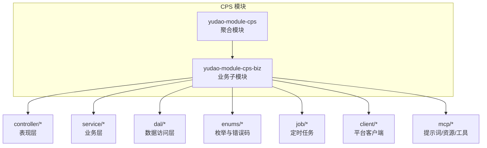
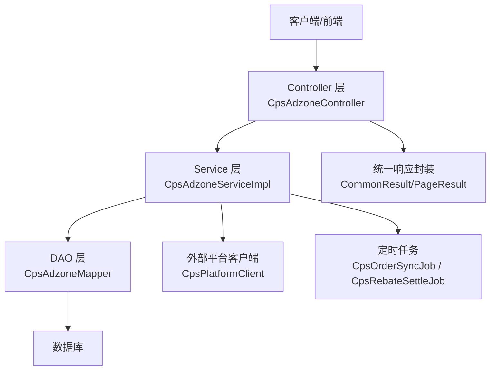
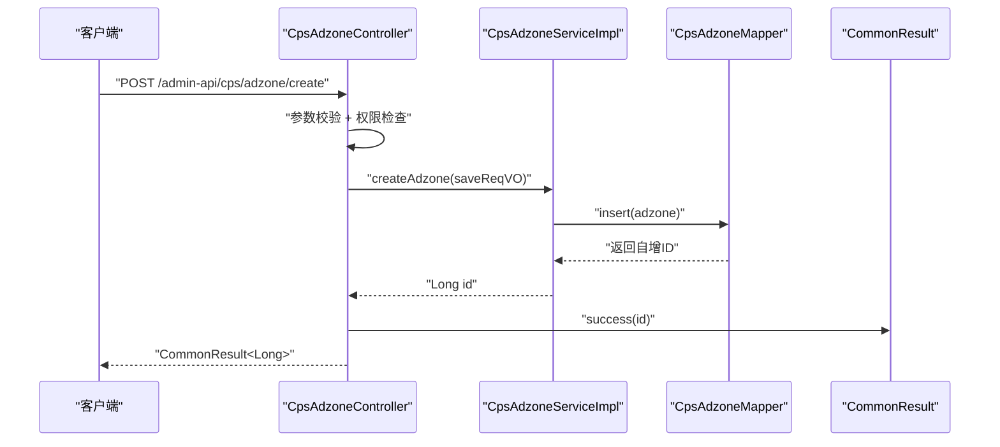
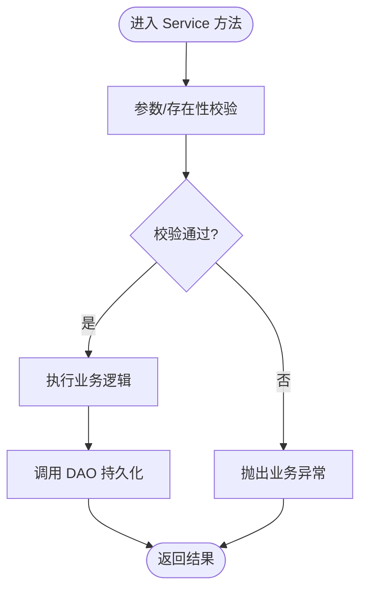
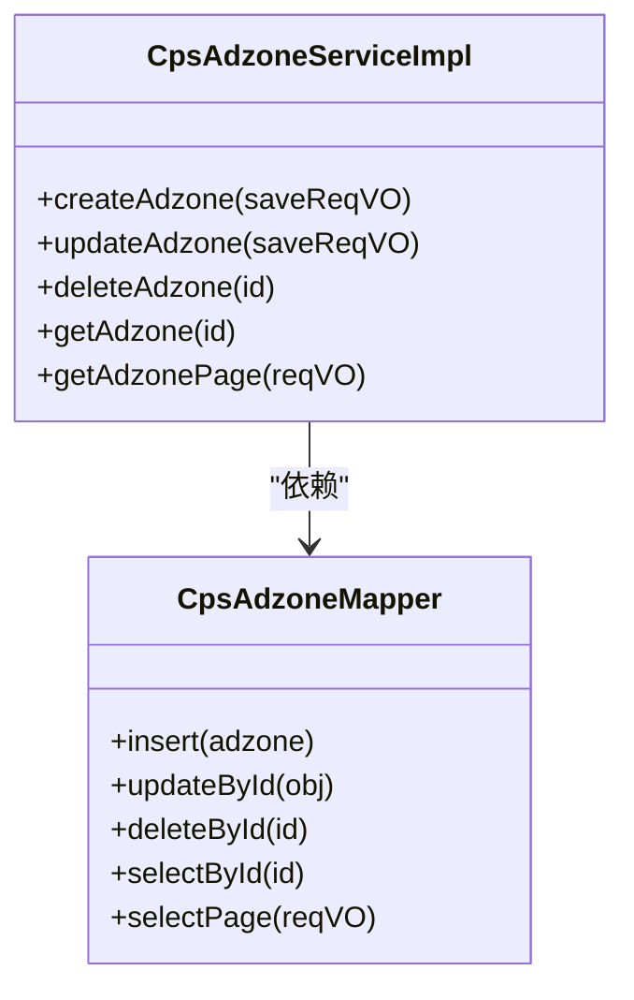
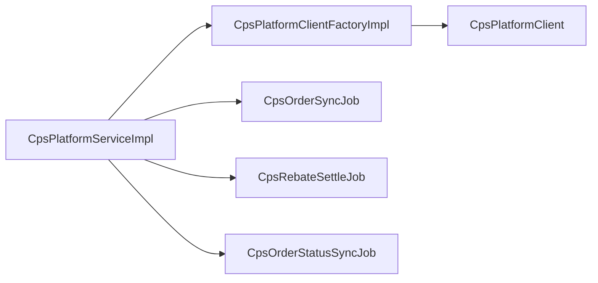
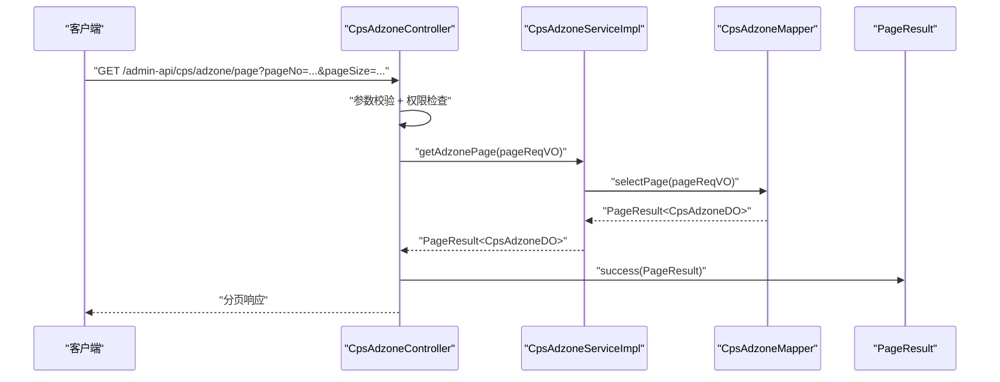
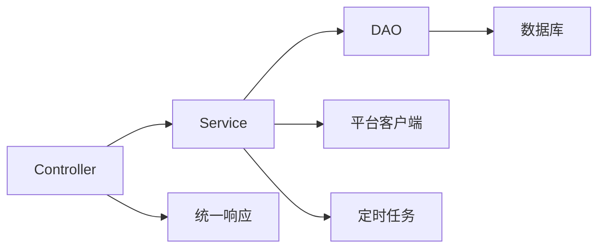

# 分层架构设计

<cite>
**本文引用的文件**
- [pom.xml](file://yudao-module-cps/pom.xml)
- [CpsAdzoneController.java](file://yudao-module-cps/yudao-module-cps-biz/src/main/java/cn/zhijian/cps/controller/admin/CpsAdzoneController.java)
- [CpsAdzoneServiceImpl.java](file://yudao-module-cps/yudao-module-cps-biz/src/main/java/cn/zhijian/cps/service/CpsAdzoneServiceImpl.java)
- [CpsAdzoneMapper.java](file://yudao-module-cps/yudao-module-cps-biz/src/main/java/cn/zhijian/cps/dal/mysql/CpsAdzoneMapper.java)
- [CommonResult.java](file://yudao-framework/yudao-common/src/main/java/cn/iocoder/yudao/framework/common/pojo/CommonResult.java)
- [PageResult.java](file://yudao-framework/yudao-common/src/main/java/cn/iocoder/yudao/framework/common/pojo/PageResult.java)
- [ErrorCodeConstants.java](file://yudao-module-cps/yudao-module-cps-biz/src/main/java/cn/zhijian/cps/enums/ErrorCodeConstants.java)
- [CpsPlatformClient.java](file://yudao-module-cps/yudao-module-cps-biz/src/main/java/cn/zhijian/cps/client/CpsPlatformClient.java)
- [CpsPlatformServiceImpl.java](file://yudao-module-cps/yudao-module-cps-biz/src/main/java/cn/zhijian/cps/service/CpsPlatformServiceImpl.java)
- [CpsOrderServiceImpl.java](file://yudao-module-cps/yudao-module-cps-biz/src/main/java/cn/zhijian/cps/service/CpsOrderServiceImpl.java)
- [CpsRebateRecordServiceImpl.java](file://yudao-module-cps/yudao-module-cps-biz/src/main/java/cn/zhijian/cps/service/CpsRebateRecordServiceImpl.java)
- [CpsWithdrawServiceImpl.java](file://yudao-module-cps/yudao-module-cps-biz/src/main/java/cn/zhijian/cps/service/CpsWithdrawServiceImpl.java)
- [CpsStatisticsServiceImpl.java](file://yudao-module-cps/yudao-module-cps-biz/src/main/java/cn/zhijian/cps/service/CpsStatisticsServiceImpl.java)
- [CpsPlatformClientFactoryImpl.java](file://yudao-module-cps/yudao-module-cps-biz/src/main/java/cn/zhijian/cps/service/CpsPlatformClientFactoryImpl.java)
- [CpsOrderSyncJob.java](file://yudao-module-cps/yudao-module-cps-biz/src/main/java/cn/zhijian/cps/job/CpsOrderSyncJob.java)
- [CpsRebateSettleJob.java](file://yudao-module-cps/yudao-module-cps-biz/src/main/java/cn/zhijian/cps/job/CpsRebateSettleJob.java)
- [CpsOrderStatusSyncJob.java](file://yudao-module-cps/yudao-module-cps-biz/src/main/java/cn/zhijian/cps/job/CpsOrderStatusSyncJob.java)
</cite>

## 目录
1. [引言](#引言)
2. [项目结构](#项目结构)
3. [核心组件](#核心组件)
4. [架构总览](#架构总览)
5. [详细组件分析](#详细组件分析)
6. [依赖分析](#依赖分析)
7. [性能考虑](#性能考虑)
8. [故障排查指南](#故障排查指南)
9. [结论](#结论)

## 引言
本文件面向 AgenticCPS 系统，基于现有代码库梳理并输出其分层架构设计文档。重点覆盖表现层（Controller）、业务层（Service）、数据访问层（DAO）的职责划分与交互关系，阐述各层的设计原则与实现方式，并结合系统中的实际模块（如推广位管理、订单同步、返利结算、提现统计等）给出典型业务流程图与架构图，帮助开发者与产品人员快速理解系统结构与演进方向。

## 项目结构
AgenticCPS 位于 yudao-module-cps 模块中，采用“模块聚合 + 子模块业务域”的组织方式。其中 yudao-module-cps-biz 为业务子模块，包含 controller、service、dal、enums、job、client、mcp 等包，体现清晰的分层与领域划分。

图表来源
- [pom.xml:1-25](file://yudao-module-cps/pom.xml#L1-L25)

章节来源
- [pom.xml:1-25](file://yudao-module-cps/pom.xml#L1-L25)

## 核心组件
- 表现层（Controller）
  - 职责：接收 HTTP 请求、参数校验、权限控制、调用 Service、封装统一响应。
  - 示例：推广位管理控制器负责创建、更新、删除、查询与分页查询等接口。
- 业务层（Service）
  - 职责：编排领域逻辑、事务边界、异常转换、调用 DAO 与外部平台客户端。
  - 示例：推广位 Service 实现 CRUD 与分页查询，内部进行存在性校验与异常抛出。
- 数据访问层（DAO）
  - 职责：封装数据库操作、Mapper 映射、分页查询、条件查询。
  - 示例：推广位 Mapper 提供 insert、update、delete、selectById、selectPage 等方法。

章节来源
- [CpsAdzoneController.java:1-73](file://yudao-module-cps/yudao-module-cps-biz/src/main/java/cn/zhijian/cps/controller/admin/CpsAdzoneController.java#L1-L73)
- [CpsAdzoneServiceImpl.java:1-79](file://yudao-module-cps/yudao-module-cps-biz/src/main/java/cn/zhijian/cps/service/CpsAdzoneServiceImpl.java#L1-L79)
- [CpsAdzoneMapper.java](file://yudao-module-cps/yudao-module-cps-biz/src/main/java/cn/zhijian/cps/dal/mysql/CpsAdzoneMapper.java)

## 架构总览
AgenticCPS 的分层架构遵循“表现层只做薄层、业务层编排领域、DAO 封装持久化”的原则。请求从 Controller 进入，经 Service 层完成业务规则与事务控制，再由 DAO 访问数据库或外部平台接口，最终通过统一响应体返回给前端。

图表来源
- [CpsAdzoneController.java:1-73](file://yudao-module-cps/yudao-module-cps-biz/src/main/java/cn/zhijian/cps/controller/admin/CpsAdzoneController.java#L1-L73)
- [CpsAdzoneServiceImpl.java:1-79](file://yudao-module-cps/yudao-module-cps-biz/src/main/java/cn/zhijian/cps/service/CpsAdzoneServiceImpl.java#L1-L79)
- [CpsAdzoneMapper.java](file://yudao-module-cps/yudao-module-cps-biz/src/main/java/cn/zhijian/cps/dal/mysql/CpsAdzoneMapper.java)
- [CommonResult.java](file://yudao-framework/yudao-common/src/main/java/cn/iocoder/yudao/framework/common/pojo/CommonResult.java)
- [PageResult.java](file://yudao-framework/yudao-common/src/main/java/cn/iocoder/yudao/framework/common/pojo/PageResult.java)
- [CpsPlatformClient.java](file://yudao-module-cps/yudao-module-cps-biz/src/main/java/cn/zhijian/cps/client/CpsPlatformClient.java)
- [CpsOrderSyncJob.java](file://yudao-module-cps/yudao-module-cps-biz/src/main/java/cn/zhijian/cps/job/CpsOrderSyncJob.java)
- [CpsRebateSettleJob.java](file://yudao-module-cps/yudao-module-cps-biz/src/main/java/cn/zhijian/cps/job/CpsRebateSettleJob.java)

## 详细组件分析

### 表现层（Controller）设计
- 请求处理
  - 使用注解定义 REST 接口，绑定路径与 HTTP 方法，如创建、更新、删除、查询、分页。
- 参数验证
  - 使用校验注解对请求体与查询参数进行参数级校验，确保输入合法性。
- 权限控制
  - 基于注解的权限校验，仅授权用户可执行相应操作。
- 响应封装
  - 统一使用 CommonResult 包裹成功/失败结果，PageResult 支持分页场景。

图表来源
- [CpsAdzoneController.java:31-36](file://yudao-module-cps/yudao-module-cps-biz/src/main/java/cn/zhijian/cps/controller/admin/CpsAdzoneController.java#L31-L36)
- [CpsAdzoneServiceImpl.java:29-33](file://yudao-module-cps/yudao-module-cps-biz/src/main/java/cn/zhijian/cps/service/CpsAdzoneServiceImpl.java#L29-L33)
- [CommonResult.java](file://yudao-framework/yudao-common/src/main/java/cn/iocoder/yudao/framework/common/pojo/CommonResult.java)

章节来源
- [CpsAdzoneController.java:1-73](file://yudao-module-cps/yudao-module-cps-biz/src/main/java/cn/zhijian/cps/controller/admin/CpsAdzoneController.java#L1-L73)
- [CommonResult.java](file://yudao-framework/yudao-common/src/main/java/cn/iocoder/yudao/framework/common/pojo/CommonResult.java)
- [PageResult.java](file://yudao-framework/yudao-common/src/main/java/cn/iocoder/yudao/framework/common/pojo/PageResult.java)

### 业务层（Service）设计
- 业务逻辑处理
  - 在 Service 中编排领域规则，如存在性校验、状态判断、异常转换。
- 事务管理
  - 通过注解或事务传播控制业务边界，保证一致性。
- 领域模型
  - VO/DTO/DO 映射与转换，保持接口与存储模型解耦。

图表来源
- [CpsAdzoneServiceImpl.java:68-76](file://yudao-module-cps/yudao-module-cps-biz/src/main/java/cn/zhijian/cps/service/CpsAdzoneServiceImpl.java#L68-L76)
- [ErrorCodeConstants.java](file://yudao-module-cps/yudao-module-cps-biz/src/main/java/cn/zhijian/cps/enums/ErrorCodeConstants.java)

章节来源
- [CpsAdzoneServiceImpl.java:1-79](file://yudao-module-cps/yudao-module-cps-biz/src/main/java/cn/zhijian/cps/service/CpsAdzoneServiceImpl.java#L1-L79)
- [ErrorCodeConstants.java](file://yudao-module-cps/yudao-module-cps-biz/src/main/java/cn/zhijian/cps/enums/ErrorCodeConstants.java)

### 数据访问层（DAO）设计
- 数据持久化
  - Mapper 提供基础 CRUD 与分页查询能力，DAO 层不包含业务逻辑。
- SQL 映射
  - 基于 MyBatis 的 XML 或注解映射，支持复杂查询与联表。
- 缓存策略
  - 可结合框架层 Redis/Cache 能力进行热点数据缓存（视具体实现而定）。

图表来源
- [CpsAdzoneServiceImpl.java:25-61](file://yudao-module-cps/yudao-module-cps-biz/src/main/java/cn/zhijian/cps/service/CpsAdzoneServiceImpl.java#L25-L61)
- [CpsAdzoneMapper.java](file://yudao-module-cps/yudao-module-cps-biz/src/main/java/cn/zhijian/cps/dal/mysql/CpsAdzoneMapper.java)

章节来源
- [CpsAdzoneMapper.java](file://yudao-module-cps/yudao-module-cps-biz/src/main/java/cn/zhijian/cps/dal/mysql/CpsAdzoneMapper.java)

### 平台对接与定时任务
- 平台对接
  - 通过平台客户端抽象与工厂模式，屏蔽不同平台差异，便于扩展新平台。
- 定时任务
  - 订单同步、返利结算、状态同步等任务通过 Job 执行，保障数据一致性与时效性。

图表来源
- [CpsPlatformServiceImpl.java](file://yudao-module-cps/yudao-module-cps-biz/src/main/java/cn/zhijian/cps/service/CpsPlatformServiceImpl.java)
- [CpsPlatformClientFactoryImpl.java](file://yudao-module-cps/yudao-module-cps-biz/src/main/java/cn/zhijian/cps/service/CpsPlatformClientFactoryImpl.java)
- [CpsPlatformClient.java](file://yudao-module-cps/yudao-module-cps-biz/src/main/java/cn/zhijian/cps/client/CpsPlatformClient.java)
- [CpsOrderSyncJob.java](file://yudao-module-cps/yudao-module-cps-biz/src/main/java/cn/zhijian/cps/job/CpsOrderSyncJob.java)
- [CpsRebateSettleJob.java](file://yudao-module-cps/yudao-module-cps-biz/src/main/java/cn/zhijian/cps/job/CpsRebateSettleJob.java)
- [CpsOrderStatusSyncJob.java](file://yudao-module-cps/yudao-module-cps-biz/src/main/java/cn/zhijian/cps/job/CpsOrderStatusSyncJob.java)

章节来源
- [CpsPlatformServiceImpl.java](file://yudao-module-cps/yudao-module-cps-biz/src/main/java/cn/zhijian/cps/service/CpsPlatformServiceImpl.java)
- [CpsPlatformClientFactoryImpl.java](file://yudao-module-cps/yudao-module-cps-biz/src/main/java/cn/zhijian/cps/service/CpsPlatformClientFactoryImpl.java)
- [CpsPlatformClient.java](file://yudao-module-cps/yudao-module-cps-biz/src/main/java/cn/zhijian/cps/client/CpsPlatformClient.java)
- [CpsOrderSyncJob.java](file://yudao-module-cps/yudao-module-cps-biz/src/main/java/cn/zhijian/cps/job/CpsOrderSyncJob.java)
- [CpsRebateSettleJob.java](file://yudao-module-cps/yudao-module-cps-biz/src/main/java/cn/zhijian/cps/job/CpsRebateSettleJob.java)
- [CpsOrderStatusSyncJob.java](file://yudao-module-cps/yudao-module-cps-biz/src/main/java/cn/zhijian/cps/job/CpsOrderStatusSyncJob.java)

### 典型业务流程：推广位分页查询

图表来源
- [CpsAdzoneController.java:64-70](file://yudao-module-cps/yudao-module-cps-biz/src/main/java/cn/zhijian/cps/controller/admin/CpsAdzoneController.java#L64-L70)
- [CpsAdzoneServiceImpl.java:58-61](file://yudao-module-cps/yudao-module-cps-biz/src/main/java/cn/zhijian/cps/service/CpsAdzoneServiceImpl.java#L58-L61)
- [PageResult.java](file://yudao-framework/yudao-common/src/main/java/cn/iocoder/yudao/framework/common/pojo/PageResult.java)

## 依赖分析
- 层间依赖
  - Controller 依赖 Service；Service 依赖 DAO；DAO 依赖数据库。
- 外部依赖
  - 平台客户端用于对接第三方 CPS 平台；定时任务用于异步处理。
- 错误码与统一响应
  - 通过统一错误码与响应封装，降低跨层耦合，提升可维护性。

图表来源
- [CpsAdzoneController.java:1-73](file://yudao-module-cps/yudao-module-cps-biz/src/main/java/cn/zhijian/cps/controller/admin/CpsAdzoneController.java#L1-L73)
- [CpsAdzoneServiceImpl.java:1-79](file://yudao-module-cps/yudao-module-cps-biz/src/main/java/cn/zhijian/cps/service/CpsAdzoneServiceImpl.java#L1-L79)
- [CommonResult.java](file://yudao-framework/yudao-common/src/main/java/cn/iocoder/yudao/framework/common/pojo/CommonResult.java)

章节来源
- [CommonResult.java](file://yudao-framework/yudao-common/src/main/java/cn/iocoder/yudao/framework/common/pojo/CommonResult.java)
- [ErrorCodeConstants.java](file://yudao-module-cps/yudao-module-cps-biz/src/main/java/cn/zhijian/cps/enums/ErrorCodeConstants.java)

## 性能考虑
- 分页查询
  - 使用 PageResult 与 DAO 分页接口，避免一次性加载大量数据。
- 缓存策略
  - 对高频查询结果引入缓存（Redis/Cache），减少数据库压力。
- 事务边界
  - 合理划分事务范围，避免长事务占用数据库连接。
- 异步处理
  - 订单同步、返利结算等耗时任务通过定时任务异步执行，提升接口响应速度。

## 故障排查指南
- 参数校验失败
  - 检查 Controller 层的校验注解与请求参数是否匹配。
- 业务异常
  - 查看 Service 层是否存在存在性校验与异常抛出逻辑。
- 统一响应
  - 确认返回值是否通过 CommonResult/PageResult 封装，便于前端统一处理。
- 平台对接问题
  - 核查平台客户端工厂与具体实现，确认签名、参数与回调处理正确。
- 定时任务异常
  - 关注任务日志与重试策略，确保订单同步与返利结算稳定运行。

章节来源
- [CpsAdzoneController.java:1-73](file://yudao-module-cps/yudao-module-cps-biz/src/main/java/cn/zhijian/cps/controller/admin/CpsAdzoneController.java#L1-L73)
- [CpsAdzoneServiceImpl.java:68-76](file://yudao-module-cps/yudao-module-cps-biz/src/main/java/cn/zhijian/cps/service/CpsAdzoneServiceImpl.java#L68-L76)
- [ErrorCodeConstants.java](file://yudao-module-cps/yudao-module-cps-biz/src/main/java/cn/zhijian/cps/enums/ErrorCodeConstants.java)

## 结论
AgenticCPS 采用清晰的三层架构：Controller 负责薄层交互与统一响应，Service 负责业务编排与事务控制，DAO 负责数据持久化与映射。配合平台客户端与定时任务，系统实现了多平台接入、订单与返利闭环以及高效稳定的运营支撑。该架构具备良好的关注点分离、可复用性与可测试性，适合持续演进与扩展。