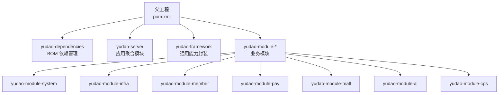
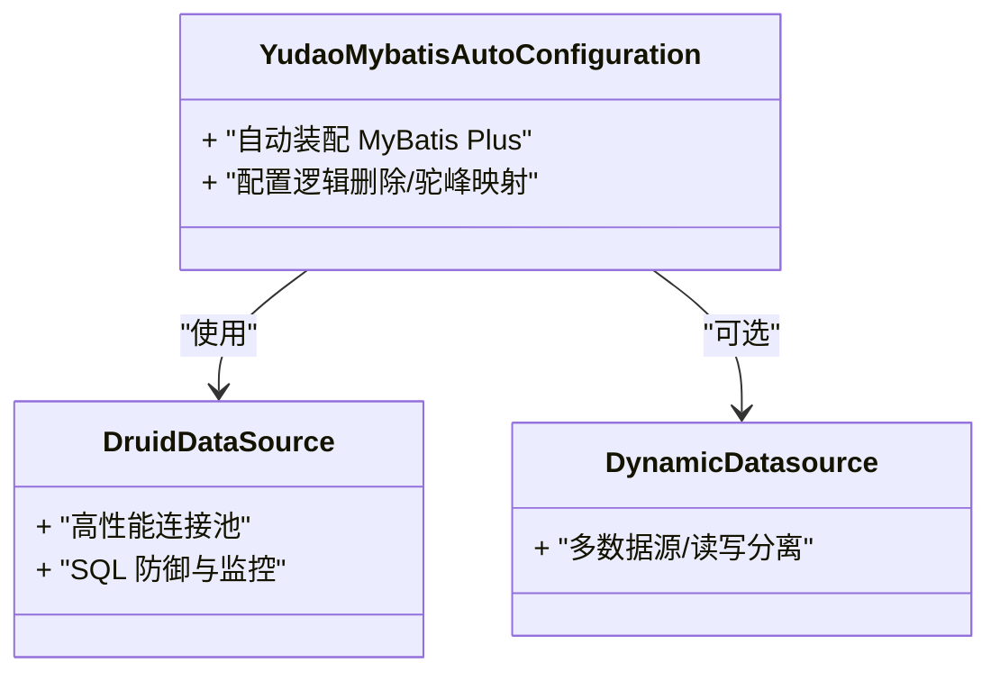
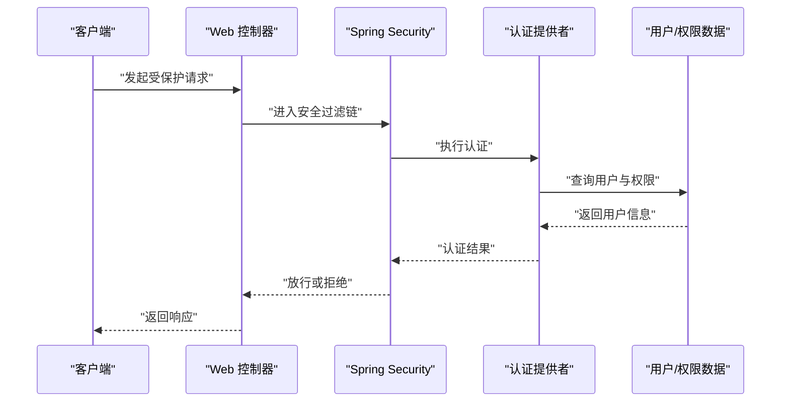
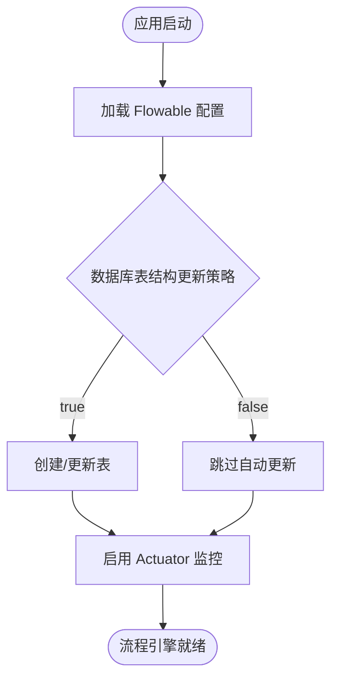
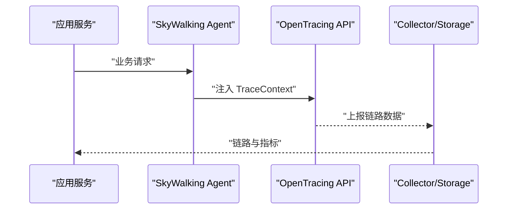
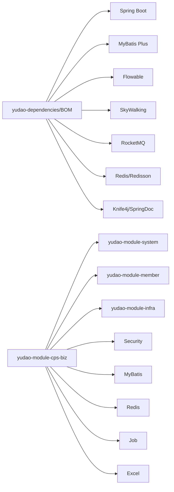

# 技术栈选型

<cite>
**本文引用的文件**   
- [pom.xml](file://pom.xml)
- [yudao-dependencies/pom.xml](file://yudao-dependencies/pom.xml)
- [yudao-server/src/main/resources/application.yaml](file://yudao-server/src/main/resources/application.yaml)
- [yudao-server/src/main/resources/application-dev.yaml](file://yudao-server/src/main/resources/application-dev.yaml)
- [yudao-server/src/main/resources/application-local.yaml](file://yudao-server/src/main/resources/application-local.yaml)
- [yudao-module-cps/yudao-module-cps-biz/pom.xml](file://yudao-module-cps/yudao-module-cps-biz/pom.xml)
- [yudao-framework/yudao-spring-boot-starter-monitor/《芋道 Spring Boot 链路追踪 SkyWalking 入门》.md](file://yudao-framework/yudao-spring-boot-starter-monitor/《芋道 Spring Boot 链路追踪 SkyWalking 入门》.md)
- [yudao-framework/yudao-spring-boot-starter-mybatis/《芋道 Spring Boot MyBatis 入门》.md](file://yudao-framework/yudao-spring-boot-starter-mybatis/《芋道 Spring Boot MyBatis 入门》.md)
- [yudao-framework/yudao-spring-boot-starter-security/《芋道 Spring Boot 安全框架 Spring Security 入门》.md](file://yudao-framework/yudao-spring-boot-starter-security/《芋道 Spring Boot 安全框架 Spring Security 入门》.md)
- [yudao-framework/yudao-spring-boot-starter-mq/《芋道 Spring Boot 消息队列 RocketMQ 入门》.md](file://yudao-framework/yudao-spring-boot-starter-mq/《芋道 Spring Boot 消息队列 RocketMQ 入门》.md)
</cite>

## 目录
1. [简介](#简介)
2. [项目结构](#项目结构)
3. [核心组件](#核心组件)
4. [架构总览](#架构总览)
5. [详细组件分析](#详细组件分析)
6. [依赖分析](#依赖分析)
7. [性能考量](#性能考量)
8. [故障排查指南](#故障排查指南)
9. [结论](#结论)
10. [附录](#附录)

## 简介
本技术栈选型文档面向 AgenticCPS 系统，系统基于统一的多模块 Maven 工程，采用 Spring Boot 3.5.9 作为应用框架，Java 17 作为默认构建与运行环境，数据库采用 MySQL 8.0+，缓存与中间件采用 Redis 6.0+，并通过 Flowable 工作流引擎支撑业务流程编排，SkyWalking 实现链路追踪与可观测性。文档将从技术选型背景、组件作用与集成方式、版本兼容与升级路径、性能与稳定性等方面进行系统化说明，并给出架构图与流程图帮助理解。

## 项目结构
AgenticCPS 采用父子工程组织，父工程负责统一版本与插件管理，子模块按业务域拆分（如 system、infra、member、pay、mall、ai、cps 等），server 作为聚合打包入口。核心技术栈在统一的依赖管理 BOM 中集中定义，确保版本一致性与可维护性。



**图表来源**
- [pom.xml:10-25](file://pom.xml#L10-L25)
- [pom.xml:47-57](file://pom.xml#L47-L57)

**章节来源**
- [pom.xml:1-176](file://pom.xml#L1-L176)

## 核心组件
- 应用框架与语言
  - Spring Boot 3.5.9：提供自动配置、Actuator、Web MVC、安全、缓存、事务等开箱即用能力。
  - Java 17：默认构建与运行环境，兼顾性能与长期支持。
- 数据访问层
  - MyBatis Plus 3.5.15：增强 ORM 能力，提供通用 CRUD、逻辑删除、分页、多数据源与联表查询扩展。
  - Druid 1.2.27：高性能连接池，内置监控与 SQL 防御。
- 缓存与中间件
  - Redis 6.0+：提供分布式缓存、限流、分布式锁、消息通道等能力。
  - Redisson 3.52.0：提供高级分布式对象与原语，简化分布式场景编程。
- 安全与鉴权
  - Spring Security：提供认证、授权、防护策略与审计能力。
- 工作流引擎
  - Flowable 7.2.0：支持 BPMN 2.0，提供流程引擎、任务管理、历史数据与可视化。
- 链路追踪与可观测性
  - SkyWalking 9.5.0：提供链路追踪、指标采集与可视化，配合 apm-toolkit 使用。
- 消息队列
  - RocketMQ Spring Boot Starter：提供高吞吐异步解耦能力。
- AI 与向量存储
  - 多模型接入与向量存储配置（Redis、Qdrant、Milvus），支持知识检索与 RAG 场景。
- 配置与文档
  - Knife4j/SpringDoc OpenAPI：接口文档与调试体验。
  - YAML 配置集中于 application.yaml，覆盖数据库、缓存、工作流、消息队列、AI 等模块。

**章节来源**
- [pom.xml:31-45](file://pom.xml#L31-L45)
- [yudao-dependencies/pom.xml:16-82](file://yudao-dependencies/pom.xml#L16-L82)
- [yudao-dependencies/pom.xml:174-260](file://yudao-dependencies/pom.xml#L174-L260)
- [yudao-dependencies/pom.xml:324-388](file://yudao-dependencies/pom.xml#L324-L388)
- [yudao-dependencies/pom.xml:431-442](file://yudao-dependencies/pom.xml#L431-L442)
- [yudao-server/src/main/resources/application.yaml:55-65](file://yudao-server/src/main/resources/application.yaml#L55-L65)
- [yudao-server/src/main/resources/application.yaml:90-100](file://yudao-server/src/main/resources/application.yaml#L90-L100)
- [yudao-server/src/main/resources/application.yaml:120-145](file://yudao-server/src/main/resources/application.yaml#L120-L145)
- [yudao-server/src/main/resources/application.yaml:146-257](file://yudao-server/src/main/resources/application.yaml#L146-L257)

## 架构总览
下图展示了 AgenticCPS 的技术栈与模块关系，以及数据与控制流的关键路径。

```mermaid
graph TB
subgraph "应用层"
S["Spring Boot 应用<br/>yudao-server"]
MWS["Web 层<br/>Controller/Handler"]
SEC["安全与鉴权<br/>Spring Security"]
MQ["消息队列<br/>RocketMQ"]
WF["工作流引擎<br/>Flowable"]
AI["AI 与向量存储<br/>OpenAI/智谱/通义等"]
end
subgraph "数据与缓存"
DB["数据库<br/>MySQL 8.0+"]
CP["连接池<br/>Druid"]
RC["缓存<br/>Redis 6.0+"]
RS["分布式能力<br/>Redisson"]
end
subgraph "可观测性"
SW["链路追踪<br/>SkyWalking"]
end
subgraph "基础设施"
CFG["配置中心<br/>application.yaml"]
DOC["接口文档<br/>Knife4j/SpringDoc"]
end
S --> MWS --> SEC
SEC --> DB
MWS --> MQ
MWS --> WF
MWS --> AI
DB --> CP
DB <- --> RC
RC --> RS
S --> SW
S --> CFG
S --> DOC
```

**图表来源**
- [pom.xml:10-25](file://pom.xml#L10-L25)
- [yudao-dependencies/pom.xml:174-260](file://yudao-dependencies/pom.xml#L174-L260)
- [yudao-dependencies/pom.xml:324-388](file://yudao-dependencies/pom.xml#L324-L388)
- [yudao-dependencies/pom.xml:431-442](file://yudao-dependencies/pom.xml#L431-L442)
- [yudao-server/src/main/resources/application.yaml:55-65](file://yudao-server/src/main/resources/application.yaml#L55-L65)
- [yudao-server/src/main/resources/application.yaml:120-145](file://yudao-server/src/main/resources/application.yaml#L120-L145)
- [yudao-server/src/main/resources/application.yaml:146-257](file://yudao-server/src/main/resources/application.yaml#L146-L257)

## 详细组件分析

### Spring Boot 3.5.9 与 Java 17
- 选型理由
  - 稳定的 LTS 与长期支持版本，生态成熟，社区活跃。
  - Java 17 提供更好的性能、内存模型与安全性，满足生产级要求。
- 集成要点
  - 通过 yudao-dependencies 统一管理 Spring Boot 版本，确保子模块一致性。
  - Maven 编译插件与参数配置满足 Spring Boot 3.x 要求。
- 版本兼容与升级
  - 升级路径建议先升级 Spring Boot，再调整第三方依赖版本，最后回归测试。
  - 注意 Lombok、MapStruct、Spring Configuration Processor 的兼容性。

**章节来源**
- [pom.xml:31-45](file://pom.xml#L31-L45)
- [pom.xml:47-57](file://pom.xml#L47-L57)

### MyBatis Plus ORM 框架
- 选型理由
  - 降低 DAO 层样板代码，提供逻辑删除、分页、多数据源、联表查询等增强能力。
- 集成方式
  - 通过 yudao-spring-boot-starter-mybatis 自动装配，结合 Druid 连接池与动态数据源。
  - application.yaml 中配置 MyBatis Plus 全局策略（驼峰映射、逻辑删除值、类型别名包等）。
- 性能与优化
  - 合理使用逻辑删除与联表查询扩展，避免 N+1 查询。
  - 预编译语句缓存与 SQL 批处理提升吞吐。



**图表来源**
- [yudao-dependencies/pom.xml:174-260](file://yudao-dependencies/pom.xml#L174-L260)
- [yudao-server/src/main/resources/application.yaml:66-82](file://yudao-server/src/main/resources/application.yaml#L66-L82)

**章节来源**
- [yudao-dependencies/pom.xml:174-260](file://yudao-dependencies/pom.xml#L174-L260)
- [yudao-server/src/main/resources/application.yaml:66-82](file://yudao-server/src/main/resources/application.yaml#L66-L82)
- [yudao-framework/yudao-spring-boot-starter-mybatis/《芋道 Spring Boot MyBatis 入门》.md:1-2](file://yudao-framework/yudao-spring-boot-starter-mybatis/《芋道 Spring Boot MyBatis 入门》.md#L1-L2)

### Spring Security 安全框架
- 选型理由
  - 提供认证、授权、防护（CSRF、CORS）、审计与操作日志等一体化安全能力。
- 集成方式
  - 通过 yudao-spring-boot-starter-security 自动装配，结合业务模块的安全配置。
- 最佳实践
  - 敏感接口白名单、IP 限制、接口加密、XSS/SQL 注入防护策略。



**图表来源**
- [yudao-dependencies/pom.xml:130-150](file://yudao-dependencies/pom.xml#L130-L150)
- [yudao-framework/yudao-spring-boot-starter-security/《芋道 Spring Boot 安全框架 Spring Security 入门》.md:1-3](file://yudao-framework/yudao-spring-boot-starter-security/《芋道 Spring Boot 安全框架 Spring Security 入门》.md#L1-L3)

**章节来源**
- [yudao-dependencies/pom.xml:130-150](file://yudao-dependencies/pom.xml#L130-L150)
- [yudao-framework/yudao-spring-boot-starter-security/《芋道 Spring Boot 安全框架 Spring Security 入门》.md:1-3](file://yudao-framework/yudao-spring-boot-starter-security/《芋道 Spring Boot 安全框架 Spring Security 入门》.md#L1-L3)

### Flowable 工作流引擎
- 选型理由
  - BPMN 2.0 标准，流程建模与执行稳定，适合复杂业务流程编排。
- 集成方式
  - 通过 flowable-spring-boot-starter-process 与 actuator 启动器自动装配。
  - application.yaml 中配置数据库初始化策略、历史级别等。
- 使用建议
  - 生产环境建议关闭自动部署流程资源目录，改为显式部署与版本管理。



**图表来源**
- [yudao-dependencies/pom.xml:431-442](file://yudao-dependencies/pom.xml#L431-L442)
- [yudao-server/src/main/resources/application.yaml:55-65](file://yudao-server/src/main/resources/application.yaml#L55-L65)

**章节来源**
- [yudao-dependencies/pom.xml:431-442](file://yudao-dependencies/pom.xml#L431-L442)
- [yudao-server/src/main/resources/application.yaml:55-65](file://yudao-server/src/main/resources/application.yaml#L55-L65)

### SkyWalking 链路追踪
- 选型理由
  - 企业级 APM，支持探针式埋点与日志集成，适合微服务与分布式场景。
- 集成方式
  - 通过 apm-toolkit-* 依赖与 OpenTracing API 集成，配合 Spring Boot Admin 与 Actuator。
- 使用建议
  - 在网关与核心服务开启追踪，合理设置采样率与日志格式，避免性能回退。



**图表来源**
- [yudao-dependencies/pom.xml:324-388](file://yudao-dependencies/pom.xml#L324-L388)
- [yudao-framework/yudao-spring-boot-starter-monitor/《芋道 Spring Boot 链路追踪 SkyWalking 入门》.md:1-2](file://yudao-framework/yudao-spring-boot-starter-monitor/《芋道 Spring Boot 链路追踪 SkyWalking 入门》.md#L1-L2)

**章节来源**
- [yudao-dependencies/pom.xml:324-388](file://yudao-dependencies/pom.xml#L324-L388)
- [yudao-framework/yudao-spring-boot-starter-monitor/《芋道 Spring Boot 链路追踪 SkyWalking 入门》.md:1-2](file://yudao-framework/yudao-spring-boot-starter-monitor/《芋道 Spring Boot 链路追踪 SkyWalking 入门》.md#L1-L2)

### 消息队列（RocketMQ）
- 选型理由
  - 高吞吐、低延迟、顺序消息与事务消息能力，适合订单、支付等强一致场景。
- 集成方式
  - 通过 rocketmq-spring-boot-starter 自动装配，Producer/Consumer 组与序列化策略在配置中定义。
- 最佳实践
  - 合理设置分区、重试与死信队列，避免消息积压与重复消费。

**章节来源**
- [yudao-dependencies/pom.xml:293-304](file://yudao-dependencies/pom.xml#L293-L304)
- [yudao-server/src/main/resources/application.yaml:120-145](file://yudao-server/src/main/resources/application.yaml#L120-L145)
- [yudao-framework/yudao-spring-boot-starter-mq/《芋道 Spring Boot 消息队列 RocketMQ 入门》.md:1-2](file://yudao-framework/yudao-spring-boot-starter-mq/《芋道 Spring Boot 消息队列 RocketMQ 入门》.md#L1-L2)

### 缓存与分布式能力（Redis/Redisson）
- 选型理由
  - Redis 提供高性能缓存与会话存储；Redisson 提供分布式锁、限流、布隆过滤器等。
- 集成方式
  - 通过 yudao-spring-boot-starter-redis 与 redisson-spring-boot-starter 自动装配。
  - application.yaml 中配置缓存 TTL、连接参数与 Redisson 基础配置。
- 最佳实践
  - 合理设置过期策略与淘汰策略，避免缓存雪崩与热点 key。

**章节来源**
- [yudao-dependencies/pom.xml:244-260](file://yudao-dependencies/pom.xml#L244-L260)
- [yudao-server/src/main/resources/application.yaml:90-100](file://yudao-server/src/main/resources/application.yaml#L90-L100)

### 数据库与连接池（MySQL 8.0+ 与 Druid）
- 选型理由
  - MySQL 8.0+ 提供更强性能与安全特性；Druid 提供连接池监控与 SQL 防御。
- 集成方式
  - application-local.yaml 与 application-dev.yaml 中配置主从、连接参数与连接池策略。
- 最佳实践
  - 启用批处理、预编译缓存与合理的连接池上限，避免连接泄漏。

**章节来源**
- [yudao-server/src/main/resources/application-local.yaml:33-50](file://yudao-server/src/main/resources/application-local.yaml#L33-L50)
- [yudao-server/src/main/resources/application-dev.yaml:36-54](file://yudao-server/src/main/resources/application-dev.yaml#L36-L54)

### AI 与向量存储（多模型接入）
- 选型理由
  - 支持多家大模型厂商与本地推理服务，满足不同场景与合规要求。
- 集成方式
  - application.yaml 中集中配置多个大模型的 API Key、Base URL、模型与检索参数。
- 最佳实践
  - 向量存储选择需结合数据规模与查询性能，合理设置索引与前缀。

**章节来源**
- [yudao-server/src/main/resources/application.yaml:146-257](file://yudao-server/src/main/resources/application.yaml#L146-L257)

## 依赖分析
- 版本管理
  - 通过 yudao-dependencies/pom.xml 的 dependencyManagement 统一管理 Spring Boot、MyBatis Plus、Flowable、SkyWalking、RocketMQ 等核心依赖版本。
- 模块依赖
  - yudao-module-cps-biz 明确依赖 system/member/infra 三大基础模块与安全、MyBatis、Redis、Job、Excel 等通用能力。
- 外部依赖
  - MySQL Connector/J、Redisson、Knife4j、SpringDoc、OkHttp 等工具类与 HTTP 客户端均在 BOM 中统一版本。



**图表来源**
- [yudao-dependencies/pom.xml:84-687](file://yudao-dependencies/pom.xml#L84-L687)
- [yudao-module-cps/yudao-module-cps-biz/pom.xml:20-119](file://yudao-module-cps/yudao-module-cps-biz/pom.xml#L20-L119)

**章节来源**
- [yudao-dependencies/pom.xml:84-687](file://yudao-dependencies/pom.xml#L84-L687)
- [yudao-module-cps/yudao-module-cps-biz/pom.xml:20-119](file://yudao-module-cps/yudao-module-cps-biz/pom.xml#L20-L119)

## 性能考量
- 连接池与数据库
  - 合理设置 Druid 连接池参数（初始/最大连接、空闲检测、预编译缓存），避免连接抖动与慢查询。
- 缓存策略
  - 采用多级缓存（本地/Redis），设置合理的 TTL 与热点 key 突破策略。
- 工作流与消息
  - Flowable 历史级别与自动部署策略影响启动与运行时性能，生产环境建议谨慎配置。
  - RocketMQ 分区与重试策略影响吞吐与延迟。
- 观测性
  - SkyWalking 采样率与日志格式需平衡性能与可观测性。

[本节为通用指导，无需列出具体文件来源]

## 故障排查指南
- 启动阶段
  - 若 Flowable 启动报数据库版本不匹配，检查 application.yaml 中 database-schema-update 与历史级别配置。
- 数据访问
  - MyBatis Plus 逻辑删除未生效或联表查询异常，核对全局配置与实体注解。
- 缓存与分布式
  - Redisson 分布式锁失效或限流异常，检查 Redis 连接与键空间命名。
- 消息队列
  - RocketMQ 消费堆积或重复消费，检查分区数、重试与死信队列配置。
- 链路追踪
  - SkyWalking Agent 未采集到链路，确认 apm-toolkit 依赖与 OpenTracing API 版本匹配。

**章节来源**
- [yudao-server/src/main/resources/application.yaml:55-65](file://yudao-server/src/main/resources/application.yaml#L55-L65)
- [yudao-dependencies/pom.xml:324-388](file://yudao-dependencies/pom.xml#L324-L388)

## 结论
AgenticCPS 采用 Spring Boot 3.5.9 + Java 17 的现代技术栈，结合 MyBatis Plus、Flowable、SkyWalking、RocketMQ、Redis/Redisson 等成熟组件，形成高可用、可扩展、可观测的企业级解决方案。通过统一的 BOM 管理与模块化设计，确保版本一致性与演进可控。建议在生产环境中严格控制工作流与消息队列的自动行为，完善缓存与数据库连接池参数，并持续关注 SkyWalking 的采样与日志策略以平衡性能与可观测性。

## 附录
- 版本兼容性与升级路径
  - Spring Boot 3.5.9 → 3.6+：优先升级 Spring Boot，再调整依赖版本，最后回归测试。
  - MyBatis Plus 3.5.15 → 3.5.x：保持与 Spring Boot 3.x 兼容，关注分页与逻辑删除变更。
  - Flowable 7.2.0 → 7.3+：关注数据库迁移脚本与历史级别变化。
  - SkyWalking 9.5.0 → 9.6+：关注探针与日志集成 API 变更。
  - RocketMQ 2.3.5 → 2.4+：关注生产者/消费者配置与序列化策略。
- 维护建议
  - 定期评估依赖安全漏洞，及时升级。
  - 建立灰度发布与回滚机制，配合 SkyWalking 快速定位问题。
  - 对关键模块进行压测与容量规划，确保峰值流量下的稳定性。

[本节为通用指导，无需列出具体文件来源]