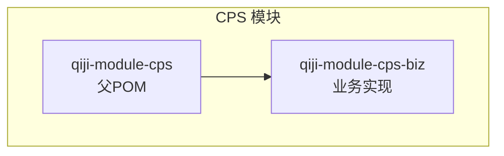
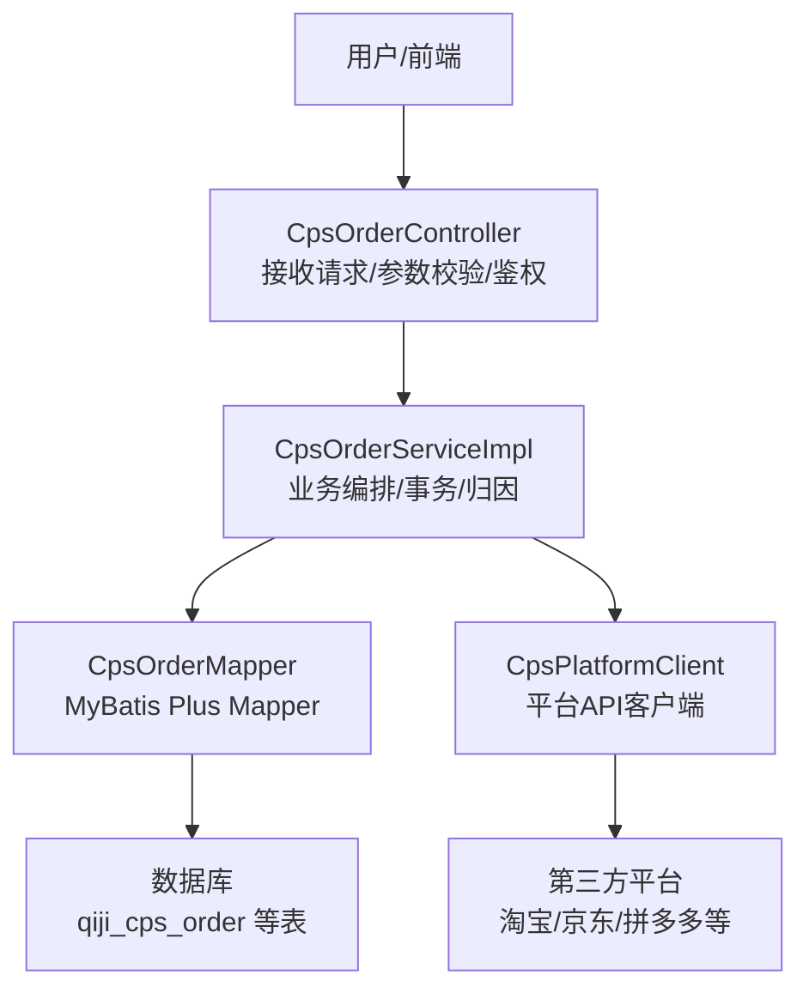
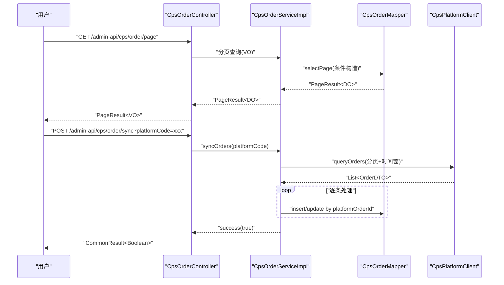
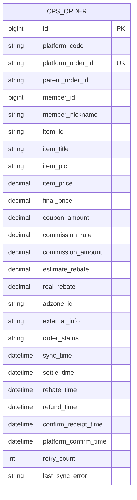
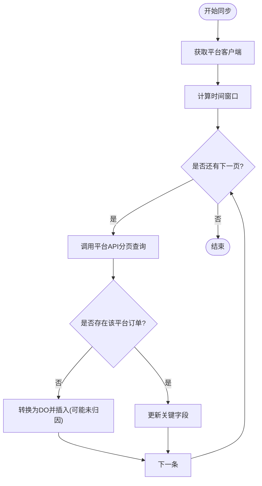
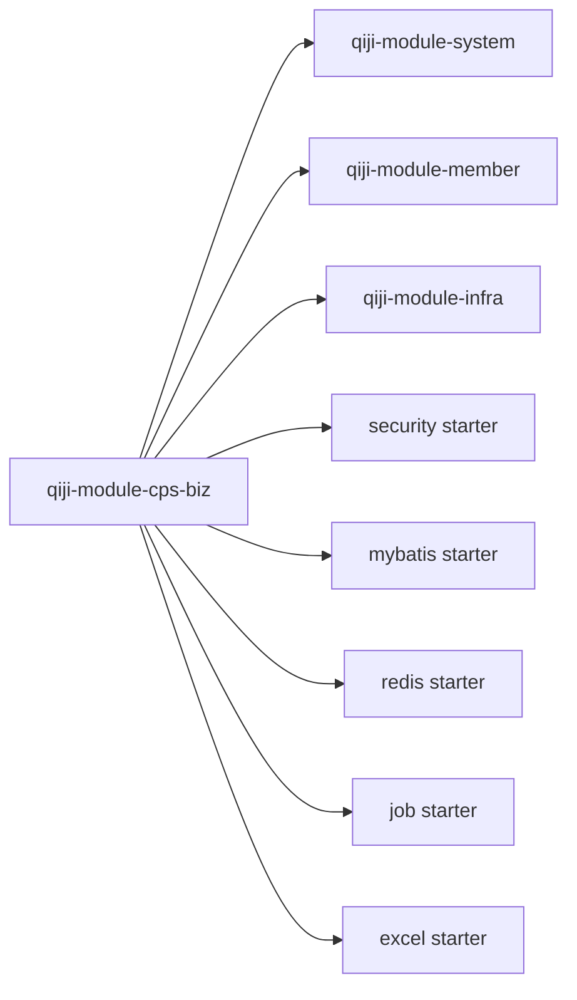

# 数据流设计

<cite>
**本文引用的文件**
- [qiji-module-cps/pom.xml](file://qiji-module-cps/pom.xml)
- [qiji-module-cps-biz/pom.xml](file://qiji-module-cps/qiji-module-cps-biz/pom.xml)
- [CpsOrderController.java](file://qiji-module-cps/qiji-module-cps-biz/src/main/java/cn/zhijian/cps/controller/admin/CpsOrderController.java)
- [CpsOrderServiceImpl.java](file://qiji-module-cps/qiji-module-cps-biz/src/main/java/cn/zhijian/cps/service/CpsOrderServiceImpl.java)
- [CpsOrderMapper.java](file://qiji-module-cps/qiji-module-cps-biz/src/main/java/cn/zhijian/cps/dal/mysql/CpsOrderMapper.java)
- [CpsOrderDO.java](file://qiji-module-cps/qiji-module-cps-biz/src/main/java/cn/zhijian/cps/dal/dataobject/CpsOrderDO.java)
- [CpsAutoConfiguration.java](file://qiji-module-cps/qiji-module-cps-biz/src/main/java/cn/zhijian/cps/config/CpsAutoConfiguration.java)
- [CpsPlatformClient.java](file://qiji-module-cps/qiji-module-cps-biz/src/main/java/cn/zhijian/cps/client/CpsPlatformClient.java)
- [CpsRebateRecordMapper.java](file://qiji-module-cps/qiji-module-cps-biz/src/main/java/cn/zhijian/cps/dal/mysql/CpsRebateRecordMapper.java)
- [CpsRebateSettleServiceImpl.java](file://qiji-module-cps/qiji-module-cps-biz/src/main/java/cn/zhijian/cps/service/commission/CpsRebateSettleServiceImpl.java)
- [cps-schema.sql](file://sql/module/cps-schema.sql)
</cite>

## 目录
1. [简介](#简介)
2. [项目结构](#项目结构)
3. [核心组件](#核心组件)
4. [架构总览](#架构总览)
5. [详细组件分析](#详细组件分析)
6. [依赖分析](#依赖分析)
7. [性能考虑](#性能考虑)
8. [故障排查指南](#故障排查指南)
9. [结论](#结论)
10. [附录](#附录)

## 简介
本文件面向 AgenticCPS 系统，聚焦“从用户请求到数据库”的完整数据流设计。围绕请求处理流程（接收、参数解析、业务处理、数据持久化、响应返回）、数据在各层间传递载体（DTO、DO、VO、Mapper/Service 层参数）、数据访问模式（MyBatis Plus CRUD、Redis 缓存策略、连接池管理）、一致性保障（事务、分布式锁、幂等性）以及典型业务场景的数据流与时序，提供系统化的数据流设计说明与可视化图示。

## 项目结构
CPS 模块采用“模块聚合 + 业务实现”分层组织：
- 模块聚合：qiji-module-cps（父 POM），负责模块声明与聚合。
- 业务实现：qiji-module-cps-biz（子模块），包含控制器、服务、数据访问对象、枚举、配置与定时任务等。

图表来源
- [qiji-module-cps/pom.xml:1-25](file://qiji-module-cps/pom.xml#L1-L25)
- [qiji-module-cps-biz/pom.xml:1-122](file://qiji-module-cps/qiji-module-cps-biz/pom.xml#L1-L122)

章节来源
- [qiji-module-cps/pom.xml:1-25](file://qiji-module-cps/pom.xml#L1-L25)
- [qiji-module-cps-biz/pom.xml:1-122](file://qiji-module-cps/qiji-module-cps-biz/pom.xml#L1-L122)

## 核心组件
- 控制器层：CpsOrderController 提供订单查询、分页、手动同步等接口，负责参数接收与权限校验。
- 服务层：CpsOrderServiceImpl 实现订单查询、分页、批量同步、单笔状态同步、归因处理与持久化。
- 数据访问层：CpsOrderMapper 继承 BaseMapperX，提供分页查询、按平台订单号查询、按条件查询等方法；CpsRebateRecordMapper 提供返利记录查询。
- 数据模型：CpsOrderDO 表示订单实体，包含平台编码、订单号、商品信息、佣金与返利金额、状态与时间戳等字段。
- 平台客户端：CpsPlatformClient 定义统一的平台对接接口（搜索、详情、链接生成、订单增量查询等）。
- 自动配置：CpsAutoConfiguration 提供 CPS 专用 RestTemplate 与搜索线程池 Bean。

章节来源
- [CpsOrderController.java:1-57](file://qiji-module-cps/qiji-module-cps-biz/src/main/java/cn/zhijian/cps/controller/admin/CpsOrderController.java#L1-L57)
- [CpsOrderServiceImpl.java:1-235](file://qiji-module-cps/qiji-module-cps-biz/src/main/java/cn/zhijian/cps/service/CpsOrderServiceImpl.java#L1-L235)
- [CpsOrderMapper.java:1-48](file://qiji-module-cps/qiji-module-cps-biz/src/main/java/cn/zhijian/cps/dal/mysql/CpsOrderMapper.java#L1-L48)
- [CpsOrderDO.java:1-80](file://qiji-module-cps/qiji-module-cps-biz/src/main/java/cn/zhijian/cps/dal/dataobject/CpsOrderDO.java#L1-L80)
- [CpsPlatformClient.java:1-67](file://qiji-module-cps/qiji-module-cps-biz/src/main/java/cn/zhijian/cps/client/CpsPlatformClient.java#L1-L67)
- [CpsAutoConfiguration.java:1-55](file://qiji-module-cps/qiji-module-cps-biz/src/main/java/cn/zhijian/cps/config/CpsAutoConfiguration.java#L1-L55)
- [CpsRebateRecordMapper.java](file://qiji-module-cps/qiji-module-cps-biz/src/main/java/cn/zhijian/cps/dal/mysql/CpsRebateRecordMapper.java)

## 架构总览
下图展示从“用户请求”到“数据库”的端到端数据流，涵盖控制器、服务、数据访问与平台对接的关键节点。

图表来源
- [CpsOrderController.java:1-57](file://qiji-module-cps/qiji-module-cps-biz/src/main/java/cn/zhijian/cps/controller/admin/CpsOrderController.java#L1-L57)
- [CpsOrderServiceImpl.java:1-235](file://qiji-module-cps/qiji-module-cps-biz/src/main/java/cn/zhijian/cps/service/CpsOrderServiceImpl.java#L1-L235)
- [CpsOrderMapper.java:1-48](file://qiji-module-cps/qiji-module-cps-biz/src/main/java/cn/zhijian/cps/dal/mysql/CpsOrderMapper.java#L1-L48)
- [CpsPlatformClient.java:1-67](file://qiji-module-cps/qiji-module-cps-biz/src/main/java/cn/zhijian/cps/client/CpsPlatformClient.java#L1-L67)
- [cps-schema.sql](file://sql/module/cps-schema.sql)

## 详细组件分析

### 请求处理流程与数据载体
- 请求接收与参数解析
  - 控制器通过注解接收参数（如分页、查询条件、平台编码），并进行权限校验。
  - 使用 VO（如 CpsOrderPageReqVO）承载请求参数，避免直接暴露 DO。
- 业务处理
  - 服务层根据 VO 组装查询条件，调用 Mapper 或平台客户端获取数据。
  - 对于同步场景，服务层封装分页请求、时间窗口、限流策略，逐页拉取并批量入库。
- 数据持久化
  - 使用 Mapper 的 insert/update 方法持久化订单；对于已存在订单执行更新。
  - 同步过程中对“归因”失败的订单仍落库，但 memberId 置空以标识未归因。
- 响应返回
  - 控制器将 DO 转换为 VO（如 CpsOrderRespVO）返回给前端。

图表来源
- [CpsOrderController.java:1-57](file://qiji-module-cps/qiji-module-cps-biz/src/main/java/cn/zhijian/cps/controller/admin/CpsOrderController.java#L1-L57)
- [CpsOrderServiceImpl.java:1-235](file://qiji-module-cps/qiji-module-cps-biz/src/main/java/cn/zhijian/cps/service/CpsOrderServiceImpl.java#L1-L235)
- [CpsOrderMapper.java:1-48](file://qiji-module-cps/qiji-module-cps-biz/src/main/java/cn/zhijian/cps/dal/mysql/CpsOrderMapper.java#L1-L48)
- [CpsPlatformClient.java:1-67](file://qiji-module-cps/qiji-module-cps-biz/src/main/java/cn/zhijian/cps/client/CpsPlatformClient.java#L1-L67)

章节来源
- [CpsOrderController.java:1-57](file://qiji-module-cps/qiji-module-cps-biz/src/main/java/cn/zhijian/cps/controller/admin/CpsOrderController.java#L1-L57)
- [CpsOrderServiceImpl.java:1-235](file://qiji-module-cps/qiji-module-cps-biz/src/main/java/cn/zhijian/cps/service/CpsOrderServiceImpl.java#L1-L235)

### 数据模型与表结构
- 订单实体（CpsOrderDO）
  - 字段覆盖平台编码、订单号、商品信息、价格与优惠、佣金与返利、状态与时间戳、归因信息、同步重试与错误信息等。
- Mapper 方法
  - 提供分页查询、按平台订单号唯一查询、按会员ID查询、按同步时间范围查询、按返利结算状态查询等。
- 数据库表
  - 由 cps-schema.sql 定义，包含 qiji_cps_order 等核心表。

图表来源
- [CpsOrderDO.java:1-80](file://qiji-module-cps/qiji-module-cps-biz/src/main/java/cn/zhijian/cps/dal/dataobject/CpsOrderDO.java#L1-L80)
- [CpsOrderMapper.java:1-48](file://qiji-module-cps/qiji-module-cps-biz/src/main/java/cn/zhijian/cps/dal/mysql/CpsOrderMapper.java#L1-L48)
- [cps-schema.sql](file://sql/module/cps-schema.sql)

章节来源
- [CpsOrderDO.java:1-80](file://qiji-module-cps/qiji-module-cps-biz/src/main/java/cn/zhijian/cps/dal/dataobject/CpsOrderDO.java#L1-L80)
- [CpsOrderMapper.java:1-48](file://qiji-module-cps/qiji-module-cps-biz/src/main/java/cn/zhijian/cps/dal/mysql/CpsOrderMapper.java#L1-L48)
- [cps-schema.sql](file://sql/module/cps-schema.sql)

### 数据访问模式与一致性保障
- MyBatis Plus CRUD
  - Mapper 继承 BaseMapperX，提供标准 CRUD 与条件构造器（LambdaQueryWrapperX）。
  - 通过 eq/ifPresent/between 等链式条件，实现灵活的分页与筛选。
- 事务管理
  - 同步方法使用 @Transactional，确保“查询平台 -> 落库/更新 -> 归因”的原子性。
- 幂等性设计
  - 以 platformOrderId 作为唯一键，先查后插/更新，避免重复入库。
  - 同步重试计数与错误信息字段，便于后续补偿处理。
- 分布式锁与并发控制
  - 当前实现未显式使用分布式锁；建议在跨实例同步时引入 Redis 分布式锁，防止重复同步。
- 缓存策略
  - 未发现 Redis 缓存使用；建议对热点查询（如订单详情、商品信息）增加缓存，结合失效策略与双写一致性。

图表来源
- [CpsOrderServiceImpl.java:1-235](file://qiji-module-cps/qiji-module-cps-biz/src/main/java/cn/zhijian/cps/service/CpsOrderServiceImpl.java#L1-L235)
- [CpsOrderMapper.java:1-48](file://qiji-module-cps/qiji-module-cps-biz/src/main/java/cn/zhijian/cps/dal/mysql/CpsOrderMapper.java#L1-L48)

章节来源
- [CpsOrderServiceImpl.java:1-235](file://qiji-module-cps/qiji-module-cps-biz/src/main/java/cn/zhijian/cps/service/CpsOrderServiceImpl.java#L1-L235)
- [CpsOrderMapper.java:1-48](file://qiji-module-cps/qiji-module-cps-biz/src/main/java/cn/zhijian/cps/dal/mysql/CpsOrderMapper.java#L1-L48)

### 返利结算与统计
- 返利记录查询
  - 通过 CpsRebateRecordMapper 提供按条件查询返利记录的能力。
- 结算服务
  - CpsRebateSettleServiceImpl 实现返利结算逻辑，通常基于订单状态与时间窗口进行批量结算。

章节来源
- [CpsRebateRecordMapper.java](file://qiji-module-cps/qiji-module-cps-biz/src/main/java/cn/zhijian/cps/dal/mysql/CpsRebateRecordMapper.java)
- [CpsRebateSettleServiceImpl.java](file://qiji-module-cps/qiji-module-cps-biz/src/main/java/cn/zhijian/cps/service/commission/CpsRebateSettleServiceImpl.java)

## 依赖分析
- 模块依赖
  - qiji-module-cps-biz 依赖 system/member/infra 模块，以及 qiji-spring-boot-starter-* 组件（安全、验证、MyBatis、Redis、作业调度、Excel 等）。
- 运行时依赖
  - OkHttp3 客户端用于平台对接；RestTemplate 通过 OkHttp3ClientHttpRequestFactory 注入；线程池用于多平台并行搜索。

图表来源
- [qiji-module-cps-biz/pom.xml:1-122](file://qiji-module-cps/qiji-module-cps-biz/pom.xml#L1-L122)

章节来源
- [qiji-module-cps-biz/pom.xml:1-122](file://qiji-module-cps/qiji-module-cps-biz/pom.xml#L1-L122)

## 性能考虑
- 并发与限流
  - 平台侧限流：通过同步配置的请求间隔与最大分页大小控制请求频率。
  - 线程池：搜索线程池用于多平台并行查询，提升吞吐。
- 数据库优化
  - 建议为 platform_order_id、member_id、sync_time、rebate_time 等常用查询字段建立索引。
  - 分页查询使用条件过滤，避免全表扫描。
- 缓存与异步
  - 对高频读取的订单详情与商品信息增加缓存；写入时采用“先写库再删缓存”策略。
  - 结算与同步可拆分为异步任务，降低请求延迟。
- 监控与可观测性
  - 埋点统计：同步耗时、成功/失败率、重试次数、平台错误码分布。
  - 链路追踪：对关键链路打点，定位慢调用与异常。

## 故障排查指南
- 同步失败
  - 检查平台客户端可用性与签名/鉴权配置；查看 last_sync_error 字段与 retry_count。
  - 核对时间窗口与分页大小设置，避免遗漏数据。
- 幂等问题
  - 若出现重复订单，检查 platform_order_id 唯一约束与去重逻辑。
- 归因失败
  - 确认 attributionService 的归因规则与外部追踪参数；必要时人工干预。
- 数据不一致
  - 核对事务边界与异常回滚；对异常订单进行补偿处理。

章节来源
- [CpsOrderServiceImpl.java:1-235](file://qiji-module-cps/qiji-module-cps-biz/src/main/java/cn/zhijian/cps/service/CpsOrderServiceImpl.java#L1-L235)
- [CpsOrderDO.java:1-80](file://qiji-module-cps/qiji-module-cps-biz/src/main/java/cn/zhijian/cps/dal/dataobject/CpsOrderDO.java#L1-L80)

## 结论
AgenticCPS 的数据流以“控制器-服务-数据访问-平台客户端-数据库”为主线，通过 VO/DTO/DO 的清晰分层与 MyBatis Plus 的条件构造实现高效查询与落库。事务与幂等设计保障了数据一致性，未来可在分布式锁、Redis 缓存与异步化方面进一步优化，配合监控与补偿机制，构建高可靠、高性能的返利系统。

## 附录
- 关键接口路径参考
  - 订单详情：GET /admin-api/cps/order/get?id={id}
  - 订单分页：GET /admin-api/cps/order/page
  - 手动同步：POST /admin-api/cps/order/sync?platformCode={code}
- 数据模型字段说明
  - 平台编码、平台订单号、会员ID、商品信息、价格与优惠、佣金与返利、状态与时间戳、归因信息、同步重试与错误信息等。