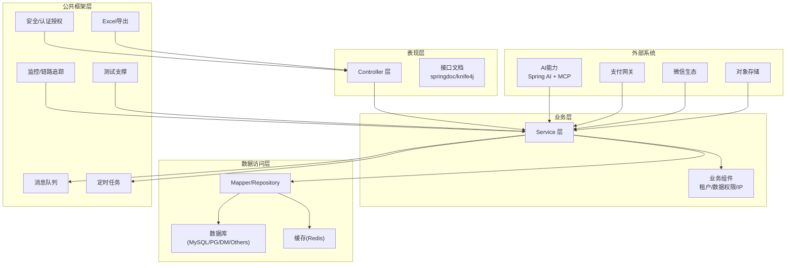
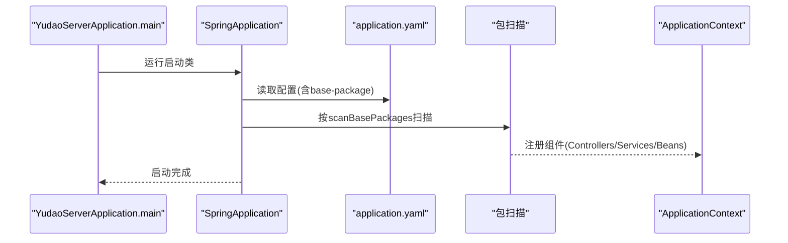
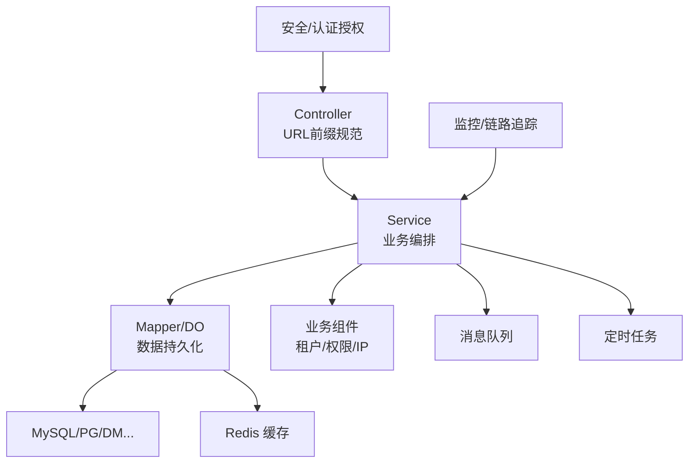
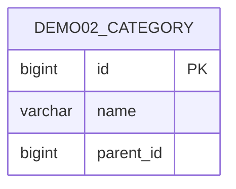
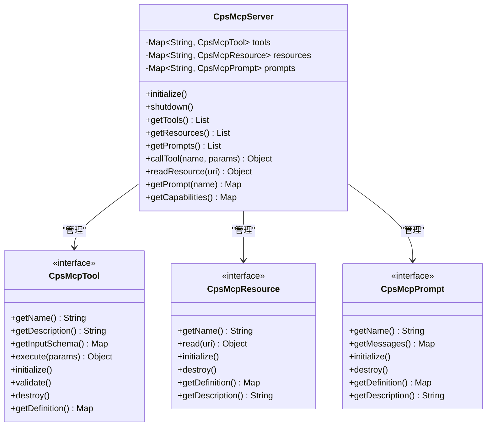
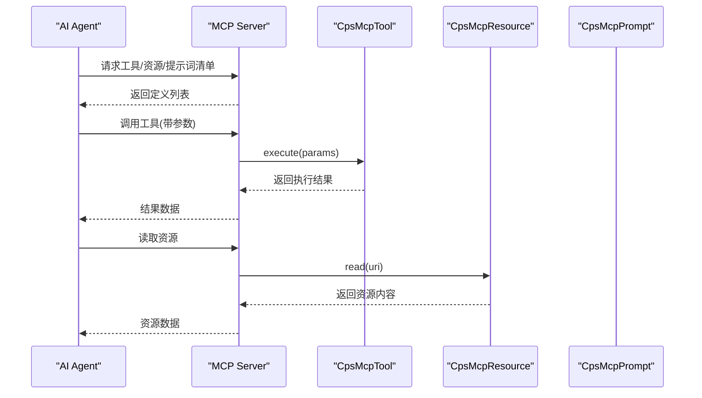
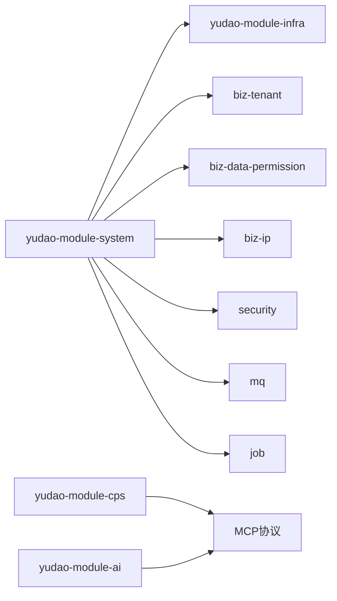

# 整体架构概览

<cite>
**本文引用的文件**
- [pom.xml](file://pom.xml)
- [yudao-framework/pom.xml](file://yudao-framework/pom.xml)
- [yudao-dependencies/pom.xml](file://yudao-dependencies/pom.xml)
- [yudao-server/src/main/java/cn/iocoder/yudao/server/YudaoServerApplication.java](file://yudao-server/src/main/java/cn/iocoder/yudao/server/YudaoServerApplication.java)
- [yudao-server/src/main/resources/application.yaml](file://yudao-server/src/main/resources/application.yaml)
- [yudao-module-system/pom.xml](file://yudao-module-system/pom.xml)
- [yudao-module-system/src/main/java/cn/iocoder/yudao/module/system/package-info.java](file://yudao-module-system/src/main/java/cn/iocoder/yudao/module/system/package-info.java)
- [yudao-module-system/src/main/java/cn/iocoder/yudao/module/system/dal/mysql/package-info.java](file://yudao-module-system/src/main/java/cn/iocoder/yudao/module/system/dal/mysql/package-info.java)
- [yudao-module-member/src/main/java/cn/iocoder/yudao/module/member/dal/package-info.java](file://yudao-module-member/src/main/java/cn/iocoder/yudao/module/member/dal/package-info.java)
- [yudao-module-mall/yudao-module-product/src/main/java/cn/iocoder/yudao/module/product/package-info.java](file://yudao-module-mall/yudao-module-product/src/main/java/cn/iocoder/yudao/module/product/package-info.java)
- [yudao-module-mall/yudao-module-promotion/src/main/java/cn/iocoder/yudao/module/promotion/package-info.java](file://yudao-module-mall/yudao-module-promotion/src/main/java/cn/iocoder/yudao/module/promotion/package-info.java)
- [yudao-module-infra/src/main/java/cn/iocoder/yudao/module/infra/dal/dataobject/demo/demo02/Demo02CategoryDO.java](file://yudao-module-infra/src/main/java/cn/iocoder/yudao/module/infra/dal/dataobject/demo/demo02/Demo02CategoryDO.java)
- [yudao-module-infra/src/main/java/cn/iocoder/yudao/module/infra/service/demo/demo02/Demo02CategoryServiceImpl.java](file://yudao-module-infra/src/main/java/cn/iocoder/yudao/module/infra/service/demo/demo02/Demo02CategoryServiceImpl.java)
- [yudao-module-cps/pom.xml](file://yudao-module-cps/pom.xml)
- [yudao-module-cps/yudao-module-cps-biz/src/main/java/cn/zhijian/cps/mcp/server/CpsMcpServer.java](file://yudao-module-cps/yudao-module-cps-biz/src/main/java/cn/zhijian/cps/mcp/server/CpsMcpServer.java)
- [yudao-module-cps/yudao-module-cps-biz/src/main/java/cn/zhijian/cps/mcp/server/CpsMcpServerConfig.java](file://yudao-module-cps/yudao-module-cps-biz/src/main/java/cn/zhijian/cps/mcp/server/CpsMcpServerConfig.java)
- [yudao-module-cps/yudao-module-cps-biz/src/main/java/cn/zhijian/cps/mcp/tool/CpsMcpTool.java](file://yudao-module-cps/yudao-module-cps-biz/src/main/java/cn/zhijian/cps/mcp/tool/CpsMcpTool.java)
- [yudao-module-cps/yudao-module-cps-biz/src/main/java/cn/zhijian/cps/mcp/resource/CpsMcpResource.java](file://yudao-module-cps/yudao-module-cps-biz/src/main/java/cn/zhijian/cps/mcp/resource/CpsMcpResource.java)
- [yudao-module-cps/yudao-module-cps-biz/src/main/java/cn/zhijian/cps/mcp/prompt/CpsMcpPrompt.java](file://yudao-module-cps/yudao-module-cps-biz/src/main/java/cn/zhijian/cps/mcp/prompt/CpsMcpPrompt.java)
- [yudao-module-ai/pom.xml](file://yudao-module-ai/pom.xml)
- [yudao-module-ai/src/main/java/cn/iocoder/yudao/module/ai/framework/security/config/SecurityConfiguration.java](file://yudao-module-ai/src/main/java/cn/iocoder/yudao/module/ai/framework/security/config/SecurityConfiguration.java)
- [docs/CPS系统PRD文档.md](file://docs/CPS系统PRD文档.md)
</cite>

## 目录
1. [简介](#简介)
2. [项目结构](#项目结构)
3. [核心组件](#核心组件)
4. [架构总览](#架构总览)
5. [详细组件分析](#详细组件分析)
6. [依赖分析](#依赖分析)
7. [性能考虑](#性能考虑)
8. [故障排查指南](#故障排查指南)
9. [结论](#结论)
10. [附录](#附录)

## 简介
本文件面向AgenticCPS系统，提供整体架构概览文档。重点阐述基于Spring Boot的多模块架构布局、模块间依赖关系与启动流程；详解YudaoServerApplication主启动类的扫描机制与包路径配置；说明从表现层到业务层再到数据访问层的分层设计理念；介绍模块化架构的优势与实现方式，包括yudao-framework公共框架与各业务模块的职责划分；最后给出系统架构图、组件关系图以及系统边界、外部依赖与第三方集成方案。

## 项目结构
AgenticCPS采用Maven多模块聚合工程，顶层pom集中管理版本与插件，并通过modules声明各子模块。yudao-framework提供通用技术组件与业务组件，yudao-server为主服务入口，各yudao-module-*为具体业务域模块。

```mermaid
graph TB
Root["顶层聚合模块<br/>pom.xml"] --> Deps["yudao-dependencies<br/>统一依赖版本"]
Root --> FW["yudao-framework<br/>公共框架"]
Root --> Server["yudao-server<br/>主服务入口"]
Root --> Modules["业务模块集合<br/>system/member/pay/mall/infra/report/mp/ai/cps 等"]
FW --> FW_Common["yudao-common"]
FW --> FW_DB["yudao-spring-boot-starter-mybatis"]
FW --> FW_Redis["yudao-spring-boot-starter-redis"]
FW --> FW_Web["yudao-spring-boot-starter-web"]
FW --> FW_Security["yudao-spring-boot-starter-security"]
FW --> FW_WS["yudao-spring-boot-starter-websocket"]
FW --> FW_Monitor["yudao-spring-boot-starter-monitor"]
FW --> FW_Protect["yudao-spring-boot-starter-protection"]
FW --> FW_Job["yudao-spring-boot-starter-job"]
FW --> FW_MQ["yudao-spring-boot-starter-mq"]
FW --> FW_Excel["yudao-spring-boot-starter-excel"]
FW --> FW_Test["yudao-spring-boot-starter-test"]
FW --> FW_Tenant["yudao-spring-boot-starter-biz-tenant"]
FW --> FW_DataPerm["yudao-spring-boot-starter-biz-data-permission"]
FW --> FW_IP["yudao-spring-boot-starter-biz-ip"]
```

**图表来源**
- [pom.xml:10-25](file://pom.xml#L10-L25)
- [yudao-framework/pom.xml:12-31](file://yudao-framework/pom.xml#L12-L31)

**章节来源**
- [pom.xml:10-25](file://pom.xml#L10-L25)
- [yudao-framework/pom.xml:12-31](file://yudao-framework/pom.xml#L12-L31)

## 核心组件
- 顶层聚合与依赖管理
  - 顶层pom集中声明modules与依赖版本策略，yudao-dependencies提供统一BOM管理，确保各模块依赖一致性。
- yudao-framework公共框架
  - 提供通用技术组件（MyBatis、Redis、Web、安全、WebSocket、监控、保护、定时任务、消息队列、Excel、测试、多租户、数据权限、IP等）。
- yudao-server主服务
  - 作为Spring Boot应用入口，负责应用上下文初始化、组件扫描与启动。
- 业务模块
  - system（通用业务）、member（会员）、pay（支付）、mall（电商）、infra（基础设施）、report（报表）、mp（微信）、ai（AI能力）、cps（CPS联盟）等。

**章节来源**
- [pom.xml:10-25](file://pom.xml#L10-L25)
- [yudao-framework/pom.xml:12-31](file://yudao-framework/pom.xml#L12-L31)
- [yudao-dependencies/pom.xml:84-687](file://yudao-dependencies/pom.xml#L84-L687)

## 架构总览
AgenticCPS采用分层架构与模块化设计：
- 表现层：基于Spring MVC的Controller层，提供REST API与Swagger接口文档。
- 业务层：Service层封装领域业务逻辑，协调DAO与外部服务。
- 数据访问层：Mapper/Repository负责数据库与缓存交互，结合MyBatis Plus与Redisson。
- 公共框架层：yudao-framework提供横切能力（安全、监控、消息队列、定时任务、Excel、测试等）。
- 外部集成：AI能力（Spring AI + MCP）、支付通道、微信生态、对象存储等。

**图表来源**
- [yudao-server/src/main/resources/application.yaml:41-54](file://yudao-server/src/main/resources/application.yaml#L41-L54)
- [yudao-module-system/pom.xml:20-122](file://yudao-module-system/pom.xml#L20-L122)
- [yudao-module-ai/pom.xml:198-223](file://yudao-module-ai/pom.xml#L198-L223)

## 详细组件分析

### 启动类与扫描机制
- YudaoServerApplication作为Spring Boot启动类，使用@SpringBootApplication注解并自定义scanBasePackages，扫描server与module包路径，确保各业务模块的组件被纳入容器。
- application.yaml中定义了基础包名占位符yudao.info.base-package，配合启动类的包扫描路径，形成灵活的命名空间隔离。

**图表来源**
- [yudao-server/src/main/java/cn/iocoder/yudao/server/YudaoServerApplication.java:15-16](file://yudao-server/src/main/java/cn/iocoder/yudao/server/YudaoServerApplication.java#L15-L16)
- [yudao-server/src/main/resources/application.yaml:260-264](file://yudao-server/src/main/resources/application.yaml#L260-L264)

**章节来源**
- [yudao-server/src/main/java/cn/iocoder/yudao/server/YudaoServerApplication.java:15-16](file://yudao-server/src/main/java/cn/iocoder/yudao/server/YudaoServerApplication.java#L15-L16)
- [yudao-server/src/main/resources/application.yaml:260-264](file://yudao-server/src/main/resources/application.yaml#L260-L264)

### 分层架构与模块职责
- 表现层（Controller）
  - 以模块为单位划分URL前缀，避免冲突，如system以/system/开头、promotion以/promotion/开头等。
- 业务层（Service）
  - 负责业务编排与校验，调用DAO与外部服务，遵循单一职责与高内聚。
- 数据访问层（Mapper/DO/Redis）
  - DO命名与表前缀规范，Mapper映射SQL，Redis提供缓存能力。
- 公共框架（yudao-framework）
  - 提供安全、监控、消息队列、定时任务、Excel、测试、多租户、数据权限、IP等通用能力。

**图表来源**
- [yudao-module-system/src/main/java/cn/iocoder/yudao/module/system/package-info.java:1-8](file://yudao-module-system/src/main/java/cn/iocoder/yudao/module/system/package-info.java#L1-L8)
- [yudao-module-mall/yudao-module-product/src/main/java/cn/iocoder/yudao/module/product/package-info.java:1-8](file://yudao-module-mall/yudao-module-product/src/main/java/cn/iocoder/yudao/module/product/package-info.java#L1-L8)
- [yudao-module-mall/yudao-module-promotion/src/main/java/cn/iocoder/yudao/module/promotion/package-info.java:1-8](file://yudao-module-mall/yudao-module-promotion/src/main/java/cn/iocoder/yudao/module/promotion/package-info.java#L1-L8)
- [yudao-module-system/src/main/java/cn/iocoder/yudao/module/system/dal/mysql/package-info.java:1-9](file://yudao-module-system/src/main/java/cn/iocoder/yudao/module/system/dal/mysql/package-info.java#L1-L9)
- [yudao-module-member/src/main/java/cn/iocoder/yudao/module/member/dal/package-info.java:1-9](file://yudao-module-member/src/main/java/cn/iocoder/yudao/module/member/dal/package-info.java#L1-L9)

**章节来源**
- [yudao-module-system/src/main/java/cn/iocoder/yudao/module/system/package-info.java:1-8](file://yudao-module-system/src/main/java/cn/iocoder/yudao/module/system/package-info.java#L1-L8)
- [yudao-module-mall/yudao-module-product/src/main/java/cn/iocoder/yudao/module/product/package-info.java:1-8](file://yudao-module-mall/yudao-module-product/src/main/java/cn/iocoder/yudao/module/product/package-info.java#L1-L8)
- [yudao-module-mall/yudao-module-promotion/src/main/java/cn/iocoder/yudao/module/promotion/package-info.java:1-8](file://yudao-module-mall/yudao-module-promotion/src/main/java/cn/iocoder/yudao/module/promotion/package-info.java#L1-L8)
- [yudao-module-system/src/main/java/cn/iocoder/yudao/module/system/dal/mysql/package-info.java:1-9](file://yudao-module-system/src/main/java/cn/iocoder/yudao/module/system/dal/mysql/package-info.java#L1-L9)
- [yudao-module-member/src/main/java/cn/iocoder/yudao/module/member/dal/package-info.java:1-9](file://yudao-module-member/src/main/java/cn/iocoder/yudao/module/member/dal/package-info.java#L1-L9)

### 数据模型与DAO示例
- Demo02CategoryDO展示了DO命名规范与表前缀约定，Mapper负责SQL映射，Service实现业务逻辑与校验。
- 该示例体现了“表前缀+模块名”的命名约定，便于数据库层面的模块隔离与维护。

**图表来源**
- [yudao-module-infra/src/main/java/cn/iocoder/yudao/module/infra/dal/dataobject/demo/demo02/Demo02CategoryDO.java:14-40](file://yudao-module-infra/src/main/java/cn/iocoder/yudao/module/infra/dal/dataobject/demo/demo02/Demo02CategoryDO.java#L14-L40)

**章节来源**
- [yudao-module-infra/src/main/java/cn/iocoder/yudao/module/infra/dal/dataobject/demo/demo02/Demo02CategoryDO.java:14-40](file://yudao-module-infra/src/main/java/cn/iocoder/yudao/module/infra/dal/dataobject/demo/demo02/Demo02CategoryDO.java#L14-L40)
- [yudao-module-infra/src/main/java/cn/iocoder/yudao/module/infra/service/demo/demo02/Demo02CategoryServiceImpl.java:23-134](file://yudao-module-infra/src/main/java/cn/iocoder/yudao/module/infra/service/demo/demo02/Demo02CategoryServiceImpl.java#L23-L134)

### CPS模块与MCP协议集成
- yudao-module-cps通过MCP（Model Context Protocol）协议对外提供工具、资源与提示词能力，支持AI Agent调用。
- CpsMcpServer负责生命周期管理（初始化/销毁），并提供工具与资源的注册与发现。
- CpsMcpTool、CpsMcpResource、CpsMcpPrompt定义了MCP协议的标准接口，便于扩展与组合。

**图表来源**
- [yudao-module-cps/yudao-module-cps-biz/src/main/java/cn/zhijian/cps/mcp/server/CpsMcpServer.java:16-161](file://yudao-module-cps/yudao-module-cps-biz/src/main/java/cn/zhijian/cps/mcp/server/CpsMcpServer.java#L16-L161)
- [yudao-module-cps/yudao-module-cps-biz/src/main/java/cn/zhijian/cps/mcp/server/CpsMcpServerConfig.java:15-30](file://yudao-module-cps/yudao-module-cps-biz/src/main/java/cn/zhijian/cps/mcp/server/CpsMcpServerConfig.java#L15-L30)
- [yudao-module-cps/yudao-module-cps-biz/src/main/java/cn/zhijian/cps/mcp/tool/CpsMcpTool.java:9-62](file://yudao-module-cps/yudao-module-cps-biz/src/main/java/cn/zhijian/cps/mcp/tool/CpsMcpTool.java#L9-L62)
- [yudao-module-cps/yudao-module-cps-biz/src/main/java/cn/zhijian/cps/mcp/resource/CpsMcpResource.java:9-51](file://yudao-module-cps/yudao-module-cps-biz/src/main/java/cn/zhijian/cps/mcp/resource/CpsMcpResource.java#L9-L51)
- [yudao-module-cps/yudao-module-cps-biz/src/main/java/cn/zhijian/cps/mcp/prompt/CpsMcpPrompt.java:9-52](file://yudao-module-cps/yudao-module-cps-biz/src/main/java/cn/zhijian/cps/mcp/prompt/CpsMcpPrompt.java#L9-L52)

**章节来源**
- [yudao-module-cps/pom.xml:14-22](file://yudao-module-cps/pom.xml#L14-L22)
- [yudao-module-cps/yudao-module-cps-biz/src/main/java/cn/zhijian/cps/mcp/server/CpsMcpServer.java:16-161](file://yudao-module-cps/yudao-module-cps-biz/src/main/java/cn/zhijian/cps/mcp/server/CpsMcpServer.java#L16-L161)
- [yudao-module-cps/yudao-module-cps-biz/src/main/java/cn/zhijian/cps/mcp/server/CpsMcpServerConfig.java:15-30](file://yudao-module-cps/yudao-module-cps-biz/src/main/java/cn/zhijian/cps/mcp/server/CpsMcpServerConfig.java#L15-L30)
- [yudao-module-cps/yudao-module-cps-biz/src/main/java/cn/zhijian/cps/mcp/tool/CpsMcpTool.java:9-62](file://yudao-module-cps/yudao-module-cps-biz/src/main/java/cn/zhijian/cps/mcp/tool/CpsMcpTool.java#L9-L62)
- [yudao-module-cps/yudao-module-cps-biz/src/main/java/cn/zhijian/cps/mcp/resource/CpsMcpResource.java:9-51](file://yudao-module-cps/yudao-module-cps-biz/src/main/java/cn/zhijian/cps/mcp/resource/CpsMcpResource.java#L9-L51)
- [yudao-module-cps/yudao-module-cps-biz/src/main/java/cn/zhijian/cps/mcp/prompt/CpsMcpPrompt.java:9-52](file://yudao-module-cps/yudao-module-cps-biz/src/main/java/cn/zhijian/cps/mcp/prompt/CpsMcpPrompt.java#L9-L52)

### AI模块与MCP集成
- yudao-module-ai引入spring-ai-starter-mcp-server-webmvc与spring-ai-starter-mcp-client，避免与WebFlux冲突，确保SSE Server正常工作。
- SecurityConfiguration针对MCP相关端点进行安全授权定制，结合yudao-framework的安全组件实现统一鉴权。

**图表来源**
- [yudao-module-ai/pom.xml:198-223](file://yudao-module-ai/pom.xml#L198-L223)
- [yudao-module-ai/src/main/java/cn/iocoder/yudao/module/ai/framework/security/config/SecurityConfiguration.java:17-30](file://yudao-module-ai/src/main/java/cn/iocoder/yudao/module/ai/framework/security/config/SecurityConfiguration.java#L17-L30)
- [yudao-module-cps/yudao-module-cps-biz/src/main/java/cn/zhijian/cps/mcp/server/CpsMcpServer.java:87-161](file://yudao-module-cps/yudao-module-cps-biz/src/main/java/cn/zhijian/cps/mcp/server/CpsMcpServer.java#L87-L161)

**章节来源**
- [yudao-module-ai/pom.xml:198-223](file://yudao-module-ai/pom.xml#L198-L223)
- [yudao-module-ai/src/main/java/cn/iocoder/yudao/module/ai/framework/security/config/SecurityConfiguration.java:17-30](file://yudao-module-ai/src/main/java/cn/iocoder/yudao/module/ai/framework/security/config/SecurityConfiguration.java#L17-L30)
- [yudao-module-cps/yudao-module-cps-biz/src/main/java/cn/zhijian/cps/mcp/server/CpsMcpServer.java:87-161](file://yudao-module-cps/yudao-module-cps-biz/src/main/java/cn/zhijian/cps/mcp/server/CpsMcpServer.java#L87-L161)

### 系统边界与外部依赖
- 系统边界
  - 内部：yudao-server + yudao-framework + 各业务模块（system/member/pay/mall/infra/report/mp/ai/cps）。
  - 外部：AI服务（Spring AI + MCP）、支付网关、微信生态、对象存储（AWS S3等）、消息队列（RocketMQ/Kafka/RabbitMQ）、数据库（MySQL/PG/DM/Others）。
- 第三方集成
  - 支付：alipay-sdk-java、wx-java系列。
  - 社交登录：JustAuth。
  - 对象存储：aws-sdk-java s3。
  - 消息队列：rocketmq-spring、spring-kafka、spring-amqp等。

**章节来源**
- [yudao-dependencies/pom.xml:612-685](file://yudao-dependencies/pom.xml#L612-L685)
- [yudao-module-system/pom.xml:93-121](file://yudao-module-system/pom.xml#L93-L121)

## 依赖分析
- 依赖管理
  - yudao-dependencies集中管理Spring Boot、MyBatis、Redisson、RocketMQ、JustAuth、AWS SDK等版本，确保一致性与可维护性。
- 模块间依赖
  - yudao-module-system依赖yudao-module-infra提供通用能力，同时引入业务组件与安全、消息队列、定时任务等框架组件。
  - yudao-module-cps通过MCP协议与AI模块协作，形成AI Agent与业务工具的桥接。

**图表来源**
- [yudao-module-system/pom.xml:20-122](file://yudao-module-system/pom.xml#L20-L122)
- [yudao-dependencies/pom.xml:102-128](file://yudao-dependencies/pom.xml#L102-L128)

**章节来源**
- [yudao-module-system/pom.xml:20-122](file://yudao-module-system/pom.xml#L20-L122)
- [yudao-dependencies/pom.xml:102-128](file://yudao-dependencies/pom.xml#L102-L128)

## 性能考虑
- 启动与扫描
  - application.yaml允许循环依赖，满足三层架构的天然耦合场景，减少重构成本。
  - scanBasePackages精准扫描，避免过度加载。
- 缓存与数据库
  - Cache类型设为REDIS，合理设置TTL，降低数据库压力。
  - MyBatis Plus逻辑删除、联表查询增强与类型映射优化。
- 并发与异步
  - 定时任务与消息队列解耦业务高峰，提高吞吐。
- 监控与可观测性
  - SkyWalking链路追踪、Spring Boot Admin监控端点、OpenAPI接口文档。

**章节来源**
- [yudao-server/src/main/resources/application.yaml:8-31](file://yudao-server/src/main/resources/application.yaml#L8-L31)
- [yudao-server/src/main/resources/application.yaml:66-89](file://yudao-server/src/main/resources/application.yaml#L66-L89)

## 故障排查指南
- 启动问题
  - 启动类注释中明确指向快速开始文档链接，遇到启动问题优先查阅文档。
- 包扫描问题
  - 确认yudao.info.base-package占位符正确注入，scanBasePackages路径与实际包结构一致。
- 循环依赖
  - 允许循环依赖配置已开启，若仍出现异常，检查模块间依赖方向与装配顺序。
- 安全与授权
  - AI模块的MCP端点需在SecurityConfiguration中进行授权定制，避免访问受限。

**章节来源**
- [yudao-server/src/main/java/cn/iocoder/yudao/server/YudaoServerApplication.java:6-12](file://yudao-server/src/main/java/cn/iocoder/yudao/server/YudaoServerApplication.java#L6-L12)
- [yudao-server/src/main/resources/application.yaml:8-10](file://yudao-server/src/main/resources/application.yaml#L8-L10)
- [yudao-module-ai/src/main/java/cn/iocoder/yudao/module/ai/framework/security/config/SecurityConfiguration.java:25-30](file://yudao-module-ai/src/main/java/cn/iocoder/yudao/module/ai/framework/security/config/SecurityConfiguration.java#L25-L30)

## 结论
AgenticCPS以Spring Boot多模块架构为基础，通过yudao-framework提供横切能力，结合清晰的分层设计与模块职责划分，实现了高内聚、低耦合的系统组织。启动类与配置文件共同确保了包扫描与环境适配的灵活性；CPS模块借助MCP协议与AI模块深度集成，支撑AI Agent在多平台比价、商品搜索、订单追踪等场景下的应用。整体架构兼顾扩展性与稳定性，为后续业务演进提供了坚实基础。

## 附录
- PRD中关于AI Agent与MCP的用例与流程，可作为系统行为的参考依据。
- 各模块的URL前缀与表前缀规范，有助于理解系统边界与数据模型。

**章节来源**
- [docs/CPS系统PRD文档.md:643-696](file://docs/CPS系统PRD文档.md#L643-L696)