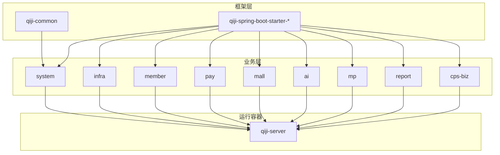
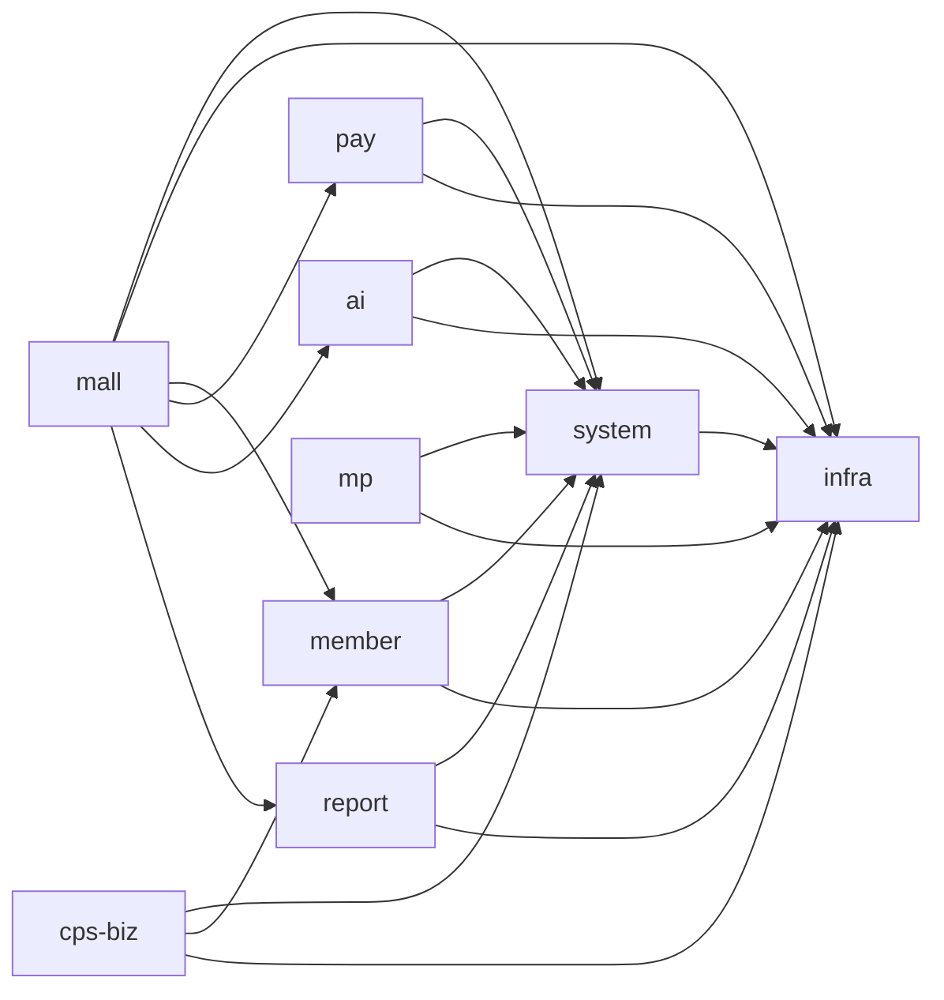

# 模块化设计

<cite>
**本文引用的文件**
- [根聚合 POM](file://pom.xml)
- [框架聚合 POM](file://qiji-framework/pom.xml)
- [服务端聚合 POM](file://qiji-server/pom.xml)
- [系统模块 POM](file://qiji-module-system/pom.xml)
- [基础设施模块 POM](file://qiji-module-infra/pom.xml)
- [会员中心模块 POM](file://qiji-module-member/pom.xml)
- [支付系统模块 POM](file://qiji-module-pay/pom.xml)
- [商城系统模块 POM](file://qiji-module-mall/pom.xml)
- [AI大模型模块 POM](file://qiji-module-ai/pom.xml)
- [CPS联盟返利模块 POM](file://qiji-module-cps/qiji-module-cps-biz/pom.xml)
- [报表模块 POM](file://qiji-module-report/pom.xml)
- [微信公众号模块 POM](file://qiji-module-mp/pom.xml)
- [公共返回体](file://qiji-framework/qiji-common/src/main/java/com.qiji.cps/framework/common/pojo/CommonResult.java)
- [通用状态枚举](file://qiji-framework/qiji-common/src/main/java/com.qiji.cps/framework/common/enums/CommonStatusEnum.java)
- [系统模块 API 包说明](file://qiji-module-system/src/main/java/com.qiji.cps/module/system/api/package-info.java)
- [会员模块 API 包说明](file://qiji-module-member/src/main/java/com.qiji.cps/module/member/api/package-info.java)
</cite>

## 目录
1. [引言](#引言)
2. [项目结构](#项目结构)
3. [核心组件](#核心组件)
4. [架构总览](#架构总览)
5. [详细组件分析](#详细组件分析)
6. [依赖分析](#依赖分析)
7. [性能考虑](#性能考虑)
8. [故障排查指南](#故障排查指南)
9. [结论](#结论)
10. [附录](#附录)

## 引言
本设计文档面向 AgenticCPS 系统，系统采用 Spring Boot 多模块聚合架构，以“qiji-framework 公共框架 + 业务模块”的分层设计实现高内聚、低耦合。通过统一的公共返回体、通用枚举、安全与监控等基础设施，以及按领域拆分的业务模块（系统管理、基础设施、支付、会员中心、CPS 联盟返利、商城、AI 大模型、微信公众号、报表），达成代码复用、独立部署、团队协作与演进式扩展的目标。

## 项目结构
项目采用 Maven 聚合工程，顶层 POM 声明所有子模块；qiji-framework 提供通用技术组件与业务组件；qiji-server 作为运行容器，按需装配业务模块；各业务模块按功能域进一步细分。

```mermaid
graph TB
Root["根聚合 POM<br/>声明所有模块"] --> Framework["qiji-framework<br/>公共框架聚合"]
Root --> Server["qiji-server<br/>运行容器"]
Root --> ModSys["qiji-module-system<br/>系统管理"]
Root --> ModInfra["qiji-module-infra<br/>基础设施"]
Root --> ModMember["qiji-module-member<br/>会员中心"]
Root --> ModPay["qiji-module-pay<br/>支付系统"]
Root --> ModMall["qiji-module-mall<br/>商城系统"]
Root --> ModAi["qiji-module-ai<br/>AI大模型"]
Root --> ModCps["qiji-module-cps-biz<br/>CPS联盟返利"]
Root --> ModMp["qiji-module-mp<br/>微信公众号"]
Root --> ModReport["qiji-module-report<br/>报表"]
Framework --> FCommon["qiji-common<br/>通用工具"]
Framework --> FMyBatis["qiji-spring-boot-starter-mybatis"]
Framework --> FRedis["qiji-spring-boot-starter-redis"]
Framework --> FWeb["qiji-spring-boot-starter-web"]
Framework --> FSecurity["qiji-spring-boot-starter-security"]
Framework --> FJob["qiji-spring-boot-starter-job"]
Framework --> FMq["qiji-spring-boot-starter-mq"]
Framework --> FExcel["qiji-spring-boot-starter-excel"]
Framework --> FTenant["qiji-spring-boot-starter-biz-tenant"]
Framework --> FDataPerm["qiji-spring-boot-starter-biz-data-permission"]
Framework --> FIP["qiji-spring-boot-starter-biz-ip"]
```

图表来源
- [根聚合 POM:10-25](file://pom.xml#L10-L25)
- [框架聚合 POM:12-31](file://qiji-framework/pom.xml#L12-L31)

章节来源
- [根聚合 POM:10-25](file://pom.xml#L10-L25)
- [框架聚合 POM:12-31](file://qiji-framework/pom.xml#L12-L31)

## 核心组件
- 公共返回体 CommonResult：统一接口响应结构，包含状态码、消息与数据，并提供成功/失败判断与异常转换能力，便于前后端一致处理。
- 通用状态枚举 CommonStatusEnum：抽象通用启用/禁用状态，提供数组化与布尔判定方法，减少重复代码。
- 安全与监控组件：提供安全认证、操作日志、链路追踪、监控端点等能力，支撑上层业务模块的安全与可观测性需求。
- 数据访问与缓存：MyBatis、Redis 等基础组件，为业务模块提供稳定的数据持久化与缓存能力。
- 消息队列与定时任务：提供异步解耦与周期性任务执行能力，支撑高并发与削峰填谷场景。

章节来源
- [公共返回体:14-122](file://qiji-framework/qiji-common/src/main/java/com.qiji.cps/framework/common/pojo/CommonResult.java#L14-L122)
- [通用状态枚举:10-47](file://qiji-framework/qiji-common/src/main/java/com.qiji.cps/framework/common/enums/CommonStatusEnum.java#L10-L47)

## 架构总览
系统采用“框架层 + 业务层 + 运行容器”的三层架构：
- 框架层（qiji-framework）：提供通用技术组件与业务组件，形成可复用的基础设施。
- 业务层（各 qiji-module-*）：按领域拆分，彼此通过 API 层或消息/定时任务进行松耦合交互。
- 运行容器（qiji-server）：按需装配业务模块，打包为可独立部署的应用。

图表来源
- [框架聚合 POM:12-31](file://qiji-framework/pom.xml#L12-L31)
- [服务端聚合 POM:23-115](file://qiji-server/pom.xml#L23-L115)

## 详细组件分析

### 系统管理模块（qiji-module-system）
- 职责定位：提供组织、用户、权限、数据字典、操作日志、验证码、社交登录等通用能力，向上支撑核心业务。
- 依赖关系：依赖 infra 提供的基础设施能力，复用框架层安全、Web、定时任务、消息队列、Excel 等组件。
- 与其他模块交互：为 member、pay、mall、ai、mp、report 等模块提供鉴权、日志、租户隔离等基础能力。

章节来源
- [系统模块 POM:20-122](file://qiji-module-system/pom.xml#L20-L122)

### 基础设施模块（qiji-module-infra）
- 职责定位：运维与研发工具，包括定时任务、WebSocket、代码生成器、Spring Boot Admin、文件存储客户端、监控等。
- 依赖关系：复用框架层 MyBatis、Redis、Web、Job、MQ、Monitor 等组件。
- 与其他模块交互：为 system、member、pay、mall、ai、mp、report 等模块提供统一的运维与研发工具。

章节来源
- [基础设施模块 POM:21-117](file://qiji-module-infra/pom.xml#L21-L117)

### 会员中心模块（qiji-module-member）
- 职责定位：用户管理、地址、等级、签到、积分、标签等会员相关业务。
- 依赖关系：依赖 system 提供的认证与权限能力，依赖 infra 提供的消息队列与定时任务能力。
- 与其他模块交互：与 pay、mall、ai、mp、report 等模块存在数据与事件交互，如订单通知、积分变动、内容推荐等。

章节来源
- [会员模块 API 包说明:1-5](file://qiji-module-member/src/main/java/com.qiji.cps/module/member/api/package-info.java#L1-L5)

### 支付系统模块（qiji-module-pay）
- 职责定位：支付应用、支付渠道、支付订单、退款、转账、钱包等支付相关业务。
- 依赖关系：依赖 system 提供的认证与权限能力，依赖 infra 提供的定时任务与 MQ 能力。
- 与其他模块交互：与 mall 订单、member 积分/等级、ai 内容付费等存在强耦合，通过 API 或 MQ 解耦。

章节来源
- [支付系统模块 POM:20-122](file://qiji-module-pay/pom.xml#L20-L122)

### 商城系统模块（qiji-module-mall）
- 职责定位：商品、促销、交易、统计等电商核心业务。
- 子模块：product（商品）、promotion（促销）、trade（交易）、statistics（统计）、trade-api（交易 API 定义）。
- 依赖关系：依赖 system、infra、member、pay 等模块能力，复用框架层组件。
- 与其他模块交互：与 pay、member、ai、report 等模块存在订单、优惠券、佣金、统计等交互。

章节来源
- [商城系统模块 POM:20-122](file://qiji-module-mall/pom.xml#L20-L122)

### AI大模型模块（qiji-module-ai）
- 职责定位：大模型对话、图像生成、知识库、工作流、函数工具等 AI 能力。
- 依赖关系：依赖 system、infra 能力，复用框架层组件。
- 与其他模块交互：与 mall 商品详情页、member 会员画像、report 报表等存在内容生成与分析交互。

章节来源
- [AI大模型模块 POM:20-122](file://qiji-module-ai/pom.xml#L20-L122)

### 微信公众号模块（qiji-module-mp）
- 职责定位：公众号账号、素材、菜单、消息、用户、标签、自动回复、统计数据等微信生态能力。
- 依赖关系：依赖 system 提供的认证与权限能力，复用框架层组件。
- 与其他模块交互：与 member、mall、ai 等模块存在用户运营、内容分发、活动联动等交互。

章节来源
- [微信公众号模块 POM:20-122](file://qiji-module-mp/pom.xml#L20-L122)

### 报表模块（qiji-module-report）
- 职责定位：报表引擎、可视化看板、数据聚合与导出等。
- 依赖关系：依赖 system、infra 能力，复用框架层组件。
- 与其他模块交互：从 mall、member、pay、infra 等模块拉取数据，提供统一报表视图。

章节来源
- [报表模块 POM:20-122](file://qiji-module-report/pom.xml#L20-L122)

### CPS联盟返利模块（qiji-module-cps-biz）
- 职责定位：联盟返利系统核心业务，对接多平台 SDK（待引入），处理推广、订单、结算等。
- 依赖关系：依赖 system、member、infra 能力，复用框架层组件。
- 与其他模块交互：与 mall 订单、member 会员、pay 支付、ai 内容营销等存在数据与事件交互。

章节来源
- [CPS联盟返利模块 POM:20-122](file://qiji-module-cps/qiji-module-cps-biz/pom.xml#L20-L122)

### 服务端容器（qiji-server）
- 职责定位：作为运行容器，按需装配业务模块，打包为可独立部署的应用。
- 依赖关系：按需引入 system、infra、member、report、pay、mp、product、promotion、trade、statistics、ai、cps-biz 等模块。
- 部署策略：可通过注释/取消注释的方式控制模块装配，实现按需启停与快速编译。

章节来源
- [服务端聚合 POM:23-115](file://qiji-server/pom.xml#L23-L115)

## 依赖分析
模块间依赖遵循“上层业务依赖下层能力”的原则，框架层提供统一技术组件，业务模块之间通过 API 或消息/定时任务进行解耦。

图表来源
- [系统模块 POM:20-122](file://qiji-module-system/pom.xml#L20-L122)
- [基础设施模块 POM:21-117](file://qiji-module-infra/pom.xml#L21-L117)
- [会员中心模块 POM:20-122](file://qiji-module-member/pom.xml#L20-L122)
- [支付系统模块 POM:20-122](file://qiji-module-pay/pom.xml#L20-L122)
- [商城系统模块 POM:20-122](file://qiji-module-mall/pom.xml#L20-L122)
- [AI大模型模块 POM:20-122](file://qiji-module-ai/pom.xml#L20-L122)
- [微信公众号模块 POM:20-122](file://qiji-module-mp/pom.xml#L20-L122)
- [CPS联盟返利模块 POM:20-122](file://qiji-module-cps/qiji-module-cps-biz/pom.xml#L20-L122)
- [报表模块 POM:20-122](file://qiji-module-report/pom.xml#L20-L122)

## 性能考虑
- 依赖装配优化：通过 qiji-server 的模块装配开关，仅引入必要模块，降低启动时间与内存占用。
- 框架组件复用：统一使用框架层的 Redis、MyBatis、MQ、Job 等组件，避免重复实现，提升性能与稳定性。
- 异步与削峰：利用 MQ 与 Job 组件，将非实时任务异步化，降低主流程延迟。
- 监控与可观测：通过 Monitor 与 Tracer 组件，建立完善的指标与链路追踪，辅助性能优化。

## 故障排查指南
- 统一返回体：优先检查接口返回的 code 与 msg，结合 CommonResult 的异常转换能力定位问题。
- 状态枚举：确认状态字段是否符合 CommonStatusEnum 的启用/禁用约定，避免因状态不正确导致业务异常。
- 模块装配：若出现启动失败，检查 qiji-server 中对应模块依赖是否启用，确认依赖版本与框架版本兼容。
- 日志与监控：结合系统模块的操作日志与监控组件，定位异常请求与慢查询。

章节来源
- [公共返回体:72-122](file://qiji-framework/qiji-common/src/main/java/com.qiji.cps/framework/common/pojo/CommonResult.java#L72-L122)
- [通用状态枚举:38-46](file://qiji-framework/qiji-common/src/main/java/com.qiji.cps/framework/common/enums/CommonStatusEnum.java#L38-L46)

## 结论
AgenticCPS 通过“qiji-framework + 业务模块 + qiji-server”的多模块架构，实现了跨团队协作、独立部署与持续演进。框架层提供统一技术底座，业务模块按领域解耦，服务端容器按需装配，既保证了开发效率，也为未来扩展打下坚实基础。

## 附录

### 模块开发规范与最佳实践
- 分层清晰：公共能力下沉至框架层，业务逻辑集中在业务模块，控制器与服务边界明确。
- 接口契约：模块间通过 API 层或消息/定时任务解耦，避免直接互相调用。
- 依赖最小化：仅引入必要依赖，避免循环依赖与过度耦合。
- 统一规范：统一使用公共返回体与通用枚举，确保一致性与可维护性。
- 可观测性：启用监控与链路追踪，完善日志与告警策略。
- 安全基线：统一使用框架层安全组件，强化认证、授权与防护。